# C++

---

<!-- toc -->

[TOC]

---

## C++基础

### C++概述

#### C++简介


​	C++起初也叫"C with clsss"，C++是对C的扩展，C++语言在c语言的基础上添加了**面向对象编程**和**泛型编程**的支持。C++继承了C语言高效，简洁，快速和可移植的传统。

C++融合了3种不同的编程方式:
-   c语言代表的**过程性**语言。
-   C++在c语言基础上添加的**类**代表的**面向对象**语言。
-   C++**模板**支持的**泛型编程**。

#### 面向过程

面向过程是一种**以过程为中心**的编程思想。

通过分析出解决问题所需要的步骤，然后用函数把这些步骤一步一步实现，使用的时候一个一个依次调用就可以了。

面向过程编程思想的**核心**：**功能分解**，**自顶向下**，**逐层细化**（程序=数据结构+算法）。

面向过程编程语言存在的主要缺点是不符合人的思维习惯，而是要用计算机的思维方式去处理问题，而且面向过程编程语言重用性低，维护困难。

#### 面向对象

**面向对象编程**（Object-Oriented Programming）简称 OOP 技术，是开发应用程序的一种新方法、新思想。过去的面向过程编程常常会导致所有的代码都包含在几个模块中，使程序难以阅读和维护。在做一些修改时常常牵一动百，使以后的开发和维护难以为继。而使用 OOP 技术，常常要使用许多代码模块，每个模块都只提供特定的功能，它们是彼此独立的，这样就增大了**代码重用率**，更加有利于软件的开发、维护和升级。

在面向对象中，算法与数据结构被看做是一个整体，称作对象，现实世界中任何类的对象都具有一定的属性和操作，也总能用数据结构与算法两者合一地来描述，所以可以用下面的等式来定义对象和程序：

> **对象 = 算法 + 数据结构**
> 程序 = 对象 + 对象 + ……

从上面的等式可以看出，程序就是许多对象在计算机中相继表现自己，而对象则是一个个程序实体。

面向对象编程思想的**核心**：应对变化，提高**代码复用**。

#### 面向对象三大特性

-   封装

把客观事物封装成抽象的类，并且类可以把自己的数据和方法只让可信的类或者对象操作，对不可信的进行信息隐藏。
类将成员变量和成员函数封装在类的内部，根据需要设置访问权限，通过成员函数管理内部状态。

-   继承

继承所表达的是类之间相关的关系，这种关系使得对象可以继承另外一类对象的特征和能力。
继承的作用：减少代码和数据冗余，提高代码复用。

-   多态

多态性可以简单地概括为"一个接口，多种方法"，字面意思为多种形态。程序在运行时才决定调用的函数，它是面向对象编程领域的核心概念。


### hello world

```
#include<iostream>
using namespace std;

int main(){	
	cout << "hello world" << endl;
	return 0;
}
```

**分析:**

> ``#include<iostream>;  // 预编译指令，引入头文件iostream.
> using namespace std;  // 使用标准命名空间
> cout << “hello world”<< endl;  // 和printf功能一样，输出字符串”hello wrold”

**C++头文件**

在c语言中头文件使用扩展名`.h`,将其作为一种通过名称标识文件类型的简单方式。但是C++的用法改变了，C++头文件没有扩展名。但是有些c语言的库头文件被转换为C++的库头文件，这些文件被重新命名，丢掉了扩展名.h(使之成为C++风格头文件)，并在文件名称前面加上前缀c(表明来自c语言)。例如C++版本的`math.h`为`cmath`。

| 头文件类型       | 约定               | 示例       | 说明                                    |
| ---------------- | ------------------ | ---------- | --------------------------------------- |
| c旧式风格        | 以.h结尾           | math.h     | c/c++程序可用                           |
| c++转换自C头文件 | 加上前缀c,无扩展名 | cmath      | c++程序可用，可使用非c特性，如namespace |
| c++旧式风格      | 以.h结尾           | iostream.h | c++程序可用                             |
| c++新式风格      | 无扩展名           | iostream   | c++程序可用，使用namespace std          |


### 作用域运算符::

通常情况下，如果有两个同名变量，一个是全局变量，另一个是局部变量，那么**局部变量**在其作用域内具有较高的优先权，它将**屏蔽全局变量**。

**::作用域运算符**可以用来解决**局部变量**与**全局变量**的**重名**问题，即在局部变量的作用域内，可用::对被屏蔽的同名的全局变量进行访问。

`::变量名`表示访问**全局变量**

```
//全局变量
int a = 10;
//局部变量和全局变量同名
void test(){
	int a = 20;
	//打印局部变量a
	cout << "局部变量a:" << a << endl;
	//打印全局变量a
	cout << "全局变量a:" << ::a << endl;
}
```

### 命名空间

c语言可以通过static关键字来使得名字只得在本编译单元内可见，在C++中我们将通过一种通过命名空间namespace来控制对名字的访问可见性。

在C++中，名称可以是符号常量、变量、函数、结构、枚举、类和对象等等。为了避免，在大规模程序的设计中，以及在程序员使用各种各样的C++库时，这些标识符的命名发生冲突，标准C++引入关键字namespace（命名空间），可以更好地控制标识符的作用域。

#### 命名空间定义

- namespace创建一个命名空间
- 命名空间只能**全局**范围内定义
- 命名空间可嵌套命名空间
- 命名空间是开放的，即可以随时把新的成员加入已有的命名空间中

> ```
> // 命名空间只能全局范围内定义
> namespace A{
> 	int a = 10;
> 	namespace AB{ // 嵌套命名空间
> 		int ab = 20;
> 	}
> }
> 
> // 原命名空间添加新成员
> namespace A{ 
> 	void func(){
> 		cout << "hello namespace!" << endl;
> 	}
> }
> 
> void test(){
> 	cout << "A::a : " << A::a << endl;
> 	cout << "A::AB::aa : " << A::AB::ab << endl; // 嵌套命名空间
> 	A::func(); // 原命名空间添加新成员
> }
> ```

#### 命名空间别名

> ```
> namespace shortName = veryLongName;
> ```

**无名命名空间**，意味着命名空间中的标识符只能在**本文件内访问**，相当于给这个标识符加上了static，使得其可以作为内部连接。

> ```
> namespace{
> 	int a = 10;
> 	void func(){ cout << "hello namespace" << endl; }
> }
> void test(){
> 	cout << "a : " << a << endl;
> 	func();
> }
> ```

命名空间内函数声明和实现可分离

> 仅函数声明
>
> ```
> namespace MySpace{
> 	void func1();
> 	void func2(int param);
> }
> ```
> 
> 函数实现
>
> ```
>void MySpace::func1(){
> 	cout << "MySpace::func1" << endl;
> }
> void MySpace::func2(int param){
> 	cout << "MySpace::func2 : " << param << endl;
> }
> ```

#### using声明

- using声明可使得指定的标识符可用

> ```
> using opencv::Mat;
> using opencv::imshow();
> ```

- using编译指令使整个命名空间标识符可用

> ```
> using namespace opencv;
> ```

注意：使用using声明或using编译指令会增加命名冲突的可能性。也就是说，如果有名称空间，并在代码中使用作用域解析运算符，则不会出现二义性。

- 使用using定义类型的别名

> ```
> using canID = unsigned int;
> ```

- using声明碰到函数重载

如果命名空间包含一组用相同名字重载的函数，using声明就声明了这个重载函数的所有集合。

> ```
> namespace A{
> 	void func(){}
> 	void func(int x){}
> 	int  func(int x,int y){}
> }
> void test(){
> 	using A::func;
> 	func();
> 	func(10);
> 	func(10, 20);
> }
> ```


#### 命名空间使用

当引入一个全局的using编译指令时，就为该文件打开了该命名空间，它不会影响任何其他的文件，所以可以在每一个实现文件中调整对命名空间的控制。比如，如果发现某一个实现文件中有太多的using指令而产生的命名冲突，就要对该文件做个简单的改变，通过明确的限定或者using声明来消除名字冲突，这样不需要修改其他的实现文件。


### 引用

#### 引用基本用法

在c/C++中指针的作用基本都是一样的，但是C++增加了另外一种给函数传递地址的途径，这就是按引用传递(pass-by-reference)，它也存在于其他一些编程语言中，并不是C++的发明。

-   变量名实质上是一段连续内存空间的别名，是一个标号(门牌号)

-   程序中通过变量来申请并命名内存空间

-   通过变量的名字可以使用存储空间

基本语法:

>   int & ref = val;
>

注意事项：

-   **&**在此**不是求地址**运算，而是起标识作用。
-   类型标识符是指**目标**变量的类型。
-   **必须**在**声明引用**变量时进行**初始化**。
-   引用初始化之后**不能改变**。
-   不能有NULL引用。必须确保引用是和一块合法的存储单元关联。
-   可以建立对数组的引用。

> int arr[10];
> //int & ref3[10] = arr; // error这样不能对数组建立引用
> int (&arr_ref)[10] = arr; // 建立数组引用

#### 函数中的引用

最常见看见引用的地方是在函数参数和返回值中。

##### 函数参数传引用

当引用被用作函数参数的时，在函数内对任何引用的修改，将对函数外的参数产生改变。当然，可以通过传递一个指针来做相同的事情，但引用具有更清晰的语法。

> //值传递
> void ValueSwap(int m,int n){}
>
> //地址传递
> void PointerSwap(int* m,int* n){}
>
> //引用传递
> void ReferenceSwap(int& m,int& n){}

通过引用参数产生的效果同按地址传递是一样的。引用的语法更清楚简单：
1)  函数调用时传递的实参不必加"&"符
2)  在被调函数中不必在参数前加"\*"符

引用作为其它变量的别名而存在，因此在一些场合可以代替指针。C++主张用引用传递取代地址传递的方式，因为引用语法容易且不易出错。

##### 函数返回引用

如果从函数中返回一个引用，必须像从函数中返回一个指针一样对待。当函数返回值时，引用关联的内存一定要存在。

-   **不能返回局部变量的引用**。

-   函数当左值，必须返回引用。

#### 指针引用

在c语言中如果想改变一个指针的指向而不是它所指向的内容，函数声明可能这样:

> void fun(int**){}

C++指针引用，给指针变量取一个别名。

> Type* pointer = NULL; 
> Type*& = pointer;

> //指针间接修改teacher的年龄
> void AllocateAndInitByPointer(Teacher** teacher){}

对于C++中的定义那个，语法清晰多了。函数参数变成指针的引用，用不着取得指针的地址。

> //引用修改teacher年龄
> void AllocateAndInitByReference(Teacher*& teacher){}

#### 常量引用

const修饰的引用，常量引用，的定义格式:

> const Type& ref = val;
>
> const int& aRef = a; //此时aRef就是a
> const int& ref = 100; //int temp = 200; const int& ret = temp;

常量引用注意：

const修饰的引用，不能通过引用修改原变量值。

> ```
> int a = 100;
> const int& aRef = a; //此时aRef就是a
> //aRef = 200; 不能通过aRef的值
> a = 100; //OK
> ```
>

字面量不能赋给引用，但是可以赋给const引用

>
>```
>//不能把一个字面量赋给引用
>//int &ref = 100;
>
>//但是可以把一个字面量赋给常引用
>const int& ref = 100; //int temp = 200; const int& ret = temp;
>```

const常引用使用场景:
    **常量引用**主要用在函数的**形参**，尤其是类的**拷贝/复制构造函数**。

> void showValue(const Person &val) {  }

将函数的形参定义为常量引用的好处:
	引用不产生新的变量，减少形参与实参传递时的开销。
	由于引用可能导致实参随形参改变而改变，将其定义为常量引用可以消除这种副作用。如果希望实参随着形参的改变而改变，那么使用一般的引用，如果不希望实参随着形参改变，那么使用常引用。

#### 引用的本质

**引用**的**本质**在C++内部实现是一个**指针常量**

>   Type & ref = val;  // Type\* const ref = &val;

C++编译器在编译过程中使用常指针作为引用的内部实现，因此引用所占用的空间大小与指针相同，只是这个过程是编译器内部实现，用户不可见。

### 内联函数inline

#### 宏的缺陷

在c中我们经常把一些短并且执行频繁的计算写成宏，而不是函数，这样做的理由是为了执行效率，宏可以避免函数调用的开销，这些都由预处理来完成。

使用预处理宏会出现两个问题：

-   宏看起来像一个函数调用，但是会有隐藏一些难以发现的错误。

-   预处理器不允许访问类的成员，也就是说预处理器宏不能用作类类的成员函数。

> ```
> #define ADD(x,y) x+y
> int ret1 = ADD(10, 20) * 10; //希望的结果是300,实际210
> 
> #define COMPARE(x,y) ((x) < (y) ? (x) : (y))
> //cout << "COMPARE(++a, b):" << COMPARE(++a, b) << endl; 
> ```

预定义宏函数没有作用域概念，无法作为一个类的成员函数，也就是说预定义宏没有办法表示类的范围。

#### 内联函数

内联函数(inline function)，内联函数本身也是一个真正的函数，唯一不同之处在于内联函数会在适当的地方像预定义宏一样**展开**，保持了预处理宏的效率，没有函数调用时开销，然后又可以像普通函数那样，可以进行参数，返回值类型的安全检查，又可以作为类成员函数在类里访问自如。因此应该不使用宏，使用内联函数。

#####  普通函数内联函数

在普通函数函数前面加上inline关键字使之成为内联函数。但是必须注意必须函数**声明**函数**实现**在一起，否则编译器将它作为普通函数来对待。

> inline int func(int a){ return a++; }

内联函数的确占用空间，但是内联函数相对于普通函数的优势只是省去了函数调用时候的压栈，跳转，返回的开销。我们可以理解为内联函数是以**空间换时间**。

#####  类内成员内联函数

在类内部定义内联函数时不需要inline关键字。**类内**实现的成员函数**默认**是**内联**函数，不需要加inline。

> class Person{
> public:
> 	void PrintPerson(){ cout << "输出Person!" << endl; } // 成员函数类内实现，自动内联
> }

#####  内联函数建议

**内联仅仅只是给编译器一个建议**，编译器不一定会接受这种建议，如果你没有将函数声明为内联函数，那么编译器也可能将此函数做内联编译。一个好的编译器将会内联小的、简单的函数。

以下情况编译器可能考虑不会将函数进行内联编译：

> 不能存在任何形式的循环语句
> 不能存在过多的条件判断语句
> 函数体不能过于庞大
> 不能对函数进行取址操作

### 函数的默认参数

C++在声明函数原型的时可为一个或者多个参数指定默认(缺省)的参数值，当函数调用的时候如果没有指定这个值，编译器会自动用默认值代替。

- 函数的默认参数从左向右，如果一个参数设置了默认参数，那么这个参数之后的参数都必须设置默认参数。
- 函数**声明**和**定义** **不能同时**设置默认参数。

### 函数的占位参数

C++在声明函数时，可以设置占位参数。**占位参数**只有参数**类型声明**，而没有参数名声明。一般情况下，在函数体内部无法使用占位参数。函数调用时，占位参数也是参数，必须传参数。

> void TestFunc01(int a,int b,int ){}  
> 函数内部无法使用占位参数
>
> TestFunc01(10,20,30);
> 函数调用时，占位参数也是参数，必须传参数。

操作符重载的后置++要用到这个。

### 函数重载

在传统c语言中，函数名必须是唯一的，程序中不允许出现同名的函数。在C++中是允许出现**同名的函数**，这种现象称为函数重载。

**实现函数重载的条件：**

- 同一个作用域
- 参数**个数**不同
- 参数**类型**不同
- 参数**顺序**不同

**返回值不能**作为函数重载依据，即无法重载仅按返回值区分的函数。

为什么函数返回值不作为重载条件呢？
      我们在编写程序过程中可以忽略他的返回值。那么这个时候,一个函数为void func(int x);另一个为int func(int x); 当我们直接调用func(10),这个时候编译器就不确定调用那个函数。所以在C++中禁止使用返回值作为重载的条件。

**注意:** 函数重载和默认参数一起使用，需要额外注意二义性问题的产生。

**函数重载实现原理**

函数重载的实现实际是编译器偷偷改了函数的名字来区分不同参数，编译器用不同的参数类型来修饰不同的函数名，比如void func(); 编译器可能会将函数名修饰成\_func，当编译器碰到void func(int x),编译器可能将函数名修饰为\_func\_int,当编译器碰到void func(int x,char c),编译器可能会将函数名修饰为\_func\_int\_char。

> ```
> void fun(){}
> void fun(int x){}
> void fun(int x,char y){}
> 以上三个函数在linux下生成的编译之后的函数名为:
> _Z4funv //v 代表void,无参数
> _Z4funi //i 代表参数为int类型
> _Z4funic //i 代表第一个参数为int类型，第二个参数为char类型
> ```

### extern "C"

extern "C"{ }的主要作用就是为了实现**C++代码**能够**调用**其他**c语言代码**。在**头文件**函数声明中加上extern "C"后，这部分代码编译器按c语言的方式进行编译和链接，而不是按C++的方式。

> ```
> #ifdef __cplusplus    // C++
> extern "C"{      // 在C++中按c语言的方式进行编译和链接
> #endif
> 
> /*****按照C语言方式进行编译和链接*******/
> 	void func1();
> 	int func2(int a,int b);
> /*****按照C语言方式进行编译和链接*******/
> 
> #ifdef __cplusplus    // C++
> }
> #endif
> ```

> c函数: void MyFunc(){} ,被编译成函数: MyFunc
> C++函数: void MyFunc(){},被编译成函数: _Z6Myfuncv

由于**C++**中需要**支持函数重载**，所以c和C++中对同一个函数经过编译后生成的函数名是不相同的，这就导致了一个问题，如果在C++中调用一个使用c语言编写模块中的某个函数，那么C++是根据C++的名称修饰方式来查找并链接这个函数，那么就会发生链接错误，以上例，C++中调用MyFunc函数，在链接阶段会去找_Z6Myfuncv，结果是没有找到的，因为这个MyFunc函数是c语言编写的，生成的符号是MyFunc。

### C与C++的不同

#### 全局变量检测增强

> ```
> int a = 10; //赋值，c语言当做定义
> int a; // 没有赋值，c语言当做声明，C++重复定义
> ```

在c下编译通过，在C++下编译失败，重复定义变量a。

#### 函数类型检测增强

参数类型增强,返回值检测增强,函数调用参数检测增强，C++中所有的变量和函数都必须有类型。

在C语言中，int fun() 表示返回值为int，接受任意参数的函数，int fun(void) 表示返回值为int的无参函数。
在C++ 中，int fun() 和int fun(void) 具有相同的意义，都表示返回值为int的无参函数。

#### 类型转换增强

在C++，更严格的类型转换，不同类型的变量一般是不能直接赋值的，需要相应的强转。

#### struct类型加强

c中定义结构体变量需要加上struct关键字，
C++中定义结构体变量不需要加struct关键字。

c中的结构体只能定义成员变量，不能定义成员函数，
C++结构体中即可以定义成员变量，也可以定义成员函数。

#### 新增bool类型

标准C++的bool类型有两种内建的常量true(转换为整数1)和false(转换为整数0)表示状态。这三个名字都是关键字。

- bool类型只有两个值，true(1值)，false(0值)
- bool类型占1个字节大小
- 给bool类型赋值时，**非0**值会自动转换为**true**(1)，0值会自动转换false(0)

c语言中也有bool类型，在c99标准之前是没有bool关键字，c99标准已经有bool类型，包含头文件stdbool.h,就可以使用和C++一样的bool类型。

#### 三目运算符功能增强

c语言三目运算表达式返回值为数据的值，为右值，不能赋值。

C++语言三目运算表达式返回值为**变量**(引用)，为左值，可以赋值。

> (a > b ? a : b) = 100;  //C++三目运算的结果是变量

**左值和右值概念**
   在C++中可以放在赋值操作符左边的是左值，可以放到赋值操作符右面的是右值。
   有些变量即可以当左值，也可以当右值。
   左值为Lvalue，L代表Location，表示内存可以寻址，可以赋值。
   右值为Rvalue，R代表Read,就是可以知道它的值。
   比如:int temp = 10; temp在内存中有地址，10没有，但是可以Read到它的值。

### C/C++中的const

#### const概述

const单词字面意思为常数，不变的。它是c/C++中的一个关键字，它用来限定一个变量不允许改变，它将一个对象转换成一个常量。

#### C/C++中const的区别

**C中的const**

c中的const理解为"一个不能改变的普通变量"，也就是认为const应该是一个只读变量，既然是变量那么就会给const**分配内存**，一个const总是需要一块内存空间，并且在c中const是一个**全局只读变量**，c语言中const修饰的只读变量是**外部连接**的。

**C++中的const**

在C++中，一个const**不必创建内存空间**，而在c中，一个const总是需要一块内存空间。在C++中，是否为const常量分配内存空间依赖于如何使用。一般说来，如果一个const仅仅用来把一个名字用一个值代替(就像使用\#define一样)，那么该存储局空间就不必创建。

如果存储空间没有分配内存的话，在进行完数据类型检查后，为了代码更加有效，值也许会折叠到代码中。

不过，**取一个const地址**, 或者把它**定义为extern**,则会为该const创建内存空间。

在C++中，出现在所有函数之外的**const**作用于整个文件(也就是说它在该**文件外不可见**)，默认为**内部连接**，C++中其他的标识符一般默认为外部连接。

**C/C++中const异同总结**

**全局cons**t

c语言全局const会被存储到只读数据段。
C++中全局const只有当声明extern或者对变量取地址时，编译器会分配存储地址，变量存储在只读数据段。
两个都受到了只读数据段的保护，不可修改。

**局部const**

c语言中局部const存储在堆栈区，只是不能通过变量直接修改const只读变量的值，但是可以通过指针间接修改const值。

C++中对于局部const变量要区别对待：
1.  对于基础数据类型，也就是const int A = 10这种，编译器会把它放到符号表中，不分配内存，只有当对其取地址时，会分配临时内存。指针也无法修改原真正局部const变量A，修改的是临时分配内存的值。
2.  对于基础数据类型，如果用一个变量初始化const变量，如果const int a = b,那么也是会给a分配内存。
3.  对于自定数据类型，比如类对象，那么也会分配内存。

> //! 常量初始化的const是真正的常量，值不可以被指针修改
> //! 变量初始化的const不是真正的const，值可以被指针修改
> //! 自定义类型的const不是真正的const，值可以被指针修改

c中const默认为外部连接，**C++中const默认为内部连接？？**。当c语言两个文件中都有const int a的时候，编译器会报重定义的错误。而在C++中，则不会，因为C++中的const默认是内部连接的。如果想让C++中的const具有**外部连接**，必须**extern显示声明**为: `extern const int a = 10;`

#### const替换\#define

> ``#define MAX 1024;  // 没有类型

我们定义的宏MAX从未被编译器看到过，因为在预处理阶段，所有的MAX已经被替换为了1024，当我们使用这个常量获得一个编译错误信息时，可能会带来一些困惑，因为这个信息可能会提到1024，但是并没有提到MAX，你可能并不知道1024代表什么。

> const int max= 1024; // 有类型

const和\#define区别总结:

1. define**宏**常量**没有类型**，所以调用了int类型重载的函数。
2. const有类型。宏常量不重视作用域。


## 类和对象

### 类和对象的基本概念

#### 类的封装

封装特性包含两个方面，一个是属性和行为合成一个整体，一个是给属性和函数增加访问权限。

-   封装
    1. 把变量（**属性**）和函数（**方法**）合成一个整体，封装在一个类中。
    2. 对变量和函数进行**访问控制**。

访问权限

1.  在类的内部(作用域范围内)，没有访问权限之分，所有成员可以相互访问

2.  在类的外部(作用域范围外)，访问权限才有意义：public，private，protected

3.  在类的外部，只有public修饰的成员才能被访问，在没有涉及继承与派生时， private和protected是同等级的，外部不允许访问


将成员变量设置为private属性：

1.  可赋予访问数据的一致性。
    如果成员变量是private属性，唯一能够访问对象的方法就是通过成员函数，不需要考虑访问的成员需不需要添加()。

2.  可划分变量的访问控制。
    如果成员变量是private属性，我们可以实现"不准访问"、"只读访问"、"只写访问"、"读写访问"。

#### C和C++中struct区别

-   c语言struct只有变量

-   C++语言struct 既有变量，也有函数

#### struct和class的区别

- **class默认**访问权限为**private**，
- struct默认访问权限为public

### 对象的构造和析构

#### 构造函数和析构函数

类对象的**构造函数**和**析构函数**，完成对象初始化和对象清理工作，这两个函数将会被编译器**自动调用**。

对象的初始化和清理工作是编译器强制我们要做的事情，即使你不提供初始化操作和清理操作，编译器也会给你增加默认的操作，只是这个默认初始化操作不会做任何事。

**构造函数**主要作用在于**创建对象**时为对象的成员属性赋值，编译器自动调用，无须手动调用。

**析构函数**主要用于**对象销毁**前系统自动调用，执行一些清理工作，编译器自动调用，无须手动调用。

**构造函数语法：**

构造函数函数名和类名相同，没有返回值，不能有void，但可以有参数。

```
ClassName(){}
ClassName(); 声明
ClassName::ClassName(){}
```

**析构函数语法：**

析构函数函数名是在类名前面加”~”组成,没有返回值，不能有void,不能有参数，不能重载。

```
~ClassName(){}
~ClassName(); 声明
~ClassName::ClassName(){}
```


#### 构造函数的定义及调用

-   按参数类型：分为无参构造函数和有参构造函数
-   按类型分类：普通构造函数和拷贝构造函数(复制构造函数)

**构造函数调用规则**

- 默认情况下，C++编译器至少为我们写的类增加3个函数
  1. 默认**构造**函数(无参，函数体为空)
  2. 默认**拷贝**构造函数，对类中非静态成员属性简单值拷贝
  3. 默认**析构**函数(无参，函数体为空)

- 如果用户定义拷贝构造函数，C++不会再提供任何默认构造函数
- 如果用户定义了普通构造(非拷贝)，C++不在提供默认无参构造，但是会提供默认拷贝构造

构造函数定义

```
//1.无参构造函数
    Person(){
		mAge = 0;
	}
//2.有参构造函数
	Person(int age){
		mAge = age;
	}
//3.拷贝构造函数，使用另一个对象初始化本对象
	Person(const Person& person){ // 常引用
		mAge = person.mAge;
	}
```

构造函数的调用

```
//1.调用无参构造函数
	Person person1; 
//2.调用有参构造函数
	//第一种 括号法，最常用
	Person person01(100);
	//第二种 匿名对象(显示调用构造函数)
	Person(200); //匿名对象，没有名字的对象
	//第三种 =号法 隐式转换
	Person person04 = 100; //Person person04 =  Person(100)
//3.调用拷贝构造函数
	Person person02(person01);
	Person person05 = person04; //Person person05 =  Person(person04)
```

 a0为A的实例化对象,A a1 = A(a0) 和 A(a0)的区别？?
   当A(a0) 有变量来接的时候，那么编译器认为他是一个匿名对象，当没有变量来接的时候，编译器认为你A(a0) 等价于 A a0

#### 拷贝构造函数的调用时机

1. 用一个**对象初始化**另一个**对象**
2. 以**值传递**的方式**传**给函数对象**参**数
3. 以**值传递**的方式**返回函数的局部对象**

```
1. 旧对象初始化新对象
	Person p(10); // 有参
	Person p1(p); // 拷贝，初始化新对象
	Person p2 = Person(p); // 拷贝
	Person p3 = p; // 拷贝 // 相当于Person p2 = Person(p);
2. 传递的参数是普通对象，函数参数也是普通对象，传递将会调用拷贝构造
	void doBussiness(Person p){} // 值传递传参
	doBussiness(p);
3. 函数返回局部对象
	Person MyBusiness(){
	Person p(10);
	return p; // 返回局部变量
	}
```


#### 深拷贝和浅拷贝

##### 浅拷贝

同一类型的对象之间可以赋值，使得两个对象的成员变量的值相同，两个对象仍然是独立的两个对象，这种情况被称为**浅拷贝**

浅拷贝的问题：

一般情况下，浅拷贝没有任何副作用，但是当类中**有指针**，并且指针指向**动态分配**的内存空间，**析构**函数做了动态内存**释放**的处理，会导致内存问题。

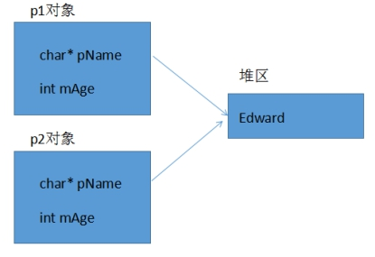

##### 深拷贝

当**类中**有**指针**，并且此指针有**动态分配**空间，**析构**函数做了**释放**处理，往往需要自定义拷贝构造函数，自行给指针动态分配空间，深拷贝。

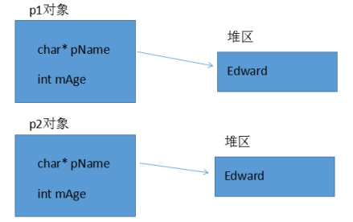

#### 构造函数的初始化列表

构造函数和其他函数不同，除了有名字，参数列表，函数体之外还有初始化列表。

构造函数初始化列表简单使用:

> 	//构造函数初始化列表方式初始化
> 	Person(int a, int b, int c):mA(a),mB(b),mC(c){ }

  **注意：**初始化成员列表(参数列表)只能在构造函数使用。

#### 类对象作为成员

在类中定义的数据成员一般都是基本的数据类型。但是**类**中的**成员**也可以是**对象**，叫做**对象成员**。

C++中对对象的初始化是非常重要的操作，当创建一个对象的时候，C++编译器必须确保调用了所有子对象的构造函数。

但是如果子对象没有默认的构造函数，或者想指定调用某个构造函数怎么办？那么是否可以在类的构造函数直接调用子类的属性完成初始化呢？但是如果子类的成员属性是私有的，我们是没有办法访问并完成初始化的。

解决办法非常简单：对于**组合类调用构造函数**，C++为此提供了专门的语法，即构造函数初始化列表。

**类组合构造顺序：**

当调用构造函数时，首**先按**各**对象成员**在类**定义**中的**顺序**依次调用它们的**构造**函数，对这些对象初始化，最后再调用本身的函数体。
也就是说，**先**调用**对象成员**的**构造**函数，**再**调用**本身**的**构造**函数。
**先构造成员，再构造自身。**

析构函数和构造函数调用顺序相反，先构造，后析构。

#### explicit关键字

C++提供了关键字explicit，**禁止**通过**构造函数**进行的**隐式转换**。声明为explicit的构造函数不能在隐式转换中使用。

> ```
> explicit MyString(int n){ }
> ```

explicit注意

explicit用于修饰构造函数,防止隐式转化。
是针对**单个参数**的构造函数(或者除了第一个参数外其余参数都有默认值的多参构造)而言。

### 动态对象创建

当我们创建数组的时候，总是需要提前预定数组的长度，然后编译器分配预定长度的数组空间，在使用数组的时，会有这样的问题，数组也许空间太大了，浪费空间，也许空间不足，所以对于数组来讲，如果能根据需要来分配空间大小再好不过。

为了解决这个普遍的编程问题，在运行中可以创建和销毁对象是最基本的要求。当然c早就提供了动态内存分配（dynamic memory allocation）,函数malloc和free可以在运行时从堆中分配存储单元。然而这些函数在C++中不能很好的运行，因为它不能帮我们完成对象的初始化工作。

##### C动态分配内存方法

为了在运行时动态分配内存，c在他的标准库中提供了一些函数,malloc以及它的变种calloc和realloc,释放内存的free,这些函数是有效的、但是原始的，需要程序员理解和小心使用。

> 问题：
> 1)程序员必须确定对象的长度。
> 2)malloc返回一个`void*`指针，C++不允许将`void*`赋值给其他任何指针，必须强转。
> 3)malloc可能申请内存失败，所以必须判断返回值来确保内存分配成功。
> 4)用户在使用对象之前必须记住对他初始化，构造函数不能显示调用初始化(构造函数是由编译器调用)，用户有可能忘记调用初始化函数。

c的动态内存分配函数太复杂，容易令人混淆，是不可接受的，C++中我们推荐使用运算符new 和 delete。

##### C++对象创建

当创建一个C++对象时会发生两件事:

1.  为对象分配内存

2.  调用构造函数来初始化那块内存

##### new

C++中解决**动态内存分配**的方案是把创建一个对象所需要的操作都结合在一个称为new的运算符里。当用**new**创建一个对象时，它就在堆里为对象**分配内存**并调用**构造函数**完成初始化。

```
Person* person1 = new Person;
delete person1;
```

new操作符能确定在调用构造函数初始化之前内存分配是成功的，所有不用显式确定调用是否成功。

只需要一个简单的表达式，它带有内置的长度计算、类型转换和安全检查。这样在堆创建一个对象和在栈里创建对象一样简单。

##### delete

new表达式的反面是delete表达式。delete表达式先调用**析构**函数，然后**释放内存**。

正如new表达式返回一个指向对象的指针一样，delete需要一个对象的地址。

delete只适用于由new创建的对象。

如果使用一个由malloc或者calloc或者realloc创建的对象使用delete,这个行为是未定义的。因为大多数new和delete的实现机制都使用了malloc和free,所以很可能没有调用析构函数就释放了内存。

如果正在删除的对象的指针是NULL,将不发生任何事，因此建议在删除指针后，立即把指针赋值为NULL，以免对它删除两次，对一些对象删除两次可能会产生某些问题。

##### 动态数组

使用new和delete在堆上创建数组

```
//创建字符数组
char* pStr = new char[100];
//创建整型数组
int* pArr1 = new int[100]; 
//创建整型数组并初始化
int* pArr2 = new int[10]{ 1, 2, 3, 4, 5, 6, 7, 8, 9, 10 };

//释放数组内存
delete[] pStr;
delete[] pArr1;
delete[] pArr2;
```

当创建一个对象数组的时候，必须对数组中的每一个对象调用构造函数，除了在栈上可以聚合初始化，必须提供一个默认的构造函数。??

如果在new表达式中使用[]，必须在相应的delete表达式中也使用[].如果在new表达式中不使用[], 一定不要在相应的delete表达式中使用[].

##### delete void *不析构

如果对一个void\*指针执行delete操作，它将不执行析构函数，这将可能成为一个程序错误，除非指针指向的内容是非常简单的。

```
void* person = new Person("john",20); // void*指针
delete person; // 不执行析构函数
```


### static静态成员

在类定义中，它的成员（包括成员变量和成员函数），这些成员可以用关键字static声明为静态的，称为静态成员。**静态成员**属于**类**，所有对象共享。

#### 静态成员变量

在一个类中，若将一个成员变量声明为static，这种成员称为静态成员变量。与一般的数据成员不同，无论建立了多少个对象，都只有一个静态数据的拷贝。静态成员变量，属于某个类，所有对象共享。

静态变量，是在**编译**阶段就**分配空间**，**对象还没有创建**时，就已经分配空间。

- **静态成员变量**必须在**类中声明**，在**类外定义**。
- 静态数据成员**属于类**不属于某个对象，在为对象分配空间中不包括静态成员所占空间。
- 静态数据成员可以通过**类名**或者**对象名**来**引用**。

#### 静态成员函数

在类定义中，前面有**static**说明的成员函数称为静态成员函数。静态成员函数使用方式和静态变量一样，同样在**对象没有创建前**，即可通过类名调用。静态成员函数主要为了访问静态变量，但是，**不能访问普通成员变量**。

静态成员函数的意义，不在于信息共享，数据沟通，而在于**管理静态数据成员**，完成对静态数据成员的封装。

-   **静态成员函数只能访问静态变量，不能访问普通成员变量**

-   静态成员函数的使用和静态成员变量一样，可以通过**类名**或者**对象名**来访问

-   静态成员函数也有访问**权限**

-   **普通成员函数**可访问静态成员变量、也可以访问非静态成员变量

#### static const常静态成员属性

如果一个类的成员，既要实现共享，又要实现不可改变，那就用 static const 修饰。

**定义静态const数据成员时，最好在类内部初始化**。

```
class Person{
public:
	// static const int mShare = 10;
	const static int mShare = 10; // 只读区，不可修改
};
```


### C++类对象模型

#### 成员变量和函数分开存储

C++类对象中的变量(**属性**)和函数(**方法**)是**分开存储**的。

-   C++中的**非静态数据成员**直接内含在**类对象**中。
-   **成员函数**虽然内含在class声明之内，却**不**出现在**对象中**。
-   每一个非内联成员函数只会诞生一份函数实例。

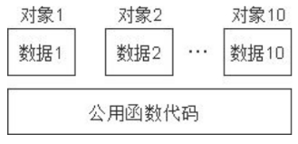

### this指针

##### this指针工作原理

C++的数据和操作也是分开存储，并且每一个非内联成员函数(non-inline member function)只会诞生一份函数实例，也就是说多个同类型的对象会共用一块代码。那么问题是：这一块代码是如何区分那个对象调用自己的呢？

C++通过提供特殊的对象指针，this指针，解决上述问题。

this指针指向被调用的成员函数所属的对象。

　 C++规定，**this指针**是隐含在对象**成员函数内**的一种指针。当一个对象被创建后，它的**每一个成员函数**都含有一个系统自动生成的**隐含指针this**，用以保存这个对象的地址，也就是说虽然我们没有写上this指针，编译器在编译的时候也是会加上的。因此this也称为"指向本对象的指针"，this指针并不是对象的一部分，**不**会**影响sizeof**(对象)的结果。

  **this指针永远指向当前对象。**

成员函数通过this指针即可知道操作的是那个对象的数据。this指针是一种隐含指针，它隐含于每个类的非静态成员函数中。this指针无需定义，直接使用即可。

注意：**静态成员函数**内部**没有this指针**，静态成员函数**不能操作非静态成员变量**。


##### this指针的使用

-   当形参和成员变量**同名**时，可用this指针来区分类内属性

-   在类的非静态成员函数中**返回对象本身**，可使用`return *this`或当前对象的指针`return this`

### const 常成员

#### const常成员函数

在普通成员函数括号后加const修饰，为常成员函数，函数内不可修改任何普通成员变量。

-   const常成员函数，成员函数体内**不可以修改**本**类中**的任何**普通成员变量**

-   除非普通成员变量类型符前用**mutable**声明，

> ```
> class Person{
> public:
> 	//在函数括号后面加上const修饰，成员变量不可修改,除了mutable变量
> 	void sonmeOperate() const{ // const常成员函数
> 		//this->mAge = 200; //非mutable变量不可修改
> 		this->mID = 10; // mutable变量
> 	}
> private:
> 	int mAge;
> 	mutable int mID; // mutable变量
> };
> ```

#### const修饰对象(常对象)

-   **常对象只能调用const常成员函数**

-   常对象**可访问** const 或非 const **数据成员**，**不能修改成员属性**，除非成员用mutable修饰

> ```
> const Person person; // 常对象
> ```

### 友元

类的主要特点之一是数据隐藏，即类的私有成员无法在类的外部(作用域之外)访问。但是，有时候需要在类的**外部访问类的私有成员**，怎么办？

解决方法是使用友元函数，友元函数是一种特权函数，C++允许这个特权函数访问私有成员。

比如你的家，有客厅，有你的卧室，那么你的客厅是Public的，所有来的客人都可以进去，但是你的卧室是私有的，也就是说只有你能进去，但是呢，你也可以允许你的闺蜜好基友进去。

#### 友元语法

-   friend关键字只出现在声明处
-   一个**全局函数**、某个类中的**成员函数**、甚至**整个类**都可声明为友元
-   友元函数不是类的成员，不带this指针
-   友元函数**可访问**对象任意成员属性，包括**私有属性**

#### 友元全局函数

将全局函数声明为友元的写法如下：

```
friend  返回值类型  函数名(参数表);
```

```
//全局函数
void CleanBedRoom(Building& building){}

// 声明友元
class Building{
	//全局函数做友元函数
	friend void CleanBedRoom(Building& building);
public:
	Building();
private:
    int price;
}
```


#### 友元成员函数

将其他类的成员函数声明为友元的写法如下：

```
friend  返回值类型  其他类的类名::成员函数名(参数表);
```

但是，不能把其他类的私有成员函数声明为友元。

```
class Building; // 前向声明，，以便后面的类使用
//类
class MyFriend{
public:
	//成员函数
	void LookAtBedRoom(Building& building);
};

// 声明友元
class Building{
	//声明成员函数做友元函数
	friend void MyFriend::LookAtBedRoom(Building& building);
public:
	Building();
private:
    int price;
}
```


#### 友元类

一个类 A 可以将另一个类 B 声明为自己的友元，类 B 的所有成员函数就都可以访问类 A 对象的私有成员。在类定义中声明友元类的写法如下：

```
friend class 类名;
```

```
//友元类
class MyFriend{
public:
	Building bld;
	void ModifyPrice(){
        bld.price += 1000;  //因MyFriend是Building的友元类，故此处可以访问其私有成员
    }
};

// 声明友元
class Building{
	//友元类
	friend class MyFriend;
public:
	Building();
private:
    int price;
}
```

 [友元类注意]

2. 友元关系是**单向**的，类A是类B的朋友，但类B不一定是类A的朋友。
2. 友元关系**不能被继承**。
3. 友元关系**不具有传递性**。类B是类A的朋友，类C是类B的朋友，但类C不一定是类A的朋友。


## 运算符重载

### 运算符重载基本概念

运算符重载，就是对已有的运算符重新进行定义，赋予其另一种功能，以适应不同的数据类型。

运算符重载(operator overloading)只是一种”语法上的方便”,也就是它只是另一种函数调用的方式。

在C++中，可以定义一个处理类的新运算符。这种定义很像一个普通的函数定义，只是函数的名字由**关键字operator**及其紧跟的运算符组成。差别仅此而已。它像任何其他函数一样也是一个函数，当编译器遇到适当的模式时，就会调用这个函数。

**运算符重载语法：**

定义重载的运算符就像定义函数，只是该函数的名字是operator@,这里的@代表了被重载的运算符。函数的参数中参数个数取决于两个因素。

- 运算符是一元(一个参数)的还是二元(两个参数)；
- 运算符被定义为**全局函数**(对于一元是一个参数，对于二元是两个参数)，还是**成员函数**(对于一元没有参数，对于二元是一个参数–此时该**类的对象**用作**左参**数)

### 可重载的运算符

几乎C中所有的运算符都可以重载，但运算符重载的使用时相当受限制的。特别是不能使用C中当前没有意义的运算符(例如用\*\*求幂)不能改变运算符优先级，不能改变运算符的参数个数。

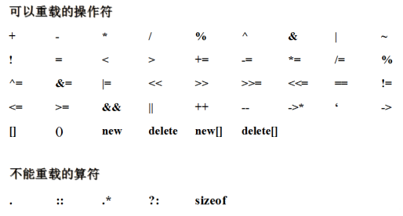

### 自增自减(++或--)运算符重载

重载的++和--运算符有点让人不知所措，因为我们总是希望能根据它们出现在所作用对象的前面还是后面来调用不同的函数。解决办法很简单，例如当编译器看到++a(**前置++**)，它就调用`operator++(a)`,当编译器看到a++（**后置++**），它就会去调用`operator++(a,int)`

#### 前置++

前置++a形式，对象先++或--，返回当前对象，返回的是新对象。

```
 public:
 //重载前置++
	Complex& operator++(){
		mA++;
		mB++;
		return *this;
	}
```

#### **后置++**

后置a++形式是先返回，然后对象++或者--，返回的是对象的原值。

```
public:
//重载后置++
	Complex operator++(int){	
		Complex temp; // 后置需要临时对象
		temp.mA = this->mA;
		temp.mB = this->mB;
		mA++;
		mB++;
		return temp;
	}
```

优先使用++和--的标准形式，优先调用前置++。

如果定义了++a，也要定义a++，递增操作符比较麻烦，因为他们都有前缀和后缀形式，而两种语义略有不同。重载operator++和operator--时应该模仿他们对应的内置操作符。

调用代码时候，要优先使用前置形式，除非确实需要后缀形式返回的原值，前缀和后缀形式语义上是等价的，输入工作量也相当，只是效率经常会略高一些，由于前置形式少创建了一个临时对象。


### 指针运算符(*或-&gt;)重载

```
class SmartPointer{
public:
	SmartPointer(Person* person){
		this->pPerson = person;
	}
//重载指针的->操作符
	Person* operator->(){
		return pPerson;
	}
//重载指针的*操作符
	Person& operator*(){
		return *pPerson;
	}
	~SmartPointer(){
		if (pPerson != NULL){
			delete pPerson;
		}
	}
public:
	Person* pPerson;
};
```


### 赋值(=)运算符重载

```
public:
	//重载赋值运算符
	Person& operator=(const Person& person){
		this->mID = person.mID;
		this->mAge = person.mAge;
		return *this;
	}
```

```
void test01(){
	Person person1(10, 20);
	Person person2 = person1; //调用拷贝构造
	//person2从已有的person1来初始化创建，调用拷贝构造函数
	
	person2 = person1; //调用重载operator=函数
	//person2已经创建，不需要再调用构造函数，调用重载的赋值运算符
}
```

如果没有重载赋值运算符，编译器会**自动**创建默认的赋值运算符**重载**函数。行为类似默认拷贝构造，进行**简单值拷贝**。


### 等于和不等于(==或!=)运算符重载

```
public:
//重载==号操作符
	bool operator==(const Complex& complex){
		if (strcmp(this->pName,complex.pName) == 0 && 
		    this->mID == complex.mID && 
			this->mAge == complex.mAge){
			return true;
		}
		return false;
	}
//重载!=操作符
	bool operator!=(const Complex& complex){
		if (strcmp(this->pName, complex.pName) != 0 || 
		    this->mID != complex.mID || 
			this->mAge != complex.mAge){
			return true;
		}
		return false;
	}
```


### 函数调用符号()重载

```
class Complex{
public:
	int operator()(int x,int y){
		return x + y;
	}
};
void test01(){
	Complex complex;
	// 对象当做函数来调用 // 重载()
	cout << complex(10, 20) << endl; // 10+20
}
```


### <<左移运算符重载

声明友元，友元函数是一个全局函数，友元函数可以访问某个类私有数据。

案例: 重载左移操作符(<<),使得cout可以输出对象。

```
//可以同时重载不同类对象类型
// 重载<<全局函数
ostream& operator<<(ostream& os, Person& person){
	os << "ID:" << person.mID << " Age:" << person.mAge;
	return os;
}

class Person{
	friend ostream& operator<<(ostream& os, Person& person); // 声明友元
private:
	int mID;
	int mAge;
}
```


### 不要重载&&或||

不能重载operator&& 和 operator|| 的原因是，无法实现短路规则。说得更具体一些，内置版本版本特殊之处在于：内置版本的&&和||首先计算左边的表达式，如果这完全能够决定结果，就无需计算右边的表达式了，而且能够保证不需要。我们都已经习惯这种方便的特性了。

### 运算符和结合性


### 符号重载总结

- `=, [], () 和 ->` 操作符只能通过**成员函数**进行重载 
- `<< 和 >>`只能通过**全局函数**配合**友元**函数进行重载
- 不要重载 && 和 || 操作符，因为无法实现**短路**规则

常规建议


## 继承和派生

### 继承概述

#### 继承基本概念

C++最重要的特征是代码重用，通过继承机制可以利用已有的数据类型来定义新的数据类型，新的类不仅拥有旧类的成员，还拥有新定义的成员。

一个B类继承于A类，或称从类A派生类B。这样的话，类A成为基类（父类）， 类B成为派生类（子类）。

派生类中的成员，包含两大部分：

- 一类是从基类继承过来的，一类是自己增加的成员。
- 从基类继承过过来的表现其共性，而新增的成员体现了其个性。

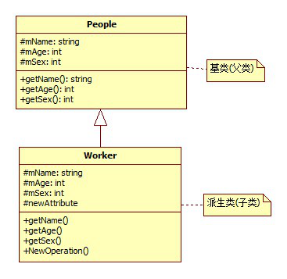

#### 派生类定义

**派生类定义格式：**

```
Class 派生类名 :  继承方式 基类名 {
     //派生类新增的数据成员和成员函数
}
```

三种继承方式：

- public ： 公有继承
- private ： 私有继承
- protected ： 保护继承

从继承源上分：

- 单继承：指每个派生类只直接继承了一个基类的特征
- 多继承：指多个基类派生出一个派生类的继承关系,多继承的派生类直接继承了不止一个基类的特征

### 派生类访问控制

派生类继承基类，派生类拥有基类中全部成员变量和成员方法（**除了构造和析构**之外的成员方法），但是在派生类中，继承的成员并不一定能直接访问，不同的继承方式会导致不同的访问权限。

派生类的访问权限规则如下：

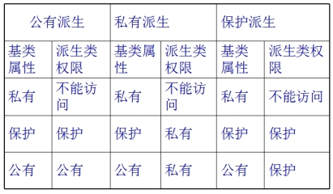

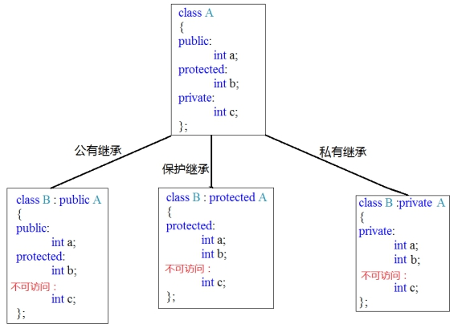

### 继承中的构造和析构

#### 对象构造和析构的调用原则

**继承中的构造和析构**

- 子类对象在创建时会首**先**调用**父类**的**构造**函数
- 父类构造函数执行完毕后，才会调用**子类**的**构造**函数
- 当**父类构造**函数**有参数**时，需要在**子类初始化列表**(参数列表)中**显示调用父类构造**函数
- 析构函数调用顺序和构造函数相反

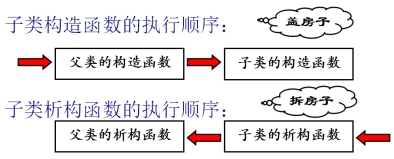


**继承与组合混搭的构造和析构顺序**

==父类->对象成员->子类==


先构造父类，如果有嵌套类则优先构造嵌套类，最后构造当前最后子类

### 继承中同名成员的处理方法

- 当子类成员和父类成员同名时，子类依然从父类继承同名成员（占据空间），但是**被隐藏**了
- 如果子类有成员和父类同名，子类访问其成员默认访问子类的成员(本作用域，就近原则)，**子类**同名**覆盖父类**（重名覆盖，包括重载也被覆盖隐藏？？）
- 在子类通过类名限定符声明作用域`父类::`调用同名父类成员(在派生类中要使用基类的同名成员，显式使用类名限定符)

子类中重新定义基类中的一个**重载**函数，原来基类的函数将被隐藏，（重载）

### 不能继承的函数

不是所有的函数都能自动从基类继承到派生类中。

构造函数和析构函数用来处理对象的创建和析构操作，构造和析构函数只知道对它们的特定层次的对象做什么，也就是说**构造**函数和**析构**函数**不能被继承**，必须为每一个特定的派生类分别创建。

另外**operator=**也不能被继承，因为它完成类似构造函数的行为。也就是说尽管我们知道如何由=右边的对象如何初始化=左边的对象的所有成员，但是这个并不意味着对其派生类依然有效。

在继承的过程中，如果没有创建这些函数，编译器会**自动生成**它们。（重名覆盖，包括重载也被覆盖隐藏）

### 继承中的静态成员特性

静态成员函数和非静态成员函数的共同点:

- 他们都**可以被继承到**派生类中。
- 如果重新定义一个静态成员函数，所有在基类中的**其他重载**函数会**被隐藏**。（重名覆盖，包括重载也被覆盖隐藏）
- 如果我们改变基类中一个函数的特征，所有使用该函数名的基类版本都会被隐藏。

静态成员函数不能是虚函数（virtual function）.


### 多继承

#### 多继承概念

我们可以从一个类继承，我们也可以能同时从多个类继承，这就是多继承。但是由于多继承是非常受争议的，从多个类继承可能会导致**函数**、**变量**等**同名**导致较多的歧义。

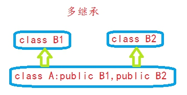

多继承会带来一些**二义性**的问题， 如果两个基类中有同名的函数或者变量，通过`类名::`显式指定调用哪个基类的版本。

#### 菱形继承和虚继承

两个派生类继承同一个基类而又有某个类同时继承者两个派生类，这种继承被称为菱形继承。

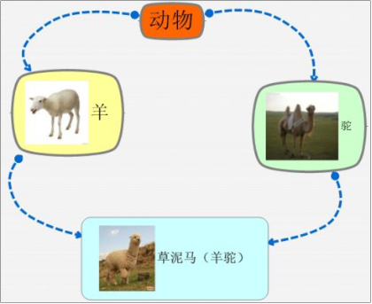

这种继承所带来的问题：

1. 羊继承了动物的数据和函数，鸵同样继承了动物的数据和函数，当草泥马调用函数或者数据时，就会产生**二义性**。
2. 草泥马继承自动物的函数和数据**重复继承**了两份数据，其实我们只需要一份就可以。

对于这种菱形继承所带来的两个问题，C++为我们提供了一种方式，采用**虚继承**方式**虚基类**。

> class BigBase{};
> class Base1 : ==virtual== public BigBase{};
> class Base2 : ==virtual== public BigBase{};
> class Derived : public Base1, public Base2{};

```
class BigBase{};
class Base1 : virtual public BigBase{};
class Base2 : virtual public BigBase{};
class Derived : public Base1, public Base2{};
```

以上程序Base1 ，Base2采用**虚继承**方式继承BigBase,那么BigBase被称为虚基类。

通过`virtual`**虚继承**解决了**菱形继承**所带来的二义性问题。

#### 虚继承实现原理

当使用虚继承时，虚基类是被共享的，也就是在继承体系中无论被继承多少次，对象内存模型中均只会出现一个虚基类的子对象（这和多继承是完全不同的）。即使共享虚基类，但是必须要有一个类来完成基类的初始化（因为所有的对象都必须被初始化，哪怕是默认的），同时还不能够重复进行初始化，那到底谁应该负责完成初始化呢？

C++标准中选择在**每一次继承子类**中都**必须**书**写初始化**语句（因为每一次继承子类可能都会用来定义对象），

但是虚基类的初始化是由**最后的子类**完成**初始化**，**其他**的初始化语句都**不会调用**。

```
class BigBase{
public:
	BigBase(int x){mParam = x;}
public:
	int mParam;
};

class Base1 : virtual public BigBase{ // 虚继承
public:
	Base1():BigBase(10){ } //不立即调用BigBase构造
};

class Base2 : virtual public BigBase{ // 虚继承
public:
	Base2():BigBase(10){ } //不立即调用BigBase构造
};

class Derived : public Base1, public Base2{ // 多继承
public:
	Derived():BigBase(10){ } //调用BigBase构造
};
//每一次继承子类中都必须书写初始化语句，虽然不一定会被调用
```

**注意：**

工程开发中真正意义上的多继承是几乎不被使用，因为多重继承带来的代码复杂性远多于其带来的便利，多重继承对代码维护性上的影响是灾难性的，在设计方法上，任何多继承都可以用单继承代替。


## 多态

### 多态基本概念

多态是面向对象程序设计语言中数据封装和继承之外的第三个基本特征。

多态性(polymorphism)提供**接口**与具体**实现**之间的另一层**隔离**。多态性改善了代码的可读性和组织性，同时也使创建的程序具有可扩展性，项目不仅在最初创建时期可以扩展，而且当项目在需要有新的功能时也能扩展。

C++支持**编译时**多态(静态多态)和**运行时**多态(动态多态)，**运算符重载**和**函数重载**就是==**编译时**多态==，而**派生类**和**虚函数**实现==**运行时**多态==，C++动态多态性是通过**虚函数**来实现的。

静态多态和动态多态的区别就是函数地址是早绑定(静态联编)还是晚绑定(动态联编)。如果函数的调用，在**编译阶段**就可以确定函数的调用地址，并产生代码，就是静态多态(编译时多态)，就是说地址是早绑定的。而如果函数的调用地址不能编译不能在编译期间确定，而需要在运行时才能决定，这这就属于晚绑定(动态多态,运行时多态)。

向上类型转换:对象可以作为自己的类或者作为它的基类的对象来使用。还能通过基类的地址来操作它。取一个对象的地址(指针或引用)，并将其作为基类的地址来处理，这种称为向上类型转换。

也就是说：父类引用或指针可以指向子类对象，通过**父类**的**指针**或**引用**来操作**子类对象**。


### 动态多态原理

首先，我们看看编译器如何处理虚函数。当编译器发现我们的类中有虚函数的时候，编译器会创建一张**虚函数表**，把**虚函数的函数入口**地址放到虚函数表中，并且在**类中**秘密增加一个**指向对象的虚函数表**的**指针vpointer**(缩写vptr)。在多态调用的时候，根据vptr指针，找到虚函数表来实现动态绑定。

在编译阶段，编译器秘密增加了一个vptr指针，但是此时vptr指针并没有初始化指向虚函数表(vtable),什么时候vptr才会指向虚函数表？在对象构建的时候，也就是在对象初始化调用构造函数的时候。编译器首先默认会在我们所编写的每一个构造函数中，增加一些vptr指针初始化的代码。如果没有提供构造函数，编译器会提供默认的构造函数，那么就会在默认构造函数里做此项工作，初始化vptr指针，使之指向本对象的虚函数表。

起初，子类继承基类，子类继承了基类的vptr指针，这个vptr指针是指向基类虚函数表，当子类调用构造函数，使得子类的vptr指针指向了子类的虚函数表。

### 多态的成立条件

- 有继承

- 子类**重写父类虚函数**方法

  a\) 返回值，函数名字，函数参数，必须和父类完全一致(析构函数除外)

  b\) 子类中virtual关键字可写可不写，建议写

- 类型兼容，父类指针，父类引用 指向 子类对象

### 虚函数

C++**动态多态性**是通过虚函数来实现的，**虚函数**允许子类（派生类）**重新定义**父类（基类）**成员函数**，称为覆盖，或者称为**重写**(override)。

对于特定的函数进行动态绑定，C++要求在基类中声明这个函数的时候使用virtual关键字,动态绑定也就对virtual**虚函数**起作用。

- 为创建一个需要动态绑定的**虚成员函数**，可以简单在这个**函数声明**前面加上**virtual**关键字，定义时候不需要
- 如果一个成员函数被声明为virtual，那么在所有派生类中它都是virtual虚函数，(virtual具有传递性)
- 在派生类中virtual函数的重定义称为重写(override)
- Virtual关键字只能修饰成员函数
- **构造函数不能为虚函数**

```
class Animal{
public:
// 虚函数
	virtual void speak(){
		cout << "动物在唱歌..." << endl;
	}
};
```

 **注意:** 仅需要在基类中声明一个函数为virtual.调用所有匹配基类声明行为的派生类函数都将使用虚机制。虽然可以在派生类声明前使用关键字virtual(这也是无害的)，但这个样会使得程序显得冗余和杂乱。


### 纯虚函数(抽象类）

在设计时，常常希望基类仅仅作为其派生类的一个公共接口，而不希望用户实际的创建一个基类的对象。同时创建一个纯虚函数允许接口中放置成员原函数，而不一定要提供一段可能对这个函数毫无意义的代码。

如果类中出现了**纯虚函数**(pure virtual function)，那么这个类是**抽象类**(abstract class)。

- 纯虚函数使用关键字==virtual==，并在其后面加上===0==。
- **抽象类不能实例化对象**。
- 当继承一个抽象类的时候，必须实现所有的纯虚函数，否则由抽象类派生的类也是一个抽象类。
- Virtual void fun() = 0;告诉编译器在vtable中为函数保留一个位置，但在这个特定位置不放地址。

```
// 抽象基类
class People{
public:
// 纯虚函数
	virtual void showName() = 0;
}
```

 **建立公共接口目的**是为了将子类公共的操作抽象出来，可以通过一个公共接口来操纵一组类，且这个公共接口不需要事先(或者不需要完全实现)。可以创建一个公共类。

#### 纯虚函数和多继承

多继承带来了一些争议，但是接口继承可以说一种毫无争议的运用了。

绝大数面向对象语言都不支持多继承，但是绝大数面向对象对象语言都支持接口的概念，**C++**中**没有接口**的概念，但是可以通过纯虚函数实现接口。

接口类中只有函数原型定义，没有任何数据定义。

多重继承接口不会带来二义性和复杂性问题。接口类只是一个功能声明，并不是功能实现，子类需要根据功能说明定义功能实现。

注意:除了析构函数外，其他声明都是纯虚函数。？？


### 虚析构函数

#### 虚析构函数作用

虚析构函数是为了解决基类的指针指向派生类对象，并**用基类的指针删除派生类对象**。

```
class People{
public:
// 虚析构函数
	virtual ~People(){
		cout << "析构函数 People!" << endl;
	}
};
```

#### 纯虚析构函数

纯虚析构函数在C++中是合法的，但是在使用的时候有一个额外的限制：必须为纯虚析构函数提供一个函数体。

```
class B{
public:
//纯析构函数
	virtual ~B() = 0;
};
```

纯虚析构函数和非纯析构函数之间唯一的不同之处在于**纯虚析构函数**使得基类是**抽象类**，不能创建基类的对象。(如果类中出现了 纯虚函数，那么这个类是抽象类，抽象类 不可实例化对象)

如果类的目的不是为了实现多态，作为基类来使用，就不要声明虚析构函数???，反之，则应该为类声明虚析构函数。

### 重载 重定义 重写 

- 重载，同一作用域的同名函数
  1. 同一个作用域
  2. 参数个数，参数顺序，参数类型不同
  3. 和函数返回值，没有关系
  4. const也可以作为重载条件 //do(const Teacher& t){} do(Teacher& t){}

- 重定义（隐藏）
  1. 有继承
  2. 子类（派生类）重新定义父类（基类）的**同名成员**（非virtual函数）

- 重写（覆盖）
  1. 有继承
  2. 子类（派生类）重写父类（基类）的**virtual虚函数**
  3. 函数返回值，函数名字，函数参数，必须和基类中的虚函数一致

```
class A{
public:
	//同一作用域下，func1函数重载
	void func1(int a){}
	void func1(int a,int b){}
	void func2(){}
	virtual void func3(){} // 虚函数
};

class B : public A{ // 继承
public:
	//重定义基类的func2,隐藏了基类的func2方法
	void func2(){}
	//重写基类的func3virtual虚函数，也可以覆盖基类func3
	virtual void func3(){}
};
```


### 类成员的指针

#### 指向成员变量的指针

**定义格式**

```
<数据类型> <类名>::*<指针名>
int A::*pPram;
```

> 类名`::`限定

**赋值/初始化**

```
<数据类型> <类名>::*<指针名> = &<类名>::<非静态数据成员>
int A::*pParam = &A::param;
```

> &取地址+类名`::`限定

**解引用**

```
<类对象名>.*<非静态数据成员指针>
<类对象指针>->*<非静态数据成员指针>
     a.*pParam; //对象
     a->*pParam; //对象指针
```

> 通过对象/对象指针调用

示例：

```
class A{
public:
	A(int param){
		mParam = param;
	}
public:
	int mParam;
};

void test(){
	A a1(100);
	int* p1 = &a1.mParam;
	cout << "*p1:" << *p1 << endl;
	
	// 定义并初始化指向成员变量的指针
	int A::*p2 = &A::mParam;
	cout << "a1.*p2:" << a1.*p2 << endl;
	
	A* a2 = new A(200);	
	cout << "a2->*p2:" << a2->*p2 << endl;
}
```


#### 指向成员函数的指针

定义指向成员变量的指针

```
   <返回类型> (<类名>::*<指针名>)（<参数列表>）
   例如: void (A::*pFunc)(int,int);
```

赋值/初始化

```
   <返回类型>（<类名>::*<指针名>）（<参数列表>）  = &<类名>::<非静态数据函数>
   例如: void (A::pFunc)(int,int) = &A::func;
```

解引用

```
   （<类对象名>.*<非静态成员函数>）（<参数列表>）
   （<类对象指针>->*<非静态成员函数>）（<参数列表>）
   例如: A a; 
        (a.*pFunc)(10,20); 
        (a->*pFunc)(10,20);
```

示例：

```
class A{
public:
	int func(int a,int b){
		return a + b;
	}
};

void test(){
	A a1;
	A* a2 = new A;

	//定义并初始化成员函数指针
	int(A::*pFunc)(int, int) = &A::func;
	//指针解引用
	cout << "(a1.*pFunc)(10,20):" << (a1.*pFunc)(10, 20) << endl;
	cout << "(a2->*pFunc)(10,20):" << (a2->*pFunc)(10, 20) << endl;
}
```


#### 指向静态成员的指针

- 指向类**静态数据成员**的指针
  指向静态数据成员的指针的定义和使用与**普通指针**相同，仅需加类名`::`限定，在定义时无须和类相关联，在使用时也无须和具体的对象相关联。
- 指向类**静态成员函数**的指针
  指向静态成员函数的指针的定义和使用与**普通指针**相同，仅需加类名`::`限定，在定义时无须和类相关联，在使用时也无须和具体的对象相关联。

示例：

```
class A{
public:
	static void dis(){ // 向类静态成员函数
		cout << data << endl;
	}
	static int data; // 类静态数据成员
};
int A::data = 100; // 类外初始化静态数据成员

void test(){
// 指向类静态数据成员的指针
	int *p = &A::data;
	cout << *p << endl;
// 指向类静态成员函数的指针
	void(*pfunc)() = &A::dis;
	pfunc();
}
```


## C++模板

### 模板概论

**泛型编程（Generic Programming）**是一种编程范式，通过将类型参数化来实现在同一份代码上操作多种数据类型，泛型是一般化并可重复使用的意思。泛型编程最初诞生于C++中，目的是为了实现C++的STL（标准模板库）。

**模板（template）**是泛型编程的基础，一个模板就是一个创建类或函数的蓝图或公式。例如，当使用一个vector这样的泛型类型或者find这样的泛型函数时，我们提供足够的信息，将蓝图转换为特定的类或函数。

C++提供两种模板机制:==**函数模板**==和==**类模板**==

**总结：**

- 模板把函数或类要处理的**数据类型参数化**，表现为参数的多态性，成为类属。
- 模板用于表达逻辑结构相同，但具体数据元素类型不同的数据对象的通用行为。


### 函数模板

C++所谓函数模板(function template.)，实际上是建立一个通用函数，其函数类型和形参**类型**不具体指定，用一个虚拟的类型来代表。这个通用函数就成为函数模板。在调用函数时系统会根据实参的类型来取代模板中的虚拟类型，从而实现不同函数的功能。

#### **类型参数**

一个模板**类型参数（type parameter）**表示的是一种类型。我们可以将类型参数看作类型说明符，就像内置类型或类类型说明符一样使用。类型参数前必须使用关键字**class** 或 **typename**：

```
//class 和 typename都是一样的，用哪个都可以
template<class T>
void MySwap(T& a,T& b){
	T temp = a;
	a = b;
	b = temp;
}
```

关键字typename和class是一样的作用，但显然typename比class更为直观，它更清楚地指出随后的名字是一个类型名。

编译器用模板类型实参为我们**实例化（instantiate）**特定版本的函数，一个版本称做模板的一个**实例（instantiation）**。当我们调用一个函数模板时，编译器通常用函数实参来为我们推断模板实参。当然如果函数没有模板类型的参数，则我们需要特别指出来：

```
int a = 10, b = 20;
cout << function(a,b) << endl;     // 编译器根据函数实参推断模板实参
cout << function<int,int>(a,b) << endl;   // <int>指出模板参数为int
```

用模板是为了实现泛型，可以减轻编程的工作量，增强函数的重用性。

#### **非类型参数**

在模板中还可以定义**非类型参数（nontype parameter）**，一个非类型参数表示一个值而非一个类型。我们通过一个特定的类型名而非关键字class或typename来指定非类型参数：

```
#include <functional>
#include <iostream>
using namespace std;

// 整形模板
template <unsigned M, unsigned N> 
void add() {
    cout << M + N << endl;
}

// 指针
template <const char *C> 
void func1(const char *str) {
    cout << C << " " << str << endl;
}

// 引用
template <char (&R)[9]> 
void func2(const char *str) {
    cout << R << " " << str << endl;
}

// 函数指针
template <void (*f)(const char *)> 
void func3(const char *c) {
    f(c);
}

// 全局函数
void print_str(const char *c) {
    cout << c << endl;
}

// 全局变量，具有静态生存期
char arr1[9] = "template-str";

int main() {
    add<10, 20>();
    func1<arr1>("pointer");
    func2<arr1>("reference");
    func3<print_str>("template function pointer");
    return 0;
}
```

当实例化时，非类型参数被一个用户提供的或编译器推断出的值所替代。一个非类型参数可以是一个整型，或者是一个指向对象或函数的指针或引用：绑定到整形（非类型参数）的实参必须是一个**常量表达式**，绑定到指针或引用（非类型参数）的实参必须具有**静态的生存期**（比如全局变量），不能把**普通局部变量** 或 **动态对象**绑定到指针或引用的非类型形参。

#### 函数模板和普通函数调用规则

- C++编译器优先考虑普通函数
- 可以通过空模板实参列表的语法限定编译器只能通过模板匹配
- 函数模板可以像普通函数那样可以被重载
- 如果函数模板可以产生一个更好的匹配，那么选择模板

#### 函数模板和普通函数区别

调用函数模板，**严格匹配类型**

- 函数模板**不允许**自动**隐式类型转化**？？
- 普通函数能够自动进行类型转化


### 类模板

#### 类模板基本概念

有时，有两个或**多个类**，其功能是相同的，仅仅是**数据类型不同**。
**类模板**（class template）用于实现类所需数据的**类型参数化**，用来生成类的蓝图。

#### 函数模板与类模板的异同

与函数模板的不同之处是，函数模板的**实例化**是由编译程序在处理函数调用时**自动**完成的，**类模板不能自动推导模板参数类型**，所以类模板的**实例化**必须由程序员在程序中**显式地**提供模板实参。即函数模板允许隐式调用和显式调用而类模板只能显示调用。

与函数模板一样，类模板参数可以是**类型参数**，也可以是**非类型参数**。

#### 类模板类内实现

```
//类模板 类内实现
template<class NameType, class AgeType>
class Person{
public:
	Person(NameType name, AgeType age){
		this->mName = name;
		this->mAge = age;
	}
	void showPerson(){
		cout << "name: " << this->mName << " age: " << this->mAge << endl;
	}
public:
	NameType mName;
	AgeType mAge;
};

void test01(){
	//Person P1("小明",18); // 类模板不能进行类型自动推导 
	Person<string, int>P1("小明", 18);// 类模板
	P1.showPerson();
}
```

#### 类模板类外实现

与其他类一样，我们既可以在类模板内部，也可以在类模板外部定义其成员函数。定义在类模板之外的成员函数必须以关键字template开始，后接类模板参数列表。

默认情况下，对于一个实例化了的类模板，其成员函数只有在使用时才被实例化。如果一个成员函数没有被使用，则它不会被实例化。

每个类外实现再次加上template声明

```
// 类模板声明
template<class T1, class T2>
class Person{
public:
	Person(T1 name, T2 age);
	void showPerson();
public:
	T1 mName;
	T2 mAge;
};


//类模板类外实现
template<class T1, class T2>
Person<T1, T2>::Person(T1 name, T2 age){
	this->mName = name;
	this->mAge = age;
}
//类外实现
template<class T1, class T2>
void Person<T1, T2>::showPerson(){
	cout << "Name:" << this->mName << " Age:" << this->mAge << endl;
}

void test(){
	Person<string, int> p("Obama", 20);
	p.showPerson();
}
```


#### **类模板和友元**

当一个类包含一个友元声明时，类与友元各自是否是模板是相互无关的。如果一个类模板包含一个非模板的友元，则友元被授权可以访问所有模板的实例。如果友元自身是模板，类可以授权给所有友元模板的实例，也可以只授权给特定实例。

```
// 前置声明，在将模板的一个特定实例声明为友元时要用到
template<typename T> class Pal;

// 普通类
class C {
	friend class Pal<C>;  // 用类C实例化的Pal是C的一个友元
	template<typename T> friend class Pal2; //Pal2所有实例都是C的友元;无须前置声明
};

// 模板类
template<typename T> class C2 {
	// C2的每个实例将用相同类型实例化的Pal声明为友元,一对一关系
	friend class Pal<T>;
	// Pal2的所有实例都是C2的每个实例的友元，不需要前置声明
	template<typename X> friend class Pal2; 
	// Pal3是普通非模板类，它是C2所有实例的友元
	friend class Pal3;
};
```

#### **类模板的static成员**

类模板可以声明static成员。**类模板的每一个实例都有其自己独有的static成员对象**，对于给定的类型X，所有class_name< X >类型的对象共享相同的一份static成员实例。

```
template<typename T>
class Foo {
public:
	void print();
	//...其他操作
private:
	static int i;  // 静态成员
};

template<typename T>
void Foo<T>::print()
{
	cout << ++i << endl;
}

template<typename T>
int Foo<T>::i = 10;  // 初始化为10

int main()
{
	Foo<int> f1;
	Foo<int> f2;
	Foo<float> f3;
	f1.print();   // 输出11
	f2.print();   // 输出12
	f3.print();   // 输出11
	return 0;
}
```

我们可以通过类类型对象来访问一个类模板的static对象，也可以使用作用域运算符（::）直接访问静态成员。类似模板类的其他成员函数，一个static成员函数也只有在使用时才会实例化。

#### 类模板做函数参数

```
//类模板做函数参数
void DoBussiness( Person<string,int>& p ){
	p.mAge += 20;
	p.mName += "_vip";
	p.PrintPerson();
}

void test01(){
	Person<string, int> p("John", 30);// 类模板
	DoBussiness(p);//类模板做函数参数
}
```

#### 类模板派生普通类

子类实例化的时候需要具体化的父类，子类需要知道父类的具体类型是什么样的,这样C++编译器才能知道给子类分配多少内存

继承类模板的时候，必须要确定基类类模板的类型

```
//类模板
template<class T>
class MyClass{
public:
	MyClass(T property){
		this->mProperty = property;
	}
public:
	T mProperty;
};

//普通派生类
class SubClass : public MyClass<int>{ // 父类类模板具体类型
public:
	SubClass(int b) : MyClass<int>(20){ // 初始化父类
		this->mB = b;
	}
public:
	int mB;
};
```

#### 类模板派生类模板

继承类模板的时候，必须要确定基类类模板的类型

```
//父类类模板
template<class T>
cBase{
public:
	T m;
};

//子类类模板
template<class T >
class Child2 : public Base<double>{ //继承类模板的时候，必须要确定基类的大小
public:
	T mParam;
};

void test02(){
	Child2<int> d2; //类模板
}
```


### 模板实现原理

#### c++编译过程

hello.cpp程序是高级c语言程序，这种程序易于被人读懂。为了在系统上运行hello.c程序，每一条c语句都必须转化为低级的机器指令。然后将这些机器指令打包成可执行目标文件格式，并以二进制形式存储于磁盘中。

预处理(Pre-processing) -&gt; 编译(Compiling) -&gt;汇编(Assembling) -&gt; 链接(Linking)

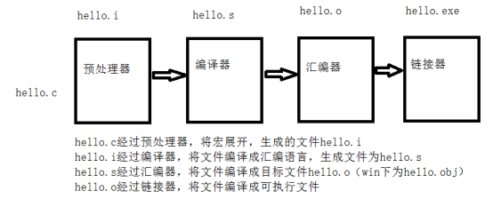

#### 模板实现机制

**函数模板机制结论：**

- 编译器并**不是**把函数模板处理成**能够处理任何类型**的函数，函数模板通过具体类型产生不同的函数
- 编译器会对函数模板进行**两次编译**，在**声明**的地方**对模板代码本身进行编译**，在**调用**的地方**对参数替换后的代码进行编译**。

### 模板的局限性

```
template<class T>
void f(T a, T b)
{ … }
```

如果代码实现时定义了赋值操作 a = b，但是T为数组，这种假设就不成立了

同样，如果里面的语句为判断语句 if(a&gt;b),但T如果是结构体，该假设也不成立，另外如果是传入的数组，数组名为地址，因此它比较的是地址，而这也不是我们所希望的操作。

总之，编写的模板函数很可能无法处理某些类型，另一方面，有时候通用化是有意义的，但C++语法不允许这样做。为了解决这种问题，可以提供模板的重载，为这些特定的类型提供具体化的模板。


## C++类型转换

类型转换(cast)是将一种数据类型转换成另一种数据类型。例如，如果将一个整型值赋给一个浮点类型的变量，编译器会暗地里将其转换成浮点类型。

转换是非常有用的，但是它也会带来一些问题，比如在转换指针时，我们很可能将其转换成一个比它更大的类型，但这可能会破坏其他的数据。

一般情况下，尽量少的去使用类型转换，除非用来解决非常特殊的问题。 

标准C++提供了一个**显式**的**类型转换**的语法，来替代旧的C风格的类型转换。

### 静态转换(static\_cast)

1. `static_cast`**常**用于**基本数据类型**之间的转换

如把int转换成char，把char转换成int。

```
//基础数据类型转换
void test01(){
	char a = 'a';
	double b = static_cast<double>(a);
}
```

2. `static_cast`**也可以**用于类层次结构中基类（**父类**）和派生类（**子类**）之间**指针**或**引用**的转换。
   实际一般用`dynamic_cast`更安全。

- `static_cast`向上类型转换（把**子类**的指针或引用**转**换成**父类**）是**安全**的；
- `static_cast`向下类型转换（把**基类**指针或引用转换成**子类**），没有动态类型检查，所以是**不安全**的（不能检查出错误类型转化）。

```
//继承关系 指针 互相转换
void test02(){
	//继承关系指针转换
	Animal* animal01 = NULL;
	Dog* dog01 = NULL;
	//子类指针转成父类指针,安全
	Animal* animal02 = static_cast<Animal*>(dog01);
	//父类指针转成子类指针，不安全
	Dog* dog02 = static_cast<Dog*>(animal01);
}

//继承关系 引用 相互转换
void test03(){
	Animal ani_ref;
	Dog dog_ref;
	//继承关系指针转换
	Animal & animal01 = ani_ref;
	Dog & dog01 = dog_ref;
	//子类指针转成父类指针,安全
	Animal& animal02 = static_cast<Animal&>(dog01);
	//父类指针转成子类指针，不安全
	Dog& dog02 = static_cast<Dog&>(animal01);
}
```

3. 无继承关系指针无法转换。

```
//无继承关系指针转换
void test04(){
	Animal* animal01 = NULL;
	Other* other01 = NULL;
	//转换失败
	//Animal* animal02 = static_cast<Animal*>(other01);
}
```


### 动态转换(dynamic\_cast)

1. `dynamic_cast`**不可以**用于**基本数据类型**之间的**转换**。

```
//普通类型转换
void test01(){
	//不支持基础数据类型
	int a = 10;
	//double a = dynamic_cast<double>(a); // error
}
```

2. `dynamic_cast`主要用于**类层次间**的基类（**父类**）和派生类（**子类**）之间**指针**或**引用**的上行转换和下行转换；

- `dynamic_cast`在进行向上类型转换（把**子类**的指针或引用**转**换成**父类**）时，`dynamic_cast`和`static_cast`的效果是一样的，都是**安全**的；
- `dynamic_cast`在进行向下类型转换（把**基类**指针或引用转换成**子类**），`dynamic_cast`具有类型检查的功能，比`static_cast`更安全（可以检查出非法类型转换）

```
//继承关系指针
void test02(){
	Animal* animal01 = NULL;
	Dog* dog01 = new Dog;
	//子类指针转换成父类指针 可以
	Animal* animal02 = dynamic_cast<Animal*>(dog01);
	animal02->ShowName();
	//父类指针转换成子类指针 不可以 
	//Dog* dog02 = dynamic_cast<Dog*>(animal01);
}

//继承关系引用
void test03(){
	Dog dog_ref;
	Dog& dog01 = dog_ref;
	//子类引用转换成父类引用 可以
	Animal& animal02 = dynamic_cast<Animal&>(dog01);
	animal02.ShowName();
}
```

3. 无继承关系指针无法转换。

```
//无继承关系指针转换
void test04(){
	Animal* animal01 = NULL;
	Other* other = NULL;
	//不可以
	//Animal* animal02 = dynamic_cast<Animal*>(other);
}
```


### 常量转换(const\_cast)

`const_cast`用来去除**指针**/**引用**的const属性。但是不可去除**普通变量**的const

- **常量指针**被转化成**非常量指针**，并且仍然指向原来的对象；
- **常量引用**被转换成**非常量引用**，并且仍然指向原来的对象；

```
//常量指针转换成非常量指针
void test01(){
	const int* p = NULL; //常量指针
	int* np = const_cast<int*>(p); //转为非常量指针

	int* pp = NULL; //非常量指针
	const int* npp = const_cast<const int*>(pp); //转为常量指针？？
}

//常量引用转换成非常量引用
void test02(){
	int num = 10;
	int & refNum = num; //非常量引用
	const int& refNum2 = const_cast<const int&>(refNum); //转为常量引用？？
}
```

- **普通变量**不能使用`const_cas`t操作符去直接移除它的const

```
const int a = 10;  
//不能对非指针或非引用进行转换
//int b = const_cast<int>(a);  // error
```


### 重新解释转换(reinterpret\_cast)

这是最不安全的一种转换机制，最有可能出问题。

主要用于将一种数据类型从一种类型转换为另一种类型。它可以将一个**指针**转换成一个**整数**，也可以将一个整数转换成一个指针。

```

```


## C++异常

### 异常基本概念

提供异常的基本目的就是为了处理上面的问题。基本思想是：让一个函数在发现了自己无法处理的错误时抛出（throw）一个异常，然后它的调用者能够处理这个问题。也就是《C++ primer》中说的：将问题检测和问题处理相分离。

  异常处理就是处理程序中的错误。所谓错误是指在程序运行的过程中发生的一些异常事件（如：除0溢出，数组下标越界，所要读取的文件不存在,空指针，内存不足等等）。

**C语言如何处理异常？**

在C语言的世界中，对错误的处理总是围绕着两种方法：一是使用整型的返回值标识错误；二是使用errno宏（可以简单的理解为一个全局整型变量）去记录错误。当然C++中仍然是可以用这两种方法的。

这两种方法最大的缺陷就是会出现不一致问题。例如有些函数返回1表示成功，返回0表示出错；而有些函数返回0表示成功，返回非0表示出错。

还有一个缺点就是函数的返回值只有一个，你通过函数的返回值表示错误代码，那么函数就不能返回其他的值。当然，你也可以通过指针或者C++的引用来返回另外的值，但是这样可能会令你的程序略微晦涩难懂。

**C++异常机制相比C语言异常处理的优势?**

- 异常不可忽略。如果程序出现异常，但是没有被捕获，程序就会终止。而如果使用C语言的error宏或者函数返回值，调用者都有可能忘记检查，从而没有对错误进行处理，结果造成程序莫名其面的终止或出现错误的结果。
- 异常包含语义信息，有时你从类名就能够体现出来。
- 异常作为一个类，可以拥有自己的成员，这些成员就可以传递足够的信息。
- 异常处理可以在调用跳级。这是一个代码编写时的问题：假设在有多个函数的调用栈中出现了某个错误，使用异常处理的栈展开机制，只需要在一处进行处理就可以了，不需要每级函数都处理。


### 异常语法

#### 异常基本语法

```
//抛出异常
	throw 0;
	
//处理异常
	try{
		
	}
	catch (int e){
		
	}
	catch ( ... ){
		
	}
```

**总结:**

- 若有异常则通过throw操作创建一个异常对象并抛出。
- 将可能抛出异常的程序段放到try块之中。
- 如果在try段执行期间没有引起异常，那么跟在try后面的catch字句就不会执行。
- catch子句会根据出现的先后顺序被检查，匹配的catch语句捕获并处理异常(或继续抛出异常)。
- 如果匹配的处理未找到，则运行函数terminate将自动被调用，其缺省功能调用abort终止程序。
- 处理不了的异常，可以在catch的最后一个分支，使用throw，向上抛。

C++异常处理使得异常的引发和异常的处理不必在一个函数中，这样底层的函数可以着重解决具体问题，而不必过多的考虑异常的处理。上层调用者可以在适当的位置设计对不同类型异常的处理。

#### 异常严格类型匹配

异常机制和函数机制互不干涉,但是**捕捉方式是通过严格类型匹配**。

- throw的异常是有类型的，可以是数字、字符串、类对象。
- throw的异常是有类型的，catch需严格匹配异常类型。

```
void TestFunction(){
	//throw 10; //抛出int类型异常
	//throw 'a'; //抛出char类型异常
	//throw "abcd"; //抛出char*类型异常
	string exstr = "string exception!";
	throw exstr; //抛出string类型异常
}

int main(){
//尝试执行
	try{
		TestFunction();
	}
//捕获异常
	catch (int e){
		cout << "抛出Int类型异常!" << endl;
	}
	catch (char e){
		cout << "抛出Char类型异常!" << endl;
	}
	catch (char* e){
		cout << "抛出Char*类型异常!" << endl;
	}
	catch (string e){
		cout << "抛出string类型异常!" << endl;
	}
	//捕获其他异常
	catch (...){
		cout << "抛出其他类型异常!" << endl;
	}
}
```

#### 函数的异常声明列表

为了增强程序的可读性和可维护性，使程序员在使用一个函数时就能看出这个函数可能会拋出哪些异常，C++ 允许在函数声明和定义时，加上它所能拋出的异常的列表

```
// 声明函数可以抛出的异常
void func() throw(int, double, myException);
void func() throw(int, double, myException) {
}
// 函数不会拋出任何异常
void funcNone() throw();
// 默认可以拋出任何类型的异常
void funcAll();
```


#### 栈解旋(unwinding)

异常被抛出后，从进入**try块起**，**到异常被抛掷前**，这期间在栈上构造的所有对象，都会被自动析构，这一过程称为栈的解旋(unwinding)。

#### 异常接口声明

- 为了加强程序的可读性，可以在函数声明中列出可能抛出异常的所有类型，例如：void func() throw(A,B,C);这个函数func能够且只能抛出类型A,B,C及其子类型的异常。
- 如果在函数声明中没有包含异常接口声明，则此函数可以抛任何类型的异常，例如:void func()
- 一个不抛任何类型异常的函数可声明为:void func() throw()
- 如果一个函数抛出了它的异常接口声明所不允许抛出的异常,unexcepted函数会被调用，该函数默认行为调用terminate函数中断程序。

```
//可抛出所有类型异常
void TestFunction01(){
	throw 10;
}

//只能抛出int char char*类型异常
void TestFunction02() throw(int,char,char*){
	string exception = "error!";
	throw exception;
}

//不能抛出任何类型异常
void TestFunction03() throw(){
	// throw 10; // 错误
}
```


### C++标准异常库

#### 标准库介绍

标准库中也提供了很多的异常类，它们是通过类继承组织起来的。异常类继承层级结构图如下：

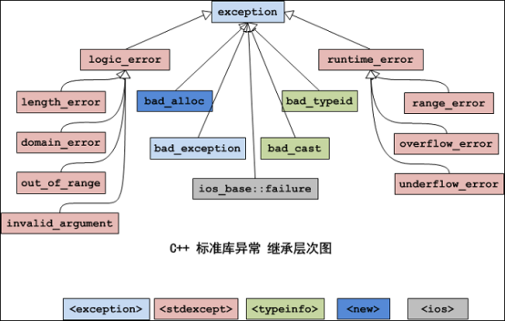

每个类所在的头文件在图下方标识出来。

**标准异常类的成员：**

① 在上述继承体系中，每个类都有提供了构造函数、复制构造函数、和赋值操作符重载。

② logic\_error类及其子类、runtime\_error类及其子类，它们的构造函数是接受一个string类型的形式参数，用于异常信息的描述。

③ 所有的异常类都有一个what()方法，返回const char\* 类型（C风格字符串）的值，描述异常信息。

**标准异常类的具体描述：**

| 异常名称          | 描述                                                         |
| ----------------- | ------------------------------------------------------------ |
| exception         | 所有标准异常类的父类                                         |
| bad_alloc         | 当operator new and operator new[]，请求分配内存失败时        |
| bad_exception     | 这是个特殊的异常，如果函数的异常抛出列表里声明了bad_exception异常，当函数内部抛出了异常抛出列表中没有的异常，这是调用的unexpected函数中若抛出异常，不论什么类型，都会被替换为bad_exception类型 |
| bad_typeid        | 使用typeid操作符，操作一个NULL指针，而该指针是带有虚函数的类，这时抛出bad_typeid异常 |
| bad_cast          | 使用dynamic_cast转换引用失败的时候                           |
| ios_base::failure | io操作过程出现错误                                           |
| logic_error       | 逻辑错误，可以在运行前检测的错误                             |
| runtime_error     | 运行时错误，仅在运行时才可以检测的错误                       |

logic_error的子类：

| 异常名称         | 描述                                                         |
| ---------------- | ------------------------------------------------------------ |
| length_error     | 试图生成一个超出该类型最大长度的对象时，例如vector的resize操作 |
| domain_error     | 参数的值域错误，主要用在数学函数中。例如使用一个负值调用只能操作非负数的函数 |
| out_of_range     | 超出有效范围                                                 |
| invalid_argument | 参数不合适。在标准库中，当利用string对象构造bitset时，而string中的字符不是’0’或’1’的时候，抛出该异常 |

runtime_error的子类：

| 异常名称         | 描述                                                         |
| ---------------- | ------------------------------------------------------------ |
| range_error      | 计算结果超出了有意义的值域范围                               |
| overflow_error   | 算术计算上溢                                                 |
| underflow_error  | 算术计算下溢                                                 |
| invalid_argument | 参数不合适。在标准库中，当利用string对象构造bitset时，而string中的字符不是’0’或’1’的时候，抛出该异常 |


```
#include <stdexcept>
void fun(int age){
	if (age < 0 || age > 150){
		throw out_of_range("年龄应该在0-150岁之间!");
	}
}

int main(){
	try{
		fun(151);
	}
	catch (out_of_range& ex){
		cout << ex.what() << endl;
	}
	return 0;
}
```


#### 编写自己的异常类

① 标准库中的异常是有限的；

② 在自己的异常类中，可以添加自己的信息。（标准库中的异常类值允许设置一个用来描述异常的字符串）。

**2. 如何编写自己的异常类？**

① 建议自己的异常类要继承标准异常类。因为C++中可以抛出任何类型的异常，所以我们的异常类可以不继承自标准异常，但是这样可能会导致程序混乱，尤其是当我们多人协同开发时。

② 当继承标准异常类时，应该重载父类的what函数和虚析构函数。

③ 因为栈展开的过程中，要复制异常类型，那么要根据你在类中添加的成员考虑是否提供自己的复制构造函数。

```
//自定义异常类
class MyOutOfRange : public exception{
public:
	// 构造
	MyOutOfRange(const string  errorInfo) {
		this->m_Error = errorInfo;
	}
	MyOutOfRange(const char * errorInfo) { // 构造重载
		this->m_Error = string( errorInfo);
	}
	// 析构
	virtual  ~MyOutOfRange() {
	}
	// 拷贝构造
	virtual const char *  what() const {
		return this->m_Error.c_str() ;
	}

	string m_Error;
};
```


## C++输入和输出流

### 流的概念和流类库的结构

程序的输入指的是从输入文件将数据传送给程序，
程序的输出指的是从程序将数据传送给输出文件。

C++输入输出包含以下三个方面的内容：

对系统指定的**标准设备**的输入和输出。即从键盘输入数据，输出到显示器屏幕。这种输入输出称为标准的输入输出，简称**标准I/O**。

以外存**磁盘文件**为对象进行输入和输出，即从磁盘文件输入数据，数据输出到磁盘文件。以外存文件为对象的输入输出称为文件的输入输出，简称**文件I/O**。

对**内存**中指定的空间进行输入和输出。通常指定一个字符数组作为存储空间(实际上可以利用该空间存储任何信息)。这种输入和输出称为字符串输入输出，简称**串I/O**。

C++编译系统提供了用于输入输出的iostream类库。iostream这个单词是由3个部 分组成的，即i-o-stream，意为输入输出流。在iostream类库中包含许多用于输入输出的 类。

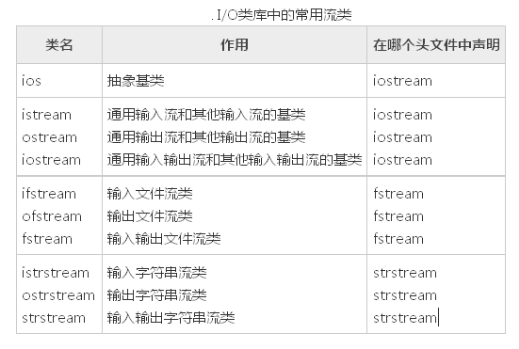

ios是抽象基类，由它派生出istream类和ostream类，两个类名中第1个字母i和o分别代表输入(input)和输出(output)。 istream类支持输入操作，ostream类支持输出操作， iostream类支持输入输出操作。iostream类是从istream类和ostream类通过多重继承而派生的类。

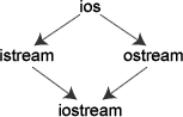

C++对文件的输入输出需要用ifstrcam和ofstream类，两个类名中第1个字母i和o分别代表输入和输出，第2个字母f代表文件 (file)。ifstream支持对文件的输入操作， ofstream支持对文件的输出操作。类ifstream继承了类istream，类ofstream继承了类ostream，类fstream继承了 类iostream。

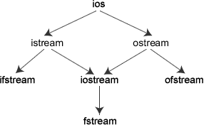

I/O类库中还有其他一些类，但是对于一般用户来说，以上这些已能满足需要了。

**与输入和输出流类库有关的头文件 **

输入和输出流类类库中不同的类的声明被放在不同的头文件中，用户在自己的程序中用\#include命令包含了有关的头文件就相当于在本程序中声明了所需要用到的类。可以换 —种说法：头文件是程序与类库的接口，输入和输出流类库的接口分别由不同的头文件来实现。

- `iostream`  包含了对**标准输入输出流**进行操作所需的基本信息。
- `fstream`  用于**文件流I/O**。
- `strstream`  用于**字符串流I/O**。
- `iomanip`  在使用**格式化I/O**时应包含此头文件。
- `stdiostream`  用于**混合使用C和C + +的I/O**机制时，例如想将C程序转变为C++程序。

**在iostream头文件中定义的流对象**

在 iostream 头文件中定义的**类**有:

> ios，istream，ostream，iostream，istream 等。

在iostream头文件中不仅定义了有关的类，还定义了4种**流对象**，

| **对象** | **含义**   | **对应设备** | **对应的类**       | **c语言中相应的标准文件** |
| -------- | ---------- | ------------ | ------------------ | ------------------------- |
| cin      | 标准输入流 | 键盘         | istream_withassign | stdin                     |
| cout     | 标准输出流 | 屏幕         | ostream_withassign | stdout                    |
| cerr     | 标准错误流 | 屏幕         | ostream_withassign | stderr                    |
| clog     | 标准错误流 | 屏幕         | ostream_withassign | stderr                    |

在iostream头文件中定义cout流对象：

> ostream cout (stdout); //定义了cout流对象

在定义cout为ostream流类对象时，把标准输出设备stdout作为参数，这样它就与标准输出设备(显示器)联系起来，如果有

> cout &lt;&lt;3; 

就会在显示器的屏幕上输出3。

**在iostream头文件中重载<<和>>运算符**

在**iostream**头文件中对<<和>>进行了**重载**， 使它们能用作标准类型数据的输入和输出运算符。所以，在用它们的程序中必须用\#include命令把iostream包含到程序中。

```
#include <iostream>

>> a; //将数据放入a对象中
cin >> a;

<< b; //将b对象中存储的数据拿出
cout << b;
```


### 标准I/O流

标准I/O对象：cin，cout，cerr，clog

**cin流对象**

**cout流对象**

cout是console output的缩写，意为在控制台（终端显示器）的输出。强调几点。

1. cout不是C++预定义的关键字，它是ostream流类的对象，在iostream中定义，并不是一个运算符。 顾 名思义，流是流动的数据，cout流是流向显示器的数据。cout流中的数据是用流插入 运算符“&lt;&lt;”顺序加入的。
2. 用“cout&lt;&lt;”输出基本类型的数据时，可以不必考虑数据是什么类型，系统会判断数 据的类型，并根据其类型选择调用与之匹配的运算符重载函数。这个过程都是自动的， 用户不必干预。如果在C语言中用prinf函数输出不同类型的数据，必须分别指定相应 的输出格式符，十分麻烦，而且容易出错。
3. cout流在内存中对应开辟了一个缓冲区，用来存放流中的数据，当向cout流插人一个endl时，不论缓冲区是否已满，都立即输出流中所有数据，然后插入一个换行符， 并刷新流（清空缓冲区）。注意如果插人一个换行符”\\n“（如cout&lt;&lt;a&lt;&lt;"\\n"），则只输出和换行，而不刷新cout 流(但并不是所有编译系统都体现出这一区别）。
4. 在iostream中只对"&lt;&lt;"和"&gt;&gt;"运算符用于标准类型数据的输入输出进行了重载，但未对用户声明的类型数据的输入输出进行重载。如果用户声明了新的类型，并希望用"&lt;&lt;"和"&gt;&gt;"运算符对其进行输入输出，按照重运算符重载来做。

**cerr流对象**

cerr流对象是标准错误流，cerr流已被指定为与显示器关联。cerr的作用是向标准错误设备(standard error device)输出有关出错信息。cerr与标准输出流cout的作用和用法差不多。但有一点不同：cout流通常是传送到显示器输出，但也可以被重定向输出到磁盘文件，而cerr流中的信息**只能直接在显示器输出**，cerr是不经过缓冲区，直接向显示器上输出有关信息。当调试程序时，往往不希望程序运行时的出错信息被送到其他文件，而要求在显示器上及时输出，这时应该用cerr。cerr流中的信息是用户根据需要指定的。

**clog流对象**

clog流对象也是标准错误流，它是console log的缩写。它的作用和cerr相同，都是在终端显示器上显示出错信息。区别：cerr是不经过缓冲区，直接向显示器上输出有关信息，而clog中的信息存放在缓冲区中，缓冲区满后或遇endl时向显示器输出。


### 标准输入流

标准输入流对象cin，重点掌握的函数

cin.get() // 读取一个字符

```
char ch = cin.get(); //一次只能读取一个字符

cin.get(ch); //读一个字符赋给变量ch
	
char buf[1024] = { 0 };
cin.get(buf.1024); //读字符串到buf
```

cin.getline() // 读入一行字符

```
char buf[1024] = { 0 };
cin.getline(buf,1024);
```

cin.ignore(n) // 忽略缓冲区当前n个字符

```
char buf[1024] = { 0 };
cin.ignore(2); //忽略缓冲区当前字符
cin.get(buf,1024);
cout << buf << endl;
```

cin.putback() // 将数据放回缓冲区

```
//从缓冲区取走一个字符
char ch = cin.get();
cout << "从缓冲区取走的字符:" << ch << endl;
//将数据再放回缓冲区
cin.putback(ch);
```

cin.peek() // 偷窥下缓冲区的数据

```
char ch = cin.peek();
cout << "偷窥缓冲区数据:" << ch << endl;
```


### 标准输出流

#### 字符输出

cout.flush() //刷新缓冲区 Linux下有效

```
//刷新缓冲区
cout.flush(); 
```

cout.put() // 向缓冲区写字符

```
cout.put('a');
```

cout.write() //从buffer中写num个字节到当前输出流中。

```
char* str = "hello world!";
cout.write(str, strlen(str));
```


#### 格式化输出

在输出数据时，为简便起见，往往不指定输出的格式，由系统根据数据的类型采取默认的格式，但有时希望数据按指定的格式输出，如要求以十六进制或八进制形式输出一个整数，对输出的小数只保留两位小数等。有两种方法可以达到此目的。

1）使用控制符的方法；

2）使用流对象的有关成员函数。

##### 控制符格式化输出

C++提供了在输入输出流中使用的控制符。

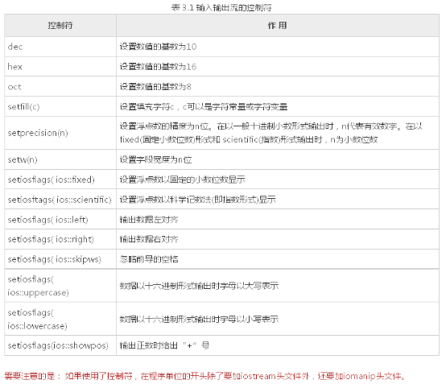

```
//使用控制符
void test02(){
	int number = 99;
	cout << setw(20)
		<< setfill('~')
		<< setiosflags(ios::showbase)
		<< setiosflags(ios::left)
		<< hex
		<< number
		<< endl;
}
```


##### 使用流对象的有关成员函数

通过调用流对象cout中用于控制输出格式的成员函数来控制输出格式。用于控制输出格式的常用的成员函数如下：

 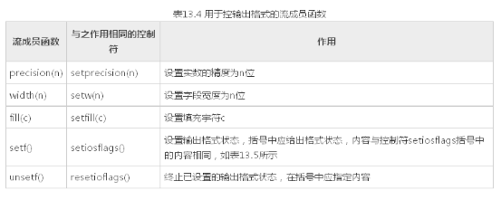

流成员函数setf和控制符setiosflags括号中的参数表示格式状态，它是通过格式标志来指定的。格式标志在类ios中被定义为枚举值。因此在引用这些格式标志时要在前面加上类名ios和域运算符“::”。格式标志见表13.5。

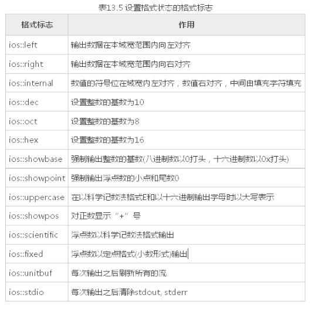

```
//通过流成员函数
void test01(){
	int number = 99;
	cout.width(20);
	cout.fill('*');
	cout.setf(ios::left);
	cout.unsetf(ios::dec); //卸载十进制
	cout.setf(ios::hex);
	cout.setf(ios::showbase);
	cout.unsetf(ios::hex);
	cout.setf(ios::oct);
	cout << number << endl;
}
```


 

### 文件读写

#### 文件流类和文件流对象

输入输出是以系统指定的标准设备（输入设备为键盘，输出设备为显示器）为对象的。在实际应用中，常以磁盘文件作为对象。即从磁盘文件读取数据，将数据输出到磁盘文件。

和文件有关系的输入输出类主要在fstream.h这个头文件中被定义，在这个头文件中主要被定义了三个类，由这三个类控制对文件的各种输入输出操作，他们分别是ifstream、ofstream、fstream，其中fstream类是由iostream类派生而来，他们之间的继承关系见下图所示：

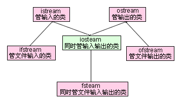

由于文件设备并不像显示器屏幕与键盘那样是标准默认设备，所以它在fstream头文件中是没有像cout那样预先定义的全局对象，所以我们必须自己定义一个该类的对象。ifstream类，它是从istream类派生的，用来支持从磁盘文件的输入。ofstream类，它是从ostream类派生的，用来支持向磁盘文件的输出。

fstream类，它是从iostream类派生的，用来支持对磁盘文件的输入输出。

#### C++打开文件

所谓打开(open)文件是一种形象的说法，如同打开房门就可以进入房间活动一样。 打开文件是指在文件读写之前做必要的准备工作，包括：

1）为文件流对象和指定的磁盘文件建立关联，以便使文件流流向指定的磁盘文件。

2）指定文件的工作方式，如：该文件是作为输入文件还是输出文件，是ASCII文件还是二进制文件等。

以上工作可以通过两种不同的方法实现:

1\) 调用文件流的成员函数open。如

ofstream outfile; //定义ofstream类(输出文件流类)对象outfile

outfile.open("f1.dat",ios::out); //使文件流与f1.dat文件建立关联

第2行是调用输出文件流的成员函数open打开磁盘文件f1.dat，并指定它为输出文件， 文件流对象outfile将向磁盘文件f1.dat输出数据。ios::out是I/O模式的一种，表示 以输出方式打开一个文件。或者简单地说，此时f1.dat是一个输出文件，接收从内存 输出的数据。

磁盘文件名可以包括路径，如"c:\\\\new\\\\f1.dat"，如缺省路径，则默认为当前目录下的文件。

2\) 在定义文件流对象时指定参数

在声明文件流类时定义了带参数的构造函数，其中包含了打开磁盘文件的功能。因此， 可以在定义文件流对象时指定参数，调用文件流类的构造函数来实现打开文件的功能。

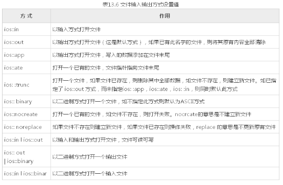

几点说明：
1) 新版本的I/O类库中不提供ios::nocreate和ios::noreplace。
2) 每一个打开的文件都有一个文件指针，该指针的初始位置由I/O方式指定，每次读写都从文件指针的当前位置开始。每读入一个字节，指针就后移一个字节。当文件指针移到最后，就会遇到文件结束EOF（文件结束符也占一个字节，其值为-1)，此时流对象的成员函数eof的值为非0值(一般设为1)，表示文件结束 了。
3) 可以用“位或”运算符“|”对输入输出方式进行组合，如表13.6中最后3行所示那样。还可以举出下面一些例子：
    ios::in | ios:: noreplace  //打开一个输入文件，若文件不存在则返回打开失败的信息
    ios::app | ios::nocreate  //打开一个输出文件，在文件尾接着写数据，若文件不存在，则返回打开失败的信息
    ios::out l ios::noreplace  //打开一个新文件作为输出文件，如果文件已存在则返回打开失败的信息
    ios::in l ios::out I ios::binary  //打开一个二进制文件，可读可写
但不能组合互相排斥的方式，如 ios::nocreate l ios::noreplace。
4) 如果打开操作失败，open函数的返回值为0(假)，如果是用调用构造函数的方式打开文件的，则流对象的值为0。可以据此测试打开是否成功。如\
    if(outfile.open("f1.bat", ios::app) ==0)
        cout &lt;&lt;"open error";
或
    if( !outfile.open("f1.bat", ios::app) )
        cout &lt;&lt;"open error";

#### C++关闭文件

在对已打开的磁盘文件的读写操作完成后，应关闭该文件。关闭文件用成员函数close。

```
outfile.close( );  //将输出文件流所关联的磁盘文件关闭
```

所谓关闭，实际上是解除该磁盘文件与文件流的关联，原来设置的工作方式也失效，这样，就不能再通过文件流对该文件进行输入或输出。

#### C++对ASCII文件的读写操作

如果文件的每一个字节中均以ASCII代码形式存放数据,即一个字节存放一个字符,这个文件就是ASCII文件(或称字符文件)。程序可以从ASCII文件中读入若干个字符,也可以向它输出一些字符。

1)  用流插入运算符“&lt;&lt;”和流提取运算符“&gt;&gt;”对磁盘文件读写。
在对磁盘文件的操作中，可以通过文件流对象和流插入运算符“&lt;&lt;”及 流提取运算符“&gt;&gt;”实现对磁盘 文件的读写，如同用cin、cout和&lt;&lt;、&gt;&gt;对标准设备进行读写一样。

2)  用文件流的put、get、geiline等成员函数进行字符的输入输出。
用C++流成员函数put输出单个字符、C++ get()函数读入一个字符和C++ getline()函数读入一行字符。

```
	char* sourceFileName = "./source.txt";
	char* targetFileName = "./target.txt";
	//创建文件输入流对象
	ifstream ism(sourceFileName, ios::in);
	//创建文件输出流对象
	ofstream osm(targetFileName,ios::out);

	if (!ism){
		cout << "文件打开失败!" << endl;
	}

	while (!ism.eof()){
		char buf[1024] = { 0 };
		ism.getline(buf,1024); // 读文件，读入一行字符
		cout << buf << endl;
		osm << buf << endl; // 写入文件
	}

	//关闭文件流对象
	ism.close();
	osm.close();
```


#### C++对二进制文件的读写操作

二进制文件不是以ASCII代码存放数据的，它将内存中数据存储形式不加转换地传送到磁盘文件，因此它又称为**内存数据的映像**文件。因为文件中的信息不是字符数据，而是字节中的二进制形式的信息，因此它又称为字节文件。

对二进制文件的操作也需要先打开文件，用完后要关闭文件。在打开时要用ios::binary指定为以二进制形式传送和存储。二进制文件除了可以作为输入文件或输出文件外,还可以是既能输入又能输出的文件。这是和ASCII文件不同的地方。

**用成员函数read和write读写二进制文件**

对二进制文件的读写主要用istream类的成员函数read和write来实现。这两个成员函数的原型为

> istream& read(char *buffer,int len);
> ostream& write(const char * buffer,int len);

字符指针buffer指向内存中一段存储空间。len是读写的字节数。调用的方式为：

```
a. write(p1,50);
b. read(p2,30);
```

上面第一行中的a是输出文件流对象，write函数将字符指针p1所给出的地址开始的50个字节的内容不加转换地写到磁盘文件中。在第二行中，b是输入文件流对象，read 函数从b所关联的磁盘文件中，读入30个字节(或遇EOF结束），存放在字符指针p2所指的一段空间内。

```
//对象写入文件 
	char* fileName = "person.txt";
	//创建文件对象输出流,二进制模式读写文件
	ofstream osm(fileName, ios::out | ios::binary);

	Person p1("John",33);
	//Person对象写入文件
	osm.write((const char*)&p1,sizeof(Person));

	//关闭文件输出流
	osm.close();

//从文件中读取对象
	//创建文件对象输入流,,二进制模式读写文件
	ifstream ism(fileName, ios::in | ios::binary);
	
	Person p3;
	//文件读入Person对象
	ism.read((char*)&p3, sizeof(Person));

	//关闭文件输入流
	ism.close();
```


## Python和C++比较

C++和Python都是面向对象的高级程序设计语言

C++是一门编译型语言，源程序经过预处理、编译和链接之后生成可执行文件
Python是一门解释型语言，Python解释器先把源代码转换成字节码文件，再由Python虚拟机一条一条地执行字节码指令

C++是一种强类型语言，每个变量的类型都需要事先声明
Python是一种动态类型语言，变量不需要声明即可直接赋值，变量名没有类型，类型属于对象，变量可以重新赋值为任意值

C++在堆区动态开辟内存时，需要手动开辟手动释放
Python依靠引用计数机制进行自动内存管理

C++支持多线程并发执行
Python的多线程不能利用多核CPU资源(c++解释器)

C++有指针
Python没有指针

C++在类外对私有成员的访问是绝对禁止的
Python只是对私有成员的名称做了修饰


## C++11

[C++11新特性，所有知识点都在这了！](https://mp.weixin.qq.com/s?__biz=MzA3MTU1MzMzNQ==&mid=2247485921&idx=1&sn=e9f03bba601d32c97971ba4dfa0788a7&chksm=9f2a91b9a85d18af0e405cf25dbe52421b399fcef89ee7c211b2786bbc054420eef347a1b089&mpshare=1&scene=1&srcid=0725NEEfhmtKz3T1xZCkcy5Q&sharer_sharetime=1600061822308&sharer_shareid=dc3800fce883bcab9e60dd127359030a&key=a42654d5f06828b55e5d563fc29dddede4cef3c9d70ec792144ad0048ed3016a6a4865ccad57a905d2fe94d3fafa40b0b08500319d3582641785254e10a1c217ab46c39e90b0e81b04abb860b65e362b4855a1481a6f74fd984168c4285ece225a2a890266c080b9d5a5b43259e595e37c788f807de10028eb69b69b6e850299&ascene=1&uin=MjEwNzMzNTEwMg%3D%3D&devicetype=Windows+7&version=62090529&lang=en&exportkey=AVM%2BmhTBWcNnaz3BcUxFacU%3D&pass_ticket=gxBsHT1tvaBhqu2ojCn%2FpP6Ni8eTuKDuVoYq8dat43AQVKcl3DyDRF5WY%2BuNiVl7&wx_header=0)


