# C++基础


## 1. C++概述

### 1.1 c++简介

​	"c++"中的++来自于c语言中的递增运算符++，该运算符将变量加1。c++起初也叫"c with clsss".通过名称表明，c++是对C的扩展，因此c++是c语言的超集，这意味着任何有效的c程序都是有效的c++程序。c++程序可以使用已有的c程序库。

​	库是编程模块的集合，可以在程序中调用它们。库对很多常见的编程问题提供了可靠的解决方法，因此可以节省程序员大量的时间和工作量。


​	c++语言在c语言的基础上添加了**面向对象编程**和**泛型编程**的支持。c++继承了c语言高效，简洁，快速和可移植的传统。

c++融合了3种不同的编程方式:
-   c语言代表的**过程性**语言。
-   c++在c语言基础上添加的**类**代表的**面向对象**语言。
-   c++**模板**支持的**泛型编程**。

**c语言和c++语言的关系:**

c++语言是在C语言的基础上，添加了面向对象、模板等现代程序设计语言的特性而发展起来的。两者无论是从语法规则上，还是从运算符的数量和使用上，都非常相似，所以我们常常将这两门语言统称为“C/C++”。

 C语言和C++并不是对立的竞争关系：

1)C++是C语言的加强，是一种更好的C语言。

2)C++是以C语言为基础的，并且完全兼容C语言的特性。

c语言和C++语言的学习是可以相互促进。学好C语言，可以为我们将来进一步地学习C++语言打好基础，而C++语言的学习，也会促进我们对于C语言的理解，从而更好地运用C语言。

**c++起源**

与c语言一样，c++也是在贝尔实验室诞生的，Bjarne Stroustrup(本贾尼·斯特劳斯特卢普)在20世纪80年代在这里开发了这种语言。

Stroustrup关心的是让c++更有用，而不是实施特定的编程原理或风格。在确定语言特性方面，真正的编程比纯粹的原理更重要。Stroustrup之所以在c的基础上创建c++,是因为c语言简洁、适合系统编程、使用广泛且与UNIX操作系统联系紧密。

用他自己的话来说，"C++主要是为了我的朋友和我不必再使用汇编语言、C语言或者其他现代高级语言来编程而设计的。它的主要功能是可以更方便得编写出好程序，让每个程序员更加快乐"。

### 1.3 可移植性和标准

假设为运行windows 2000的老式奔腾pc编写了一个很好用的c++程序，而管理员决定使用不同操作系统(比如说Mac OS 或 Linux)和处理器的计算机替换它。该程序是否可在新平台运行呢？当然，但是必须使用为新平台设计的c++编译器重新编译。但是是否需要修改写好的代码？如果不需要修改代码的情况下，重新编译程序后，程序依然运行良好，该程序是可移植的。

程序是否可移植性有两个问题需要解决。第一是硬件，针对特定硬件编程的程序是不可移植的。第二，语言的实现，windows xp c++ 和 Redhat Linux 或 Mac OS X对c++的实现不一定相同。虽然我们希望c++版本与其他版本兼容，但是如果没有一个公开的标准，很难做到。因此，美国国家标准局(American National Standards Institute,ANSI)在1990年设立一个委员会专门负责制定c++标准(ANSI制定了c语言的标准)。国际标准化组织(International Organization for Standardization，ISO)很快通过自己的委员会加入到这个行列，创建了联合组织ANSI/ISO,制定c++标准。

经过多年的努力，制定出了一个国际标准ISO/IEC 14882:1998 ，并于1998年获得了ISO、IEC(International Electrotechnical Committee,国际电工技术委员会)和ANSI的批准。这个标准就是我们经常所说的c++98。它不仅描述了已有的c++特性，还对语言进行了扩展，添加了异常、运行阶段类型识别(RTTI)、模板和标准模板库(STL).

2003年，发布了c++标准第二版(IOS/IEC 14882:2003),这一版本对第一版修订了一些错误，但并没有改变语言特性，因此c++98表示c++98/c++2003.

c++不断发展。IOS标准委员会于2011年8月批准了新标准ISO/IEC 14882:2011,该标准被称为c++11,与c++98一样c++11也新增了许多特性。

ISO c++标准还吸收了ANSI c语言标准，c++尽量做到是c的超集。意味着在理想情况下，任何有效的c程序都应该是有效的c++程序。

ANSI不仅定义了c语言，还 定义了一个ANSI c必须实现的标准c库。c++也在使用这个库，另外ANSI/ISO c++标准还提供了一个c++标准类库。

### 1.4 为什么C++会成功

c++最初的目的是将c语言转变为OOP（面向对象程序设计）语言，但是c++后来并没有这么做，而是立足于程序的实际。因为在c语言方面大量投入的程序员使其完全丢掉c语言那种编程的思考方式，转而去接受一种新的语言，新的思维，那么将会导致这些程序员中大部分人在短时间内可能毫无成果，使其生产率降低。但是如果让这些c程序员在已有知识的基础上，再去学习c++语言，理解运用OOP，那么也只是在其已有思维的基础上进行扩展而已，这样可以保持其更好的生产率。

简而言之，强迫程序员放弃c语言和c语言的思考方式，而去转到OOP上是需要代价的，但是从c语言转到c++所花费的代价就会小很多。所以也可以理解为c++的出现并不是去替代c,而是对c的扩展，所以在c++中既可以使用c++新特性，并且可以使用c的过程式思维来编写程序。


  对于传统的结构化语言，我们向来没有太多的疑惑，函数调用那么自然而明显，只是从程序的某一个地点调到另一个地点去执行。但是对于面向对象(OO)语言，我们疑惑就会很多。其原因就是c++编译器为我们程序员做了太多隐藏的工作：构造函数，析构函数、虚函数、继承、多态\....有时候它为我们合成出一些额外的函数,有时候它又偷偷在我们写的函数里，放进更多的操作。有时候也会给我们的对象里放进一些奇妙的东西，使得我们sizeof的时候结果可我们预期不一样。


## 2. C++初识

## 2.1 简单的c++程序

### 2.1.1 c++ hello world

```
#include<iostream>
using namespace std;

int main(){	
	cout << "hello world" << endl;
	return EXIT_SUCCESS;
}
```

**分析:**

> ```
> #include<iostream>; 预编译指令，引入头文件iostream.
> using namespace std; 使用标准命名空间
> cout << “hello world”<< endl; 和printf功能一样，输出字符串”hello wrold”
> ```

c++头文件为什么没有xxx.h？

在c语言中头文件使用扩展名.h,将其作为一种通过名称标识文件类型的简单方式。但是c++得用法改变了，c++头文件没有扩展名。但是有些c语言的头文件被转换为c++的头文件，这些文件被重新命名，丢掉了扩展名.h(使之成为c++风格头文件)，并在文件名称前面加上前缀c(表明来自c语言)。例如c++版本的math.h为cmath

由于C使用不同的扩展名来表示不同文件类型，因此用一些特殊的扩展名(如hpp或hxx)表示c++的头文件也是可以的，ANSI/IOS标准委员会也认为是可以的，但是关键问题是用哪个比较好，最后一致同意不适用任何扩展名。

| 头文件类型    | 约定               | 示例       | 说明                                        |
| ------------- | ------------------ | ---------- | ------------------------------------------- |
| c旧式风格     | 以.h结尾           | math.h     | c/c++程序可用                               |
| 转换自C头文件 | 加上前缀c,无扩展名 | cmath      | c++程序可用，可使用非c特性，如namespace std |
| c++旧式风格   | 以.h结尾           | iostream.h | c++程序可用                                 |
| c++新式风格   | 无扩展名           | iostream   | c++程序可用，使用namespace std              |


### 2.1.3 面向过程

面向过程是一种**以过程为中心**的编程思想。

通过分析出解决问题所需要的步骤，然后用函数把这些步骤一步一步实现，使用的时候一个一个依次调用就可以了。

面向过程编程思想的核心：**功能分解**，**自顶向下**，**逐层细化**（程序=数据结构+算法）。

面向过程编程语言存在的主要缺点是不符合人的思维习惯，而是要用计算机的思维方式去处理问题，而且面向过程编程语言重用性低，维护困难。

### 2.1.4 面向对象

**面向对象编程**（Object-Oriented Programming）简称 OOP 技术，是开发计算机应用程序的一种新方法、新思想。过去的面向过程编程常常会导致所有的代码都包含在几个模块中，使程序难以阅读和维护。在做一些修改时常常牵一动百，使以后的开发和维护难以为继。而使用 OOP 技术，常常要使用许多代码模块，每个模块都只提供特定的功能，它们是彼此独立的，这样就增大了代码重用的几率，更加有利于软件的开发、维护和升级。

在面向对象中，**算法**与**数据结构**被看做是一个整体，称作**对象**，现实世界中任何类的对象都具有一定的属性和操作，也总能用数据结构与算法两者合一地来描述，所以可以用下面的等式来定义对象和程序：

> **对象 = 算法 + 数据结构**
> 程序 = 对象 + 对象 + ……

从上面的等式可以看出，程序就是许多对象在计算机中相继表现自己，而对象则是一个个程序实体。

面向对象编程思想的核心：应对变化，提高复用。

### 2.1.5 面向对象三大特性

-   封装

把客观事物封装成抽象的类，并且类可以把自己的数据和方法只让可信的类或者对象操作，对不可信的进行信息隐藏。

类将成员变量和成员函数封装在类的内部，根据需要设置访问权限，通过成员函数管理内部状态。

-   继承

继承所表达的是类之间相关的关系，这种关系使得对象可以继承另外一类对象的特征和能力。

继承的作用：避免公用代码的重复开发，减少代码和数据冗余。

-   多态

多态性可以简单地概括为"一个接口，多种方法"，字面意思为多种形态。程序在运行时才决定调用的函数，它是面向对象编程领域的核心概念。

## 3. C++对C的扩展

## 3.1 ::作用域运算符

通常情况下，如果有两个同名变量，一个是全局变量，另一个是**局部变量**，那么局部变量在其作用域内具有较高的优先权，它将**屏蔽全局变量**。

**::作用域运算符**可以用来解决**局部变量**与**全局变量**的**重名**问题，即在局部变量的作用域内，可用::对被屏蔽的同名的全局变量进行访问。

`::变量名`表示**全局变量**

```
//全局变量
int a = 10;
//1. 局部变量和全局变量同名
void test(){
	int a = 20;
	//打印局部变量a
	cout << "局部变量a:" << a << endl;
	//打印全局变量a
	cout << "全局变量a:" << ::a << endl;
}
```

这个例子可以看出，作用域运算符可以用来解决局部变量与全局变量的重名问题，即在局部变量的作用域内，可用::对被屏蔽的同名的全局变量进行访问。

## 3.2 命名空间

c语言可以通过static关键字来使得名字只得在本编译单元内可见，在c++中我们将通过一种通过命名空间namespace来控制对名字的访问可见性。

### 3.2.1 命名空间

在c++中，名称（name）可以是符号常量、变量、函数、结构、枚举、类和对象等等。工程越大，名称互相冲突性的可能性越大。另外使用多个厂商的类库时，也可能导致名称冲突。为了避免，在大规模程序的设计中，以及在程序员使用各种各样的C++库时，这些标识符的命名发生冲突，标准C++引入关键字namespace（命名空间/名字空间/名称空间），可以更好地控制标识符的作用域。

### 3.2.2命名空间使用语法

命名空间只能全局范围内定义

namespace创建一个命名空间

命名空间可嵌套命名空间

命名空间是开放的，即可以随时把新的成员加入已有的命名空间中


> ```
> // 命名空间只能全局范围内定义
> namespace A{
> 	int a = 10;
> 	namespace AB{ // 嵌套命名空间
> 		int ab = 20;
> 	}
> }
> 
> // 原命名空间添加新成员
> namespace A{ 
> 	void func(){
> 		cout << "hello namespace!" << endl;
> 	}
> }
> 
> void test(){
> 	cout << "A::a : " << A::a << endl;
> 	cout << "A::AB::aa : " << A::AB::ab << endl; // 嵌套命名空间
> 	A::func(); // 原命名空间添加新成员
> }
> ```

命名空间别名

> ```
> namespace shortName = veryLongName;
> ```

**无名命名空间**，意味着命名空间中的标识符只能在**本文件内访问**，相当于给这个标识符加上了static，使得其可以作为内部连接。

> ```
> namespace{
> 	int a = 10;
> 	void func(){ cout << "hello namespace" << endl; }
> }
> void test(){
> 	cout << "a : " << a << endl;
> 	func();
> }
> ```

命名空间内函数声明和实现可分离

> 仅函数声明
>
> ```
> #pragma once
> 
> namespace MySpace{
> 	void func1();
> 	void func2(int param);
> }
> ```
>
> 函数实现
>
> ```
> void MySpace::func1(){
> 	cout << "MySpace::func1" << endl;
> }
> void MySpace::func2(int param){
> 	cout << "MySpace::func2 : " << param << endl;
> }
> ```

### 3.2.3 using声明

using声明可使得指定的标识符可用。

> ```
> using opencv::Mat;
> using opencv::imshow();
> ```

using声明碰到函数重载

如果命名空间包含一组用相同名字重载的函数，using声明就声明了这个重载函数的所有集合。

> ```
> namespace A{
> 	void func(){}
> 	void func(int x){}
> 	int  func(int x,int y){}
> }
> void test(){
> 	using A::func;
> 	func();
> 	func(10);
> 	func(10, 20);
> }
> ```

using编译指令使整个命名空间标识符可用.

> ```
> using namespace opencv;
> ```

注意：使用using声明或using编译指令会增加命名冲突的可能性。也就是说，如果有名称空间，并在代码中使用作用域解析运算符，则不会出现二义性。

### 3.2.5 命名空间使用

需要记住的关键问题是当引入一个全局的using编译指令时，就为该文件打开了该命名空间，它不会影响任何其他的文件，所以可以在每一个实现文件中调整对命名空间的控制。比如，如果发现某一个实现文件中有太多的using指令而产生的命名冲突，就要对该文件做个简单的改变，通过明确的限定或者using声明来消除名字冲突，这样不需要修改其他的实现文件。

## C与C++的不同

### 3.3 全局变量检测增强

> ```
> int a = 10; //赋值，c语言当做定义
> int a; // 没有赋值，c语言当做声明，c++重复定义
> int main(){
> 	printf("a:%d\n",a);
> 	return 0;
> }
> ```

在c下编译通过，在c++下编译失败，重复定义变量a

### 3.4 C++中所有的变量和函数都必须有类型

在C语言中，int fun() 表示返回值为int，接受任意参数的函数，int fun(void) 表示返回值为int的无参函数。
在C++ 中，int fun() 和int fun(void) 具有相同的意义，都表示返回值为int的无参函数。

### 3.5 更严格的类型转换

在C++，不同类型的变量一般是不能直接赋值的，需要相应的强转。

### 3.6 struct类型加强

c中定义结构体变量需要加上struct关键字，
c++中定义结构体变量不需要加struct关键字。

c中的结构体只能定义成员变量，不能定义成员函数，
c++结构体中即可以定义成员变量，也可以定义成员函数。

### 3.7 "新增"bool类型关键字

标准c++的bool类型有两种内建的常量true(转换为整数1)和false(转换为整数0)表示状态。这三个名字都是关键字。

-   bool类型只有两个值，true(1值)，false(0值)

-   bool类型占1个字节大小

-   给bool类型赋值时，**非0**值会自动转换为true(1)，0值会自动转换false(0)

c语言中也有bool类型，在c99标准之前是没有bool关键字，c99标准已经有bool类型，包含头文件stdbool.h,就可以使用和c++一样的bool类型。

### 3.8 三目运算符功能增强

c语言三目运算表达式返回值为数据值，为右值，不能赋值。

c++语言三目运算表达式返回值为变量本身(引用)，为左值，可以赋值。

> (a > b ? a : b) = 100;//返回的是左值，变量的引用

   **左值和右值概念**
   在c++中可以放在赋值操作符左边的是左值，可以放到赋值操作符右面的是右值。
   有些变量即可以当左值，也可以当右值。
   左值为Lvalue，L代表Location，表示内存可以寻址，可以赋值。
   右值为Rvalue，R代表Read,就是可以知道它的值。
   比如:int temp = 10; temp在内存中有地址，10没有，但是可以Read到它的值。

## 3.9 C/C++中的const

### 3.9.1 const概述

const单词字面意思为常数，不变的。它是c/c++中的一个关键字，是一个限定符，它用来限定一个变量不允许改变，它将一个对象转换成一个常量。

### 3.9.2 C/C++中const的区别

#### 3.9.2.1 C中的const 

常量的引进是在c++早期版本中，当时标准C规范正在制定。那时，尽管C委员会决定在C中引入const,但是，他们c中的const理解为"一个不能改变的普通变量"，也就是认为const应该是一个只读变量，既然是变量那么就会给const分配内存，并且在c中const是一个**全局只读变量**，c语言中const修饰的只读变量是**外部连接**的。

#### 3.8.2.1 C++中的const

在c++中，一个const**不必创建内存空间**，而在c中，一个const总是需要一块内存空间。在c++中，是否为const常量分配内存空间依赖于如何使用。一般说来，如果一个const仅仅用来把一个名字用一个值代替(就像使用\#define一样)，那么该存储局空间就不必创建。

如果存储空间没有分配内存的话，在进行完数据类型检查后，为了代码更加有效，值也许会折叠到代码中。

不过，**取一个const地址**, 或者把它**定义为extern**,则会为该const创建内存空间。

在c++中，出现在所有函数之外的**const**作用于整个文件(也就是说它在该**文件外不可见**)，默认为**内部连接**，c++中其他的标识符一般默认为外部连接。

#### 3.8.2.3 C/C++中const异同总结

c语言全局const会被存储到只读数据段。c++中全局const当声明extern或者对变量取地址时，编译器会分配存储地址，变量存储在只读数据段。两个都受到了**只读数据段**的保护，不可修改。

c语言中局部const存储在堆栈区，只是不能通过变量直接修改const只读变量的值，但是可以跳过编译器的检查，通过**指针间接修改const值**。

c语言中，通过指针间接赋值修改了constA的值。

c++中对于局部的const变量要区别对待：

1.  对于基础数据类型，也就是const int A = 10这种，编译器会把它放到符号表中，不分配内存，当对其取地址时，会分配内存。

2.  对于基础数据类型，如果用一个变量初始化const变量，如果const int a = b,那么也是会给a分配内存。

3.  对于自定数据类型，比如类对象，那么也会分配内存。

c中const默认为外部连接，**c++中const默认为内部连接**。当c语言两个文件中都有const int a的时候，编译器会报重定义的错误。而在c++中，则不会，因为c++中的const默认是内部连接的。如果想让c++中的const具有**外部连接**，必须**extern显示声明**为: `extern const int a = 10;`

const由c++采用，并加进标准c中，尽管他们很不一样。在c中，编译器对待const如同对待变量一样，只不过带有一个特殊的标记，意思是"你不能改变我"。在c++中定义const时，编译器为它创建空间，所以如果在两个不同文件定义多个同名的const，链接器将发生链接错误。简而言之,const在c++中用的更好。

### 3.9.3 尽量以const替换\#define

> #define MAX 1024;  // 没有类型
>

我们定义的宏MAX从未被编译器看到过，因为在预处理阶段，所有的MAX已经被替换为了1024，于是MAX并没有将其加入到符号表中。但我们使用这个常量获得一个编译错误信息时，可能会带来一些困惑，因为这个信息可能会提到1024，但是并没有提到MAX.如果MAX被定义在一个不是你写的头文件中，你可能并不知道1024代表什么，也许解决这个问题要花费很长时间。解决办法就是用一个常量替换上面的宏。

> const int max= 1024; // 有类型

const和\#define区别总结:

1\. #define宏常量没有类型，所以调用了int类型重载的函数。const有类型。

2\. 宏常量不重视作用域。

## 3.10 引用(reference)

### 3.10.1 引用基本用法

引用是c++对c的重要扩充。在c/c++中指针的作用基本都是一样的，但是c++增加了另外一种给函数传递地址的途径，这就是按引用传递(pass-by-reference)，它也存在于其他一些编程语言中，并不是c++的发明。

-   变量名实质上是一段连续内存空间的别名，是一个标号(门牌号)

-   程序中通过变量来申请并命名内存空间

-   通过变量的名字可以使用存储空间

基本语法:

>   int & ref = val;
>

注意事项：

-   **&**在此**不是求地址**运算，而是起标识作用。
-   类型标识符是指目标变量的类型。
-   **必须**在**声明引用**变量时进行**初始化**。
-   引用初始化之后**不能改变**。
-   不能有NULL引用。必须确保引用是和一块合法的存储单元关联。
-   可以建立对数组的引用。

> int arr[10];
> //int & ref3[10] = arr; // 这样不能对数组建立引用
> int (&arr_ref)[10] = arr; // 建立数组引用

### 3.10.2 函数中的引用

最常见看见引用的地方是在函数参数和返回值中。当引用被用作函数参数的时，在函数内对任何引用的修改，将对函数外的参数产生改变。当然，可以通过传递一个指针来做相同的事情，但引用具有更清晰的语法。

如果从函数中返回一个引用，必须像从函数中返回一个指针一样对待。当函数返回值时，引用关联的内存一定要存在。

> //值传递
> void ValueSwap(int m,int n){}
>
> //地址传递
> void PointerSwap(int* m,int* n){}
>
> //引用传递
> void ReferenceSwap(int& m,int& n){}

通过引用参数产生的效果同按地址传递是一样的。引用的语法更清楚简单：

1)  函数调用时传递的实参不必加"&"符
2)  在被调函数中不必在参数前加"\*"符

引用作为其它变量的别名而存在，因此在一些场合可以代替指针。C++主张用引用传递取代地址传递的方式，因为引用语法容易且不易出错。

-   **不能返回局部变量的引用**。

-   函数当左值，必须返回引用。

### 3.10.3 引用的本质

**引用**的**本质**在c++内部实现是一个**指针常量**

>   Type & ref = val;  // Type\* const ref = &val;
>

c++编译器在编译过程中使用常指针作为引用的内部实现，因此引用所占用的空间大小与指针相同，只是这个过程是编译器内部实现，用户不可见。

### 3.10.4 指针引用

在c语言中如果想改变一个指针的指向而不是它所指向的内容，函数声明可能这样:

> void fun(int**){}

给指针变量取一个别名。

> Type* pointer = NULL;  
> Type*& = pointer;

> //指针间接修改teacher的年龄
> void AllocateAndInitByPointer(Teacher** teacher){}

对于c++中的定义那个，语法清晰多了。函数参数变成指针的引用，用不着取得指针的地址。

> //引用修改teacher年龄
> void AllocateAndInitByReference(Teacher*& teacher){}

### 3.10.5 常量引用

常量引用的定义格式:

> const Type& ref = val;

常量引用注意：

const修饰的引用，不能通过引用修改原变量值。

> ```
> int a = 100;
> const int& aRef = a; //此时aRef就是a
> //aRef = 200; 不能通过aRef的值
> a = 100; //OK
> ```
>

字面量不能赋给引用，但是可以赋给const引用

>
> ```
> //不能把一个字面量赋给引用
> //int& ref = 100;
> //但是可以把一个字面量赋给常引用
> const int& ref = 100; //int temp = 200; const int& ret = temp;
> ```

const引用使用场景
    **常量引用**主要用在函数的**形参**，尤其是类的**拷贝/复制构造函数**。
将函数的形参定义为常量引用的好处:
	引用不产生新的变量，减少形参与实参传递时的开销。
	由于引用可能导致实参随形参改变而改变，将其定义为常量引用可以消除这种副作用。如果希望实参随着形参的改变而改变，那么使用一般的引用，如果不希望实参随着形参改变，那么使用常引用。

## 3.12 内联函数(inline function)

### 3.12.1 内联函数的引出

c++从c中继承的一个重要特征就是效率。

在c中我们经常把一些短并且执行频繁的计算写成宏，而不是函数，这样做的理由是为了执行效率，宏可以避免函数调用的开销，这些都由预处理来完成。

但是在c++出现之后，使用预处理宏会出现两个问题：

-   第一个在c中也会出现，宏看起来像一个函数调用，但是会有隐藏一些难以发现的错误。

-   第二个问题是c++特有的，预处理器不允许访问类的成员，也就是说预处理器宏不能用作类类的成员函数。

为了保持预处理宏的效率又增加安全性，而且还能像一般成员函数那样可以在类里访问自如，c++引入了内联函数(inline function)。

内联函数为了继承宏函数的效率，没有函数调用时开销，然后又可以像普通函数那样，可以进行参数，返回值类型的安全检查，又可以作为成员函数。

### 3.12.2 预处理宏的缺陷

预处理器宏存在问题的关键是我们可能认为预处理器的行为和编译器的行为是一样的。当然也是由于宏函数调用和函数调用在外表看起来是一样的，因为也容易被混淆。但是其中也会有一些微妙的问题出现:

> ```
> #define ADD(x,y) x+y
> int ret1 = ADD(10, 20) * 10; //希望的结果是300,实际210
> 
> #define COMPARE(x,y) ((x) < (y) ? (x) : (y))
> //cout << "COMPARE(++a, b):" << COMPARE(++a, b) << endl; 
> ```

预定义宏函数没有作用域概念，无法作为一个类的成员函数，也就是说预定义宏没有办法表示类的范围。

### 3.12.3 内联函数

在c++中，预定义宏的概念是用内联函数来实现的，而**内联函数本身也是一个真正的函数**。内联函数具有普通函数的所有行为。唯一不同之处在于内联函数会在适当的地方像预定义宏一样**展开**，所以不需要函数调用的开销。因此应该不使用宏，使用内联函数。

#### 普通函数内联函数

在普通函数函数前面加上inline关键字使之成为内联函数。但是必须注意必须函数**声明**函数**实现**在一起，否则编译器将它作为普通函数来对待。

> inline int func(int a){ return a++; }

内联函数的确占用空间，但是内联函数相对于普通函数的优势只是省去了函数调用时候的压栈，跳转，返回的开销。我们可以理解为内联函数是以**空间换时间**。

#### 类内部的内联函数

为了定义内联函数，通常必须在函数定义前面放一个inline关键字。但是在类内部定义内联函数时并不是必须的。任何在**类内**部**定义实现**的函数**自动**成为**内联函数**，不需要加inline。

> class Person{
> public:
> 	void PrintPerson(){ cout << "输出Person!" << endl; } // 自动内联
> }

成员函数PrintPerson在类的内部定义，自动成为内联函数。

#### 内联函数和编译器

内联函数并不是何时何地都有效，为了理解内联函数何时有效，应该要知道编译器碰到内联函数会怎么处理？

对于任何类型的函数，编译器会将函数类型(包括函数名字，参数类型，返回值类型)放入到符号表中。同样，当编译器看到内联函数，并且对内联函数体进行分析没有发现错误时，也会将内联函数放入符号表。

当调用一个内联函数的时候，编译器首先确保传入参数类型是正确匹配的，或者如果类型不正完全匹配，但是可以将其转换为正确类型，并且返回值在目标表达式里匹配正确类型，或者可以转换为目标类型，内联函数就会直接替换函数调用，这就消除了函数调用的开销。假如内联函数是成员函数，对象this指针也会被放入合适位置。

类型检查和类型转换、包括在合适位置放入对象this指针这些都是预处理器不能完成的。

以下情况编译器可能考虑不会将函数进行内联编译：

> 不能存在任何形式的循环语句
> 不能存在过多的条件判断语句
> 函数体不能过于庞大
> 不能对函数进行取址操作

**内联仅仅只是给编译器一个建议**，编译器不一定会接受这种建议，如果你没有将函数声明为内联函数，那么编译器也可能将此函数做内联编译。一个好的编译器将会内联小的、简单的函数。

## 3.13 函数的默认参数

c++在声明函数原型的时可为一个或者多个参数指定默认(缺省)的参数值，当函数调用的时候如果没有指定这个值，编译器会自动用默认值代替。

- 函数的**默认参数从左向右**，如果一个参数设置了默认参数，那么这个参数之后的参数都必须设置默认参数。
- 如果函数声明和函数定义分开写，函数**声明**和函数**定义不能同时设置默认参数**。

## 3.14 函数的占位参数

c++在声明函数时，可以设置占位参数。**占位参数**只有参数**类型声明**，而没有参数名声明。一般情况下，在函数体内部无法使用占位参数。

> void TestFunc01(int a,int b,int){}  
> 函数内部无法使用占位参数
>
> TestFunc01(10,20,30);
> 函数调用时，占位参数也是参数，必须传参数。

操作符重载的后置++要用到这个.

## 3.15 函数重载(overload)

在传统c语言中，函数名必须是唯一的，程序中不允许出现同名的函数。在c++中是允许出现同名的函数，这种现象称为函数重载。

函数重载的目的就是为了方便的使用函数名。

#### 3.15.2.1 函数重载基本语法

**实现函数重载的条件：**

- 同一个作用域
- 参数**个数**不同
- 参数**类型**不同
- 参数**顺序**不同

返回值不作为函数重载依据，即无法重载仅按返回值区分的函数。

为什么函数返回值不作为重载条件呢？
      当编译器能从上下文中确定唯一的函数的时，如int ret = func(),这个当然是没有问题的。然而，我们在编写程序过程中可以忽略他的返回值。那么这个时候,一个函数为void func(int x);另一个为int func(int x); 当我们直接调用func(10),这个时候编译器就不确定调用那个函数。所以在c++中禁止使用返回值作为重载的条件。

**注意:** 函数重载和默认参数一起使用，需要额外注意二义性问题的产生。

#### 3.15.2.2 函数重载实现原理

编译器为了实现函数重载，也是默认为我们做了一些幕后的工作，编译器用不同的参数类型来修饰不同的函数名，比如void func(); 编译器可能会将函数名修饰成\_func，当编译器碰到void func(int x),编译器可能将函数名修饰为\_func\_int,当编译器碰到void func(int x,char c),编译器可能会将函数名修饰为\_func\_int\_char我这里使用"可能"这个字眼是因为编译器如何修饰重载的函数名称并没有一个统一的标准，所以不同的编译器可能会产生不同的内部名。

> ```
> void fun(){}
> void fun(int x){}
> void fun(int x,char y){}
> 以上三个函数在linux下生成的编译之后的函数名为:
> _Z4funv //v 代表void,无参数
> _Z4funi //i 代表参数为int类型
> _Z4funic //i 代表第一个参数为int类型，第二个参数为char类型
> ```

## 3.15.3 extern "C"

extern "C"{ }的主要作用就是为了实现**c++代码**能够**调用**其他**c语言代码**。加上extern "C"后，这部分代码编译器按c语言的方式进行编译和链接，而不是按c++的方式。

> ```
> #if __cplusplus    // c++
> extern "C"{      // 在c++中按c语言的方式进行编译和链接
> #endif
> 
> 	void func1();
> 	int func2(int a,int b);
> 
> #if __cplusplus    // c++
> }
> #endif
> ```

> c函数: void MyFunc(){} ,被编译成函数: MyFunc
> c++函数: void MyFunc(){},被编译成函数: _Z6Myfuncv

由于**c++**中需要**支持函数重载**，所以c和c++中对同一个函数经过编译后生成的函数名是不相同的，这就导致了一个问题，如果在c++中调用一个使用c语言编写模块中的某个函数，那么c++是根据c++的名称修饰方式来查找并链接这个函数，那么就会发生链接错误，以上例，c++中调用MyFunc函数，在链接阶段会去找_Z6Myfuncv，结果是没有找到的，因为这个MyFunc函数是c语言编写的，生成的符号是MyFunc。

# 4. 类和对象

## 4.1 类和对象的基本概念

### 4.1.1 C和C++中struct区别

-   c语言struct只有变量

-   c++语言struct 既有变量，也有函数

### 4.1.2 类的封装

封装特性包含两个方面，一个是属性和行为合成一个整体，一个是给属性和函数增加访问权限。

-   封装
    1. 把变量（**属性**）和函数（**方法**）合成一个整体，封装在一个类中。
    2. 对变量和函数进行**访问控制**。

访问权限

1.  在类的内部(作用域范围内)，没有访问权限之分，所有成员可以相互访问

2.  在类的外部(作用域范围外)，访问权限才有意义：public，private，protected

3.  在类的外部，只有public修饰的成员才能被访问，在没有涉及继承与派生时， private和protected是同等级的，外部不允许访问

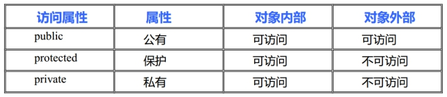

  struct和class的区别?
  **class默认**访问权限为**private**，**struct**默认访问权限为**public**

### 4.1.3 将成员变量设置为private

1.  可赋予客户端访问数据的一致性。

如果成员变量不是public，客户端唯一能够访问对象的方法就是通过成员函数。如果类中所有public权限的成员都是函数，客户在访问类成员时只会默认访问函数，不需要考虑访问的成员需不需要添加(),这就省下了许多搔首弄耳的时间。

2.  可细微划分访问控制。

使用成员函数可使得我们对变量的控制处理更加精细。如果我们让所有的成员变量为public，每个人都可以读写它。如果我们设置为private，我们可以实现"不准访问"、"只读访问"、"读写访问"，甚至你可以写出"只写访问"。


## 4.3 对象的构造和析构

### 4.3.1 初始化和清理

对象的初始化和清理也是两个非常重要的安全问题，一个对象或者变量没有初始时，对其使用后果是未知，同样的使用完一个变量，没有及时清理，也会造成一定的安全问题。c++为了给我们提供这种问题的解决方案，**构造函数**和**析构函数**，这两个函数将会被编译器**自动调用**，完成对象初始化和对象清理工作。

无论你是否喜欢，对象的初始化和清理工作是编译器强制我们要做的事情，即使你不提供初始化操作和清理操作，编译器也会给你增加默认的操作，只是这个默认初始化操作不会做任何事，所以编写类就应该顺便提供初始化函数。

### 4.3.1 构造函数和析构函数

**构造函数**主要作用在于**创建对象**时为对象的成员**属性赋值**，构造函数由编译器自动调用，无须手动调用。

**析构函数**主要用于**对象销毁**前系统自动调用，执行一些清理工作。

**构造函数语法：**

构造函数函数名和类名相同，没有返回值，不能有void，但可以有参数。

```
ClassName(){}
```

**析构函数语法：**

析构函数函数名是在类名前面加”~”组成,没有返回值，不能有void,不能有参数，不能重载。

```
~ClassName(){}
```


### 4.3.1 构造函数的分类及调用

-   按参数类型：分为无参构造函数和有参构造函数
-   按类型分类：普通构造函数和拷贝构造函数(复制构造函数)

**构造函数调用规则**

- 默认情况下，c++编译器至少为我们写的类增加3个函数
  1. 默认构造函数(无参，函数体为空)
  2. 默认析构函数(无参，函数体为空)
  3. 默认拷贝构造函数，对类中非静态成员属性简单值拷贝

- 如果用户定义拷贝构造函数，c++不会再提供任何默认构造函数
- 如果用户定义了普通构造(非拷贝)，c++不在提供默认无参构造，但是会提供默认拷贝构造

构造函数定义

```
//1.无参构造函数
    Person(){
		mAge = 0;
	}
//2.有参构造函数
	Person(int age){
		mAge = age;
	}
//3.拷贝构造函数，使用另一个对象初始化本对象
	Person(const Person& person){
		mAge = person.mAge;
	}
```

构造函数的调用

```
//1.调用无参构造函数
	Person person1; 
	//Person person2();错误调用,对象名不需要括号
//2. 调用有参构造函数
	//第一种 括号法，最常用
	Person person01(100);
	//第二种 匿名对象(显示调用构造函数)
	Person(200); //匿名对象，没有名字的对象
	//第三种 =号法 隐式转换
	Person person04 = 100; //Person person04 =  Person(100)
//3.调用拷贝构造函数
	Person person02(person01);
	Person person05 = person04; //Person person05 =  Person(person04)
```

 a0为A的实例化对象,A a1 = A(a0) 和 A(a0)的区别？
   当A(a0) 有变量来接的时候，那么编译器认为他是一个匿名对象，当没有变量来接的时候，编译器认为你A(a0) 等价于 A a0

### 4.3.2 拷贝构造函数的调用时机

- **对象**以**值传递**的方式**传**给函数**参**数
- 函数**局部对象**以值传递的方式从**函数返回**(vs debug模式下调用一次拷贝构造，qt不调用任何构造)
- 用一个**对象初始化**另一个**对象**

```
1. 旧对象初始化新对象
	Person p(10); // 有参
	Person p1(p); // 拷贝，初始化新对象
	Person p2 = Person(p); // 拷贝
	Person p3 = p; // 拷贝 // 相当于Person p2 = Person(p);
2. 传递的参数是普通对象，函数参数也是普通对象，传递将会调用拷贝构造
	void doBussiness(Person p){} // 值传递传参
	doBussiness(p);
3. 函数返回局部对象
	Person MyBusiness(){
	Person p(10);
	return p; // 返回局部变量
	}
```


### 4.3.4 深拷贝和浅拷贝

#### 4.3.4.1 浅拷贝

同一类型的对象之间可以赋值，使得两个对象的成员变量的值相同，两个对象仍然是独立的两个对象，这种情况被称为**浅拷贝**

一般情况下，浅拷贝没有任何副作用，但是当类中有指针，并且指针指向**动态分配**的内存空间，析构函数做了动态内存释放的处理，会导致内存问题。

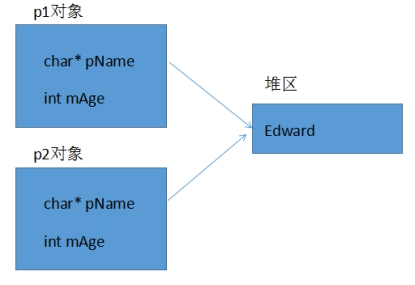

#### 4.3.4.2 深拷贝

当类中有指针，并且此指针有**动态分配**空间，**析构**函数做了**释放**处理，往往需要自定义拷贝构造函数，自行给指针动态分配空间，深拷贝。

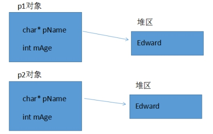

### 4.3.4 多个对象构造和析构

#### 4.3.4.1 构造函数初始化列表

构造函数和其他函数不同，除了有名字，参数列表，函数体之外还有初始化列表。

构造函数初始化列表简单使用:

> 	//构造函数初始化列表方式初始化
> 	Person(int a, int b, int c):mA(a),mB(b),mC(c){ }

  **注意：**初始化成员列表(参数列表)只能在构造函数使用。

#### 4.3.4.2 类对象作为成员

在类中定义的数据成员一般都是基本的数据类型。但是**类**中的**成员**也可以是**对象**，叫做**对象成员**。

C++中对对象的初始化是非常重要的操作，当创建一个对象的时候，c++编译器必须确保调用了所有子对象的构造函数。如果所有的子对象有默认构造函数，编译器可以自动调用他们。但是如果子对象没有默认的构造函数，或者想指定调用某个构造函数怎么办？

那么是否可以在类的构造函数直接调用子类的属性完成初始化呢？但是如果子类的成员属性是私有的，我们是没有办法访问并完成初始化的。

解决办法非常简单：对于子类调用构造函数，c++为此提供了专门的语法，即构造函数初始化列表。

当调用构造函数时，首**先按**各**对象成员**在类**定义**中的**顺序**（和参数列表的顺序无关）依次调用它们的**构造**函数，对这些对象初始化，最后再调用本身的函数体。也就是说，**先**调用**对象成员**的**构造**函数，**再**调用**本身**的**构造**函数。

析构函数和构造函数调用顺序相反，先构造，后析构。

### 4.3.5 explicit关键字

c++提供了关键字explicit，**禁止**通过**构造函数**进行的**隐式转换**。声明为explicit的构造函数不能在隐式转换中使用。

> ```
> explicit MyString(int n){ }
> ```

explicit注意
explicit用于修饰构造函数,防止隐式转化。
是针对单参数的构造函数(或者除了第一个参数外其余参数都有默认值的多参构造)而言。

### 4.3.6 动态对象创建

当我们创建数组的时候，总是需要提前预定数组的长度，然后编译器分配预定长度的数组空间，在使用数组的时，会有这样的问题，数组也许空间太大了，浪费空间，也许空间不足，所以对于数组来讲，如果能根据需要来分配空间大小再好不过。

所以动态的意思意味着不确定性。

为了解决这个普遍的编程问题，在运行中可以创建和销毁对象是最基本的要求。当然c早就提供了动态内存分配（dynamic memory allocation）,函数malloc和free可以在运行时从堆中分配存储单元。

然而这些函数在c++中不能很好的运行，因为它不能帮我们完成对象的初始化工作。

#### 4.3.6.1 对象创建

当创建一个c++对象时会发生两件事:

1.  为对象分配内存

2.  调用构造函数来初始化那块内存

#### 4.3.6.2 C动态分配内存方法

为了在运行时动态分配内存，c在他的标准库中提供了一些函数,malloc以及它的变种calloc和realloc,释放内存的free,这些函数是有效的、但是原始的，需要程序员理解和小心使用。

> 问题：
> 1)程序员必须确定对象的长度。
> 2)malloc返回一个`void*`指针，c++不允许将`void*`赋值给其他任何指针，必须强转。
> 3)malloc可能申请内存失败，所以必须判断返回值来确保内存分配成功。
> 4)用户在使用对象之前必须记住对他初始化，构造函数不能显示调用初始化(构造函数是由编译器调用)，用户有可能忘记调用初始化函数。

c的动态内存分配函数太复杂，容易令人混淆，是不可接受的，c++中我们推荐使用运算符new 和 delete.

#### 4.3.6.3 new operator 

C++中解决**动态内存分配**的方案是把创建一个对象所需要的操作都结合在一个称为new的运算符里。当用**new**创建一个对象时，它就在堆里为对象**分配内存**并调用**构造函数**完成初始化。

```
Person* person1 = new Person;
delete person1;
```

New操作符能确定在调用构造函数初始化之前内存分配是成功的，所有不用显式确定调用是否成功。

只需要一个简单的表达式，它带有内置的长度计算、类型转换和安全检查。这样在堆创建一个对象和在栈里创建对象一样简单。

#### 4.3.6.4 delete operator

new表达式的反面是delete表达式。delete表达式先调用**析构**函数，然后**释放内存**。正如new表达式返回一个指向对象的指针一样，delete需要一个对象的地址。

delete只适用于由new创建的对象。

如果使用一个由malloc或者calloc或者realloc创建的对象使用delete,这个行为是未定义的。因为大多数new和delete的实现机制都使用了malloc和free,所以很可能没有调用析构函数就释放了内存。

如果正在删除的对象的指针是NULL,将不发生任何事，因此建议在删除指针后，立即把指针赋值为NULL，以免对它删除两次，对一些对象删除两次可能会产生某些问题。

#### 4.3.6.5 用于数组的new和delete

使用new和delete在堆上创建数组

```
//创建字符数组
char* pStr = new char[100];
//创建整型数组
int* pArr1 = new int[100]; 
//创建整型数组并初始化
int* pArr2 = new int[10]{ 1, 2, 3, 4, 5, 6, 7, 8, 9, 10 };

//释放数组内存
delete[] pStr;
delete[] pArr1;
delete[] pArr2;
```

当创建一个对象数组的时候，必须对数组中的每一个对象调用构造函数，除了在栈上可以聚合初始化，必须提供一个默认的构造函数。??

如果在new表达式中使用[]，必须在相应的delete表达式中也使用[].如果在new表达式中不使用[], 一定不要在相应的delete表达式中使用[].

#### 4.3.6.6 delete void\*可能会出错

如果对一个void\*指针执行delete操作，这将可能成为一个程序错误，除非指针指向的内容是非常简单的，因为它将不执行析构函数。

```
void* person = new Person("john",20); // void*指针
delete person; // 不执行析构函数??
```


### 4.3.7 static静态成员

在类定义中，它的成员（包括成员变量和成员函数），这些成员可以用关键字static声明为静态的，称为静态成员。

不管这个类创建了多少个对象，**静态成员**只有一个拷贝，这个拷贝被所有**属于**这个**类**的对象共享。

#### 4.3.7.1 静态成员变量

在一个类中，若将一个成员变量声明为static，这种成员称为静态成员变量。与一般的数据成员不同，无论建立了多少个对象，都只有一个静态数据的拷贝。静态成员变量，属于某个类，所有对象共享。

静态变量，是在**编译**阶段就**分配空间**，**对象还没有创建**时，就已经分配空间。

- *静态成员变量**必须在**类中声明**，在**类外定义**。
- 静态数据成员**属于类**不属于某个对象，在为对象分配空间中不包括静态成员所占空间。
- 静态数据成员可以通过**类名**或者**对象名**来**引用**。

#### 4.3.7.2 静态成员函数

在类定义中，前面有static说明的成员函数称为静态成员函数。静态成员函数使用方式和静态变量一样，同样在对象没有创建前，即可通过类名调用。静态成员函数主要为了访问静态变量，但是，**不能访问普通成员变量**。

静态成员函数的意义，不在于信息共享，数据沟通，而在于**管理静态数据成员**，完成对静态数据成员的封装。

-   **静态成员函数只能访问静态变量，不能访问普通成员变量**

-   静态成员函数的使用和静态成员变量一样

-   静态成员函数也有访问权限

-   普通成员函数可访问静态成员变量、也可以访问非经常成员变量

#### 4.3.7.3 static const常静态成员属性

如果一个类的成员，既要实现共享，又要实现不可改变，那就用 static const 修饰。**定义静态const数据成员时，最好在类内部初始化**。

```
class Person{
public:
	// static const int mShare = 10;
	const static int mShare = 10; // 只读区，不可修改
};
```


## 4.4 C++面向对象模型初探

### 4.4.1 成员变量和函数的存储

C++类对象中的变量(**属性**)和函数(**方法**)是**分开存储**的。

-   c++中的**非静态数据成员**直接内含在**类对象**中。
-   成员函数虽然内含在class声明之内，却不出现在对象中。
-   每一个非内联成员函数只会诞生一份函数实例。

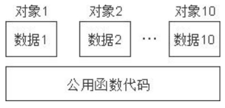

### 4.4.2 this指针

#### 4.4.2.1 this指针工作原理

c++的数据和操作也是分开存储，并且每一个非内联成员函数(non-inline member function)只会诞生一份函数实例，也就是说多个同类型的对象会共用一块代码。那么问题是：这一块代码是如何区分那个对象调用自己的呢？

c++通过提供特殊的对象指针，this指针，解决上述问题。this指针指向被调用的成员函数所属的对象。

　 c++规定，**this指针**是隐含在对象**成员函数内**的一种指针。当一个对象被创建后，它的**每一个成员函数**都含有一个系统自动生成的**隐含指针this**，用以保存这个对象的地址，也就是说虽然我们没有写上this指针，编译器在编译的时候也是会加上的。因此this也称为"指向本对象的指针"，this指针并不是对象的一部分，不会影响sizeof(对象)的结果。

  **this指针永远指向当前对象。**

成员函数通过this指针即可知道操作的是那个对象的数据。This指针是一种隐含指针，它隐含于每个类的非静态成员函数中。This指针无需定义，直接使用即可。

  注意：**静态成员函数**内部**没有this指针**，静态成员函数**不能操作非静态成员变量**。


#### 4.4.2.2 this指针的使用

-   当形参和成员变量**同名**时，可用this指针来区分类内属性

-   在类的非静态成员函数中**返回对象本身**，可使用`return *this`


### 4.4.2.3 const常成员函数

-   const常成员函数，const修饰this指针指向的内存区域，成员函数体内**不可以修改**本**类中**的任何**普通成员变量**

-   当成员变量类型符前用mutable修饰时例外。

> ```
> class Person{
> public:
> 	//在函数括号后面加上const,修饰成员变量不可修改,除了mutable变量
> 	void sonmeOperate() const{ // const常成员函数
> 		//this->mAge = 200; //非mutable变量不可修改
> 		this->mID = 10; // mutable变量
> 	}
> private:
> 	int mAge;
> 	mutable int mID; // mutable变量
> };
> ```

### 4.4.2.4 const修饰对象(常对象)

-   **常对象只能调用const常成员函数**

-   常对象**可访问** const 或非 const **数据成员**，**不能修改**，除非成员用mutable修饰

> ```
> 	const Person person; // 常对象
> ```

## 4.5 友元

类的主要特点之一是数据隐藏，即类的私有成员无法在类的外部(作用域之外)访问。但是，有时候需要在类的外部访问类的私有成员，怎么办？

解决方法是使用友元函数，友元函数是一种特权函数，c++允许这个特权函数访问私有成员。这一点从现实生活中也可以很好的理解：

比如你的家，有客厅，有你的卧室，那么你的客厅是Public的，所有来的客人都可以进去，但是你的卧室是私有的，也就是说只有你能进去，但是呢，你也可以允许你的闺蜜好基友进去。

程序员可以把一个全局函数、某个类中的成员函数、甚至整个类声明为友元。

### 4.5.1 友元语法

-   friend关键字只出现在声明处

-   其他类、类成员函数、全局函数都可声明为友元

-   友元函数不是类的成员，不带this指针

-   友元函数可访问对象任意成员属性，包括私有属性

> ```
> class Building; // 前向声明
> //友元类
> class MyFriend{
> public:
> 	//友元成员函数
> 	void LookAtBedRoom(Building& building);
> };
> //友元全局函数
> void CleanBedRoom(Building& building){}
> 
> // 声明友元
> class Building{
> 	//全局函数做友元函数
> 	friend void CleanBedRoom(Building& building);
> 	//成员函数做友元函数
> 	friend void MyFriend::LookAtBedRoom(Building& building);
> 	//友元类
> 	friend class MyFriend;
> public:
> 	Building();
> }
> ```

 [友元类注意]

1. 友元关系**不能被继承**。
2. 友元关系是**单向**的，类A是类B的朋友，但类B不一定是类A的朋友。
3. 友元关系**不具有传递性**。类B是类A的朋友，类C是类B的朋友，但类C不一定是类A的朋友。


## 4.6 运算符重载

### 4.6.1 运算符重载基本概念

运算符重载，就是对已有的运算符重新进行定义，赋予其另一种功能，以适应不同的数据类型。

运算符重载(operator overloading)只是一种”语法上的方便”,也就是它只是另一种函数调用的方式。

在c++中，可以定义一个处理类的新运算符。这种定义很像一个普通的函数定义，只是函数的名字由**关键字operator**及其紧跟的运算符组成。差别仅此而已。它像任何其他函数一样也是一个函数，当编译器遇到适当的模式时，就会调用这个函数。

**语法：**

  定义重载的运算符就像定义函数，只是该函数的名字是operator@,这里的@代表了被重载的运算符。函数的参数中参数个数取决于两个因素。

- 运算符是一元(一个参数)的还是二元(两个参数)；
- 运算符被定义为**全局函数**(对于一元是一个参数，对于二元是两个参数)，还是**成员函数**(对于一元没有参数，对于二元是一个参数–此时该**类的对象**用作**左参**数)


### 4.6.2 运算符重载碰上友元函数

友元函数是一个全局函数，和我们上例写的全局函数类似，只是友元函数可以访问某个类私有数据。

案例: 重载左移操作符(<<),使得cout可以输出对象。

```
class Person{
	friend ostream& operator<<(ostream& os, Person& person); // 声明友元
private:
	int mID;
	int mAge;
}

// 重载<<全局函数
ostream& operator<<(ostream& os, Person& person){
	os << "ID:" << person.mID << " Age:" << person.mAge;
	return os;
}
```


### 4.6.3 可重载的运算符

几乎C中所有的运算符都可以重载，但运算符重载的使用时相当受限制的。特别是不能使用C中当前没有意义的运算符(例如用\*\*求幂)不能改变运算符优先级，不能改变运算符的参数个数。

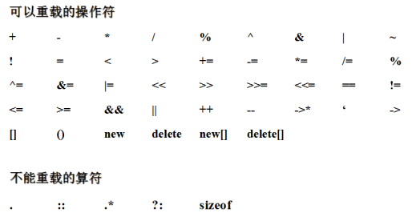

### 4.6.4 自增自减(++/--)运算符重载

重载的++和--运算符有点让人不知所措，因为我们总是希望能根据它们出现在所作用对象的前面还是后面来调用不同的函数。解决办法很简单，例如当编译器看到++a(**前置++**)，它就调用`operator++(a)`,当编译器看到a++（**后置++**），它就会去调用`operator++(a,int)`

```
public:
//重载前置++
	Complex& operator++(){
		mA++;
		mB++;
		return *this;
	}
//重载后置++
	Complex operator++(int){	
		Complex temp; // 后置需要临时对象
		temp.mA = this->mA;
		temp.mB = this->mB;
		mA++;
		mB++;
		return temp;
	}
```

  优先使用++和--的标准形式，优先调用前置++。

  如果定义了++a，也要定义a++，递增操作符比较麻烦，因为他们都有前缀和后缀形式，而两种语义略有不同。重载operator++和operator--时应该模仿他们对应的内置操作符。

  对于++和--而言，后置a++形式是先返回，然后对象++或者--，返回的是对象的原值。前置++a形式，对象先++或--，返回当前对象，返回的是新对象。

调用代码时候，要优先使用前置形式，除非确实需要后缀形式返回的原值，前缀和后缀形式语义上是等价的，输入工作量也相当，只是效率经常会略高一些，由于前置形式少创建了一个临时对象。

### 4.6.5 指针运算符(\*、-&gt;)重载

```
class SmartPointer{
public:
	SmartPointer(Person* person){
		this->pPerson = person;
	}
//重载指针的->操作符
	Person* operator->(){
		return pPerson;
	}
//重载指针的*操作符
	Person& operator*(){
		return *pPerson;
	}
	~SmartPointer(){
		if (pPerson != NULL){
			delete pPerson;
		}
	}
public:
	Person* pPerson;
};
```


### 4.6.6 赋值(=)运算符重载

```
public:
	//重载赋值运算符
	Person& operator=(const Person& person){
		this->mID = person.mID;
		this->mAge = person.mAge;
		return *this;
	}
```

```
void test01(){
	Person person1(10, 20);
	Person person2 = person1; //调用拷贝构造
	//person2从已有的person1来初始化创建，调用拷贝构造函数
	person2 = person1; //调用重载operator=函数
	//person2已经创建，不需要再调用构造函数，调用重载的赋值运算符
}
```

如果没有重载赋值运算符，编译器会**自动**创建默认的赋值运算符**重载**函数。行为类似默认拷贝构造，进行**简单值拷贝**。

### 4.6.7 等于和不等于(==、!=)运算符重载

```
public:
//重载==号操作符
	bool operator==(const Complex& complex){
		if (strcmp(this->pName,complex.pName) == 0 && 
		    this->mID == complex.mID && 
			this->mAge == complex.mAge){
			return true;
		}
		return false;
	}
//重载!=操作符
	bool operator!=(const Complex& complex){
		if (strcmp(this->pName, complex.pName) != 0 || 
		    this->mID != complex.mID || 
			this->mAge != complex.mAge){
			return true;
		}
		return false;
	}
```


### 4.6.8 函数调用符号()重载

```
class Complex{
public:
	int Add(int x,int y){
		return x + y;
	}
	int operator()(int x,int y){
		return x + y;
	}
};
void test01(){
	Complex complex;
	// 对象调用类方法
	cout << complex.Add(10,20) << endl;
	// 对象当做函数来调用 // 重载()
	cout << complex(10, 20) << endl;
}
```


### 4.6.9 不要重载&&、||

不能重载operator&& 和 operator|| 的原因是，无法实现短路规则。说得更具体一些，内置版本版本特殊之处在于：内置版本的&&和||首先计算左边的表达式，如果这完全能够决定结果，就无需计算右边的表达式了，而且能够保证不需要。我们都已经习惯这种方便的特性了。


### 4.6.10 符号重载总结

- =, [], () 和 -> 操作符只能通过**成员函数**进行重载 
- << 和 >>只能通过**全局**函数配合**友元**函数进行重载 
- 不要重载 && 和 || 操作符，因为无法实现**短路**规则

常规建议

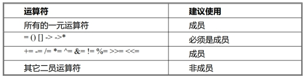


运算符和结合性


### 4.7 继承和派生

### 4.7.1 继承概述

#### 4.7.1.2 继承基本概念

c++最重要的特征是代码重用，通过继承机制可以利用已有的数据类型来定义新的数据类型，新的类不仅拥有旧类的成员，还拥有新定义的成员。

一个B类继承于A类，或称从类A派生类B。这样的话，类A成为基类（父类）， 类B成为派生类（子类）。

派生类中的成员，包含两大部分：

- 一类是从基类继承过来的，一类是自己增加的成员。
- 从基类继承过过来的表现其共性，而新增的成员体现了其个性。

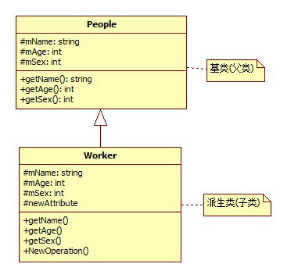

#### 4.7.1.3 派生类定义

**派生类定义格式：**

```
Class 派生类名 :  继承方式 基类名 {
         //派生类新增的数据成员和成员函数
}
```

三种继承方式：

- public ： 公有继承
- private ： 私有继承
- protected ： 保护继承

从继承源上分：

- 单继承：指每个派生类只直接继承了一个基类的特征
- 多继承：指多个基类派生出一个派生类的继承关系,多继承的派生类直接继承了不止一个基类的特征

### 4.7.2 派生类访问控制

派生类继承基类，派生类拥有基类中全部成员变量和成员方法（**除了构造和析构**之外的成员方法），但是在派生类中，继承的成员并不一定能直接访问，不同的继承方式会导致不同的访问权限。

派生类的访问权限规则如下：

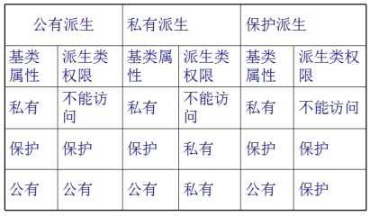

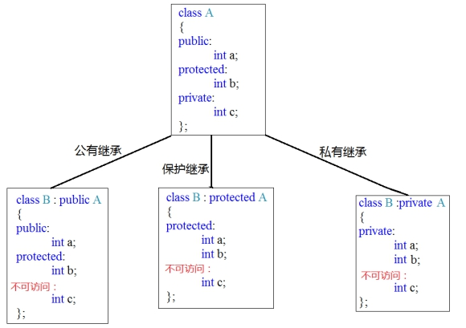

### 4.7.3 继承中的构造和析构

#### 4.7.3.2 对象构造和析构的调用原则

**继承中的构造和析构**

- 子类对象在创建时会首**先**调用**父类**的**构造**函数
- 父类构造函数执行完毕后，才会调用**子类**的**构造**函数
- 当**父类构造**函数**有参数**时，需要在**子类初始化列表**(参数列表)中**显示调用父类构造**函数
- 析构函数调用顺序和构造函数相反

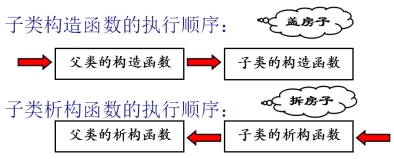


**继承与组合混搭的构造和析构**

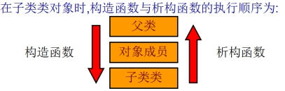

先构造父类，如果有嵌套类则优先构造嵌套类，最后构造当前最后子类

### 4.7.3 继承中同名成员的处理方法

- 当子类成员和父类成员同名时，子类依然从父类继承同名成员（占据空间），但是被隐藏了
- 如果子类有成员和父类同名，子类访问其成员默认访问子类的成员(本作用域，就近原则)，子类同名覆盖父类
- 在子类通过类名限定符声明作用域`父类::`调用同名父类成员(在派生类中要使用基类的同名成员，显式使用类名限定符)

重新定义基类中的一个**重载**函数，原来基类的函数将被隐藏，（重载）

### 4.7.4 非自动继承的函数

不是所有的函数都能自动从基类继承到派生类中。构造函数和析构函数用来处理对象的创建和析构操作，构造和析构函数只知道对它们的特定层次的对象做什么，也就是说**构造**函数和**析构**函数**不能被继承**，必须为每一个特定的派生类分别创建。

另外**operator=**也不能被继承，因为它完成类似构造函数的行为。也就是说尽管我们知道如何由=右边的对象如何初始化=左边的对象的所有成员，但是这个并不意味着对其派生类依然有效。

在继承的过程中，如果没有创建这些函数，编译器会**自动生成**它们。

### 4.7.5 继承中的静态成员特性

静态成员函数和非静态成员函数的共同点:

1. 他们都可以被继承到派生类中。
2. 如果重新定义一个静态成员函数，所有在基类中的其他重载函数会被隐藏。（重名覆盖，包括重载也被覆盖隐藏）
3. 如果我们改变基类中一个函数的特征，所有使用该函数名的基类版本都会被隐藏。

静态成员函数不能是虚函数（virtual function）.


### 4.7.6 多继承

#### 4.7.6.1 多继承概念

我们可以从一个类继承，我们也可以能同时从多个类继承，这就是多继承。但是由于多继承是非常受争议的，从多个类继承可能会导致函数、变量等同名导致较多的歧义。

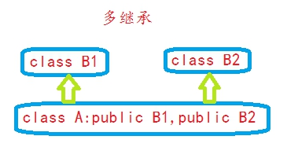

多继承会带来一些二义性的问题， 如果两个基类中有同名的函数或者变量，通过`类名::`显式指定调用哪个基类的版本。

#### 4.7.6.2 菱形继承和虚继承

两个派生类继承同一个基类而又有某个类同时继承者两个派生类，这种继承被称为菱形继承。

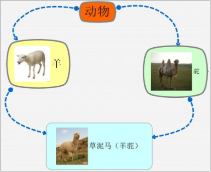

这种继承所带来的问题：

1. 羊继承了动物的数据和函数，鸵同样继承了动物的数据和函数，当草泥马调用函数或者数据时，就会产生**二义性**。
2. 草泥马继承自动物的函数和数据**重复继承**了两份数据，其实我们只需要一份就可以。

对于这种菱形继承所带来的两个问题，c++为我们提供了一种方式，采用**虚继承**方式**虚基类**。那么我们采用虚基类方式将代码修改如下：

```
class Base1 : virtual public BigBase{};
class Base2 : virtual public BigBase{};
class Derived : public Base1, public Base2{};
```

以上程序Base1 ，Base2采用**虚继承**方式继承BigBase,那么BigBase被称为虚基类。

通过`virtual`虚继承解决了菱形继承所带来的二义性问题。

#### 4.7.6.3 虚继承实现原理

当使用虚继承时，虚基类是被共享的，也就是在继承体系中无论被继承多少次，对象内存模型中均只会出现一个虚基类的子对象（这和多继承是完全不同的）。即使共享虚基类，但是必须要有一个类来完成基类的初始化（因为所有的对象都必须被初始化，哪怕是默认的），同时还不能够重复进行初始化，那到底谁应该负责完成初始化呢？C++标准中选择在**每一次继承子类**中都**必须**书**写初始化**语句（因为每一次继承子类可能都会用来定义对象），但是虚基类的初始化是由**最后的子类**完成**初始化**，**其他**的初始化语句都**不会调用**。

```
class BigBase{
public:
	BigBase(int x){mParam = x;}
public:
	int mParam;
};

class Base1 : virtual public BigBase{ // 虚继承
public:
	Base1():BigBase(10){ } //不立即调用BigBase构造
};

class Base2 : virtual public BigBase{ // 虚继承
public:
	Base2():BigBase(10){ } //不立即调用BigBase构造
};

class Derived : public Base1, public Base2{ // 多继承
public:
	Derived():BigBase(10){ } //调用BigBase构造
};
//每一次继承子类中都必须书写初始化语句，虽然不一定会被调用
```

**注意：**

工程开发中真正意义上的多继承是几乎不被使用，因为多重继承带来的代码复杂性远多于其带来的便利，多重继承对代码维护性上的影响是灾难性的，在设计方法上，任何多继承都可以用单继承代替。

## 4.8 多态

### 4.8.1 多态基本概念

多态是面向对象程序设计语言中数据抽象和继承之外的第三个基本特征。

多态性(polymorphism)提供**接口**与具体**实现**之间的另一层**隔离**，从而将”what”和”how”分离开来。多态性改善了代码的可读性和组织性，同时也使创建的程序具有可扩展性，项目不仅在最初创建时期可以扩展，而且当项目在需要有新的功能时也能扩展。

c++支持**编译时**多态(静态多态)和**运行时**多态(动态多态)，运算符重载和函数重载就是编译时多态，而派生类和虚函数实现运行时多态。

静态多态和动态多态的区别就是函数地址是早绑定(静态联编)还是晚绑定(动态联编)。如果函数的调用，在编译阶段就可以确定函数的调用地址，并产生代码，就是静态多态(编译时多态)，就是说地址是早绑定的。而如果函数的调用地址不能编译不能在编译期间确定，而需要在运行时才能决定，这这就属于晚绑定(动态多态,运行时多态)。


### 4.8.2 向上类型转换

对象可以作为自己的类或者作为它的基类的对象来使用。还能通过基类的地址来操作它。取一个对象的地址(指针或引用)，并将其作为基类的地址来处理，这种称为向上类型转换。

也就是说：父类引用或指针可以指向子类对象，通过父类指针或引用来操作子类对象。

#### 4.8.2.1 问题解决方案(虚函数,vitual function)

C++动态多态性是通过虚函数来实现的，虚函数允许子类（派生类）重新定义父类（基类）成员函数，而子类（派生类）重新定义父类（基类）虚函数的做法称为覆盖(override)，或者称为**重写**。

对于特定的函数进行动态绑定，c++要求在基类中声明这个函数的时候使用virtual关键字,动态绑定也就对virtual**虚函数**起作用。

- 为创建一个需要动态绑定的**虚成员函数**，可以简单在这个函数声明前面加上virtual关键字，定义时候不需要.
- 如果一个成员函数被声明为virtual，那么在所有派生类中它都是virtual虚函数.
- 在派生类中virtual函数的重定义称为重写(override).
- Virtual关键字只能修饰成员函数.
- 构造函数不能为虚函数

```
class Animal{
public:
// 虚函数
	virtual void speak(){
		cout << "动物在唱歌..." << endl;
	}
};
```

 **注意:** 仅需要在基类中声明一个函数为virtual.调用所有匹配基类声明行为的派生类函数都将使用虚机制。虽然可以在派生类声明前使用关键字virtual(这也是无害的)，但这个样会使得程序显得冗余和杂乱。

### 4.8.3 C++如何实现动态绑定

问题:C++的动态捆绑机制是怎么样的？

首先，我们看看编译器如何处理虚函数。当编译器发现我们的类中有虚函数的时候，编译器会创建一张虚函数表，把虚函数的函数入口地址放到虚函数表中，并且在类中秘密增加一个指针，这个指针就是vpointer(缩写vptr)，这个指针是指向对象的虚函数表。在多态调用的时候，根据vptr指针，找到虚函数表来实现动态绑定。

在编译阶段，编译器秘密增加了一个vptr指针，但是此时vptr指针并没有初始化指向虚函数表(vtable),什么时候vptr才会指向虚函数表？在对象构建的时候，也就是在对象初始化调用构造函数的时候。编译器首先默认会在我们所编写的每一个构造函数中，增加一些vptr指针初始化的代码。如果没有提供构造函数，编译器会提供默认的构造函数，那么就会在默认构造函数里做此项工作，初始化vptr指针，使之指向本对象的虚函数表。

起初，子类继承基类，子类继承了基类的vptr指针，这个vptr指针是指向基类虚函数表，当子类调用构造函数，使得子类的vptr指针指向了子类的虚函数表。


  **多态的成立条件：**

- 有继承
- 子类重写父类虚函数函数

  a\) 返回值，函数名字，函数参数，必须和父类完全一致(析构函数除外)

  b\) 子类中virtual关键字可写可不写，建议写

- 类型兼容，父类指针，父类引用 指向 子类对象

### 4.8.4 抽象基类和纯虚函数(pure virtual function)

在设计时，常常希望基类仅仅作为其派生类的一个接口。这就是说，仅想对基类进行向上类型转换，使用它的接口，而不希望用户实际的创建一个基类的对象。同时创建一个纯虚函数允许接口中放置成员原函数，而不一定要提供一段可能对这个函数毫无意义的代码。

在基类中加入至少一个**纯虚函数**(pure virtual function),使得基类称为**抽象类**(abstract class).

- 纯虚函数使用关键字virtual，并在其后面加上=0。如果试图去实例化一个抽象类，编译器则会阻止这种操作。
- 当继承一个抽象类的时候，必须实现所有的纯虚函数，否则由抽象类派生的类也是一个抽象类。
- Virtual void fun() = 0;告诉编译器在vtable中为函数保留一个位置，但在这个特定位置不放地址。

```
// 抽象基类
class People{
public:
// 纯虚函数
	virtual void showName() = 0;
}
```

 **建立公共接口目的**是为了将子类公共的操作抽象出来，可以通过一个公共接口来操纵一组类，且这个公共接口不需要事先(或者不需要完全实现)。可以创建一个公共类.

### 4.8.5 纯虚函数和多继承

多继承带来了一些争议，但是接口继承可以说一种毫无争议的运用了。

绝大数面向对象语言都不支持多继承，但是绝大数面向对象对象语言都支持接口的概念，**c++**中**没有接口**的概念，但是可以通过纯虚函数实现接口。

接口类中只有函数原型定义，没有任何数据定义。

多重继承接口不会带来二义性和复杂性问题。接口类只是一个功能声明，并不是功能实现，子类需要根据功能说明定义功能实现。

**注意:除了析构函数外，其他声明都是纯虚函数。**

### 4.8.6 虚析构函数

#### 4.8.6.1 虚析构函数作用

虚析构函数是为了解决基类的指针指向派生类对象，并**用基类的指针删除派生类对象**。

```
class People{
public:
// 虚析构函数
	virtual ~People(){
		cout << "析构函数 People!" << endl;
	}
};
```

#### 4.8.6.2 纯虚析构函数

纯虚析构函数在c++中是合法的，但是在使用的时候有一个额外的限制：必须为纯虚析构函数提供一个函数体。

```
class B{
public:
//纯析构函数
	virtual ~B() = 0;
};
```

纯虚析构函数和非纯析构函数之间唯一的不同之处在于纯虚析构函数使得基类是**抽象类**，不能创建基类的对象。

如果类的目的不是为了实现多态，作为基类来使用，就不要声明虚析构函数，反之，则应该为类声明虚析构函数。

### 4.8.7 重写 重载 重定义

- 重载，同一作用域的同名函数
  1. 同一个作用域
  2. 参数个数，参数顺序，参数类型不同
  3. 和函数返回值，没有关系
  4. const也可以作为重载条件 //do(const Teacher& t){} do(Teacher& t){}

- 重定义（隐藏）
  1. 有继承
  2. 子类（派生类）重新定义父类（基类）的**同名成员**（非virtual函数）

- 重写（覆盖）
  1. 有继承
  2. 子类（派生类）重写父类（基类）的virtual虚函数
  3. 函数返回值，函数名字，函数参数，必须和基类中的虚函数一致

```
class A{
public:
	//同一作用域下，func1函数重载
	void func1(int a){}
	void func1(int a,int b){}
	void func2(){}
	virtual void func3(){}
};

class B : public A{
public:
	//重定义基类的func2,隐藏了基类的func2方法
	void func2(){}
	//重写基类的func3函数，也可以覆盖基类func3
	virtual void func3(){}
};
```


### 4.8.8 指向类成员的指针

#### 4.8.8.1 指向成员变量的指针

定义格式

```
   <数据类型> <类名>::*<指针名>
   例如: int A::*pPram;
```

赋值/初始化

```
   <数据类型> <类名>::*<指针名> = &<类名>::<非静态数据成员>
   例如: int A::*pParam = &A::param;
```

解引用

```
   <类对象名>.*<非静态数据成员指针>
   <类对象指针>->*<非静态数据成员指针>
   例如: A a; 
        a.*pParam; 
        a->*pParam;
```


```
class A{
public:
	A(int param){
		mParam = param;
	}
public:
	int mParam;
};

void test(){
	A a1(100);
	int* p1 = &a1.mParam;
	cout << "*p1:" << *p1 << endl;
	
	// 定义并初始化指向成员变量的指针
	int A::*p2 = &A::mParam;
	cout << "a1.*p2:" << a1.*p2 << endl;
	
	A* a2 = new A(200);	
	cout << "a2->*p2:" << a2->*p2 << endl;
}
```


#### 4.8.8.2 指向成员函数的指针

定义指向成员变量的指针

```
   <返回类型> (<类名>::*<指针名>)（<参数列表>）
   例如: void (A::*pFunc)(int,int);
```

赋值/初始化

```
   <返回类型>（<类名>::*<指针名>）（<参数列表>）  = &<类名>::<非静态数据函数>
   例如: void (A::pFunc)(int,int) = &A::func;
```

解引用

```
   （<类对象名>.*<非静态成员函数>）（<参数列表>）
   （<类对象指针>->*<非静态成员函数>）（<参数列表>）
   例如: A a; 
        (a.*pFunc)(10,20); 
        (a->*pFunc)(10,20);
```


```
class A{
public:
	int func(int a,int b){
		return a + b;
	}
};

void test(){
	A a1;
	A* a2 = new A;

	//定义并初始化成员函数指针
	int(A::*pFunc)(int, int) = &A::func;
	//指针解引用
	cout << "(a1.*pFunc)(10,20):" << (a1.*pFunc)(10, 20) << endl;
	cout << "(a2->*pFunc)(10,20):" << (a2->*pFunc)(10, 20) << endl;
}
```


#### 4.8.8.3 指向静态成员的指针

- 指向类静态数据成员的指针
  指向静态数据成员的指针的定义和使用与**普通指针**相同，在定义时无须和类相关联，在使用时也无须和具体的对象相关联。
- 指向类静态成员函数的指针
  指向静态成员函数的指针的定义和使用与**普通指针**相同，在定义时无须和类相关联，在使用时也无须和具体的对象相关联·

```
class A{
public:
	static void dis(){ // 向类静态成员函数
		cout << data << endl;
	}
	static int data; // 类静态数据成员
};
int A::data = 100; // 类外初始化静态数据成员

void test(){
// 指向类静态数据成员的指针
	int *p = &A::data;
	cout << *p << endl;
// 指向类静态成员函数的指针
	void(*pfunc)() = &A::dis;
	pfunc();
}
```


