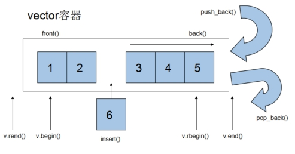
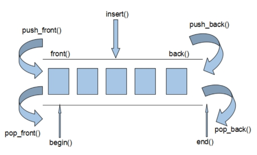
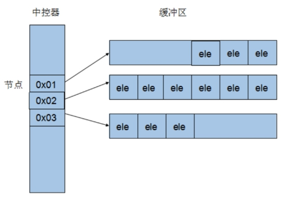
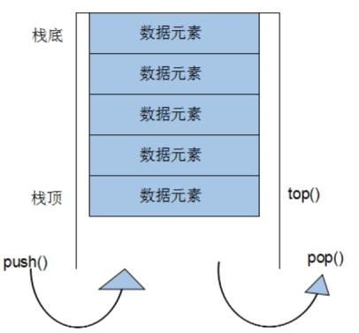
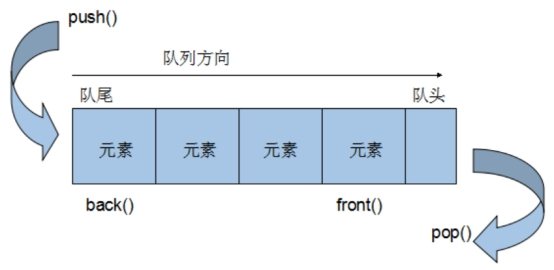
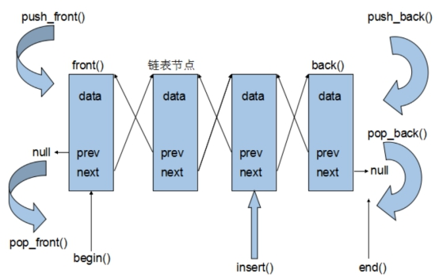
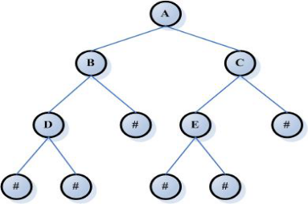
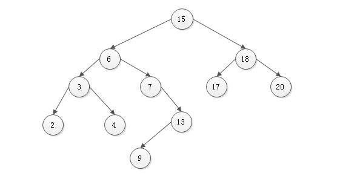
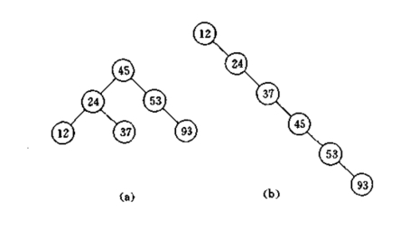

# STL(标准模板库)

# 1. STL概论

长久以来，软件界一直希望建立一种可重复利用的东西，以及一种得以制造出”可重复运用的东西”的方法,让程序员的心血不止于随时间的迁移，人事异动而烟消云散，从函数(functions)，类别(classes),函数库(function libraries),类别库(class libraries)、各种组件，从模块化设计，到面向对象(object oriented )，为的就是复用性的提升。

复用性必须建立在某种标准之上。但是在许多环境下，就连软件开发最基本的数据结构(data structures) 和算法(algorithm)都未能有一套标准。大量程序员被迫从事大量重复的工作，竟然是为了完成前人已经完成而自己手上并未拥有的程序代码，这不仅是人力资源的浪费，也是挫折与痛苦的来源。

为了建立数据结构和算法的一套标准，并且降低他们之间的耦合关系，以提升各自的独立性、弹性、交互操作性(相互合作性,interoperability),诞生了STL。

## 1.1 STL基本概念

STL(Standard Template Library,标准模板库)，是惠普实验室开发的一系列软件的统称。现在主要出现在 c++中，但是在引入 c++之前该技术已经存在很长时间了。STL 从广义上分为: 容器(container) 算法(algorithm) 迭代器(iterator),容器和算法之间通过迭代器进行无缝连接。STL 几乎所有的代码都采用了模板类或者模板函数，这相比传统的由函数和类组成的库来说提供了更好的代码重用机会。STL(Standard Template Library)标准模板库,在我们 c++标准程序库中隶属于 STL 的占到了 80%以上。

## 1.2 STL六大组件简介

STL提供了六大组件，彼此之间可以组合套用，这六大组件分别是:容器、算法、迭代器、仿函数、适配器（配接器）、空间配置器。

**容器：**各种数据结构，如vector、list、deque、set、map等,用来存放数据，从实现角度来看，STL容器是一种**类模板**class template。

**算法：**各种常用的算法，如sort、find、copy、for\_each。从实现的角度来看，STL算法是一种**函数模板**function tempalte。

**迭代器：**扮演了容器与算法之间的胶合剂，共有五种类型，从实现角度来看，迭代器是一种将operator\* , operator-&gt; , operator++,operator--等指针相关操作予以**重载的类模板**class template. 所有STL容器都附带有自己专属的迭代器，只有容器的设计者才知道如何遍历自己的元素。原生指针(native pointer)也是一种迭代器。

**仿函数：**行为类似函数，可作为算法的某种策略。从实现角度来看，仿函数是一种**重载**了operator()的class 或者class template。

**适配器：**一种用来修饰容器或者仿函数或迭代器接口的东西。

**空间配置器：**负责空间的配置与管理。从实现角度看，配置器是一个实现了**动态空间**配置、空间管理、空间释放的**类模板**class tempalte。

STL六大组件的**交互关系**，容器通过空间配置器取得数据存储空间，算法通过迭代器存储容器中的内容，仿函数可以协助算法完成不同的策略的变化，适配器可以修饰仿函数。

## 1.3 STL优点

-   STL 是 C++的一部分，因此不用额外安装什么，它被内建在你的编译器之内。

-   STL 的一个重要特性是将**数据和操作分离**。数据由容器类别加以管理，操作则由可定制的算法定义。迭代器在两者之间充当“粘合剂”,以使算法可以和容器交互运作。

-   程序员可以不用思考 STL 具体的实现过程，只要能够熟练使用 STL 就 OK 了。

-   STL 具有高可重用性，高性能，高移植性，跨平台的优点。
        **高可重用性**：STL 中几乎所有的代码都采用了模板类和模版函数的方式实现，这相比于传统的由函数和类组成的库来说提供了更好的代码重用机会。关于模板的知识，已经给大家介绍了。
        **高性能**：如 map 可以高效地从十万条记录里面查找出指定的记录，因为 map 是采用红黑树的变体实现的。
        **高移植性**：如在项目 A 上用 STL 编写的模块，可以直接移植到项目 B 上。

# 2. STL常用三大组件

## 2.1 容器

容器，置物之所也。

研究数据的特定排列方式，以利于搜索或排序或其他特殊目的，这一门学科我们称为数据结构。

几乎可以说，任何特定的数据结构都是为了实现某种特定的算法。**STL容器**就是将运用最广泛的一些**数据结构实现**出来。

常用的==**数据结构**==：数组(array)，链表(list)，tree(树)，栈(stack)，队列(queue)，集合(set)，映射表(map),根据数据在容器中的排列特性，这些数据分为**序列式容器**和**关联式容器**两种。

-   ==**序列式容器**==强调值的排序，序列式容器中的每个元素均有固定的位置，除非用删除或插入的操作改变这个位置。Vector容器、Deque容器、List容器等。

-   ==**关联式容器**==是非线性的树结构，更准确的说是二叉树结构。各元素之间没有严格的物理上的顺序关系，也就是说元素在容器中并没有保存元素置入容器时的逻辑顺序。关联式容器另一个显著特点是：在值中选择一个值作为关键字key，这个关键字对值起到索引的作用，方便查找。Set/multiset容器 Map/multimap容器。

## 2.2 算法

算法，问题之解法也。

以有限的步骤，解决逻辑或数学上的问题，这一门学科我们叫做算法(Algorithms)。

广义而言，我们所编写的每个程序都是一个算法，其中的每个函数也都是一个算法，毕竟它们都是用来解决或大或小的逻辑问题或数学问题。STL收录的算法经过了数学上的效能分析与证明，是极具复用价值的，包括常用的排序，查找等等。特定的算法往往搭配特定的数据结构，算法与数据结构相辅相成。

算法分为：质变算法和非质变算法。

**质变算法**：是指运算过程中会更改区间内的元素的内容。例如拷贝，替换，删除等等

**非质变算法**：是指运算过程中不会更改区间内的元素内容，例如查找、计数、遍历、寻找极值等等

## 2.3 迭代器

迭代器(iterator)是一种抽象的设计概念，现实程序语言中并没有直接对应于这个概念的实物。在《Design Patterns》一书中提供了23中设计模式的完整描述，其中iterator模式定义如下：提供一种方法，使之能够依序**寻访**某个**容器**所含的**各个元素**，而又无需暴露该容器的内部表示方式。

迭代器的设计思维-STL的关键所在，STL的中心思想在于将容器(container)和算法(algorithms)分开，彼此独立设计，最后再一贴胶着剂将他们撮合在一起。从技术角度来看，容器和算法的泛型化并不困难，c++的class template和function template可分别达到目标，如果设计出两这个之间的良好的胶着剂，才是大难题。

迭代器的种类:

| 输入迭代器     | 提供对数据的只读访问                                         | 只读，支持++、==、！=                   |
| -------------- | ------------------------------------------------------------ | --------------------------------------- |
| 输出迭代器     | 提供对数据的只写访问                                         | 只写，支持++                            |
| 前向迭代器     | 提供读写操作，并能向前推进迭代器                             | 读写，支持++、==、！=                   |
| 双向迭代器     | 提供读写操作，并能向前和向后操作                             | 读写，支持++、--，                      |
| 随机访问迭代器 | 提供读写操作，并能以跳跃的方式访问容器的任意数据，是功能最强的迭代器 | 读写，支持++、--、[n]、-n、<、<=、>、>= |

# 3. 常用容器

## 3.1 string容器

### string容器基本概念

C风格字符串(以空字符结尾的字符数组)太过复杂难于掌握，不适合大程序的开发，所以C++标准库定义了一种string类，定义在头文件&lt;string&gt;。

String和c风格字符串对比：

-   char\*是一个指针，string是一个**类**

string封装了char\*，管理这个字符串，是一个char\*型的容器。

-   string封装了很多实用的成员**方法**

查找find，拷贝copy，删除delete 替换replace，插入insert

-   不用考虑**内存**释放和越界

string管理char\*所分配的内存。每一次string的复制，取值都由string类负责维护，不用担心复制越界和取值越界等。

### string容器常用操作

#### string 构造函数

```
string();//创建一个空的字符串 例如: string str;      
string(const string& str);//使用一个string对象初始化另一个string对象
string(const char* s);//使用字符串s初始化
string(int n, char c);//使用n个字符c初始化 
```

#### assign =赋值操作

```
string& operator=(const char* s);//char*类型字符串 赋值给当前的字符串
string& operator=(const string &s);//把字符串s赋给当前的字符串
string& operator=(char c);//字符赋值给当前的字符串
string& assign(const char *s);//把字符串s赋给当前的字符串
string& assign(const char *s, int n);//把字符串s的前n个字符赋给当前的字符串
string& assign(const string &s);//把字符串s赋给当前字符串
string& assign(int n, char c);//用n个字符c赋给当前字符串
string& assign(const string &s, int start, int n);//将s从start开始n个字符赋值给字符串
```

#### at []存取字符操作

```
char& operator[](int n);//通过[]方式取字符
char& at(int n);//通过at方法获取字符
```

#### append +拼接操作

```
string& operator+=(const string& str);//重载+=操作符
string& operator+=(const char* str);//重载+=操作符
string& operator+=(const char c);//重载+=操作符
string& append(const char *s);//把字符串s连接到当前字符串结尾
string& append(const char *s, int n);//把字符串s的前n个字符连接到当前字符串结尾
string& append(const string &s);//同operator+=()
string& append(const string &s, int pos, int n);//把字符串s中从pos开始的n个字符连接到当前字符串结尾
string& append(int n, char c);//在当前字符串结尾添加n个字符c
```

#### find rfind查找

```
int find(const string& str, int pos = 0) const; //查找str第一次出现位置,从pos开始查找
int find(const char* s, int pos = 0) const;  //查找s第一次出现位置,从pos开始查找
int find(const char* s, int pos, int n) const;  //从pos位置查找s的前n个字符第一次位置
int find(const char c, int pos = 0) const;  //查找字符c第一次出现位置
int rfind(const string& str, int pos = npos) const;//查找str最后一次位置,从pos开始查找
int rfind(const char* s, int pos = npos) const;//查找s最后一次出现位置,从pos开始查找
int rfind(const char* s, int pos, int n) const;//从pos查找s的前n个字符最后一次位置
int rfind(const char c, int pos = 0) const; //查找字符c最后一次出现位置
```

#### replace替换

```
string& replace(int pos, int n, const string& str); //替换从pos开始n个字符为字符串str
string& replace(int pos, int n, const char* s); //替换从pos开始的n个字符为字符串s
```

#### compare比较操作

```
/*
compare函数在>时返回 1，<时返回 -1，==时返回 0。
比较区分大小写，比较时参考字典顺序，排越前面的越小。
大写的A比小写的a小。
*/
int compare(const string &s) const;//与字符串s比较
int compare(const char *s) const;//与字符串s比较
```

#### substr子串

```
string substr(int pos = 0, int n = npos) const;//返回由pos开始的n个字符组成的字符串
```

#### insert插入操作

```
string& insert(int pos, const char* s); //插入字符串
string& insert(int pos, const string& str); //插入字符串
string& insert(int pos, int n, char c);//在指定位置插入n个字符c
string& erase(int pos, int n = npos);//删除从Pos开始的n个字符 
```

#### erase删除操作

```
string& erase(int pos, int n = npos);//删除从Pos开始的n个字符 
```

####  string和c-style字符串转换

```
//string 转 char*
string str = "itcast";
const char* cstr = str.c_str();  // .c_str()
//char* 转 string 
char* s = "itcast";
string str(s);  // 构造时转换
```

**提示:**

  在c++中存在一个从const char*到string的**隐式类型转换**，却不存在从一个string对象到C_string的自动类型转换。对于string类型的字符串，可以通过**c_str()**函数返回string对象对应的C_string。
  通常，程序员在整个程序中应坚持使用string类对象，直到必须将内容转化为char*时才将其转换为C_string。

**提示:**??

为了修改string字符串的内容，下标操作符[]和at都会返回字符的引用。但当字符串的内存被重新分配之后，可能发生错误。

```
    string s = "abcdefg";
    char &a = s[1];
    char &b = s[2];

    a = '1';
    b = '2';

    cout << s << endl;
    cout << s.c_str() << endl;

    s = "ab"; // s[2]不存在
    // s = "abcd"; // 未重新分配
    // s = "abcdefgabcdefg--"; // 拓展重新分配了内存，地址变了，&a不再是s[1]

    a = 'm';
    b = 'n';

    cout << s << endl;
    cout << s.c_str() << endl;
```

## 3.2 vector容器

### vector容器基本概念

vector的数据安排以及操作方式，与array非常相似，两者的唯一差别在于空间的运用的灵活性。**Array**是**静态空间**，一旦配置了就不能改变，要换大一点或者小一点的空间，可以，一切琐碎得由自己来，首先配置一块新的空间，然后将旧空间的数据搬往新空间，再释放原来的空间。**Vector**是**动态空间**，随着元素的加入，它的内部机制会自动扩充空间以容纳新元素。因此vector的运用对于内存的合理利用与运用的灵活性有很大的帮助，我们再也不必害怕空间不足而一开始就要求一个大块头的array了。

Vector的实现技术，关键在于其对大小的控制以及重新配置时的数据移动效率，一旦vector旧空间满了，如果客户每新增一个元素，vector内部只是扩充一个元素的空间，实为不智，因为所谓的扩充空间(不论多大)，一如刚所说，是”配置新空间-数据移动-释放旧空间”的大工程,时间成本很高，应该加入某种未雨绸缪的考虑，稍后我们便可以看到vector的空间配置策略。



### vector迭代器

Vector维护一个线性空间，所以不论元素的型别如何，普通指针都可以作为vector的迭代器，因为vector迭代器所需要的操作行为，如operaroe\*, operator-&gt;, operator++, operator--, operator+, operator-, operator+=, operator-=, 普通指针天生具备。Vector支持随机存取，而普通指针正有着这样的能力。所以vector提供的是随机访问迭代器(Random Access Iterators)。

根据上述描述，如果我们写如下的代码：

```
Vector<int>::iterator it1;    // it1的型别其实就是Int*
Vector<Teacher>::iterator it2;  // it2的型别其实就是Teacher*
```

```
	vector<int> v;
	for (int i = 0; i < 10;i ++){
		v.push_back(i);
		cout << v.capacity() << endl;  // v.capacity()容器的容量
	}
```

### vector的数据结构

Vector所采用的数据结构非常简单，**线性连续空间**，它以两个迭代器\_Myfirst和\_Mylast分别指向配置得来的连续空间中目前已被使用的范围，并以迭代器\_Myend指向整块连续内存空间的尾端。

为了降低空间配置时的速度成本，vector实际配置的大小可能比客户端需求大一些，以备将来可能的扩充，这边是**容量**的概念。换句话说，一个vector的容量永远大于或等于其大小，一旦容量等于大小，便是满载，下次再有新增元素，整个vector容器就得**重新分配空间**。

**注意：**

所谓动态增加大小，并不是在原空间之后续接新空间(因为无法保证原空间之后尚有可配置的空间)，而是一块更大的内存空间，然后将原数据拷贝新空间，并释放原空间。因此，对vector的任何操作，一旦引起空间的重新配置，指向原vector的所有迭代器就都失效了。这是程序员容易犯的一个错误，务必小心。

### vector容器常用操作

#### vector构造函数

```
vector<T> v; //采用模板实现类实现，默认构造函数
vector(v.begin(), v.end());//将v[begin(), end())区间中的元素拷贝给本身。
vector(n, elem);//构造函数将n个elem拷贝给本身。
vector(const vector &vec);//拷贝构造函数。

//例子 使用第二个构造函数 我们可以...
int arr[] = {2,3,4,1,9};
vector<int> v1(arr, arr + sizeof(arr) / sizeof(int)); 
```

#### vector赋值操作

````
assign(beg, end); //将[beg, end)区间中的数据拷贝赋值给本身。
assign(n, elem); //将n个elem拷贝赋值给本身。
vector& operator=(const vector  &vec); //重载等号操作符
swap(vec); // 将vec与本身的元素互换。
````

#### vector大小操作

```
size();//返回容器中元素的个数
empty();//判断容器是否为空
resize(int num);//重新指定容器的长度为num，若容器变长，则以默认值填充新位置。如果容器变短，则末尾超出容器长度的元素被删除。
resize(int num, elem);//重新指定容器的长度为num，若容器变长，则以elem值填充新位置。如果容器变短，则末尾超出容器长>度的元素被删除。
capacity();//容器的容量
reserve(int len);//容器预留len个元素长度，预留位置不初始化，元素不可访问。
```

#### vector数据存取操作

```
at(int idx); //返回索引idx所指的数据，如果idx越界，抛出out_of_range异常。
operator[]; //返回索引idx所指的数据，越界时，运行直接报错
front(); //返回容器中第一个数据元素
back(); //返回容器中最后一个数据元素
```

#### vector插入和删除操作

```
insert(const_iterator pos, int count,ele);//迭代器指向位置pos插入count个元素ele.
push_back(ele); //尾部插入元素ele
pop_back();//删除最后一个元素
erase(const_iterator start, const_iterator end);//删除迭代器从start到end之间的元素
erase(const_iterator pos);//删除迭代器指向的元素
clear();//删除容器中所有元素
// vector容器在其头部操作效率奇差，无法被接受。
```

### vector小案例

#### swap收缩内存空间

#### reserve预留空间


## 3.3 deque容器

### deque容器基本概念

Vector容器是单向开口的连续内存空间，deque则是一种双向开口的连续线性空间。所谓的双向开口，意思是可以在头尾两端分别做元素的插入和删除操作，当然，vector容器也可以在头尾两端插入元素，但是在其头部操作效率奇差，无法被接受。



Deque容器和vector容器最大的差异，一在于deque允许使用常数项时间对头端进行元素的插入和删除操作。二在于deque没有容量的概念，因为它是动态的以分段连续空间组合而成，随时可以增加一段新的空间并链接起来，换句话说，像vector那样，”旧空间不足而重新配置一块更大空间，然后复制元素，再释放旧空间”这样的事情在deque身上是不会发生的。也因此，deque没有必须要提供所谓的空间保留(reserve)功能.

虽然deque容器也提供了Random Access Iterator,但是它的迭代器并不是普通的指针，其复杂度和vector不是一个量级，这当然影响各个运算的层面。因此，除非有必要，我们应该**尽可能的使用vector**，而不是deque。对deque进行的排序操作，为了最高效率，可将deque先完整的复制到一个vector中，对vector容器进行排序，再复制回deque。

### deque容器实现原理

Deque容器是连续的空间，至少逻辑上看来如此，连续现行空间总是令我们联想到array和vector,array无法成长，vector虽可成长，却只能向尾端成长，而且其成长其实是一个假象，事实上(1) 申请更大空间 (2)原数据复制新空间 (3)释放原空间 三步骤，如果不是vector每次配置新的空间时都留有余裕，其成长假象所带来的代价是非常昂贵的。

Deque是由一段一段的定量的连续空间构成。一旦有必要在deque前端或者尾端增加新的空间，便配置一段连续定量的空间，串接在deque的头端或者尾端。Deque最大的工作就是维护这些分段连续的内存空间的整体性的假象，并提供随机存取的接口，避开了重新配置空间，复制，释放的轮回，代价就是复杂的迭代器架构。

既然deque是分段连续内存空间，那么就必须有中央控制，维持整体连续的假象，数据结构的设计及迭代器的前进后退操作颇为繁琐。Deque代码的实现远比vector或list都多得多。

Deque采取一块所谓的map(注意，不是STL的map容器)作为主控，这里所谓的map是一小块连续的内存空间，其中每一个元素(此处成为一个结点)都是一个指针，指向另一段连续性内存空间，称作缓冲区。缓冲区才是deque的存储空间的主体。



### deque常用API

#### deque构造函数

```
deque<T> deqT;//默认构造形式
deque(beg, end);//构造函数将[beg, end)区间中的元素拷贝给本身。
deque(n, elem);//构造函数将n个elem拷贝给本身。
deque(const deque &deq);//拷贝构造函数。
```

#### deque赋值操作

```
assign(beg, end);//将[beg, end)区间中的数据拷贝赋值给本身。
assign(n, elem);//将n个elem拷贝赋值给本身。
deque& operator=(const deque &deq); //重载等号操作符 
swap(deq);// 将deq与本身的元素互换
```

#### deque大小操作

```
deque.size();//返回容器中元素的个数
deque.empty();//判断容器是否为空
deque.resize(num);//重新指定容器的长度为num,若容器变长，则以默认值填充新位置。如果容器变短，则末尾超出容器长度的元素被删除。
deque.resize(num, elem); //重新指定容器的长度为num,若容器变长，则以elem值填充新位置,如果容器变短，则末尾超出容器长度的元素被删除。
```

#### deque双端插入和删除操作

```
push_back(elem);//在容器尾部添加一个数据
push_front(elem);//在容器头部插入一个数据
pop_back();//删除容器最后一个数据
pop_front();//删除容器第一个数据
```

#### deque数据存取

```
at(idx);//返回索引idx所指的数据，如果idx越界，抛出out_of_range。
operator[];//返回索引idx所指的数据，如果idx越界，不抛出异常，直接出错。
front();//返回第一个数据。
back();//返回最后一个数据
```

#### deque插入操作

```
insert(pos,elem);//在pos位置插入一个elem元素的拷贝，返回新数据的位置。
insert(pos,n,elem);//在pos位置插入n个elem数据，无返回值。
insert(pos,beg,end);//在pos位置插入[beg,end)区间的数据，无返回值。
```

#### deque删除操作

```
erase(beg,end);//删除[beg,end)区间的数据，返回下一个数据的位置。
erase(pos);//删除pos位置的数据，返回下一个数据的位置。
clear();//移除容器的所有数据
```


## 3.4 stack容器

###  stack容器基本概念

stack是一种**先进后出**(First In Last Out,FILO)的数据结构，它只有一个出口，形式如图所示。stack容器允许新增元素，移除元素，取得栈顶元素，但是除了最顶端外，没有任何其他方法可以存取stack的其他元素。换言之，s**tack不允许有遍历**行为。

有元素推入栈的操作称为:push,将元素推出stack的操作称为pop.




### stack没有迭代器

Stack所有元素的进出都必须符合”先进后出”的条件，只有stack顶端的元素，才有机会被外界取用。**Stack不提供遍历**功能，也**不提供迭代器**。

### stack常用API

#### stack构造函数

```
stack<T> stkT;//stack采用模板类实现， stack对象的默认构造形式： 
stack(const stack &stk);//拷贝构造函数
```

#### stack赋值操作

```
stack& operator=(const stack &stk);//重载等号操作符
```

#### stack读取

```
top();//返回栈顶元素
```

#### stack插入删除

```
push(elem);//向栈顶添加元素
pop();//从栈顶移除第一个元素
```

#### stack大小操作

```
empty();//判断堆栈是否为空
size();//返回堆栈的大小
```


## 3.5 queue容器

### queue容器基本概念

Queue是一种**先进先出**(First In First Out,FIFO)的数据结构，它有两个出口，queue容器允许从一端新增元素，从另一端移除元素。




### queue没有迭代器

Queue所有元素的进出都必须符合”先进先出”的条件，只有queue的顶端元素，才有机会被外界取用。**q**

**ueue不提供遍历**功能，也**不提供迭代器**。

### queue常用API

#### queue构造函数

```
queue<T> queT;//queue采用模板类实现，queue对象的默认构造形式：
queue(const queue &que);//拷贝构造函数
```

#### queue数据读取

```
back();//返回最后一个元素
front();//返回第一个元素
```

#### queue插入和删除操作

```
push(elem);//往队尾添加元素
pop();//从队头移除第一个元素
```

#### queue赋值操作

```
queue& operator=(const queue &que);//重载等号操作符
```

#### queue大小操作

```
empty();//判断队列是否为空
size();//返回队列的大小
```


## 3.6 list容器

### list容器基本概念

**链表**是一种物理存储单元上非连续、非顺序的存储结构，数据元素的逻辑顺序是通过链表中的指针链接次序实现的。链表由一系列结点（链表中每一个元素称为结点）组成，结点可以在运行时动态生成。每个结点包括两个部分：一个是存储数据元素的数据域，另一个是存储下一个结点地址的指针域。

相较于vector的连续线性空间，list就显得负责许多，它的好处是每次插入或者删除一个元素，就是配置或者释放一个元素的空间。因此，list对于空间的运用有绝对的精准，一点也不浪费。而且，对于任何位置的元素插入或元素的移除，list永远是常数时间。

List和vector是两个最常被使用的容器。

List容器是一个**双向链表**。

list容器不仅是一个双向链表，而且还是一个**循环的双向链表**。



-   采用动态存储分配，不会造成内存浪费和溢出
-   链表执行插入和删除操作十分方便，修改指针即可，不需要移动大量元素
-   链表灵活，但是空间和时间额外耗费较大

### list容器的迭代器

List容器不能像vector一样以普通指针作为迭代器，因为其节点不能保证在同一块连续的内存空间上。List迭代器必须有能力指向list的节点，并有能力进行正确的递增、递减、取值、成员存取操作。所谓”list正确的递增，递减、取值、成员取用”是指，递增时指向下一个节点，递减时指向上一个节点，取值时取的是节点的数据值，成员取用时取的是节点的成员。

由于list是一个双向链表，迭代器必须能够具备前移、后移的能力，所以list容器提供的是Bidirectional Iterators.

List有一个重要的性质，插入操作和删除操作都不会造成原有list迭代器的失效。这在vector是不成立的，因为vector的插入操作可能造成记忆体重新配置，导致原有的迭代器全部失效，甚至List元素的删除，也只有被删除的那个元素的迭代器失效，其他迭代器不受任何影响。

### list常用API

#### list构造函数

```
list<T> lstT;//list采用采用模板类实现,对象的默认构造形式
list(beg,end);//构造函数将[beg, end)区间中的元素拷贝给本身。
list(n,elem);//构造函数将n个elem拷贝给本身。
list(const list &lst);//拷贝构造函数。
```

#### list赋值操作

```
assign(beg, end);//将[beg, end)区间中的数据拷贝赋值给本身。
assign(n, elem);//将n个elem拷贝赋值给本身。
list& operator=(const list &lst);//重载等号操作符
swap(lst);//将lst与本身的元素互换。
```

#### list数据的存取

```
front();//返回第一个元素。
back();//返回最后一个元素。
```

#### list数据元素插入和删除

```
push_back(elem);//在容器尾部加入一个元素
pop_back();//删除容器中最后一个元素
push_front(elem);//在容器开头插入一个元素
pop_front();//从容器开头移除第一个元素

insert(pos,elem);//在pos位置插elem元素的拷贝，返回新数据的位置。
insert(pos,n,elem);//在pos位置插入n个elem数据，无返回值。
insert(pos,beg,end);//在pos位置插入[beg,end)区间的数据，无返回值。

erase(beg,end);//删除[beg,end)区间的数据，返回下一个数据的位置。
erase(pos);//删除pos位置的数据，返回下一个数据的位置。
remove(elem);//删除容器中所有与elem值匹配的元素。
clear();//移除容器的所有数据
```

#### list大小操作

```
size();//返回容器中元素的个数
empty();//判断容器是否为空
resize(num);//重新指定容器的长度为num，
	若容器变长，则以默认值填充新位置。
	如果容器变短，则末尾超出容器长度的元素被删除。
resize(num, elem);//重新指定容器的长度为num，
	若容器变长，则以elem值填充新位置。
	如果容器变短，则末尾超出容器长度的元素被删除。
```

#### list排序

```
sort(); //list排序
```

#### list反序

```
reverse();//反转链表，比如lst包含1,3,5元素，运行此方法后，lst就包含5,3,1元素。
```


## 3.7 set/multiset容器

### set/multiset容器基本概念

#### set容器基本概念

Set的特性是。所有元素都会根据元素的键值**自动被排序**。Set的元素不像map那样可以同时拥有实值和键值，set的元素即是键值又是实值。Set不允许两个元素有相同的键值。

**不可以通过set的迭代器改变set元素的值**，因为set元素值就是其键值，关系到set元素的排序规则。如果任意改变set元素值，会严重破坏set组织。换句话说，set的iterator是一种const\_iterator。

set拥有和list某些相同的性质，当对容器中的元素进行插入操作或者删除操作的时候，操作之前所有的迭代器，在操作完成之后依然有效，被删除的那个元素的迭代器必然是一个例外。

#### multiset容器基本概念

multiset特性及用法和set完全相同，唯一的差别在于它允许键值重复。set和multiset的底层实现是红黑树，红黑树为平衡二叉树的一种。

树的简单知识：

二叉树就是任何节点最多只允许有两个字节点。分别是左子结点和右子节点。



二叉搜索树，是指二叉树中的节点按照一定的规则进行排序，使得对二叉树中元素访问更加高效。二叉搜索树的放置规则是：任何节点的元素值一定大于其左子树中的每一个节点的元素值，并且小于其右子树的值。因此从根节点一直向左走，一直到无路可走，即得到最小值，一直向右走，直至无路可走，可得到最大值。那么在儿茶搜索树中找到最大元素和最小元素是非常简单的事情。下图为二叉搜索树：



上面我们介绍了二叉搜索树，那么当一个二叉搜索树的左子树和右子树不平衡的时候，那么搜索依据上图表示，搜索9所花费的时间要比搜索17所花费的时间要多，由于我们的输入或者经过我们插入或者删除操作，二叉树失去平衡，造成搜索效率降低。

所以我们有了一个平衡二叉树的概念，所谓的平衡不是指的完全平衡。



RB-tree(红黑树)为二叉树的一种。

### set常用API

#### set构造函数

```
set<T> st;//set默认构造函数：
mulitset<T> mst; //multiset默认构造函数: 
set(const set &st);//拷贝构造函数
```

#### set赋值操作

```
set& operator=(const set &st);//重载等号操作符
swap(st);//交换两个集合容器
```

#### set大小操作

```
size();//返回容器中元素的数目
empty();//判断容器是否为空
```

#### set插入和删除操作

```
insert(elem);//在容器中插入元素。
clear();//清除所有元素
erase(pos);//删除pos迭代器所指的元素，返回下一个元素的迭代器。
erase(beg, end);//删除区间[beg,end)的所有元素 ，返回下一个元素的迭代器。
erase(elem);//删除容器中值为elem的元素。
```

set的插入insert返回值

set的返回值是对组pair，第一个是set迭代器，第二个是是否成功bool值。

```
set<int> s;
pair<set<int>::iterator,bool> ret = s.insert(10);
if (ret.second){
	cout << "插入成功:" << *ret.first << endl;}
else{
	cout << "插入失败:" << *ret.first << endl;}
```

##### 指定set插入排序规则

set容器的第二个模板参数可以设置排序规则，默认规则是`less<_Kty>`

```
// 指定排序规则
struct MyCompare02{
	// 重载运算符()
	bool operator()(int v1,int v2){
		return v1 > v2;
	}
};

//set从大到小
void test02(){
	//set容器的第二个模板参数可以设置排序规则，默认规则是less<_Kty>
	set<int, MyCompare02> s;
	for (int i = 0; i < 10;i++){
		s.insert(rand() % 100); // 插入
	}
	
	for (set<int, MyCompare02>::iterator it = s.begin(); it != s.end(); it ++){
		cout << *it << " ";
	}
	cout << endl;
}
```

set容器中存放对象，并指定排序规则

```
//set容器中存放对象
class Person{
public:
	Person(string name,int age){
		this->mName = name;
		this->mAge = age;
	}
public:
	string mName;
	int mAge;
};

// 指定排序规则
struct MyCompare03{
	bool operator()(const Person& p1,const Person& p2){
		return p1.mAge > p2.mAge;
	}
};

void test03(){
	set<Person, MyCompare03> s;

	Person p1("aaa", 20);
	Person p2("bbb", 30);
	Person p3("ccc", 40);
	Person p4("ddd", 50);

	s.insert(p1);
	s.insert(p2);
	s.insert(p3);
	s.insert(p4);

	for (set<Person, MyCompare03>::iterator it = s.begin(); it != s.end(); it++){
		cout << "Name:" << it->mName << " Age:" << it->mAge << endl;
	}

}
```


#### set查找操作

```
find(key);//查找键key是否存在,若存在，返回该键的元素的迭代器；若不存在，返回set.end();
count(key);//查找键key的元素个数
lower_bound(keyElem);//返回第一个key>=keyElem元素的迭代器。
upper_bound(keyElem);//返回第一个key>keyElem元素的迭代器。
equal_range(keyElem);//返回容器中key与keyElem相等的上下限的两个迭代器。
```

#### 对组(pair)

对组(pair)将一对值组合成一个值，这一对值可以具有不同的数据类型，两个值可以分别用pair的两个公有属性first和second访问。

> 类模板：
> template &lt;class T1, class T2&gt; struct pair

创建对组

```
//第一种方法创建一个对组
pair<string, int> pair1(string("name"), 20);
cout << pair1.first << endl; //访问pair第一个值
cout << pair1.second << endl;//访问pair第二个值
//第二种
pair<string, int> pair2 = make_pair("name", 30);
//pair=赋值
pair<string, int> pair3 = pair2;
```

访问对组

> pair1.first
> pair1.second

## 3.8 map/multimap容器

### map/multimap基本概念

Map的特性是，所有元素都会根据元素的**键值自动排序**。Map所有的元素都是**对组pair**,同时拥有实值和键值，pair的第一元素被视为键值，第二元素被视为实值，map不允许两个元素有相同的键值。

**不可以**通过map的迭代器**改变**map的**键值**，因为map的键值关系到map元素的排列规则，任意改变map键值将会严重破坏map组织。如果想要修改元素的实值，那么是可以的。

Map和list拥有相同的某些性质，当对它的容器元素进行新增操作或者删除操作时，操作之前的所有迭代器，在操作完成之后依然有效，当然被删除的那个元素的迭代器必然是个例外。

Multimap和map的操作类似，唯一区别multimap键值可重复。

Map和multimap都是以红黑树为底层实现机制。

### map/multimap常用API

#### map构造函数

```
map<T1, T2> mapTT;//map默认构造函数
map(const map &mp);//拷贝构造函数
```

#### map赋值操作

```
map& operator=(const map &mp);//重载等号操作符
swap(mp);//交换两个集合容器
```

#### map大小操作

```
size();//返回容器中元素的数目
empty();//判断容器是否为空
```

#### map插入数据元素操作

map1.insert(...); //往容器插入元素，返回pair<iterator,bool>

map1[key]=value

```
map<int, string> mapStu;
// 第一种 通过pair的方式插入对象
mapStu.insert(pair<int, string>(3, "小张"));
// 第二种 通过make_pair的方式插入对象
mapStu.inset(make_pair(-1, "校长"));
// 第三种 通过value_type的方式插入对象
mapStu.insert(map<int, string>::value_type(1, "小李"));
// 第四种 通过数组的方式插入值
mapStu[33] = "小刘";  // map1[key]=value
mapStu[55] = "小王";
```

#### map删除操作

```
clear();//删除所有元素
erase(pos);//删除pos迭代器所指的元素，返回下一个元素的迭代器。
erase(beg,end);//删除区间[beg,end)的所有元素 ，返回下一个元素的迭代器。
erase(keyElem);//删除容器中key为keyElem的对组。
```

#### map查找操作

```
find(key);//查找键key是否存在,若存在，返回该键的元素的迭代器；/若不存在，返回map.end();
count(keyElem);//返回容器中key为keyElem的对组个数。对map来说，要么是0，要么是1。对multimap来说，值可能大于1。
lower_bound(keyElem);//返回第一个key>=keyElem元素的迭代器。
upper_bound(keyElem);//返回第一个key>keyElem元素的迭代器。
equal_range(keyElem);//返回容器中key与keyElem相等的上下限的两个迭代器。
```

## 3.9 STL容器比较

|              | vector   | deque    | list     | set    | multiset | map             | multimap      |
| ------------ | -------- | -------- | -------- | ------ | -------- | --------------- | ------------- |
| 典型内存结构 | 单端数组 | 双端数组 | 双向链表 | 二叉树 | 二叉树   | 二叉树          | 二叉树        |
| 可随机存取   | 是       | 是       | 否       | 否     | 否       | 对key而言：不是 | 否            |
| 元素搜寻速度 | 慢       | 慢       | 非常慢   | 快     | 快       | 对key而言：快   | 对key而言：快 |
| 元素安插移除 | 尾端     | 头尾两端 | 任何位置 | -      | -        | -               | -             |

- vector的使用场景：比如软件历史操作记录的存储，我们经常要查看历史记录，比如上一次的记录，上上次的记录，但却不会去删除记录，因为记录是事实的描述。

-   deque的使用场景：比如排队购票系统，对排队者的存储可以采用deque，支持头端的快速移除，尾端的快速添加。如果采用vector，则头端移除时，会移动大量的数据，速度慢。

-   list的使用场景：比如公交车乘客的存储，随时可能有乘客下车，支持频繁的不确实位置元素的移除插入。
-   set的使用场景：比如对手机游戏的个人得分记录的存储，存储要求从高分到低分的顺序排列。 
-   map的使用场景：比如按ID号存储十万个用户，想要快速要通过ID查找对应的用户。二叉树的查找效率，这时就体现出来了。如果是vector容器，最坏的情况下可能要遍历完整个容器才能找到该用户。

vector与deque的比较：
1. vector.at()比deque.at()效率高，比如vector.at(0)是固定的，deque的开始位置却是不固定的。
2. 如果有大量释放操作的话，vector花的时间更少，这跟二者的内部实现有关。
3. deque支持头部的快速插入与快速移除，这是deque的优点。

# 4. 常用算法


## 4.2 算法概述

算法主要是由头文件`<algorithm>`， `<functional>`， `<numeric>`组成。

`<algorithm>`是所有STL头文件中最大的一个，其中常用的功能涉及到比较，交换，查找,遍历，复制，修改，反转，排序，合并等...

`<functional>`定义了一些模板类,用以声明函数对象。

`<numeric>`体积很小，只包括在几个序列容器上进行的简单运算的模板函数.

## 4.3 常用遍历算法

```
/*
    for_each遍历算法 遍历容器元素
	@param beg 开始迭代器
	@param end 结束迭代器
	@param _callback  函数回调或者函数对象
	@return 函数对象
*/
for_each(iterator beg, iterator end, _callback);
/*
	transform算法 将指定容器区间元素搬运到另一容器中
	注意 : transform 不会给目标容器分配内存，所以需要我们提前分配好内存
	@param beg1 源容器开始迭代器
	@param end1 源容器结束迭代器
	@param beg2 目标容器开始迭代器
	@param _cakkback 回调函数或者函数对象
	@return 返回目标容器迭代器
*/
transform(iterator beg1, iterator end1, iterator beg2, _callbakc)
```


## 4.4 常用查找算法

```
/*
	find算法 查找元素
	@param beg 容器开始迭代器
	@param end 容器结束迭代器
	@param value 查找的元素
	@return 返回查找元素的位置
*/
find(iterator beg, iterator end, value)
/*
	find_if算法 条件查找
	@param beg 容器开始迭代器
	@param end 容器结束迭代器
	@param  callback 回调函数或者谓词(返回bool类型的函数对象)
	@return bool 查找返回true 否则false
*/
find_if(iterator beg, iterator end, _callback);

/*
	adjacent_find算法 查找相邻重复元素
	@param beg 容器开始迭代器
	@param end 容器结束迭代器
	@param  _callback 回调函数或者谓词(返回bool类型的函数对象)
	@return 返回相邻元素的第一个位置的迭代器
*/
adjacent_find(iterator beg, iterator end, _callback);
/*
	binary_search算法 二分查找法
	注意: 在无序序列中不可用
	@param beg 容器开始迭代器
	@param end 容器结束迭代器
	@param value 查找的元素
	@return bool 查找返回true 否则false
*/
bool binary_search(iterator beg, iterator end, value);
/*
	count算法 统计元素出现次数
	@param beg 容器开始迭代器
	@param end 容器结束迭代器
	@param  value回调函数或者谓词(返回bool类型的函数对象)
	@return int返回元素个数
*/
count(iterator beg, iterator end, value);
/*
	count算法 统计元素出现次数
	@param beg 容器开始迭代器
	@param end 容器结束迭代器
	@param  callback 回调函数或者谓词(返回bool类型的函数对象)
	@return int返回元素个数
*/
count_if(iterator beg, iterator end, _callback);
```


## 4.5 常用排序算法

````
/*
	merge算法 容器元素合并，并存储到另一容器中
	@param beg1 容器1开始迭代器
	@param end1 容器1结束迭代器
	@param beg2 容器2开始迭代器
	@param end2 容器2结束迭代器
	@param dest  目标容器开始迭代器
*/
merge(iterator beg1, iterator end1, iterator beg2, iterator end2, iterator dest)
/*
	sort算法 容器元素排序
	注意:两个容器必须是有序的
	@param beg 容器1开始迭代器
	@param end 容器1结束迭代器
	@param _callback 回调函数或者谓词(返回bool类型的函数对象)
*/
sort(iterator beg, iterator end, _callback)
/*
	sort算法 对指定范围内的元素随机调整次序
	@param beg 容器开始迭代器
	@param end 容器结束迭代器
*/
random_shuffle(iterator beg, iterator end)
/*
	reverse算法 反转指定范围的元素
	@param beg 容器开始迭代器
	@param end 容器结束迭代器
*/
reverse(iterator beg, iterator end)
````


## 4.6 常用拷贝和替换算法

```
/*
	copy算法 将容器内指定范围的元素拷贝到另一容器中
	@param beg 容器开始迭代器
	@param end 容器结束迭代器
	@param dest 目标起始迭代器
*/
copy(iterator beg, iterator end, iterator dest)
/*
	replace算法 将容器内指定范围的旧元素修改为新元素
	@param beg 容器开始迭代器
	@param end 容器结束迭代器
	@param oldvalue 旧元素
	@param oldvalue 新元素
*/
replace(iterator beg, iterator end, oldvalue, newvalue)
/*
	replace_if算法 将容器内指定范围满足条件的元素替换为新元素
	@param beg 容器开始迭代器
	@param end 容器结束迭代器
	@param callback函数回调或者谓词(返回Bool类型的函数对象)
	@param oldvalue 新元素
*/
replace_if(iterator beg, iterator end, _callback, newvalue)
/*
	swap算法 互换两个容器的元素
	@param c1容器1
	@param c2容器2
*/
swap(container c1, container c2)
```


## 4.7 常用算数生成算法

```
/*
	accumulate算法 计算容器元素累计总和
	@param beg 容器开始迭代器
	@param end 容器结束迭代器
	@param value累加值
*/
accumulate(iterator beg, iterator end, value)
/*
	fill算法 向容器中添加元素
	@param beg 容器开始迭代器
	@param end 容器结束迭代器
	@param value t填充元素
*/
fill(iterator beg, iterator end, value)
```


## 4.8 常用集合算法

````
/*
	set_intersection算法 求两个set集合的交集
	注意:两个集合必须是有序序列
	@param beg1 容器1开始迭代器
	@param end1 容器1结束迭代器
	@param beg2 容器2开始迭代器
	@param end2 容器2结束迭代器
	@param dest  目标容器开始迭代器
	@return 目标容器的最后一个元素的迭代器地址
*/
set_intersection(iterator beg1, iterator end1, iterator beg2, iterator end2, iterator dest)
/*
	set_union算法 求两个set集合的并集
	注意:两个集合必须是有序序列
	@param beg1 容器1开始迭代器
	@param end1 容器1结束迭代器
	@param beg2 容器2开始迭代器
	@param end2 容器2结束迭代器
	@param dest  目标容器开始迭代器
	@return 目标容器的最后一个元素的迭代器地址
*/
set_union(iterator beg1, iterator end1, iterator beg2, iterator end2, iterator dest)
/*
	set_difference算法 求两个set集合的差集
	注意:两个集合必须是有序序列
	@param beg1 容器1开始迭代器
	@param end1 容器1结束迭代器
	@param beg2 容器2开始迭代器
	@param end2 容器2结束迭代器
	@param dest  目标容器开始迭代器
	@return 目标容器的最后一个元素的迭代器地址
*/
set_difference(iterator beg1, iterator end1, iterator beg2, iterator end2, iterator dest)
````


# 其他

## 4.1 函数对象

重载函数调用操作符的**类**，其对象常称为**函数对象**（function object），即它们是行为类似函数的对象，也叫**仿函数**(functor)，其实就是**重载()**操作符，使得**类对象**可以**像函数**那样**调用**。

注意:

1.函数对象(仿函数)是一个类，不是一个函数。

2.函数对象(仿函数)重载了”() ”操作符使得它可以像函数一样调用。

分类:假定某个类有一个重载的operator()，而且重载的operator()要求获取一个参数，我们就将这个类称为“**一元仿函数**”（unary functor）；相反，如果重载的operator()要求获取两个参数，就将这个类称为“**二元仿函数**”（binary functor）。

函数对象的作用主要是什么？STL提供的算法往往都有两个版本，其中一个版本表现出最常用的某种运算，另一版本则允许用户通过template参数的形式来指定所要采取的策略。

总结：

1. 函数对象通常不定义构造函数和析构函数，所以在构造和析构时不会发生任何问题，避免了函数调用的运行时问题。
2. 函数对象超出普通函数的概念，函数对象可以有自己的状态。
3. 函数对象可内联编译，性能好。用函数指针几乎不可能。
4. 模版函数对象使函数对象具有通用性，这也是它的优势之一。

## 4.2 谓词

**谓词**是指普通函数或重载的operator()**返回值是bool类型**的**函数对象**(仿函数)。如果operator接受一个参数，那么叫做**一元**谓词,如果接受两个参数，那么叫做**二元**谓词，谓词可作为一个判断式。


## 4.3 STL内建函数对象

**STL内建**了一些**函数对象**。分为：算数类函数对象，关系运算类函数对象，逻辑运算类仿函数。这些仿函数所产生的对象，用法和一般函数完全相同，当然我们还可以产生无名的临时对象来履行函数功能。使用内建函数对象，需要引入头文件 `#include<functional>`。

- **算数类函数对象**,除了negate是一元运算，其他都是二元运算。

```
template<class T> T plus<T>//加法仿函数
template<class T> T minus<T>//减法仿函数
template<class T> T multiplies<T>//乘法仿函数
template<class T> T divides<T>//除法仿函数
template<class T> T modulus<T>//取模仿函数
template<class T> T negate<T>//取反仿函数
```

- **关系运算类函数对象**,每一种都是二元运算。

```
template<class T> bool equal_to<T>//等于
template<class T> bool not_equal_to<T>//不等于
template<class T> bool greater<T>//大于
template<class T> bool greater_equal<T>//大于等于
template<class T> bool less<T>//小于
template<class T> bool less_equal<T>//小于等于

```

- **逻辑运算类运算函数**,not为一元运算，其余为二元运算。

```
template<class T> bool logical_and<T>//逻辑与
template<class T> bool logical_or<T>//逻辑或
template<class T> bool logical_not<T>//逻辑非

```


```
//取反仿函数
negate<int> n;
cout << n(50) << endl;
//加法仿函数
plus<int> p;
cout << p(10, 20) << endl;
//大于仿函数
vector<int> v;
sort(v.begin(), v.end(), greater<int>());

```


## 函数对象适配器

#### 1、函数适配器

函数适配器bind1st和bind2nd

总结：  bind1st和bind2nd区别?

bind1st ： 将参数绑定为函数对象的第一个参数

bind2nd ： 将参数绑定为函数对象的第二个参数

bind1st和bind2nd将二元函数对象转为一元函数对象

```
// 打印两个数之和
class MyPrint :public binary_function<int,int,void>{
public:
	void operator()(int v1,int v2) const
	{
		cout << "v1 = : " << v1 << " v2 = :" <<v2  << " v1+v2 = :" << (v1 + v2) << endl;	
	}
};
//1、函数适配器
void test01(){
	vector<int>v;
	for (int i = 0; i < 10; i++)
	{
		v.push_back(i);
	}
	cout << "请输入起始值：" << endl;
	int x;
	cin >> x;

	for_each(v.begin(), v.end(), bind1st(MyPrint(), x));
	//for_each(v.begin(), v.end(), bind2nd( MyPrint(),x ));
}
```


#### 2、取反适配器

not1 对一元函数对象取反
not2 对二元函数对象取反

```
class GreaterThenFive:public unary_function<int,bool>{
public:
	bool operator ()(int v) const	{
		return v > 5;
	}
};

//2、取反适配器
void test02(){
	vector <int> v;
	for (int i = 0; i < 10;i++)
	{
		v.push_back(i);
	}
	
// 	vector<int>::iterator it =  find_if(v.begin(), v.end(), GreaterThenFive()); //返回第一个大于5的迭代器
//	vector<int>::iterator it = find_if(v.begin(), v.end(),  not1(GreaterThenFive())); //返回第一个小于5迭代器
	//自定义输入
	vector<int>::iterator it = find_if(v.begin(), v.end(), not1 ( bind2nd(greater<int>(),5)));
	if (it == v.end())	{
		cout << "没找到" << endl;
	}
	else	{
		cout << "找到" << *it << endl;
	}

	//排序  二元函数对象
	sort(v.begin(), v.end(), not2(less<int>()));
	for_each(v.begin(), v.end(), [](int val){cout << val << " "; });

}

```


#### 3、函数指针适配器

函数指针适配器   ptr_fun( )把一个普通的函数指针适配成函数对象

```
// 普通的函数
void MyPrint03(int v,int v2){
	cout << v + v2<< " ";
}

//3、函数指针适配器   ptr_fun
void test03(){
	vector <int> v;
	for (int i = 0; i < 10; i++)	{
		v.push_back(i);
	}
	// ptr_fun( )把一个普通的函数指针适配成函数对象
	for_each(v.begin(), v.end(), bind2nd( ptr_fun( MyPrint03 ), 100));
}

```


#### 4、成员函数适配器

利用 mem_fun_ref 将Person内部成员函数适配

//如果容器存放的是对象指针，  那么用mem_fun
//如果容器中存放的是对象实体，那么用mem_fun_ref

```
// 类有成员函数
class Person{
public:
	Person(string name, int age)	{
		m_Name = name;
		m_Age = age;
	}

	//打印成员函数
	void ShowPerson(){
		cout << "成员函数:" << "Name:" << m_Name << " Age:" << m_Age << endl;
	}
	// 加100成员函数
	void Plus100()	{
		m_Age += 100;
	}
public:
	string m_Name;
	int m_Age;
};

// 普通函数
void MyPrint04(Person &p){
	cout << "姓名：" <<  p.m_Name << " 年龄：" << p.m_Age << endl;
};

void test04(){
	vector <Person>v;
	Person p1("aaa", 10);  //创建数据
	Person p2("bbb", 20);
	Person p3("ccc", 30);
	Person p4("ddd", 40);
	v.push_back(p1);
	v.push_back(p2);
	v.push_back(p3);
	v.push_back(p4);

	//for_each(v.begin(), v.end(), MyPrint04); // 普通函数指针
	// 成员函数适配器
	//利用 mem_fun_ref 将Person内部成员函数适配，容器中存放的是对象实体，用mem_fun_ref
	for_each(v.begin(), v.end(), mem_fun_ref(&Person::ShowPerson));
// 	for_each(v.begin(), v.end(), mem_fun_ref(&Person::Plus100));
}

void test05(){

	vector<Person*> v1;
	Person p1("aaa", 10);//创建数据
	Person p2("bbb", 20);
	Person p3("ccc", 30);
	Person p4("ddd", 40);

	v1.push_back(&p1);
	v1.push_back(&p2);
	v1.push_back(&p3);
	v1.push_back(&p4);

	// 成员函数适配器
	// 利用 mem_fun 将Person内部成员函数适配，容器存放的是对象指针，用mem_fun
	for_each(v1.begin(), v1.end(), mem_fun(&Person::ShowPerson)); // 
}
```


