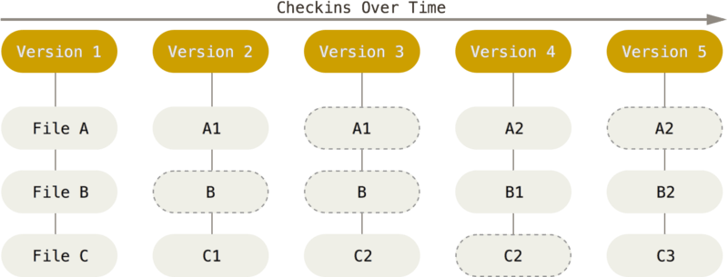

# git & GitHub教程

[git中文官方文档](https://git-scm.com/book/zh/v2)

[GitHub中文官方帮助](https://help.github.com/cn)

----

[TOC]

<!-- toc -->

---

## 常用操作

#### 本地库初始化

```
git init  # 初始化.git
```

#### 设置签名

```
# 系统用户级(全局):登录当前操作系统的用户范围
git config --global user.name tome_glb  # 用户名
git config --global user.email goodMorning@qq.com  # 邮箱
# 项目级别/仓库级别:仅在当前本地库范围内有效
git config user.name tome_proj
git config user.email goodMorning_proj@qq.com
```

#### 检查配置信息

```
git config --list
```

#### 状态查看

```
git status  # 查看工作区、暂存区状态
```

#### 添加追踪/暂存

```
git add [file_name]  # 将工作区的“新建/修改”添加到暂存区
```

#### 提交

```
git commit -m "commit message" [file_name]  # 将暂存区的内容提交到本地库
```

#### 查看历史记录

```
git log
git log --pretty=oneline
git log --oneline
git reflog
```

#### 版本前进后退

```
git reset --hard [log索引值]  # 切换到指定版本,hard三个区域都切换
```

#### 删除文件并找回

```
git reset --hard [log索引值/HEAD]  # 版本回退
# 删除操作已经提交到本地库:指向历史记录 
# 删除操作尚未提交到本地库:指向 HEAD
```

#### 比较文件差异

```
git diff [文件名]  # 将工作区中的文件和暂存区进行比较
git diff [log索引值] [文件名]  # 将工作区中的文件和本地库log历史记录比较
git diff  # 比较多个文件
```

#### 创建分支

```
git branch [分支名]  # 创建分支
```

#### 查看分支

```
git branch -v  # 查看分支
```

#### 切换分支

```
git checkout [分支名]  # 切换分支
```

#### 新建并切换分支

```
git checkout -b [分支名]  # 新建并切换分支
```

#### 合并分支

```
git checkout [吞并其他的分支名]  # 切换到准备吞并其他分支的分支
git merge [被吞并分支名]  # merge合并
```

#### 解决合并时冲突

```
vim [冲突文件名]  # 编辑文件,删除特殊符号 <<HEAD == >>master
git add [冲突文件名]  # 添加文件到暂存区
git commit -m "日志信息"  # 提交更新,注意:此时 commit 一定不能带具体文件名
```

#### 查看远程仓储库

```
git remote -v  # 查看当前所有远程仓储库别名
```

```
git remote show [远程别名]  # 查看远程分支的更多信息
```

#### 添加远程仓储库

```
git remote add [远程别名] [远程地址https]  # 别名
```

#### 推送到远程

首次本地推送到远程,必须是新建的**空仓储库**(仓储名字可以不一致)??

使用 `git push` 将本地分支上的提交推送到远程仓库。

`git push <REMOTENAME> <BRANCHNAME> ` 命令使用两个参数：

- 远程命令，如 `origin`
- 分支名称，如 `master`

```
git push
git push origin master  # 推送本地更改到在线仓库master分支
```

```
git push [远程别名] [同名分支名]  # 将本地的 <branch>分支推送到远程仓库上的 同名<branch> 分支？？
```

重命名分支

将本地分支推送到远程不同名分支上（相当于重命名分支）

```
git push  <REMOTENAME>  <LOCALBRANCHNAME>:<REMOTEBRANCHNAME> 
git push [远程别名] [本地branch]:[远程remotebranch]  # 将本地的[本地branch]分支推送到远程仓库的[远程remotebranch]分支
```

推送标记

默认情况下，没有其他参数时，`git push` 会发送所有名称与远程分支相同的匹配分支。

要推送单一标记，可以发出与推送分支相同的命令：

```
git push  <REMOTENAME> <TAGNAME> 
```

要推送所有标记，可以输入命令：

```
git push  <REMOTENAME> --tags
```

删除远程分支或标记

```
git push  <REMOTENAME> :<BRANCHNAME> 
```

请注意，冒号前有一个空格。 命令与重命名分支的步骤类似。 但这里是告诉 Git *不要*推送任何内容到 `REMOTENAME` 上的 `BRANCHNAME`。 因此，`git push` 会删除远程仓库上的分支。

 

#### 克隆仓储库

```
git clone [远程地址]  # 克隆远程仓储库
```

完整的把远程库下载到本地,默认创建 **origin** 为远程地址别名,默认分支**origin/master**

#### 仅抓取远程数据

```
git fetch [远程库别名] [远程分支]  # 仅从远程指定分支,而不合并
git fetch [别名]  # 仅从远程抓取本地没有的数据,而不合并??
```

#### 拉取远程库

```
git pull [远程库别名] [远程分支]  # 从服务器上指定分支数据,然后合并支。
git pull  # 从服务器上抓取所跟踪的服务器与分支数据然后合并入那个远程分支。
```

`pull`= `fetch` + `merge` 

#### 删除远程分支

```
git push [远程库别名] --delete [远程分支]  # 删除一个远程服务器的分支
```

#### 移除远程仓库

````
git remote rm [远程库别名]  # 移除一个远程仓库
````

#### 重命名远程仓库

```
git remote rename [远程库别名] [新别名]  # 修改一个远程仓库的简写名
```

#### 跟踪分支

从一个远程跟踪分支检出一个本地分支会自动创建一个叫做 “跟踪分支”（有时候也叫做 “上游分支”）。 跟踪分支是与远程分支有直接关系的本地分支。 如果在一个跟踪分支上输入 `git pull`，Git 能自动地识别去哪个服务器上抓取、合并到哪个分支。

当克隆一个仓库时，它通常会自动地创建一个跟踪 `origin/master` 的 `master` 分支。

`git checkout -b [branch] [remotename]/[branch]`等效于`git checkout --track [remotename]/[branch]`新建本地分支`[branch]`(可以重命名,忽略为默认master)并自动跟踪远程分支`[remotename]/[branch]`

```
git checkout --track origin/serverfix
git checkout -b [branch] [remotename]/[branch]  # 新建分支并追踪
```

`git branch -u <remote>/<branch>`**设置**当前已有的本地分支跟踪一个刚刚拉取下来的远程分支，或者想要修改正在跟踪的上游分支,你可以在任意时间使用 `-u` 或 `--set-upstream-to` 选项运行 `git branch` 来显式地设置。	

```
$ git branch -u origin/serverfix  # 设置当前分支跟踪远程
```

查看设置的所有跟踪分支，可以使用 `git branch -vv` ,这会将所有的本地分支列出来并且包含更多的信息，如每一个分支正在跟踪哪个远程分支与本地分支是否是领先、落后或是都有。

```
git branch -vv
```


## Overview

### 版本控制系统

版本控制是一种记录一个或若干个文件内容变化，以便将来查阅特定版本修订情况得系统。

版本控制系统 VCS (Version Control System)具体功能：

- 记录文件的所有历史变化
- 随时可恢复到任何一个历史状态
- 多人协作开发或修改
- 错误恢复

#### 1. 本地版本控制系统


#### 2. 集中化的版本控制系统 CVCS (Centralized Version Control System)

> CVS(老) , **SVN** (Subversion开源) , VSS (Visual Source Safe微软) , ClearCase(IBM收费)以及 Perforce


#### 3. 分布式版本控制系统 DVCS (Distributed Version Control System)

> **Git**、Mercurial、Bazaar 以及 Darcs


### Git 简介

- Git是一款免费、开源的分布式版本控制系统
- Git可以有效、高速的处理从很小到非常大的项目版本管理。
- Git最初由 Linux 之父 Linus Trovalds（林纳斯·托瓦兹） 开发，用作Linux内核代码的管理。

#### Git原理

直接记录快照，而非差异比较



#### Git 有三种状态

Git 有三种状态，你的文件可能处于其中之一：已修改（modified）、已暂存（staged）已提交和（committed）。 

- `已修改`表示修改了文件，但还没保存到数据库中。 
- `已暂存`表示对一个已修改文件的当前版本做了标记，使之包含在下次提交的快照中。
- `已提交`表示数据已经安全的保存在本地数据库中。 

#### Git 三个工作区域

Git 项目的三个工作区域的概念：工作目录、暂存区域以及Git 仓库。


- `工作区（Working Directory）：`是对项目的某个版本独立提取出来的内容。 这些从 Git 仓库的压缩数据库中提取出来的文件，放在磁盘上供你添加、编辑、修改文件等。
- `暂存区域`：暂存已经修改的文件最后统一提交到Git仓库中。是一个文件，保存了下次将提交的文件列表信息，一般在 Git 仓库目录中。
- `Git 仓库`：最终确定的文件保存到仓库，成为一个新的版本，并对他人可见。是 Git 用来保存项目的元数据和对象数据库的地方。 这是 Git 中最重要的部分，从其它计算机克隆仓库时，拷贝的就是这里的数据。

#### 本地库和远程库

Git远程仓库


##### 团队内部协作


##### 跨团队协作


## Git 基础

### 安装 Git

#### 在 Ubuntu 上安装

```
sudo apt-get install git
```

### 配置 Git

#### 设置用户名

```
git config --global user.name 'John Doe'
```

#### 设置用户邮箱

```
git config --global user.email johndoe@example.com
```

#### 配置文本编辑器(可省)

配置默认文本编辑器,如果未配置，Git 会使用操作系统默认的文本编辑器.

```
git config --global core.editor vim
```

#### 查看配置

```
git config --list
```


### 创建 Git 仓库

有两种取得 Git 项目仓库的方法。 第一种是在现有项目或目录下导入所有文件到 Git 中； 第二种是从一个服务器克隆一个现有的 Git 仓库。

#### - 初始化本地仓库

如果你打算使用 Git 来对现有的项目进行管理，你只需要进入该项目目录并输入：

```
cd 项目目录
git init     # 初始化本地仓库
```

会在项目目录下创建一个名为 `.git` 的隐藏子目录

#### - 克隆服务器的仓库

克隆服务器仓库到当前文件目录下 `git clone [url]` 

```
git clone https://github.com/libgit2/libgit2
```

在克隆远程仓库的时候，自定义本地仓库的名字（**重命名**）

```
git clone https://github.com/libgit2/libgit2 mylibgit_renamed
```

### 仓库版本控制

#### status 当前状态

```
git status
```

##### 当前状态简览

```
git status -s 状态简览
git status --short 状态简览
```

`A`新添加到暂存区中的文件前面有 
`M` 修改过的文件前面有 
`??`新添加的未跟踪文件前面有 

#### add 添加追踪新文件

`git add` 对指定文件的追踪

```
git add test.py
git add --all  # 添加追踪所有未追踪的文件
```

#### add 暂存已修改文件

将编辑过的文件添加到暂存区

```
git add test.py
git add .    # 暂存当前目录所有的文件，未跟踪的加入跟踪，同--all
git add --all  # 暂存所有修改
git add -u    #  更新跟踪的文件，不管未跟踪的
```

`u`：--update    update tracked files
`-A`： --all     add changes from all tracked and untracked files

已跟踪文件的内容发生了变化，但还没有放到暂存区。 要暂存这次更新，需要运行 `git add` 命令。 这是个多功能命令：可以用它开始跟踪新文件，或者把已跟踪的文件放到暂存区，还能用于合并时把有冲突的文件标记为已解决状态等。 

运行了 `git add` 之后又作了修订的文件，需要重新运行 `git add` 把最新版本重新暂存起来.

#### .gitignore忽略追踪的文件

创建一个名为 `.gitignore` 的文件，列出要忽略的文件模式

```
touch .gitignore  # 创建.gitignore文件
dedit .gitignore  # 编辑.gitignore文件
```

```
# ignore all .a files
*.a

# but do track lib.a, even though you're ignoring .a files above
!lib.a

# only ignore the TODO file in the current directory, not subdir/TODO
/TODO

# ignore all files in the build/ directory
build/

# ignore doc/notes.txt, but not doc/server/arch.txt
doc/*.txt

# ignore all .pdf files in the doc/ directory
doc/**/*.pdf
```

对于无需纳入 Git 的管理，也不希望它们总出现在未跟踪文件列表。自动生成的文件，比如日志文件，或者编译过程中创建的临时文件等

.gitignore只能**忽略**原来**未被跟踪**的文件，因此**跟踪过的文件是无法被忽略的**。

因此在github上可以看到之前跟踪的需忽略文件的存在。
解决方法就是先把本地缓存删除（改变成未track状态），然后再提交:

```
git rm -r --cached .    # 删除git跟踪而保留本地文件
git add .    # 重新跟踪所有文件
git commit -m 'update .gitignore'    # 重新提交
git push    # 更新github
```

`git log --pretty=oneline`原来的git log 仍然存在

shell 所使用的简化了的正则表达式:星号（`*`）匹配零个或多个任意字符；问号（`?`）只匹配一个任意字符；`[abc]`匹配任何一个列在方括号中的字符（这个例子要么匹配一个 a，要么匹配一个 b，要么匹配一个 c）；如果在方括号中使用短划线分隔两个字符，表示所有在这两个字符范围内的都可以匹配（比如 `[0-9]` 表示匹配所有 0 到 9 的数字）。

#### diff 查看差异

查看修改之后还没有add暂存起来内容。（比较**工作区**和**仓库**差异）

 ```
git diff      # 比较工作区和仓库差异
 ```

查看已暂存的将要添加到下次提交里的内容。（比较**暂存区**和仓库差异）

```
git diff --staged
git diff --cached  # 或者
```

#### commit 提交到仓库

提交暂存区的文件到仓库,提交说明是必须的，如果没有则会启动文本编辑器 (默认nano)以便输入本次提交的说明,Ctrl+S保存。

```
#git commit  # 没有-m提交说明则会进入vim添加说明
git commit -m "-m选项,提交说明信息"
```

每次准备提交前，先用 `git status` 看下，是不是都已暂存起来了， 然后再运行提交命令 `git commit`

请记住，提交时记录的是放在暂存区域的快照。 任何还未暂存的仍然保持已修改状态，可以在下次提交时纳入版本管理。 每一次运行提交操作，都是对你项目作一次快照，以后可以回到这个状态，或者进行比较。

##### 跳过使用暂存区域，直接全部提交

跳过使用暂存区域的方式，Git 就会自动把所有已经跟踪过的文件暂存起来一并提交，从而跳过 `git add` 步骤

```
git commit -a -m 'added new benchmarks'
#git commit -a  # 所有已经跟踪过的文件暂存起来一并提交
```

#### rm 移除文件

从已跟踪文件清单中移除,并且删除本地文件

```
git rm README.md  # 删除本地文件和仓储文件,且不再追踪
git rm -f README.md  # 强制删除
```

`--cached` 保留本地磁盘，但是并不想让 Git 继续跟踪

`-f`强制删除

```
git rm --cached README.md  # 保留本地磁盘文件，但是不继续跟踪
git rm -f --cached README.md  # 强制删除,保留本地磁盘文件，但是不继续跟踪
```

#### mv 移动文件/重命名

```
git mv old_filename new_filename  # 重命名
```

### log 查看提交历史

#### log 提交历史日志

```
git log
git log --oneline
git log --pretty=oneline
git log --graph
```

`git log` 会按提交时间列出所有的更新，最近的更新排在最上面。 正如你所看到的，这个命令会列出每个提交的 SHA-1 校验和、作者的名字和电子邮件地址、提交时间以及提交说明。

`-p`按补丁格式显示每个更新之间的差异。

`--stat`显示每次更新的文件修改统计信息。

`--shortstat`只显示 --stat 中最后的行数修改添加移除统计。

`--name-only`仅在提交信息后显示已修改的文件清单。

`--name-status`显示新增、修改、删除的文件清单。

`--abbrev-commit`仅显示 SHA-1 的前几个字符，而非所有的 40 个字符。

`--relative-date`使用较短的相对时间显示（比如，“2 weeks ago”）。

`--graph`显示 ASCII 图形表示的分支合并历史。

`--pretty`使用其他格式显示历史提交信息。可用的选项包括 oneline，short，full，fuller 和 format（后跟指定格式）。

#### 筛选提交历史日志

```
git log -3  # 仅显示最近的3条提交
```

`-(n)`仅显示最近的 n 条提交

`--since, --after`仅显示指定时间之后的提交。

`--until, --before`仅显示指定时间之前的提交。

`--author`仅显示指定作者相关的提交。

`--committer`仅显示指定提交者相关的提交。

`--grep`仅显示含指定关键字的提交

`-S`仅显示添加或移除了某个关键字的提交

```
git log --oneline --decorate  # 查看各个分支当前所指的对象
```

```
git log --oneline --decorate --graph --all  # 输出你的提交历史、各个分支的指向以及项目的分支分叉情况
```

`git log --oneline --decorate --graph --all` 输出你的提交历史、各个分支的指向以及项目的分支分叉情况。


### 撤消操作

#### 撤消对文件的修改

**本地修改了一堆文件(并没有使用git add到暂存区)，想放弃修改。**

单个文件/文件夹：

```
$ git checkout -- readme.md文件
```

所有文件/文件夹：

```
$ git checkout -- .
$ git checkout .
```

**本地新增了一堆文件(并没有git add到暂存区)，想放弃修改。**

单个文件/文件夹：

```
$ rm filename 
$ rm -r dir 
```

所有文件/文件夹：

```
$ git clean -xdf
```

-df 删除 文件 和 目录

// 删除新增的文件，如果文件已经已经git add到暂存区，并不会删除！

#### 取消暂存的文件

**本地修改/新增了一堆文件，已经git add到暂存区，想放弃修改。**

单个文件/文件夹：

```
$ git reset HEAD readme.md文件
```

所有文件/文件夹：

```
$ git reset HEAD .
```

#### 撤销提交

**本地通过git add & git commit 之后，想要撤销此次commit**

```
$ git reset --hard commit_id # 返回到某个节点，不保留修改。
```

// 撤销之后，你所做的已经commit的修改将会清除，仍在工作区/暂存区的代码也将会清除！

```
$ gitreset --soft commit_id # 返回到某个节点。保留修改
```

这个id是你想要回到的那个节点，可以通过git log查看，可以只选前6位

// 撤销之后，你所做的已经commit的修改还在工作区！

#### 重新提交

有时候我们提交完了才发现漏掉了几个文件没有添加，或者提交信息写错了。 此时，可以运行带有 `--amend` 选项的提交命令尝试重新提交：

`git commit --amend`将暂存区中的文件提交,覆盖原来的提交信息。

```
$ git commit --amend    # 修改上次提交
```


### 远程仓库

#### 查看远程仓库

如果想查看你已经配置的远程仓库服务器，可以运行 `git remote` 命令。 它会列出你指定的每一个远程服务器的简写。 **origin** 是 Git 给你clone克隆的**仓库服务器**的**默认名**字

```
git remote -v    # 查看远程仓库
```

`-v`，会显示需要读写远程仓库使用的 Git 保存的简写与其对应的 URL。

`git remote show [remote-name]` 查看某一个远程仓库的更多信息

```
git remote show origin    # 查看远程仓库详细信息
```

#### 添加远程仓库

 `git remote add <remote_shortname> <url>` 添加一个新的远程 Git 仓库，同时指定一个你可以轻松引用的简写,可以在命令行中使用`<remote_shortname> `简写来代替整个 URL

`git remote add` 添加远程仓库命令使用两个参数：

- 远程命令，如 `origin`
- 远程 URL，如 `https://github.com/user/repo.git`

```
git remote add origin https://github.com/user/repo.git  # 添加远程仓库
git remote add ThisIsShortName https://github.com/user/repo.git  # 添加远程仓库
```

#### 从远程仓库中抓取与拉取

`git fetch [remote-name]`访问远程仓库，从中拉取所有你还没有的数据。 执行完成后，你将会拥有那个远程仓库中**所有分支**的引用，可以随时合并或查看。如果你使用 `clone` 命令克隆了一个仓库，命令会自动将其添加为远程仓库并默认以 “origin” 为简写。 所以，`git fetch origin` 会抓取克隆（或上一次抓取）后新推送的所有工作。 

```
git fetch [remote-name]
```

#### 从远程仓库中抓取并合并

```
git pull
 git pull --rebase=true    # ??
```

`git fetch`命令会将数据拉取到你的本地仓库 - 它并不会自动合并或修改你当前的工作。 当准备好时你必须手动将其合并入你的工作。`git clone` 命令会自动设置本地 master 分支跟踪克隆的远程仓库的 master 分支（或不管是什么名字的默认分支）。 运行 `git pull` 通常会从最初克隆的服务器上抓取数据并自动尝试合并到当前所在的分支。

#### 推送到远程仓库

`git push [remote-name] [branch-name]`。当你想要将 master 分支推送到 `origin` 服务器时（再次说明，克隆时通常会自动帮你设置好那两个名字），那么运行这个命令就可以将你所做的备份到服务器：

```
git push
git push origin master
git push origin master --allow-unrelated-histories  # 推送两个部相关的仓储
```

> 解决git push错误`The requested URL returned error: 403 Forbidden while accessing`
> 原因：私有项目，没有权限，输入用户名密码，或者远程地址采用这种类型。
> 解决办法：vi .git/config
> 将 [remote "origin"]      
> url = https://github.com/用户名/仓库名.git修改为：
> [remote "origin"]    
> url = https://**用户名:密码@**github.com/用户名/仓库名.git

> 解决git push错误 `Error merging: refusing to merge unrelated histories`
> 原因：两个仓库有不同的开始点，也就是两个仓库没有共同的 commit 出现的无法提交。
> 解决办法：添加 `--allow-unrelated-histories` 告诉 git 允许不相关历史合并,`git merge master --allow-unrelated-histories` , `git push origin master --allow-unrelated-histories`

#### 更改远程仓库的 URL

`git remote set-url` 命令可更改现有远程仓库的 URL。 HTTPS和SSH都可以

````
git remote set-url <现有远程仓库的名称> <远程仓库的新URL>
# HTTPS
git remote set-url origin https://github.com/USERNAME/REPOSITORY.git
# SSH
git remote set-url origin git@github.com:USERNAME/REPOSITORY.git
````

#### 将远程 URL 从HTTPS切换到 SSH

列出现有远程仓库以获取要更改的远程仓库的名称

```
git remote -v
```

> origin  https://github.com/USERNAME/REPOSITORY.git (fetch)
> origin  https://github.com/USERNAME/REPOSITORY.git (push)

使用 git remote set-url 命令将远程的 URL 从 HTTPS 更改为 SSH。

```
git remote set-url origin git@github.com:USERNAME/REPOSITORY.git
```

验证远程 URL 是否已更改。

```
git remote -v
```

> ``#Verify new remote URL
> origin  git@github.com:USERNAME/REPOSITORY.git (fetch)
> origin  git@github.com:USERNAME/REPOSITORY.git (push)

将远程 URL 从SSH切换到 HTTPS 同理

#### 重命名远程仓库

`git remote rename [remote-name]` 去修改一个远程仓库的简写名

`git remote rename` 重命名远程仓库命令使用两个参数：

- 现有的远程名称，例如 `origin`
- 远程的新名称，例如 `destination`

```
git remote rename OldNameremote NewNameremote
```

示例

查看现有远程

```
git remote -v
```

> origin  https://github.com/OWNER/REPOSITORY.git (fetch)
> origin  https://github.com/OWNER/REPOSITORY.git (push)

将远程名称从 'origin' 更改为 'destination'

```
git remote rename origin destination
```

验证远程的新名称

```
git remote -v
```

> destination  https://github.com/OWNER/REPOSITORY.git (fetch)
> destination  https://github.com/OWNER/REPOSITORY.git (push)

#### 删除远程仓库

`git remote rm [remote-name]`移除一个远程仓库，

`git remote rm` 删除远程命令使用一个参数：

- 远程名称，例如 `destination`

```
git remote rm Deletedremote
```

**注**：`git remote rm` 不会从服务器中删除远程仓库。 它只是从本地仓库中删除远程及其引用。

示例

```
# 查看当前远程
git remote -v
> origin  https://github.com/OWNER/REPOSITORY.git (fetch)
> origin  https://github.com/OWNER/REPOSITORY.git (push)
> destination  https://github.com/FORKER/REPOSITORY.git (fetch)
> destination  https://github.com/FORKER/REPOSITORY.git (push)
# 删除远程
git remote rm destination
# 验证其已删除
git remote -v
> origin  https://github.com/OWNER/REPOSITORY.git (fetch)
> origin  https://github.com/OWNER/REPOSITORY.git (push)
```


### tag打标签

Git 可以给历史中的某一个提交打上标签，以示重要。 比较有代表性的是人们会使用这个功能来标记发布结点（v1.0 等等）。

#### 列出标签

```
git tag    # 显示已有标签
git tag -l 'v1.*'    # 过滤显示
```

这个命令以字母顺序列出标签；但是它们出现的顺序并不重要。

> $ git tag 
> v1.0.0
> v1.3.0
> v2.5.0

使用特定的模式查找标签

> $ git tag -l 'v1.*'
> v1.0.0
> v1.3.0

#### 查看标签详细信息

```
git show v1.4
```
输出显示了打标签者的信息、打标签的日期时间、附注信息，然后显示具体的提交信息。

> $ git show v1.4
> tag v1.4
> Tagger: Ben Straub <ben@straub.cc>
> Date:   Sat May 3 20:19:12 2014 -0700
> my version 1.4
> commit ca82a6dff817ec66f44342007202690a93763949
> Author: Scott Chacon <schacon@gee-mail.com>
> Date:   Mon Mar 17 21:52:11 2008 -0700
>     changed the version number

#### 创建标签

Git 使用两种主要类型的标签：附注标签（annotated）与轻量标签（lightweight）。
通常建议创建附注标签，这样你可以拥有以上所有信息；但是如果你只是想用一个临时的标签，或者因为某些原因不想要保存那些信息，轻量标签也是可用的。

##### 附注标签

附注标签是存储在 Git 数据库中的一个完整对象。 它们是可以被校验的；其中包含打标签者的名字、电子邮件地址、日期时间；还有一个标签信息；并且可以使用 GNU Privacy Guard （GPG）签名与验证。 通常建议创建附注标签

`git tag -a <tag> -m <'注释说明'>`

```
git tag -a v1.4 -m 'my version 1.4'
```

`-a`  add创建一个附注标签
`-m`  message选项指定了一条将会存储在标签中的信息。 如果没有为附注标签指定一条信息，Git 会运行编辑器要求你输入信息。

通过使用 `git show <tag>` 命令可以看到标签信息与对应的提交信息

##### 轻量标签(不推荐)

一个轻量标签很像一个不会改变的分支——它只是一个特定提交的引用。
轻量标签本质上是将提交校验和存储到一个文件中 - 没有保存任何其他信息。

`git tag <tag>`只需要提供标签名字,不需要使用选项，只需要提供标签名字

```
git tag v1.5lightweight
```

#### 后期打标签

对过去的提交打标签

要在那个提交上打标签，你需要在命令的末尾指定提交的校验和（或部分校验和）

```
git log --oneline  # 查询提交历史
#git tag -a <tag> <校验和>
git tag -a v1.4 -m 'myVersion1.4' 8a5cbc43    # 对历史打标签
```

#### 推送标签

默认情况下，`git push` 命令并不会传送标签到远程仓库服务器上。 在创建完标签后你必须**显式地推送**标签到共享服务器上。

`git push origin [tagname]`

```
git push origin v1.5    # 推送指定标签
```

```
git push origin --tags    # 推送所有标签
```

`--tags` 把所有不在远程仓库服务器上的标签全部传送到那里。

#### 删除标签

仅删除掉**本地**仓库上的标签，并不会从任何远程仓库中移除这个标签

```
git tag -d v1.4    # 仅删除本地标签
```

删除**远程**仓库的标签

```
git push origin :refs/tags/v1.4    # 删除远程仓库的标签
```

#### 检出标签

如果你想查看某个标签所指向的文件版本，可以使用 `git checkout` 命令，虽然说这会使你的仓库处于“分离头指针（detacthed HEAD）”状态——这个状态有些不好的副作用：

```
git checkout v2.0.0    # 不要修改提交
```

在“分离头指针”状态下，如果你做了某些更改然后提交它们，标签不会发生变化，但你的新提交将不属于任何分支，并且将无法访问，除非确切的提交哈希。因此，如果你需要进行更改——比如说你正在修复旧版本的错误——这通常需要创建一个新分支

```
# git checkout -b version2 v2.0.0    # 非改不可，在标签处新建分支
```


### Git 命令别名

 如果不想每次都输入完整的 Git 命令，可以通过 `git config` 文件来轻松地为每一个命令设置一个别名。

```
git config --global alias.co checkout
git config --global alias.br branch
git config --global alias.ci commit
git config --global alias.st status
git config --global alias.last 'log -1 HEAD'
```

## Git 分支

### 分支简介

#### 创建分支

`git branch <branchname>`  **仅创建** 一个新分支，并不会自动切换到新分支中去。

```
git branch testing    # 创建分支
```

#### 切换分支

切换到一个已存在的分支，你需要使用 `git checkout <branch>` 命令。

请牢记：当你切换分支的时候，Git 会**重置**你的**工作目录**，使其看起来像回到了你在那个分支上最后一次提交的样子。 Git 会自动添加、删除、修改文件以确保此时你的工作目录和这个分支最后一次提交时的样子一模一样。

```
git checkout testing
```

#### 查看各分支当前所指的对象

`git log --oneline --decorate`查看各个分支当前所指的对象

```
git log --oneline --decorate
```
#### 查看分支情况

`git log --oneline --decorate --graph --all` ，它会输出你的提交历史、各个分支的指向以及项目的分支分叉情况。

```
git log --oneline --decorate --graph --all
```

### 分支的新建与合并

#### 新建分支并切换

`git checkout -b <branch>`新建分支并同时切换到那个分支上

```
git checkout -b branchiss53    # 新建分支并切换
# 等效于下面两条命令
# git branch branchiss53    # 新建分支
# git checkout branchiss53    # 切换分支
```

#### 分支的合并

合并 `iss53` 分支到 `master` 分支

检出`checkout`到你想合并入的分支， `git merge <被合并分支>` 

```
git checkout master
git merge iss53    # 当前所在分支吞并 iss53 分支
```

已经被合并的分支可以删除`git branch -d <branch>`

```
git branch -d iss53
```

#### 遇到冲突时的分支合并


### 分支管理

#### 显示所有分支名

`git branch` 命令不只是可以创建与删除分支。 如果不加任何参数运行它，会得到当前所有分支的一个列表：分支前的 `*` 字符：它代表现在检出的那一个分支（也就是说，当前 `HEAD` 指针所指向的分支）。 

```
git branch    # 显示所有分支名
```

#### 查看所有分支的最后一次提交

如果需要查看每一个分支的最后一次提交，可以运行 `git branch -v` 命令：

```
git branch -v    # 显示所有分支名及最后一次提交
```

#### 已经合并到当前分支

`--merged` 与 `--no-merged` 这两个有用的选项可以过滤这个列表中已经合并或尚未合并到当前分支的分支。 

如果要查看哪些分支已经合并到当前分支，可以运行 `git branch --merged`：在这个列表中分支名字前没有 `*` 号的分支通常可以使用 `git branch -d` 删除掉；你已经将它们的工作整合到了另一个分支，所以并不会失去任何东西。

```
git branch --merged    # 显示已经合并过的分支
```

#### 未合并工作的分支

查看所有包含未合并工作的分支，可以运行 `git branch --no-merged`：这里显示了其他分支。 因为它包含了还未合并的工作，尝试使用 `git branch -d` 命令删除它时会失败：如果真的想要删除分支并丢掉那些工作，如同帮助信息里所指出的，可以使用 `-D` 选项强制删除它。

```
git branch --no-merged    # 显示未合并的分支
```

### 分支开发工作流

#### 长期分支


#### 特性分支


### 远程分支

 `git ls-remote <remote>` 来显式地获得远程引用的完整列表

`git remote show <remote>` 获得远程分支的更多信息

远程跟踪分支是远程分支状态的引用。远程分支 `<remote>/<branch>` 形式命名,默认 `origin/master` 分支

```
git remote -v    # 显示远程仓储
git ls-remote <remote>    # 获得远程引用的完整列表
git remote show <remote>    # 显示远程分支详细信息
```

> ➜  git-github-tutorial git:(master) ✗ git remote -v 
> origin	git@github.com:robotchaoX/git-github-tutorial.git (fetch)
> origin	git@github.com:robotchaoX/git-github-tutorial.git (push)
>
> ➜  git-github-tutorial git:(master) ✗ git ls-remote origin    
> 0f0bd97982f93c5e359fe04b1aaf38684b925ab7	HEAD
> 0f0bd97982f93c5e359fe04b1aaf38684b925ab7	refs/heads/master
>
> ➜  git-github-tutorial git:(master) ✗ git remote show origin 
>
> * remote origin
>
>   Fetch URL: git@github.com:robotchaoX/git-github-tutorial.git
>   Push  URL: git@github.com:robotchaoX/git-github-tutorial.git
>   HEAD branch: master
>   Remote branch:
>     master tracked
>   Local branch configured for 'git pull':
>     master merges with remote master
>   Local ref configured for 'git push':
>     master pushes to master (up to date)

#### 抓取远程数据

`git fetch <remote>`从远程抓取本地没有的数据，并且更新本地数据库，移动 `origin/master` 指针指向新的、更新后的位置。

```
git fetch
```


#### 推送

 `git push <remote> <branch>`将本地的 `<branch> `分支推送到远程仓库上的 `<branch>` 分支。

`git push <remote> <branch>:<newbranchname>` 将本地的 `<branch> `分支推送到远程仓库上的 `<newbranchname>` 分支。

```
git push
```


#### 跟踪分支

从一个远程跟踪分支检出一个本地分支会自动创建一个叫做 “跟踪分支”（有时候也叫做 “上游分支”）。 跟踪分支是与远程分支有直接关系的本地分支。 如果在一个跟踪分支上输入 `git pull`，Git 能自动地识别去哪个服务器上抓取、合并到哪个分支。

当克隆一个仓库时，它通常会自动地创建一个跟踪 `origin/master` 的 `master` 分支。

`git checkout --track <remotename>/<branch>`等效于`git checkout -b <branch> <remotename>/<branch>`设置本地分支`<branch>`跟踪远程分支`<remotename>/<branch>`

```
git checkout --track origin/serverfix
```

`git branch -u <remote>/<branch>`设置已有的本地分支跟踪一个刚刚拉取下来的远程分支，或者想要修改正在跟踪的上游分支

查看设置的所有跟踪分支，可以使用 `git branch -vv` 

```
git branch -vv    # 查看所有跟踪的分支
```

> ➜  forage-harvester git:(mutlithreads) git branch -vv
>       TY-percipio    eb7947c [origin/TY-percipio] add Qt source files joint compilation
>       master         f7b79f1 [origin/master] redesign Qt display interface.
>  `*` mutlithreads   17838aa update Qt display interface.

#### 拉取

当 `git fetch` 命令从服务器上抓取本地没有的数据时，它并不会修改工作目录中的内容。 它只会获取数据然后让你自己合并。 

`git pull` 都会查找当前分支所跟踪的服务器与分支，从服务器上抓取数据然后尝试合并入那个远程分支。`git pull`= `git fetch` + `git merge` 

```
git pull
```

#### 删除远程分支

`git push <remote> --delete <branch>`删除一个远程服务器的分支

```
git push origin --delete master
```


### 变基

在 Git 中整合来自不同分支的修改主要有两种方法：`merge` 以及 `rebase`。

开发任务分叉到两个不同分支，又各自提交了更新


#### merge合并

之前介绍过，整合分支最容易的方法是 merge 命令。 它会把两个分支的最新快照（C3 和 C4）以及二者最近的共同祖先（C2）进行三方合并，合并的结果是生成一个新的快照（并提交）。


#### rebase变基合并

对分叉到两个不同分支，又各自提交了更新进行**合并**


**变基:**可以提取在 `C4` 中引入的补丁和修改，然后在 `C3` 的基础上应用一次。你可以使用 `rebase` 命令将提交到某一分支上的所有修改都移至另一分支上，就好像“重新播放”一样。

```
git checkout experiment    # 当前分支修改变基到master之后
git rebase master  # 将 C4 中的修改变基到 C3 上
First, rewinding head to replay your work on top of it...
Applying: added staged command
```

它的原理是首先找到这两个分支（即当前分支 `experiment`、变基操作的目标基底分支 `master`）的最近共同祖先 `C2`，然后对比当前分支相对于该祖先的历次提交，提取相应的修改并存为临时文件，然后将当前分支指向目标基底 `C3`, 最后以此将之前另存为临时文件的修改依序应用。（译注：写明了 commit id，以便理解，下同）

**合并:**回到 `master` 分支，进行一次快进合并。

```
git checkout master    # 回到master合并
git merge experiment    #  master 分支的快进合并
```

此时，`C4'` 指向的快照就和上面使用 `merge` 命令的例子中 `C5` 指向的快照一模一样了。 这两种整合方法的最终结果没有任何区别，但是变基使得提交历史更加整洁。 你在查看一个经过变基的分支的历史记录时会发现，尽管实际的开发工作是并行的，但它们看上去就像是串行的一样，提交历史是一条直线没有分叉。

一般我们这样做的目的是为了确保在向远程分支推送时能保持提交历史的整洁——例如向某个其他人维护的项目贡献代码时。 在这种情况下，你首先在自己的分支里进行开发，当开发完成时你需要先将你的代码变基到 `origin/master` 上，然后再向主项目提交修改。 这样的话，该项目的维护者就不再需要进行整合工作，只需要快进合并便可。

请注意，无论是通过变基，还是通过三方合并，整合的最终结果所指向的快照始终是一样的，只不过提交历史不同罢了。 变基是将一系列提交按照原有次序依次应用到另一分支上，而合并是把最终结果合在一起。


变基使得提交历史更加整洁

#### 跨支变基合并

在对两个分支进行变基时，所生成的“重放”并不一定要在目标分支上应用，你也可以指定另外的一个分支进行应用。 就像 [从一个特性分支里再分出一个特性分支的提交历史](https://git-scm.com/book/zh/v2/ch00/rrbdiag_e) 中的例子那样。 你创建了一个特性分支 `server`，为服务端添加了一些功能，提交了 `C3` 和 `C4`。 然后从 `C3` 上创建了特性分支 `client`，为客户端添加了一些功能，提交了 `C8` 和 `C9`。 最后，你回到 `server` 分支，又提交了 `C10`。


假设你希望将 `client` 中的修改合并到主分支并发布，但暂时并不想合并 `server` 中的修改，因为它们还需要经过更全面的测试。 这时，你就可以使用 `git rebase` 命令的 `--onto` 选项，选中在 `client` 分支里但不在 `server` 分支里的修改（即 `C8` 和 `C9`），将它们在 `master` 分支上重放：

```
git rebase --onto master server client
```

以上命令的意思是：“取出 `client` 分支，找出处于 `client` 分支和 `server` 分支的**共同祖先之后的修改**，然后把它们在 `master` 分支上重放一遍”。 这理解起来有一点复杂，不过效果非常酷。


现在可以快进合并 `master` 分支了。

```
git checkout master
git merge client
```


接下来你决定将 `server` 分支中的修改也整合进来。 使用 `git rebase [basebranch] [topicbranch]` 命令可以直接将特性分支（即本例中的 `server`）变基到目标分支（即 `master`）上。这样做能省去你先切换到 `server` 分支，再对其执行变基命令的多个步骤。

```
git rebase master server
```

如下图所示，`server` 中的代码被“续”到了 `master` 后面。


然后就可以快进合并主分支 master 了：

```
git checkout master    # 切换到master
git merge server    # master吞并server
```

至此，`client` 和 `server` 分支中的修改都已经整合到主分支里了，你可以删除这两个分支，最终提交历史会变成下图中的样子：

```
git branch -d client    # 删除多余分支
git branch -d server
```


#### 变基的风险

**不要对在你的仓库外有副本的分支执行变基。**


## 服务器上的 Git - 协议

### 协议

Git 可以使用四种主要的协议来传输资料：本地协议（Local），HTTP 协议，SSH（Secure Shell）协议及 Git 协议。

#### 本地协议（Local）

#### HTTP 协议

#### SSH（Secure Shell）协议

####  Git 协议

### 在服务器上搭建 Git

#### 把现有仓库导出为裸仓库

```
$ git clone --bare my_project my_project.git
```

#### 把裸仓库放到服务器上

假设一个域名为 `git.example.com` 的服务器已经架设好，并可以通过 SSH 连接，你想把所有的 Git 仓库放在 `/opt/git`目录下。 假设服务器上存在 `/opt/git/` 目录，你可以通过以下命令复制你的裸仓库来创建一个新仓库：

```
$ scp -r my_project.git user@git.example.com:/opt/git
```

### 生成 SSH 公钥

```
$ ssh-keygen
```

默认情况下，用户的 SSH 密钥存储在其 `~/.ssh` 目录下。我们需要寻找一对以 `id_dsa` 或 `id_rsa` 命名的文件，其中一个带有 `.pub` 扩展名。 `.pub` 文件是你的公钥，另一个则是私钥。

### 配置服务器

[配置服务器](https://git-scm.com/book/zh/v2/%E6%9C%8D%E5%8A%A1%E5%99%A8%E4%B8%8A%E7%9A%84-Git-%E9%85%8D%E7%BD%AE%E6%9C%8D%E5%8A%A1%E5%99%A8)

### GitLab服务器搭建过程

[GitLab官网](https://about.gitlab.com/)

[GitLab安装说明](https://about.gitlab.com/installation/)

## 分布式 Git

### 分布式工作流程

#### 集中式工作流

 集中式系统中通常使用的是单点协作模型——集中式工作流。 一个中心集线器，或者说仓库，可以接受代码，所有人将自己的工作与之同步。 若干个开发者则作为节点——也就是中心仓库的消费者——并且与其进行同步。

这意味着如果两个开发者从中心仓库克隆代码下来，同时作了一些修改，那么只有第一个开发者可以顺利地把数据推送回共享服务器。 第二个开发者在推送修改之前，必须先将第一个人的工作合并进来，这样才不会覆盖第一个人的修改。 这和 Subversion （或任何 CVCS）中的概念一样，而且这个模式也可以很好地运用到 Git 中。


#### 集成管理者工作流

Git 允许多个远程仓库存在，使得这样一种工作流成为可能：每个开发者拥有自己仓库的写权限和其他所有人仓库的读权限。 这种情形下通常会有个代表`‘官方’'项目的权威的仓库。 要为这个项目做贡献，你需要从该项目克隆出一个自己的公开仓库，然后将自己的修改推送上去。 接着你可以请求官方仓库的维护者拉取更新合并到主项目。 维护者可以将你的仓库作为远程仓库添加进来，在本地测试你的变更，将其合并入他们的分支并推送回官方仓库。

这一流程的工作方式如下所示

1. 项目维护者推送到主仓库。
2. 贡献者克隆此仓库，做出修改。
3. 贡献者将数据推送到自己的公开仓库。
4. 贡献者给维护者发送邮件，请求拉取自己的更新。
5. 维护者在自己本地的仓库中，将贡献者的仓库加为远程仓库并合并修改。
6. 维护者将合并后的修改推送到主仓库。


#### 司令官与副官工作流

一般拥有数百位协作开发者的超大型项目才会用到这样的工作方式，例如著名的 Linux 内核项目。 被称为副官（lieutenant）的各个集成管理者分别负责集成项目中的特定部分。 所有这些副官头上还有一位称为司令官（dictator）的总集成管理者负责统筹。 司令官维护的仓库作为参考仓库，为所有协作者提供他们需要拉取的项目代码。

整个流程看起来是这样的:

1. 普通开发者在自己的特性分支上工作，并根据 `master` 分支进行变基。 这里是司令官的`master`分支。
2. 副官将普通开发者的特性分支合并到自己的 `master` 分支中。
3. 司令官将所有副官的 `master` 分支并入自己的 `master` 分支中。
4. 司令官将集成后的 `master` 分支推送到参考仓库中，以便所有其他开发者以此为基础进行变基。


### 向一个项目贡献

#### 提交准则

`git diff --check`找到可能的空白错误并将它们为你列出来

`git add --patch` 部分暂存文件

`git log --no-merges issue54..origin/master `

日志过滤器,只显示所有在后面分支（在本例中是 `origin/master`）但不在前面分支（在本例中是 `issue54`）的提交的列表。

#### 私有小型团队

集中式的系统,尽管 Subversion 会对编辑的不同文件在服务器上自动进行一次合并，但 Git 要求你在本地合并提交。 John 必须抓取 Jessica 的改动并合并它们，才能被允许推送。 

#### 私有管理团队

使用了一种整合-管理者工作流程，独立小组的工作只能被特定的工程师整合，主仓库的 master 分支只能被那些工程师更新。 在这种情况下，所有的工作都是在基于团队的分支上完成的并且稍后会被整合者拉到一起。

`git push -u <remote> <本地branch>:<远程branch>`将` 本地branch` 分支推送到服务器上的 `远程branch` 分支

 `-u` 标记；这是 `--set-upstream` 的简写，该标记会为之后轻松地推送与拉取配置分支。 

`git log featureA..origin/featureA`日志过滤器,只显示新增的日志


#### fork派生的公开项目??

首先，你可能想要克隆主仓库，为计划贡献的补丁或补丁序列创建一个特性分支，然后在那儿做工作。

```
git clone (url)
cd project
git checkout -b featureA
# (work)
git commit 
```

当你的分支工作完成后准备将其贡献回维护者，去原始项目中然后点击 “Fork” 按钮，创建一份自己的可写的项目派生仓库。 然后需要添加这个新仓库 URL 为第二个远程仓库，在本例中称作 `myfork`：

```
git remote add myfork (url)
```

推送工作到fork派生仓库上面。 

```
git push -u myfork featureA
```

当工作已经被推送到你的派生后，你需要通知维护者。 这通常被称作一个拉取请求（pull request）`request-pull` 命令接受特性分支拉入的基础分支，以及它们拉入的 Git 仓库 URL，输出请求拉入的所有修改的总结。

```
git request-pull origin/master myfork
```

```
git merge --squash featureB
```

`--squash` 选项接受被合并的分支上的所有工作，并将其压缩至一个变更集，使仓库变成一个真正的合并发生的状态，而不会真的生成一个合并提交。 这意味着你的未来的提交将会只有一个父提交，并允许你引入另一个分支的所有改动，然后在记录一个新提交前做更多的改动。


#### 通过邮件的公开项目

工作流程与之前的用例是类似的 - 你为工作的每一个补丁序列创建特性分支。 区别是如何提交它们到项目中。 生成每一个提交序列的电子邮件版本然后邮寄它们到开发者邮件列表，而不是派生项目然后推送到你自己的可写版本。


### 维护项目

#### 在特性分支中工作

如果你想向项目中整合一些新东西，最好将这些尝试局限在特性分支——一种通常用来尝试新东西的临时分支中。

基于 master 分支建立特性分支：

```
 git branch <newbranch> master
```

基于 master 分支建立特性分支,同时立刻切换到新分支上:

```
git checkout -b <newbrench> master
```

#### 应用来自邮件的补丁

##### 使用 `apply` 命令应用补丁

`git apply --check <patch>`检查补丁是否可以顺利应用

`git apply`应用补丁,需要手动暂存并提交补丁所引入的更改

##### 使用 `am` 命令应用补丁

`git am `应用补丁,并自动创建了一个新的提交

#### 检出到远程分支

如果你的贡献者建立了自己的版本库，并且向其中推送了若干修改，之后将版本库的 URL 和包含更改的远程分支发送给你，那么你可以将其添加为一个远程分支，并且在本地进行合并。

```
$ git remote add jessica git://github.com/jessica/myproject.git  # 添加远程
$ git fetch jessica  # 获取远程
$ git checkout -b rubyclient jessica/ruby-client  # 设置远程分支
```

`git pull <url>`执行一个一次性的抓取，而不会将该 URL 存为远程引用

```
$ git pull https://github.com/onetimeguy/project
```

#### 确定引入了哪些东西

把 `...` 置于另一个分支名后来对该分支的最新提交与两个分支的共同祖先进行比较

```
$ git diff master...issue32
```

仅会显示自当前特性分支与 master 分支的共同祖先起，该分支中的工作

#### 将贡献的工作整合进来

##### 合并工作流

当你完成某个特性分支的工作，或审核通过了其他人所贡献的工作时，你会将其合并进入 master 分支，之后将特性分支删除，如此反复。

##### 大项目合并工作流

Git 项目包含四个长期分支：`master`、`next`，用于新工作的 `pu`（proposed updates）和用于维护性向后移植工作（maintenance backports）的 `maint` 分支。

##### 变基与拣选工作流

为了保持线性的提交历史，有些维护者更喜欢在 master 分支上对贡献过来的工作进行**变基**和**拣选**，而不是直接将其合并。

 当你完成了某个特性分支中的工作，并且决定要将其整合的时候，你可以在该分支中运行**变基**命令，在当前 master 分支（或者是 `develop` 等分支）的基础上重新构造修改。 

Git 中的**拣选**类似于对特定的某次提交的变基。 它会提取该提交的补丁，之后尝试将其重新应用到当前分支上。 这种方式在你只想引入特性分支中的**某个提交**，或者特性分支中只有一个提交，而你不想运行变基时很有用。

```
$ git cherry-pick e43a6fd3e94888d76779ad79fb568ed180e5fcdf
```

##### Rerere

Rerere 是“重用已记录的冲突解决方案（reuse recorded resolution）”的意思——它是一种简化冲突解决的方法。 当启用 rerere 时，Git 将会维护一些成功合并之前和之后的镜像，当 Git 发现之前已经修复过类似的冲突时，便会使用之前的修复方案，而不需要你的干预。

这个功能包含两个部分：一个配置选项和一个命令。

```
$ git config --global rerere.enabled true
```

现在每当你进行一次需要解决冲突的合并时，解决方案都会被记录在缓存中，以备之后使用。

#### 为发布打标签

当你决定进行一次发布时，你可能想要留下一个标签，这样在之后的任何一个提交点都可以重新创建该发布。 

```
$ git tag -s v1.5 -m 'my signed 1.5 tag'
```

如果你为标签签名了，你可能会遇到分发用来签名的 PGP 公钥的问题。 

 Git 项目的维护者已经解决了这一问题，其方法是在版本库中以 blob 对象的形式包含他们的公钥，并添加一个直接指向该内容的标签。

`$ gpg --list-keys`找出你所想要的 key

通过导出 key 并通过管道传递给 `git hash-object` 来直接将 key 导入到 Git 的数据库中，`git hash-object` 命令会向 Git 中写入一个包含其内容的新 blob 对象，并向你返回该 blob 对象的 SHA-1 值

`$ gpg -a --export <key> | git hash-object -w --stdin`

通过指定由 `hash-object` 命令给出的新 SHA-1 值来创建一个直接指向它的标签

`$ git tag -a maintainer-pgp-pub <SHA-1 值>`

如果你运行 `git push --tags` 命令，那么 `maintainer-pgp-pub` 标签将会被共享给所有人。 需要校验标签的人可以通过从数据库中直接拉取 blob 对象并导入到 GPG 中来导入 PGP key： 

`$ git show maintainer-pgp-pub | gpg --import`

人们可以使用这个 key 来校验所有由你签名的标签

#### 生成一个构建号

如果你想要为提交附上一个可读的名称，可以对其运行 `git describe` 命令。 Git 将会给出一个字符串，它由最近的标签名、自该标签之后的提交数目和你所描述的提交的部分 SHA-1 值构成：

```
$ git describe master
```

#### 准备一次发布

本次发布的一个 tar 包,项目文件夹的最新快照

```
$ git archive master --prefix='project/' | gzip > `git describe master`.tar.gz
```

本次发布的一个  zip 包

```
$ git archive master --prefix='project/' --format=zip > `git describe master`.zip
```

#### 制作提交简报

 使用 `git shortlog` 命令可以快速生成一份包含从上次发布之后项目新增内容的修改日志（changelog）类文档。 它会对你给定范围内的所有提交进行总结；比如，你的上一次发布名称是 v1.0.1，那么下面的命令可以给出上次发布以来所有提交的总结：

```
$ git shortlog --no-merges master --not v1.0.1
```

这份整洁的总结包括了自 v1.0.1 以来的所有提交，并且已经按照作者分好组

## Git 命令

### 设置与配置

#### git config

Git 做的很多工作都有一个默认方式。  这些设置涵盖了所有的事，从告诉 Git 你的名字，到指定偏好的终端颜色，以及你使用的编辑器。 此命令会从几个特定的配置文件中读取和写入配置值，以便你可以从全局或者针对特定的仓库来进行设置。

本书的所有章节几乎都有用到 `git config` 命令。

在 [初次运行 Git 前的配置](https://git-scm.com/book/zh/v2/ch00/r_first_time) 一节中，在开始使用 Git 之前，我们用它来指定我们的名字，邮箱地址和编辑器偏好。

在 [Git 别名](https://git-scm.com/book/zh/v2/ch00/r_git_aliases) 一节中我们展示了如何创建可以展开为长选项序列的短命令，以便你不用每次都输入它们。

在 [变基](https://git-scm.com/book/zh/v2/ch00/r_rebasing) 一节中，执行 `git pull` 命令时，使用此命令来将 `--rebase` 作为默认选项。

在 [凭证存储](https://git-scm.com/book/zh/v2/ch00/r_credential_caching) 一节中，我们使用它来为你的 HTTP 密码设置一个默认的存储区域。

在 [关键字展开](https://git-scm.com/book/zh/v2/ch00/r_keyword_expansion) 一节中我们展示了如何设置在 Git 的内容添加和减少时使用的 smudge 过滤器 和 clean 过滤器。

最后，基本上 [配置 Git](https://git-scm.com/book/zh/v2/ch00/r_git_config) 整个章节都是针对此命令的。

#### git help

`git help` 命令用来显示任何命令的 Git 自带文档。 但是我们仅会在此附录中提到大部分最常用的命令，对于每一个命令的完整的可选项及标志列表，你可以随时运行 `git help <command>` 命令来了解。

我们在 [获取帮助](https://git-scm.com/book/zh/v2/ch00/r_git_help) 一节中介绍了 `git help` 命令，同时在 [配置服务器](https://git-scm.com/book/zh/v2/ch00/r_setting_up_server) 一节中给你展示了如何使用它来查找更多关于 `git shell` 的信息。

### 获取与创建项目

有几种方式获取一个 Git 仓库。 一种是从网络上或者其他地方拷贝一个现有的仓库，另一种就是在一个目录中创建一个新的仓库。 

#### git init

你只需要简单地运行 `git init` 就可以将一个目录转变成一个 Git 仓库，这样你就可以开始对它进行版本管理了。

我们一开始在 [获取 Git 仓库](https://git-scm.com/book/zh/v2/ch00/r_getting_a_repo) 一节中介绍了如何创建一个新的仓库来开始工作。

在 [远程分支](https://git-scm.com/book/zh/v2/ch00/r_remote_branches) 一节中我们简单的讨论了如何改变默认分支。

在 [把裸仓库放到服务器上](https://git-scm.com/book/zh/v2/ch00/r_bare_repo) 一节中我们使用此命令来为一个服务器创建一个空的祼仓库。

最后，我们在 [底层命令和高层命令](https://git-scm.com/book/zh/v2/ch00/r_plumbing_porcelain) 一节中介绍了此命令背后工作的原理的一些细节。

#### git clone

`git clone` 实际上是一个封装了其他几个命令的命令。 它创建了一个新目录，切换到新的目录，然后 `git init` 来初始化一个空的 Git 仓库， 然后为你指定的 URL 添加一个（默认名称为 `origin` 的）远程仓库（`git remote add`），再针对远程仓库执行 `git fetch`，最后通过 `git checkout` 将远程仓库的最新提交检出到本地的工作目录。

`git clone` 命令在本书中多次用到，这里只列举几个有意思的地方。

在 [克隆现有的仓库](https://git-scm.com/book/zh/v2/ch00/r_git_cloning) 一节中我们通过几个示例详细介绍了此命令。

在 [在服务器上搭建 Git](https://git-scm.com/book/zh/v2/ch00/r_git_on_the_server) 一节中，我们使用了 `--bare` 选项来创建一个没有任何工作目录的 Git 仓库副本。

在 [打包](https://git-scm.com/book/zh/v2/ch00/r_bundling) 一节中我们使用它来解包一个打包好的 Git 仓库。

最后，在 [克隆含有子模块的项目](https://git-scm.com/book/zh/v2/ch00/r_cloning_submodules) 一节中我们学习了使用 `--recursive` 选项来让克隆一个带有子模块的仓库变得简单。

### 快照基础

对于基本的暂存内容及提交到你的历史记录中的工作流，只有少数基本的命令。

#### git add

`git add` 命令将内容从工作目录添加到暂存区（或称为索引（index）区），以备下次提交。 当 `git commit` 命令执行时，默认情况下它只会检查暂存区域，因此 `git add` 是用来确定下一次提交时快照的样子的。

这个命令对于 Git 来说特别的重要，所以在本书中被无数次的提及和使用。 我们将快速的过一遍一些可以看到的独特的用法。

我们在 [跟踪新文件](https://git-scm.com/book/zh/v2/ch00/r_tracking_files) 一节中介绍并详细解释了 `git add` 命令。

然后，我们在 [遇到冲突时的分支合并](https://git-scm.com/book/zh/v2/ch00/r_basic_merge_conflicts) 一节中提到了如何使用它来解决合并冲突。

接下来，我们在 [交互式暂存](https://git-scm.com/book/zh/v2/ch00/r_interactive_staging) 一章中使用它来交互式的暂存一个已修改文件的特定部分。

最后，在 [树对象](https://git-scm.com/book/zh/v2/ch00/r_tree_objects) 一节中我们在一个低层次中模拟了它的用法，以便你可以了解在这背后发生了什么。

#### git status

`git status` 命令将为你展示工作区及暂存区域中不同状态的文件。 这其中包含了已修改但未暂存，或已经暂存但没有提交的文件。 一般在它显示形式中，会给你展示一些关于如何在这些暂存区域之间移动文件的提示。

首先，我们在 [检查当前文件状态](https://git-scm.com/book/zh/v2/ch00/r_checking_status) 一节中介绍了 `status` 的基本及简单的形式。 虽然我们在全书中都有用到它，但是绝大部分的你能用 `git status` 做的事情都在这一章讲到了。

#### git diff

当需要查看任意两棵树的差异时你可以使用 `git diff` 命令。 此命令可以查看你**工作区**与你的**暂存区**的差异（`git diff` 默认的做法），你**暂存区**域与你**最后提交**之间的差异（`git diff --staged`），或者比较**两**个**提交**记录的差异（`git diff master branchB`）。

首先，我们在 [查看已暂存和未暂存的修改](https://git-scm.com/book/zh/v2/ch00/r_git_diff_staged) 一章中研究了 `git diff` 的基本用法，在此节中我们展示了如何查看哪些变化已经暂存了，哪些没有。

在 [提交准则](https://git-scm.com/book/zh/v2/ch00/r_commit_guidelines) 一节中,我们在提交前使用 `--check` 选项来检查可能存在的空白字符问题。

在 [确定引入了哪些东西](https://git-scm.com/book/zh/v2/ch00/r_what_is_introduced) 一节中,了解了使用 `git diff A...B` 语法来更有效地比较不同分支之间的差异。

在 [高级合并](https://git-scm.com/book/zh/v2/ch00/r_advanced_merging) 一节中我们使用 `-b` 选项来过滤掉空白字符的差异，及通过 `--theirs`、`--ours` 和 `--base`选项来比较不同暂存区冲突文件的差异。

最后，在 [开始使用子模块](https://git-scm.com/book/zh/v2/ch00/r_starting_submodules) 一节中,我们使用此命令合 `--submodule` 选项来有效地比较子模块的变化。

#### git difftool

当你不想使用内置的 `git diff` 命令时。`git difftool` 可以用来简单地启动一个外部工具来为你展示两棵树之间的差异。

我们只在 [查看已暂存和未暂存的修改](https://git-scm.com/book/zh/v2/ch00/r_git_diff_staged) 一节中简单的提到了此命令。

#### git commit

`git commit` 将所有通过 `git add` 暂存的文件内容在数据库中创建一个持久的快照，然后将当前分支上的分支指针移到其之上。

首先，我们在 [提交更新](https://git-scm.com/book/zh/v2/ch00/r_committing_changes) 一节中涉及了此命令的基本用法。 我们演示了如何在日常的工作流程中通过使用 `-a` 标志来跳过 `git add` 这一步，及如何使用 `-m` 标志通过命令行而不启动一个编辑器来传递提交信息。

在 [撤消操作](https://git-scm.com/book/zh/v2/ch00/r_undoing) 一节中我们介绍了使用 `--amend` 选项来重做最后的提交。

在 [分支简介](https://git-scm.com/book/zh/v2/ch00/r_git_branches_overview)，我们探讨了 `git commit` 的更多细节，及工作原理。

在 [签署提交](https://git-scm.com/book/zh/v2/ch00/r_signing_commits) 一节中我们探讨了如何使用 `-S` 标志来为提交签名加密。

最后，在 [提交对象](https://git-scm.com/book/zh/v2/ch00/r_git_commit_objects) 一节中，我们了解了 `git commit` 在背后做了什么，及它是如何实现的。

#### git reset

`git reset` 命令主要用来根据你传递给动作的参数来执行撤销操作。 它可以移动 `HEAD` 指针并且可选的改变 `index` 或者暂存区，如果你使用 `--hard` 参数的话你甚至可以改变工作区。 如果错误地为这个命令附加后面的参数，你可能会丢失你的工作，所以在使用前你要确定你已经完全理解了它。

首先，我们在 [取消暂存的文件](https://git-scm.com/book/zh/v2/ch00/r_unstaging) 一节中介绍了 `git reset` 简单高效的用法，用来对执行过 `git add` 命令的文件取消暂存。

在 [重置揭密](https://git-scm.com/book/zh/v2/ch00/r_git_reset) 一节中我们详细介绍了此命令，几乎整节都在解释此命令。

在 [中断一次合并](https://git-scm.com/book/zh/v2/ch00/r_abort_merge) 一节中，我们使用 `git reset --hard` 来取消一个合并，同时我们也使用了 `git merge --abort` 命令，它是 `git reset` 的一个简单的封装。

#### git rm

`git rm` 是 Git 用来从工作区，或者暂存区移除文件的命令。 在为下一次提交暂存一个移除操作上，它与 `git add` 有一点类似。

我们在 [移除文件](https://git-scm.com/book/zh/v2/ch00/r_removing_files) 一节中提到了 `git rm` 的一些细节， `git rm` 从暂存区中移除，并从工作目录中删除指定的文件，使用 `--cached` 选项来只移除暂存区域的文件但是保留工作区的文件。

在本书的 [移除对象](https://git-scm.com/book/zh/v2/ch00/r_removing_objects) 一节中，介绍了 `git rm` 仅有的几种不同用法，如在执行 `git filter-branch` 中使用和解释了 `--ignore-unmatch` 选项。 这对脚本来说很有用。

#### git mv

`git mv` 命令是一个便利命令，用于移到一个文件并且在新文件上执行`git add`命令及在老文件上执行`git rm`命令。

我们只是在 [移动文件](https://git-scm.com/book/zh/v2/ch00/r_git_mv) 一节中简单地提到了此命令。

#### git clean

`git clean` 是一个用来从工作区中移除不想要的文件的命令。 可以是编译的临时文件或者合并冲突的文件。默认情况下，`git clean` 命令只会移除没有忽略的未跟踪文件。 任何与 `.gitiignore` 或其他忽略文件中的模式匹配的文件都不会被移除。

在 [清理工作目录](https://git-scm.com/book/zh/v2/ch00/r_git_clean) 一节中我们介绍了你可能会使用 `clean` 命令的大量选项及场景。

###  分支与合并

Git 有几个实现大部的分支及合并功能的实用命令。

#### git branch

`git branch` 命令实际上是某种程度上的分支管理工具。 它可以列出你所有的分支、创建新分支、删除分支及重命名分支。

[Git 分支](https://git-scm.com/book/zh/v2/ch00/ch03-git-branching) 一节主要是为 `branch` 命令来设计的，它贯穿了整个章节。 首先，我们在 [分支创建](https://git-scm.com/book/zh/v2/ch00/r_create_new_branch) 一节中介绍了它，然后我们在 [分支管理](https://git-scm.com/book/zh/v2/ch00/r_branch_management) 一节中介绍了它的其它大部分特性（列举及删除）。

在 [跟踪分支](https://git-scm.com/book/zh/v2/ch00/r_tracking_branches) 一节中，我们使用 `git branch -u` 选项来设置一个跟踪分支。

最后，我们在 [Git 引用](https://git-scm.com/book/zh/v2/ch00/r_git_refs) 一节中讲到了它在背后做一什么。

#### git checkout

`git checkout` 命令用来切换分支，或者检出内容到工作目录。

我们是在 [分支切换](https://git-scm.com/book/zh/v2/ch00/r_switching_branches) 一节中第一次认识了命令及 `git branch` 命令。

在 [跟踪分支](https://git-scm.com/book/zh/v2/ch00/r_tracking_branches) 一节中我们了解了如何使用 `--track` 标志来开始跟踪分支。

在 [检出冲突](https://git-scm.com/book/zh/v2/ch00/r_checking_out_conflicts) 一节中，我们用此命令和 `--conflict=diff3` 来重新介绍文件冲突。

在 [重置揭密](https://git-scm.com/book/zh/v2/ch00/r_git_reset) 一节中，我们进一步了解了其细节及与 `git reset` 的关系。

最后，我们在 [HEAD 引用](https://git-scm.com/book/zh/v2/ch00/r_the_head) 一节中介绍了此命令的一些实现细节。

#### git merge

`git merge` 工具用来合并一个或者多个分支到你已经检出的分支中。 然后它将当前分支指针移动到合并结果上。

我们首先在 [新建分支](https://git-scm.com/book/zh/v2/ch00/r_basic_branching) 一节中介绍了 `git merge` 命令。 虽然它在本书的各种地方都有用到，但是 `merge`命令只有几个变种，一般只是 `git merge <branch>` 带上一个你想合并进来的一个分支名称。

我们在 [派生的公开项目](https://git-scm.com/book/zh/v2/ch00/r_public_project) 的后面介绍了如何做一个 `squashed merge` （指 Git 合并时将其当作一个新的提交而不是记录你合并时的分支的历史记录。）

在 [高级合并](https://git-scm.com/book/zh/v2/ch00/r_advanced_merging) 一节中，我们介绍了合并的过程及命令，包含 `-Xignore-space-change` 命令及 `--abort`选项来中止一个有问题的提交。

在 [签署提交](https://git-scm.com/book/zh/v2/ch00/r_signing_commits) 一节中我们学习了如何在合并前验证签名，如果你项目正在使用 GPG 签名的话。

最后，我们在 [子树合并](https://git-scm.com/book/zh/v2/ch00/r_subtree_merge) 一节中学习了子树合并。

#### git mergetool

当你在 Git 的合并中遇到问题时，可以使用 `git mergetool` 来启动一个外部的合并帮助工具。

我们在 [遇到冲突时的分支合并](https://git-scm.com/book/zh/v2/ch00/r_basic_merge_conflicts) 中快速介绍了一下它，然后在 [外部的合并与比较工具](https://git-scm.com/book/zh/v2/ch00/r_external_merge_tools) 一节中介绍了如何实现你自己的外部合并工具的细节。

#### git log

`git log` 命令用来展示一个项目的可达历史记录，从最近的提交快照起。 默认情况下，它只显示你当前所在分支的历史记录，但是可以显示不同的甚至多个头记录或分支以供遍历。 此命令通常也用来在提交记录级别显示两个或多个分支之间的差异。

在本书的每一章几乎都有用到此命令来描述一个项目的历史。

在 [查看提交历史](https://git-scm.com/book/zh/v2/ch00/r_viewing_history) 一节中我们介绍了此命令，并深入做了研究。 研究了包括 `-p` 和 `--stat` 选项来了解每一个提交引入的变更，及使用`--pretty` 和 `--oneline` 选项来查看简洁的历史记录。

在 [分支创建](https://git-scm.com/book/zh/v2/ch00/r_create_new_branch) 一节中我们使用它加 `--decorate` 选项来简单的可视化我们分支的指针所在，同时我们使用 `--graph` 选项来查看分叉的历史记录是怎么样的。

在 [私有小型团队](https://git-scm.com/book/zh/v2/ch00/r_private_team) 和 [提交区间](https://git-scm.com/book/zh/v2/ch00/r_commit_ranges) 章节中，我们介绍了在使用 `git log` 命令时用 `branchA..branchB` 的语法来查看一个分支相对于另一个分支, 哪一些提交是唯一的。 在 [提交区间](https://git-scm.com/book/zh/v2/ch00/r_commit_ranges) 一节中我们作了更多介绍。

在 <_merge_log>> 和 [三点](https://git-scm.com/book/zh/v2/ch00/r_triple_dot) 章节中，我们介绍了 `branchA...branchB` 格式和 `--left-right` 语法来查看哪些仅其中一个分支。 在 [合并日志](https://git-scm.com/book/zh/v2/ch00/r_merge_log) 一节中我们还研究了如何使用 `--merge` 选项来帮助合并冲突调试，同样也使用 `--cc` 选项来查看在你历史记录中的合并提交的冲突。

在 [引用日志](https://git-scm.com/book/zh/v2/ch00/r_git_reflog) 一节中我们使用此工具和 `-g` 选项 而不是遍历分支来查看 Git 的 `reflog`。

在 [搜索](https://git-scm.com/book/zh/v2/ch00/r_searching) 一节中我们研究了`-S` 及 `-L` 选项来进行来在代码的历史变更中进行相当优雅地搜索，如一个函数的历史。

在 [签署提交](https://git-scm.com/book/zh/v2/ch00/r_signing_commits) 一节中，我们了解了如何使用 `--show-signature` 来为每一个提交的 `git log` 输出中，添加一个判断是否已经合法的签名的一个验证。

#### git stash

`git stash` 命令用来临时地保存一些还没有提交的工作，以便在分支上不需要提交未完成工作就可以清理工作目录。

[储藏与清理](https://git-scm.com/book/zh/v2/ch00/r_git_stashing) 一整个章节基本就是在讲这个命令。

#### git tag

`git tag` 命令用来为代码历史记录中的某一个点指定一个永久的书签。 一般来说它用于发布相关事项。

我们在 [打标签](https://git-scm.com/book/zh/v2/ch00/r_git_tagging) 一节中介绍了此命令及相关细节，并在 [为发布打标签](https://git-scm.com/book/zh/v2/ch00/r_tagging_releases) 一节实践了此命令。

我也在 [签署工作](https://git-scm.com/book/zh/v2/ch00/r_signing) 一节中介绍了如何使用 `-s` 标志创建一个 GPG 签名的标签，然后使用 `-v` 选项来验证。

### 项目分享与更新

在 Git 中没有多少访问网络的命令，几乎所以的命令都是在操作本地的数据库。 当你想要分享你的工作，或者从其他地方拉取变更时，这有几个处理远程仓库的命令。

#### git fetch

`git fetch` 命令与一个远程的仓库交互，并且将远程仓库中有但是在当前仓库的没有的所有信息拉取下来然后存储在你本地数据库中。

我们开始在 [从远程仓库中抓取与拉取](https://git-scm.com/book/zh/v2/ch00/r_fetching_and_pulling) 一节中介绍了此命令，然后我们在 [远程分支](https://git-scm.com/book/zh/v2/ch00/r_remote_branches) 中看到了几个使用示例。

我们在 [向一个项目贡献](https://git-scm.com/book/zh/v2/ch00/r_contributing_project) 一节中有几个示例中也都有使用此命令。

在 [合并请求引用](https://git-scm.com/book/zh/v2/ch00/r_pr_refs) 我们用它来抓取一个在默认空间之外指定的引用，在 [打包](https://git-scm.com/book/zh/v2/ch00/r_bundling) 中，我们了解了怎么从一个包中获取内容。

在 [引用规格](https://git-scm.com/book/zh/v2/ch00/r_refspec) 章节中我们设置了高度自定义的 `refspec` 以便 `git fetch` 可以做一些跟默认不同的事情。

#### git pull

`git pull` 命令基本上就是 `git fetch` 和 `git merge` 命令的组合体，Git 从你指定的远程仓库中抓取内容，然后马上尝试将其合并进你所在的分支中。

我们在 [从远程仓库中抓取与拉取](https://git-scm.com/book/zh/v2/ch00/r_fetching_and_pulling) 一节中快速介绍了此命令，然后在 [查看远程仓库](https://git-scm.com/book/zh/v2/ch00/r_inspecting_remote) 一节中了解了如果你运行此命令的话，什么将会合并。

我们也在 [用变基解决变基](https://git-scm.com/book/zh/v2/ch00/r_rebase_rebase) 一节中了解了如何使用此命令来来处理变基的难题。

在 [检出冲突](https://git-scm.com/book/zh/v2/ch00/r_checking_out_conflicts) 一节中我们展示了使用此命令如何通过一个 URL 来一次性的拉取变更。

最后，我们在 [签署提交](https://git-scm.com/book/zh/v2/ch00/r_signing_commits) 一节中我们快速的介绍了你可以使用 `--verify-signatures` 选项来验证你正在拉取下来的经过 GPG 签名的提交。

#### git push

`git push` 命令用来与另一个仓库通信，计算你本地数据库与远程仓库的差异，然后将差异推送到另一个仓库中。 它需要有另一个仓库的写权限，因此这通常是需要验证的。

我们开始在 [推送到远程仓库](https://git-scm.com/book/zh/v2/ch00/r_pushing_remotes) 一节中介绍了 `git push` 命令。 在这一节中主要介绍了推送一个分支到远程仓库的基本用法。 在 [推送](https://git-scm.com/book/zh/v2/ch00/r_pushing_branches) 一节中，我们深入了解了如何推送指定分支，在 [跟踪分支](https://git-scm.com/book/zh/v2/ch00/r_tracking_branches) 一节中我们了解了如何设置一个默认的推送的跟踪分支。 在 [删除远程分支](https://git-scm.com/book/zh/v2/ch00/r_delete_branches) 一节中我们使用 `--delete` 标志和 `git push` 命令来在删除一个在服务器上的分支。

在 [向一个项目贡献](https://git-scm.com/book/zh/v2/ch00/r_contributing_project) 一整节中，我们看到了几个使用 `git push` 在多个远程仓库分享分支中的工作的示例。

在 [共享标签](https://git-scm.com/book/zh/v2/ch00/r_sharing_tags) 一节中，我们知道了如何使用此命令加 `--tags` 选项来分享你打的标签。

在 [发布子模块改动](https://git-scm.com/book/zh/v2/ch00/r_publishing_submodules) 一节中，我们使用 `--recurse-submodules` 选项来检查是否我们所有的子模块的工作都已经在推送子项目之前已经推送出去了，当使用子模块时这真的很有帮助。

在 [其它客户端钩子](https://git-scm.com/book/zh/v2/ch00/r_other_client_hooks) 中我们简单的提到了 `pre-push` 挂钩（hook），它是一个可以用来设置成在一个推送完成之前运行的脚本，以检查推送是否被允许。

最后，在 [引用规格推送](https://git-scm.com/book/zh/v2/ch00/r_pushing_refspecs) 一节中，我们知道了使用完整的 refspec 来推送，而不是通常使用的简写形式。 这对我们精确的指定要分享出去的工作很有帮助。

#### git remote

`git remote` 命令是一个是你远程仓库记录的管理工具。 它允许你将一个长的 URL 保存成一个简写的句柄，例如 `origin` ，这样你就可以不用每次都输入他们了。 你可以有多个这样的句柄，`git remote` 可以用来添加，修改，及删除它们。

此命令在 [远程仓库的使用](https://git-scm.com/book/zh/v2/ch00/r_remote_repos) 一节中做了详细的介绍，包括列举、添加、移除、重命名功能。

几乎在此书的后续章节中都有使用此命令，但是一般是以 `git remote add <name> <url>` 这样的标准格式。

#### git archive

`git archive` 命令用来创建项目一个指定快照的归档文件。

我们在 [准备一次发布](https://git-scm.com/book/zh/v2/ch00/r_preparing_release) 一节中，使用 `git archive` 命令来创建一个项目的归档文件用于分享。

#### git submodule

`git submodule` 命令用来管理一个仓库的其他外部仓库。 它可以被用在库或者其他类型的共享资源上。`submodule` 命令有几个子命令, 如（`add`、`update`、`sync` 等等）用来管理这些资源。

只在 [子模块](https://git-scm.com/book/zh/v2/ch00/r_git_submodules) 章节中提到和详细介绍了此命令。

###  检查与比较

#### git show

`git show` 命令可以以一种简单的人类可读的方式来显示一个 Git 对象。 你一般使用此命令来显示一个标签或一个提交的信息。

我们在 [附注标签](https://git-scm.com/book/zh/v2/ch00/r_annotated_tags) 一节中使用此命令来显示带注解标签的信息。

然后，我们在 [选择修订版本](https://git-scm.com/book/zh/v2/ch00/r_revision_selection) 一节中，用了很多次来显示不同的版本选择将解析出来的提交。

我们使用 `git show` 做的最有意思的事情是在 [手动文件再合并](https://git-scm.com/book/zh/v2/ch00/r_manual_remerge) 一节中用来在合并冲突的多个暂存区域中提取指定文件的内容。

#### git shortlog

`git shortlog` 是一个用来归纳 `git log` 的输出的命令。 它可以接受很多与 `git log` 相同的选项，但是此命令并不会列出所有的提交，而是展示一个根据作者分组的提交记录的概括性信息

我们在 [制作提交简报](https://git-scm.com/book/zh/v2/ch00/r_the_shortlog) 一节中展示了如何使用此命令来创建一个漂亮的 changelog 文件。

#### git describe

`git describe` 命令用来接受任何可以解析成一个提交的东西，然后生成一个人类可读的字符串且不可变。 这是一种获得一个提交的描述的方式，它跟一个提交的 SHA-1 值一样是无歧义，但是更具可读性。

我们在 [生成一个构建号](https://git-scm.com/book/zh/v2/ch00/r_build_number) 及 [准备一次发布](https://git-scm.com/book/zh/v2/ch00/r_preparing_release) 章节中使用 `git describe` 命令来获得一个字符串来命名我们发布的文件。

### 调试

Git 有一些命令可以用来帮你调试你代码中的问题。 包括找出是什么时候，是谁引入的变更。

#### git bisect

`git bisect` 工具是一个非常有用的调试工具，它通过自动进行一个二分查找来找到哪一个特定的提交是导致 bug 或者问题的第一个提交。

仅在 [二分查找](https://git-scm.com/book/zh/v2/ch00/r_binary_search) 一节中完整的介绍了此命令。

#### git blame

`git blame` 命令标注任何文件的行，指出文件的每一行的最后的变更的提交及谁是那一个提交的作者。 当你要找那个人去询问关于这块特殊代码的信息时这会很有用。

只有 [文件标注](https://git-scm.com/book/zh/v2/ch00/r_file_annotation) 一节有中提到此命令。

#### git grep

`git grep` 命令可以帮助在源代码中，甚至是你项目的老版本中的任意文件中查找任何字符串或者正则表达式。

只有 [Git Grep](https://git-scm.com/book/zh/v2/ch00/r_git_grep) 的章节中与提到此命令。

### 补丁

Git 中的一些命令是以引入的变更即提交这样的概念为中心的，这样一系列的提交，就是一系列的补丁。 这些命令以这样的方式来管理你的分支。

#### git cherry-pick

`git cherry-pick` 命令用来获得在单个提交中引入的变更，然后尝试将作为一个新的提交引入到你当前分支上。 从一个分支单独一个或者两个提交而不是合并整个分支的所有变更是非常有用的。

在 [变基与拣选工作流](https://git-scm.com/book/zh/v2/ch00/r_rebase_cherry_pick) 一节中描述和演示了 `Cherry picking`

#### git rebase

`git rebase` 命令基本是是一个自动化的 `cherry-pick` 命令。 它计算出一系列的提交，然后再以它们在其他地方以同样的顺序一个一个的 `cherry-picks` 出它们。

在 [变基](https://git-scm.com/book/zh/v2/ch00/r_rebasing) 一章中详细提到了此命令，包括与已经公开的分支的变基所涉及的协作问题。

在 [替换](https://git-scm.com/book/zh/v2/ch00/r_replace) 中我们在一个分离历史记录到两个单独的仓库的示例中实践了此命令，同时使用了 `--onto` 选项。

在 [Rerere](https://git-scm.com/book/zh/v2/ch00/r_rerere) 一节中，我们研究了在变基时遇到的合并冲突的问题。

在 [修改多个提交信息](https://git-scm.com/book/zh/v2/ch00/r_changing_multiple) 一节中，我们也结合 `-i` 选项将其用于交互式的脚本模式。

#### git revert

`git revert` 命令本质上就是一个逆向的 `git cherry-pick` 操作。 它将你提交中的变更的以完全相反的方式的应用到一个新创建的提交中，本质上就是撤销或者倒转。

我们在 [还原提交](https://git-scm.com/book/zh/v2/ch00/r_reverse_commit) 一节中使用此命令来撤销一个合并提交。

###  邮件

很多 Git 项目，包括 Git 本身，基本是通过邮件列表来维护的。 从方便地生成邮件补丁到从一个邮箱中应用这些补丁,Git 都有工具来让这些操作变得简单。

#### git apply

`git apply` 命令应用一个通过 `git diff` 或者甚至使用 GNU diff 命令创建的补丁。 它跟补丁命令做了差不多的工作，但还是有一些小小的差别。

我们在 [应用来自邮件的补丁](https://git-scm.com/book/zh/v2/ch00/r_patches_from_email) 一节中演示了它的使用及什么环境下你可能会用到它。

#### git am

`git am` 命令用来应用来自邮箱的补丁。特别是那些被 mbox 格式化过的。 这对于通过邮件接受补丁并将他们轻松地应用到你的项目中很有用。

我们在 [使用 `am` 命令应用补丁](https://git-scm.com/book/zh/v2/ch00/r_git_am) 命令中提到了它的用法及工作流，包括使用 `--resolved`、`-i` 及 `-3` 选项。

我们在 [电子邮件工作流钩子](https://git-scm.com/book/zh/v2/ch00/r_email_hooks) 也提到了几条 hooks，你可以用来辅助与 `git am` 相关工作流。

在 [邮件通知](https://git-scm.com/book/zh/v2/ch00/r_email_notifications) 一节中我们也将用此命令来应用 格式化的 GitHub的推送请求的变更。

#### git format-patch

`git format-patch` 命令用来以 mbox 的格式来生成一系列的补丁以便你可以发送到一个邮件列表中。

我们在 [通过邮件的公开项目](https://git-scm.com/book/zh/v2/ch00/r_project_over_email) 一节中研究了一个使用 `git format-patch` 工具为一个项目做贡献的示例。

#### git imap-send

`git imap-send` 将一个由 `git format-patch` 生成的邮箱上传至 IMAP 草稿文件夹。 我们在 [通过邮件的公开项目](https://git-scm.com/book/zh/v2/ch00/r_project_over_email) 一节中见过一个通过使用 `git imap-send` 工具向一个项目发送补丁进行贡献的例子。

#### git send-email

`git send-mail` 命令用来通过邮件发送那些使用 `git format-patch` 生成的补丁。

我们在 [通过邮件的公开项目](https://git-scm.com/book/zh/v2/ch00/r_project_over_email) 一节中研究了一个使用 `git send-email` 工具发送补丁来为一个项目做贡献的示例。

#### git request-pull

`git request-pull` 命令只是简单的用来生成一个可通过邮件发送给某个人的示例信息体。 如果你在公共服务器上有一个分支，并且想让别人知道如何集成这些变更，而不用通过邮件发送补丁，你就可以执行此命令的输出发送给这个你想拉取变更的人。

我们在 [派生的公开项目](https://git-scm.com/book/zh/v2/ch00/r_public_project) 一节中演示了如何使用 `git request-pull` 来生成一个推送消息。

### 外部系统

Git 有一些可以与其他的版本控制系统集成的命令。

#### git svn

`git svn` 可以使 Git 作为一个客户端来与 Subversion 版本控制系统通信。 这意味着你可以使用 Git 来检出内容，或者提交到 Subversion 服务器。

[Git 与 Subversion](https://git-scm.com/book/zh/v2/ch00/r_git_svn) 一章深入讲解了此命令。

#### git fast-import

对于其他版本控制系统或者从其他任何的格式导入，你可以使用 `git fast-import` 快速地将其他格式映射到 Git 可以轻松记录的格式。

在 [一个自定义的导入器](https://git-scm.com/book/zh/v2/ch00/r_custom_importer) 一节中深入讲解了此命令。

### 管理

如果你正在管理一个 Git 仓库，或者需要通过一个复杂的方法来修复某些东西，Git 提供了一些管理命令来帮助你。

#### git gc

`git gc` 命令在你的仓库中执行 “garbage collection” ，删除数据库中不需要的文件和将其他文件打包成一种更有效的格式。

此命令一般在背后为你工作，虽然你可以手动执行它-如果你想的话。 我们在[维护](https://git-scm.com/book/zh/v2/ch00/r_git_gc) 一节中研究此命令的几个示例。

#### git fsck

`git fsck` 命令用来检查内部数据库的问题或者不一致性。

我们只在 [数据恢复](https://git-scm.com/book/zh/v2/ch00/r_data_recovery) 这一节中快速使用了一次此命令来搜索所有的悬空对象（dangling object）。

#### git reflog

`git reflog` 命令分析你所有分支的头指针的日志来查找出你在重写历史上可能丢失的提交。

我们主要在 [引用日志](https://git-scm.com/book/zh/v2/ch00/r_git_reflog) 一节中提到了此命令，并在展示了一般用法，及如何使用 `git log -g` 来通过 `git log` 的输出来查看同样的信息。

我们同样在 [数据恢复](https://git-scm.com/book/zh/v2/ch00/r_data_recovery) 一节中研究了一个恢复丢失的分支的实例。

#### git filter-branch

`git filter-branch` 命令用来根据某些规则来重写大量的提交记录，例如从任何地方删除文件，或者通过过滤一个仓库中的一个单独的子目录以提取出一个项目。

在 [从每一个提交移除一个文件](https://git-scm.com/book/zh/v2/ch00/r_removing_file_every_commit) 一节中，我们解释了此命令，并探究了其他几个选项，例如 `--commit-filter`，`--subdirectory-filter` 及 `--tree-filter` 。

在 [Git-p4](https://git-scm.com/book/zh/v2/ch00/r_git_p4) 和 [TFS](https://git-scm.com/book/zh/v2/ch00/r_git_tfs) 的章节中我们使用它来修复已经导入的外部仓库。

### 底层命令

在本书中我们也遇到了不少底层的命令。

我们遇到的第一个底层命令是在 [合并请求引用](https://git-scm.com/book/zh/v2/ch00/r_pr_refs) 中的 `ls-remote` 命令。我们用它来查看服务端的原始引用。

我们在 [手动文件再合并](https://git-scm.com/book/zh/v2/ch00/r_manual_remerge)、 [Rerere](https://git-scm.com/book/zh/v2/ch00/r_rerere) 及 [索引](https://git-scm.com/book/zh/v2/ch00/r_the_index) 章节中使用 `ls-files` 来查看暂存区的更原始的样子。

我们同样在 [分支引用](https://git-scm.com/book/zh/v2/ch00/r_branch_references) 一节中提到了 `rev-parse` 命令，它可以接受任意字符串，并将其转成一个对象的 SHA-1 值。

我们在 [Git 内部原理](https://git-scm.com/book/zh/v2/ch00/ch10-git-internals) 一章中对大部分的底层命令进行了介绍，这差不多正是这一章的重点所在。 我们尽量避免了在本书的其他部分使用这些命令。

 Git  图形界面

#### gitk历史记录查看器

`gitk` 是一个历史记录的图形化查看器。

```
$ gitk  # 查看历史记录
```

每个点代表一次提交，线代表父子关系，而彩色的方块则用来标示一个个引用。 黄点表示 HEAD，红点表示尚未提交的本地变动。 下方的窗口用来显示当前选中的提交的具体信息；评论和补丁显示在左侧，摘要显示在右侧。 中间则是一组用来搜索历史的控件。

#### git-gui 提交工具

```
$ git gui  # 制作提交
```

左侧是索引区；未暂存的修改显示在上方，已暂存的修改显示在下方。 你可以通过点击文件名左侧的图标来将该文件在暂存状态与未暂存状态之间切换，你也可以通过选中一个文件名来查看它的详情。

右侧窗口的上方以 diff 格式来显示当前选中文件发生了变动的地方。 你可以通过右击某一区块或行从而将这一区块或行放入暂存区。

右侧窗口的下方是写日志和执行操作的地方。 在文本框中键入日志然后点击 “提交” 就和执行 `git commit` 的效果差不多。 如果你想要修订上一次提交, 可以选中`‘修订’' 按钮，上次一提交的内容就会显示在 “暂存区”。 然后你就可以简单的对修改进行暂存和取消暂存操作，更新提交日志，然后再次点击 “提交” 用这个新的提交来覆盖上一次提交。

## GitHub

[GitHub官方中文帮助](https://help.github.com/cn)

[B站教程](https://www.bilibili.com/video/av10475153?from=search&seid=5946264002092972254)

- Github是全球最大的社交编程及代码托管网站（https://github.com/）。
- Github可以托管各种git库，并提供一个web界面。
- Github作为开源代码库以及版本控制系统，Github拥有百万开发者用户。随着越来越多的应用程序转移到了云上，Github已经成为了管理软件开发以及发现已有代码的首选方法

### GitHub基本概念

`Repository` 仓库，用于存放项目代码，每个项目对一个仓库，你想在 GitHub 上开源一个项目，那就必须要新建一个 Repository 

`Watch`：关注项目，可以接收到项目更新提醒

`Star`：收藏项目

`Fork` 复制克隆项目，该fork的项目是独立存在的

`Pull request` ：发起合并请求，基于fork 

`Issue`：事务卡片，发现代码bug，但目前没有成型代码，需要讨论时可用，解决issue后关闭issue


### 注册账户

GitHub 为免费账户提供了完整功能，限制是你的项目都将被完全公开（每个人都具有读权限）。

### 配置github

### SSH 访问

##### 生成 SSH 公钥

默认情况下，`ssh-keygen`生成用户的 SSH 密钥存储在其 `~/.ssh` 目录下,`id_dsa.pub`是公钥

```
ssh-keygen  # 生成公钥
cat ~/.ssh/id_rsa.pub  # 查看公钥
```

主页设置`Settings`–`SSH and GPGkeys`–`New SSH keys`按钮,给你的公钥起一个名字，将你的`cat ~/.ssh/id_rsa.pub`公钥文件的内容粘贴到文本区，然后点击`Add SSH key`。

##### 添加远程SSH

```
git remote add [origin_ssh远程别名] [SSH地址]  # 添加远程SSH库别名
```

##### 测试SSH连接

```
ssh -T git@github.com
```

### 在 Git 中缓存 GitHub 密码

如果使用 HTTPS 克隆 GitHub 仓库，您可以使用凭据小助手告诉 Git 在每次与 GitHub 会话时记住您的 GitHub 用户名和密码。

如果使用 SSH 克隆 GitHub 仓库，则应使用 SSH 密钥进行身份验证，而不是使用用户名和密码。 有关设置 SSH 连接的帮助信息，请参阅生成 SSH 密钥。

开启凭据小助手使 Git 将您的密码在内存中保存一段时间。 默认情况下，Git 会缓存密码 15 分钟。

开启凭据小助手使 

```
# 设置 git 使用凭据内存缓存
git config --global credential.helper cache
```

更改默认的密码缓存时限

```
# 设置缓存时限为 1 小时（以秒为单位进行设置）
git config --global credential.helper 'cache --timeout=3600'
```


### github创建仓库

点击【Start a project】创建一个仓库


### github仓储添加文件

#### 直接在github上创建文件

仓库主页，点击【create new file】创建仓库文件（文件名不能为空），文件名以` / `分隔则创建文件夹

Get started by [creating a new file](https://github.com/robotchaoX/robotchaoX.github.io/new/master) or [uploading an existing file](https://github.com/robotchaoX/robotchaoX.github.io/upload). 

#### 创建本地仓储再上传到github

…or create a new repository on the command line使用命令行添加现有项目到 GitHub

1. 在 GitHub 上[创建新仓库](https://help.github.com/cn/articles/creating-a-new-repository) 为避免错误，请勿使用*自述文件*、许可或 `gitignore` 文件初始化新仓库。

2. 将本地目录初始化为 Git 仓库。

   ```
   git init
   ```

3. 在新的本地仓库中添加文件。 这会暂存它们用于第一次提交。

   ```
   git add .
   # Adds the files in the local repository and stages them for commit. 要取消暂存文件，请使用 'git reset HEAD YOUR-FILE'。
   ```

4. 提交暂存在本地仓库中的文件。

   ```
   git commit -m "First commit"
   # Commits the tracked changes and prepares them to be pushed to a remote repository. 要删除此提交并修改文件，请使用 'git reset --soft HEAD~1' 并再次提交和添加文件。
   ```

5. [添加远程仓库的 URL](https://help.github.com/cn/articles/adding-a-remote)（将在该 URL 推送本地仓库）

   在 GitHub 仓库的 Quick Setup（快速设置）页面中，单击  复制远程仓库 URL。

   ```
   # Sets the new remote
   git remote add origin remote_repository_URL
   #git remote add origin https://github.com/robotchaoX/robotchaoX.github.io.git
   # Verifies the new remote URL
   git remote -v
   ```

6. [推送更改](https://help.github.com/cn/articles/pushing-commits-to-a-remote-repository/)（本地仓库中）到 GitHub。

   ```
   git push origin master
   # Pushes the changes in your local repository up to the remote repository you specified as the origin
   ```

#### 本地仓储上传到github

…or push an existing repository from the command line

```
git remote add origin https://github.com/robotchaoX/robotchaoX.github.io.git
git push -u origin master
```

#### 从其他仓储导入code

…or import code from another repository

You can initialize this repository with code from a Subversion, Mercurial, or TFS project.


 

### 对项目做出贡献

如何为开源项目做出贡献

- 新建issue：

  提交使用问题或者建议或者想法

- Pull request：
  1. fork项目
  2. 修改自己仓库的项目代码
  3. 新建pull request
  4. 等待作者合并

### issue


### 派生（Fork）项目

派生的意思是指，GitHub 将在你的空间中创建一个完全属于你的项目副本，且你对其具有推送权限。

人们可以派生这个项目，将修改推送到派生出的项目副本中，并通过创建合并请求（Pull Request）来让他们的改动进入源版本库。 

*复刻*是仓库的副本。 通过复刻仓库，您可以自由地尝试更改而不会影响原始项目。复刻是您管理的仓库的副本。 复刻用于更改项目而不影响原始仓库。 您可以通过拉取请求从原始仓库提取更新，或者提交更改到原始仓库。删除复刻不会删除原始上游仓库。 事实上，您可以对复刻进行所需的更改--添加协作者、重命名文件、生成 GitHub 页面--而不影响原始仓库。

对复刻的更改没有任何限制，包括：

- **创建分支：**[*分支*](https://help.github.com/cn/articles/creating-and-deleting-branches-within-your-repository/)允许您在不影响主项目的情况下构建新功能或测试创意。
- **打开拉取请求：**如果您希望回馈原始仓库，您可以通过提交[拉取请求](https://help.github.com/cn/articles/about-pull-requests)请求原作者将您的复刻拉取到他们的仓库。

可以使用拉取请求将更改从复刻**提交到原始仓库**（也称为*上游*仓库）。

可以通过**同步复刻**与上游仓库，将更改从上游仓库提交到本地复刻。

#### 1.为复刻配置远程上游仓库

必须在 Git 中配置指向上游仓库的远程仓库，才能[将您在复刻中所做的更改同步](https://help.github.com/articles/syncing-a-fork)到原始仓库。 这也允许您将在原始仓库中所做的更改同步到复刻中。列出当前为复刻配置的远程仓库

```
git remote -v
> origin  https://github.com/YOUR_USERNAME/YOUR_FORK.git (fetch)
> origin  https://github.com/YOUR_USERNAME/YOUR_FORK.git (push)
```

指定将与复刻同步的新远程*上游*仓库

```
git remote add upstream https://github.com/ORIGINAL_OWNER/ORIGINAL_REPOSITORY.git
```

验证为复刻指定的新上游仓库

```
git remote -v
> origin    https://github.com/YOUR_USERNAME/YOUR_FORK.git (fetch)
> origin    https://github.com/YOUR_USERNAME/YOUR_FORK.git (push)
> upstream  https://github.com/ORIGINAL_OWNER/ORIGINAL_REPOSITORY.git (fetch)
> upstream  https://github.com/ORIGINAL_OWNER/ORIGINAL_REPOSITORY.git (push)
```

#### 2.同步复刻

同步仓库的复刻以通过上游仓库使其保持最新。

必须在 Git 中[配置指向上游仓库的远程仓库](https://help.github.com/cn/articles/configuring-a-remote-for-a-fork)，然后才能将您的复刻与上游仓库同步。

cd fork的本地仓库

fetch获取上游分支

从上游仓库获取分支及其各自的提交。 对 `master` 的提交将存储在本地分支 `upstream/master` 中。

```
# fetch获取上游分支
git fetch upstream
> remote: Counting objects: 75, done.
> remote: Compressing objects: 100% (53/53), done.
> remote: Total 62 (delta 27), reused 44 (delta 9)
> Unpacking objects: 100% (62/62), done.
> From https://github.com/ORIGINAL_OWNER/ORIGINAL_REPOSITORY
>  * [new branch]      master     -> upstream/master
```

检出fork的本地 `master` 分支。

 ```
git checkout master
> Switched to branch 'master'
 ```

合并上游分支到本地master

将来自 `upstream/master` 的更改合并到本地 `master` 分支中。 这会使复刻的 `master` 分支与上游仓库同步，而不会丢失本地更改。

```
git merge upstream/master
> Updating a422352..5fdff0f
> Fast-forward
>  README                    |    9 -------
>  README.md                 |    7 ++++++
>  2 files changed, 7 insertions(+), 9 deletions(-)
>  delete mode 100644 README
>  create mode 100644 README.md
```


#### 将上游仓库合并到复刻

如果您对上游仓库没有推送（写入）权限，便可将提交从该仓库拉入您自己的复刻

检出要合并到其中的分支

```
git checkout master
```

从上游仓库拉取所需的分支。 此方法将保留提交历史记录而不做修改

```
git pull https://github.com/ORIGINAL_OWNER/ORIGINAL_REPOSITORY.git BRANCH_NAME
```

将合并推送到 GitHub 仓库

```
git push origin master
```


 

### 维护项目

#### clone仓储

##### 使用 HTTPS URL 克隆（推荐）

 `git clone https://github.com/<user>/<project_name>` 

当您在命令行中使用 HTTPS URL 对远程仓库执行 git clone、git fetch、git pull 或 git push 命令时，系统将要求您输入 GitHub 用户名和密码。

如果您启用了双重身份验证，或者正在访问使用[SAML 单点登录]的组织(/articles/about-authentication-with-saml-single-sign-on)， 则必须提供个人访问令牌，而不是输入您的 HTTPS Git 密码。

##### 使用 SSH URL 克隆

使用 SSH URL 对远程仓库执行 `git clone`、`git fetch`、`git pull` 或 `git push` 命令时，系统将提示您输入密码，并且必须提供您的 [SSH 密钥密码](https://help.github.com/cn/articles/working-with-ssh-key-passphrases/)。

如果您访问使用 SAML 单点登录的组织，则无法使用 SSH 克隆。

#### 创建新的仓储库

`<user>/<project_name>` 命名的新仓库

HTTP ： `https://github.com/<user>/<project_name>` 

SSH ： `git@github.com:<user>/<project_name>` 


#### 添加合作者

`仓储`–`Settings`–`Collaborators`

#### 管理合并请求

### 管理组织

除了个人帐户之外，GitHub 还提供被称为组织（Organizations）的帐户。 组织账户和个人账户一样都有一个用于存放所拥有项目的命名空间，但是许多其他的东西都是不同的。 组织帐户代表了一组共同拥有多个项目的人，同时也提供一些工具用于对成员进行分组管理。

### 脚本 GitHub

如何使用 GitHub 钩子系统与 API 接口，使 GitHub 按照我们的设想来工作。 

#### 钩子

GitHub 仓库管理中的钩子与服务区块是 GitHub 与外部系统交互最简单的方式。

#### 服务

#### GitHub API


### [Github Pages 搭建网站](https://pages.github.com/)

#### - [个人站点](https://help.github.com/cn/articles/user-organization-and-project-pages)

**搭建步骤**

1. 创建个人站点 -> 新建个人站点仓库（注意：仓库名必须是 `用户名.github.io`）
2. 在仓库下新建`index.html`的网页文件（仓库下不能有其他文件）
3. 编辑`index.html`的网页文件

> 注意：`github pages`只支持静态网页，仓库里面只能是`.html`文件

**个人站点访问地址**

[https://用户名.github.io](https://robotchaox.github.io/)

#### - [项目站点](https://help.github.com/cn/articles/configuring-a-publishing-source-for-github-pages)

对于项目页面站点和符合特定条件的其他页面站点，您可以配置 GitHub 页面 以从 `master` 分支上的 `master`、`gh-pages` 或 `/docs` 文件夹中发布站点的源文件。

**搭建步骤**

1. 进入项目主页，点击`Settings`
2. 在`Settings`页面，`GitHub Pages`点击`Source`选择网页源码位置，选`master branch`主页内容为`READM.md`内容，选`master branch /docs folder`主页为/docs 文件夹下的`index.html`的网页源文件（需新建文件**docs/index.html**提前手动创建/docs文件夹及index.html网页源码文件）
3. `Theme Chooser`选择主题页面
4. 编辑`index.html`的网页文件

**项目站点访问地址**

[https://用户名.github.io/仓库名](https://robotchaox.github.io/Git-GitHub_Note/)


## REFERENCES

1. [git官方文档](https://git-scm.com/book/zh/v2)
2. [GitHub官方中文帮助文档](https://help.github.com/cn)
3. [B站: 【教程】学会Git玩转Github【全】](https://www.bilibili.com/video/av10475153?from=search&seid=5946264002092972254)
4. [传智播客: 两小时学会Git玩转Github](传智播客 PHP学院 <http://php.itcast.cn>)
5. [尚硅谷: Git&GitHub](JavaEE 高级课程系列<http://www.atguigu.com/>)
6. [GitHub: yezhaodan/-Git](https://github.com/yezhaodan/-Git)

