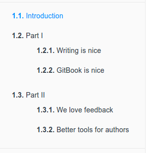

# gitbook

--------

## 简介

> Modern documentation format and toolchain using Git and Markdown 

gitbook 它使用 Git 和 Markdown 来编排书本，这是 [gitbook](https://github.com/GitbookIO/gitbook) 项目主页上对 gitbook 的定义。

GitBook除了是一个命令行工具，它同时也是间书籍发布平台和电子书店。桌面版本同时支持Mac、Windows、Linux三种平台。

**支持格式**

GitBook工具能够制作多种格式书籍：PDF、ePub、mobi与线上阅读版本（网站HTML）。

它是开源的,你可以在[这里](https://github.com/GitbookIO/gitbook)看到工具的源代码，亦可在[GitHub](https://github.com/GitbookIO/gitbook/issues)上提交问题与意见，甚至写组解决问题或改善程序。

**GitBook 的基本特性：**

1. 以Markdown轻量级标记语法作为编辑“原稿”的基础。
2. 使用Git作为版本管理架构。
3. 通过云端服务生成各种通用电子书格式。
4. 支持在浏览器中阅读，增加了JavaSript。
5. 读者可直接付费购买，支持创作与正版流通。
6. 提供OPDS流通，可在移动设备上使用支持的阅读软件

### 安装gitbook-cli

gitbook 详细安装指南可以参考 [gitbook 文档](https://github.com/GitbookIO/gitbook)。

```
sudo apt-get install nodejs  # 安装nodejs
node -v  # 查看nodejs版本
# sudo apt-get install npm  # 安装npm ??
sudo npm install gitbook-cli -g  # 安装gitbook-cli
gitbook -V  # 查看gitbook版本
```

### GitBook 目录结构介绍

一本由 GitBook 创建的电子书籍，除了实际内容文件外，还应包含如下文件：

- `README.md`:书的介绍文字，如前言、简介，在章节中也可做为章节的简介。（必须）
- `SUMMARY.md`:定制书籍的章节结构和顺序。（必须）
- `LANGS.md`:多种语言设置。
- `GLOSSARY.md`:词量表和定义描述。

> `README.md`和`SUMMARY.md`是GitBook 制作电子书的必要文件，可用`gitbook init`命令自动生成，其余文件如有需要，可手动添加。

GitBook 基本的目录结构如下所示

```
.
├── book.json
├── README.md
├── SUMMARY.md
├── chapter-1/
|   ├── README.md
|   └── something.md
└── chapter-2/
    ├── README.md
    └── something.md
```

#### 章节目录

GitBook 使用`SUMMARY.md`文件作为书籍的目录结构，既多层次章节设置。它同时也被用来制作书籍目录（TOC-Tables Of Contents）。

`SUMMARY.md`的格式只是简单的连接列表，连接的“名称”就是章节的“标题”，连接标的则是实际内容“文件”（包含路径）。
章节的层级，就是根据清单的层级关系定义的。

> 多层级可将书籍分为“部”、“章”、“节”或“小节”，而且不会自动赋予标号或固定名称，选择自己想要的结构即可。
> 没有在`SUMMARY.md`中出现的文件，GitBook 在生成各种格式电子书的时候是不会将其包含在内的，因此可以自由撰写草稿、参考文件等，只要不将它们加入到`SUMMARY.md`文件中，就不会被发布。

**简单结构目录示例**

`Summary.md`

```
 #Summary
 * [第一章](chapter1.md)
 * [第二章](chapter2.md)
 * [第三章](chapter3.md)
```

**多层结构目录示例**

`Summary.md`

```
 #Summary
 * [第一部](part1/README.md)
    * [写作是没好的](part1/writing.md)
    * [GitBook 也不错](part1/gitbook.md)
 * 第二部
    * [我们欢迎读者回馈](part2/feedback_please.md)
    * [对作者更好的工具](part2/better_tools.md)
```

ps. 可以看到“第一部”有连接到实际的文件，可以放一个简单的“章节简介”，或特殊的标题或引言，甚至是展现一张图片都可以。而“第二部”则没有连接任何文件，这样在发布书籍时，就有可能导致“第二部”解析错误，后面有连接实际文件的不会受此影响。

> `README.md`文件默认会作为多层目录结构中的章节连接文件。

```
# Summary
* [Introduction](README.md)
* [Part I](part1/README.md)
    * [Writing is nice](part1/writing.md)
    * [GitBook is nice](part1/gitbook.md)
* [Part II](part2/README.md)
    * [We love feedback](part2/feedback_please.md)
    * [Better tools for authors](part2/better_tools.md)
```

这个配置对应的目录结构如下所示:



我们通过使用 标题 或者 水平分割线 标志将 GitBook 分为几个不同的部分

```
# Summary

### Part I

* [Introduction](README.md)
* [Writing is nice](part1/writing.md)
* [GitBook is nice](part1/gitbook.md)

### Part II

* [We love feedback](part2/feedback_please.md)
* [Better tools for authors](part2/better_tools.md)

----

* [Last part without title](part3/title.md)
```

这个配置对应的目录结构如下所示：


#### 多语言

GitBook 支持多种语言编写图书。每种语言必须是一个子目录，子目录结构与 GitBook 结构相同（拥有各自的README.md、SUMMARY.md以及实际内容文件）， `LANGS.md` 在外层父目录（书籍项目根目录），其内容格式如下：

`LANGS.md`

```
 * [English](en/)
 * [zh-hans](zh-hans/)
 * [zh-tw](zh-tw/)
```

#### 忽略目录和文件

GitBook 会读取 `.gitignore`,`.bookignore` 以及 `.ignore` 这三个档案，根据里面的内容，忽略特定的文件或子目录。（格式为一行一个文件或目录。）

`.gitignore`

```
#忽略 test.md 文件
test.md

#忽略 "bin" 目录下所有文件
bin/*
```

#### 术语表

词汇表文件，默认对应的文件是 `GLOSSARY.md`。该文件主要存储词汇信息，如果在其他页面中出现了该文件中的词汇，鼠标放到词汇上会给出词汇示意，可以将鼠标移到下面两个词汇上看下效果。

在术语表中指定要显示的术语和其各自的定义。基于这些条件 gitbook 会自动建立索引，并在内容页面中高亮显示这些术语。

`GLOSSARY.md`

```
# term
Definition for this term

# Another term
With it's definition, this can contain bold text and all other kinds of inline markup ...
```

#### 配置信息

book.json存放配置信息

## GitBook 使用

### gitbook-cli 终端命令

gitbook 的基本用法非常简单，基本上就只有两步：

1. 使用 `gitbook init` 初始化书籍目录
2. 使用 `gitbook serve` 编译书籍

下面将结合一个非常简单的实例，来介绍 gitbook 的基本用法。

1. gitbook init

```
gitbook init
```

创建如下目录结构：

```
$ tree book/
book/
├── README.md
└── SUMMARY.md

0 directories, 2 files
```

README.md 和 SUMMARY.md 是两个必须文件，README.md 是对书籍的简单介绍：

```
$ cat book/README.md 
# README

This is a book powered by [GitBook](https://github.com/GitbookIO/gitbook).
```

SUMMARY.md 是书籍的目录结构。内容如下：

```
$ cat book/SUMMARY.md 
# SUMMARY

* [Chapter1](chapter1/README.md)
  * [Section1.1](chapter1/section1.1.md)
  * [Section1.2](chapter1/section1.2.md)
* [Chapter2](chapter2/README.md)
```

创建了这两个文件后，使用 `gitbook init`，它会为我们创建 SUMMARY.md 中的目录结构。

```
$ cd book
$ gitbook init
$ tree
.
├── README.md
├── SUMMARY.md
├── chapter1
│   ├── README.md
│   ├── section1.1.md
│   └── section1.2.md
└── chapter2
    └── README.md

2 directories, 6 files
```

2. gitbook serve

书籍目录结构创建完成以后，就可以使用 `gitbook serve` 来编译和预览书籍了：

```
$ gitbook serve
Press CTRL+C to quit ...

Live reload server started on port: 35729
Starting build ...
Successfully built!

Starting server ...
Serving book on http://localhost:4000
```

`gitbook serve` 命令实际上会首先调用 `gitbook build` 编译书籍，完成以后会打开一个 web 服务器，监听在本地的 4000 端口。

现在，可以用浏览器打开 http://127.0.0.1:4000查看书籍的效果

现在，gitbook 为我们创建了书籍目录结构后，就可以向其中添加真正的内容了，文件的编写使用 markdown 语法，在文件修改过程中，每一次保存文件，`gitbook serve` 都会自动重新编译，所以可以持续通过浏览器来查看最新的书籍效果！

**初始化书籍目录**

```
gitbook init
```

**生成静态网页**

```
gitbook build
```

**生成静态网页并运行服务器**

```
gitbook serve
```

**生成时指定gitbook的版本, 本地没有会先下载**

```
gitbook build --gitbook=2.0.1
```

**列出本地所有的gitbook版本**

```
gitbook ls
```

**列出远程可用的gitbook版本**

```
gitbook ls-remote
```

**安装对应的gitbook版本**

```
gitbook fetch 标签/版本号
```

**更新到gitbook的最新版本**

```
gitbook update
```

**卸载对应的gitbook版本**

```
gitbook uninstall 2.0.1
```

**指定log的级别**

```
gitbook build --log=debug
```

**输出错误信息**

```
gitbook builid --debug
```

**列出gitbook所有的命令**

```
gitbook help
```

**输出gitbook-cli的帮助信息**

```
gitbook --help
```


### GitBook.com线编辑器

访问gitbook.com，如有GitHub帐号，直接使用GitHub帐号进行授权注册，这里使用GitHub帐号，是因为与GitHub进行关联时无需再次做GitHub授权操作。当然，你也可以注册一个GitBook帐号。 

在gitbook仓储设置关联github仓储，可以与github仓储同步。

### GitBook Editor 客户端

GitBook Editor 客户端与其在线编辑器完全一样，区别在于一个是在线编辑器，一个是离线编辑器。

## 发布到 GitHub Pages

除了能够将书籍发布到 GitBook.com 外，还可以将书籍发布到 GitHub Pages，由于没有找到官方文档，所以这里记录的是我自己正在使用的一种方法。

如果读者不了解 GitHub Pages 为何物，简单说就是一个可以托管静态网站的 Git 项目，支持使用 markdown 语法以及 Jekyll 来构建，或者直接使用已经生成好的静态站点。详细可以参考 [GitHub Pages 主页](https://pages.github.com/)。

由于 gitbook 书籍可以通过 `gitbook` 本地构建出 site 格式，所以可以直接将构建好的书籍直接放到 GitHub Pages 中托管，之后，可以通过如下地址访问书籍：

`<username>.github.io/<project>`

例如：这本书中使用的例子 'test' 项目可以通过地址：*xxx.github.io/test* 来访问。

当访问 *xxx.github.io/test* 时，会访问 *xxx/test* 项目的 *gh-pages* 分支的内容，所以需要为项目创建一个 *gh-pages* 分支，并且将静态站点内容放入其中。也就是说，test 项目将有如下两个分支：

- master, 保存书籍的源码
- gh-pages, 保存书籍编译后的 HTML 文件

### build构建书籍

首先，使用 `gitbook build` 将书籍内容输出到默认目录，也就是当前目录下的 *_book* 目录。

```
$ gitbook build
Starting build ...
Successfully built!

$ ls _book
GLOSSARY.html       chapter1            chapter2            gitbook             glossary_index.json index.html          search_index.json
```

### 创建 gh-pages 分支

执行如下命令来创建分支，并且删除不需要的文件：

```
$ git checkout --orphan gh-pages
$ git rm --cached -r .
$ git clean -df
$ rm -rf *~
```

现在，目录下应该只剩下 *_book* 目录了，首先，忽略一些文件：

```
$ echo "*~" > .gitignore
$ echo "_book" >> .gitignore
$ git add .gitignore
$ git commit -m "Ignore some files"
```

然后，加入 *_book* 下的内容到分支中：

```
$ cp -r _book/* .
$ git add .
$ git commit -m "Publish book"
```

### 上传书籍内容到 GitHub

现在，可以将编译好的书籍内容上传到 GitHub 中 *test* 项目的 *gh-pages* 分支了，虽然这里还没有创建分支，上传和创建会一步完成！

```
$ git push -u origin gh-pages
Counting objects: 49, done.
Delta compression using up to 4 threads.
Compressing objects: 100% (45/45), done.
Writing objects: 100% (49/49), 1.34 MiB | 131.00 KiB/s, done.
Total 49 (delta 5), reused 0 (delta 0)
To https://github.com/chengweiv5/test.git
 * [new branch]      gh-pages -> gh-pages
Branch gh-pages set up to track remote branch gh-pages from github.
```

现在，书籍的内容已经上传到 GitHub 上，所以通过访问 *xxx.github.io/test* 就可以阅读 *test* 这本书了！

[Gitbook editor与gitbook，github同步](https://blog.csdn.net/qq_35830949/article/details/79355530)

[新版gitbook+github+Typora使用方法](https://www.wumingx.com/tools/gitbook-github-typora.html)

[GitBook 使用教程](http://gitbook.zhangjikai.com/)

[GitBook 简明教程](http://www.chengweiyang.cn/gitbook/index.html)

[GitBook插件整理](https://www.jianshu.com/p/427b8bb066e6)

[[gitbook常用的插件](https://segmentfault.com/a/1190000019806829)](https://segmentfault.com/a/1190000019806829)

