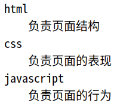
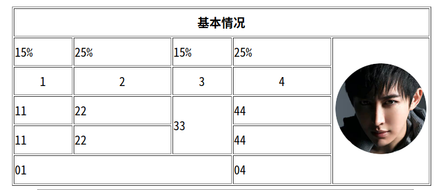

## html

### html基础

#### `<!---->`注释

html文档代码中可以插入注释，注释是对代码的说明和解释，注释的内容不会显示在页面上，html代码中插入注释的方法是：

```
<!-- 这是一段注释  -->
```

#### `<h1>`标题标签

通过 `<h1>、<h2>、<h3>、<h4>、<h5>、<h6>`,标签可以在网页上定义6种级别的标题。6种级别的标题表示文档的6级目录层级关系，比如说： `<h1>`用作主标题，其后是 `<h2>`，再其次是 `<h3>`，以此类推。搜索引擎会使用标题将网页的结构和内容编制索引，所以网页上使用标题是很重要的。

```
<h1>这是一级标题</h1>
<h2>这是二级标题</h2>
<h3>这是三级标题</h3>
<h4>这是四级标题</h4>
```

#### `<p>`段落标签

`<p>`标签定义一个文本段落，一个段落含有默认的上下间距，段落之间会用这种默认间距隔开，代码如下：

```
<!DOCTYPE html>
<html lang="en">
<head>
    <meta charset="UTF-8">
    <title>段落</title>
</head>
<body>
    <p>
    HTML是 HyperText Mark-up Language 的首字母简写，意思是超文本标记语言，超
    文本指的是超链接，标记指的是标签，是一种用来制作网页的语言，这种语言由一个个的
    标签组成，用这种语言制作的文件保存的是一个文本文件，文件的扩展名为html或者htm。
    </p>

    <p>一个html文件就是一个网页，html文件用编辑器打开显示的是文本，可以用文本的方
    式编辑它，如果用浏览器打开，浏览器会按照标签描述内容将文件渲染成网页，显示的网
    页可以从一个网页链接跳转到另外一个网页。</p>
</body>
</html>
```

`<font></font>`文本标签??

`<font></font>`

属性:

- color: 文字颜色
  表示方式:
  英文单词: red green blue......
  使用16进制的形式表示颜色: #ffffff -- (rgb)
  使用rgb(255, 255, 0)
- size: 文字大小
  范围 1 -- 7

#### 文本格式化

HTML 可定义很多供格式化输出的元素，比如粗体和斜体字。

**文本格式化标签**


| 标签       | 描述                                  |
| ---------- | ------------------------------------- |
| `<b>`      | 定义粗体文本。                        |
| `<big>`    | 定义大号字。                          |
| `<em>`     | 定义着重文字。                        |
| `<i>`      | 定义斜体字。                          |
| `<small>`  | 定义小号字。                          |
| `<strong>` | 定义加重语气。                        |
| `<sub>`    | 定义下标字。                          |
| `<sup>`    | 定义上标字。                          |
| `<ins>`    | 定义插入字。                          |
| `<del>`    | 定义删除字。                          |
| `<s>`      | *不赞成使用。*使用 `<del> `代替。     |
| `<strike>` | *不赞成使用。*使用 `<del>` 代替。     |
| `<u>`      | *不赞成使用。*使用样式（style）代替。 |

**“计算机输出”标签**

| 标签          | 描述                              |
| ------------- | --------------------------------- |
| `<code>`      | 定义计算机代码。                  |
| `<kbd>`       | 定义键盘码。                      |
| `<samp>`      | 定义计算机代码样本。              |
| `<tt>`        | 定义打字机代码。                  |
| `<var>`       | 定义变量。                        |
| `<pre>`       | 定义预格式文本。                  |
| `<listing>`   | *不赞成使用。*使用 `<pre>` 代替。 |
| `<plaintext>` | *不赞成使用。*使用 `<pre>` 代替。 |
| `<xmp>`       | *不赞成使用。*使用 `<pre>` 代替。 |

**引用、引用和术语定义**

| 标签           | 描述               |
| -------------- | ------------------ |
| `<abbr>`       | 定义缩写。         |
| `<acronym>`    | 定义首字母缩写。   |
| `<address>`    | 定义地址。         |
| `<bdo>`        | 定义文字方向。     |
| `<blockquote>` | 定义长的引用。     |
| `<q>`          | 定义短的引用语。   |
| `<cite>`       | 定义引用、引证。   |
| `<dfn>`        | 定义一个定义项目。 |


#### `<br/>`换行标签

代码中成段的文字，直接在代码中回车换行，在渲染成网页时候不认这种换行，如果真想换行，可以在代码的段落中插入`<br />`来强制换行，代码如下：

```
<p>
一个html文件就是一个网页，html文件用编辑器打开显示的是文本，可以用<br />
文本的方式编辑它，<br />如果用浏览器打开<br />，浏览器会按照标签描述内容将文件<br />
渲染成网页，显示的网页可以从一个网页链接跳转到另外一个网页。
</p>
```

#### `<hr/>`水平线

属性:

- color: 3种表示方法
- size: 1-7

```
<hr color="red" size="3"/>
```

#### 字符实体

代码中成段的文字，如果文字间想空多个空格，在代码中空**多个空格**，在渲染成网页时**只会显示一个空格**，如果想显示多个空格，可以使用空格的字符实体`&nbsp;`,代码如下：

```
<!--  在段落前想缩进两个文字的空格，使用空格的字符实体：&nbsp;   -->
<p>
&nbsp;&nbsp;一个html文件就是一个网页，html文件用编辑器打开显示的是文本，可以用<br />
文本的方式编辑它，如果用浏览器打开，浏览器会按照标签描述内容将文件<br />
渲染成网页，显示的网页可以从一个网页链接跳转到另外一个网页。</p>
```

在网页上显示 “<” 和 “>” 会误认为是标签，想在网页上显示“<”和“>”可以使用它们的字符实体 `&lt;` `&gt;`，比如：

```
<!-- “<” 和 “>” 的字符实体为 &lt; 和 &gt;  -->
<p>
    3 &lt; 5 <br>
    10 &gt; 5
</p>
```

**HTML 中有用的字符实体**

注释：实体名称对大小写敏感！

| 显示结果 | 描述              | 实体名称          | 实体编号 |
| -------- | ----------------- | ----------------- | -------- |
|          | 空格              | &nbsp;            | &#160;   |
| <        | 小于号            | &lt;              | &#60;    |
| >        | 大于号            | &gt;              | &#62;    |
| &        | 和号              | &amp;             | &#38;    |
| "        | 引号              | &quot;            | &#34;    |
| '        | 撇号              | &apos; (IE不支持) | &#39;    |
| ￠       | 分（cent）        | &cent;            | &#162;   |
| £        | 镑（pound）       | &pound;           | &#163;   |
| ¥        | 元（yen）         | &yen;             | &#165;   |
| €        | 欧元（euro）      | &euro;            | &#8364;  |
| §        | 小节              | &sect;            | &#167;   |
| ©        | 版权（copyright） | &copy;            | &#169;   |
| ®        | 注册商标          | &reg;             | &#174;   |
| ™        | 商标              | &trade;           | &#8482;  |
| ×        | 乘号              | &times;           | &#215;   |
| ÷        | 除号              | &divide;          | &#247;   |

#### 块标签

大多数 HTML 元素被定义为块级元素或内联元素。

块级元素在浏览器显示时，通常会以新行来开始（和结束）。

例子：`<h1>, <p>, <ul>, <table>`

内联元素在显示时通常不会以新行开始。

例子：`<b>, <td>, <a>, `

可以通过 `<div>` 和 `<span>` 将 HTML 元素组合起来。

1. `<div>` 标签 **行间块**元素，表示一块内容，定义文档中的分区或节。
2. `<span>` 标签 **行内**元素，表示一行中的一小段内容，定义 span，用来组合文档中的行内元素。

#### `<div>`元素

HTML `<div>` 元素是块级元素，它是可用于组合其他 HTML 元素的容器。

`<div>` 元素没有特定的含义。除此之外，由于它属于块级元素，浏览器会在其前后显示折行。

如果与 CSS 一同使用，`<div>` 元素可用于对**大的内容块**设置样式属性。

`<div>` 元素的另一个常见的用途是文档**布局**。它取代了使用表格定义布局的老式方法。使用 `<table>` 元素进行文档布局不是表格的正确用法。`<table>` 元素的作用是显示表格化的数据。

属性: 对齐方式

- align       left, center, right

#### `<span>`元素

HTML `<span>` 元素是内联元素，可用作文本的容器。

`<span>` 元素也没有特定的含义。

当与 CSS 一同使用时，`<span>` 元素可用于为**部分文本**设置样式属性。

#### style 属性样式

style 属性用于改变 HTML 元素的样式。

HTML 的 style 属性提供了一种改变所有 HTML 元素的样式的通用方法。

样式是 HTML 4 引入的，它是一种新的首选的改变 HTML 元素样式的方式。通过 HTML 样式，能够通过使用 style 属性直接将样式添加到 HTML 元素，或者间接地在独立的样式表中（CSS 文件）进行定义。

背景颜色

background-color 属性为元素定义了背景颜色：

```
<p style="background-color:green">This is a paragraph.</p>
```

字体、颜色和尺寸

font-family、color 以及 font-size 属性分别定义元素中文本的字体系列、颜色和字体尺寸：

```
<p style="font-family:arial;color:red;font-size:20px;">A paragraph.</p>
```

文本对齐

text-align 属性规定了元素中文本的水平对齐方式

```
<h1 style="text-align:center">This is a heading</h1>
```


#### ``图像标签

``标签可以在网页上插入一张图片，它是独立使用的标签，它的常用属性有：

- src属性 定义图片的引用**地址**
- alt属性 定义图片**加载失败时**显示的文字，搜索引擎会使用这个文字收录图片、盲人读屏软件会读取这个文字让盲人识别图片，所以此属性非常重要。
- title: 提示文本 鼠标放到图片上显示的文字
- width: 图片宽度
- height: 图片高度

```

```

图片没有定义宽高的时候,图片按照百分之百比例显示。
如果只更改图片的宽度或者高度,图片等比例缩放。

#### 路径

像网页上插入图片这种外部文件，需要定义文件的引用地址，引用外部文件还包括引用外部样式表，javascript等等，引用地址分为绝对地址和相对地址。

- 绝对地址：相对于磁盘的位置去定位文件的地址
- 相对地址：相对于引用文件本身去定位被引用的文件地址

绝对地址在整体文件迁移时会因为磁盘和顶层目录的改变而找不到文件，相对路径就没有这个问题。相对路径的定义技巧：

- “ ./ ” 表示当前文件所在目录下，比如：“./pic.jpg” 表示当前目录下的pic.jpg的图片，这个使用时可以省略。
- “ ../ ” 表示当前文件所在目录下的上一级目录，比如：“../images/pic.jpg” 表示当前目录下的上一级目录下的images文件夹中的pic.jpg的图片。

#### `<a>`链接标签

超链接标签

`<a>`标签可以在网页上定义一个链接地址，它的常用属性有：

- href属性 定义跳转的地址
- title属性 定义鼠标悬停时弹出的提示文字框
- target属性 定义链接窗口打开的位置
  - target="_self" 缺省值，新页面替换原来的页面，在原来位置打开
  - target="_blank" 新页面会在**新**开的一个浏览器**窗口**打开

```
<a href="#"></a>         <!--  # 表示链接到页面顶部   -->
<a href="http://www.baidu.com/" title="跳转的百度网站">百度</a>
<a href="test.html" target="_blank">测试页面</a>     <!--  新窗口打开页面   -->
```

锚链接
先定义一个id锚点:

```
<p id="sd">
```

超链接到锚点:

```
<a herf="#sd">回到顶点</a>
```

#### `<ol>`有序列表

在网页上定义一个有编号的内容列表可以用`<ol>`、`<li>`配合使用来实现，代码如下：

```
<ol>
    <li>列表文字一</li>
    <li>列表文字二</li>
    <li>列表文字三</li>
</ol>
```

在网页上生成的列表，每条项目上会按1、2、3编号，有序列表在实际开发中较少使用。

属性:

- type -- 序号

  1 -- 默认
  a
  A
  i -- 罗马数字(小)
  I -- 罗马数字(大)

- start

  从序号的什么位置开始表示

#### `<ul>`无序列表

在网页上定义一个无编号的内容列表可以用`<ul>`、`<li>`配合使用来实现，代码如下：

```
<ul>
    <li><a href="#">新闻标题一</a></li>
    <li><a href="#">新闻标题二</a></li>
    <li><a href="#">新闻标题三</a></li>
</ul>
```

在网页上生成的列表，每条项目上会有一个小图标，这个小图标在不同浏览器上显示效果不同，所以一般会用样式去掉默认的小图标，如果需要图标，可以用样式自定义图标，从而达到在不同浏览器上显示的效果相同,实际开发中一般用这种列表。

属性:

- type

  实心圆圈: disc -- 默认
  空心圆圈: circle
  小方块: squar

#### `<dl>`定义列表

定义列表通常用于术语的定义。`<dl>`标签表示列表的整体。`<dt>`标签定义术语的题目。`<dd>`标签是术语的解释。一个`<dl>`中可以有多个题目和解释，代码如下：

```
<h3>前端三大块</h3>
<dl>
    <dt>html</dt>
    <dd>负责页面的结构</dd>

    <dt>css</dt>
    <dd>负责页面的表现</dd>

    <dt>javascript</dt>
    <dd>负责页面的行为</dd>
</dl>
```



#### `<form>`表单

表单用于搜集不同类型的用户输入，表单由不同类型的标签组成，相关标签及属性用法如下：

1、`<form>`标签 定义整体的表单区域

- action属性 定义表单数据提交地址
- method属性 定义表单提交的方式，一般有“get”方式和“post”方式

2、`<label>`标签 为表单元素定义文字标注

3、`<input>`标签 定义通用的表单元素

- type属性
  - type="text" 定义单行文本输入框
  - type="password" 定义密码输入框
  - type="radio" 定义单选框
  - type="checkbox" 定义复选框
  - type="file" 定义上传文件
  - type="submit" 定义提交按钮
  - type="reset" 定义重置按钮
  - type="button" 定义一个普通按钮
  - type="image" 定义图片作为提交按钮，用src属性定义图片地址
  - type="hidden" 定义一个隐藏的表单域，用来存储值
- value属性 定义表单元素的值
- name属性 定义表单元素的名称，此名称是提交数据时的键名

4、`<textarea>`标签 定义多行文本输入框

5、`<select>`标签 定义下拉表单元素

6、`<option>`标签 与`<select>`标签配合，定义下拉表单元素中的选项

**注册表单实例：**

```
<form action="http://www..." method="get">
<p>
<label>姓名：</label><input type="text" name="username" />
</p>
<p>
<label>密码：</label><input type="password" name="password" />
</p>
<p>
<label>性别：</label>
<input type="radio" name="gender" value="0" /> 男
<input type="radio" name="gender" value="1" /> 女
</p>
<p>
<label>爱好：</label>
<input type="checkbox" name="like" value="sing" /> 唱歌
<input type="checkbox" name="like" value="run" /> 跑步
<input type="checkbox" name="like" value="swiming" /> 游泳
</p>
<p>
<label>照片：</label>
<input type="file" name="person_pic">
</p>
<p>
<label>个人描述：</label>
<textarea name="about"></textarea>
</p>
<p>
<label>籍贯：</label>
<select name="site">
    <option value="0">北京</option>
    <option value="1">上海</option>
    <option value="2">广州</option>
    <option value="3">深圳</option>
</select>
</p>
<p>
<input type="submit" name="" value="提交">
<!-- input类型为submit定义提交按钮
     还可以用图片控件代替submit按钮提交，一般会导致提交两次，不建议使用。如：
     <input type="image" src="xxx.gif">
-->
<input type="reset" name="" value="重置">
</p>
</form>
```


#### `<table>`表格

1、`<table>`标签：声明一个表格，它的常用属性如下：

- border属性 定义表格的边框，设置值是数值
- cellpadding属性 定义单元格内容与边框的距离，设置值是数值
- cellspacing属性 定义单元格与单元格之间的距离，设置值是数值
- align属性 设置整体表格相对于浏览器窗口的水平对齐方式,设置值有：left | center | right

2、`<tr>`标签：定义表格中的一行

3、`<td>`和`<th>`标签：定义一行中的一个单元格，td代表普通单元格，th表示表头单元格，它们的常用属性如下：

- align 设置单元格中内容的水平对齐方式,设置值有：left | center | right
- valign 设置单元格中内容的垂直对齐方式 top | middle | bottom
- colspan 设置单元格水平合并，设置值是数值
- rowspan 设置单元格垂直合并，设置值是数值

```
	<table border="1" width="700" height="300" align="center">
		<tr>
			<th colspan="5">基本情况</th>
		</tr>
		<tr>
			<td width="15%">15%</td>
			<td width="25%">25%</td>
			<td width="15%">15%</td>
			<td width="25%">25%</td>
			<td rowspan="5"></td>
		</tr>
		<tr>
			<td align="center">1</td>
			<td align="center">2</td>
			<td align="center">3</td>
			<td align="center">4</td>
		</tr>
		<tr>
			<td>11</td>
			<td>22</td>
			<td rowspan="2">33</td>
			<td>44</td>
		</tr>
		<tr>
			<td>11</td>
			<td>22</td>
			<td>44</td>
		</tr>
		<tr>
			<td colspan="3">01</td>
			<td>04</td>
		</tr>
	</table>
```




#### 页面布局概述

布局也可以叫做排版，它指的是把文字和图片等元素按照我们的意愿有机地排列在页面上，布局的方式分为两种：

1、`<table>`布局：通过table元素将页面空间划分成若干个单元格，将文字或图片等元素放入单元格中，隐藏表格的边框，从而实现布局。这种布局方式也叫传统布局，目前主要使用在EDM(广告邮件中的页面)中，主流的布局方式不用这种。

2、`<div>+CSS`布局：主要通过CSS样式设置来布局文字或图片等元素，需要用到CSS盒子模型、盒子类型、CSS浮动、CSS定位、CSS背景图定位等知识来布局，它比传统布局要复杂，目前是主流的布局方式。

#### `<table>`布局

table来做整体页面的布局，布局的技巧归纳为如下几点：

1、按照设计图的尺寸设置表格的宽高以及单元格的宽高。

2、将表格border、cellpadding、cellspacing全部设置为0，表格的边框和间距就不占有页面空间，它只起到划分空间的作用。

3、针对局部复杂的布局，可以在单元格里面再嵌套表格，嵌套表格划分局部的空间。

4、单元格中的元素或者嵌套的表格用align和valign设置对齐方式

5、通过属性或者css样式设置单元格中元素的样式

table布局实例（个人简历页面布局实例）

使用表格的 HTML 布局

注释：`<table>` 元素不是作为布局工具而设计的。

`<table>` 元素的作用是显示表格化的数据。

使用 `<table>` 元素能够取得布局效果，因为能够通过 CSS 设置表格元素的样式：

html

```
<body>

<table class="lamp">
<tr>
  <th>
    
  </th>
  <td>
    The table element was not designed to be a layout tool.
  </td>
</tr>
</table>

</body>
```

CSS

```
<style>
table.lamp {
    width:100%;
    border:1px solid #d4d4d4;
}
table.lamp th, td {
    padding:10px;
}
table.lamp td {
    width:40px;
}
</style>
```

#### `<div>+CSS`布局

使用 `<div>` 元素的 HTML 布局
注释：`<div>` 元素常用作布局工具，因为能够轻松地通过 CSS 对其进行定位。

html

```
<body>

<div id="header">
<h1>City Gallery</h1>
</div>

<div id="nav">
London<br>
Paris<br>
Tokyo<br>
</div>

<div id="section">
<h1>London</h1>
<p>
London is the capital city of England. It is the most populous city in the United Kingdom,
with a metropolitan area of over 13 million inhabitants.
</p>
<p>
Standing on the River Thames, London has been a major settlement for two millennia,
its history going back to its founding by the Romans, who named it Londinium.
</p>
</div>

<div id="footer">
Copyright W3School.com.cn
</div>

</body>
```

CSS：

```
<style>
#header {
    background-color:black;
    color:white;
    text-align:center;
    padding:5px;
}
#nav {
    line-height:30px;
    background-color:#eeeeee;
    height:300px;
    width:100px;
    float:left;
    padding:5px;
}
#section {
    width:350px;
    float:left;
    padding:10px;
}
#footer {
    background-color:black;
    color:white;
    clear:both;
    text-align:center;
    padding:5px;
}
</style>
```

#### HTML 字符集

如需正确地显示 HTML 页面，浏览器必须知道使用何种字符集。

万维网早期使用的字符集是 ASCII。ASCII 支持 0-9 的数字，大写和小写英文字母表，以及一些特殊字符。

由于很多国家使用的字符并不属于 ASCII，现代浏览器的默认字符集是 ISO-8859-1。

如果网页使用不同于 ISO-8859-1 的字符集，就应该在 `<meta>` 标签进行指定。

charset=iso-8859-1  西欧的编码,说明网站采用的编码是英文;
charset=gb2312  说明网站采用的编码是简体中文;
charset=utf-8  代表世界通用的语言编码;可以用到中文、韩文、日文等世界上所有语言编码上
charset=big5  说明网站采用的编码是繁体中文;


