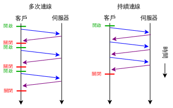

# HTTP

[TOC]

### http协议概述

超文本传输协议（英语：HyperText Transfer Protocol，缩写：HTTP）是一种用于分布式、协作式和超媒体信息系统的应用层协议。HTTP是万维网的数据通信的基础。

超文本传输协议（HTTP）的设计目的是保证客户机与服务器之间的通信。

HTTP 的工作方式是客户机与服务器之间的请求-应答协议。

举例：客户端（浏览器）向服务器提交 HTTP 请求；服务器向客户端返回响应。响应包含关于请求的状态信息以及可能被请求的内容。

HTTP是一个客户端（用户）和服务端（网站）之间请求和应答的标准，通常使用TCP协议。通过使用网页浏览器、网络爬虫或者其它的工具，客户端发起一个HTTP请求到服务器上指定端口（默认端口为80）。我们称这个客户端为用户代理程序（user agent）。应答的服务器上存储着一些资源，比如HTML文件和图像。我们称这个应答服务器为源服务器（origin server）。在用户代理和源服务器中间可能存在多个“中间层”，比如代理服务器、网关或者隧道（tunnel）。

尽管TCP/IP协议是互联网上最流行的应用，但是在HTTP协议中并没有规定它必须使用或它支持的层。事实上HTTP可以在任何互联网协议或其他网络上实现。HTTP假定其下层协议提供可靠的传输。因此，任何能够提供这种保证的协议都可以被其使用，所以其在TCP/IP协议族使用TCP作为其传输层。

通常，由HTTP客户端发起一个请求，创建一个到服务器指定端口（默认是80端口）的TCP连接。HTTP服务器则在那个端口监听客户端的请求。一旦收到请求，服务器会向客户端返回一个状态，比如"HTTP/1.1 200 OK"，以及返回的内容，如请求的文件、错误消息、或者其它信息。(维基百科)

**短连接和长连线**

在HTTP 0.9和1.0中，TCP连线在每一次请求/回应对之后关闭。在HTTP 1.1中，引入了保持连线的机制，一个连接可以重复在多个请求/回应使用。持续连线的方式可以大大减少等待时间，因为在发出第一个请求后，双方不需要重新运行TCP握手程序。

