# Jetson笔记

[TOC]

<!-- toc -->

## Jetson TX2刷机

### 首次开机

Jetson TX2首次开机开不了，按一下开机键电源红灯亮一下就熄灭了，没有其他反应？？

原因是Jetson TX2开机必须==长按电源键==，等到按键两侧绿灯亮了，再松开电源键即可启动点亮屏幕。

亲测TX2部分屏幕可以使用HDMI转VGA来转接，即使是首次开机时使用转接头也可以正常显示，但是，有的屏幕不可以使用HDMI转VGA来转接，两种情况都遇到过。

插好电源并供电（亚太版默认不带电源插线需要自配，美版带了电源插线似乎插口与国内插座不匹配），接通显示器、键盘、鼠标，然后按下主板上红色的"POWER BTN"开机按钮。
Jetson TX2 自带ubuntu 16.04 系统，默认用户名nvidia，密码nvidia。首次开机时，屏幕会显示一些提示信息，按提示步骤输入命令，安装Nvidia Linux driver图形化界面驱动。

```
ls
cd ${HOME}/NVIDIA_INSTALLER
sudo ./install.sh
sudo reboot
```

### Jetpack4.2刷机

官网教程：
[NVIDIA JetPack SDK官方文档](https://docs.nvidia.com/jetson/jetpack/index.html)
[NVIDIA SDK Manager官方手册](https://docs.nvidia.com/sdk-manager/index.html)
[SDK Manager 安装 Jetson](https://docs.nvidia.com/sdk-manager/install-with-sdkm-jetson/index.html)

[参考教程](https://www.jianshu.com/p/b70701660db3)

NVIDIA JetPack SDK是用于构建AI应用程序的最全面的解决方案。使用JetPack安装程序使用最新的操作系统映像刷新Jetson Developer Kit，为主机PC和Developer Kit安装开发人员工具，并安装快速启动开发环境所需的库和API。JetPack包括操作系统映像，库和API，开发人员工具，示例和文档。预装的Ubuntu没有集成NVIDIA的开发工具，需要先安装JETPACK才能进行开发，也就是俗称的刷机。只有TX2开发板是无法刷机的，Jetpack刷机需要准备一台装有64位Ubuntu16.04系统host主机，可以在虚拟机中安装Ubuntu16.04系统作为host主机。

> 刷机注意点：
> 刷机时间大概需要 1~2 小时，会格式化 eMMC
> host主机Ubuntu16.04系统至少30GB的硬盘空间，因为jetpack需下载的文件比较大
> 若是虚拟机虚需设置为USB3.0,jetson与主机也使用USB3.0口相连
> 重装系统后jetson的USB名称会由“NVIDIA Corp”改变为“NVIDIA Linux for Tegra”

#### 刷机准备

#### VirtualBox 虚拟机设置

没用VirtualBox虚拟机的跳过

##### 设置虚拟机网络连接桥接模式

如果主机主机是在虚拟机中运行的，一定要设置虚拟机网络连接模式桥接模式，~~并勾选复制物理网路连接状态~~，桥接模式可以让虚拟出来的操作系统就像是局域网中的一台独立的主机，它可以访问网内任何一台机器。不然在刷完系统后装软件的时候会卡死在等待获取设备IP地址这个地方

##### 设置共享粘贴板

打开虚拟机设置对话框，在左侧导航栏中点击【常规】，在右侧设置面板中选择【高级】tab页，将【共享粘贴板】和【拖放】都由默认的【已禁止】改为【双向】。

##### 设置共享文件夹

在状态栏Linux桌面菜单中，点击【设备】-【安装增强功能…】菜单项

安装包会被加载到虚拟机中,点击安装即可


遇到没有权限访问共享目录的解决办法

`You do not have the permissions necessary to view the contents of “sf_deepin_Downloads”`

将用户添加到vboxsf，然后重启

```
sudo usermod -a -G vboxsf 用户名
```

##### 必须设置USB 3.0 (xHCI) Controller

VM VirtualBox  需设置USB 3.0 (xHCI) Controller，jetson与host主机连接的物理接口也使用电脑的USB3.0口，在进入Recovery模式后需设置虚拟机，菜单栏—-device—-USB—-USB setting—-添加“NVIDIA Corp”的USB设备以便刷机重启后仍能够自动连接jetson的USB设备

#### host主机ubuntu系统设置

##### 更换成国内的软件源

中科大USTC镜像源prots

#### 安装工具sdkmanager

[NVIDIA SDK Manager官方手册](https://docs.nvidia.com/sdk-manager/index.html)

[SDK Manager 安装 Jetson](https://docs.nvidia.com/sdk-manager/install-with-sdkm-jetson/index.html)

下载并安装最新的JetPack安装工具sdkmanager，安装JetPack需要通过NVIDIA SDK Manager安装工具sdkmanager，下载sdkmanager时需要注册一个nvidia的账户，后面也需要用。

[JetPack 4.2安装工具sdkmanager下载地址](https://developer.nvidia.com/embedded/jetpack)

在host主机上安装下载的JetPack安装工具sdkmanager

```
sudo dpkg -i sdkmanager_0.9.11-3405_amd64.deb  # 安装sdkmanager
#sudo apt install ./sdkmanager-[version].[build#].deb  # 安装sdkmanager 
sdkmanager  # 启动sdkmanager软件
```

打开安装的sdkmanager软件，登录nvidia的账户。

STEP01 选择开发环境：
在 Product Category 中选择 Jetson
在 Hardware Configuration 中选择 Host Machine 则在host主机上安装NVIDIA全家桶，不选则honst不会安装任何软件；Target Hardware 选择 Jetson TX2
在 Target Operating System 中选择 JetPack 的版本
点击CONTINUE进入下一步

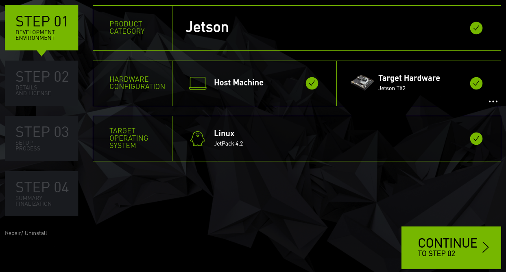

STEP02 选择安装的组件：
选择安装的组件，勾选Jetson OS则会重新刷系统，不勾选则不会；勾选Jetson SDK component 则会给jetson安装CUDA Opencv等
选择存储路径
同意条款
点击CONTINUE进入下一步

Tips：若界面显示不完整，无法勾选接受条款进行下一步，原因是笔记本的屏幕太小了，外接21寸以上**拓展屏**即可。

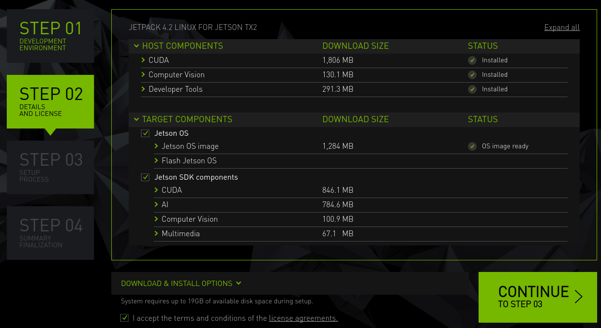

STEP03 开始下载安装相关包：
下载的时间比较久

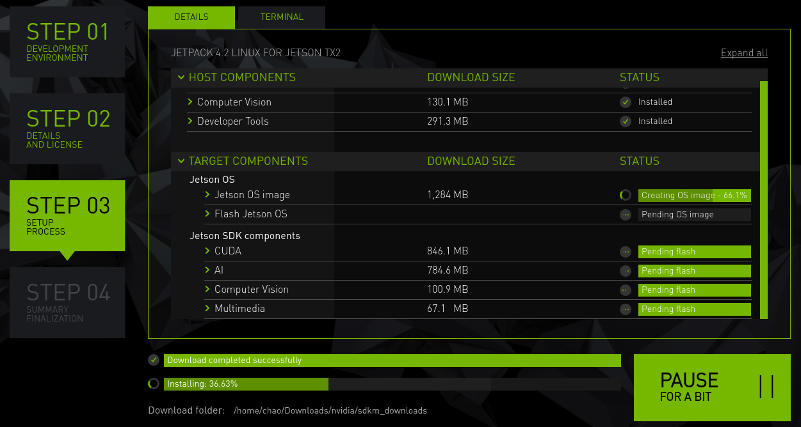

如果下载中途中断了再次打开后error报错无法继续下载，直接**覆盖安装一遍sdkmanager**即可。

下载完毕之后，会弹出一个提示框，让你用USB连接电脑，然后恢复TX2到Recovery模式，首次刷机可能自动模式会报错usb连接不上设备，建议选择手动进入恢复模式。如果只装Jetson SDK component 不重装系统的话，直接点 Skip 跳过重装系统，进入下一步安装 Jetson SDK components。

#### 主机和Jetson连接usb

只需要将host主机（USB端口）和Jetson TX2（micro USB端口）通过USB连接线（安卓手机数据线）连接起来，不再需要用网线将host主机和jetson连在同一个路由下，直接通过USB刷机。仍然建议联网。
若使用 VM VirtualBox 虚拟机，需设置为USB 3.0 (xHCI) Controller，jetson与host主机连接的物理接口也使用电脑的USB3.0口

#### 自动进入Recovery模式（不推荐）

第二次刷机的话自动模式就可以使用了（可能仍然不能使用），启动jetson运行，通过USB连接host主机和jetson，输入当前能够登录jetson的用户名和密码。
注意：若使用 VM VirtualBox 虚拟机，需设置为USB 3.0 (xHCI) Controller，jetson与host主机连接的物理接口也使用电脑的USB3.0口，在host主机上新打开一个终端，使用 lsusb 命令查看是否有“NVIDIA Corp”的设备，有说明连接成功，成功进入Recovery模式，如果是使用 VM VirtualBox 的话需设置虚拟机，在虚拟机菜单栏—-device—-USB—-勾选带NVIDIA的USB设备，然后在菜单栏—-device—-USB—-USB setting—-添加“NVIDIA Corp”或“NVIDIA Linux for Tegra”的USB设备以便刷机时重启后仍能够自动连接NVIDIA jetson的USB设备

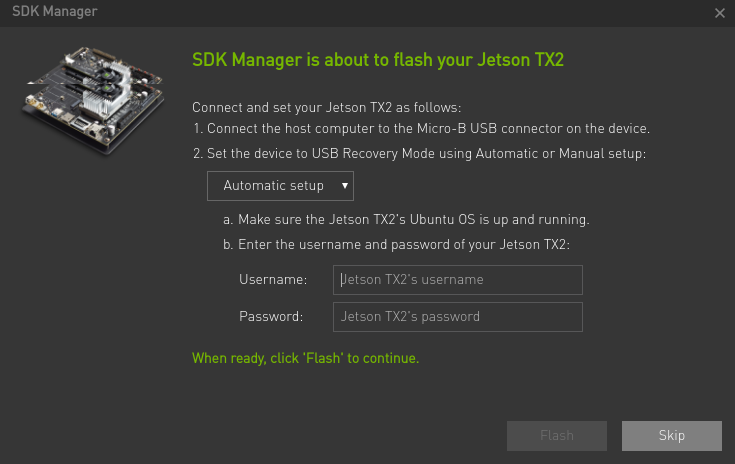

#### 手动进入Recovery模式

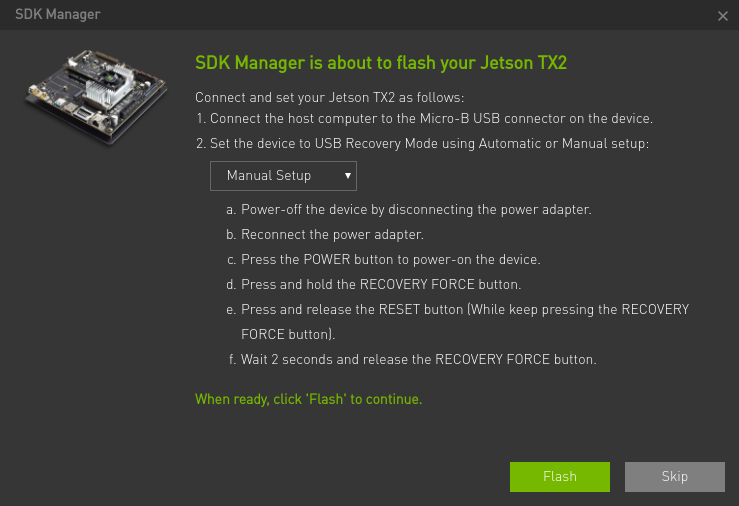

> 手动进入Recovery模式具体步骤如为： 
> 1.断开电源，拔掉JetSon TX2电源线 （断电2分钟）
> 2.重新接上电源
> 3.长按一下power键（PWR）等绿灯亮开机再松开，然后立即按住Recovery键(REC)不松开，0.5s后按一下Reset键（RST） 绿灯闪一下，继续保持按住Recovery键2s后松开Recovery键，进入Recovery强制恢复模式

在host主机上新打开一个终端，使用 `lsusb` 命令查看是否有“NVIDIA Corp”的设备，有说明连接成功，成功进入Recovery模式。如果是使用 VM VirtualBox 的话需设置虚拟机，在虚拟机菜单栏—-device—-USB—-勾选带NVIDIA的USB设备，然后在菜单栏—-device—-USB—-USB setting—-添加“NVIDIA Corp”或“NVIDIA Linux for Tegra”的USB设备，以便刷机时重启后仍能够自动连接NVIDIA jetson的USB设备。

#### 安装 Jetson OS

进入Recovery模式后，点击 Flash 进行刷机重装系统

注：刷机日志中出现错误，问题应该不大，只要能正常启动就行，多次重试都出想相同的错误，原因未知，影响未知。
注：刷到14.4%时报错`ERROR : Flash Jetson TX2 : lost connection`，刷到99.9%，报错`CPU Bootloader is not running on device`原因是USB的问题，虚拟机和host都使用USB3.0，重新刷机即可。

#### 安装 Jetson SDK components

安装完TX2镜像系统后，host主机会弹出另一个提示框，这会相当于TX 2上系统已经装好了，是一个纯净系统，下面需要在tx2上安装需要的SDK components。

Jetson安装新的系统镜像后，USB的名称变成了“NVIDIA Linux for Tegra”，如果是使用 VM VirtualBox 的话需要重新设置虚拟机，以便自动连接jetson。在虚拟机菜单栏—-device—-USB—-勾选带NVIDIA的USB设备“NVIDIA Linux for Tegra”，然后在菜单栏—-device—-USB—-USB setting—-添加“NVIDIA Linux for Tegra”的USB设备以便刷机时重启后仍能够自动连接NVIDIA jetson的USB设备。在host主机上新打开一个终端，使用 lsusb 命令查看是否有“NVIDIA Linux for Tegra”的设备，有说明连接成功。

安装完TX2系统镜像后，jetson会重启，按照提示配置系统（设置用户名和密码），设置完成后jetson会重启，在jetson登录界面等待，登入TX2的桌面也可以。

回到host主机，在主机SDK Manager软件上输入你设置的用户名和密码，IP Adress 不用管默认即可，似乎是通过USB连接登录jetson进行软件安装的，点击Install，等待安装完成。安装完成后刷机就完成啦。

Tips：若装Jetson SDK components 时，在TX的登录界面输入用户名和登录密码点`install`安装后，报错无法连接USB设备，则重启TX，**在重启的过程中一直点`install`**，在快要到登录界面时能够连接到USB设备，继续开始安装Jetson SDK components。注意保持网络连接，安装过程中会update更新，保持屏幕常亮，防止休眠。

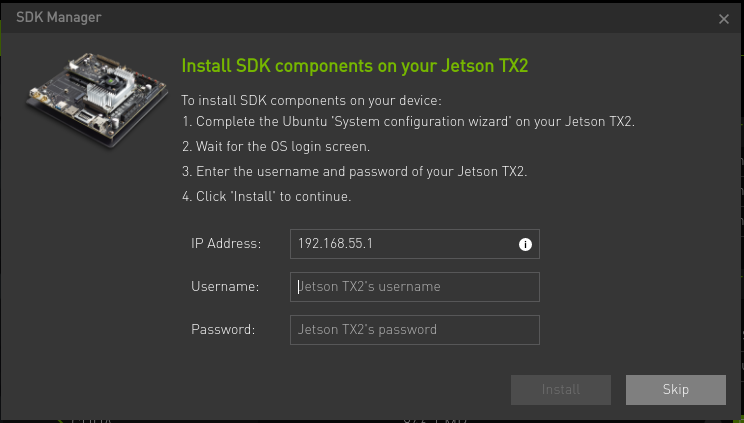

如果选删除下载文件，下次刷机还要重新下载。如果不删除，下次刷机就会省点时间。

JetPack 自带例程的位置

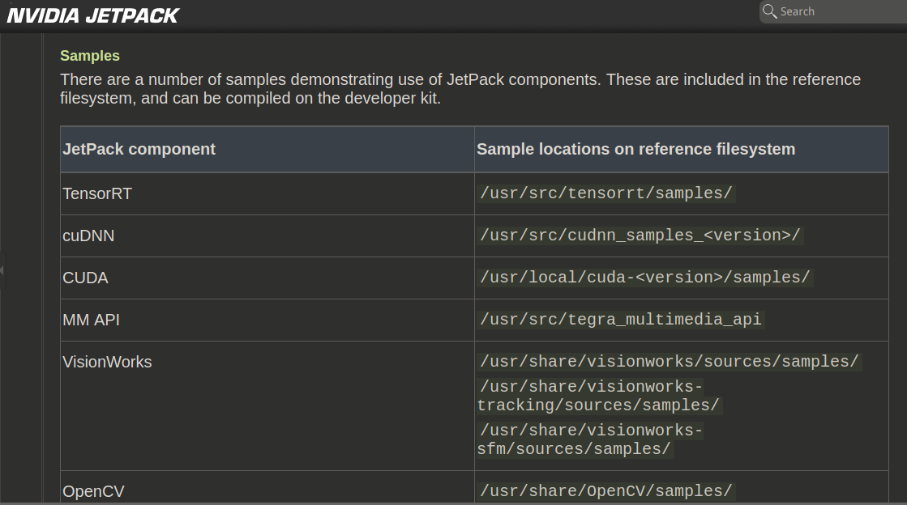


### 图为科技007载板刷机

与原装刷机方式基本一致，不同的是在 flash OS 前需替换007载板固件

PS: 007固件包仅用于JetPack4.2 升级

#### 格式化SD卡为ext4

格式化SD卡为linux的ext4格式，插入载板

#### 下载007固件包保存到任意位置

#### 下载安装NVIDIAsdkmanager

```
sudo dpkg -i sdkmanager_0.9.12-4180_amd64.deb
```

#### JetPack下载sdk所需的文件

JetPack下载完成系统OS及所需部件，且JetsonTX OS is ready

#### 复制固件到系统镜像

在开始连接载板刷机前，运行`./007.tw.run.sh`脚本复制固件到系统镜像目录`~/nvidia/nvidia_sdk/JetPack_4.2_Linux_P3310/Linux_for_Tegra/`

#### 进入 Recovery 模式

可以通过 USB 进行系统更新，更新需要进入 USB Recovery 模式。USB Recovery 模式下可以进行文件系统更
新，内核更新，boot loader 更新，BCT 更新等操作。
请根据软件更新手册步骤进行系统更新操作。
进入 Recovery 模式的步骤:
1）关闭系统电源，请确保使电源关闭而不是进入待机状态。
2）使用 USB Micro B 到 USB Type A 的链接线链接载板和主机。
3）对系统进行加电（系统自动上电启动），（不需要按下电源按键）保持按下 RECOVERY 按键的同时按下并释放复位按键，等待 2 秒释放 RECOVERY按键。
注意：在进入 USB Recovery 模式下，系统不会启动，串口不会有调试信息输出，系统会自动上电启动


## Jetson TX1刷机

### Jetpack刷机TX1

参考链接

[官方Download and Install JetPack](https://docs.nvidia.com/jetson/archives/jetpack-archived/jetpack-33/#jetpack/3.3/install.htm?TocPath=)

[JetsonHacker JetPack 2.0 Install on NVIDIA Jetson TX1](https://www.jetsonhacks.com/2015/11/18/jetpack-2-0-nvack-jetson-tx1/)

https://blog.csdn.net/c406495762/article/details/70786700
https://blog.csdn.net/jesse_mx/article/details/53315886
https://cloud.tencent.com/developer/article/1080272

Jetpack刷机需要准备一台装有64位Ubuntu16.04系统host主机，可以在虚拟机中安装Ubuntu16.04系统作为host主机。

> 刷机注意点：
> 刷机时间大概需要 1~2 小时，会格式化 eMMC
> host主机至少30GB的硬盘空间，因为jetpack需下载的文件比较大。
> 开发板刷机过程全程联网
> host主机和Jetson TX2 必须用网线连接同一个路由（在同一网段内）,建议有线连接

#### 刷机准备

#### VirtualBox 虚拟机设置

没用VirtualBox虚拟机的跳过

##### 设置虚拟机网络连接桥接模式

##### 设置共享粘贴板

##### 设置共享文件夹

遇到没有权限访问共享目录的解决办法

`You do not have the permissions necessary to view the contents of “sf_deepin_Downloads”`

将用户添加到vboxsf，然后重启

```
sudo usermod -a -G vboxsf 用户名
```

##### 必须设置USB 3.0 (xHCI) Controller

VirtualBox 虚拟机刷机卡在`tegrabct --bct P2180_A00_LP4_DSC_204Mhz.bct --chip 0x21 --updatebfsinfo flash.xml.bin`原因是VirtualBox没有设置USB 3.0，[解决办法](https://devtalk.nvidia.com/default/topic/1031273/jetson-tx1/flashing-jetpack-3-2-onto-tx1-hangs/)

VM VirtualBox  需设置USB 3.0 (xHCI) Controller

> I have the same issue and can confirm that flashing the TX1 with jetpack 3.0 on a VM (virtualbox ubuntu 16.04 on windows 10 host) works fine every time (I've used at least 10 times) and flashing with jetpack 3.2 never works and always hangs at:
>
> tegrabct --bct P2180_A00_LP4_DSC_204Mhz.bct --chip 0x21 --updatebfsinfo flash.xml.bin

> My best guess is that the USB connection to the TX1 is closed/reset/reopened several times during the flash process, but I hadn't correctly configured VirtualBox to automatically reattach the USB connection to the VM. So after each disconnect, I had to reattach manually, which maybe wasn't what the JetPack utility expected to happen.
>
> I changed the VM's USB settings, adding a filter with minimal information:
>
> - Name: NVIDIA Corp. APX
> - Vendor ID: 0955
> - Remote: No
>
> I also updated VirtualBox (to version 5.2.12) and the Oracle VM VirtualBox Extension Pack. Then in the VM's USB settings, I enabled the "USB 3.0 (xHCI) Controller". Now the TX1's USB connection automatically attaches to the VM, and flashing JetPack works.
>
> Hope this helps. My laptop's OS is Ubuntu 18.04 64-bit; my VM's OS is Ubuntu 16.04 64-bit. I'm using JetPack L4T 3.2. I'm flashing a TX1.

#### host主机 ubuntu系统设置

##### 更换成国内的软件源


#### 下载最新的JetPack安装工具

Jetson TX1只支持JetPack 3.3，不支持最新版的JetPack，往下找到[JetPack 3.3 and Jetson TX1下载地址](https://developer.nvidia.com/embedded/jetpack)

，下载时需要注册一个nvidia的账户

虚拟机home路径新建一个Jetson文件夹，拖进下载的Jetpack安装包，赋予权限并执行，直接运行，不需sudo

> mkdir ~/Jetson
> cd ~/Jetson
> sudo chmod +x JetPack-L4T-3.3-linux-x64_b39.run
> ./JetPack-L4T-3.3-linux-x64_b39.run

运行之后出现提示框，点击okay，  随后，进入安装界面，安装配置安装目录，一路Next，选择开发环境的时候选择TX1，Next进入component manager界面，下载所有的开发包，继续点击next同意各种条款，勾选Accept All，然后点击Accept。进入下载界面了，下载好安装包之后，点击OK按钮开始安装。安装完之后，点击Next，就可以进行刷机了。

#### 主机和Jetson连接


选择第一种通过路由器连接的方式

安装过程首先会将系统镜像通过USB刷写到Jetson，然后通过网线的连接，使用HOST登录Jetson的Ubuntu系统，安装选择的软件包，在这个过程中，由于有另外一些依赖的软件包需要安装，所以才需要Jetson联网。

用网线将host主机和jetson连在同一个路由下

将host主机（USB端口）和Jetson TX2（micro USB端口）通过USB连接线（安卓手机数据线）连接起来

连接完成后，点击next，直到这里，需要让JetSon TX2进入Recovery模式。


> 进入Recovery模式具体步骤如为： 
> 1.断开电源，拔掉JetSon TX2电源线 （断电2分钟）
> 2.重新接上电源
> 3.按一下power键（PWR）开机 ，2s内立即按住Recovery键(REC)不松开，0.5s后按一下Reset键（RST） ，继续保持按住Recovery键2s（或者看到 power键旁边的黄色灯闪一下）后松开Recovery键，进入Recovery强制恢复模式

在host主机上新打开一个终端，使用 `lsusb` 命令查看是否有“NVIDIA Corpration”的设备,有说明连接成功，成功进入Recovery模式，如果是虚拟机的话需先看下虚拟机设置usb设备是否选择上。

确认成功连接之后，在原来的终端`Post installation窗口`，按下回车，进行安装，刷机过程需要一些时间 。

完成后安装窗口中会显示：Installation of target components finished, close this window to continue.，关闭提示窗口即可。

最后，刷机成功。


如果选删除下载文件，下次刷机还要重新下载。如果不删除，下次刷机就会省点时间。

如果通过jetpack不刷机只重装cuda opencv等,则不需要进入usb recovery模式,只需连接网线和usb,运行jetpack根据引导,把==Flash OS Image to Tegra== (刷image到emmc)设为no action,其他操作相同.


### opencv自定义安装

卸载 OpenCV4Tegra

```
sudo apt-get purge libopencv4tegra-dev libopencv4tegra
sudo apt-get purge libopencv4tegra-repo
sudo apt-get update
```

### 安装PCL

```
sudo apt-get install libpcl-dev
sudo apt-get install libpcl-dev pcl-tools
```


## 系统配置

### 系统拓容

#### SSD固态硬盘为/根目录

仍然从eMMC闪存启动，挂载SSD为/根目录

[Develop on SSD – NVIDIA Jetson TX1 and Jetson TX2](https://www.jetsonhacks.com/2017/08/05/develop-on-ssd-nvidia-jetson-tx1-and-jetson-tx2/)

1. 格式化SSD固态硬盘

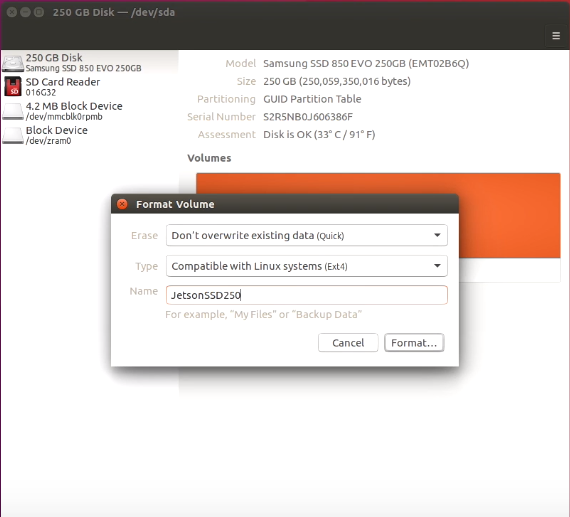

2. 挂载SSD固态硬盘

   双击状态栏SSD图标，将挂载SSD并打开文件夹

3. 将内部eMMC闪存的`/`根目录的所有内容复制到SSD硬盘中

   ```
   sudo cp -ax /  /media/nvidia/jetsonSSD250 && sync
   ```

4. 修改内部==eMMC闪存==上的启动文件extlinux.conf，以便根目录指向/dev/sda1

   ```
   cd /boot/extlinux 
   sudo cp extlinux.conf extlinux.conf.original  # 备份
   sudo gedit /boot/extlinux/extlinux.conf
   ```
   修改示例如下，

   默认启动LABEL `DEFAULT ssd` 
   Linux内核镜像`LINUX /boot/Image` 
   初始RAM磁盘 `INITRD /boot/initrd`
   启动挂载点 `root=/dev/sda1`
> TIMEOUT 30
> DEFAULT ssd
>
> MENU TITLE p2371-2180 eMMC boot options
>
> LABEL ssd
>       MENU LABEL ssd kernel
>       LINUX /boot/Image
>       INITRD /boot/initrd
>       APPEND ${cbootargs} root=/dev/sda1 rw rootwait
>
> LABEL emmc
>       MENU LABEL emmc kernel
>       LINUX /boot/Image
>       INITRD /boot/initrd
>       APPEND ${cbootargs} root=/dev/mmcblk0p1 rw rootwait

   修改后reboot重启

#### 从SD卡启动

https://www.jetsonhacks.com/2017/01/26/run-jetson-tx1-sd-card/

https://www.ncnynl.com/archives/201705/1662.html

格式化SD卡

格式化为ext4格式

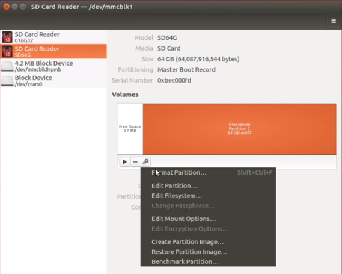

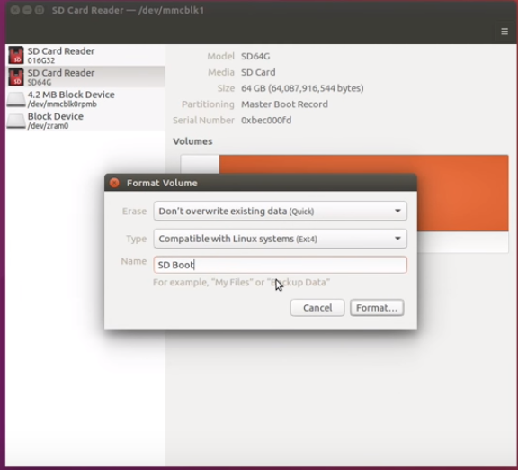

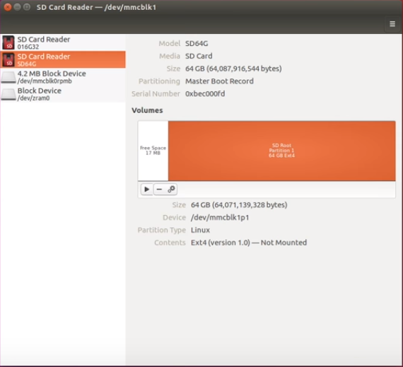

记下SD卡`Device` `/dev/mmcblk1p1`所在位置，后面要用

挂载SD卡

双击SD卡图标将安装SD卡并打开文件浏览器

将内部闪存的根目录的内容复制到SD卡

```
sudo cp -ax /  '/media/ubuntu/SDRoot'
```

修改SD卡上的文件extlinux.conf文件

```
cd '/media/ubuntu/SDRoot'
```

备份SD卡上的extlinux.conf文件，然后编辑它：

```
cd /boot/extlinux 
sudo cp extlinux.conf extlinux.conf.original 
sudo gedit /boot/extlinux/extlinux.conf
```

DEFAULT sdcard
LABEL sdcard
MENU LABEL  SD Card
root=/dev/mmcblk1p1

Sample extlinux.conf File

> TIMEOUT 30
> DEFAULT sdcard
>
> MENU TITLE p2771-0000 eMMC boot options
>
> LABEL sdcard
>       MENU LABEL  SD Card
>       LINUX /boot/Image
>       APPEND ${cbootargs} root=/dev/mmcblk1p1 rw rootwait rootfstype=ext4
>
> LABEL emmc
>       MENU LABEL  Internal eMMC
>       LINUX /boot/Image
>       APPEND ${cbootargs} root=/dev/mmcblk0p1 rw rootwait rootfstype=ext4

#### Run Jetson TX1 from USB Drive

https://www.jetsonhacks.com/2017/01/27/run-jetson-tx1-from-usb-drive/


### 软件安装

#### qt安装

依赖，不然报错 无法链接 Qt5::Widgets 

```
sudo apt install libvtk6-dev libvtk6-qt-dev  
```


```
sudo apt-get install qt5-default qtcreator -y  # 安装QT Creator
# 文档和例子(可选)
# sudo apt-get install qt5-doc qt5-doc-html qtbase5-doc-html qtbase5-examples -y  # 文档和例子
```

配置

打开qt creator,依次选择Tools->Options->Build & Run->Compilers

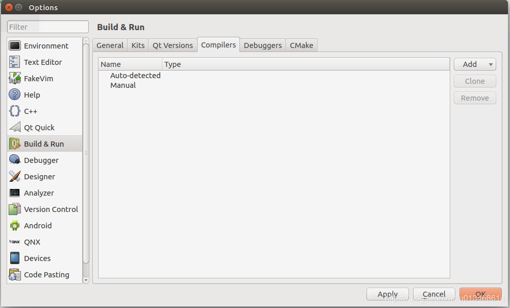

点击`Add`按钮选择`GCC`。 在`Compiler path:’`中选择加入路径`/usr/bin/gcc`。并依次设置`ABI`的选项如下图所示:（`custom – arm – linux – generic – elf – 64 bit`）：

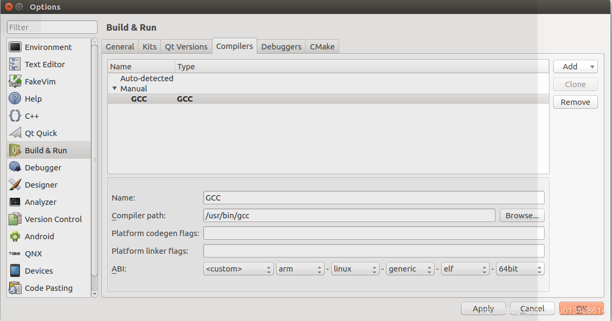

然后点击`Apply`按钮保存，然后点击`Kits`: 

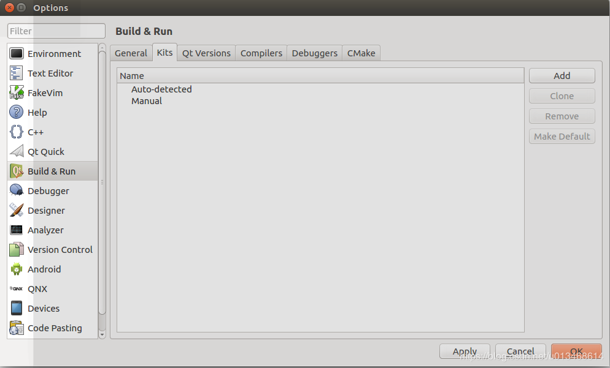

继续点击`Add`按钮，按下图填写Name，Qt version, CMake Tool等信息，填好如下图所示：

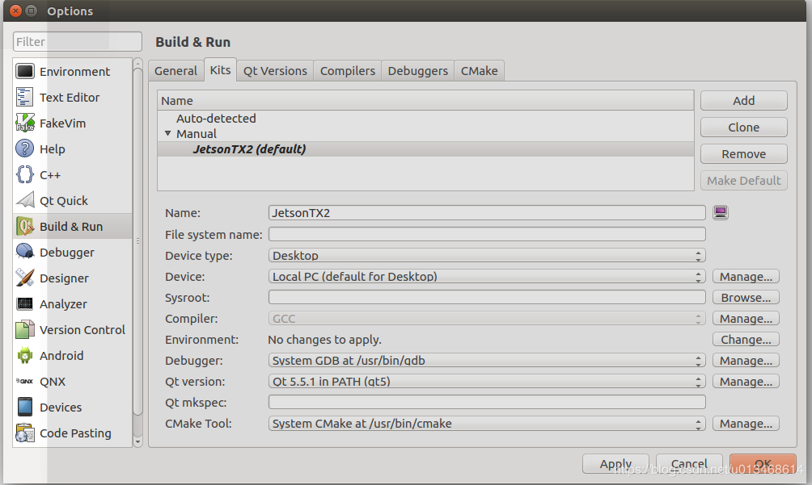

点击`Apply`,然后点击`OK`，设置完毕。

<https://blog.csdn.net/u013468614/article/details/88383558>

https://blog.csdn.net/we1583004we/article/details/80353798

#### clion安装

先安装jdk再安装clion

```
sudo apt install default-jdk  # 安装默认最新openjdk
java -version  # 测试jdk是否安装成功
javac -version
```

#### chromium安装

Jetson TX2 无法安装一般的64位chrome。
使用以下命令安装chromium

```
sudo add-apt-repository ppa:a-v-shkop/chromium
sudo apt-get update
sudo apt-get install chromium-browser
```


### 工作模式

Jetson TX2 有5工作模式及相应的CPU和GPU频率：

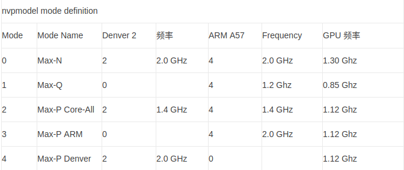

| Mode  | Mode Name      | Denver 2 | Frequency | ARM A57 | Frequency | GPU Frequency |
| ----- | -------------- | -------- | --------- | ------- | --------- | ------------- |
| **0** | Max-N          | 2        | 2.0 GHz   | 4       | 2.0 GHz   | 1.30 Ghz      |
| **1** | Max-Q          | 0        |           | 4       | 1.2 GHz   | 0.85 Ghz      |
| 2     | Max-P Core-All | 2        | 1.4 GHz   | 4       | 1.4 GHz   | 1.12 Ghz      |
| 3     | Max-P ARM      | 0        |           | 4       | 2.0 GHz   | 1.12 Ghz      |
| 4     | Max-P Denver   | 1        | 2.0 GHz   | 1       | 2.0 GHz   | 1.12 Ghz      |


查看CPU情况

```
cat /proc/cpuinfo  # 详细信息
lscpu
```

上电的时候，默认低功耗模式3，风扇不转

#### 开启最大频率

jetson_clock将CPU，GPU，EMC时钟值设置为当前模式的最大值，并设置风扇转速，为当前的 nvpmodel 模式提供了最佳的性能，并打开散热风扇。

```
sudo jetson_clocks  # TX2 不改变工作模式
sudo jetson_clock --show  # 显示CPU、GPU和EMC的当前设置
sudo ~/jetson_clocks.sh  # TX1
```

在JetPack4.2之前的版本上，在/home文件下会有一个 jetson_clocks.sh，如果想要开启高功率模式，直接使用命令行，在最新的JetPack4.2版本中，这个文件消失了，在/usr/bin/jetson_clocks 目录下，已经集成成为了一个软件，直接执行就可以启动小风扇了，瞬间温度就下来了。

#### 查询当前工作模式

```
sudo nvpmodel -q
sudo nvpmodel -q –-verbose  # 详细信息
```

#### 修改工作模式

```
sudo nvpmodel -m 0  # 0,6核全开最大频率模式
sudo nvpmodel -m 1  # 1,4核最小频率
sudo nvpmodel -m 2  # 2,6核全开均衡模式
```

The file /etc/nvpmodel.conf holds the different models. Developers can add their own models to add different modes suitable to their application.

nvpmodel模式更改后，重启后数值会保持。

### 风扇控制

风扇转速文件`/sys/devices/pwm-fan/target-pwm`

#### 查看风扇转速

```
cat /sys/devices/pwm-fan/target-pwm
```

#### 修改风扇转速

修改风扇转速文件即可改变转速

```
sudo sh -c 'echo 255 > /sys/devices/pwm-fan/target_pwm'

#sudo echo 255 > /sys/devices/pwm-fan/target-pwm
#bash: /sys/devices/pwm-fan/target_pwm: Permission denied
```

值（0~255）来修改风扇的风速

> //#sudo echo 200 > /sys/devices/pwm-fan/target-pwm
> bash: /sys/devices/pwm-fan/target_pwm: Permission denied
>
> 可以看到 bash 拒绝这么做，说是权限不够。这是因为重定向符号 “>”  也是 bash 的命令。我们使用 sudo 只是让 echo 命令具有了 root 权限，但是没有让 “>” 命令也具有 root 权限，所以 bash 会认为这两个命令都没有的权限。解决这一问题需要利用 "sh -c" 命令，它可以让 bash 将一个字串作为完整的命令来执行，这样就可以将 sudo 的影响范围扩展到整条命令。具体用法如下：`sudo sh -c 'echo 255 > /sys/devices/pwm-fan/target_pwm`

设置风扇开机一直转

设置开机运行，创建并编辑rc.local文档

```
sudo vi /etc/rc.local
```

将以下内容添加到文档中

> `#!/bin/bash`
> sleep 10
> sudo sh -c 'echo 80 > /sys/devices/pwm-fan/target_pwm'

保存文档，然后添加权限

```
sudo chmod u+x rc.local
```


### 温度控制

#### 硬件温度检测工具sensors(不推荐)

```
sudo apt-get install lm-sensors  # 安装硬件温度检测工具sensors
```

```
sensors  # 显示当前温度
```

#### 温度文件

温度文件位置

查看硬件类型

```
cat /sys/devices/virtual/thermal/thermal_zone*/type
cat /sys/devices/virtual/thermal/thermal_zone4/type
# Tboard_tegra
```

> 8个温度类型
> BCPU-therm
> MCPU-therm
> GPU-therm
> PLL-therm
> Tboard_tegra
> Tdiode_tegra
> PMIC-Die    # 第七个温度明显偏高
> thermal-fan-est

> "Tboard_tegra" measures the temperature of the Jetson TK1 board (though I'm not sure of the exact location).
> "Tdiode_tegra" measures the temperature at the edge of the Jetson TK1 board.
> The zones with "-therm" in their name are for sensors inside the Tegra SOC.
> 第七个温度明显偏高

查看硬件温度

```
cat /sys/devices/virtual/thermal/thermal_zone*/temp
cat /sys/devices/virtual/thermal/thermal_zone4/temp
# 35000
```

> 38000
> 38000
> 36500
> 38000
> 36000
> 35000
> 100000  # 第七个温度明显偏高
> 37600

以下数字分别对应以上硬件，将数字除以1000得出实际温度（摄氏度）


### 上电启动


#### 电压电流

The Jetson TX2 module has 3-channel INA3221 monitors at I2C Addresses 0x40 and 0x41. The sysfs nodes to read rail name, voltage, current, and power can be found under the INA3221 driver’s directory:
`/sys/bus/i2c/drivers/ina3221x `

Among the listed addresses under the mentioned sysfs directory, 0-0040 and 0-0041 are the power monitors for supply rails on Jetson TX2 module:
The following data can be obtained from the Sysfs:
Rail Name: ../<address>/iio_device/rail_name_<Channel> 
Current (mA): ../<address>/iio_device/in_current<Channel>_input 
Voltage (mV):../<address>/iio_device/in_voltage<Channel>_input 
Power (mW):../<address>/iio_device/in_power<Channel>_input

The address and channel allocations are given in Table 6-1.

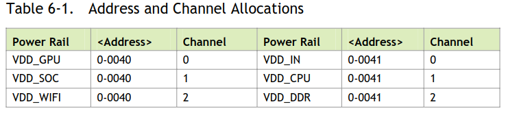

To display the name of the GPU rail: 

```
cat /sys/bus/i2c/drivers/ina3221x/0-0040/iio_device/rail_name_0 
# VDD_SYS_GPU
```

To display the current (in mA) of the GPU rail:

```
cat /sys/bus/i2c/drivers/ina3221x/0-0040/iio_device/in_current0_input 
# 180 
```

To display the voltage (in mV) of the GPU rail:

```
cat /sys/bus/i2c/drivers/ina3221x/0-0040/iio_device/in_voltage0_input 
# 730 
```

To display the power (in mW) of the GPU rail:

```
cat /sys/bus/i2c/drivers/ina3221x/0-0040/iio_device/in_power0_input 
# 1159
```


### jetson-stats / jtop

[jtop GitHub](https://github.com/rbonghi/jetson_stats)
[jtop pypi](https://pypi.org/project/jetson-stats/#jtop)

安装pip3

```
sudo apt-get install python3-pip
```

安装 jetson-stats

```
sudo -H pip3 install jetson-stats
sudo -H pip install -U jetson-stats   # 更新jtop
```

#### jtop

It is a system monitoring utility that runs on the terminal and see and **control** realtime the status of your [NVIDIA Jetson](http://www.nvidia.com/object/embedded-systems-dev-kits-modules.html). CPU, RAM, GPU status and frequency and other...

```
sudo jtop
```

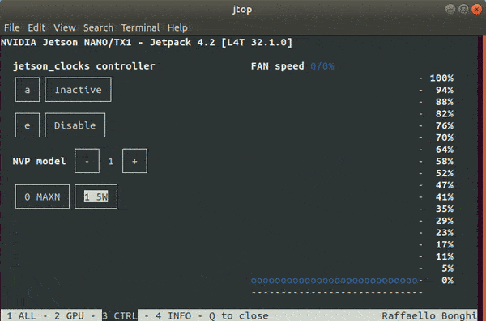

Controls

To control the your NVIDIA Jetson are available this keyboard commands:

- **a** Start/Stop jetson_clocks service (Note: jetson_clocks start only after 60s from up time)
- **e** Enable/==Disable== jetson_clocks on board **boot**
- **+** and **-** Increase and decrease the NVPmodel
- **p** and **m** Increase and decrease the Fan speed

Pages

**jtop** have four different pages to control your NVIDIA Jetson:

1. **ALL** Are collected all information about your board: CPUs status, Memory, *GPU*, disk, fan and all status about jetson_clocks, NVPmodel and other
2. **GPU** A real time GPU history about your NVIDIA Jetson
3. **CTRL** You can control the status of you
4. **INFO** Are collected all information about libraries, CUDA, Serial Number, interfaces, ...

```
nvidia@jetson-nano:~/$ sudo jtop -h
usage: jtop [-h] [-r REFRESH] [--debug] [--page PAGE] [--version]
jtop is a system monitoring utility and control. Runs on terminal
optional arguments:
  -h, --help   show this help message and exit
  -r REFRESH   refresh interval
  --debug      Run with debug logger
  --page PAGE  Open fix page
  --version    show program's version number and exit
```

#### [jetson-release](https://github.com/rbonghi/jetson_stats/wiki/jetson_release)

The command show the status and all information about your [NVIDIA Jetson](http://www.nvidia.com/object/embedded-systems-dev-kits-modules.html)

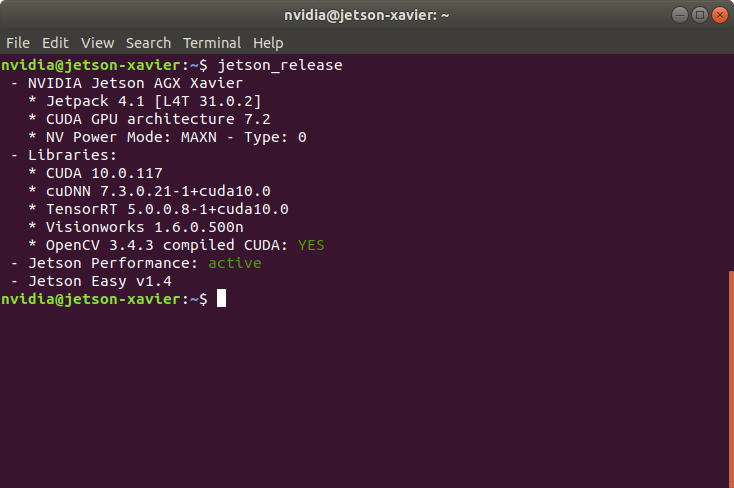

#### [jetson_variables](https://github.com/rbonghi/jetson_stats/wiki/jetson_variables)

This script generate the easy environment variables to know which is your Hardware version of the Jetson and which Jetpack you have already installed

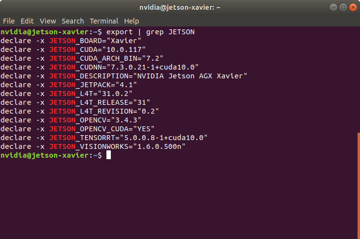


### 查看系统信息

```
sudo jetson-release
```

#### 查看Jetson TX2 L4T版本

```
head -n 1 /etc/nv_tegra_release
```

> ``#R32 (release), REVISION: 1.0, GCID: 14531094, BOARD: t186ref, EABI: aarch64, DATE: Wed Mar 13 07:41:08 UTC 2019

### 修改显示器分辨率

[](https://www.chkui.com/article/linux/ubuntu_modify_view_port_by_xrandr)

https://blog.csdn.net/cugxyy6/article/details/78368934

查看当前的分辨率，带*号的为当前分辨率

```
xrandr
# xrandr -q
```

> Screen 0: minimum 320 x 200, current 1440 x 900, maximum 8192 x 8192
> VGA1 connected 1440x900+0+0 (normal left inverted right x axis y axis) 0mm x 0mm
> 1360x768 59.8
> 1024x768 60.0
> 800x600 60.3 56.2
> 848x480 60.0
> 640x480 59.9 59.9

其中`VGA1`为显示器名称。可以看到当前使用的显卡是 VGA1（后续显示模式在此显卡上添加），列表中并无 1440x900 的分别率可用。这时可以使用 xrandr 命令新增显示模式，由于显示模式有一定的格式，如果不知道如何配置，可以通过cvt 命令来获得。

查询配置格式

cvt 使用方法：cvt X Y，X 表示分辨率宽度，Y 表示分辨率高度。如生成 1280x800 的分辨率，可使用命令：

```
cvt 1440 900
```

> 1440x900 59.89 Hz (CVT 1.30MA) hsync: 55.93 kHz; pclk: 106.50 MHz 
> Modeline "1440x900_60.00" 106.50 1440 1528 1672 1904 900 903 909 934 -hsync +vsync

将 cvt 得到的显示模式使用 xrandr 命令添加：

```
# 设置新的分辨率模式
xrandr --newmode "1440x900" 106.50 1440 1528 1672 1904 900 903 909 934 -hsync +vsync
# 删除添加的分辨率模式
# xrandr --rmmode 1440x900
# 添加新的模式
xrandr --addmode VGA1 1440x900
# 指定输出设备
xrandr --output VGA1 --mode 1440x900
```

立马启用修改后的配置：

```
source /etc/profile
```

这时就可以在显示器分辨率设置里使用 1440x900 的分辨率了。

可能在每次开机时，又不能使用设定好的分辨率了，使用如下命令： 

```
sudo gedit ~/.profile 
```

在 ~/.profile 最末尾添加修改分辨率的命令：

> cvt 1440 900
> xrandr --newmode 1440x900 106.50 1440 1528 1672 1904 900 903 909 934 -hsync +vsync
> xrandr --addmode VGA1 1440x900

重启系统后再登录即可，此时再用 xrandr 命令，即可看到新添加的分辨率。


### 网络设置

#### wifi 优先级

网络设置中 `Connection priority for auto-activation` 数值越大优先级越高，可正可负，默认0

#### Ubuntu 设置静态ip

##### 查看ip所处网段

```
ifconfig
```

> eth0: flags=4099<UP,BROADCAST,MULTICAST>  mtu 1500
>         ether 00:04:4b:dd:50:80  txqueuelen 1000  (Ethernet)
>         RX packets 0  bytes 0 (0.0 B)
>         RX errors 0  dropped 0  overruns 0  frame 0
>         TX packets 0  bytes 0 (0.0 B)
>         TX errors 0  dropped 0 overruns 0  carrier 0  collisions 0
>         device interrupt 41  
>
> l4tbr0: flags=4099<UP,BROADCAST,MULTICAST>  mtu 1500
>         inet 192.168.55.1  netmask 255.255.255.0  broadcast 192.168.55.255
>         inet6 fe80::1  prefixlen 128  scopeid 0x20<link>
>         inet6 fe80::a81b:2eff:fe2d:98dc  prefixlen 64  scopeid 0x20<link>
>         ether 96:8d:f0:0a:81:05  txqueuelen 1000  (Ethernet)
>         RX packets 0  bytes 0 (0.0 B)
>         RX errors 0  dropped 0  overruns 0  frame 0
>         TX packets 8  bytes 736 (736.0 B)
>         TX errors 0  dropped 0 overruns 0  carrier 0  collisions 0
>
> lo: flags=73<UP,LOOPBACK,RUNNING>  mtu 65536
>         inet 127.0.0.1  netmask 255.0.0.0
>         inet6 ::1  prefixlen 128  scopeid 0x10<host>
>         loop  txqueuelen 1  (Local Loopback)
>         RX packets 2977  bytes 218595 (218.5 KB)
>         RX errors 0  dropped 0  overruns 0  frame 0
>         TX packets 2977  bytes 218595 (218.5 KB)
>         TX errors 0  dropped 0 overruns 0  carrier 0  collisions 0
>
> rndis0: flags=4099<UP,BROADCAST,MULTICAST>  mtu 1500
>         ether 96:8d:f0:0a:81:05  txqueuelen 1000  (Ethernet)
>         RX packets 0  bytes 0 (0.0 B)
>         RX errors 0  dropped 0  overruns 0  frame 0
>         TX packets 0  bytes 0 (0.0 B)
>         TX errors 0  dropped 0 overruns 0  carrier 0  collisions 0
>
> usb0: flags=4099<UP,BROADCAST,MULTICAST>  mtu 1500
>         ether 96:8d:f0:0a:81:07  txqueuelen 1000  (Ethernet)
>         RX packets 0  bytes 0 (0.0 B)
>         RX errors 0  dropped 0  overruns 0  frame 0
>         TX packets 0  bytes 0 (0.0 B)
>         TX errors 0  dropped 0 overruns 0  carrier 0  collisions 0
>
> wlan0: flags=4163<UP,BROADCAST,RUNNING,MULTICAST>  mtu 1500
>         inet 192.168.1.102  netmask 255.255.255.0  broadcast 192.168.1.255
>         inet6 fe80::eb92:e8b3:8b74:50e2  prefixlen 64  scopeid 0x20<link>
>         ether 00:04:4b:dd:50:7e  txqueuelen 1000  (Ethernet)
>         RX packets 25980  bytes 22830716 (22.8 MB)
>         RX errors 0  dropped 0  overruns 0  frame 0
>         TX packets 19052  bytes 3072476 (3.0 MB)
>         TX errors 0  dropped 0 overruns 0  carrier 0  collisions 0

查到当前wifi的ip为`192.168.1.102`

##### 查看网关

```
ip rout show
```

> default via 192.168.1.1 dev wlan0 proto dhcp metric 600 
> default via 192.168.55.100 dev l4tbr0 metric 32766 linkdown 
> 169.254.0.0/16 dev l4tbr0 scope link metric 1000 linkdown 
> 172.17.0.0/16 dev docker0 proto kernel scope link src 172.17.0.1 linkdown 
> 192.168.1.0/24 dev wlan0 proto kernel scope link src 192.168.1.102 metric 600 
> 192.168.55.0/24 dev l4tbr0 proto kernel scope link src 192.168.55.1 linkdown 

第一行 `default`为默认网关，`192.168.1.1`为无线网关，`wlan0`无线网卡
第二行 为有线/桥接网关？？

查到当前的无线网关为`192.168.1.1`

##### 方法一 为每个网络设置ip

网络 – edit connection – 535wifi – IPV4 Setting – Method – Manual – 添加网络配置 Adress（静态 ip192.168.1.35）， Netmask（子网掩码 255.255.255.0），Geteway（网关 192.168.1.1），DNS servera（DNS解析 8.8.8.8），Search domains空着

按照上面查询的信息填写，静态ip地址要与当前ip/网关处于同一网段

断开网络重新连接，查看新的ip地址

##### 方法二 修改配置文件（不推荐）

```
sudo gedit /etc/n
```

修改内容如下：

> auto lo
> iface lo inet loopback
>
> auto wlan0                          # 设置自动启动eth0接口
> iface wlan0 inet static         # 配置静态IP
> address 192.168.1.35         # 静态IP地址
> netmask 255.255.255.0      # 子网掩码
> gateway 192.168.1.1          # 默认网关
>
> dns-nameserver 8.8.8.8     # DNS解析地址

重启网卡

```
sudo /etc/init.d/networking restart
```


### root 自动登录

<https://www.jianshu.com/p/51f3653d87ad>

<https://blog.csdn.net/qq_38196234/article/details/89558855>

### 启动图形界面

Ubuntu 的系统运行级别：    

- Runlevel 0 : 关机级别    
- Runlevel 1 : 单用户运行级别，运行rc.sysinit和rc1.d目录下的脚本，维护模式
- Runlevel 2 : 多用户，无图形系统，但系统不会启动NFS，没有网络服务
- **Runlevel 3** : 多用户，无图形系统，系统启动具有网络功能
- Runlevel 4 : 用户自定义级别，多用户，无图形系统
- **Runlevel 5** : 多用户，图形界面模式
- Runlevel 6 : 重启级别

#### 开机进入命令行模式

```
sudo systemctl set-default multi-user.target
# sudo systemctl set-default runlevel3.target  # 或者
sudo reboot
```

临时使用一次图形界面进入

```
startx
# sudo systemctl start lightdm  # 或者
```

从图形界面切换回命令行：ctrl+alt+F7??

#### 开机进入图形用户界面

```
sudo systemctl set-default graphical.target
# sudo systemctl set-default runlevel5.target  # 或者
sudo reboot
```

从命令行切换到图形界面：ctrl+alt+F7??

### 开机启动提示文字

<https://ubuntuqa.com/article/1131.html>

    sudo gedit /etc/default/grub 

> ```
> 修改两行
> GRUB_CMDLINE_LINUX_DEFAULT="quiet splash"
> GRUB_CMDLINE_LINUX="“
> ```
>
> //#桌面的默认设置(即仅限启动画面)：
> GRUB_CMDLINE_LINUX_DEFAULT="quiet splash"  # Hide text and show splash
> GRUB_CMDLINE_LINUX="“
>
> //#什么都不显示直接从黑屏到进入登录界面
> GRUB_CMDLINE_LINUX_DEFAULT=“quiet”  # Don't show Ubuntu bootup text
> GRUB_CMDLINE_LINUX="console=tty12" # Don't show kernel text # Redirect the kernel output to another tty
>
> //#显示详细的开机信息文字
> GRUB_CMDLINE_LINUX_DEFAULT=""    # Show text but not the splash
> GRUB_CMDLINE_LINUX="“

quiet  内核启动时候简化提示信息 
splash 启动的时候使用图形化的进度条代替init的字符输出过程
"quiet splash"  简化提示信息 ，且显示五个点的图形化的进度条等待界面
**“quiet”**  **简化提示信息** ，没有五个点的图形化的进度条等待界面
“splash” 显示详细的开机信息，且显示五个点的图形化的进度条等待界面
“”  显示详细的开机信息，代码刷屏开机，没有五个点的图形化的进度条等待界面

    sudo update-grub  # 更新grub
    sudo reboot


### 开机动画


### 守护进程

开机自启动服务管理

```
sudo apt-get install sysv-rc-conf
sudo sysv-rc-conf
```

打X的即表示开机启动项，可以把光标移到打叉的地方，输入空格来反选。


```
# 列出程序开机占用时间排行
systemd-analyze blame
```

```
# 开机自动启动ssh命令
sudo systemctl enable ssh

# 关闭ssh开机自动启动命令
sudo systemctl disable ssh

# 单次开启ssh
sudo systemctl start ssh

# 单次关闭ssh
sudo systemctl stop ssh
```


### 程序自启动

[systemd](https://wiki.debian.org/systemd)
[systemd](https://wiki.ubuntu.com/systemd)

[](https://www.cnblogs.com/defifind/p/9285456.html)

[](http://www.r9it.com/20180613/ubuntu-18.04-auto-start.html)

[](https://www.ruanyifeng.com/blog/2016/03/systemd-tutorial-part-two.html)

[](http://www.jinbuguo.com/systemd/systemd.service.html)

ubuntu-server-18.04 设置开机启动脚本

比如以前启动 mysql 服务用:

sudo service mysql start
现在用：

sudo systemctl start mysqld.service

systemd 默认读取 /etc/systemd/system 下的配置文件，该目录下的文件会链接/lib/systemd/system/下的文件。

执行 ls /lib/systemd/system 你可以看到有很多启动脚本，其中就有我们需要的 rc.local.service

```
# 查看service配置文件
systemctl cat sshd.service
# 查看Systemd默认的启动 Target
systemctl get-default
# 查看 multi-user.target 包含的所有服务
$ systemctl list-dependencies multi-user.target

# 切换到另一个 target
# shutdown.target 就是关机状态
$ sudo systemctl isolate shutdown.target
```


修改开机默认等待时间

```
 sudo gedit /boot/grub/grub.cfg
```

默认等待时间是10秒

> set timeout=3     #默认3秒


显示开机启动项的时间

```
systemd-analyze    # 显示总时间
systemd-analyze blame    # 显示详细
```

> chao@deepin:~$ systemd-analyze blame
>          21.755s apt-daily-upgrade.service
>           8.214s NetworkManager-wait-online.service
>           6.929s systemd-networkd-wait-online.service
>           3.194s plymouth-quit-wait.service


### 开机启动项

禁用慢的开机启动项

```
sudo systemctl disable NetworkManager-wait-online.service
```

 mask 这个 systemctl 命令的选项参数是比 disable 更强力，彻底禁用。

```
sudo systemctl mask plymouth-quit-wait.service
```


### 挂载磁盘

```
sudo vim /etc/fstab
```

> ```
> #/dev/sda1
> 
> UUID=686ad259-fad4-4e68-9237-e375e0d0ea32 / ext4 rw,relatime,data=ordered 0 1
> 
> #/dev/sda4
> 
> UUID=21017bab-45da-48c8-8376-62fa5746e0dc /home ext4 rw,relatime,data=ordered 0 2
> 
> #/dev/sdb1 LABEL=EFI040system040partition
> 
> UUID=1892-5B3E /boot/efi vfat rw,relatime,fmask=0022,dmask=0022,codepage=437,iocharset=iso8859-1,shortname=mixed,errors=remount-ro 0 2
> 
> #/dev/sda2
> 
> UUID=f2df352f-4e45-459d-8238-da663753209f none swap defaults,pri=-2 0 0
> ```


### 登录shell

##### 系统可用的shell环境

```
cat /etc/shells
```

#### 查看系统当前shell

```
ls -l /bin/sh
# lrwxrwxrwx 1 root root 4 Jan  2 12:55 /bin/sh -> dash
```

#### 配置dash让bash为默认shell

```
sudo dpkg-reconfigure dash
# 选择 <否> 取消默认配置dash，自动配置为bash
# lrwxrwxrwx 1 root root 4 May 17 21:59 /bin/sh -> bash
```

#### 修改用户登录 Shell

```
sudo usermod -s /bin/bash 用户名  # 修改用户登录 Shell
```


### SSH登录

将网络设置为与其他用户共享，才能在开机后不登录就自动连接网络。

### 桌面共享

<https://blog.csdn.net/u014337397/article/details/81140692>

Ubuntu 16.04使用root 帐号开启 SSH 登录

<https://blog.csdn.net/wy_97/article/details/78294562>


### CLion远程同步及调试

#### 远程端依赖rsync

```
sudo apt-get install rsync    # jetson安装同步工具
```

仅需设置本地CLion即可实现远程编辑和调试，设置**Deployment**通过SSH登录远程jetson即可实现代码同步编程，通过设置**远程toolchain工具链**可直接使用jetson的工具链进行编译调试。

#### 设置本地CLion

##### 设置Deployment

 File | Settings | Build, Execution, Deployment | Deployment | +号 SFPT 填写远程登录jensonTX2的帐号密码，点对号set as default 设为默认

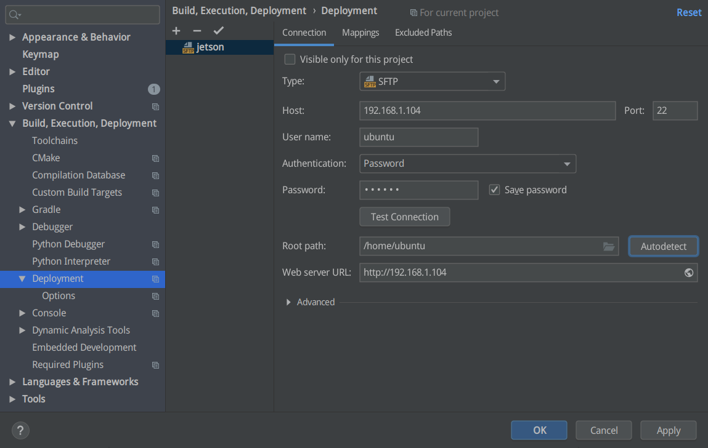

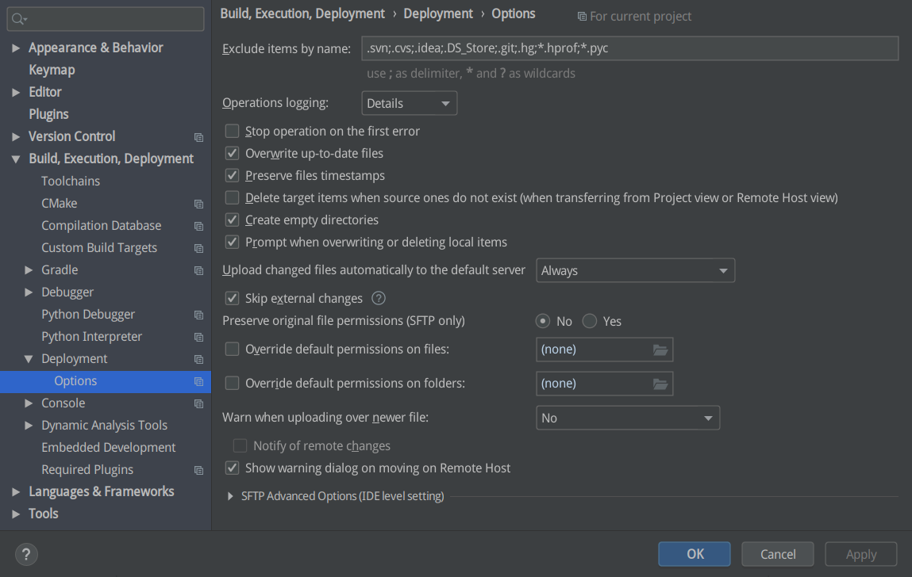

##### 删除编译文件夹cmake-build-debug

删除当前项目的编译文件夹`cmake-build-debugcmake-build-debug`

##### 设置远程Toolchains

设置远程的jetsonTX2自己的编译工具链

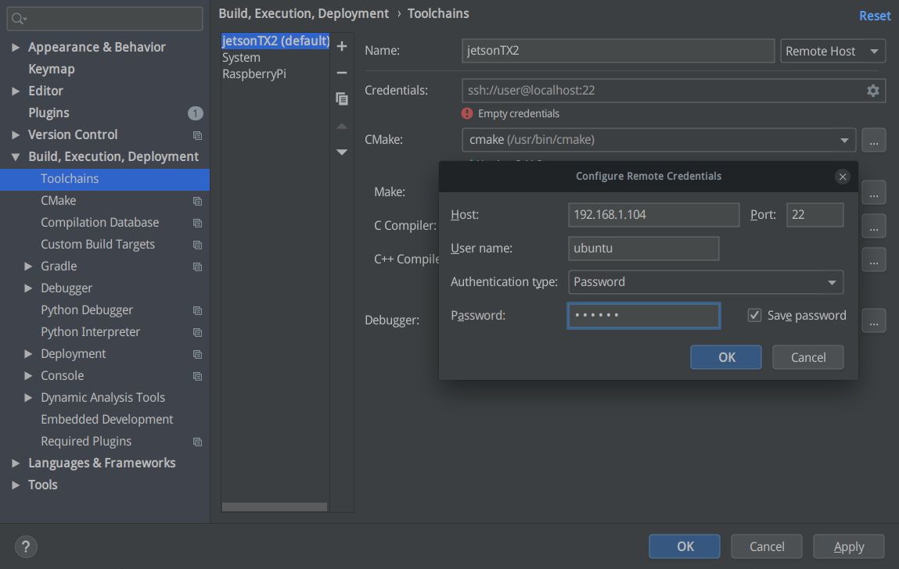

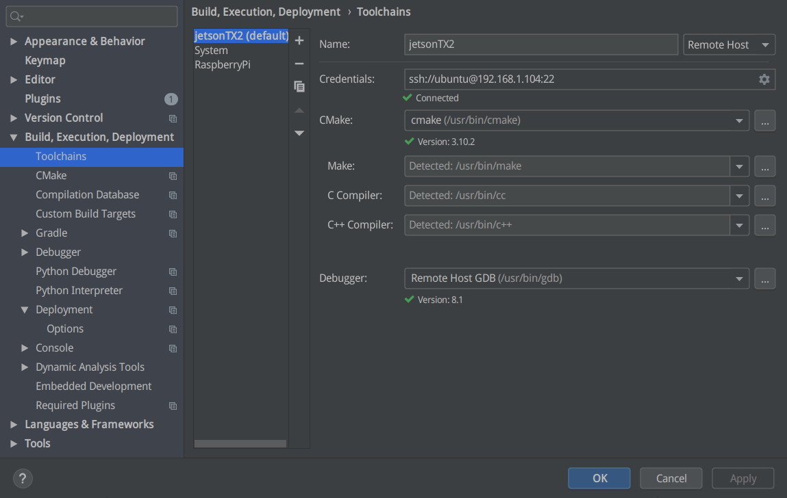

添加远程工具链后 Deployment 中会自动新增一个临时连接，保留不做任何修改即可。

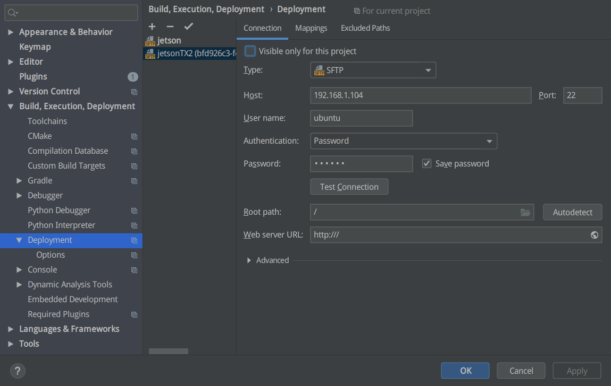

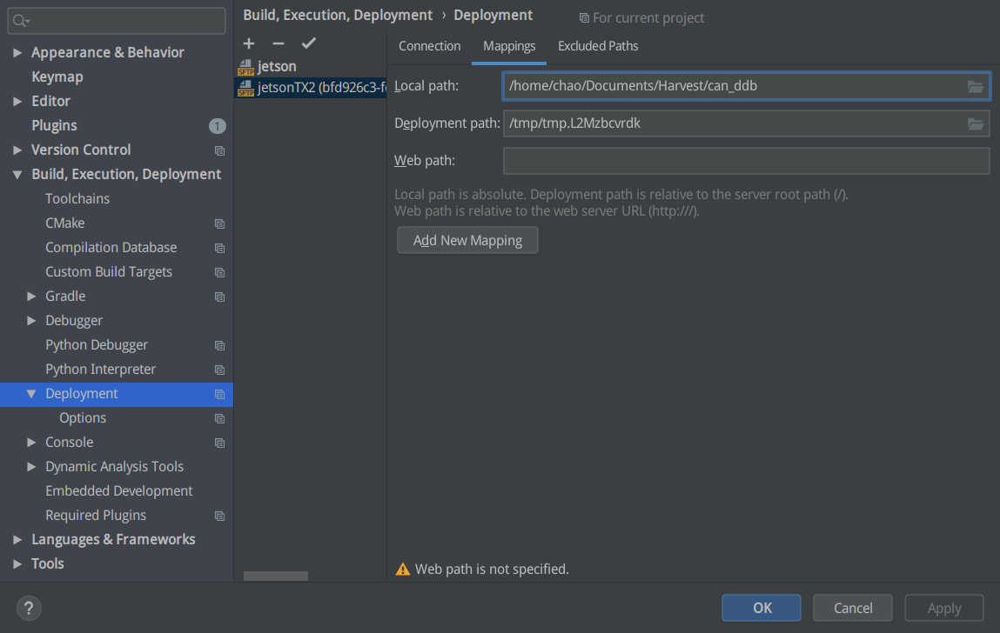

##### 编译

直接编译运行

#### Reload CMake Project？？

删除编译文件夹cmake-build-debug，右键Reload CMake Project


可能报错`Cannot read /home/chao/Documents/Harvest/can_ddb/cmake-build-debug/CMakeCache.txt`

解决：将 Toolchains 换成默认的本机编译器（同时会自动删除Deployment的临时连接），删除编译文件夹cmake-build-debug，重启Clion，删除编译文件夹cmake-build-debug，重新设置 Toolchains 为远程 Remote Host，**删除添加远程工具链后 Deployment 中会自动新增一个临时连接**，删除编译文件夹cmake-build-debug，Reload CMake Project

可能报错`Cannot generate into /home/chao/Documents/Harvest/can_ddb/cmake-build-debug
Cannot create directory
Please either delete it manually or select another generation directory`

解决：删除添加远程工具链后 Deployment 中会自动新增一个临时连接，**删除编译文件夹cmake-build-debug**，**重启Clion**，**不需要删除编译文件夹cmake-build-debug**，重新设置 Toolchains 为远程 Remote Host，ok会自动编译

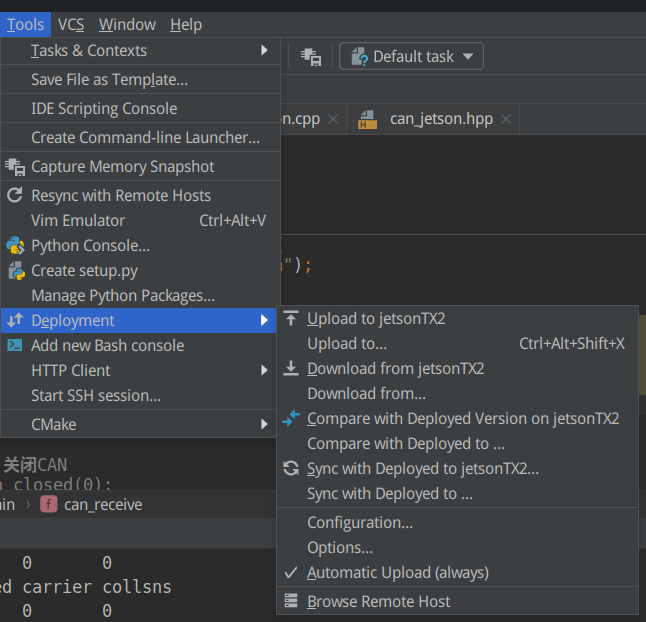

##### 调用窗口工具栏

Tool – Deployment – Browse remote host  –  浏览远程文件夹

Tool – Srart ssh session  –  终端远程登录jetsonTX2


## 外设IO

### GPIO

[Linux GPIO简介](https://elinux.org/GPIO)

Linux内核中gpio是最简单，最常用的资源(和 interrupt ,dma,timer一样)驱动程序，应用程序都能够通过相应的接口使用gpio，gpio使用0～MAX_INT之间的整数标识，不能使用负数,gpio与硬件体系密切相关的


#### 应用程序空间GPIO支持

Linux GPIO支持导出GPIO控件和状态的功能，以便与使用sysfs的应用程序一起使用。没有其他驱动程序可以这样使用感兴趣的GPIO。像cat和echo这样的简单工具可用于快速读取GPIO输入的当前状态值或设置GPIO输出的电平。

在sysfs中配置内核以支持GPIO
在从应用程序空间访问GPIO之前，您可能需要在sysfs中启用GPIO支持。

```
Symbol: GPIO_SYSFS [=y]
  Prompt: /sys/class/gpio/... (sysfs interface)
    Defined at drivers/gpio/Kconfig:51
    Depends on: GPIOLIB && SYSFS && EXPERIMENTAL
     Location:
      -> Kernel configuration
        -> Device Drivers
         -> GPIO Support (GPIOLIB [=y])
```

#### 从应用程序空间启用GPIO

在此示例中，GPIO 22 导出到应用程序空间。

打开shell终端

首先要直接使用来自Jetson的GPIO引脚，需要“导出”。这告诉Tegra的GPIO驱动程序该引脚将用作GPIO。

GPIO参考表将gpio引脚映射到sysfs引脚号。

```
echo 186 > /sys/class/gpio/export  # 导出注册gpio
```

引脚可以设置为输入或输出

```
echo  out > /sys/class/gpio/gpio186/direction  # 设置gpio方向输出out
echo  in > /sys/class/gpio/gpio186/direction  # 设置gpio方向输入in
```

引脚默认为“高电平有效”（当引脚保持高电平时读为1），也可以设置低电平有效（引脚保持低电平时读为1）

```
echo  1 > /sys/class/gpio/gpio186/active_low  # 设置低电平有效
echo  0 > /sys/class/gpio/gpio186/active_low  # 保持默认高电平有效
```

读取引脚的当前值，返回1或0

```
cat /sys/class/gpio/gpio186/value
```

引脚赋值（需引脚配置为输出）

 ```
echo 1 > /sys/class/gpio/gpio186/value  # gpio赋值1
echo 0 > /sys/class/gpio/gpio186/value  # gpio赋值0
 ```

查看当前正在使用的GPIO引脚及其状态 

```
sudo cat /sys/kernel/debug/gpio
```


shell脚本示例

```
GPIO=22  # 定义变量
ls /sys/class/gpio/  # 有export unexport两个只写文件
echo $GPIO > /sys/class/gpio/export  # 导出注册gpio
# export导出到用户空间后，出现gpio$GPIO文件夹
ls /sys/class/gpio$GPIO/  # 出现direction value文件
echo out > /sys/class/gpio/gpio$GPIO/direction  # 设置gpio方向输出out
echo 1 > /sys/class/gpio/gpio$GPIO/value  # 赋值1
echo 0 > /sys/class/gpio/gpio$GPIO/value  # 赋值0
echo in > /sys/class/gpio/gpio$GPIO/direction  # 设置gpio方向输入in
cat /sys/class/gpio/gpio$GPIO/value  # 读取gpio状态值
echo  1 > /sys/class/gpio/gpio186/active_low  # 设置低电平有效
echo  0 > /sys/class/gpio/gpio186/active_low  # 保持默认高电平有效
echo $GPIO > /sys/class/gpio/unexport  # 导出注销gpio
```


#### GPIO从用户空间中断

使用poll()直到GPIO0上的输入级别发生变化


#### 内核中gpio的使用

​     1 测试gpio端口是否合法 int gpio_is_valid(int number); 

​     2 申请某个gpio端口当然在申请之前需要显示的配置该gpio端口的pinmux

​        int gpio_request(unsigned gpio, const char *label)

​     3 标记gpio的使用方向包括输入还是输出

​       /*成功返回零失败返回负的错误值*/ 

​       int gpio_direction_input(unsigned gpio); 

​       int gpio_direction_output(unsigned gpio, int value); 

​     4 获得gpio引脚的值和设置gpio引脚的值(对于输出)

​        int gpio_get_value(unsigned gpio);

​        void gpio_set_value(unsigned gpio, int value); 

​     5 gpio当作中断口使用

​        int gpio_to_irq(unsigned gpio); 

​        返回的值即中断编号可以传给request_irq()和free_irq()

​        内核通过调用该函数将gpio端口转换为中断，在用户空间也有类似方法

​     6 导出gpio端口到用户空间

​        int gpio_export(unsigned gpio, bool direction_may_change); 

​        内核可以对已经被gpio_request()申请的gpio端口的导出进行明确的管理，

​        参数direction_may_change表示用户程序是否允许修改gpio的方向，假如可以

​        则参数direction_may_change为真

​        /* 撤销GPIO的导出 */ 

​        void gpio_unexport(); 

#### 用户空间gpio的调用

用户空间访问gpio，即通过sysfs接口访问gpio，下面是/sys/class/gpio目录下的三种文件： 

​            --export/unexport文件接口

​            --gpioN指代具体的gpio引脚

​            --gpio_chipN指代gpio控制器

​            必须知道以上接口没有标准device文件和它们的链接。 

(1) export/unexport文件接口：

/sys/class/gpio/export，该接口只能写不能读

 用户程序通过写入gpio的编号来向内核申请将某个gpio的控制权导出到用户空间当然前提是没有内核代码申请这个gpio端口

​               比如  echo 19 > export 

​               上述操作会为19号gpio创建一个节点gpio19，此时/sys/class/gpio目录下边生成一个gpio19的目录

​               /sys/class/gpio/unexport和导出的效果相反。 

​               比如 echo 19 > unexport

​               上述操作将会移除gpio19这个节点。 

(2) /sys/class/gpio/gpioN

​       指代某个具体的gpio端口,里边有如下属性文件

​      direction 表示gpio端口的方向，读取结果是in或out。该文件也可以写，写入out 时该gpio设为输出同时电平默认为低。

写入in时， 设置gpio方向为输入，==设为输入引脚初始化电平不确定（浮空）==!!!，为上一次输入电平（开机时为0）！！,作为输入引脚必须上拉或下拉。

写入out 时， 设置gpio方向为==输出==，同时设为输出引脚初始化电平为==默认为低==0。

写入low或high则不仅可以设置为输出 还可以设置输出的电平。 当然如果内核不支持或者内核代码不愿意，将不会存在这个属性,比如内核调用了gpio_export(N,0)就表示内核不愿意修改gpio端口方向属性 

​      value      表示gpio引脚的电平,0(低电平)1（高电平）,如果gpio被配置为输出，这个值是可写的，记住任何非零的值都将输出高电平, 如果某个引脚能并且已经被配置为中断，则可以调用poll(2)函数监听该中断，中断触发后poll(2)函数就会返回。

​      edge      表示中断的触发方式，edge文件有如下四个值："none", "rising", "falling"，"both"。

​           none表示引脚为输入，不是中断引脚

​           rising表示引脚为中断输入，上升沿触发

​           falling表示引脚为中断输入，下降沿触发

​           both表示引脚为中断输入，边沿触发

 这个文件节点只有在引脚被配置为输入引脚的时候才存在。 当值是none时可以通过如下方法将变为中断引脚                      echo "both" > edge;对于是both,falling还是rising依赖具体硬件的中断的触发方式。此方法即用户态gpio转换为中断引脚的方式                

​      active_low 不怎么明白，也木有用过                                                                

(3)/sys/class/gpio/gpiochipN

​      gpiochipN表示的就是一个gpio_chip,用来管理和控制一组gpio端口的控制器，该目录下存在一下属性文件： 

​      base   和N相同，表示控制器管理的最小的端口编号。 

​      lable   诊断使用的标志（并不总是唯一的） 

​      ngpio  表示控制器管理的gpio端口数量（端口范围是：N ~ N+ngpio-1） 

#### 用户态使用gpio监听中断

首先需要将该gpio配置为中断

echo  "rising" > /sys/class/gpio/gpio12/edge       

以下是伪代码

int gpio_id;

struct pollfd fds[1];

gpio_fd = open("/sys/class/gpio/gpio12/value",O_RDONLY);

if( gpio_fd == -1 )

   err_print("gpio open");

fds[0].fd = gpio_fd;

fds[0].events  = POLLPRI;

ret = read(gpio_fd,buff,10);

if( ret == -1 )

​    err_print("read");

while(1){

​     ret = poll(fds,1,-1);

​     if( ret == -1 )

​         err_print("poll");

​       if( fds[0].revents & POLLPRI){

​           ret = lseek(gpio_fd,0,SEEK_SET);

​           if( ret == -1 )

​               err_print("lseek");

​           ret = read(gpio_fd,buff,10);

​           if( ret == -1 )

​               err_print("read");

​            /*此时表示已经监听到中断触发了，该干事了*/

​            ...............

​    }

}

记住使用poll()函数，设置事件监听类型为POLLPRI和POLLERR在poll()返回后，使用lseek()移动到文件开头读取新的值或者关闭它再重新打开读取新值。必须这样做否则poll函数会总是返回。


### python Jetson.GPIO

[NVIDIA官方库jetson-gpio](https://github.com/NVIDIA/jetson-gpio)

[Jetson.GPIO](https://pypi.org/project/Jetson.GPIO/)

项目描述
Jetson.GPIO - 适用于Tegra的Linux
Jetson TX1，TX2，AGX Xavier和Nano开发板包含一个40引脚GPIO接头，类似于Raspberry Pi中的40引脚接头。可以使用Jetson GPIO Library包中提供的Python库来控制这些GPIO的数字输入和输出。该库与Raspberry Pi的RPi.GPIO库具有相同的API，以便提供一种将Raspberry Pi上运行的应用程序移动到Jetson板的简便方法。
本文档将介绍Jetson GPIO库包中包含的内容，如何配置系统以及运行提供的示例应用程序和库API。


### 串口

[Jetson TX2——串口的使用（TTL-RS485）](https://blog.csdn.net/xuezhunzhen9743/article/details/81945445)

[在jetson tx2上使用串口通信](https://blog.csdn.net/zomb1e0117/article/details/85157014)

[Serial Console – NVIDIA Jetson TX2](https://www.jetsonhacks.com/2017/03/24/serial-console-nvidia-jetson-tx2/)


### 串口调试

[串口调试](http://wiki.t-firefly.com/zh_CN/Firefly-RK3399/debug.html)

USB转串口的适配器，按芯片来分，有以下几种：CP2104, PL2303, CH340

注意：RK3399默认的波特率是1500000，有些USB转串口芯片波特率无法达到1500000，同一芯片的不同系列也可能会有差异，所以在选购之前一定要确认是否支持。

#### 硬件连接

串口转 USB 适配器，有四根不同颜色的连接线：

> J21接口–ttyTHS1–控制台串口(serial console)
> Jetson TX2 J21 Pin 8 (UART 1 TXD) → Cable RXD (White Wire)
> Jetson TX2 J21 Pin 10 (UART 1 RXD) → Cable TXD (Green Wire)
> Jetson TX2 J21 Pin 9 (GND) → Cable GND (Black Wire)

> J17接口–ttyTHS2–空闲 
> Pin 1: GND
> Pin 2 : UART_RTS
> Pin 3 : NULL
> Pin 4 : UART_RXD
> Pin 5 : UART_TXD
> Pin 6 : UART_CTS

开发板与串口调试助手对应依次连接
3.3V 电源，不需要连接
注：如使用其它串口适配器遇到TX和RX不能输入和输出的问题，可以尝试对调TX和RX的连接。
确保Jetson关闭并接线

然后将USB连接器插入主机。

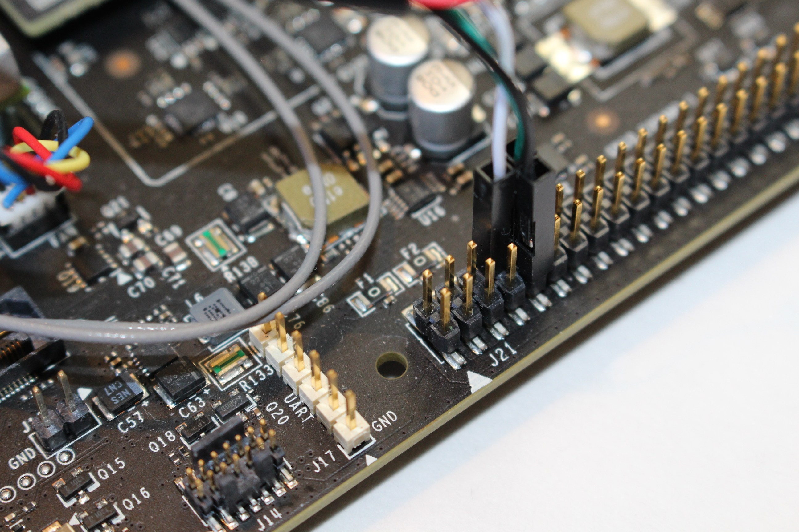

#### 连接参数

jetsonTX2 使用以下串口参数：

- 波特率：115200
- 数据位：8
- 停止位：1
- 奇偶校验：无
- 流控：无

#### 主机端Ubuntu上使用串口调试

安装 minicom 串口调试助手

```
sudo apt-get install minicom
```

查看串口设备

```
lsusb  # 查看usb设备
ls /dev/ttyUSB*
# 示例是 /dev/ttyUSB0
```

运行配置minicom

```
sudo minicom    # 启动minicom
# sudo minicom -s    # 或者直接进入minicom设置界面
```

> Welcome to minicom 2.7                                       
> OPTIONS: I18n       
> Compiled on Jan  1 2014, 17:13:19.     
> Port /dev/ttyUSB0, 15:57:00                                 
> Press CTRL-A Z for help on special keys

按 Ctrl-a 松开然后再按 Z 就可以调出帮助菜单。

> ```
>    +-------------------------------------------------------------------+
>                           Minicom Command Summary                      |
>   |              Commands can be called by CTRL-A <key>                |
>   |               Main Functions                  Other Functions      |
>   |                                                                    |
>   | Dialing directory..D  run script (Go)....G | Clear Screen.......C  |
>   | Send files.........S  Receive files......R | cOnfigure Minicom..O  |
>   | comm Parameters....P  Add linefeed.......A | Suspend minicom....J  |
>   | Capture on/off.....L  Hangup.............H | eXit and reset.....X  |
>   | send break.........F  initialize Modem...M | Quit with no reset.Q  |
>   | Terminal settings..T  run Kermit.........K | Cursor key mode....I  |
>   | lineWrap on/off....W  local Echo on/off..E | Help screen........Z  |
>   | Paste file.........Y  Timestamp toggle...N | scroll Back........B  |
>   | Add Carriage Ret...U                                               |
>   |                                                                    |
>   |             Select function or press Enter for none.               |
>   +--------------------------------------------------------------------+
> ```

根据提示按O进入设置界面，如下：

> ```
>  		   +-----[configuration]------+  
>            | Filenames and paths      |   
>            | File transfer protocols  |   
>            | Serial port setup        |  
>            | Modem and dialing        |  
>            | Screen and keyboard      | 
>            | Save setup as dfl        | 
>            | Save setup as..          |                 
>            | Exit                     |                 
>            +--------------------------+
> ```

把光标移动到“Serial port setup”，按enter进入串口设置界面，再输入前面提示的字母，选择对应的选项，设置成如下：

> ```
>  +-----------------------------------------------------------------------+   
>    | A -    Serial Device      : /dev/ttyUSB0                              | 
>    | B - Lockfile Location     : /var/lock                                 | 
>    | C -   Callin Program      :                                           | 
>    | D -  Callout Program      :                                           | 
>    | E -    Bps/Par/Bits       : 115200 8N1                                | 
>    | F - Hardware Flow Control : No                                        | 
>    | G - Software Flow Control : No                                        | 
>    |    Change which setting?                                              | 
>    +-----------------------------------------------------------------------+
> ```

- 注意：Hardware Flow Control和Software Flow Control都要设成No，否则可能导致无法输入。

设置完成后回到上一菜单，选择“Save setup as dfl”即可保存为默认配置，以后将默认使用该配置。

报错解决: minicom: cannot open /dev/modem: No such file or directory

```
sudo ln -s /dev/ttyS0 /dev/modem    # 做一个软链接到/dev/ttyS0
# minicom -s  # 或者设置一下
```

然后，您可以启动Jetson，此时您将看到内核日志开始在主机上的Minicom窗口上滚动

#### jetsonTX2端

在Jetson TX2上共有5路UART接口，通过使用命令可以查看在设备上已经启用的串口，

TX2的底板上默认启用的有三个串口，分别是位于J21的ttyTHS1控制台串口(serial console)启动时会通过它打印一系列消息，位于J17的ttyTHS2串口，以及蓝牙模块的ttyTHS3串口，ttyTHS1和ttyTHS2有外接扩展口，由于ttyTHS1为控制台串口会打印一系列调试信息，因此串口通讯测试选择位于J17的ttyTHS2串口

```
ls -l  /dev/ttyTHS*  # 查看设备上已经启用的串口
```

> ttyTHS1  —- 控制台串口(serial console)  —-  J21接口
>
> ttyTHS2  —-             空闲                          —-  J17接口
>
> ttyTHS3  —-               蓝牙模块                 —-  蓝牙（无外接口）

### Linux下使用USB转串口设备

默认情况下ubuntu已经安装了USB转串口驱动(pl2303或者cp210x的)

查看USB转串口驱动

```
lsmod | grep usbserial
```

> usbserial              45056  1 pl2303

插上USB转串口

```
ls /dev/ttyUSB*
dmesg | grep ttyUSB0
```

如果出现连接成功信息，则说明ubuntu系统已经识别该设备了。

### I2C

#### I2C Tools 工具

```
sudo apt-get install libi2c-dev i2c-tools
```

#### I2C总线扫描

```
i2cdetect -l
```

> i2c-0  代表 I2C0
> i2c-0  代表 I2C0

#### I2C设备查询

```
sudo i2cdetect -y -r 1
```

若总线上挂载I2C从设备，可通过i2cdetect扫描某个I2C总线上的所有设备

#### 寄存器内容写入

```
i2cset -y 1 0x50 0x00 0x13
```

> -y        代表曲线用户交互过程，直接执行指令
> 1         代表I2C总线编号
> 0x50    代表I2C设备地址，此处选择AT24C04的低256字节内容
> 0x00    代表存储器地址
> 0x13    代表存储器地址中的具体内容

#### 寄存器内容读出

```
i2cget -y 1 0x50 0x00
```

> -y        代表曲线用户交互过程，直接执行指令
> 1         代表I2C总线编号
> 0x50    代表I2C设备地址，此处选择AT24C04的低256字节内容
> 0x00    代表存储器地址

#### 寄存器所有内容导出

```
 i2cdump -y 1 0x51
```

> -y        代表取消用户交互过程，直接执行指令；
> 1         代表I2C总线编号；
> 0x51    代表I2C设备从机地址，此处选择AT24C04的高256字节内容。


[](https://blog.csdn.net/xukai871105/article/details/19841191)


### CAN通信

[Jetson TX2——CAN口的使用](https://blog.csdn.net/xuezhunzhen9743/article/details/81877757)

[](https://en.wikipedia.org/wiki/SocketCAN)

[](https://www.kernel.org/doc/Documentation/networking/can.txt)

socketcan包是CAN协议的实现（控制器区域网络）适用于Linux。CAN是一种网络技术它广泛用于自动化，嵌入式设备和汽车领域。

#### TX2硬件连接

TX2的J26模块下的CAN0及CAN1控制器接口通过canbus收发器的CTX和CRX相接进行实测。

TX2的J26模块下的CAN0的CAN0_RX，CAN0_TX分别接CAN收发器的RX，TX

> ```
>     CAN口  ->  Signal     J26接口    CAN收发器
> ----------->----------------------------------
>     CAN0  ->  CAN0_RX  ->  Pin5   ->  RX
>     CAN0  ->  CAN0_TX  ->  Pin7   ->  TX
>           ->  VDD_3V3  ->  Pin2   ->  VCC
>           ->  GND      ->  Pin10  ->  GND
>     CAN1  ->  CAN1_RX  ->  Pin15  ->  RX
>     CAN1  ->  CAN1_TX  ->  Pin17  ->  TX
> ```

| CAN0    | J26接口 | CAN1    | J26接口 |
| ------- | ------- | ------- | ------- |
| CAN0_RX | Pin5    | CAN1_RX | Pin15   |
| CAN0_TX | Pin7    | CAN1_TX | Pin17   |


不需要重新编译内核

1. TX2已经写好了canbus的驱动并集成到了SDK中，已经支持canbus无需多做处理。 
2. 安装canbus模块（Linux将不常用的模块做成.ko文件，在需要使用时可以将其进行载入内核，降低系统的开销）

直接通过运行Shell脚本can.sh加载所需的.ko文件，脚本文件如下所示。需要管理员权限

```
#！/bin/bash
sudo modprobe can        # 插入can总线子系统(Insert CAN BUS subsystem support module) 
sudo modprobe can_dev    # 插入can_dev模块(can driver with netlink support)
sudo modprobe can-raw    # 插入can原始协议模块(Insert Raw CAN protocol module)
#sudo modprobe can-bcm    # the broadcast manager (BCM)
#sudo modprobe can-gw     # ？？filtering options？？
sudo modprobe mttcan     # 真正的can口支持(Real CAN interface support)
```

虚拟can设备？？用于测试

> $ modprobe can
> $ modprobe can_raw
> $ modprobe vcan    # 加载虚拟can设备
> $ sudo ip link add dev vcan0 type vcan    # 添加
> $ sudo ip link set up vcan0    # 启用
> $ ip link show vcan0
> $ ip link del vcan0    # 删除

1. 通过lsmod 命令检查是否安装成功

```
lsmod  # 检查canbus模块是否安装成功
```

通过lsmod 命令检查是否安装成功，如果成功则如下所示。

> Module                  Size  Used by
> can_gw                 10919  0
> can_bcm                16471  0
> mttcan                 64903  0
> can_dev                13306  1 mttcan
> can_raw                10388  0
> can                    46600  3 can_raw,can_bcm,can_gw

4. 安装第三方开源工具 can-utils 测试canbus

```
sudo apt-get install can-utils
```

can-utils工具常用命令？？有问题

使用canconfig、canecho、cansend、candump、cansequence五个工具，检测和监控Socket CAN接口

 配置CAN的总线通讯波特率：         

```
canconfig can0 bitrate 500000  # 配置can0波特率500k
```

开启 / 重启 / 关闭CAN总线         

```
canconfig canX start  # 开启
canconfig canX stop
canconfig canX restart         
```

查看CAN总线状态

```
canecho can0  # 查看can0状态
```

发送信息         

```
cansend canX –-identifier=ID + 数据
cansend canX –-identifier=0x123 1A2B3C4D5E6F7788  # 发送数据，<can_id>=0x123,<data>=1A2B3C4D5E6F7788
```

 接收数据         

```
candump can0  # 接收数据
```

使用滤波器接收ID匹配的数据         

```
candump canX –-filter=ID:mask
candump canX –-filter=0x123:0x7ff  # ？？
```


1. 配置canbus属性

> ```
> #常用ip配置命令
> ip link set can0 type can help  # 获取帮助信息
> ip link set can0 type can bitrate 500000  #设置can0波特率500k
> sudo ip link set can0 up    # 挂载can0
> #ifconfig can0 up    # 挂载can0
> #ip link set canX type can restart-ms 100  #  启用自动总线关闭恢复？？
> ip link set canX type can restart  #  直接重启can
> ip -details link show can0  # 查看can总线状态 
> ip -details -statistics link show can0  # 查看can口工作状态
> ip link set can0 down    # 关闭can0口
> #ifconfig can0 down    # 关闭can0
> ```

> Usage: ip link set DEVICE type can
>
> ​	[ bitrate BITRATE [ sample-point SAMPLE-POINT] ] |
> ​	[ tq TQ prop-seg PROP_SEG phase-seg1 PHASE-SEG1
>  ​	  phase-seg2 PHASE-SEG2 [ sjw SJW ] ]
>
> ​	[ dbitrate BITRATE [ dsample-point SAMPLE-POINT] ] |
> ​	[ dtq TQ dprop-seg PROP_SEG dphase-seg1 PHASE-SEG1
>  ​	  dphase-seg2 PHASE-SEG2 [ dsjw SJW ] ]
>
> ​	[ loopback { on | off } ]    # 回环
> ​	[ listen-only { on | off } ]
> ​	[ triple-sampling { on | off } ]
> ​	[ one-shot { on | off } ]
> ​	[ berr-reporting { on | off } ]
> ​	[ fd { on | off } ]
> ​	[ fd-non-iso { on | off } ]
> ​	[ presume-ack { on | off } ]
> ​	[ restart-ms TIME-MS ]
> ​	[ restart ]
> ​	[ termination { 0..65535 } ]
>
> ​	Where: BITRATE	:= { 1..1000000 }
> ​		  SAMPLE-POINT	:= { 0.000..0.999 }
> ​		  TQ		:= { NUMBER }
> ​		  PROP-SEG	:= { 1..8 }
> ​		  PHASE-SEG1	:= { 1..8 }
> ​		  PHASE-SEG2	:= { 1..8 }
> ​		  SJW		:= { 1..4 }
> ​		  RESTART-MS	:= { 0 | NUMBER }

#### 环回模式（自测）


```
sudo ip link set can0 type can bitrate 500000 loopback on  # 设置can0波特率500k，回环模式
sudo ip link set can0 up    # 挂载can0
#sudo ifconfig can0 up          # 挂载can0
sudo ip link set can1 type can bitrate 500000 loopback on  # 设置can1
sudo ip link set can1 up   # 挂载can1
ifconfig      # 检查can是否挂载成功
ip -details -statistics link show can0  # 检查can口状态
ip -details link show can1
```

收发数据测试can是否启用

````
# 终端1
# cansend can口号 优先级（3位或8位16进制数）#数据位（16位）    # 发送CAN数据
cansend can0 5A1#1122334455667788    # <can_id>为3位十六进制数
cansend can1 123#1A2B3C4D5E6F7788    # 最多16个数据位，十六进制数据
# 终端2
# candump can口号    # 接收CAN数据，处于阻塞状态
candump can0    # 等待接收CAN数据
candump can1
sudo ip link set can0 down    # 关闭can0口 
#sudo ifconfig can0 down    # 关闭can0
sudo ip link set can1 down    # 关闭can1口
````

#### 使用can收发器实测

实测下配置canbus属性

```
# 实测下canbus属性配置
sudo ip link set can0 type can bitrate 500000  #设置can0波特率500k
sudo ip link set can0 up    # 挂载can0
#sudo ifconfig can0 up    # 挂载can0
```

CAN_Mode_Silent:静默模式，简单理解收到数据不发送应答信号。??

> ip link set can0 type can bitrate 500000 dbitrate 2000000 berr-reporting on fd on

检查can是否挂载成功

```
ifconfig      # 检查can是否挂载成功
```

查看can口状态

```
ip -details -statistics link show can0  # 检查can口状态
ip -details link show can1
```

> Usage: ip [ OPTIONS ] OBJECT { COMMAND | help }
>        ip [ -force ] -batch filename
> where  OBJECT := { link | address | addrlabel | route | rule | neigh | ntable |
>                    tunnel | tuntap | maddress | mroute | mrule | monitor | xfrm |
>                    netns | l2tp | fou | macsec | tcp_metrics | token | netconf | ila |
>                    vrf | sr }
>        OPTIONS := { -V[ersion] | -s[tatistics] | -d[etails] | -r[esolve] |
>                     -h[uman-readable] | -iec |
>                     -f[amily] { inet | inet6 | ipx | dnet | mpls | bridge | link } |
>                     -4 | -6 | -I | -D | -B | -0 |
>                     -l[oops] { maximum-addr-flush-attempts } | -br[ief] |
>                     -o[neline] | -t[imestamp] | -ts[hort] | -b[atch][filename] |
>                     -rc[vbuf][size] | -n[etns] name | -a[ll] | -c[olor]}


在一个终端通过cansend can0(can1) ×××命令来发送数据×××, 另一个终端通过candump can0(can1)进行回环发送

发送数据

broadcasting a can data packet: cansend

```
# 终端1
# cansend can口号 优先级（3位或8位16进制数）#数据位（16位）    # 发送CAN数据
cansend can0 5A1#1122334455667788    # <can_id>为3位十六进制数
cansend can0 5A1#11.2233.44556677.88     # . 可作为分隔符
cansend can0 123#1A2B3C4D5E6F7788    # 最多16个数据位，十六进制数据
cansend can0 123#123456ABCDEF    # 数据位也为十六进制数据
cansend can1 5A1#1122334455667788
```

<can_id> ：3位或8位16进制数，3位标准数据帧，8位扩展帧
{data}： 0..8字节，最多16位数据，16进制数， (可以使用`.`作为分隔符)

```
#标准数据帧
cansend can0 5A1#1122334455667788  # <can_id>为0x5A1，data数据内容为0x1122334455667788
#扩展帧
cansend can0 12345678#aabbccdd  # <can_id>为0x12345678，<data>内容为0xaabbccdd
#远程帧
cansend can0 123#R7  # <can_id>为0x123，长度为7
```

> Usage: cansend - simple command line tool to send CAN-frames via CAN_RAW sockets.
>
> Usage: cansend <device> <can_frame>
>
> <can_frame>:
>  <can_id>#{R|data}          for CAN 2.0 frames
>  <can_id>##<flags>{data}    for CAN FD frames
>
> <can_id>:
>  can have 3 (SFF) or 8 (EFF) hex chars
> {data}:
>  has 0..8 (0..64 CAN FD) ASCII hex-values (optionally separated by '.')
> <flags>:
>  a single ASCII Hex value (0 .. F) which defines canfd_frame.flags
>
> Examples:
>   5A1#11.2233.44556677.88 / 123#DEADBEEF / 5AA# / 123##1 / 213##311
>   1F334455#1122334455667788 / 123#R for remote transmission request.

接收数据

Receiving a can data packet: candump

```
# 终端2
# candump can口号    # 接收CAN数据，处于阻塞状态
candump can0    # 等待接收CAN数据
candump can1
```

进程为阻塞型，can设备将一直会接收发来的can消息，直到用户终止。

> 接收的数据
> can0       5A1   [8]  11 22 33 44 55 66 77 88
> can0       5A1   [8]  11 22 33 44 55 66 77 88

关闭can口 

```
sudo ip link set can0 down    # 关闭can0口 
#sudo ifconfig can0 down    # 关闭can0
sudo ip link set can1 down    # 关闭can1口 
```


#### 使用应用程序进行测试


### 中断

```
kill -l    # 查看所有中断
```

> chao@deepin:~$ kill -l
>  1) SIGHUP			2) SIGINT	          3) SIGQUIT	            4) SIGILL				    5) SIGTRAP
>  6) SIGABRT		  7) SIGBUS	         8) SIGFPE	             9) SIGKILL	             10) SIGUSR1
> 11) SIGSEGV		 12) SIGUSR2	     13) SIGPIPE	          14) SIGALRM	        15) SIGTERM
> 16) SIGSTKFLT	  17) SIGCHLD 	    18) SIGCONT	        19) SIGSTOP	        20) SIGTSTP
> 21) SIGTTIN		   22) SIGTTOU     	23) SIGURG	          24) SIGXCPU	        25) SIGXFSZ
> 26) SIGVTALRM	 27) SIGPROF	      28) SIGWINCH	     29) SIGIO	              30) SIGPWR
> 31) SIGSYS		    34) SIGRTMIN	     35) SIGRTMIN+1	  36) SIGRTMIN+2  	37) SIGRTMIN+3
> 38) SIGRTMIN+4	39) SIGRTMIN+5 	40) SIGRTMIN+6	  41) SIGRTMIN+7	  42) SIGRTMIN+8
> 43) SIGRTMIN+9	44) SIGRTMIN+10	45) SIGRTMIN+11	46) SIGRTMIN+12	47) SIGRTMIN+13
> 48) SIGRTMIN+14   49) SIGRTMIN+15	50) SIGRTMAX-14   51) SIGRTMAX-13	52) SIGRTMAX-12
> 53) SIGRTMAX-11   54) SIGRTMAX-10	55) SIGRTMAX-9	 56) SIGRTMAX-8  	57) SIGRTMAX-7
> 58) SIGRTMAX-6	 59) SIGRTMAX-5  	60) SIGRTMAX-4	 61) SIGRTMAX-3	  62) SIGRTMAX-2
> 63) SIGRTMAX-1     64) SIGRTMAX	


 [linux中sleep函数的使用和总结](https://www.cnblogs.com/wuyepeng/p/9789466.html)

在linux编程中，有时候会用到定时功能，常见的是用sleep(time)函数来睡眠time秒；但是这个函数是可以被中断的，也就是说当进程在睡眠的过程中，如果被中断，那么当中断结束回来再执行该进程的时候，该进程会从sleep函数的下一条语句执行；这样的话就不会睡眠time秒了；

> ```
> #include<stdio.h>
> #include <stdlib.h>
> #include <signal.h>
> #include <unistd.h>
> void sig_handler(int num){
>     printf("\nrecvive the signal is %d\n", num);
> }
> int main(){
>     int time = 20;
>     signal(SIGINT, sig_handler);
>     printf("enter to the sleep.\n");
>     sleep(time);   // 睡眠过程中被中断，当中断结束回来再执行的时候，从sleep函数的下一条语句执行
>     printf("sleep is over, main over.\n");
>     exit(0);
> }
> ```

> enter to the sleep.
> ^C
> recvive the signal is 2
> sleep is over, main over.

从运行结果可以看出，当我按下Ctrl+c发出中断的时候，被该函数捕获，当处理完该信号之后，函数直接执行sleep下面的语句；

下面的例子是真正的睡眠time时间(不被中断影响)：

> ```
> #include<stdio.h>
> #include <stdlib.h>
> #include <signal.h>
> #include <unistd.h>
> void sig_handler(int num){
>     printf("\nrecvive the signal is %d\n", num);
> }
> int main(){
>     int time = 20;
>     signal(SIGINT, sig_handler);
>     printf("enter to the sleep.\n");
>     //sleep(time);
>     do{
>         time = sleep(time);
>     }while(time > 0);
>     printf("sleep is over, main over.\n");
>     exit(0);
> }
> ```

> enter to the sleep.
> ^C
> recvive the signal is 2
> ^C
> recvive the signal is 2
> ^C
> recvive the signal is 2
> sleep is over, main over.

备注：sleep(time)返回值是睡眠剩下的时间；

备注：可以使用sleep来实现定时发送机制，例如server和client通信，定时发送数据或者定时接受数据（设置避免打扰时间内不接收数据），当然定时接受数据可能会造成数据丢失（超过缓存）

### LINUX信号机制


### 图为007载板

#### 主要资源

- 1 个千兆以太网（10/100/1000 BASE-T）
- 1 个 HDMI 2.0 接口(最大 6Gbps，24bpp，4096x2160@60Hz)
- 2 个 USB3.0 端口（5Gbps，1A 最大供电电流）
- 1 个 USB2.0（w/OTG）
- 1 个 SD 卡接口
- 4 路 3.3V 位可编程 GPIO
- 2 个 3.3V UART
- 2 路 I2C 接口
- 2 个 CAN
- 1 个风扇控制接口
- 电源要求：+7V~+19V
- 工作温度： -40~+85℃
- 板卡尺寸：87mm×50mm
- 重量：50g


#### 外设接口

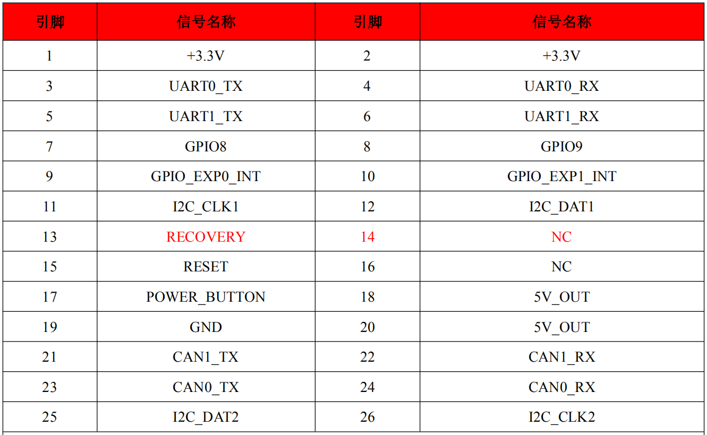


注：
UART0 = /dev/ttyS0 within Linux for Tegra(调试口)
UART0 经过载板电平转换电路转换为 3.3V 逻辑电平
UART1 = /dev/ttyTHS2 within Linux for Tegra
UART1 经过载板电平转换电路转换为 3.3V 逻辑电平
GPIO8 = sysfs GPIO # 187（TX2==#388）
GPIO9 = sysfs GPIO # 186（TX2==#298）
GPIO_EXP0_INT = sysfs GPIO # 89(TX2==#480)
GPIO_EXP1_INT = sysfs GPIO # 202(TX2==#486)
I2C 总线对应于 Linux 内的 Tegra 总线 1

#### 按钮

007 提供 4 个按钮分别为：
1) S1----（POWER）电源开关;
2) S2----（RESET）复位开关;
3) S3---- (RECOVERY)程序下载
4) S4----(VOL-)系统音量减
S1 电源按钮，当载板处于 ATX 模式时，按下按钮系统启动，当系统启动后，按下按钮，系统进入待机模式，
当系统启动后，按下按钮，保持 5s，系统硬关机；S2 重启按钮，按下按钮系统重启；S3 Recovery 按钮按下按
钮进入 recovery 模式通过 USB OTG 端口烧写系统镜像到 TX1/TX2 模块


## RealSense 相机

### RealSense D435 参数

| Features         | **Use Environment:** Indoor/Outdoor<br />**Image Sensor Technology:** Global Shutter, 3μm x 3μm pixel size | **Maximum Range:** Approx. 10 meters. Accuracy varies depending on calibration, scene, and lighting condition. |
| ---------------- | ------------------------------------------------------------ | ------------------------------------------------------------ |
| Depth            | **Depth Technology:** Active IR Stereo   <br />**Depth Field of View (FOV):** 87°±3° x 58°±1° x 95°±3° | **Minimum Depth Distance (Min-Z):** 0.105 m   <br />**Depth Output Resolution & Frame Rate:** Up to 1280 x 720 active stereo depth resolution. Up to 90 fps. |
| RGB              | **RGB Sensor Resolution & Frame Rate:** 1920 x 1080   <br />**RGB Frame Rate:** 30 fps | **RGB Sensor FOV (H x V x D):** 69.4° x 42.5° x 77° (+/- 3°) |
| Major Components | **Camera Module:** Intel RealSense Module D430 + RGB Camera  | **Vision Processor Board:** Intel RealSense Vision Processor D4 |
| Physical         | **Form Factor:** Camera Peripheral<br />**Length x Depth x Height:** 99 mm x 25 mm x 25 mm | **Connectors:** USB‑C* 3.1 Gen 1*   <br />**Mounting Mechanism:** One 1/4‑20 UNC thread mounting point. Two M3 thread mounting points. |

### RealSense SDK 安装

#### [官方NVIDIA Jetson TX2 installation](https://dev.intelrealsense.com/docs/nvidia-jetson-tx2-installation)

Check out [www.jetsonhacks.com](https://www.jetsonhacks.com/) for more great content regarding RealSense on the Jetson

To install `librealsense` on the Jetson TX2 Developer Kit, follow the [regular instructions](https://dev.intelrealsense.com/docs/compiling-librealsense-for-linux-ubuntu-guide) for Ubuntu 16.04.

A couple of things to note:

1. Make sure you are running the [latest L4T release](https://developer.nvidia.com/embedded/linux-tegra) as published by NVIDIA.
2. The `./scripts/patch-realsense-ubuntu-xenial.sh` script will NOT work as is. The following are the minimal changes necessary to make the script run:
   - Change [line #26](https://github.com/IntelRealSense/librealsense/blob/master/scripts/patch-realsense-ubuntu-xenial.sh#L26) to `kernel_name="kernel-4.4"`
   - Replace [line #29](https://github.com/IntelRealSense/librealsense/blob/master/scripts/patch-realsense-ubuntu-xenial.sh#L29) with:
     `[ ! -d ${kernel_name} ] && git clone https://github.com/jetsonhacks/buildJetsonTX2Kernel.git && cd buildJetsonTX2Kernel && ./getKernelSources.sh && ./scripts/fixMakeFiles.sh && cd .. && cp /usr/src/kernel/${kernel_name} ./${kernel_name}`
   - Comment out [lines #33-53](https://github.com/IntelRealSense/librealsense/blob/master/scripts/patch-realsense-ubuntu-xenial.sh#L33-L53). This is necessary because the original script grabs the kernel sources from a git repository, which NVIDIA does not provide for L4T, and this segment was written with that assumption in mind.
3. QtCreator won't work out of the box on the Jetson. JetsonHacks has posted a [helpful tutorial](https://www.jetsonhacks.com/2017/01/31/install-qt-creator-nvidia-jetson-tx1/) explaining how to properly configure it.

#### [Ubuntu apt安装](https://github.com/IntelRealSense/librealsense/blob/master/doc/distribution_linux.md)

- 安装依赖

  ```
  sudo apt-get update && sudo apt-get upgrade && sudo apt-get dist-upgrade
  sudo apt-get install git libssl-dev libusb-1.0-0-dev pkg-config libgtk-3-dev
  sudo apt-get install libglfw3-dev
  ```

- Register the server's public key:

  ````
  sudo apt-key adv --keyserver keys.gnupg.net --recv-key C8B3A55A6F3EFCDE || sudo apt-key adv --keyserver hkp://keyserver.ubuntu.com:80 --recv-key C8B3A55A6F3EFCDE
  ````

  
  In case the public key still cannot be retrieved, check and specify proxy settings: `export http_proxy="http://<proxy>:<port>"`
  , and rerun the command. See additional methods in the following [link](https://unix.stackexchange.com/questions/361213/unable-to-add-gpg-key-with-apt-key-behind-a-proxy).

- Add the server to the list of repositories:
  Ubuntu 16 LTS:(deepin不报错)

  ````
  sudo add-apt-repository "deb http://realsense-hw-public.s3.amazonaws.com/Debian/apt-repo xenial main" -u
  ````

  Ubuntu 18 LTS:(deepin报错)

  ```
  sudo add-apt-repository "deb http://realsense-hw-public.s3.amazonaws.com/Debian/apt-repo bionic main" -u
  ```

- Install the libraries (see section below if upgrading packages):

  ````
  sudo apt-get install librealsense2-dkms
  sudo apt-get install librealsense2-utils
  ````

  The above two lines will deploy librealsense2 udev rules, build and activate kernel modules, runtime library and executable demos and tools.

- Optionally install the developer and debug packages:

  ```
  sudo apt-get install librealsense2-dev
  sudo apt-get install librealsense2-dbg
  ```

  With `dev` package installed, you can compile an application with **librealsense** using `g++ -std=c++11 filename.cpp -lrealsense2` or an IDE of your choice.

Reconnect the Intel RealSense depth camera and run: `realsense-viewer` to verify the installation.

Verify that the kernel is updated :
`modinfo uvcvideo | grep "version:"` should include `realsense` string

#### [Ubuntu 源码安装](https://github.com/IntelRealSense/librealsense/blob/master/doc/installation.md)

**断开相机连接**

**安装依赖**

```
sudo apt-get update && sudo apt-get upgrade && sudo apt-get dist-upgrade
sudo apt-get install git libssl-dev libusb-1.0-0-dev pkg-config libgtk-3-dev
```

Distribution-specific packages: 

Ubuntu 16:

````
sudo apt-get install libglfw3-dev
````

Ubuntu 18:

```
sudo apt-get install libglfw3-dev libgl1-mesa-dev libglu1-mesa-dev 
```

**下载源码**

Download and unzip the latest stable version from master branch:

**Run Intel Realsense permissions script located from librealsense root directory:**

```
cd librealsense-master
./scripts/setup_udev_rules.sh
```

**Build and apply patched kernel modules for:**

**Ubuntu 14/16/18 with LTS kernel** script will download, patch and build realsense-affected kernel modules (drivers).
Then it will attempt to insert the patched module instead of the active one. If failed the original uvc modules will be restored.

```
./scripts/patch-realsense-ubuntu-lts.sh
```

**Building librealsense2 SDK**

```
mkdir build && cd build
cmake ../ -DBUILD_EXAMPLES=true  # Builds librealsense 同时编译 demos and tutorials
```

**Recompile and install *librealsense* binaries:**

```
sudo make uninstall && make clean && make && sudo make install
```

**TIPS**：The shared object will be installed in `/usr/local/lib`, header files in `/usr/local/include`. The binary demos, tutorials and test files will be copied into `/usr/local/bin` 

**Tip:** Use *make -jX* for parallel compilation, where *X* stands for the number of CPU cores available: `sudo make uninstall && make clean && make **-j8** && sudo make install` This enhancement may significantly improve the build time. The side-effect, however, is that it may cause a low-end platform to hang randomly. **Note:** Linux build configuration is presently configured to use the V4L2 backend by default. **Note:** If you encounter the following error during compilation `gcc: internal compiler error` it might indicate that you do not have enough memory or swap space on your machine. Try closing memory consuming applications, and if you are running inside a VM increase available RAM to at least 2 GB. **Note:** You can find more information about the available configuration options on [this wiki page](https://github.com/IntelRealSense/librealsense/wiki/Build-Configuration).

#### 运行例程检验

插入相机

```
lsusb    # 查看usb设备
# Bus 002 Device 014: ID 8086:0b07 Intel Corp. 
```

```
cd librealsense/build/examples
rs-capture
```

看到彩图和深度图即安装成功。

#### 启动SDK

```
realsense-viewer
```

仍然回传不了图像？firmware版本的问题

### 更新固件

[realsense升级固件Firmware](https://blog.csdn.net/qq_42393859/article/details/86133988)

Add Intel server to list of repositories:

```
echo 'deb http://realsense-hw-public.s3.amazonaws.com/Debian/apt-repo xenial main' | sudo tee /etc/apt/sources.list.d/realsense-public.list
```

Register the servers public key:

```
sudo apt-key adv --keyserverkeys.gnupg.net --recv-key 6F3EFCDE
```

Install the intel-realsense-dfupackage

```
sudo apt-get update
sudo apt-get install intel-realsense-dfu*
```

Download latest D400 series firmware .bin file (Signed Binary)仅需二进制文件

下载最新固件[firmware下载地址](https://downloadcenter.intel.com/download/28870/Latest-Firmware-for-Intel-RealSense-D400-Product-Family?v=t)

Plug in D400 Series camera to host USB3.1 port. 

Check serial # and bus#

```
lsusb    # 查看usb设备
lsusb | grep 8086  # 使用8086端口
# Bus 002 Device 014: ID 8086:0b07 Intel Corp. 
```

Notice “Intel Corp.” bus and device numbers; DFU tool uses these values to identify Intel® RealSense™ D400 series camera. 此处Bus 002 ，Device 014

Upgrade D400 Series Camera Firmware with Linux DFU Tool

```
intel-realsense-dfu -b 002 -d 014 -f -i /home/chao/Downloads/v5_10_13/Signed_Image_UVC_5_11_6_250.bin
```

-b -d后接的分别是上面查询对应的Bus和Device号，注意修改对应的-b 和 -d 后面的数字，以及bin的版本号

Tool will begin upgrade process, and notify whenupgrade is complete. 

Firmware Check

```
intel-realsense-dfu -p 
```


[Intel Realsense D435/D415 基于 Ubuntu 16.04 安装教程](https://blog.csdn.net/qq_33419535/article/details/88547498)

[Ubuntu 16.04 安装RealSense D435教程](https://blog.csdn.net/weixin_44024460/article/details/89320469)


## ZED 相机


