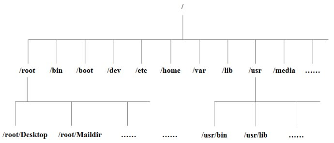
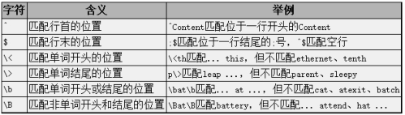
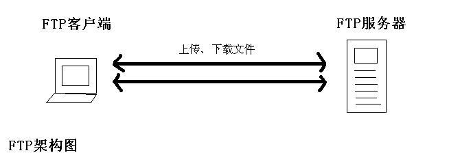

# Linux基本命令

---

[TOC]

<!-- toc -->

---

### Linu简介

Linux 是一种自由和开放源码的类UNIX操作系统。该操作系统的内核由芬兰人林纳斯·托瓦兹（Linus Torvalds）在1991年10月5日首次发布，在加上用户空间的应用程序之后，成为Linux操作系统。

Linux 是一套免费使用和自由传播的类 Unix 操作系统，是一个基于 POSIX 和 UNIX 的多用户、多任务、支持多线程和多 CPU 的操作系统。

Linux 能运行主要的 UNIX 工具软件、应用程序和网络协议。它支持 32 位和 64 位硬件。Linux 继承了 Unix 以网络为核心的设计思想，是一个性能稳定的多用户网络操作系统。

Linux有上百种不同的发行版，如基于社区开发的debian、archlinux，和基于商业开发的Red Hat Enterprise Linux、SUSE、oracle linux等。


### Linux系统的文件

#### 系统目录结构



- `/`：根目录，一般根目录下只存放目录，在 linux 下有且只有一个根目录，所有的东西都是从这里开始
- `/bin` ：binary二进制执行文件目录,存放着最经常使用的命令，如 ls、mv、cat 等
- `/sbin` ：全称super binary，系统管理员专用的二进制代码存放目录，系统管理员使用的系统管理程序
- `/home`：用户的家目录（除了root用户以外），在Linux中，每个用户都有一个自己的目录，，一般该目录名是以用户的账号命名的
- `/usr`：用户数据目录，用户的很多自己安装的软件应用程序和文件都放在这个目录下。类似于windows下的program files
>`/usr/bin`：系统用户使用的应用程序
>`/usr/sbin` ：超级用户使用的比较高级的管理程序和系统守护程序
>`/usr/share`：存放共享数据？？
>`/usr/lib`：存放不能直接运行的，却是许多程序运行所必需的一些函数库文件
>`/usr/local`：存放软件升级包？？
>`/usr/share/doc`：系统说明文件存放目录
>`/usr/share/man`：程序说明文件存放目录
>`/usr/src`：内核源代码默认的放置目录
- `/opt`: (Optional Software Packages)可选程序包，额外第三方软件安装的目录。比如你安装一个ORACLE数据库则就可以放到这个目录下

- `/dev`：Device(设备)的缩写, 该目录下存放的是Linux的外部设备，在Linux中访问设备的方式和访问文件的方式是相同的，访问该目录下某个文件，相当于访问某个设备。

- `/media`: media，媒介设备， linux系统会**自动**识别一些媒介设备，例如U盘、光驱等等，当识别后，linux会把识别的设备挂载到这个目录下

- `/mnt`：mount，临时文件系统挂载点。系统提供该目录是为了让用户**临时**挂载别的文件系统的，当外接设备需要临时挂载的时候，就需要挂载到mnt目录下，如我们可以将光驱挂载在/mnt/上，然后进入该目录就可以查看光驱里的内容了。

- `/boot`：放置 linux 系统启动时用到的一些核心文件，包括一些连接文件以及镜像文件，如 linux 的内核文件：**/boot/vmlinuz**，系统引导管理器：**/boot/grub**

- `/lost+fount`：系统异常产生错误时，会将一些遗失的片段放置于此目录下，这个目录一般情况下是空的，当系统非法关机后，这里就存放了一些文件

- `/sys`: sysfs文件系统，这个目录其实跟/proc非常类似，也是一个虚拟的档案系统，主要也是记录与核心相关的资讯，用于将系统中的设备组织成层次结构，并向用户模式程序提供详细的内核数据结构信息。其实，就是在用户态可以通过对sys文件系统的访问，来看内核态的一些驱动或者设备等。该文件系统是内核设备树的一个直观反映。当一个内核对象被创建的时候，对应的文件和目录也在内核对象子系统中被创建。sysfs文件系统集成了下面3种文件系统的信息：针对进程信息的proc文件系统、针对设备的devfs文件系统以及针对伪终端的devpts文件系统。

- `/root`：系统超级管理员root的家目录

- `/etc`：系统配置文件存放的目录，重要的配置文件有/etc/hosts, **/etc/resolv.conf**, nsswitch.conf,**/etc/inittab** `/etc/fstab` **/etc/init.d** `/etc/X11` **/etc/sysconfig** `/etc/xinetd.d`

- `/lib`、`/usr/lib`、`/usr/local/lib`：library，存放着系统最基本的动态连接共享库，其作用类似于Windows里的DLL文件。几乎所有的应用程序都需要用到这些共享库。

- `/proc`：process，表示进程，该目录中存储的是Linux运行时候的进程，这个目录是一个虚拟的目录，它是系统内存的映射，而不占用外存空间，这个目录的内容不在硬盘上而是在内存里，它以文件系统的方式为访问系统内核数据的操作提供接口。用户和应用程序可以通过proc得到系统的信息，并可以改变内核的某些参数，我们可以通过直接访问这个目录来获取系统信息，如系统内核的状态`cat /proc/cpuinfo`，外部设备，网络状态，正在运行的进程的状态等，我们也可以直接修改里面的某些文件，比如可以通过下面的命令来屏蔽主机的ping命令，使别人无法ping你的机器：`echo 1 > /proc/sys/net/ipv4/icmp_echo_ignore_all`

  > proc 文件系统可以被用于收集有用的关于系统和运行中的内核的信息。下面是一些重要的文件：
  >
  > * /proc/cpuinfo - CPU 的信息(型号, 家族, 缓存大小等)
  > * /proc/meminfo - 物理内存、交换空间等的信息
  > * /proc/mounts - 已加载的文件系统的列表
  > * /proc/devices - 可用设备的列表
  > * /proc/filesystems - 被支持的文件系统
  > * /proc/modules - 已加载的模块
  >
  > > - /proc/version - 内核版本
  > > - /proc/cmdline - 系统启动时输入的内核命令行参数
- `/tmp`：temporary，存放系统运行时候产生的临时文件。每次系统重启之后，这个目录下的”临时”文件便会被清空

- `run`：存储系统启动以来的信息。当系统重启时，这个目录下的文件应该被删掉

- `/var`：virable，系统执行过程中经常变化的文件，如随时更改的日志文件。存放的系统/程序日志文件的目录。这个目录中存放着在不断扩充着的东西，我们习惯将那些经常被修改的目录放在这个目录下。包括各种日志文件。

- `/srv`：service 服务，存放服务启动之后需要访问的数据目录，如 www 服务需要访问的网页数据存放在 /srv/www 内

**在linux系统中，有几个目录是比较重要的，平时需要注意不要误删除或者随意更改内部文件。**/etc： 上边也提到了，这个是系统中的配置文件，如果你更改了该目录下的某个文件可能会导致系统不能启动。/bin, /sbin, /usr/bin, /usr/sbin: 这是系统预设的执行文件的放置目录，比如 ls 就是在/bin/ls 目录下的。值得提出的是，/bin, /usr/bin 是给系统用户使用的指令（除root外的通用户），而/sbin, /usr/sbin 则是给root使用的指令。/var： 这是一个非常重要的目录，系统上跑了很多程序，那么每个程序都会有相应的日志产生，而这些日志就被记录到这个目录下，具体在/var/log 目录下，另外mail的预设放置也是在这里。

#### Linux一切皆文件

Linux 对数据文件(*.mp3、*.bmp)，程序文件(*.c、*.h、*.o)，设备文件（LCD、触摸屏、鼠标），网络文件( socket ) 等的管理都抽象为文件，使用统一的方式方法管理。

文件分类：
1. 普通文件( 数据文件 )
    普通文件是用于存放数据、程序等信息的文件，一般都长期地存放在外存储器（磁盘）中。普通文件又分为文本文件和二进制文件。
    
2. 目录文件
    目录文件是文件系统中一个目录所包含的目录项所组成的文件。
    
3. 可执行文件

4. 压缩文件

5. 链接文件
    似于 windows 下的快捷方式，链接又可以分为软链接（符号链接）和硬链接。

6. 设备文件
    设备文件是用于为操作系统与设备提供连接的一种文件。在Linux系统中将设备作为文件来处理，操作设备就像是操作普通文件一样。每一个设备对应一个设备文件，存放在 /dev 目录中。

     - 管道文件
         管道文件主要用于在进程间传递数据的一种特殊文件。
     - 套接口文件
         主要用于不同计算机间网络通信的一种特殊文件。

    

    

#### 文件路径

`相对路径`：表示相对一当前目录所在的目录位置,`./`当前目录下、`../`上一级目录下
`绝对路径`：从根目录`/`开始寻找目录位置,或从家目录`~`开始寻找目录位置

`./`代表当前目录
`../ `代表上一级目录

`/`根目录
`~`家目录

#### 文件特点

`ls -lah`命令显示字符所代表的意义：
`-`文件，`d`目录

`rwx`可读可写可执行权限,拥有者/组/其他人对应的权限

`数字`硬链接数，就是有多少种方式可以访问到该目录或文件

`chao`文件拥有者

`chao`所属组

` . `开头的文件为隐藏文件

#### 软链接

一个文件分为文件名和文件数据，建立软连接时相当于通过一个渠道直接访问文件数据，但文件数据删除后便找不到访问的目标，即无法访问了


用户信息储存在/etc/passwd文件下
`用户名: x :用户代号:组代号::用户家目录:登录Shell`
x的意思是用户拥有密码，用户家目录前面是空的，意思为用户的全名，如果没有设置则用用户名作为用户的全名
组代号信息储存在/etc/group文件下（推荐用：cat -n /etc/group | grep 组名 方式查询）


一个用户创建时的-g选项设置的是该用户的主组，如没设置则主动创建一个和该用户名相同的组作为该用户的主组
附加组通常用来指定用户的附加权限


### 基本指令

#### 终端快捷键

##### 打开关闭终端

| 打开关闭终端         |                     |
| -------------------- | ------------------- |
| Ctrl + Alt + **t**   | 打开终端            |
| Ctrl+**Shift**+**t** | 打开新的**标签页**  |
| Alt+数字             | 切换至对应的标签页  |
| Ctrl + Tab           | 切换标签页          |
| Ctrl+**d**           | **关闭**标签页/终端 |

##### 终端操作

| 终端操作 |                        |
| -------- | ---------------------- |
| Ctrl + = | 放大终端窗口的字体显示 |
| Ctrl + - | 缩小终端窗口的字体显示 |
| Ctrl+0   | 原始字体大小           |
| ==F11==          | **全屏**切换      |
| ==Shift+上 ↑/下 ↓== | 终端上下==滚动行== |
| Tab              | 自动补全     |
| ==Ctrl+s== | **阻断向终端输出**(终端不显示输出类似输密码时) |
| ==Ctrl+q== | **恢复向终端输出** |
| Ctrl+c           | 终止进程/命令     |
| Ctrl+l           | 清屏, 相当于`clear` |


##### 复制/粘贴

| 复制/粘贴    |      |
| ------------ | ---- |
| Shift+Ctrl+c | 复制 |
| Shift+Ctrl+v | 粘贴 |

##### 删除
| 删除          |                                        |
| ---------------- | -------------------------------------- |
| Ctrl + **h** | (Backspace)~~向前删除一位~~ |
| Ctrl + **d** | (Delet)~~向**后**删除一位~~     |
| ==**Ctrl + w**== | 删除**前**一个**==单词==**              |
| ~~Alt + d~~ | ~~向后删除**后**一个**单词**~~ |
| ==Ctrl + u==     | 删除到**行首**                         |
| ==Ctrl + k==     | 删除到**行尾**                         |


##### 光标移动

| 光标移动          |                                    |
| ---------------- | ----------------------------------- |
| **==Alt== + b** | **后跳**到上一个**==单词==**           |
| **==Alt== + f** | **前跳**到下一个**==单词==**           |
| Ctrl + **b**     | 向**后**移动光标                       |
| Ctrl + **f**     | 向**前**移动光标                       |
| Ctrl+==a==       | 光标移动到**行首**       |
| Ctrl+==e==       | 光标移动到**行尾**                   |

##### 历史命令
| 历史命令          |                                        |
| ---------------- | -------------------------------------- |
| Ctrl + **r**     | 滚动搜索历史命令(reverse-i-search)       |
| **history**      | 命令历史记录                           |
| !`num `          | 执行history命令历史列表的第`num`条命令 |
| !!               | 执行上一条命令                         |
| Ctrl+p           | 显示上一条命令                      |
| Ctrl+n           | 显示下一条命令                         |


##### 终端快捷键汇总

| 快捷键          |                                        |
| ---------------- | -------------------------------------- |
| Ctrl + Alt + t   | 打开终端                               |
| Ctrl+Shift+t     | 打开新的标签页                         |
| Ctrl+d           | **关闭**标签页/终端                    |
| Ctrl + =         | 放大终端窗口的字体显示                 |
| Ctrl + -         | 缩小终端窗口的字体显示                 |
| Ctrl+0           | 原始字体大小                           |
| Tab              | 自动补全                               |
| Shift+Ctrl+c    | 复制                             |
| Shift+Ctrl+v    | 粘贴                         |
| ==**Alt + b**==  | **后跳**到上一个**单词**               |
| ==**Alt + f**==  | **前跳**到下一个**单词**               |
| Ctrl+b           | 向**后**移动光标                       |
| Ctrl+f           | 向**前**移动光标                       |
| Ctrl+a           | 光标移动到行首                   |
| Ctrl+e           | 光标移动到行尾                       |
| ~~Ctrl + h~~     | ~~向前删除一位(Backspace)~~            |
| ~~Ctrl + d~~     | ~~向后删除一位(Delet)~~                |
| ~~Alt + d~~      | ~~向后删除一个**单词**~~               |
| ==**Ctrl + w**== | 删除一个**单词**                       |
| ==Ctrl + u==     | 删除到**行首**                         |
| ==Ctrl + k==     | 删除到**行尾**                         |
| Ctrl + **r**     | 搜索历史命令(reverse-i-search)         |
| **history**      | 命令历史记录                           |
| !`num `          | 执行history命令历史列表的第`num`条命令 |
| !!               | 执行上一条命令                         |
| Ctrl+p           | 显示上一条命令                         |
| Ctrl+n           | 显示下一条命令                         |
| Ctrl+c           | 终止进程/命令                          |
| Ctrl+l           | 清屏, 相当于clear                      |
| F11              | 全屏切换                               |


#### 终端命令格式


虚拟终端 tty 设备 ，	互不影响
	tty1 - tty6     命令行模式   `ctrl + alt + [F1-F6]`
	    tty7          图形界面    `ctrl +　alt + F7`

对用户输入的命令进行解析，调用对应的 执行程序

`命令  [选项]  [操作对象]`

#### \- - help 帮助

查询command命令帮助手册

```
command命令 --help
```

#### man 帮助手册

作用：manual，手册（包含了Linux中全部命令手册，英文）

```
man 命令ls  # 查询命令帮助手册
```

**查看手册方法：**

| 快捷键        | 功能                          |
| ------------- | ----------------------------- |
| Enter 键      | 向下显示一行                  |
| `f/空格键`    | 下一屏                        |
| `b`           | 上一屏                        |
| `q`           | 退出                          |
| `/关键词word` | 搜索 ==关键词word== ,高亮显示 |

#### ls 查看目录

ls 即 list(列出) ,列出当前工作目录下的所有文件/文件夹的名称

```
ls [-lah] [路径]
```

`-a`：all 显示指定目录下的所有子目录和文件，包括隐藏文件
`-l`：list 以详细列表方式显示文件的详细信息
`-h`：以人性化的方式显示文件大小

`-R`: 递归显示子目录

#### pwd 当前路径

pwd 即 print wrok directory（打印工作目录）,查看当前所在文件夹路径

```
pwd
```

#### cd 切换目录

cd 即 change directory（切换工作目录）,切换文件夹

```
cd [目录路径]
```

`cd`:切换到当前目录的主目录（/home/用户目录）
`cd ~`:切换到当前目录的主目录（/home/用户目录）
`cd .`：保持当前目录不变
`cd ..`：切换到上一级目录
`cd -`：**切换**到**上次**访问的目录,(在最近两次工作目录之间来回切换)

> 注意：Linux 所有的 **目录** 和 **文件名** 都是大小写敏感的

#### touch 新建文件

touch  即 touch（摸）,如果文件不存在，新建文件,如文件已存在，可用于刷新文件修改时间

```
touch [文件名]
touch a1.py b1.py /home/chao/c1.py  # 新建三个文件
```

#### mkdir 新建目录

mkdir 即 make directory（创建目录）,创建目录

```
mkdir [目录路径]
```

`-p`递归创建目录（`mkdir -p a/b/c/d`）

> **注意**: **新建目录的名称** 不能与当前目录中 **已有的目录或文件** 同名

#### cp 复制

cp  即 copy（复制） 作用：复制文件或者目录

```
cp [参数] [源文件] [目标文件]
cp [源文件] [目标文件]    # 复制文件
cp -r [源文件] [目标文件]    # 复制文件夹
cp {filename1,filename2,...} 目标文件    # 复制多个文件
```

`-r`：**递归复制**,递归复制该目录下的所有子目录和文件,复制==**文件夹**==时必须加上此==-r==参数
`-i`：覆盖文件前**提示**（输入y确认覆盖，输入n不覆盖）

#### mv 移动

mv 即 move（移动） 作用：移动文件或者目录，还可以给文件重命名

```
mv -i [源文件] [目标文件]
mv {filename1,filename2,...} 目标文件    # 移动多个文件
```

`-i`：覆盖前**提示**

#### rm 删除

rm 即 remove（删除） 作用:删除指定文件名（删除文件无法恢复）

`````
rm -r 新建文件夹/  # 删除文件夹下所有文件
rm aa.py  bb.py   # 删除多个文件
`````

`-r`：递归删除目录下的内容，删除==**文件夹**==时必须加上此==-r==参数
`-f`：force 强制删除，忽略不存在文件，无需提示

#### tree 文件树

tree  即 tree（树） 作用：以树状图的方式列出文件目录结构 

```
tree [目录名]
```

`-d`：只显示目录

有些系统可能没有此命令，需用：sudo apt-get install tree命令安装

#### vim编辑

vim是一款文本编辑器,vim文件不存在则新建

```
vim test.py
```

#### cat 查看文件内容

cat 即 concatenate（连接合并） 作用：查看文件全部内容，**一次性显示==全部内容==**,创建文件、文件合并追加文件内容等功能（适合查看内容较少的文件）

```
cat [选项] 文件名
cat -n test.py  # 查看内容
cat a1.txt a2.txt > a3.txt  # 合并a1,a2到a3
```

`-b`：对非空输出行编号（就是显示文件的行数，若某行为空白，则不计入行数）
`-n`：对输出的所有行编号（就是显示文件行数，空白行也计入行数）

#### nl 带行号显示

```
nl [-bnw] 文件
```

`-b` ：指定行号指定的方式，主要有两种：
	-b a ：表示不论是否为空行，也同样列出行号(类似 cat -n)；
	-b t ：如果有空行，空的那一行不要列出行号(默认值)；
`-n` ：列出行号表示的方法，主要有三种：
	-n ln ：行号在荧幕的最左方显示；
	-n rn ：行号在自己栏位的最右方显示，且不加 0 ；
	-n rz ：行号在自己栏位的最右方显示，且加 0 ；
`-w` ：行号栏位的占用的位数。

#### more 查看大文件

more 即 more（更多） 作用：**==分屏==**显示文件内容，每次只显示一页内容（适合查看内容较多的文件）

```
more 文件名
```

使用 `more` 的操作键：

| 快捷键        | 功能                          |
| ------------- | ----------------------------- |
| Enter 键      | 向下显示一行                  |
| `f/空格键`    | 下一屏                        |
| `b`           | 上一屏                        |
| `q`           | 退出                          |
| `/关键词word` | 搜索 ==关键词word== ,高亮显示 |

#### less 查看文件

作用：查看文件，以较少的内容进行输出，按下辅助功能键（数字+回车、空格键+上下方向键）查看更多

```
less 文件名
```

#### head 查看前几行

作用：查看一个文件的前n行，如果不指定n，则默认显示前10行。

```
head -n行 文件名  # 查看前n行
```

#### tail 查看后几行

作用1：查看一个文件的未n行，如果n不指定默认显示后10行

```
tail -后n行 文件的路径  # 查看后n行
tail -5 test.py  # 查看后5行
```

tail 实时查看日志

作用2：可以通过tail指令来查看一个文件的动态变化内容【变化的内容不能是用户手动增加的】

```
tail -f xxx.log  # 实时显示日志内容(自动更新)
```

该命令一般用于查看系统的日志比较多。

#### wc 字数统计

wc 即 word count (单词数量)作用：统计文件内容信息（包含行数、单词数、字节数）

```
wc -lwc 文件名  # 文件统计信息
```

`l`：表示lines，行数
`w`：表示words，单词数   依照空格来判断单词数量
`c`：表示bytes，字节数

#### grep 查找文本

grep 即 globally search a regular expression 作用：查找文本文件内容,能用正则表达式

```
grep [参数] [查找内容] [文件名]
grep -n print test.py  # 在test.py中查找print
```

`-n`: 显示匹配行以及行号
`-v`：显示不包含匹配文本的所有行（相当于求反）
`-i`：不包含**大小写**的搜索文本
`^文本`：行首，搜索以搜索文本开头的行（正则表达式）
`文本$`：行尾，搜索以搜索文本结尾的行（正则表达式）

#### 通配符 //正则??

`*`：代表任意个数的字符
`?`：代表任意一个字符，至少 1 个
`[ ]`：可以表示匹配括号内字符的任意一个, [abc]表示匹配 a、b、c 中的任意一个
`[a-f]`:	匹配从 a 到 f 范围内的的任意一个字符,[0-9]表示匹配0123456789中的任意一个

#### echo 回声

echo 即 echo(回声) 作用：让终端中显示参数指定文字，通常与重定向联合使用

```
echo -e 'hel\nlo world' ; echo -n 'hello boy'
```

`n`: 不换行输出

`e`: 输出转义字符 \b退格 \n换行 \t制表符 \r光标移至行首 

#### | 管道

将 **一个命令的输出** 可以**通过管道** 做为 **另一个命令的输入**，前面的命令有个输出，后面需要先输入，然后再过滤，最后再输出，通俗的讲就是管道前面的输出就是后面指令的输入

```
cat test.py | grep print
ls -lha ./ | grep -i ^d  # 只显示当前文件夹(find)
ls -lah ./ | grep -i ^-  # 只显示当前文件
ls 目录| wc -l  # 统计某个目录下的文档的总个数
./test.sh | tee test.log  # 输出日志并写到.log文件
```

#### sort??


#### tee ??


#### > 和 >> 输出重定向

一般命令的输出都会显示在终端中，有些时候需要将一些命令的执行结果想要保存到文件中进行后续的分析/统计，则这时候需要使用到的输出重定向技术。

`>`和`>>`将命令执行结果重定向写入到一个文件,文件不存在则新建

```
echo 'hello world' > h1.py  # 覆盖
echo 'hello world' >> h1.py  # 追加
```

`>` ：**覆盖**输出,覆盖文件原有内容

`>>` : **追加**输出,将内容追加到已有文件的末尾

#### clear 清屏

clear 即 clear（清除） 作用：清屏,快捷键` Ctrl+L`

```
clear  # 清屏
```

#### date 日期

date 即 date（日） 作用：查询系统时间日期

```
date  # 输出形式：2018年 3月 24日 星期六 15:54:28
date +%F  # 输出：2018-03-24
等价于 # date  “+%Y-%m-%d” 
date “+%F %T”  # 输出的形式：2018-03-24 16:01:00
等价于 # date  “+%Y-%m-%d %H:%M:%S”
# 获取之前或者之后的某个时间（备份）
date  -d  “-1 day”  “+%Y-%m-%d %H:%M:%S”
```

符号的可选值：+（之后） 或者 - （之前）
单位的可选值：day（天）、month（月份）、year（年）

`%F`：表示完整的年月日
`%T`：表示完整的时分秒
`%Y`：表示四位年份
`%m`：表示两位月份（带前导0）
`%d`：表示日期（带前导0）
`%H`：表示小时（带前导0）
`%M`：表示分钟（带前导0）
`%S`：表示秒数（带前导0）

#### cal 日历

cal  即 calendar（日历）作用：查看日历

```
cal  # 当前月份的日历
# cal -1  # 当前月份日历
# cal -3  # 当前三个月的日历
cal -y  # 输出当前年份的日历
cal -y 2013  # 输出某一个年份的日历
```

`-y`：查询一年的日历

#### shutdown 关机

shutdown 对应英文:shutdown(关闭), 关机或重启

```
shutdown [选项] [时间]
shutdown -r now # 立即重启
shutdown now  # 立即关机
shutdown  #  默认1分钟后关机
shutdown +10  # 再过十分钟后自动关机
shutdown 23:55 "提示-将在23:55关机"  # 定时关机
shutdown -c  # 取消关机或重启计划
```

`-r`：让电脑重新启动
`now`：表示立刻
`20:18`：20时18分关闭或重启电脑，其他时间同理
`+10`：使关机或重启时间延迟十分钟，延迟到其他时间同理

`shutdown -c` **取消关机**或重新启动

不指定选项和参数，**默认**表示 **1 分钟**之后 关闭电脑

除了shutdown关机以外，还有以下几个**关机**命令：

```
# init 0
# halt
# poweroff
```

#### reboot 重启

作用：重新启动计算机		

```
reboot  # 重启
```

`w`   模拟重启，但是不重启（只写关机与开机的日志信息）

### 进阶命令

#### hostname 主机名

输出完整的主机名

```
hostname  # 输出完整的主机名
```

设置临时主机名

```
hostname 新主机名    # 设置临时主机名，重启后失效
```

当前终端下不会立即生效。重新打开一个终端窗口(通过ssh连接的终端需要重新连接)才会显示生效后的主机名

永久修改主机名

```
sudo vim /etc/hostname 
```

/etc/hostname中只有一行，就是主机名，将它替换掉并保存。再执行reboot命令重启机器即可


#### 设置ip别名？？

/etc/hosts存放的是域名与ip的对应关系，域名与主机名没有任何关系，你可以为任何一个IP指定任意一个名字。

修改/etc/hosts配置文件

```
sudo vim /etc/hosts
```

> chao@deepin:~$ cat /etc/hosts
> 127.0.0.1	localhost
> 127.0.1.1   deepin
>
> ``#IP address    alias
> 10.68.0.2        myserver

重启一下， ssh myserver 和ssh 10.68.0.2效果一样


#### id 用户id

id 对应英文：IDentity（身份标识号码） 作用：查看一个用户的一些基本信息,包含UID（用户代号）和GID（组代号）信息，附加组id…，该指令如果不指定用户则默认当前用户。

```
id  # 默认显示当前用户的基本信息
id 用户名  # 显示指定用户的基本信息
```

#### w 活动用户

```
w
```

#### who 所有用户

who 对应英文：who（谁） 作用：查看当前在线用户的情况，登录的用户名，使用的设备终端（pts），登录到系统的时间

```
who
```

> chao@deepin:~$ who
> chao            tty1         2019-10-27 10:38 (:0)
> 用户名    登录终端            登录时间


#### whoami 当前用户

whoami 对应英文：who am I（我是谁） 作用：显示当前登录的用户名

```
whoami
```

#### last 用户登录日志

```
last
```

#### uptime 在线时间

作用：输出计算机的持续在线时间（计算机从开机到现在运行的时间）

```
uptime
```

#### time 计算程序运行时间

```
time python3 test.py  # 计算 test.py 程序运行的时间
time ./test.sh  # 计算 test.sh 程序运行的时间
```


#### uname 系统信息

作用：获取计算机操作系统相关信息

```
uname  # 操作系统的类型
uname  -a  # 全部的操作系统信息
```

`a`: all 获取全部的系统信息（类型、全部主机名、内核版本、发布时间、开源计划）

#### 查询Debian版本

```
cat /etc/debian_version 
```

#### which 查找命令

which 对应英文：which（哪个） 作用：查找系统**PATH目录下**的可执行文件**命令**保存系统中的位置。说白了就是查找那些我们已经安装好的可以直接执行的命令

```
which 终端命令/可执行文件
```

#### whereis

查找二进制（命令）、源文件、man文件。与which不同的是这条命令可以是通过文件索引数据库而非PATH来查找的，所以查找的面比which要广。

```
whereis 终端命令/可执行文件
```

#### find 查找文件

find 对应英文：find（找到） 作用：查找文件,包括隐藏文件

```
find [路径] -name “查找的名称”  # 按照文档名称搜索
find [路径] -type f  # 搜索路径下的所有文件
find [路径] -type d  # 搜索路径下的所有文件夹
```

==`-name`==

==`-type`==

#### lsof 查看正在被使用的文件

losf命令是list open file的缩写

```

```


#### diff 比较文件差异

diff ： different 不同，比较两个文件的内容的不同或文件目录结构的不同

比较两个文件的内容的不同,以**逐行**的方式，比较文本文件的异同处。比较两个目录，则diff会比较目录中相同文件名的文件，但不会比较其中子目录。

```
diff file_A file_B  # 比较两个文件内容的不同
diff -y file_A file_B  # 比较两个文件内容的不同,并排格式输出
diff dir_A dir_B  # 比较两个文件目录结构的不同,而不管子目录
diff -r dir_A dir_B  # 比较两个文件目录结构的不同，
```

==`-r`== ： --recursive 递归比较子目录中的文件
==`-y`== ：以并列的方式显示文件的异同之处。
-a ：所有的文件都视为文本文件来逐行比较，甚至他们似乎不是文本文件.
-b或--ignore-space-change 　不检查空格字符的不同。
-w或--ignore-all-space 　忽略全部的空格字符
-B或--ignore-blank-lines 　不检查空白行。
`-c` ：context显示全部内文，并标出不同之处。
-i或--ignore-case 　不检查大小写的不同
-x, --exclude=PAT 比较目录的时候排除指定PAT模式的文件名的比较
-s或--report-identical-files 　若没有发现任何差异，仍然显示信息

输出文件差异，没有任何输出则说明两个文件没有不同，完全相同

> "|"表示前后2个文件内容有不同
> "<"表示后面文件比前面文件少了1行内容
> ">"表示后面文件比前面文件多了1行内容

```
diff -c file_A file_B  # 显示全部内文，并标出不同之处
＋ 比较的文件的后者比前着多一行
－ 比较的文件的后者比前着少一行 
！ 比较的文件两者有差别的行
```


#### mount 挂载

-t ：vsftype指定文件系统类型
-r: readonly，只读挂载
-w: read and write, 读写挂载
-n: 不更新/etc/mtab；
-l：显示已加载的文件系统列表
`-a`：自动挂载所有支持自动挂载的设备；(定义在了/etc/fstab文件中，且挂载选项中有“自动挂载”功能)
`-o` ： options(挂载的选项) 

> ro：只读，
> rw：读写方式挂载，默认
> sync：同步模式，不适用缓存，所有操作直接读写磁盘；
> async：适用缓存，默认； 
> noatime：每次访问文件时不更新文件的访问时间。
> atime：每次访问文件时更新文件的访问时间，默认方式。
> user：任何用户都可以挂载
> nouser：只有超级用户才可以挂载
> auto：系统开机自动挂载
> noauto：系统开机不自动挂载
> remount：重新挂载文件系统
> loop：使用 loop 模式用来将一个文件当成硬盘分割挂上系统

```
mount　　＃ 查看当前已挂载
mount /dev/sdb8 /mnt  # 挂载到/mnt
mount -r /dev/hda1 /mnt  # 只读挂载
mount -o loop CentOS-6.7-x86_64-bin-DVD1.iso  /media/cdrom/  # 挂载ios镜像文件
umount /media/cdrom  # 卸载
```

#### umount卸载挂载

```
umount /media/cdrom  # 卸载
```


#### du 目录使用情况

du 对应英文：disk usage（磁盘使用） 作用：显示目录下文件大小,及其所有子目录(包含隐藏文件)

```
du -h [目录名]  # 当前目录下各文件的大小
du -sh  # 当前目录使用总大小
du -h --max-depth=1
du -h -d 1 [目录名]  # -d 显示文件夹深度(显示到二级目录)
du -h -d 1 | sort -h  # 按文件夹大小排序,升序
du -h -d 1 | sort -hr  # 按文件夹大小排序,降序
```

`-h`：以人性化方式显示文件大小
`-s`: summaries，只显示汇总的大小
==`-d`==: depth 显示文件夹**深度**(显示几级目录)

#### df 磁盘剩余空间

df 对应英文：disk free（磁盘剩余空间）作用：显示磁盘剩余空间

```
df -h  # 磁盘剩余空间
df -h ./  # 当前磁盘剩余空间
```

`-h`：以人性化的方式显示磁盘大小


#### free 查看剩余内存

作用：查看内存使用情况

```
free -m  # 查看内存使用情况
```

`m`: 表示以mb为单位查看

#### tee


#### ln 软链接

ln 对应英文link： 作用：建立文件的软或硬链接,默认的连接类型是硬连接,软链接类似于windows系统的快捷方式,不论是硬连结或软链结都不会将原本的档案复制一份，只会占用非常少量的磁碟空间。

```
ln [选项] 源文件或目录 目标文件或目录
ln -s 源文件 软连接文件(快捷方式)
ln -s /usr/local/redis/bin/redis-cli /usr/local/bin/redis-cli　　＃ 建立软连接
```

`-s`：建立文件的软连接,如果不加"-s"选项，则建立硬链接文件；
`-f`：强制。如果目标文件已经存在，则删除目标文件后再建立链接文件；
-d : 允许系统管理者硬链结自己的目录
-i : 在删除与 dist 同档名的档案时先进行询问
-n : 在进行软连结时，将 dist 视为一般的档案
-s : 进行软链结(symbolic link)
-v : 在连结之前显示其档名
-b : 将在链结时会被覆写或删除的档案进行备份
-S SUFFIX : 将备份的档案都加上 SUFFIX 的字
-V METHOD : 指定备份的方式
--help : 显示辅助说明
--version : 显示版本

**注意**: 建立的**软链接** **源文件**一般要用**绝对路径**，不能使用相对路径，这样可以方便移动软链接文件后，仍然能够正常使用,(源和目标最好都用绝对路径),在使用 `ln` 创建链接时，如果没有 ==`-s`== 选项，会创建一个 **硬链接**，工作中几乎不会建立文件的硬链接

软链接(Soft Link)又称为符号链接（Symbolic link）,软链接文件有类似于Windows的快捷方式。它实际上是一个特殊的文件。在符号连接中，文件实际上是一个文本文件，其中包含的有另一文件的位置信息。

软链接的特点（软链接的特点和 Windows 中的快捷方式完全一致）。 

- 不论是修改源文件（check），还是修改硬链接文件（check-soft)，另一个文件中的数据都会发生改变。
- 删除软链接文件，源文件不受影响。而删除原文件，软链接文件将找不到实际的数据，从而显示文件不存在。
- 软链接会新建自己的 inode 信息和 block，只是在 block 中不存储实际文件数据，而存储的是源文件的文件名及 inode 号。
- 软链接可以链接目录。
- 软链接可以跨分区。

硬链接硬连接指通过索引节点来进行连接。说白了是一个指针，指向文件索引节点，系统并不为它重新分配inode。在Linux的文件系统中，保存在磁盘分区中的文件不管是什么类型都给它分配一个编号，称为索引节点号(Inode Index)。在Linux中，多个文件名指向同一索引节点是存在的。一般这种连接就是硬连接。硬连接的作用是允许一个文件拥有多个有效路径名，这样用户就可以建立硬连接到重要文件，以防止“**误删**”的功能。只删除一个连接并不影响索引节点本身和其它的连接，只有当最后一个连接被删除后，文件的数据块及目录的连接才会被释放。也就是说，文件真正删除的条件是与之相关的所有硬连接文件均被删除。

硬链接的限制比较多，既不能跨文件系统，也不能链接目录，而且源文件和硬链接文件之间除 inode 号是一样的之外，没有其他明显的特征。这些特征都使得硬链接并不常用，大家有所了解就好。

硬链接的特点如下：

- 不论是修改源文件（test 文件），还是修改硬链接文件（test-hard 文件），另一个文件中的数据都会发生改变。
- 不论是删除源文件，还是删除硬链接文件，只要还有一个文件存在，这个文件（inode 号是 262147 的文件）都可以被访问。
- 硬链接不会建立新的 inode 信息，也不会更改 inode 的总数。
- 硬链接不能跨文件系统（分区）建立，因为在不同的文件系统中，inode 号是重新计算的。
- 硬链接不能链接目录，因为如果给目录建立硬链接，那么不仅目录本身需要重新建立，目录下所有的子文件，包括子目录中的所有子文件都需要建立硬链接，这对当前的 Linux 来讲过于复杂。


**文件软硬链接的示意图**


> 在 Linux 中，文件名 和 文件的数据 是分开存储的

`ls -lh`文件类型位置的“`l`”表示其类型为**link**（连接类型），后面的“-`>`”指向的是原始文件路径


### 进程管理

#### pidof 查询进程号

```
pidof deepin-terminal  # 查询 deepin-terminal 进程号
```

#### ps 进程

ps 对应英文：process status(程序进程) 作用：查看整个系统内部所运行的进程状况

```
ps -aux  # 显示当前用户下所有进程
ps -aux | grep firefox
```

`a`：all 显示终端上的所有进程，包括其他用户的进程
`u`：显示进程的详细信息，查看进程所有者及其他一些信息
`x`：显示没有控制终端的进程， -- 不能与用户进行交互的进程【输入、输出】

ps 默认只会显示当前用户通过终端启动的应用程序	

> **列的含义：**
> `UID`：user id 该进程执行的用户id；
> `PID`：process id 进程id；
> `PPID`：parent process ID该进程的父级进程id，如果一个程序的父级进程找不到，该程序的进程称之为僵尸进程；
> `C`：Cpu的占用率，其形式是百分数；
> `STIME`：start time 进行的启动时间；
> `TTY`：Teletypes 终端设备，发起该进程的设备识别符号，如果显示“?”则表示该进程并不是由终端设备发起；
> `TIME`：进程的执行时间；
> `CMD`：该进程的名称或者对应的路径；

查看当前占用CPU或内存最多的n10个进程

```
ps -aux | sort -k4nr | head -10
```

说明：ps -aux中（a指代all——所有的进程，u指代userid——执行该进程的用户id，x指代显示所有程序，不以终端机来区分）

sort -k4nr中（k代表从第几个位置开始，后面的数字4即是其开始位置，结束位置如果没有，则默认到最后；n指代numberic sort，根据其数值排序；r指代reverse，这里是指反向比较结果，输出时默认从小到大，反向后从大到小。）。本例中，可以看到%MEM在第4个位置，根据%MEM的数值进行由大到小的排序。

head -n（n指代行数，即输出前几位的结果）

|为管道符号，将查询出的结果导到下面的命令中进行下一步的操作。

#### top 动态进程

top 对应英文：top（顶端） 作用：动态显示运行中的程序并排序

```
top
```

> **表头含义：**
> PID：进程id；
> USER：该进程对应的用户；
> PR：优先级；
> VIRT：虚拟内存；
> RES：常驻内存；
> SHR：共享内存；
> S：表示进程的状态status（sleeping，其中S表示睡眠，R表示运行）；
> %CPU：表示CPU的占用百分比；
> %MEM：表示内存的占用百分比；
> TIME+：执行的时间；
> COMMAND：进程的名称或者路径；

在运行top的时候，可以按下方便的快捷键：
`M`：表示将结果按照内存（MEM）从高到低进行降序排列；
`P`：表示将结果按照CPU使用率从高到低进行降序排列；
`1`：当服务器拥有多个cpu的时候可以使用“1”快捷键来切换是否展示显示各个cpu的详细信息；
`q`:  退出页面

#### htop 进程

```
htop  # top升级版
```

#### kill 结束进程

kill 对应英文：kill（杀死） 作用：杀死进程，用来终止指定的进程（terminate a process）的运行

```
kill 27890   # 终止指定代号的进程
kill -9 进程标识号PID    # 向当前进程发送了9号信号（SIGKILL）
```

`-9 -SIGKILL`：

查看信号编号 `kill -l`

#### pkill 结束进程

```
pkill 进程名称
pkill ss-qt5  # 结束 ss-qt5 进程
```

#### killall 结束进程

与kill命令作用相似但是比kill更加好用的杀死进程的命令,作用同**pkill**

```
killall 进程名称
```

####  service 服务

作用：用于控制一些软件的服务启动/停止/重启

```
service 服务名 start/stop/restart
```

#### env 所有环境变量

env，enticement查看当前进程环境变量

```
env
echo $PAHT  # 只查看环境变量PATH的值
```

PATH：该环境变量中记录着shell命令解析器去查找命令的目录位置，从前往后的顺序查找

#### 查看操作系统信息

```
uname -a
cat /proc/version
lsb_release -a
```

#### 查询Debian版本

```
cat /etc/debian_version 
```

#### 查看CPU信息

```
lscpu    # 查看CPU架构信息
cat  /proc/cpuinfo    # 查看CPU详细信息
```

#### 查看内存信息

```
free -h    # 内存的使用情况
cat /proc/meminfo    # 查看内存详细信息
dmidecode -t memory    # 查看内存硬件信息
```

#### 查看硬盘信息

```
fdisk -l    # 查看硬盘和分区的详细信息
df -h    # 查看硬盘使用情况
lsblk    # 查看硬盘和分区情况
```

#### 查看交换分区

```
swapon -s   # 查看所有交换分区
```

#### 查看网络信息

```
ifconfig -a
```

#### 查看某个网络接口的详细信息

```
ethtool enp1s0
```

#### 查看网卡硬件信息

```
lspci | grep -i 'eth'
```

#### 查看usb信息

```
lsusb
lsusb -v    # 详细的信息
```

#### 查看pci信息

即主板所有硬件槽信息

```
lspci
lspci -v    # 更详细的信息
```

#### 查看bios信息

```
dmidecode -t bios
```

#### 查看所有硬件信息

```
dmidecode –q    # dmidecode桌面管理接口
```


### 正则表达式

grep可以找出符合某个模式（Pattern）的一类字符串。例如找出所有符合yyy.yyy.yyy.yyy模式的字符串（也就是IP地址），要求y是0-9的数字，IP地址的每一部分可以有1-3个y字符。

规定一些特殊语法表示字符类、数量限定符和位置关系，然后用这些特殊语法和普通字符一起表示一个模式，这就是**正则表达式（Regular Expression）**。例如email地址的正则表达式可以写成[a-zA-Z0-9.-]+@[a-zA-Z0-9.-]+.[a-zA-Z0-9_.-]+，IP地址的正则表达式可以写成[0-9]{1,3}.[0-9]{1,3}.[0-9]{1,3}.[0-9]{1,3}。例如有这样一个文本文件testfile：

> testfile
>
> 192.168.1.1
> 1234.234.04.5678
> 123.4234.045.678
> abcde

```
$ egrep '[0-9]{1,3}\.[0-9]{1,3}\.[0-9]{1,3}\.[0-9]{1,3}' testfile
192.168.1.1
1234.234.04.5678     # 234.234.04.5678部分符合
```

==`egrep`==相当于==`grep -E`==，表示采用Extended正则表达式语法。grep的正则表达式有Basic和Extended两种规范，它们之间的区别下一节再解释。另外还有fgrep命令，相当于grep -F，表示只搜索固定字符串而不搜索正则表达式模式，不会按正则表达式的语法解释后面的参数。

注意正则表达式参数用**单引号**括起来了，因为正则表达式中用到的很多特殊字符在Shell中也有特殊含义，只有用单引号括起来才能保证这些字符原封不动地传给grep命令，而不会被Shell解释掉。

192.168.1.1符合上述模式，由三个.隔开的四段组成，每段都是1到3个数字，所以这一行被找出来了，可为什么1234.234.04.5678也被找出来了呢？因为grep找的是包含某一模式的行，这一行包含一个符合模式的字符串234.234.04.567。相反，123.4234.045.678这一行不包含符合模式的字符串，所以不会被找出来。

grep是一种查找过滤工具，正则表达式在grep中用来查找符合模式的字符串。几乎所有这些语言都支持正则表达式。除了编程语言之外，很多UNIX命令和工具也都支持正则表达式，例如grep，vi，sed，awk，emacs等等。

#### 基本语法

我们知道C的变量和Shell脚本变量的定义和使用方法很不相同，表达能力也不相同，C的变量有各种类型，而Shell脚本变量都是字符串。同样道理，各种工具和编程语言所使用的正则表达式规范的语法并不相同，有的正则表达式规范引入很多扩展，能表达更复杂的模式，但各种正则表达式规范的基本概念都是相通的。本节介绍egrep(1)所使用的正则表达式，它大致上符合POSIX正则表达式规范，详见regex(7)。 

#### 匹配单个字符

| 字符 | 功能                                   | 举例                                                         |
| :--: | :------------------------------------- | ------------------------------------------------------------ |
|  .   | 匹配任意1个字符（除了\n）              | a.c可以匹配abc，a8c等                                        |
| [ ]  | 匹配[ ]中列举的字符                    | [abc]d 可以匹配ad，bd，cd等                                  |
| [-]  | 匹配[ ]中列举的字符范围                | [1-9]d 可以匹配1d，3d等<br />[1-9a-zA-Z]d 可以匹配3d，ad，Ad等<br />[a-z] 匹配所有的小写字母  <br />[A-Z] 匹配所有的大写字母  <br />[a-zA-Z] 匹配所有的字母  <br />[0-9] 匹配所有的数字  <br />[0-9\.\-] 匹配所有的数字，句号和减号  <br />[ \f\r\t\n] 匹配所有的白字符 |
| [^]  | 排除匹配[ ]中列举的字符                | [ ^xyz]d 匹配除xyz之外的任意字符，可以匹配3d，ad，不匹配xd，yd，zd |
|  \d  | 匹配**数字**，即0-9                    | Num\d可以匹配Num0，Num9等                                    |
|  \D  | 匹配非数字，即不是数字                 |                                                              |
|  \s  | 匹配**空白符**，即 空格，tab键         |                                                              |
|  \S  | 匹配非空白                             |                                                              |
|  \n  | 匹配一个换行符                         |                                                              |
|  \t  | 匹配一个制表符                         |                                                              |
|  \w  | 匹配单词字符，即a-z，A-Z，0-9，_，汉字 |                                                              |
|  \W  | 匹配非单词字符                         |                                                              |

#### 匹配多个字符

| 字符  | 功能                                         | 举例                            |
| :---: | :------------------------------------------- | ------------------------------- |
|   ?   | 匹配前一个字符出现0次或者1次，即至多有1次    | `[1-9]?[0-9]`，可以匹配7,77     |
|   +   | 匹配前一个字符出现1次或者无限次，即至少有1次 | `[a-zA-Z]+`，可以匹配Aab        |
|   *   | 匹配前一个字符出现0次或者无限次，即可有可无  | `[A-Z][a-z]*`，可以匹配Aabcdef  |
|  {m}  | 匹配前一个字符出现m次                        | `[a-zA-Z0-9_]{4}`，可以匹配1234 |
| {m,n} | 匹配前一个字符出现从m到n次                   | `[a-zA-Z0-9_]{8,20}`            |

#### 匹配开头结尾

| 字符 | 功能                 | 举例                                                         |
| :--: | :------------------- | ------------------------------------------------------------ |
|  ^   | 匹配字符串开头       | `^once`，可以匹配once time<br />`^\d`表示必须以数字开头      |
|  $   | 匹配字符串结尾       | `[\w]{4,20}@163\.com$`，可以匹配xiaoWang@163.com<br />`^bucket$`，只匹配字符串"bucket"<br />`\d$`表示必须以数字结束 |
|  \b  | 描述单词的前或后边界 |                                                              |
|  \B  | 表示非单词边界       |                                                              |

#### 匹配分组

|    字符    | 功能                             | 举例                                                         |
| :--------: | :------------------------------- | ------------------------------------------------------------ |
|     \|     | 匹配左右任意一个表达式           | `[1-9]?\d$|100`，可以匹配0-100之间                           |
|     ()     | 将括号中字符作为一个分组         |                                                              |
|    \num    | 引用分组num匹配到的字符串        | <(\w*)><(\w*)>.*</\2></\1><br />可以匹配<html><h1>hello</h2></html> |
|    (?P)    | 分组起别名                       |                                                              |
| (?P=name)  | 引用别名为name分组匹配到的字符串 | <(?P<name1>\w*)><(?P<name2>\w*)>.*</(?P=name2)></(?P=name1)><br />可以匹配<html><h1>hello</h2></html> |
| (?P<name>) |                                  |                                                              |

#### 字符类


#### 数量限定符

 

再次注意grep找的是**包含**某一模式的行，而**不是完全匹配某一模式**的行。

例如有如下文本testfile：

> aaabc
> aad
> efg

查找a*这个模式的结果。会发现，三行都被找了出来。

```
$ egrep 'a*' testfile
aaabc
aad
efg
```

a匹配0个或多个a，而第三行包含0个a，所以也包含了这一模式。单独用a这样的正则表达式做查找没什么意义，一般是把a*作为正则表达式的一部分来用。

#### **位置限定符**

 

位置限定符可以帮助grep更准确地查找。

例如有如下文本testfile：

> 192.168.1.1
> 1234.234.04.5678
> ab2.168.1.1
> 1234.234.04.edc.33

用`^[0-9]{1,3}\.[0-9]{1,3}\.[0-9]{1,3}\.[0-9]{1,3}$`查找IP，就可以把1234.234.04.5678这一行过滤掉了。

```
$ egrep '^[0-9]{1,3}\.[0-9]{1,3}\.[0-9]{1,3}\.[0-9]{1,3}$' testfile
192.168.1.1
```


#### 其它特殊字符

 

#### Extended正则

以上介绍的是grep正则表达式的Extended规范，Basic规范也有这些语法，只是字符?+{}|()应解释为普通字符，要表示上述特殊含义则需要加\转义。如果用grep而不是egrep，并且不加-E参数，则应该遵照Basic规范来写正则表达式。


### 字符串处理

#### grep

Linux系统中grep命令是一种强大的文本搜索工具，它能使用正则表达式搜索文本，并把匹 配的行打印出来。grep全称是Global Regular Expression Print，表示全局正则表达式版本，它的使用权限是所有用户。
grep家族包括grep、egrep和fgrep。egrep和fgrep的命令只跟grep有很小不同。egrep是grep的扩展，支持更多的re元字符， fgrep就是fixed grep或fast grep，它们把所有的字母都看作单词，也就是说，正则表达式中的元字符表示回其自身的字面意义，不再特殊。linux使用GNU版本的grep。它功能更强，可以通过-G、-E、-F命令行选项来使用egrep和fgrep的功能。

```
grep [options]
```

- -c：只输出匹配行的计数。
- -i：不区分大小写。
- -r : 递归搜索子目录
- -h：查询多文件时不显示文件名。
- -l：查询多文件时只输出包含匹配字符的文件名。
- ==`-n`==：显示匹配行及 行号。
- -s：不显示不存在或无匹配文本的错误信息。
- -v：显示不包含匹配文本的所有行。
- --color=auto ：可以将找到的关键词部分加上颜色的显示。

pattern**正则表达式**主要参数:

> - \： 忽略正则表达式中特殊字符的原有含义。
> - ^：匹配正则表达式的开始行。
> - $: 匹配正则表达式的结束行。
> - \<：从匹配正则表达 式的行开始。
> - \>：到匹配正则表达式的行结束。
> - [ ]：单个字符，如[A]即A符合要求 。
> - [ - ]：范围，如[A-Z]，即A、B、C一直到Z都符合要求 。
> - .：所有的单个字符。
> - *：所有字符，长度可以为0。

grep命令使用简单实例

```
$ grep ‘and’ ./LICENSE*
$ grep ‘and’ LICENSE*


```

显示当前目录下所有以`LICENSE`开头的**文件**中包含字符串**内容** `and`的行

```
$ grep ‘and’ aa.txt bb.txt cc.txt


```

显示在当前目录下`aa.txt，bb.txt，cc.txt`**文件**中匹配字符串**内容**`and`的行。

```
$ grep ‘[a-z]\{5\}’ aa.txt    # 正则匹配


```

显示所有包含每个字符串至少有5个连续小写字符的字符串的行。

```
$ grep ‘w\(es\)t.*\1′ aa

```

​	如果west被匹配，则es就被存储到内存中，并标记为1，然后搜索任意个字符(.*)，这些字符后面紧跟着 另外一个es(\1)，找到就显示该行。如果用egrep或grep -E，就不用”\”号进行转义，直接写成’w(es)t.*\1′就可以了。
明确要求搜索子目录：

```
grep -r

```

或忽略子目录

```
grep -d skip

```

如果有很多输出时，您可以通过管道将其转到’less’上阅读：

```
$ grep magic /usr/src/Linux/Documentation/* | less

```

有一点要注意，您必需提供一个文件过滤方式(搜索全部文件的话用 *)。如果您忘了，’grep’会一直等着，直到该程序被中断。如果您遇到了这样的情况，按 ，然后再试。
下面还有一些有意思的命令行参数：

```
grep -i pattern files ：不区分大小写地搜索。默认情况区分大小写
grep -l pattern files ：只列出匹配的文件名
grep -L pattern files ：列出不匹配的文件名
grep -w pattern files ：只匹配整个单词，而不是字符串的一部分(如匹配’magic’，而不是’magical’)
grep -C number pattern files ：匹配的上下文分别显示[number]行
grep pattern1 | pattern2 files ：显示匹配 pattern1 或 pattern2 的行
例如：grep "abc\|xyz" testfile 表示过滤包含abc或xyz的行
grep pattern1 files | grep pattern2 ：显示既匹配 pattern1 又匹配 pattern2 的行
grep -n pattern files 即可显示行号信息
grep -c pattern files 即可查找总行数

```

还有些用于搜索的特殊符号：\< 和 \> 分别标注单词的开始与结尾。
例如：

```
grep man * 会匹配 ‘Batman’、’manic’、’man’等
grep ‘\<man’ * 匹配’manic’和’man’，但不是’Batman’
grep ‘man\>’ * 匹配’Batman’和’man’，但不是’manic’
grep ‘\<man\>’ 只匹配’man’，而不是’Batman’或’manic’等其他的字符串

```


#### find

由于find具有强大的功能，所以它的选项也很多，其中大部分选项都值得我们花时间来了解一下。即使系统中含有网络文件系统( NFS)，find命令在该文件系统中同样有效，只要你具有相应的权限。

在运行一个非常消耗资源的find命令时，很多人都倾向于把它放在后台执行，因为遍历一个大的文件系统可能会花费很长的时间(这里是指30G字节以上的文件系统)。

find 命令格式

```
find pathname -options [-print -exec -ok ...]
```

find命令的参数；

- pathname: find命令所查找的目录路径。例如用.来表示当前目录，用/来表示系统根目录，递归查找。
- -print： find命令将匹配的文件输出到标准输出。
- ==`-exec`==： find命令对匹配的文件执行该参数所给出的shell命令。相应命令的形式为'command' {} \;，注意{}内部无空格，和\；之间含有一个空格分隔符。
- -ok： 和-exec的作用相同，只不过以一种更为安全的模式来执行该参数所给出的shell命令，在执行每一个命令之前，都会给出提示，让用户来确定是否执行。

find命令选项

- ==`-name`== 按照文件名查找文件。

- -perm 按照文件权限来查找文件。

- -prune 使用这一选项可以使find命令不在当前指定的目录中查找，如果同时使用-depth选项，那么-prune将被find命令忽略。

- -user 按照文件属主来查找文件。

- -group 按照文件所属的组来查找文件。

- -mtime -n +n 按照文件的更改时间来查找文件，-n表示文件更改时间距现在n天以内，+n表示文件更改时间距现在n天以前。find命令还有-atime和-ctime 选项，但它们都和-m time选项。

- -nogroup 查找无有效所属组的文件，即该文件所属的组在/etc/groups中不存在。

- -nouser 查找无有效属主的文件，即该文件的属主在/etc/passwd中不存在。

- -newer file1 ! file2 查找更改时间比文件file1新但比文件file2旧的文件。

- -type 查找某一类型的文件，诸如：

- > - b - 块设备文件。
  > - d - 目录。
  > - c - 字符设备文件。
  > - p - 管道文件。
  > - l - 符号链接文件。
  > - f - 普通文件。

- ==-size== n：[c] 查找文件长度为n块的文件，带有c时表示文件长度以字节计。

- -depth 在查找文件时，首先查找当前目录中的文件，然后再在其子目录中查找。

- -fstype 查找位于某一类型文件系统中的文件，这些文件系统类型通常可以在配置文件/etc/fstab中找到，该配置文件中包含了本系统中有关文件系统的信息。

- -mount 在查找文件时不跨越文件系统mount点。

- -follow 如果find命令遇到符号链接文件，就跟踪至链接所指向的文件。

- -amin n 查找系统中最后N分钟访问的文件

- -atime n 查找系统中最后n*24小时访问的文件

- -cmin n 查找系统中最后N分钟被改变文件状态的文件

- -ctime n 查找系统中最后n*24小时被改变文件状态的文件

- -mmin n 查找系统中最后N分钟被改变文件数据的文件

- -mtime n 查找系统中最后n*24小时被改变文件数据的文件

##### exec / ok

使用exec或ok来执行shell命令

使用find时，只要把想要的操作写在一个文件里，就可以用exec来配合find查找，很方便的。

在有些操作系统中只允许-exec选项执行诸如ls或ls -l这样的命令。大多数用户使用这一选项是为了查找旧文件并删除它们。建议在真正执行rm命令删除文件之前，最好先用ls命令看一下，确认它们是所要删除的文件。

exec选项后面跟随着所要执行的命令或脚本，然后是一对儿{}，一个空格和一个\，最后是一个分号; 。为了使用exec选项，必须要同时使用print选项。如果验证一下find命令，会发现该命令只输出从当前路径起的相对路径及文件名。

例如：为了用ls -l命令列出所匹配到的文件，可以把ls -l命令放在find命令的-exec选项中

```
$ find . -type f -exec ls -l {} \;

```

上面的例子中，find命令匹配到了当前目录下的所有普通文件，并在-exec选项中使用ls -l命令将它们列出。

在/logs目录中查找更改时间在5日以前的文件并显示它们：

```
$ find logs -type f -mtime +5 -exec ls {} \;

```

记住：在shell中用任何方式删除文件之前，应当先查看相应的文件，一定要小心！当使用诸如mv或rm命令时，可以使用-exec选项的安全模式。它将在对每个匹配到的文件进行操作之前提示你。

在下面的例子中， find命令在当前目录中查找所有文件名以.LOG结尾、更改时间在5日以上的文件，并删除它们，只不过在删除之前先给出提示。

```
$ find . -name "*.conf" -mtime +5 -ok rm {} \;

```

按y键删除文件，按n键不删除。

任何形式的命令都可以在-exec选项中使用。

在下面的例子中我们使用grep命令。find命令首先匹配所有文件名为“ passwd*”的文件，例如passwd、passwd.old、passwd.bak，然后执行grep命令看看在这些文件中是否存在一个itcast用户。

```
# find /etc -name "passwd*" -exec grep "itcast" {} \;
itcast:x:1000:1000::/home/itcast:/bin/bash

```

 

find命令的例子；

1、 查找当前用户主目录下的所有文件：

下面两种方法都可以使用

```
$ find $HOME -print
$ find ~ -print

```

2、 让当前目录中文件属主具有读、写权限，并且文件所属组的用户和其他用户具有读权限的文件；

```
$ find . -type f -perm 644 -exec ls -l {} \;

```

3、 为了查找系统中所有文件长度为0的普通文件，并列出它们的完整路径；

```
$ find / -type f -size 0 -exec ls -l {} \;

```

4、 查找/var/logs目录中更改时间在7日以前的普通文件，并在删除之前询问它们；

```
$ find /var/logs -type f -mtime +7 -ok rm {} \;

```

5、 为了查找系统中所有属于root组的文件；

```
$find . -group root -exec ls -l {} \;

```

6、 find命令将删除当目录中访问时间在7日以来、含有数字后缀的admin.log文件。

该命令只检查三位数字，所以相应文件的后缀不要超过999。先建几个admin.log*的文件 ，才能使用下面这个命令

```
$ find . -name "admin.log[0-9][0-9][0-9]" -atime -7 -ok rm {} \;

```

7、 为了查找当前文件系统中的所有目录并排序；

```
$ find ./ -type d | sort

```

##### | xargs

xargs - build and execute command lines from standard input

在使用find命令的-exec选项处理匹配到的文件时， find命令将所有匹配到的文件一起传递给exec执行。但有些系统对能够传递给exec的命令长度有限制，这样在find命令运行几分钟之后，就会出现 溢出错误。错误信息通常是“参数列太长”或“参数列溢出”。这就是xargs命令的用处所在，特别是与find命令一起使用。

find命令把匹配到的文件传递给xargs命令，而`xargs`命令**每次只获取一部分文件**而不是全部，这样它可以先处理最先获取的一部分文件，然后是下一批，并如此继续下去。不像`-exec`选项那样**一次获取全部文件**。

在有些系统中，使用-exec选项会为处理每一个匹配到的文件而发起一个相应的进程，并非将匹配到的文件全部作为参数一次执行；这样在有些情况下就会出现进程过多，系统性能下降的问题，因而效率不高；

而使用xargs命令则只有一个进程。另外，在使用xargs命令时，究竟是一次获取所有的参数，还是分批取得参数，以及每一次获取参数的数目都会根据该命令的选项及系统内核中相应的可调参数来确定。

来看看xargs命令是如何同find命令一起使用的，并给出一些例子。

下面的例子查找系统中的每一个普通文件，然后使用xargs命令来测试它们分别属于哪类文件(file关键子)

```
$ find ./ -type f -print | xargs file

```

在当前目录下查找所有用户具有读、写和执行权限的文件，并收回相应的写权限：

```
$ find . -perm -7 -print | xargs chmod o-w

```

用grep命令在所有的普通文件中搜索hello这个词：

```
$ find . -type f -print | xargs grep "hello"

```

用grep命令在当前目录下的所有普通文件中搜索hello这个词：

```
$ find . -name \* -type f -print | xargs grep "hello"

```

注意，在上面的例子中， \用来取消find命令中的*在shell中的特殊含义。

find命令配合使用exec和xargs可以使用户对所匹配到的文件执行几乎所有的命令。

##### find 命令的参数例子

下面是find一些常用参数的例子，有用到的时候查查就行了，也可以用man。

1、 使用name选项

文件名选项是find命令最常用的选项，要么单独使用该选项，要么和其他选项一起使用。

可以使用某种文件名模式来匹配文件，记住要用引号将文件名模式引起来。

不管当前路径是什么，如果想要在自己的根目录HOME中查找文件名符合∗.txt的文件，使用‘~’作为 ‘pathname’ 的参数，波浪号代表了你的HOME目录。

```
$ find ~ -name "*.txt" -print

```

想要在当前目录及子目录中查找所有的‘ *.txt’文件，可以用：

$ find . -name "*.txt" -print

想要的当前目录及子目录中查找文件名以一个大写字母开头的文件，可以用：

$ find . -name "[A-Z]*" -print

想要在/etc目录中查找文件名以host开头的文件，可以用：

$ find /etc -name "host*" -print

想要查找$HOME目录中的文件，可以用：

$ find ~ -name "*" -print 或find . –print

要想让系统高负荷运行，就从根目录开始查找所有的文件：

$ find / -name "*" -print

如果想在当前目录查找文件名以两个小写字母开头，跟着是两个数字，最后是.txt的文件，下面的命令就能够返回例如名为ax37.txt的文件：

$find . -name "[a-z][a-z][0-9][0-9].txt" -print

2、 用perm选项

按照文件权限模式用-perm选项,按文件权限模式来查找文件的话。最好使用八进制的权限表示法。

如在当前目录下查找文件权限位为755的文件，即文件属主可以读、写、执行，其他用户可以读、执行的文件，可以用：

$ find . -perm 755 -print

还有一种表达方法：在八进制数字前面要加一个横杠-，表示都匹配，如-007就相当于777，-006相当于666

\# ls -l

\# find . -perm 006

\# find . -perm -006

-perm mode:文件许可正好符合mode

-perm +mode:文件许可部分符合mode

-perm -mode: 文件许可完全符合mode

3、 忽略某个目录

如果在查找文件时希望忽略某个目录，因为你知道那个目录中没有你所要查找的文件，那么可以使用-prune选项来指出需要忽略的目录。在使用-prune选项时要当心，因为如果你同时使用了-depth选项，那么-prune选项就会被find命令忽略。

如果希望在/apps目录下查找文件，但不希望在/apps/bin目录下查找，可以用：

$ find /apps -path "/apps/bin" -prune -o -print

4、 使用find查找文件的时候怎么避开某个文件目录

比如要在/home/itcast目录下查找不在dir1子目录之内的所有文件

find /home/itcast -path "/home/itcast/dir1" -prune -o -print

避开多个文件夹

find /home \( -path /home/itcast/f1 -o -path /home/itcast/f2 \) -prune -o -print

注意(前的\，注意(后的空格。

5、 使用user和nouser选项

按文件属主查找文件，如在$HOME目录中查找文件属主为itcast的文件，可以用：

$ find ~ -user itcast -print

在/etc目录下查找文件属主为uucp的文件：

$ find /etc -user uucp -print

为了查找属主帐户已经被删除的文件，可以使用-nouser选项。这样就能够找到那些属主在/etc/passwd文件中没有有效帐户的文件。在使用-nouser选项时，不必给出用户名；find命令能够为你完成相应的工作。

例如，希望在/home目录下查找所有的这类文件，可以用：

$ find /home -nouser -print

6、 使用group和nogroup选项

就像user和nouser选项一样，针对文件所属于的用户组， find命令也具有同样的选项，为了在/apps目录下查找属于itcast用户组的文件，可以用：

$ find /apps -group itcast -print

要查找没有有效所属用户组的所有文件，可以使用nogroup选项。下面的find命令从文件系统的根目录处查找这样的文件

$ find / -nogroup -print

7、 按照更改时间或访问时间等查找文件

如果希望按照更改时间来查找文件，可以使用mtime,atime或ctime选项。如果系统突然没有可用空间了，很有可能某一个文件的长度在此期间增长迅速，这时就可以用mtime选项来查找这样的文件。

用减号-来限定更改时间在距今n日以内的文件，而用加号+来限定更改时间在距今n日以前的文件。

希望在系统根目录下查找更改时间在5日以内的文件，可以用：

$ find / -mtime -5 -print

为了在/var/adm目录下查找更改时间在3日以前的文件，可以用：

$ find /var/adm -mtime +3 -print

8、 查找比某个文件新或旧的文件

如果希望查找更改时间比某个文件新但比另一个文件旧的所有文件，可以使用-newer选项。它的一般形式为：

newest_file_name ! oldest_file_name

其中，！是逻辑非符号。

9、 使用type选项

在/etc目录下查找所有的目录，可以用：

$ find /etc -type d -print

在当前目录下查找除目录以外的所有类型的文件，可以用：

$ find . ! -type d -print

在/etc目录下查找所有的符号链接文件，可以用

$ find /etc -type l -print

10、 使用size选项

可以按照文件长度来查找文件，这里所指的文件长度既可以用块（block）来计量，也可以用字节来计量。以字节计量文件长度的表达形式为N c；以块计量文件长度只用数字表示即可。

在按照文件长度查找文件时，一般使用这种以字节表示的文件长度，在查看文件系统的大小，因为这时使用块来计量更容易转换。 在当前目录下查找文件长度大于1 M字节的文件：

$ find . -size +1000000c -print

在/home/apache目录下查找文件长度恰好为100字节的文件：

$ find /home/apache -size 100c -print

在当前目录下查找长度超过10块的文件（一块等于512字节）：

$ find . -size +10 -print

11、 使用depth选项

在使用find命令时，可能希望先匹配所有的文件，再在子目录中查找。使用depth选项就可以使find命令这样做。这样做的一个原因就是，当在使用find命令向磁带上备份文件系统时，希望首先备份所有的文件，其次再备份子目录中的文件。

在下面的例子中， find命令从文件系统的根目录开始，查找一个名为CON.FILE的文件。

它将首先匹配所有的文件然后再进入子目录中查找。

$ find / -name "CON.FILE" -depth -print

12、 使用mount选项

在当前的文件系统中查找文件（不进入其他文件系统），可以使用find命令的mount选项。

从当前目录开始查找位于本文件系统中文件名以XC结尾的文件：

```
$ find . -name "*.XC" -mount -print
```


#### sed

sed意为流编辑器（Stream Editor），在Shell脚本和Makefile中作为过滤器使用非常普遍，也就是把前一个程序的输出引入sed的输入，经过一系列编辑命令转换为另一种格式输出。sed和vi都源于早期UNIX的ed工具，所以很多sed命令和vi的末行命令是相同的。
sed命令行的基本格式为

```
sed option 'script' file1 file2 ...
sed option -f scriptfile file1 file2 ...
```

- --version 				显示sed版本。
	 --help					显示帮助文档。
	 -n,--quiet,--silent 	静默输出，默认情况下，sed程序在所有的脚本指令执行完毕后，将自动打印模式空间中的内容，这些选项可以屏蔽自动打印。
	 -e script 				允许多个脚本指令被执行。
- -f script-file,
	 --file=script-file 		从文件中读取脚本指令，对编写自动脚本程序来说很棒！
	 -i,--in-place 			直接修改源文件，经过脚本指令处理后的内容将被输出至源文件（源文件被修改）慎用！
	 -l N, --line-length=N 	该选项指定l指令可以输出的行长度，l指令用于输出非打印字符。
	 --posix 				禁用GNU sed扩展功能。
	 -r, --regexp-extended 	在脚本指令中使用扩展正则表达式
	 -s, --separate 			默认情况下，sed将把命令行指定的多个文件名作为一个长的连续的输入流。而GNU sed则允许把他们当作单独的文件，这样如正则表达式则不进行跨文件匹配。
	 -u, --unbuffered 		最低限度的缓存输入与输出。

以上仅是sed程序本身的选项功能说明，至于具体的脚本指令（即对文件内容做的操作）后面我们会详细描述，这里就简单介绍几个脚本指令操作作为sed程序的例子。

- a,	append 			追加
	 i,	insert 			插入
	 d,	delete 			删除
	 s,	substitution 	        替换

如：$ sed "2a itcast" ./testfile 在输出testfile内容的第二行后添加"itcast"。

```
$ sed "2,5d" testfile
```

sed处理的文件既可以由标准输入重定向得到，也可以当命令行参数传入，命令行参数可以一次传入多个文件，sed会依次处理。sed的编辑命令可以直接当命令行参数传入，也可以写成一个脚本文件然后用-f参数指定，编辑命令的格式为：

```
/pattern/action
```

其中pattern是正则表达式，action是编辑操作。sed程序一行一行读出待处理文件，如果某一行与pattern匹配，则执行相应的action，如果一条命令没有pattern而只有action，这个action将作用于待处理文件的每一行。
常用sed命令

```
/pattern/p 打印匹配pattern的行
/pattern/d 删除匹配pattern的行
/pattern/s/pattern1/pattern2/ 查找符合pattern的行，将该行第一个匹配pattern1的字符串替换为pattern2
/pattern/s/pattern1/pattern2/g 查找符合pattern的行，将该行所有匹配pattern1的字符串替换为pattern2
```

使用p命令需要注意，sed是把待处理文件的内容连同处理结果一起输出到标准输出的，因此p命令表示除了把文件内容打印出来之外还额外打印一遍匹配pattern的行。比如一个文件testfile的内容是

> testfile
>
> 123
> abc
> 456

打印其中包含abc的行

```
$ sed '/abc/p' testfile
123
abc
abc
456
```

要想只输出处理结果，应加上-n选项，这种用法相当于grep命令

```
$ sed -n '/abc/p' testfile
abc
```

使用d命令就不需要-n参数了，比如删除含有abc的行

```
$ sed '/abc/d' testfile
123
456
```

注意，sed命令不会修改原文件，删除命令只表示某些行不打印输出，而不是从原文件中删去。
使用查找替换命令时，可以把匹配pattern1的字符串复制到pattern2中，比如：

```
$ sed 's/bc/-&-/' testfile
123
a-bc-
456
```

pattern2中的&表示原文件的当前行中与pattern1相匹配的字符串
再比如：

```
$ sed 's/\([0-9]\)\([0-9]\)/-\1-~\2~/' testfile
-1-~2~3
abc
-4-~5~6
```

pattern2中的\1表示与pattern1的第一个()括号相匹配的内容，\2表示与pattern1的第二个()括号相匹配的内容。sed默认使用Basic正则表达式规范，如果指定了-r选项则使用Extended规范，那么()括号就不必转义了。如：

```
sed -r 's/([0-9])([0-9])/-\1-~\2~/' out.sh
```

替换结束后，所有行，含有连续数字的第一个数字前后都添加了“-”号；第二个数字前后都添加了“~”号。
可以一次指定多条不同的替换命令，用“;”隔开：

```
$ sed 's/yes/no/;s/static/dhcp/' ./testfile
```

注：使用分号隔开指令。
也可以使用 -e 参数来指定不同的替换命令，有几个替换命令需添加几个 -e 参数：

```
$ sed -e 's/yes/no/' -e 's/static/dhcp/' testfile
```

注：使用-e选项。
如果testfile的内容是

> testfile
>
> <html><head><title>Hello World</title></head>
> <body>Welcome to the world of regexp!</body></html>

现在要去掉所有的HTML标签，使输出结果为：
Hello World
Welcome to the world of regexp!
怎么做呢？如果用下面的命令
$ sed 's/<.*>//g' testfile
结果是两个空行，把所有字符都过滤掉了。这是因为，正则表达式中的数量限定符会匹配尽可能长的字符串，这称为贪心的(Greedy)。比如sed在处理第一行时，<.*>匹配的并不是<html>或<head>这样的标签，而是
<html><head><title>Hello World</title>
这样一整行，因为这一行开头是<，中间是若干个任意字符，末尾是>。那么这条命令怎么改才对呢？留给同学们思考练习。

#### awk

sed以行为单位处理文件，awk比sed强的地方在于不仅能以行为单位还能以列为单位处理文件。awk缺省的行分隔符是换行，缺省的**列分隔符**是连续的**空格**和**Tab**，但是行分隔符和列分隔符都可以自定义，比如/etc/passwd文件的每一行有若干个字段，字段之间以:分隔，就可以重新定义awk的列分隔符为:并以列为单位处理这个文件。awk实际上是一门很复杂的脚本语言，还有像C语言一样的分支和循环结构，但是基本用法和sed类似，awk命令行的基本形式为：

```
awk option 'script' file1 file2 ...
awk option -f scriptfile file1 file2 ...
```

和sed一样，awk处理的文件既可以由标准输入重定向得到，也可以当命令行参数传入，编辑命令可以直接当命令行参数传入，也可以用-f参数指定一个脚本文件，编辑命令的格式为：

```
/pattern/{actions}
condition{actions}
```

和sed类似，**pattern**是**正则表达式**，**actions**是一系列**操作**。awk程序一行一行读出待处理文件，如果某一行与pattern匹配，或者满足condition条件，则执行相应的actions，如果一条awk命令只有actions部分，则actions作用于待处理文件的每一行。比如文件testfile的内容表示某商店的库存量：

> ProductA 30
> ProductB 76
> ProductC 55

打印每一行的第二列:

```
$ awk '{print $2;}' testfile
30
76
55
```

自动变量$1、$2分别表示第一列、第二列等，类似于Shell脚本的位置参数，而$0表示整个当前行。再比如，如果某种产品的库存量低于75则在行末标注需要订货：

```
$ awk '$2<75 {printf "%s\t%s\n", $0, "REORDER";} $2>=75 {print $0;}' testfile
ProductA 30 REORDER
ProductB 76
ProductC 55 REORDER
```

可见awk也有和C语言非常相似的printf函数。awk命令的condition部分还可以是两个特殊的condition－BEGIN和END，对于每个待处理文件，BEGIN后面的actions在处理整个文件之前执行一次，END后面的actions在整个文件处理完之后执行一次。
awk命令可以像C语言一样使用变量（但不需要定义变量），比如统计一个文件中的空行数

```
$ awk '/^ *$/ {x=x+1;} END {print x;}' testfile
```

就像Shell的环境变量一样，有些awk变量是预定义的有特殊含义的：
awk常用的内建变量

> FILENAME 	当前输入文件的文件名，该变量是只读的
> NR 			当前行的行号，该变量是只读的，R代表record
> NF 			当前行所拥有的列数，该变量是只读的，F代表field
> OFS 			输出格式的列分隔符，缺省是空格
> FS 			输入文件的列分融符，缺省是连续的空格和Tab
> ORS 			输出格式的行分隔符，缺省是换行符
> RS 			输入文件的行分隔符，缺省是换行符

例如打印系统中的用户帐号列表

```
$ awk 'BEGIN {FS=":"} {print $1;}' /etc/passwd
```

awk也可以像C语言一样使用if/else、while、for控制结构。可自行扩展学习。


### 压缩与解压

| 拓展名         | 压缩                                     | 解压                                              |
| -------------- | ---------------------------------------- | ------------------------------------------------- |
| .zip           | ==zip== FileName.zip DirName             | ==unzip== file.zip                                |
| .rar           | ==rar a== FileName.rar DirName           | ==unrar e==  FileName.rar                         |
| .Z             | compress FileName                        | uncompress FileName.Z                             |
| .tar           | tar cvf xxx.tar DirName                  | tar xvf xxx.tar                                   |
| .gz            | ==gzip== FileName                        | ==gunzip== file.gz<br<br />gzip -d FileName.gz    |
| .bz2           | ==bzip2== FileName                       | ==bunzip2== file.bz2 <br /> bzip2 -d FileName.bz2 |
| .tar.gz / .tgz | ==tar **z**cvf== FileName.tar.gz DirName | ==tar **z**xvf== file.tar.gz                      |
| .tar.bz2       | tar jcvf FileName.tar.bz2 DirName        | tar xvIf file.tar.bz2                             |

 

#### tar 打包

tar 对应英文： 作用：打包文件
tar是用来建立，还原备份文件的工具程序，它可以加入，解开备份文件内的文件。tar命令chan常用于备份文件，此命令可以把一系列文件 打包到 一个大文件中，也可以把一个 打包的大文件恢复成一系列文件

**打包文件**

```
tar -cvf 打包名.tar 被打包的文件路径  # 打包
tar -cvf bak.tar a1.py b2.py c3.py   # 打包多个文件到一个tar包
tar -cvf bak.tar a1.py --exclude *.log   # 打包文件排除指定文件
tar -zcvf 打包名.tar.gz 被压缩的文件/路径...  # 打包并gzip压缩文件
tar -jcvf 打包名.tar.gz 被压缩的文件/路径...  # 打包并bzip2压缩文件
tar -uvf bak.tar a1.py  # 更新原来tar包中的文件
tar -rvf sysconfig.tar append/    # 将目录append/目录下的文件追加到文件sysconfig.tar文件中去
tar -N "2019/11/11" -zcvf log17.tar.gz test  # 比某个日期新的文件才被打包
tar -tvf sysconfig.tar　　# 查看文件sysconfig.tar包里的所有文件目录
# 打包备份系统文件
sudo tar -zcvf sysconfig.tar.gz /etc/ --same-permissions --same-owner  # 保持原有的权限和owner
```

`-c`：--create创建打包文件
`-v`：列出归档解档的详细过程，显示指令执行过程
`-f`：指定归档文件名称xxx.tar，-f是必须的，-f后面一定是.tar文件，所以-f必须放到最后
`-z`：自动调用**g==z==ip**命令
`-j `：自动调用**bzip2**命令
`-Z`或--compress或--uncompress自动调用compress压缩文件
`--exclude`：tar打包时，**排除**某些子目录或者指定文件，自动递归查找？？
`-N`<日期格式>或--newer=<日期时间> 只将较指定日期后更新的文件保存到备份文件里
`-u`：或--update 仅将较新的文件**更新**到存档中
`-r`：或--append **追加**新增文件到已存在的备份文件的结尾部分
`-A`：或--catenate 将一存档与已有的存档**合并**
`--delete`：从tar包中**删除**指定的文件
`-t`：或--list 列出tar包的所有文件目录
`-d`：或--diff, --compare 比较存档与当前文件的不同之处
`--remove-files`：建立存档后删除源文件
`--totals`：备份文件建立后，列出文件大小。

==自动递归==打包所有子目录

打包的文件若是**多个文件**，用**空格**分开

**解包文件**

```
tar -xvf 打包文件名.tar  # 解包
tar -zxvf 打包文件名.tar.gz  # 解包并解压缩gzip文件
tar -jxvf 打包文件名.tar.bz2  # 解包并解压缩bzip2文件
# 解压到指定目录
tar -zxvf 打包文件名.tar.gz -C 解压目录  # 解包并解压缩gzip文件到指定目录
# 解包备份系统文件
sudo tar -zxvf sysconfig.tar.gz --same-permissions --same-owner  # 保持原有的权限和owner
```

`-x`：解开档案文件
`-C`：--directory=<目的目录> 解包到指定的目录
==`--same-owner`==：尝试以相同的文件拥有者还原文件
==`--same-permissions`==或==`-p`==：用原来的文件**权限**还原文件
`--same-order`或-`s`：还原文件的顺序和备份文件内的存放顺序相同
==`-k`==：或--keep-old-files 解开备份文件时，保存已有文件，**不覆盖**已有的文件,(默认覆盖)
-m或--modification-time 还原文件时，不变更文件的更改时间

默认解包到当前目录

一般在**打包**或**解包**文件时==-cvf==或==-xvf==是必须输入的

#### gzip 压缩

gzip 对应英文： 作用：压缩解压文件

**只压缩**

```
gzip 需要压缩的文件  # 压缩后，不保留原文件
gzip -k 需要压缩的文件  # 压缩后，保留原文件
```

` -k` --keep 压缩或者解压过程中，保留原文件

不能对目录进行压缩

`gzip file1.txt file2.txt`分别压缩多个文件，用空格分隔,压缩之后各自分开的

**只解压**

```
gunzip 需解压的文件  # 解压.gz文件
gzip -dv 需解压的文件  # 解压.gz文件，并列出详细信息
```

`-d`: --decompress 解开压缩文件
`-v` : --verbose 显示指令执行过程

`tar` 只负责打包文件，但不压缩,用 **gzip** 压缩 `tar` 打包后的文件，其扩展名一般用 `xxx.tar.gz`

如果想在建立tar文件时就压缩加一个==-z==选项就行，解压缩也只用在tar解包命令下多加一个==-z==就行（如：tar -zcvf py.tar.gz *）

**打包并压缩文件**

```
tar -zcvf 打包文件.tar.gz 被压缩的文件／路径...  # 打包并压缩文件
```

自动递归打包所有子目录

**解包并解压缩文件**

```
tar -zxvf 打包文件.tar.gz  # 解包并解压缩文件
tar -zxvf 打包文件.tar.gz -C 目标路径  # 解压缩到指定路径
```

`-C `解压到指定路径

#### zcat 查看压缩日志

```
zcat test.py  # 查看压缩日志
```


#### bzip2 压缩

bzip2 对应英文：作用：压缩文件（和gzip相似）

```
# 只压缩
bzip2 需要压缩的文件
bzip2 -k 需要压缩的文件  # 保留源文件
# 只解压
bunzip2 FileName.bz2
bzip2 -d FileName.bz2 
```

` -k` --keep 压缩或者解压过程中，保留原文件

如果想在建立tar文件时就压缩加一个==-j==选项就行，解压缩也只用在tar解包命令下多加一个==-j==就行（如：tar -jcvf py.tar.bz2 *）

```
# 打包并压缩文件
tar -jcvf 打包文件.tar.bz2 被压缩的文件／路径...
# 打包并解压缩文件
tar -jxvf 打包文件.tar.bz2
```

`-C`选项可以解压到指定路径：tar -jxvf 打包文件.tar.bz2 -C 目标路径）

#### zip 压缩

zip命令为打包压缩命令，一般为了更windows交互才会用的，不涉及windows推荐使用tar配合gzip,bzip2,xz

压缩文件，必须指明压缩后的.zip文件名，若压缩包已经存在则更新压缩包，结果与重新压缩相同

##### 只压缩

```
# 压缩文件
zip test.zip test.txt  # 压缩文件，生成压缩包
zip -m test.zip test1.txt  # 移动文件到压缩包，删除源文件
zip -d test.zip test.txt  # 从压缩包中删除test.txt
# 压缩目录
zip -r test2.zip test2/  # 打包目录，包含其子目录
zip test2.zip test2/  # 打包目录而不包含其子目录下的文件，忽略其子目录（不推荐）
zip -r test.zip ./*  # 压缩当前全部文件到test.zip
zip test3.zip tests/* -x tests/ln.log  # 压缩目录,除了tests/ln.log
# 设置密码
zip -r test.zip ./* -e   #交互设置密码(安全)
zip -r test.zip ./* -P 123  #设置密码(明文设置密码不太安全)
# 设置压缩比
#-0不压缩，-9最高压缩，默认为-6
zip test.zip test.txt -6
```

==`-m`== :  (move)把文件移到压缩文件中，即将文件压缩包后，**删除原始文件**
`-d` : (delet)从压缩文件内删除指定的文件
==`-r`== : ==递归==处理，所有文件和子目录一并处理，对目录打包
`-x` : 压缩时排除的文件
`-v ` : (view)显示指令执行过程
`-q` : (quiet)不显示指令执行过程
-c   替每个被压缩的文件加上注释
-z   替压缩文件加上注释
-e   交互设置密码
-P   直接设置密码
-0-9 : 压缩效率是一个介于1-9的数值

##### 只解压


```
unzip xxx.zip  # 解压.zip文件到当前目录
unzip xxx.zip -d /home/chao/  # 解压到/home/chao/目录下
```

`-d` : 解压到指定目录下
==`-o`== : 解压缩时==覆盖==原有的文件
==`-n`== : 解压缩时==不要覆盖==原有的文件
-f 更新现有的文件
-u 与-f参数类似，但是除了更新现有的文件外，也会将压缩文件中的其他文件解压缩到目录中
[文件] : 指定要处理.zip压缩文件中的哪些文件
`-x <文件>` : 解压时排除的文件
-v : (view)执行是时显示详细的信息
-q : (quiet)不显示指令执行过程
`-l` : 显示压缩文件内所包含的文件
-t：检查压缩文件的完整性

#### rar压缩

```
rar a 压缩文件名 压缩的源文件
rar a -r 压缩文件名 压缩的源目录
```

`a` 添加文件到操作文档

`r`  递归子目录

打包的生成的新文件不需要指定后缀

```
rar x newdir.rar
rar x all.rar  指定目录    # 解压到指定目录
```

`x` 带路径解压文档中内容到当前目录

### 软件包管理

#### apt-get软件管理

apt 对应英文：Advanced Packaging Tool（高级包工具） 作用:安装/卸载软件


- **安装软件**

  ```
  sudo apt-get install <package>  # 安装包
  sudo apt-get install <package> --reinstall  # 重新安装包
  sudo apt-get -f install  # 修复安装
  sudo apt-get build-dep <package>  # 安装相关的编译环境
  sudo apt-get source <package>  # 下载该包的源代码
  #安装deb软件包  # sudo dpkg -i <package>
  ```

- **卸载软件**

  ```
  sudo apt-get remove <package>  # 卸载包
  sudo apt-get --purge remove <package>  # 卸载已安装的软件包，同时清除配置
  sudo apt-get autoclean  # 清理无用过时的软件包
  sudo apt-get autoremove  # 自动卸载不需要的软件
  sudo apt-get autoremove --purge  # 自动卸载不需要的包及其依赖的软件包+配置文件
  #卸载deb软件包  # sudo dpkg -r <package>
  ```

- **更新包索引**

  ```
  sudo apt-get update  # 更新源
  ```

- **升级有可用更新**

  ```
  sudo apt-get upgrade  # 更新已安装的包
  ```

- **升级系统**

  ```
  sudo apt-get dist-upgrade  # 升级系统
  ```

- **已安装软件**

  ```
  sudo apt list --installed  # 查看所有已安装的软件
  sudo dpkg  -l  # 查看所有已安装的软件
  sudo apt list --installed sougou*  # 查找已安装的软件全名
  sudo dpkg  -l  sougou*  # 查找已安装的软件全名
  ```

- **查询软件信息**

  ```
  #apt-cache 加上不同的子命令和参数的使用可以实现查找,显示软件,包信息及包信赖关系等功能
  sudo apt-cache search <package正则表达式>  # 搜索软件包
  sudo apt-cache show <package>  # 获取包的详细信息，如说明、大小、版本等
  sudo apt-cache depends package  # 了解使用该包依赖那些包
  sudo apt-cache rdepends package  # 查看该包被哪些包依赖
  sudo apt-get check  # 检查是否有损坏的依赖
  ```

- **列出更多命令和选项**

  ```
  sudo apt-get help
  ```

#### dpkg包管理工具

```
dpkg -i  手动安装Debian软件包
dpkg -r  卸载软件包,保留配置文件
dpkg -P  完全清除一个已安装的包，删除所有的配制文件
dpkg -l  列出当前系统中所有的包
dpkg -L   查询系统中已安装的软件包所安装的位置
dpkg -s   查询已安装的包的详细信息
dpkg -S   查询系统中某个文件属于哪个软件包.
dpkg -reconfigure  重新配置一个已经安装的包
```

#### 安装deb包

（Debian软件包格式的文件扩展名）

> 安装deb软件包，`sudo dpkg -i <package>`
>
> 卸载deb软件包，`sudo dpkg -r <package>`

#### 安装rpm软件包

rpm软件包转换为deb包再安装

> 1）安装alien程序，默认情况下Ubuntu并没有安装alien工具。
>
> 在终端输入：`sudo apt-get install alien`
>
> 2）将rpm文件转换为deb文件包
>
> 在终端使用管理员权限运行以下命令：`sudo alien package_file.rpm`
>
> 完成后会生成一个同名的package_file.deb文件
>
> 4）使用dpkg来安装转换后的软件包，在终端输入：`sudo dpkg -i package_file.deb`
>
> **注意**：用alien转换的deb包并不能保证100%顺利安装

#### 源码编译安装程序

> 1. 对源码包进行相应的解压操作:
>
> 2. 进入源码目录下：
>    `cd ${解压路径}`
>
> 3. 创建临时文件夹，存放编译日志等信息:
>    `mkdir build && cd build`
>
> 4. 配置软件包的编译环境：(可选)
>    `vim ./configure`
>
> 5. 进行预编译
>    `cmake .. -DCMAKE_INSTALL_PREFIX=/usr`
>
> 6. 编译：
>    `make -j4`
>
> 7. 安装：
>    `sudo make install`
>
> **注意**：在进行源码编译安装前请确认已经建立好必要的编译环境，如：安装必需的Libraries、Compilers、Headers
>

#### pip python包管理

一般情况 pip 对应的是 Python 2.7，pip3 对应的是 Python 3.x

pip 对应的安装路径是 python2.7/site-packages，pip3 对应的安装路径是 python3.6/site-packages

安装pip

```
sudo apt-get install python3
sudo apt-get install python3-pip
```

查看版本和路径

```
pip3 --version
```

升级

```
pip3 install --upgrade pip
```

安装包

```
pip3 install SomePackage              # 最新版本
pip3 install opencv-python    # 安装opencv-python
pip3 install SomePackage==1.0.4       # 指定版本
pip3 install 'SomePackage>=1.0.4'     # 最小版本
```

卸载包

```
pip3 uninstall SomePackage
```

搜索包

```
pip3 search SomePackage
```

显示安装包信息

```
pip3 show SomePackage  # 概述信息
pip3 show --files SomePackage  # 详细信息
```

列出已安装的包

```
pip3 list
```

查看可升级的包

```
pip3 list --outdated
```

升级包

```
pip3 install --upgrade SomePackage
```


#### python虚拟环境管理


#### 设置镜像源

Ubantu有一个主服务器，上面保存有所有可以安装的软件安装包，当使用apt命令安装软件时，就会去主服务器查找对应软件安装包，接着下载到本地，再进行安装
主服务器在国外，所以国内有很多镜像服务器，方便国内用户下载安装包
在Ubantu设置镜像源需要进入系统设置，点击软件和更新，在下载自选项中修改

#### 树莓派国内软件源??

备份源文件

```
sudo cp /etc/apt/sources.list /etc/apt/sources.list.bak
sudo cp /etc/apt/sources.list.d/raspi.list /etc/apt/sources.list.d/raspi.list.bak
```

修改树莓派软件更新源

```
sudo nano /etc/apt/sources.list
```

> ```
> #deb http://raspbian.raspberrypi.org/raspbian/ stretch main contrib non-free rpi
> #Uncomment line below then 'apt-get update' to enable 'apt-get source'
> #deb-src http://raspbian.raspberrypi.org/raspbian/ stretch main contrib non-free rpi
> #中科大源
> deb http://mirrors.ustc.edu.cn/raspbian/raspbian/ stretch main contrib non-free rpi
> #deb-src http://mirrors.ustc.edu.cn/raspbian/raspbian/ stretch main contrib non-free rpi
> ```

修改树莓派系统更新源

```
sudo nano /etc/apt/sources.list.d/raspi.list
```

> ```
> #deb http://archive.raspberrypi.org/debian/ stretch main ui
> #Uncomment line below then 'apt-get update' to enable 'apt-get source'
> #deb-src http://archive.raspberrypi.org/debian/ stretch main ui
> #科大源
> deb http://mirrors.ustc.edu.cn/archive.raspberrypi.org/debian/ stretch main ui
> #deb-src http://mirrors.ustc.edu.cn/archive.raspberrypi.org/debian/ stretch main ui
> ```

同步更新源

```
sudo apt-get update
```

更新升级以安装软件包

```
sudo apt-get upgrade
```


#### wine 安装win软件

原来通过wine安装的快捷方式保存在`.local/share/applications/wine`目录下


#### 命令别名

作用：相当于创建一些属于自己的自定义命令

别名机制依靠一个别名映射文件：~/.bashrc

```
vim  ~/.bashrc
```

添加  `alias cls=‘clear’`

例如：在windows下有cls命令，在Linux下可能因为没有这个命令而不习惯清屏。现在可以通过别名机制来解决这个问题，可以自己创造出cls命令


注意：如果想新创造的命令生效，必须要**重新登录**当前用户。

#### 运行模式

##### 查看当前的运行级别

```
runlevel    # 查看当前的运行级别
```

runlevel显示上次的运行级别和当前的运行级别，“N”表示没有上次的运行级别

在linux中存在一个进程：init （initialize，初始化），进程id是1。
查看进程：#ps -ef|grep init

该进程存在一个对应的配置文件：inittab（**系统运行级别配置文件**，位置/etc/inittab）

> 根据上述的描述，可以得知，Centos6.5中存在7中运行级别/模式。
> 0 — 表示关机级别（不要将默认的运行级别设置成这个值）
> 1 — 单用户模式
> 2 — 多用户模式，不带NFS（Network File Syetem）
> 3 — 示切换到命令行模式，完全的多用户模式（不带桌面的，纯命令行模式）
> 4 — 没有被使用的模式（被保留模式）
> 5 — X11，完整的图形化界面模式
> 6 — 表示重启级别（不要将默认的运行级别设置成这个值）

##### 切换运行级别

```
init 0    # 关机
init 6    # 重启
init 3    # 示切换到命令行模式
init 5    # 切换到图形界面
```

这些命令其实都是调用的init进程，将数字（运行级别）传递给进程，进程去读配置文件执行对应的操作。

#### 开机自启动服务管理

安装sysv-rc-conf

```
sudo apt-get install sysv-rc-conf
```


查看服务情况

```
sudo sysv-rc-conf    # 进入交互界面
```

```
sudo sysv-rc-conf --list   # 直接打印服务列表
sysv-rc-conf --list server_name    # 查看某服务启动级别
sysv-rc-conf --level 345 service_name on    # 设置某服务启动级别
```


#### 多条命令执行

```
cd ~/Desktop/ && touch test.py  # 切换到桌面并新建文件(必须在第一条命令执行成功才会执行后一条命令)
```


### 权限管理

在 Linux 系统中，不论是由本机或是远程登录系统，每个系统都**必须拥有一个账号**，并且**对于不同的系统资源拥有不同的使用权限**

Linux系统一般将文件可存/取访问的身份分为3个类别：owner、group、others，且3种身份各有read、write、execute等权限。

> 在Linux中分别有读、写、执行**权限**：
>
> 读权限：
> 	对于文件夹来说，读权限影响用户是否能够列出目录结构
> 	对于文件来说，读权限影响用户是否可以查看文件内容
> 写权限：
> 	对文件夹来说，写权限影响用户是否可以在文件夹下“创建/删除/复制到/移动到”文档
> 	对于文件来说，写权限影响用户是否可以编辑文件内容
> 执行权限：
> 	一般都是对于文件来说，特别脚本文件。

> 在Linux中分别有owner、group、others3个类别**身份**
> Owner身份（文件所有者，默认为文档的创建者）
> Group身份（与文件所有者同组的用户）
> Others身份（其他人，相对于所有者）
> Root用户（超级用户）

> `ls -l` 可以查看文件夹下文件的详细信息，从左到右依次是：
> 
>
> - **文档类型**: `d`表示文件夹、`-`表示文件、`l`表示软连接、`s`表示套接字
>
> - **文件权限**
>
>   - 对 **文件/目录** 的**权限**包括：
>
>   | 序号 | 权限 | 英文   | 缩写 | 数字代号 |
>   | ---- | ---- | ------ | ---- | -------- |
>   | 01   | 读   | read   | r    | 4        |
>   | 02   | 写   | write  | w    | 2        |
>   | 03   | 执行 | excute | x    | 1        |
>
>     
>
>   - 文档**所有者**的权限情况，第2位表示读权限的情况，取值有`r`、-；第3位表示写权限的情况，`w`表示可写，-表示不可写，第4位表示执行权限的情况，取值有`x`、`-`。
>
>   - 与所有者**同一个组**的用户的权限情况，
>
>   - **其他用户**的权限情况
>
>     权限分配中,均是`rwx`的三个参数组合，**且位置顺序不会变化**。没有对应权限就用` –` 代替。
>
> - **硬链接数**，通俗地讲，就是有多少种方式，可以访问到当前目录/文件
>
> - **拥有者**，家目录下 文件/目录 的拥有者通常都是当前用户
>
> - **组**，在 Linux 中，很多时候，会出现组名和用户名相同的情况，后续会讲
>
> - **大小**
>
> - **时间**
>
> - **名称**
>


#### chmod 修改权限

chmod 对应英文：changemod（切换模式） 作用：修改 **用户/组** 对 **文件/目录** 的权限

,注意点：如果想要给文档设置权限，操作者要么是**root**用户，要么就是文档的**所有者**。

```
chmod [选项] 权限形式 文件
```

`-R`：递归设置权限	（当文档类型为文件夹的时候）
权限形式：就是该文档需要设置的权限信息,有字母形式和数字形式两种

> **字母形式权限**: 
>
> 给谁设置：
>        `u`：表示拥有者身份（user）
>        `g` ：表示给所有者同组用户设置（group）
>        `o` ：表示others，给其他用户设置权限
>        `a` ：表示all，给所有人（包含ugo部分）设置权限
> 		如果在设置权限的时候不指定给谁设置，则**默认**给**所有用户**设置
>
> 权限字符：
>         `r` ：读
>         `w` ：写
>         `x` ：表示执行
>        \#  `-`：表示没有权限
>
> 权限分配方式：
>         `+`：表示给具体的用户新增权限（相对当前）
>         `-`：表示删除用户的权限（相对当前）
>         `=`：表示将权限设置成具体的值（注重结果）【赋值】??
>
> **数字形式权限**: 
>
> 
>
> - 常见数字组合有（`u`表示用户／`g`表示组／`o`表示其他）：
>
>   - `777` ===> `u=rwx,g=rwx,o=rwx`
>   - `755` ===> `u=rwx,g=rx,o=rx`
>   - `644` ===> `u=rw,g=r,o=r`
>
>

`chmod -R +/-rwx 文件名/目录名`  # **默认**给**所有用户all**设置权限（+增加权限，-取消权限，rwx读写执行）

`chmod -R u+rwx,g+rx,o-x  test.py`  # 分别赋予权限

#### chown 修改所有者

chown 对应英文：change owner（切换主人） 作用：修改文件或目录拥有者

```
chown [选项-R] 用户名 文件/目录名
chown 用户名 文件名|目录名  # 修改文件|目录的拥有者
chgrp -R 组名 文件名|目录名  # 递归修改文件|目录的组
chmod -R 755 文件名|目录名  # 递归修改文件权限
chmod -R username:groupname 文件名|目录名  # 同时修改所有者和所属组
```

==`-R`==：==递归==的修改目录下所有文件

#### chgrp 修改所属组

chgrp 对应英文：change group（切换组） 作用：递归修改文件或者目录所属组

```
chgrp [选项-R] 组名 文件/目录名
```

==`-R`==：==递归==的修改目录下所有文件


#### sudo 超级用户

sudo 对应英文：subtitute user do（使用另一个用户的身份） 作用：sudo预设的身份为 root,以超级用户身份执行某些操作

切换到超级用户

```
sudo su
```

退出超级用户

```
exit
```

普通用户使用超级用户权限执行命令

```
sudo 任何命令
sudo -l   # 查看当前用户所具有的特殊权限
```

用户使用	 sudo 时，必须先输入密码，之后有 5 分钟的有效期限，超过期限则必须重新输入密码

##### 将用户添加到sudo用户组

将使名为 `username` 的用户成为 `sudo` 组的成员，用户就使用 `sudo` 命令，普通用户授予 sudo 权限

```
sudo usermod -a -G sudo username
# sudo adduser username sudo    # 普通用户授予 sudo 权限
# sudo deluser username sudo    # 移除用户的 sudo 权限
```

`a`:表示添加
`G`：指定组名


##### 赋予用户sudo权限

sudo 命令默认只有 root 用户可以运行，将用户名添加到sudo权限组，sudo权限配置文件`/etc/sudoers`，可以直接修改sudoers，也可以额使用visudo

```
sudo visudo    # 编辑sudo权限
# sudo vim /etc/sudoers  或者
```

> ```
> #User privilege specification
> root	ALL=(ALL:ALL)   ALL    # root用户
> #Allow members of group sudo to execute any command
> %sudo	ALL=(ALL:ALL)   ALL    # sudo用户组
> 
> chao  ALL=(ALL:ALL)       ALL       # 给chao赋予了所有权限
> #新添加一行，chao这个用户，可以使用所有的命令，使用单个命令(比如useradd)，可以将ALL改成/user/sbin/add
> ```

系统给我们提供的 2 个模板，分别用于添加用户和群组，使其能够使用 sudo 命令
root	                           ALL=(ALL:ALL)                   ALL    # root用户
用户名    被管理主机的地址 = （可使用的身份）  授权命令


### 用户管理

Linux系统是一个多用户多任务的操作系统，任何一个要使用系统资源的用户，都必须首先向系统管理员申请一个账号，然后以这个账号的身份进入系统,并且对于不同的系统资源拥有不同的使用权限,可以指定 每一个用户 针对 不同的文件或者目录 的 不同权限。

> 注意三个用户管理文件：
> /etc/passwd				存储用户的关键信息
> /etc/group				存储用户组的关键信息
> /etc/shadow				存储用户的密码信息

#### 查看所有用户信息

```
cat /etc/passwd
```

#### useradd 添加用户

useradd 对应英文：user add（添加用户） 作用：给计算机添加一个用户

```
useradd [选项-m] 用户名
sudo useradd -s /bin/bash -m chao  # 指定shell为/bin/bash 同时创建家目录
```

`-m`：自动给该用户添加用户**家目录**（一般都要用这个参数，否则自己添加很麻烦）
`-g`：指定用户所在的用户主组组，否则就会建立一个与用户同名的组 如：sudo useradd -m -g dev zhangsan（创建一个张三用户自动添加家目录并将其归属于dev组）
`-d`： 用户家目录
`-G`：表示指定用户的用户附加组，选项的值可以是用户组的id，也可以是组名
`-u`：uid，用户的id（用户的标识符），系统默认会从500之后按顺序分配uid，如果不想使用系统分配的，可以通过该选项自定义【类似于腾讯QQ的自选靓号情况】
`-c`:  comment 添加注释

注意：在不添加选项的时候，执行useradd之后会，useradd只是创建了一个用户名，如 （useradd  +用户名 ），它==不会在/home目录下创建同名家目录==，也没有创建同名的用户组，也没有创建密码，因此利用这个用户登录系统，是登录不了的，为了避免这样的情况出现，可以用 （useradd -m +用户名）的方式创建，它会在/home目录下创建同名文件夹，然后利用（ passwd + 用户名）为指定的用户名设置密码。

可以直接利用**adduser**创建新用户（adduser +用户名）这样在/home目录下会自动创建同名文件夹

**注意**:出现这种开头是 ==$== 而不是 `用户名@主机名` 开头的原因是**没有指定shell**为好用的`/bin/bash`

#### passwd 设置密码

Linux不允许没有密码的用户登录到系统，因此前面创建的用户目前都处于锁定状态，需要设置密码之后才能登录计算机。

passwd 对应英文：password（密码） 作用：设置用户密码

```
passwd 用户名
sudo passwd chao    # 设置chao的密码
sudo passwd root    # 设置root的密码
sudo passwd         # ？？
```

此命令需要超级用户权限，输入该指令后控制台自动要求输入密码，在设置密码的时候也是没有任何输入提示的，确保两次输入的密码一致，按下回车即可。

> 用户密码文件`/etc/passwd` 
> <u>**文件格式**   用户名:密码:用户ID:用户组ID:注释:家目录:解释器shell</u>
> **用户名**：创建新用户名称，后期登录的时候需要输入；
> **密码**：此密码位置一般情况都是“x”，表示密码的占位；
> **UID**：用户标识；
> **GID**：组标识；
> **注释**：用户全名或本地帐号；
> **家目录**：用户登录进入系统之后默认的位置；
> **解释器shell**：用户进入系统之后，用户输入指令之后，该解释器会收集用户输入的指令，传递给内核处理；

##### 锁定用户

```
sudo passwd -l 用户名  # --- 锁定用户
sudo usermod -L 用户名
```

`-l` lock 锁定

##### 解锁用户

```
sudo passwd -u 用户名  # --- 解锁用户
sudo usermod -U 用户名
```

`-u` unlock 解锁

##### 查看状态

```
sudo passwd -S 用户名    # --- 查看状态
passwd -S 用户名
```

`S` status 状态

> **xxx is not in the sudoers file.This incident will be reported.** 解决办法
>
> 1. 切换到root用户下
>
>    ```
>    sudo su
>    ```
>
> 2. 添加sudo文件的写权限
>
>    ```
>    chmod u+w /etc/sudoers
>    ```
>
> 3. 编辑sudoers文件 
>
>    ```
>    vi /etc/sudoers 
>    找到这行 root ALL=(ALL:ALL) ALL
>    在他下面添加 xxx ALL=(ALL:ALL) ALL (这里的xxx是你的用户名)
>    ```
>
> 4. 撤销sudoers文件写权限
>
>    ```
>    chmod u-w /etc/sudoers
>    ```


#### usermod 用户配置

usermod 对应英文：user modify（修改用户） 作用：设置用户的主组或附加组和登录Shell

```
usermod [选项] 组 用户名
usermod -g 组 用户名  # 修改用户的主组（passwd 中的 GID）
usermod -G 组 用户名  # 修改用户的附加组
usermod -s /bin/bash 用户名  # 修改用户登录 Shell
usermod -G sudo 用户名  # 将用户添加到 sudo 附加组中
```
`-g`：(group) 修改用户的主组
`-a`：(append)##把用户追加到某些组中，仅与-G选项一起使用 
`-G`：修改用户的附加组
`-s`：(shell) 修改用户登入后所使用的shell
`-c`:  (备注 )修改用户帐号的备注文字。
`-d`: (登入dir) 修改用户登入时的目录
`-e`: (有效期限) 修改帐号的有效期限
`-f`: (缓冲天数) 修改在密码过期后多少天即关闭该帐号
`-L` : Lock　锁定用户密码，使密码无效
`-U `: Unlock　解除密码锁定
`-u`：uid，用户的id（用户的标识符），系统默认会从500之后按顺序分配uid，如果不想使用系统分配的，可以通过该选项自定义【类似于腾讯QQ的自选靓号情况】
`-l`：<用户名称> 　修改用户名称

##### usermod 修改用户名

`usermod -l 新的用户名 旧的用户名`  # 修改用户名

#### usermod 修改家目录

```
usermod -md /home/newhome_name
```


##### usermod 修改用户登录 Shell

```
sudo usermod -s /bin/bash 用户名  # 修改用户登录 Shell
```

**注意**:出现这种开头是 ==$== 而不是chao@deepin 的原因是**没有指定shell**为好用的`/bin/bash`


##### usermod 锁定用户

```
sudo usermod -L 用户名    # --- 锁定用户
sudo passwd -l 用户名  
```

`-L` Lock 锁定

##### usermod 解锁用户

```
sudo usermod -U 用户名    # --- 解锁用户
sudo passwd -u 用户名  
```

`-U` Unlock 解锁

##### usermod 查看状态

```
passwd -S 用户名    # --- 查看状态
sudo passwd -S 用户名    
```

`S` Status 状态

##### 把用户添加到组

```
usermod -aG user_name user_group  #多个组之间用空格隔开 
```


#### userdel 删除用户

userdel 对应英文：user delete（删除用户） 作用：删除用户

```
userdel [选项] 用户名
sudo userdel itcast    # 保留用户home目录
sudo userdel -r itcast    # 用户的主目录一起删除
```

`-r`：删除用户的同时，删除其家目录

#### su 切换用户

su 对应英文 switch user , 作用：切换当前的用户

```
sudo su 用户名  # 切换到指定用户
sudo su xxx  # 切换到xxx用户
```

`su`不指定用户名则**默认**切换到`root`用户

`exit`退出切换用户的登录，在用户名前加个“-”可以自动切换到该用户家目录，不加任何用户名可以切换到root
切换root之前需要先用passwd命令给root用户设置密码，否则无法登录

切换用户时需要==sudo==

#### exit 退出用户登录

 退出当前用户登录

````
exit
````

**exit 示意图如下：**


### 用户组管理

每个用户都有一个用户组，系统可以对一个用户组中的所有用户进行集中管理。不同Linux 系统对用户组的规定有所不同，如Linux下的用户属于与它同名的用户组，这个用户组在创建用户时同时创建。
用户组的管理涉及用户组的添加、删除和修改。组的增加、删除和修改实际上就是对/etc/group文件的更新。

> 用户组信息保存在 `/etc/group` 文件中
>
> **文件结构**   `用户组名:密码:用户组ID:组内用户名`
> **密码**：X表示占位符，虽然用户组可以设置密码，但是绝大部分的情况下不设置密码；
> **组内用户名**：表示附加组是该组的用户名称

#### groupadd 添加用户组

groupadd 对应英文：group add（添加组） 作用：给计算机添加一个组

```
groupadd 用户组名
sudo groupadd mysql  # 添加用户组mysql
```

`-g`：表示选择自己设置一个自定义的用户组ID数字，如果自己不指定，则默认从500之后递增；

#### groupmod 编辑用户组

```
groupmod 选项 用户组名
```

`-g`：类似用户修改里的“-u”，-g表示选择自己设置一个自定义的用户组ID数字
`-n`：类似于用户修改“-l”，表示设置新的用户组的名称

#### groupdel 删除用户组

groupdel 对应英文：group delet(删除组) 作用：把计算机的一个组删除

```
groupdel 组名
```

注意：当如果需要删除一个组，但是这个组是某个用户的主组时，则不允许删除；如果确实需要删除，则先从组内移出所有用户。


### 网络配置

#### ifconfig 网卡

ifconfig 对应英文：configure a network inrerface（配置一个网络界面） 作用：获取修改网络接口配置信息

- 查看网络配置信息

```
ifconfig  # 查看网卡配置信息
```

`enp3s0` (ethernet以太网)表示以太网卡，enpxsx是其名称。

`lo`（loop，本地回环网卡，其ip地址一般都是**127.0.0.1**），一般用来测试本机网卡是否正常

`wlp2s0`: 是无线网卡

`inet`: 是网卡的**ip地址**

`ether`: 物理地址(MAC地址),六个字段，由五个冒号隔开

- **启动关闭指定网卡**

```
ifconfig eth0 up  # 启动网卡
ifconfig eth0 down  # 关闭网卡
```

- **为网卡配置和删除IPv6地址**

```
ifconfig eth0 add 33ffe:3240:800:1005::2/ 64  # 为网卡诶之IPv6地址
ifconfig eth0 del 33ffe:3240:800:1005::2/ 64  # 为网卡删除IPv6地址
```

- **用ifconfig修改MAC地址**

```
# ifconfig eth0 down  # 关闭网卡
# ifconfig eth0 hw ether 00:AA:BB:CC:DD:EE  # 修改MAC地址
# ifconfig eth0 up  # 启动网卡
# ifconfig eth1 hw ether 00:1D:1C:1D:1E  # 直接关闭网卡并修改MAC地址 
# ifconfig eth1 up  # 启动网卡
```

- **配置IP地址**

```
ifconfig eth0 192.168.1.56  # 给eth0网卡配置IP地址
ifconfig eth0 192.168.1.56 netmask 255.255.255.0  # 给eth0网卡配置IP地址,并加上子掩码
ifconfig eth0 192.168.1.56 netmask 255.255.255.0 broadcast 192.168.1.255  # 给eth0网卡配置IP地址,加上子掩码,加上个广播地址
```

- **启用和关闭ARP协议**

```
ifconfig eth0 arp  # 开启
ifconfig eth0 -arp  # 关闭
```

- **设置最大传输单元**

```
ifconfig eth0 mtu 1500  # 设置能通过的最大数据包大小为 1500 bytes
```

#### netstat 网络状态

查看网络连接状态

```
netstat -tnlp  # 查看网络连接状态
netstat -an    # 查看全部网络
```

`-t`：只列出tcp协议的连接；
`-n`：将地址从字母组合转化成ip地址，将协议转化成端口号来显示；
`-l`：只列出状态为LISTEN（监听）的连接；
`-p`：显示进程相关信息；
`-a`：表示全部

#### ping

ping 对应英文：ping（无实意，取自声纳的声音） 作用：检测当前计算机到目标计算机之间的网络 是否通畅，数值越大，速度越慢（Ctrl+c停止检测）

```
ping 主机地址（ip地址、主机名、域名等）
ping IP地址  # 检测到目标主机是否连接正常
ping 127.0.0.1  # 检测本地网卡工作正常
ping localhost
```

`-c` 数目：在发送指定数目的包后停止。
`-i` 秒数：设定间隔几秒送一个网络封包给一台机器，预设值是一秒送一次

ping不通虚拟机的话,将虚拟机网络改成**桥接网卡**或者关掉防火墙

#### 查看网关

```
netstat -r    # 
```

> Kernel IP routing table
> Destination     Gateway         Genmask         Flags   MSS Window  irtt Iface
> default         192.168.1.1     0.0.0.0         UG        0 0          0 wlp2s0
> default         10.42.0.1       0.0.0.0         UG        0 0          0 enp1s0
> 10.42.0.0       0.0.0.0         255.255.255.0   U         0 0          0 enp1s0
> 172.16.135.0    0.0.0.0         255.255.255.0   U         0 0          0 vmnet1
> 172.16.182.0    0.0.0.0         255.255.255.0   U         0 0          0 vmnet8
> 192.168.1.0     0.0.0.0         255.255.255.0   U         0 0          0 wlp2s0

#### traceroute 跟踪路由

作用：查找当前主机与目标主机之间所有的网关（路由器，会给沿途各个路由器发送icmp数据包，路由器可能会不给响应）。
该命令不是内置命令，需要安装，`sudo apt-get install traceroute`。

```
traceroute  主机地址
traceroute www.baidu.com
```

类似于查看快递的跟踪路由：

#### nslookup查看域名的ip

nslookup 查看服务器域名对应的IP地址，一般访问网站都是使用域名，如：www.baidu.com，使用该命令就可查看百度所有服务器的IP地址

```
nslookup  www.baidu.com     # 查看百度的ip地址
```

> Server:		202.120.127.220
> Address:	202.120.127.220#53
>
> Non-authoritative answer:
> www.baidu.com	canonical name = www.a.shifen.com.
> Name:	www.a.shifen.com
> Address: 182.61.200.6
> Name:	www.a.shifen.com
> Address: 182.61.200.7

#### arp 地址解析协议

地址解析协议，即ARP（Address Resolution Protocol），是根据IP地址获取（MAC）物理地址的协议。


当一个主机发送数据时，首先查看本机MAC地址缓存中有没有目标主机的MAC地址， 如果有就使用缓存中的结果；如果没有，ARP协议就会发出一个广播包，该广播包要求查询目标主机IP地址对应的MAC地址，拥有该IP地址的主机会发出回应，回应中包括了目标主机的MAC地址，这样发送方就得到了目标主机的MAC地址。如果目标主机不在本地子网中，则ARP解析到的MAC地址是默认网关的MAC地址。

```
arp -a  # 查看本地缓存mac表
# arp -d 主机地址  # 删除指定的缓存记录
```

#### tcpdump 抓包

作用：抓包，抓取数据表

```
# tcpdump 协议 port 端口
# tcpdump 协议 port 端口 host 地址
# tcpdump -i 网卡设备名	
```

wireshark 抓包工具

#### 网络配置文件

网卡配置文件位置：`/etc/sysconfig/network-scripts/`

在目录中网卡的配置文件名称：ifcfg-网卡名称

ONBOOT：是否开机启动
BOOTPROTO：ip地址分配方式，DHCP表示动态主机分配协议
HWADDR：硬件地址，MAC地址

重启网卡

```
service network restart  # 重启网卡
```

重启**单个**网卡

```
ifdown 网卡名  # 停止某个网卡
ifup 网卡名  # 开启某个网卡
```

#### mNetAssist 网络调试助手

tcp/udp 网络调试

#### wireshark 网络抓包工具

```
sudo apt-get install wireshark  # 安装wireshark
```

权限问题修复(添加到用户组)

```
sudo groupadd wireshark 
sudo chgrp wireshark /usr/bin/dumpcap 
sudo chmod 4755 /usr/bin/dumpcap 
sudo gpasswd -a 当前登录的用户名 wireshark
```


### 文件传输

### FTP / SFTP服务

FTP 是File Transfer Protocol（文件传输协议）的英文简称，而中文简称为“文传协议”。用于Internet上的控制文件的双向传输。同时，它也是一个应用程序（Application）。基于不同的操作系统有不同的FTP应用程序，而所有这些应用程序都遵守同一种协议以传输文件。

在FTP的使用当中，用户经常遇到两个概念："下载"（Download）和"上传"（Upload）。

"下载"文件就是从远程主机拷贝文件至自己的计算机上；

"上传"文件就是将文件从自己的计算机中拷贝至远程主机上。

用Internet语言来说，用户可通过客户机程序向（从）远程主机上传（下载）文件。



#### 搭建vsftpd服务

（VSFTPD 的全称是 “Very Secure FTP Deamon”）

##### 1. 安装vsftpd服务器

```
sudo apt-get install vsftpd
vsftpd -v    # 查看是否安装 ftp服务器
```

服务安装完毕之后，ftp服务会随开机自动启动

##### 2. 创建共享文件夹

用于ftp上传和下载的文件夹

```
sudo mkdir ~/ftp
mkdir ~/ftp/share  # 创建一个子目录
sudo chmod 777 ~/ftp
```


##### 3. 配置vsftpd

```
sudo vi /etc/vsftpd.conf
```

###### 不允许匿名登录

> **修改vsftpd.conf如下：**
>
> ```
> # 阻止 vsftpd 在独立模式下运行
> listen=NO                 
> # vsftpd 将监听 ipv6 而不是 IPv4
> listen_ipv6=YES           
> # # 关闭匿名登录
> anonymous_enable=NO       
> # # 允许本地用户登录
> local_enable=YES          
> # # 允许上传文件到ftp服务器
> write_enable=YES          
> # 本地用户新增档案时的umask 值
> local_umask=022           
> # 当用户第一次进入新目录时显示提示消息 
> dirmessage_enable=YES     
> # 显示在您的本地时区的时间目录列表
> use_localtime=YES         
> # 一个存有详细的上传和下载信息的日志文件
> xferlog_enable=YES        
> # 在服务器上针对 PORT 类型的连接使用端口 20（FTP 数据）
> connect_from_port_20=YES  
> # 不单独建立ftp用户，直接使用Ubuntu桌面用户就可以登陆
> chroot_local_user=YES
> chroot_list_enable=NO
> # # 能够登录ftp的用户名单
> chroot_list_file=/etc/vsftpd.chroot_list   
> # 使用uft8文件系统
> utf8_filesystem=YES
> ```
>
> **在文件最后添加下列内容：**
>
> ```
> # 锁定一个共享目录?? # 指定ftp上传下载目录
> local_root=/home/chao/ftp
> # 给共享目录添加写权限
> allow_writeable_chroot=YES
> ```
>


创建 vsftpd.chroot_list 文件

添加能够登录ftp服务器的用户名

```
sudo vim /etc/vsftpd.chroot_list
```

添加能够登录ftp服务器的用户名chao，一行一个

###### 允许匿名登录

创建目录，供匿名用户使用？？
		mkdir anonDir
		修改目录权限：chmod 777 anonDir

修改配置文件：sudo gedit /etc/vsftpd.conf

> write_enable=YES -> 是否拥有写权限
> anon_root=/home/itcast/ftp -> 匿名用户ftp根目录，默认目录：/srv/ftp/
> anonymous_enable=YES -> 是否允许使用匿名用户
> anon_upload_enable=YES -> 是否允许匿名用户上传权限
> anon_mkdir_write_enable=YES -> 是否允许匿名用户创建目录

#### 启动ftp服务器

##### 重启 ftp 服务器

```
sudo service vsftpd restart
```

配置完成之后，必须重启服务器新的配置才能够生效

##### 启动ftp服务器

```
service vsftpd start
```

##### 查看vsftpd的状态，可以输入命令

```
service vsftpd status
```

#### 登陆ftp服务器

##### 实名用户登录

```
ftp  IP地址
Name： 服务器用户名
Password： 服务器密码
```

登录成功，便会出现一个 `ftp>`的命令行，我们可以输入命令 `dir`,查看该用户能访问的目录，`ls`显示目录情况

命令`pwd`和`lcd`分别可以查看远程linux下和本地windows下的当前目录：


##### 匿名用户登录

​	修改配置文件，并重启服务
​		指定匿名用户根目录
​			自己指定：比如： /home/itcast/ftp/
​			默认目录：/srv/ftp/
​			anon_root=/home/itcast/ftp -> 匿名用户ftp根目录
​		创建目录，供匿名用户使用
​			mkdir anonDir
​			修改目录所有者：sudo chown ftp anonDir
​			修改目录权限：chmod 777 anonDir
​			二选一
​		修改配置文件
​			sudo gedit（vi）/dev/vsftpd.conf
​		重启服务器
​			sudo service vsftpd restart
​	登录ftp服务器

```
ftp  服务器IP
匿名账号：anonymous
密码：没有密码
```

#### 上传下载数据

ftp 不能上传下载目录，如有需求需要打包

##### 查看FTP文件

`dir`：显示服务器目录和文件列表 
`ls`：显示服务器简易的文件列表 
`cd`：进入服务器指定的目录

dir命令可以使用通配符“”和“?”，比如，显示当前目录中所有扩展名为jpg的文件，可使用命令 dir .jpg。

cd命令中必须带目录名。比如 cd main 表示进入当前目录下的main子目录

（一般情况下用户都会被限制目录的访问权限，只可在当前目录下进行操作） 

##### 上传文件

上传文件到ftp服务器

```
put somefile    # 上传本地文件到ftp
put filename newname    # 上传后重命名
```

put：上传指定文件put filename [newname] 
send：上传指定文件send filename [newname] 
（filename为上传的本地文件名，newname为上传至FTP服务器上时使用的名字，如果不指定newname，文件将以原名上传。）

上传文件前，应该根据文件的类型设置传输方式，本机的工作目录也应该设置为上传文件所在的目录。

可以改变上传的文件的目录位置：cd xxx

查看当前上传位置： pwd

##### 下载文件

ftp服务器上的文件下载到本地

```
get somefile    # 下载ftp文件到本地
get filename newname    # 下载后重命名
mget filename [filename ....]    # 下载多个文件
# 在哪个目录下登录ftp服务器，文件就下载到哪个位置
```

上传和下载文件时应该使用正确的传输类型，FTP的传输类型分为ASCII码方式和二进制方式两种，对.txt、.htm等文件应采用ASCII码方式传输，对.exe或图片、视频、音频等文件应采用二进制方式传输。在默认情况下，FTP为ASCII码传输方式。 
type：查看当前的传输方式 
ascii：设定传输方式为ASCII码方式 
binary：设定传输方式为二进制方式  

get：下载指定文件get filename [newname]

(filename为下载的FTP服务器上的文件名，newname为保存在本都计算机上时使用的名字，如果不指定newname，文件将以原名保存。

get命令下载的文件将保存在本地计算机的工作目录下。该目录是启动FTP时在盘符C:后显示的目录。如果想修改本地计算机的工作目录，可以使用 lcd 命令。比如：lcd d:\ 表示将工作目录设定为D盘的根目录。

mget：下载多个文件mget filename [filename ....]

(mget命令支持通配符""和"?"，比如：mget .mp3 表示下载FTP服务器当前目录下的所有扩展名为mp3的文件。)

#### 结束并退出FTP

结束与服务器的FTP会话 

```
close
```

结束与服务器的FTP会话并退出FTP环境 

```
quit
exit？？
```


##### 其它FTP命令

pwd：查看FTP服务器上的当前工作目录 
rename filename newfilename：重命名FTP服务器上的文件 
deletefilename：删除FTP服务器上的文件 
help[cmd]：显示FTP命令的帮助信息，cmd是命令名，如果不带参数，则显示所有FTP命令


#### filezilla图形ftp

图形界面的ftp客户端–filezilla


#### lftp下载工具

lftp是一个ftp客户端工具， 可以上传和下载目录

软件安装

```
sudo apt-get install lftp
```

登录服务器
​匿名

```
lftp 服务器ip  回车
login
```

实名

	lftp username@127.0.0.1 回车
	输入服务器密码

操作

```
put 上传文件
mput 上传多个文件
get 下载文件
mget 下载多个文件
mirror 下载整个目录及其子目录
mirror –R 上传整个目录及其子目录
```


#### 使用scp来传输文件

scp不是FTP服务，使用该命令的前提条件要求目标主机已经成功安装openssh-server,拷贝单个文件可以不加 -r参数，拷贝目录必须要加。

(当前操作的终端为本地，不是必须先远程登录到服务器，只是运用了ssh)

##### scp 远程复制

scp 即 ssh copy 作用：基于ssh登陆进行安全的远程文件拷贝

```
scp [可选参数] file_source file_target 
```

> - -B： 使用批处理模式（传输过程中不询问传输口令或短语）
> - -C： 允许压缩。（将-C标志传递给ssh，从而打开压缩功能）
> - -p：保留原文件的修改时间，访问时间和访问权限。
> - -q： 不显示传输进度条。
> - -r： 递归复制整个目录。
> - -v：详细方式显示输出。scp和ssh(1)会显示出整个过程的调试信息。这些信息用于调试连接，验证和配置问题。
> - -c cipher： 以cipher将数据传输进行加密，这个选项将直接传递给ssh。
> - -F ssh_config： 指定一个替代的ssh配置文件，此参数直接传递给ssh。
> - -i identity_file： 从指定文件中读取传输时使用的密钥文件，此参数直接传递给ssh。
> - -l limit： 限定用户所能使用的带宽，以Kbit/s为单位。
> - -o ssh_option： 如果习惯于使用ssh_config(5)中的参数传递方式，
> - -P port：注意是大写的P, port是指定数据传输用到的端口号
> - -S program： 指定加密传输时所使用的程序。此程序必须能够理解ssh(1)的选项。

```
scp [选项] win本地文件 user@remote:远程文件  # 上传到远程linux
scp [选项] user@remote:远程文件 win本地文件  # 下载到本地win
scp [选项] -ls user@remote  # 列出远程路径下结构??
```

`-P` 若远程 SSH 服务器的端口不是默认 22，需要使用**大写字母 -P** 选项指定端口

`-r` 递归复制该目录下的所有子目录和文件

**注意**：**远程文件**标记`:` 后面的路径如果不是绝对路径，则以用户的家目录作为参照路径
==user@remote:远程文件== 表示远程文件,看作一个整体

##### 从本地复制到远程

```
scp local_file remote_username@remote_ip:remote_folder  # 或者 
scp local_file remote_username@remote_ip:remote_file  # 或者  
scp local_file remote_ip:remote_folder  # 或者  
scp local_file remote_ip:remote_file 
#　示例
scp /home/space/music/1.mp3 root@www.runoob.com:/home/root/others/music 
scp /home/space/music/1.mp3 root@www.runoob.com:/home/root/others/music/001.mp3 
scp /home/space/music/1.mp3 www.runoob.com:/home/root/others/music 
scp /home/space/music/1.mp3 www.runoob.com:/home/root/others/music/001.mp3 
```

- 第1,2个指定了用户名，命令执行后需要再输入密码，第1个仅指定了远程的目录，文件名字不变，第2个指定了文件名；
- 第3,4个没有指定用户名，命令执行后需要输入用户名和密码，第3个仅指定了远程的目录，文件名字不变，第4个指定了文件名；

```
scp -r local_folder remote_username@remote_ip:remote_folder  # 或者 
scp -r local_folder remote_ip:remote_folder 
# 示例
scp -r /home/space/music/ root@www.runoob.com:/home/root/others/ 
scp -r /home/space/music/ www.runoob.com:/home/root/others/
```

- 第1个指定了用户名，命令执行后需要再输入密码；
- 第2个没有指定用户名，命令执行后需要输入用户名和密码；

##### 从远程复制到本地

从远程复制到本地，只要将从本地复制到远程的命令的后2个参数调换顺序即可

```
# 示例
scp root@www.runoob.com:/home/root/others/music /home/space/music/1.mp3 
scp -r www.runoob.com:/home/root/others/ /home/space/music/
```


把本地文件拷贝到远程文件夹中(上传)

```
scp [-P port] 本地文件名 user@remote：远程文件夹名
```

**将本地文件夹复制到远程服务器中(上传)**

scp -r 本地文件夹名 **user@remote：远程文件夹** 

```
scp -r 本地文件夹名 user@remote：远程文件夹
scp -r “E:\coursedocs” root@192.168.21.128:/home
```

把远程文件复制到本地计算机中(下载)

```
scp [-P port] user@remote：远程文件 本地文件名
```

**将远程文件夹复制到到本地(下载)**

scp -r **user@remote:远程文件夹** 本地地址 

```
scp -r user@remote:远程文件夹 本地地址 
```

#### SSH用lrzsz上传下载文件？？

rz与sz上传、下载

利用SSH上传、下载（sz与rz命令）

 单单是SSH客户端软件支持以上文件传输协议（ASCII,Xmodem，Ymodem,Zmodem）还不行，我们的Linux服务器上也得安装相应的软件，以支持这些文件传输协议才行。在Linux上，lrzsz就是完成此任务的,lrzsz就是一个支持 Zmodem 传输协议的工具。我们通过sz/rz两个命令，分别发送/接收文件。如果我们的系统中没有安装lrzsz这个包，就会报错，安装即可解决。zssh的全名叫ZMODEM SSH.看名字就知道，使用的zmodem，我们习惯了SecureCRT,直接就可以用来发送文件，比使用scp方便很多。

##### 安装lszrz

```
sudo apt-get install lrzsz  // Ubuntu
＃本地客户端另外安装zssh？？(如果本地安装了ssh可不安装zssh)
#sudo apt-get install zssh
```

##### rz接收回来(上传)

输入rz回车后，会出现文件选择对话框，选择需要上传文件，一次可以指定多个文件（不支持直接上传目录），上传到服务器的路径为当前执行rz命令的目录。

==ssh登陆后直接拖动文件到终端即可上传文件==

```
### 下载一个文件
＃ 远程服务器发送文件(准备被本地接收)
sz filename  # 在服务器上,sz发送要下载的文件filename 
# 看到一堆乱码, 然后组合键进入zssh(切换到了本地机器目录)
Ctrl + @ / Ctrl + 2  ＃ 进入zssh,切换到本地机器目录
zssh > pwd  # 查看本地当前所在目路
＃ 本地接收远程服务器刚刚发送的文件
zssh > rz　　＃ 本地接收刚刚远程发送的文件
```

> zssh > pwd  # 查看本地当前所在目路(切换到了本地机器)
> zssh > ls　　＃查看本地文件
> zssh > cd xxx　　＃切换下载文件要保存的路径

提示:可以使用rz -y实现覆盖上传，上传窗口的默认目录可以在SSH客户端里进行设置。

##### sz发送出去(下载)

sz 从服务端发送文件到客户端，可以直接使用sz filename实现下载，其中filename就是你想要下载的文件的名字，如果是目录需要打包成单个文件在实现下载（sz只能传输文件不能传输文件夹）。

```
### 上传一个文件：
# 组合键进入zssh(切换到了本地机器目录)
Ctrl + @ / Ctrl + 2  ＃ 进入zssh,切换到本地机器目录
zssh > pwd  # 查看本地当前所在目路(切换到了本地机器)
zssh > ls　　＃查看本地文件
zssh > sz filename  # (本地发送)本地文件filename上传到远程登录的当前目录
```

```
### 上传多个文件：
Ctrl + @ / Ctrl + 2  ＃ 进入zssh,切换到本地机器
zssh > sz filename1 filename2  # (本地发送)本地文件filename1,filename2上传到远程登录的当前目录

### 下载dir目录下的所有文件，不包含mydir下的文件夹：
Ctrl + @ / Ctrl + 2  ＃ 进入zssh,切换到本地机器
zssh > sz mydir/*
```

> zssh > pwd  # 查看本地当前所在目路(切换到了本地机器)
> zssh > ls　　＃查看本地文件
> zssh > cd xxx　　＃切换本地路径

覆盖参数？？


#### deepin终端ssh登录传输文件

右键**上传**文件－－选择本地要上传的文件,上传到远程的当前目录

右键**下载**文件－－选择本地用来保存下载文件的路径，输入远程需下载文件的绝对路径


### SSH服务

SSH（secure shell，安全外壳协议），对所有传输的数据进行**压缩**和**加密**,该协议有2个常用的作用：远程连接协议、远程文件传输协议。使用SSH服务，需要安装相应的服务器和客户端。
协议==**端口号**==：默认是==**22**==
端口号可以是被修改的(0-65535)，如果需要修改，则需要修改ssh服务的配置文件：`/etc/ssh/ssh_config`

> **域名**: 是 **IP 地址** 的别名，方便用户记忆
> **IP 地址**：通过 IP 地址 找到网络上的**计算机**
> **端口号**：通过 端口号 可以找到 计算机上运行的**应用程序**
>
> 常见服务端口号列表：
> 序号	服务    	      端口号
>  01	  SSH 服务器	        22
>  02	  Web 服务器	        80
>  03	   HTTPS	              443
>  04	   FTP 服务器	        21

#### 安装ssh服务器

服务器端安装ssh服务

```
sudo apt-get install openssh-server
```

#### SSH服务启动/停止/重启

```
service sshd start/stop/restart
/etc/init.d/sshd start/stop/restart  # 或者
```

Ubuntu18.04 ssh 开机自动启动的设置方法

```
# 开机自动启动ssh命令
sudo systemctl enable ssh

# 关闭ssh开机自动启动命令
sudo systemctl disable ssh

# 单次开启ssh
sudo systemctl start ssh

# 单次关闭ssh
sudo systemctl stop ssh

# 设置好后重启系统
reboot

#查看ssh是否启动，看到Active: active (running)即表示成功
sudo systemctl status ssh
```

#### SSH远程登录

SSH 客户端是一种使用 Secure Shell（SSH） 协议连接到远程计算机的软件程序
Linux系统默认有SSH客户端，WINDOS需要下载,常见终端工具有：Xshell、secureCRT、Putty等
使用命令建立连接,然后输入目标计算机用户密码后就可以远程管理目标计算机了

```
ssh [-p port] user@remote  # 登录远程SSH（用户@IP地址或域名）
ssh -X -p 22 pi@192.168.137.177 
```

> `user `是在远程机器上的用户名，如果不指定的话默认为当前用户
> `remote` 是远程机器的地址，可以是 IP／域名，或者是 后面会提到的别名
> `port` 是 SSH Server 监听的端口，如果不指定，就为默认值 22
> `X` 可以回传图形化界面

使用` exit `退出当前用户的登录

root 登录报错： `Permission denied (publickey,password)`

> 设置允许root直接登录
>
> ```
> vim /etc/ssh/sshd_config    # 修改ssh配置文件
> ```
>
> PermitRootLogin yes
>
> ```
> sudo service ssh restart    # 重启 SSH
> ```
>


#### ssh-keygen 生成SSH密钥

ssh-keygen 作用：在.ssh文件夹生成两个加密文件（公钥和私钥）供以后使用

```
ssh-keygen
ssh-keygen -t rsa
```

-t: 密钥类型, 可以选择 dsa | ecdsa | ed25519 | rsa;

-f: 密钥目录位置, 默认为当前用户home路径下的.ssh隐藏目录, 也就是~/.ssh/, 同时默认密钥文件名以id_rsa开头. 如果是root用户, 则在/root/.ssh/id_rsa, 若为其他用户, 则在/home/username/.ssh/id_rsa;

-C: 指定此密钥的备注信息, 需要配置多个免密登录时, 建议携带;

-N: 指定此密钥对的密码, 如果指定此参数, 则命令执行过程中就不会出现交互确认密码的信息了.

举例说明: 同时指定目录位置、密码、注释信息, 就不需要输入回车键即可完成创建:

`ssh-keygen -t rsa -f ~/.ssh/id_rsa -N shoufeng -C shoufeng`

生成过程一路回车即可，会在用户的根目录生成一个 `.ssh`的文件夹，会生成两个文件：id_rsa和id_rsa.put，前者是私钥，后者是公钥

> id_rsa : 生成的私钥文件
> id_rsa.pub ： 生成的公钥文件
> authorized_keys:存放远程免密登录的公钥,主要通过这个文件记录多台机器的公钥
> know_hosts : 已知的主机公钥清单

如果希望ssh公钥生效需满足至少下面两个条件：

为了让私钥文件和公钥文件能够在认证中起作用, 需要确保权限的正确性:

　1) .ssh目录的权限必须是700 

　2) .ssh/authorized_keys文件权限对普通用户, 建议设置成600权限,对root用户, 建议设置成644权限

#### ssh-copy-id 上传公钥到服务器

ssh-copy-id 作用：加密保存目标计算机密码到ssh-keygen生成的一个文件中,可以让远程服务器记住我们的公钥

```
ssh-copy-id user@remote  # 让远程服务器记住我们的公钥
ssh-copy-id -p port user@remote  # 让远程服务器记住我们的公钥
```

服务器端~/.ssh目录下有一个authorized_keys，这个文件即是当前主机所含有的公钥集合；

操作正常完成后以后登录等需要密码的操作遍不需要输入密码了

#### SSH免密码登录

**步骤**

1. **配置公钥**

执行` ssh-keygen` 即可生成 SSH 钥匙，一路回车即可

2. **上传公钥到服务器**

执行 `ssh-copy-id -p port user@remote`，可以让远程服务器记住我们的公钥


> **非对称加密算法**
>
> 使用 公钥 加密的数据，需要使用 私钥 解密
> 使用 私钥 加密的数据，需要使用 公钥 解密

#### SSH配置别名

每次都输入 `ssh -p port user@remote`，时间久了会觉得很麻烦，特别是当 `user`, `remote` 和 `port` 都得输入，而且还不好记忆

 而 **配置别名** 可以让我们进一步偷懒，譬如用：`ssh mymac` 来替代上面这么一长串，那么就在 `~/.ssh/config` 里面追加以下内容：

```
vim ~/.ssh/config  # 编辑ssh配置文件
```

```
# mymac 替换 user@remote
Host mymac
    HostName ip地址
    User itheima
    Port 22
```

保存之后，即可用 `ssh mymac` 实现远程登录了，`scp mymac `同样可以使用

#### 设置ip地址别名？？

/etc/hosts存放的是域名与ip的对应关系，域名与主机名没有任何关系，你可以为任何一个IP指定任意一个名字。

修改/etc/hosts配置文件

```
sudo vim /etc/hosts
```

> chao@deepin:~$ cat /etc/hosts
> 127.0.0.1	localhost
> 127.0.1.1   deepin
>
> ``#IP address    alias
> 10.68.0.2        myserver

重启一下， ssh myserver 和ssh 10.68.0.2效果一样


### vim编辑器

[vim编辑器](./vim/vim笔记.md)


### shell编程

[shell编程](./shell/shell编程)


### Reference

[Linux 教程–@菜鸟教程](https://www.runoob.com/linux/linux-tutorial.html)

[Linux 下各个目录的作用及内容–@SYT在路上](https://www.cnblogs.com/sytfyf/p/6364691.html)

[Linux从入门到精通（传智播客黑马程序员）](https://www.bilibili.com/video/av59722825/)

