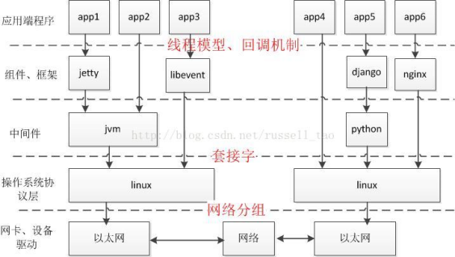

# 多进程/线程并发服务器

---

[TOC]

<!-- toc -->

---

## 多进程并发服务器

使用多进程并发服务器时要考虑以下几点：

1.  父进程最大**文件描述个数**(父进程中需要close关闭accept返回的新文件描述符)

2.  系统内创建**进程个数**(与内存大小相关)

3.  进程创建过多是否降低整体服务性能(进程调度)

### server

/\* server.c \*/

### client

/\* client.c \*/

## 多线程并发服务器

在使用线程模型开发服务器时需考虑以下问题：

1.  调整进程内最大**文件描述符上限**

2.  线程如有共享数据，考虑**线程同步**

3.  服务于客户端线程退出时，**退出处理**。（退出值，分离态）

4.  系统负载，随着链接客户端增加，导致其它线程不能及时得到CPU

### server

/\* server.c \*/

### client

/\* client.c \*/

