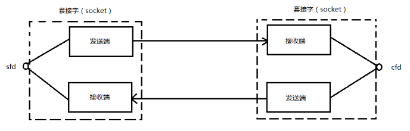

# Socket编程 TCP/UDP

---

[TOC]

<!-- toc -->

---

## 预备知识

### 套接字概念

Socket本身有“插座”的意思，在Linux环境下，用于表示进程间**网络通信**的特殊文件类型。**本质**为内核借助缓冲区形成的**伪文件**。

既然是文件，那么理所当然的，我们可以使用文件描述符引用套接字。与管道类似的，Linux系统将其封装成文件的目的是为了统一接口，使得读写套接字和读写文件的操作一致。区别是管道主要应用于本地进程间通信，而套接字多应用于网络进程间数据的传递。

套接字的内核实现较为复杂，不宜在学习初期深入学习。

在TCP/IP协议中，“IP地址+TCP或UDP端口号”唯一标识网络通讯中的一个**进程**。“**IP地址+端口号**”就对应一个**socket**。欲建立连接的两个进程各自有一个socket来标识，那么这两个socket组成的socket pair就唯一标识一个连接。因此可以用Socket来描述网络连接的一对一关系。

套接字通信原理如下图所示：



套接字通讯原理示意

**在网络通信中，套接字一定是成对出现的。**一端的发送缓冲区对应对端的接收缓冲区。我们使用同一个文件描述符索发送缓冲区和接收缓冲区。

TCP/IP协议最早在BSD UNIX上实现，为**TCP/IP协议**设计的**应用层编程接口**称为**socket API**。本章的主要内容是socket API，主要介绍TCP协议的函数接口，最后介绍UDP协议和UNIX Domain Socket的函数接口。


### 网络字节序

我们已经知道，**内存**中的多字节数据相对于内存地址有大端和小端之分，**磁盘**文件中的多字节数据相对于文件中的偏移地址也有大端小端之分。网络数据流同样有大端小端之分，那么如何定义网络数据流的地址呢？发送主机通常将发送缓冲区中的数据按内存地址从低到高的顺序发出，接收主机把从网络上接到的字节依次保存在接收缓冲区中，也是按内存地址从低到高的顺序保存，因此，网络数据流的地址应这样规定：先发出的数据是低地址，后发出的数据是高地址。

**TCP/IP协议**规定，**网络数据流**应采用**大端字节序**，即**低地址高字节**。例如上一节的UDP段格式，地址0-1是16位的源端口号，如果这个端口号是1000（0x3e8），则地址0是0x03，地址1是0xe8，也就是先发0x03，再发0xe8，这16位在发送主机的缓冲区中也应该是低地址存0x03，高地址存0xe8。但是，如果发送主机是小端字节序的，这16位被解释成0xe803，而不是1000。因此，发送主机把1000填到发送缓冲区之前需要做字节序的转换。同样地，接收主机如果是小端字节序的，接到16位的源端口号也要做字节序的转换。如果主机是大端字节序的，发送和接收都不需要做转换。同理，32位的IP地址也要考虑网络字节序和主机字节序的问题。

为使网络程序具有可移植性，使同样的C代码在大端和小端计算机上编译后都能正常运行，可以调用以下库函数做**网络字节序**和**主机字节序**的转换。

> \#include &lt;arpa/inet.h&gt;
> uint32\_t htonl(uint32\_t hostlong);
> uint16\_t htons(uint16\_t hostshort);
> uint32\_t ntohl(uint32\_t netlong);
> uint16\_t ntohs(uint16\_t netshort);
>

`h`表示host，`n`表示network，`l`表示32位长整数，`s`表示16位短整数。

如果主机是小端字节序，这些函数将参数做相应的大小端转换然后返回，如果主机是大端字节序，这些函数不做转换，将参数原封不动地返回。

### IP地址转换函数

早期：

> \#include &lt;sys/socket.h&gt;
> \#include &lt;netinet/in.h&gt;
> \#include &lt;arpa/inet.h&gt;
> int inet\_aton(const char \*cp, struct in\_addr \*inp);
> in\_addr\_t inet\_addr(const char \*cp);
> char \*inet\_ntoa(struct in\_addr in);

只能处理IPv4的ip地址
不可重入函数
注意参数是struct in\_addr

现在：

> \#include &lt;arpa/inet.h&gt;
> int inet\_pton(int af, const char \*src, void \*dst);
> const char \*inet\_ntop(int af, const void \*src, char \*dst, socklen\_t size);
> IP地址转换函数,字符串类型转换为网络字节序,参3:传出参数

支持IPv4和IPv6
可重入函数
其中inet\_pton和inet\_ntop不仅可以转换IPv4的in\_addr，还可以转换IPv6的in6\_addr。
因此函数接口是void \*addrptr。

"192.168.1.24"字符串  –-> unsigned int —-> htonl() —-> 网络字节序
网络字节序  —->  ntohl() —-> unsigned int —-> "192.168.1.24"字符串

"192.168.1.24"字符串 ------------------> 网络字节序  inet_pton();
网络字节序 ------------------> "192.168.1.24"字符串  inet_ntop();

### sockaddr数据结构

strcut sockaddr 很多网络编程函数诞生早于IPv4协议，那时候都使用的是sockaddr结构体,为了向前兼容，现在sockaddr退化成了（void \*）的作用，传递一个地址给函数，至于这个函数是sockaddr\_in还是sockaddr\_in6，由地址族确定，然后函数内部再强制类型转化为所需的地址类型。


sockaddr数据结构

> struct sockaddr {
> sa\_family\_t sa\_family; /\* address family, AF\_xxx \*/
> char sa\_data\[14\]; /\* 14 bytes of protocol address \*/
> };
>

使用` sudo grep -r "struct sockaddr\_in {" /usr` 命令可查看到struct sockaddr\_in结构体的定义。一般其默认的存储位置：/usr/include/linux/in.h 文件中。

> struct sockaddr\_in {
> \_\_kernel\_sa\_family\_t sin\_family; /\* Address family \*/ 地址结构类型
> \_\_be16 sin\_port; /\* Port number \*/ 端口号
> struct in\_addr sin\_addr; /\* Internet address \*/ IP地址
> /\* Pad to size of \`struct sockaddr'. \*/
> unsigned char \_\_pad\[\_\_SOCK\_SIZE\_\_ - sizeof(short int) -
> sizeof(unsigned short int) - sizeof(struct in\_addr)\];
> };
>
> struct in\_addr { /\* Internet address. \*/
> \_\_be32 s\_addr;
> };


> struct sockaddr\_in6 {
> unsigned short int sin6\_family; /\* AF\_INET6 \*/
> \_\_be16 sin6\_port; /\* Transport layer port \# \*/
> \_\_be32 sin6\_flowinfo; /\* IPv6 flow information \*/
> struct in6\_addr sin6\_addr; /\* IPv6 address \*/
> \_\_u32 sin6\_scope\_id; /\* scope id (new in RFC2553) \*/
> };
>
> struct in6\_addr {
> union {
> \_\_u8 u6\_addr8\[16\];
> \_\_be16 u6\_addr16\[8\];
> \_\_be32 u6\_addr32\[4\];
> } in6\_u;
> \#define s6\_addr in6\_u.u6\_addr8
> \#define s6\_addr16 in6\_u.u6\_addr16
> \#define s6\_addr32 in6\_u.u6\_addr32
> };


> struct sockaddr\_un {
> \_\_kernel\_sa\_family\_t sun\_family; /\* AF\_UNIX \*/
> char sun\_path\[UNIX\_PATH\_MAX\]; /\* pathname \*/
> };

Pv4和IPv6的地址格式定义在`netinet/in.h`中，IPv4地址用`sockaddr_in`结构体表示，包括16位端口号和32位IP地址，IPv6地址用`sockaddr_in6`结构体表示，包括16位端口号、128位IP地址和一些控制字段。UNIX Domain Socket的地址格式定义在sys/un.h中，用sock-addr\_un结构体表示。各种socket地址结构体的开头都是相同的，前16位表示整个结构体的长度（并不是所有UNIX的实现都有长度字段，如Linux就没有），后16位表示地址类型。IPv4、IPv6和Unix Domain Socket的地址类型分别定义为常数AF\_INET、AF\_INET6、AF\_UNIX。这样，只要取得某种sockaddr结构体的首地址，不需要知道具体是哪种类型的sockaddr结构体，就可以根据地址类型字段确定结构体中的内容。因此，socket API可以接受各种类型的sockaddr结构体指针做参数，例如bind、accept、connect等函数，这些函数的参数应该设计成void \*类型以便接受各种类型的指针，但是sock API的实现早于ANSI C标准化，那时还没有void \*类型，因此这些函数的参数都用struct sockaddr \*类型表示，在传递参数之前要强制类型转换一下，例如：

> struct sockaddr\_in servaddr;
> bind(listen\_fd, (struct sockaddr \*)&servaddr, sizeof(servaddr)); /\* initialize servaddr \*/

## TCP

socket模型创建流程图


### 网络套接字函数

#### socket函数

socket套接字打开一个网络通讯端口

> \#include &lt;sys/types.h&gt; 
> \#include &lt;sys/socket.h&gt;
> int socket(int domain, int type, int protocol);
> 成功：返回指向新创建的socket的文件描述符，
> 失败：返回-1，设置errno

参数：

domain:
AF\_INET 这是大多数用来产生socket的协议，使用TCP或UDP来传输，用IPv4的地址
AF\_INET6 与上面类似，不过是来用IPv6的地址
AF\_UNIX 本地协议，使用在Unix和Linux系统上，一般都是当客户端和服务器在同一台及其上的时候使用

type:
`SOCK_STREAM` 这个协议是按照顺序的、可靠的、数据完整的基于字节流的连接。这是一个使用最多的socket类型，这个socket是使用**TCP**来进行传输。
`SOCK_DGRAM` 这个协议是无连接的、固定长度的传输调用。该协议是不可靠的，使用**UDP**来进行它的连接。
SOCK\_SEQPACKET 该协议是双线路的、可靠的连接，发送固定长度的数据包进行传输。必须把这个包完整的接受才能进行读取。
SOCK\_RAW socket类型提供单一的网络访问，这个socket类型使用ICMP公共协议。（ping、traceroute使用该协议）
SOCK\_RDM 这个类型是很少使用的，在大部分的操作系统上没有实现，它是提供给数据链路层使用，不保证数据包的顺序

protocol:
传0 表示使用默认协议。

socket()打开一个网络通讯端口，如果成功的话，就像open()一样返回一个文件描述符，应用程序可以像读写文件一样用read/write在网络上收发数据，如果socket()调用出错则返回-1。对于IPv4，domain参数指定为AF\_INET。对于TCP协议，type参数指定为SOCK\_STREAM，表示面向流的传输协议。如果是UDP协议，则type参数指定为SOCK\_DGRAM，表示面向数据报的传输协议。protocol参数的介绍从略，指定为0即可。

#### bind函数

bind绑定IP地址和端口号

> \#include &lt;sys/types.h&gt;  
> \#include &lt;sys/socket.h&gt;
> int bind(int sockfd, const struct sockaddr \*addr, socklen\_t addrlen);
> 成功：返回0，
> 失败：返回-1, 设置errno

参数：
sockfd：
socket文件描述符

addr:
构造出IP地址+端口号

addrlen:
sizeof(addr)长度

服务器程序所监听的网络地址和端口号通常是固定不变的，客户端程序得知服务器程序的地址和端口号后就可以向服务器发起连接，因此**服务器**需要调用**bind绑定**一个固定的**网络地址**和**端口号**。

bind()的作用是将参数sockfd和addr绑定在一起，使sockfd这个用于网络通讯的文件描述符监听addr所描述的地址和端口号。前面讲过，struct sockaddr \*是一个通用指针类型，addr参数实际上可以接受多种协议的sockaddr结构体，而它们的长度各不相同，所以需要第三个参数addrlen指定结构体的长度。如：

> struct sockaddr\_in servaddr;
> bzero(&servaddr, sizeof(servaddr));
> servaddr.sin\_family = AF\_INET;
> servaddr.sin\_addr.s\_addr = htonl(INADDR\_ANY);
> servaddr.sin\_port = htons(6666);
>

首先将整个结构体清零，然后设置地址类型为AF\_INET，网络地址为**INADDR\_ANY**，这个宏表示**本地的任意IP地址**，因为服务器可能有多个网卡，每个网卡也可能绑定多个IP地址，这样设置可以在所有的IP地址上监听，直到与某个客户端建立了连接时才确定下来到底用哪个IP地址，端口号为6666。

#### listen函数

listen监听socket状态

> \#include &lt;sys/types.h&gt; /\* See NOTES \*/
> \#include &lt;sys/socket.h&gt;
> int listen(int sockfd, int backlog);

sockfd:
socket文件描述符

backlog:
排队建立3次握手队列和刚刚建立3次握手队列的链接数总和

查看系统默认backlog

```
cat /proc/sys/net/ipv4/tcp_max_syn_backlog
# 2048
```

典型的服务器程序可以同时服务于多个客户端，当有客户端发起连接时，服务器调用的accept()返回并接受这个连接，如果有大量的客户端发起连接而服务器来不及处理，尚未accept的客户端就处于连接等待状态，**listen()**声明sockfd处于监听状态，并且**最多允许**有backlog个客户端处于**连接待状态**，如果接收到更多的连接请求就忽略。listen()成功返回0，失败返回-1。

#### accept函数

accept接受连接

> \#include &lt;sys/types.h&gt;  
> \#include &lt;sys/socket.h&gt;
> int accept(int sockfd, struct sockaddr \*addr, socklen\_t \*addrlen);
> 成功：返回一个新的socket文件描述符，用于和客户端通信，
> 失败：返回-1，设置errno
>

sockdf:
socket文件描述符

addr:
传出参数，返回链接客户端地址信息，含IP地址+端口号。

addrlen:
传入传出参数（值-结果）,传入sizeof(addr)大小，函数返回时返回真正接收到地址结构体的大小

三次握手完成后，服务器调用**accept()接受连接**，如果服务器调用accept()时还没有客户端的连接请求，就**阻塞**等待直到有客户端连接上来。addr是一个传出参数，accept()返回时传出客户端的**ip地址和端口号**。addrlen参数是一个传入传出参数（value-result argument），传入的是调用者提供的缓冲区addr的长度以避免缓冲区溢出问题，传出的是客户端地址结构体的实际长度（有可能没有占满调用者提供的缓冲区）。如果给addr参数传NULL，表示不关心客户端的地址。

我们的服务器程序结构是这样的：

while (1) {
cliaddr\_len = sizeof(cliaddr);
connfd = accept(listenfd, (struct sockaddr \*)&cliaddr, &cliaddr\_len);
n = read(connfd, buf, MAXLINE);
......
close(connfd);
}

整个是一个while死循环，每次循环处理一个客户端连接。由于cliaddr\_len是传入传出参数，每次调用accept()之前应该重新赋初值。accept()的参数listenfd是先前的监听文件描述符，而accept()的返回值是另外一个文件描述符connfd，之后与客户端之间就通过这个connfd通讯，最后关闭connfd断开连接，而不关闭listenfd，再次回到循环开头listenfd仍然用作accept的参数。accept()成功返回一个文件描述符，出错返回-1。

#### connect函数

客户端需要调用connect()连接服务器

> \#include &lt;sys/types.h&gt;  
> \#include &lt;sys/socket.h&gt;
> int connect(int sockfd, const struct sockaddr \*addr, socklen\_t addrlen);
> 成功：返回0，
> 失败：返回-1，设置errno

sockdf:
socket文件描述符

addr:
传入参数，指定服务器端地址信息，含IP地址和端口号

addrlen:
传入参数,传入sizeof(addr)大小

客户端需要调用connect()连接服务器，connect和bind的参数形式一致，区别在于bind的参数是自己的地址，而connect的参数是对方的地址。connect()成功返回0，出错返回-1。

### C/S模型-TCP

socket模型创建流程图


下图是基于TCP协议的客户端/服务器程序的一般流程：


TCP协议通讯流程

**服务器**调用socket()、bind()、listen()完成初始化后，调用accept()阻塞等待，处于监听端口的状态，**客户端**调用socket()初始化后，调用connect()发出SYN段并阻塞等待服务器应答，服务器应答一个SYN-ACK段，客户端收到后从connect()返回，同时应答一个ACK段，服务器收到后从accept()返回。

数据传输的过程：

建立连接后，TCP协议提供**全双工**的通信服务，但是一般的客户端/服务器程序的流程是由客户端主动发起请求，服务器被动处理请求，**一问一答**的方式。因此，服务器从accept()返回后立刻调用read()，读socket就像读管道一样，如果没有数据到达就阻塞等待，这时客户端调用write()发送请求给服务器，服务器收到后从read()返回，对客户端的请求进行处理，在此期间客户端调用read()阻塞等待服务器的应答，服务器调用write()将处理结果发回给客户端，再次调用read()阻塞等待下一条请求，客户端收到后从read()返回，发送下一条请求，如此循环下去。

如果客户端没有更多的请求了，就调用close()关闭连接，就像写端关闭的管道一样，服务器的read()返回0，这样服务器就知道客户端关闭了连接，也调用close()关闭连接。注意，任何一方调用**close()**后，连接的两个传输方向**都关闭**，不能再发送数据了。如果一方调用**shutdown()**则连接处于**半关闭**状态，仍可接收对方发来的数据。

在学习socket API时要注意应用程序和TCP协议层是如何交互的： 应用程序调用某个socket函数时TCP协议层完成什么动作，比如调用connect()会发出SYN段 应用程序如何知道TCP协议层的状态变化，比如从某个阻塞的socket函数返回就表明TCP协议收到了某些段，再比如read()返回0就表明收到了FIN段

#### server

下面通过最简单的客户端/服务器程序的实例来学习socket API。

server.c的作用是从客户端读字符，然后将每个字符转换为大写并回送给客户端。

> ```
> #include <stdio.h>
> #include <stdlib.h>
> #include <string.h>
> #include <unistd.h>
> #include <sys/socket.h>
> #include <netinet/in.h>
> #include <arpa/inet.h>
> 
> #define MAXLINE 80
> #define SERV_PORT 6666
> 
> int main(void){
> 	struct sockaddr_in servaddr, cliaddr;
> 	socklen_t cliaddr_len;
> 	int listenfd, connfd;
> 	char buf[MAXLINE];
> 	char str[INET_ADDRSTRLEN];
> 	int i, n;
> 
> 	listenfd = socket(AF_INET, SOCK_STREAM, 0);
> 
> 	bzero(&servaddr, sizeof(servaddr));
> 	servaddr.sin_family = AF_INET;
> 	servaddr.sin_addr.s_addr = htonl(INADDR_ANY);
> 	servaddr.sin_port = htons(SERV_PORT);
> 
> 	bind(listenfd, (struct sockaddr *)&servaddr, sizeof(servaddr));
> 	listen(listenfd, 20);
> 
> 	printf("Accepting connections ...\n");
> 	while (1) {
> 		cliaddr_len = sizeof(cliaddr);
> 		connfd = accept(listenfd, (struct sockaddr *)&cliaddr, &cliaddr_len);
> 		n = read(connfd, buf, MAXLINE);
> 		printf("received from %s at PORT %d\n",
> 		inet_ntop(AF_INET, &cliaddr.sin_addr, str, sizeof(str)),
> 		ntohs(cliaddr.sin_port));
> 		for (i = 0; i < n; i++)
> 			buf[i] = toupper(buf[i]);
> 		write(connfd, buf, n);
> 		close(connfd);
> 	}
> 	return 0;
> }
> ```

#### client

client.c的作用是从命令行参数中获得一个字符串发给服务器，然后接收服务器返回的字符串并打印。

> ```
> #include <stdio.h>
> #include <stdlib.h>
> #include <string.h>
> #include <unistd.h>
> #include <sys/socket.h>
> #include <netinet/in.h>
> 
> #define MAXLINE 80
> #define SERV_PORT 6666
> 
> int main(int argc, char *argv[]){
> 	struct sockaddr_in servaddr;
> 	char buf[MAXLINE];
> 	int sockfd, n;
> 	char *str;
> 
> 	if (argc != 2) {
> 		fputs("usage: ./client message\n", stderr);
> 		exit(1);
> 	}
> 	str = argv[1];
> 
> 	sockfd = socket(AF_INET, SOCK_STREAM, 0);
> 
> 	bzero(&servaddr, sizeof(servaddr));
> 	servaddr.sin_family = AF_INET;
> 	inet_pton(AF_INET, "127.0.0.1", &servaddr.sin_addr);
> 	servaddr.sin_port = htons(SERV_PORT);
> 
> 	connect(sockfd, (struct sockaddr *)&servaddr, sizeof(servaddr));
> 
> 	write(sockfd, str, strlen(str));
> 
> 	n = read(sockfd, buf, MAXLINE);
> 	printf("Response from server:\n");
> 	write(STDOUT_FILENO, buf, n);
> 	close(sockfd);
> 
> 	return 0;
> }
> ```

由于客户端不需要固定的端口号，因此不必调用bind()，客户端的端口号由内核自动分配。注意，客户端不是不允许调用bind()，只是没有必要调用bind()固定一个端口号，服务器也不是必须调用bind()，但如果服务器不调用bind()，内核会自动给服务器分配监听端口，每次启动服务器时端口号都不一样，客户端要连接服务器就会遇到麻烦。

客户端和服务器启动后可以使用netstat命令查看链接情况：

```
netstat -apn | grep 6666
```

nc(netcat)连接服务器

**nc 常用：**

- 侦听任意端口，以TCP/UDP 方式
- 端口扫描
- 传输文件
- 测速

**常用命令：**

1) -l
用于指定nc将处于侦听模式。指定该参数，则意味着nc被当作server，侦听并接受连接，而非向其它地址发起连接。
2) -p <port>
限制数据发送原端口
3) -s 
指定发送数据的源IP地址，适用于多网卡机 
4) -u
 指定nc使用UDP协议，默认为TCP
5) -v
输出交互或出错信息，新手调试时尤为有用
6）-w
超时秒数，后面跟数字 
7）-z
表示zero，表示扫描时不发送任何数据

```
sudo apt install netcat 
nc 127.0.0.1 8000    # nc 连接服务器
```


### 出错处理封装函数

上面的例子不仅功能简单，而且简单到几乎没有什么错误处理，我们知道，系统调用不能保证每次都成功，必须进行出错处理，这样一方面可以保证程序逻辑正常，另一方面可以迅速得到故障信息。

为使错误处理的代码不影响主程序的可读性，我们把与socket相关的一些系统函数加上错误处理代码包装成新的函数，做成一个模块wrap.c：

> wrap.c

> wrap.h


## UDP服务器

传输层主要应用的协议模型有两种，一种是TCP协议，另外一种则是UDP协议。TCP协议在网络通信中占主导地位，绝大多数的网络通信借助TCP协议完成数据传输。但UDP也是网络通信中不可或缺的重要通信手段。

相较于TCP而言，UDP通信的形式更像是发短信。不需要在数据传输之前建立、维护连接。只专心获取数据就好。省去了三次握手的过程，通信速度可以大大提高，但与之伴随的通信的稳定性和正确率便得不到保证。因此，我们称UDP为“无连接的不可靠报文传递”。

那么与我们熟知的TCP相比，UDP有哪些优点和不足呢？由于无需创建连接，所以UDP**开销较小**，数据传输**速度快**，**实时性较强**。多用于对实时性要求较高的通信场合，如**视频会议**、电话会议等。但随之也伴随着数据传输不可靠，传输数据的正确率、传输顺序和流量都得不到控制和保证。所以，通常情况下，使用UDP协议进行数据传输，为保证数据的正确性，我们需要在**应用层**添加辅助**校验**协议来弥补UDP的不足，以达到数据可靠传输的目的。

与TCP类似的，UDP也有可能出现缓冲区被填满后，再接收数据时丢包的现象。由于它没有TCP滑动窗口的机制，通常采用如下两种方法解决：

1)  服务器**应用层**设计**流量控制**，控制发送数据速度。

2)  借助setsockopt函数**改变接收缓冲区大小**。如：

> \#include &lt;sys/socket.h&gt;
> int setsockopt(int sockfd, int level, int optname, const void \*optval, socklen\_t optlen);
> int n = 220x1024
> setsockopt(sockfd, SOL\_SOCKET, SO\_RCVBUF, &n, sizeof(n));

### C/S模型-UDP


UDP处理模型

由于UDP不需要维护连接，程序逻辑简单了很多，但是UDP协议是不可靠的，保证通讯可靠性的机制需要在应用层实现。

编译运行server，在两个终端里各开一个client与server交互，看看server是否具有并发服务的能力。用Ctrl+C关闭server，然后再运行server，看此时client还能否和server联系上。和前面TCP程序的运行结果相比较，体会无连接的含义。

#### server

> ```
> #include <string.h>
> #include <netinet/in.h>
> #include <stdio.h>
> #include <unistd.h>
> #include <strings.h>
> #include <arpa/inet.h>
> #include <ctype.h>
> 
> #define MAXLINE 80
> #define SERV_PORT 6666
> 
> int main(void){
> 	struct sockaddr_in servaddr, cliaddr;
> 	socklen_t cliaddr_len;
> 	int sockfd;
> 	char buf[MAXLINE];
> 	char str[INET_ADDRSTRLEN];
> 	int i, n;
> 
> 	sockfd = socket(AF_INET, SOCK_DGRAM, 0);
> 
> 	bzero(&servaddr, sizeof(servaddr));
> 	servaddr.sin_family = AF_INET;
> 	servaddr.sin_addr.s_addr = htonl(INADDR_ANY);
> 	servaddr.sin_port = htons(SERV_PORT);
> 
> 	bind(sockfd, (struct sockaddr *)&servaddr, sizeof(servaddr));
> 	printf("Accepting connections ...\n");
> 
> 	while (1) {
> 		cliaddr_len = sizeof(cliaddr);
> 		n = recvfrom(sockfd, buf, MAXLINE,0, (struct sockaddr *)&cliaddr, &cliaddr_len);
> 		if (n == -1)
> 			perror("recvfrom error");
> 		printf("received from %s at PORT %d\n", 
> 				inet_ntop(AF_INET, &cliaddr.sin_addr, str, sizeof(str)),
> 				ntohs(cliaddr.sin_port));
> 		for (i = 0; i < n; i++)
> 			buf[i] = toupper(buf[i]);
> 
> 		n = sendto(sockfd, buf, n, 0, (struct sockaddr *)&cliaddr, sizeof(cliaddr));
> 		if (n == -1)
> 			perror("sendto error");
> 	}
> 	close(sockfd);
> 	return 0;
> }
> ```

#### client

> ```
> #include <stdio.h>
> #include <string.h>
> #include <unistd.h>
> #include <netinet/in.h>
> #include <arpa/inet.h>
> #include <strings.h>
> #include <ctype.h>
> 
> #define MAXLINE 80
> #define SERV_PORT 6666
> 
> int main(int argc, char *argv[]){
> 	struct sockaddr_in servaddr;
> 	int sockfd, n;
> 	char buf[MAXLINE];
> 
> 	sockfd = socket(AF_INET, SOCK_DGRAM, 0);
> 
> 	bzero(&servaddr, sizeof(servaddr));
> 	servaddr.sin_family = AF_INET;
> 	inet_pton(AF_INET, "127.0.0.1", &servaddr.sin_addr);
> 	servaddr.sin_port = htons(SERV_PORT);
> 
> 	while (fgets(buf, MAXLINE, stdin) != NULL) {
> 		n = sendto(sockfd, buf, strlen(buf), 0, (struct sockaddr *)&servaddr, sizeof(servaddr));
> 		if (n == -1)
> 			perror("sendto error");
> 		n = recvfrom(sockfd, buf, MAXLINE, 0, NULL, 0);
> 		if (n == -1)
> 			perror("recvfrom error");
> 		write(STDOUT_FILENO, buf, n);
> 	}
> 	close(sockfd);
> 	return 0;
> }
> ```

### 多播(组播)

组播组可以是永久的也可以是临时的。组播组地址中，有一部分由官方分配的，称为永久组播组。永久组播组保持不变的是它的ip地址，组中的成员构成可以发生变化。永久组播组中成员的数量都可以是任意的，甚至可以为零。那些没有保留下来供永久组播组使用的ip组播地址，可以被临时组播组利用。

224.0.0.0～224.0.0.255 为预留的组播地址（永久组地址），地址224.0.0.0保留不做分配，其它地址供路由协议使用；
224.0.1.0～224.0.1.255 是公用组播地址，可以用于Internet；欲使用需申请。
224.0.2.0～238.255.255.255 为用户可用的组播地址（临时组地址），全网范围内有效；
239.0.0.0～239.255.255.255 为本地管理组播地址，仅在特定的本地范围内有效。

可使用ip ad命令查看网卡编号，如：

```
$ ip ad
```

> 1: lo: <LOOPBACK,UP,LOWER_UP> mtu 65536 qdisc noqueue state UNKNOWN group default qlen 1000
>     link/loopback 00:00:00:00:00:00 brd 00:00:00:00:00:00
>     inet 127.0.0.1/8 scope host lo
>        valid_lft forever preferred_lft forever
>     inet6 ::1/128 scope host 
>        valid_lft forever preferred_lft forever
> 2: enp1s0: <NO-CARRIER,BROADCAST,MULTICAST,UP> mtu 1500 qdisc pfifo_fast state DOWN group default qlen 1000
>     link/ether 2c:60:0c:4a:38:6f brd ff:ff:ff:ff:ff:ff
> 3: wlx200db0129d50: <BROADCAST,MULTICAST,UP,LOWER_UP> mtu 1500 qdisc mq state UP group default qlen 1000
>     link/ether 20:0d:b0:12:9d:50 brd ff:ff:ff:ff:ff:ff
>     inet 192.168.1.107/24 brd 192.168.1.255 scope global noprefixroute dynamic wlx200db0129d50
>        valid_lft 4428sec preferred_lft 4428sec
>     inet6 fe80::27a7:2153:73c6:55cd/64 scope link noprefixroute 
>        valid_lft forever preferred_lft forever

if\_nametoindex 命令可以根据网卡名，获取网卡序号。

#### server

#### client

### 其它常用函数

#### 名字与地址转换

gethostbyname根据给定的主机名，获取主机信息。

过时，仅用于IPv4，且线程不安全。

gethostbyaddr函数，此函数只能获取域名解析服务器的url和/etc/hosts里登记的IP对应的域名。

getservbyname

getservbyport

根据服务程序名字或端口号获取信息。使用频率不高。

getaddrinfo

getnameinfo

freeaddrinfo

可同时处理IPv4和IPv6，线程安全的。

#### 套接口和地址关联

getsockname

根据accpet返回的sockfd，得到临时端口号

getpeername

根据accpet返回的sockfd，得到远端链接的端口号，在exec后可以获取客户端信息。

## socket IPC

（本地套接字Domain Socket）

socket API原本是为网络通讯设计的，但后来在socket的框架上发展出一种IPC机制，就是UNIX Domain Socket。虽然网络socket也可用于同一台主机的进程间通讯（通过loopback地址127.0.0.1），但是UNIX Domain Socket用于IPC更有效率：不需要经过网络协议栈，不需要打包拆包、计算校验和、维护序号和应答等，只是将应用层数据从一个进程拷贝到另一个进程。这是因为，IPC机制本质上是可靠的通讯，而网络协议是为不可靠的通讯设计的。UNIX Domain Socket也提供面向流和面向数据包两种API接口，类似于TCP和UDP，但是面向消息的UNIX Domain Socket也是可靠的，消息既不会丢失也不会顺序错乱。

UNIX Domain Socket是全双工的，API接口语义丰富，相比其它IPC机制有明显的优越性，目前已成为使用最广泛的IPC机制，比如X Window服务器和GUI程序之间就是通过UNIX Domain Socket通讯的。

使用UNIX Domain Socket的过程和网络socket十分相似，也要先调用socket()创建一个socket文件描述符，address family指定为AF\_UNIX，type可以选择SOCK\_DGRAM或SOCK\_STREAM，protocol参数仍然指定为0即可。

UNIX Domain Socket与网络socket编程最明显的不同在于地址格式不同，用结构体sockaddr\_un表示，**网络**编程的socket**地址**是**IP地址+端口号**，而**本地套接字**UNIX Domain Socket的**地址**是一个**socket类型的文件在文件系统中的路径**，这个socket文件由bind()调用创建，如果调用bind()时该文件已存在，则bind()错误返回。

对比网络套接字地址结构和本地套接字地址结构：

> struct sockaddr\_in {
> \_\_kernel\_sa\_family\_t **sin\_family**; 	/\* Address family \*/ 地址结构类型
> \_\_be16 **sin\_port**; 	/\* Port number \*/ 端口号
> struct in\_addr **sin\_addr**; 	/\* Internet address \*/ IP地址
> };
> struct sockaddr\_un {
> \_\_kernel\_sa\_family\_t **sun\_family**; 	/\* AF\_UNIX \*/ 地址结构类型
> char **sun\_path**\[UNIX\_PATH\_MAX\];	 /\* pathname \*/ socket文件名(含路径)
> };

以下程序将UNIX Domain socket绑定到一个地址。

> size = offsetof(struct sockaddr\_un, sun\_path) + strlen(un.sun\_path);
> \#define offsetof(type, member) ((int)&((type \*)0)-&gt;MEMBER)

### server

### client


