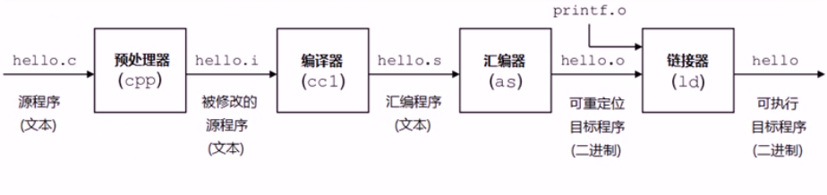
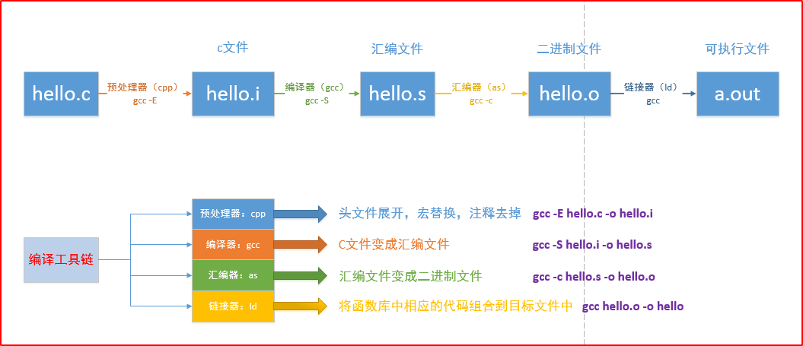
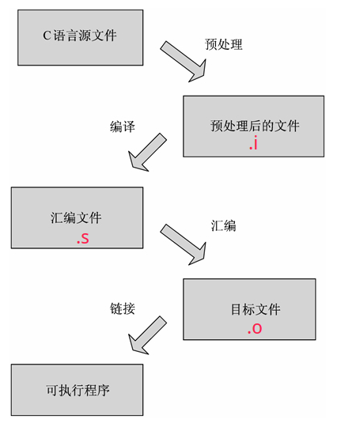

# GCC

---

[TOC]

<!-- toc -->

----

### gcc简介

GNU编译器套装（英语：GNU Compiler Collection，缩写为GCC），指一套编程语言编译器，以GPL及LGPL许可证所发行的自由软件，也是GNU计划的关键部分，也是GNU工具链的主要组成部分之一。GCC（特别是其中的C语言编译器）也常被认为是跨平台编译器的事实标准。

GCC编译器是 Linux 下默认的 C/C++ 编译器，大部分 Linux 发行版中都是默认安装的。

GNU(GNU's Not Unix)是一个自由的操作系统

GPL,General Public License 通用公共授权书

**gcc的特点**

- gcc是一个可移植的编译器，支持多种硬件平台。例如ARM、X86等等。
- gcc不仅是个本地编译器，它还能跨平台交叉编译。所谓的本地编译器，是指编译出来的程序只能够在本地环境进行运行。而gcc编译出来的程序能够在其他平台进行运行。例如嵌入式程序可在x86上编译，然后在arm上运行。
- gcc有多种语言前端，用于解析不同的语言。
- gcc是按模块化设计的，可以加入新语言和新CPU架构的支持。
- gcc是自由软件。任何人都可以使用或更改这个软件。

查看gcc版本号

```
gcc -v 
gcc --version
```

### gcc 编译流程

gcc编译程序主要经过四个过程：

- 预处理（Pre-Processing）
- 编译 （Compiling）
- 汇编 （Assembling）
- 链接 （Linking）







预处理实际上是将头文件、宏进行展开。编译阶段，gcc调用不同语言的编译器，例如c语言调用编译器ccl。gcc实际上是个工具链，在编译程序的过程中调用不同的工具。汇编阶段，gcc调用汇编器进行汇编。链接过程会将程序所需要的目标文件进行链接成可执行文件。汇编器生成的是可重定位的目标文件，学过操作系统，我们知道，在源程序中地址是从0开始的，这是一个相对地址，而程序真正在内存中运行时的地址肯定不是从0开始的，而且在编写源代码的时候也不能知道程序的绝对地址，所以重定位能够将源代码的代码、变量等定位为内存具体地址。下面以一张图来表示这个过程，注意过程中文件的后缀变化，编译选项和这些后缀有关。

GCC 既可以一次性完成C语言源文件的编译，也可以分步骤完成。

`.i`预处理文件、编译`.s`汇编文件、`.o`目标文件可以认为是中间文件或临时文件，如果使用 GCC 一次性完成C语言程序的编译，那么只能看到最终的可执行文件，这些中间文件都是看不到的，因为 GCC 已经经它们删除了。

```
gcc -c main.c    # 编译# 将.c源文件编译成目标文件.o
gcc main.o    # 链接# 将.o 链接成为可执行文件
```

```
gcc -E hello.c -o hello.i   对hello.c文件进行预处理，生成了hello.i 文件
gcc -S hello.i -o hello.s    对预处理文件进行编译，生成了汇编文件
gcc -c hello.s -o hello.o  对汇编文件进行编译，生成了目标文件
gcc hello.o -o hello 对目标文件进行链接，生成可执行文件
gcc hello.c -o hello 直接编译链接成可执行目标文件
gcc -c hello.c 或 gcc -c hello.c -o hello.o 编译生成可重定位目标文件
```

`-E` 预处理指定的源文件，不进行编译，生成**预处理**文件`.i`

`-S` 将C语言源文件编译为汇编语言，但并不汇编该程序，生成**汇编**文件`.s`

`-c` 只编译、汇编源文件，但不链接，生成obj**目标**文件`.o`

`-o` 指定输出文件

`-g` 包含调试信息

`-I +目录` 指定头文件目录

`-Wall` 提示更多警告信息

`-l` 添加标准库中链接库

`-L` 添加搜索链接库的目录

`-D` 编译时定义宏
`-On` 编译优化
		-O0 - 没有优化
		-O1 - 缺省值
		-O3 - 优化级别最高

`-std=c99`

`-std=c11`

### 使用外部库

在使用C语言和其他语言进行程序设计的时候，我们需要头文件来提供对常数的定义和对系统及库函数调用的声明。库文件是一些预先编译好的函数集合，那些函数都是按照可重用原则编写的。它们通常由一组互相关联的可重用原则编写的，它们通常由一组互相关联的用来完成某项常见工作的函数构成。使用库的优点在于：

- 模块化的开发
- 可重用性
- 可维护性

库又可以分为静态库与动态库：

- 静态库（.a）：程序在编译链接的时候把库的代码链接到可执行文件中。程序运行的时候将不再需要静态库。静态库比较占用磁盘空间，而且程序不可以共享静态库。运行时也是比较占内存的，因为每个程序都包含了一份静态库。
- 动态库（.so或.sa）：程序在运行的时候才去链接共享库的代码，多个程序共享使用库的代码，这样就减少了程序的体积。

一般头文件或库文件的位置在：

- /usr/include及其子目录底下的include文件夹
- /usr/local/include及其子目录底下的include文件夹
- /usr/lib
- /usr/local/lib
- /lib

静态库链接时搜索路径顺序：

1. ld会去找GCC命令中的参数-L
2. 再找gcc的环境变量LIBRARY_PATH
3. 再找内定目录 /lib /usr/lib /usr/local/lib 这是当初compile gcc时写在程序内的

动态链接时、执行时搜索路径顺序:

1. 编译目标代码时指定的动态库搜索路径
2. 环境变量LD_LIBRARY_PATH指定的动态库搜索路径
3. 配置文件/etc/ld.so.conf中指定的动态库搜索路径
4. 默认的动态库搜索路径/lib
5. 默认的动态库搜索路径/usr/lib

有关环境变量：
`LIBRARY_PATH`环境变量：指定程序**静态链接库**文件搜索路径
`LD_LIBRARY_PATH`环境变量：指定程序**动态链接库**文件搜索路径

### gcc生成静态链接库

```
gcc -c hello.c -o hello.o    # 生成目标文件.o
ar -r libhello.a hello.o    # hello.o打包成静态库libhello.a
```

( 静态库名称规则： **libxxx.a**, 否则在使用-l链接的时候会找不到）

ar是gun归档工具，rcs表示replace and create，如果libhello之前存在，将创建新的libhello.a并将其替换。

### gcc链接静态库

使用静态库libhello.a

```
gcc main.c libhello.a -o main    # 直接链接静态库全名
#  或者：
gcc -L ./ main.c -lhello -o main    # -l链接静态库
```

-L制定库的搜索路径，-l调用链接库


### gcc生成动态链接库

如果想创建一个动态链接库，可以使用 GCC 的`-shared`选项。输入文件可以是源文件、汇编文件或者目标文件。

另外还得结合`-fPIC`选项。-fPIC 选项作用于编译阶段，告诉编译器产生与位置无关代码（Position-Independent Code）；这样一来，产生的代码中就没有绝对地址了，全部使用相对地址，所以代码可以被加载器加载到内存的任意位置，都可以正确的执行。这正是共享库所要求的，共享库被加载时，在内存的位置不是固定的。

从源文件生成动态链接库：

```
gcc -fPIC -shared func.c -o libhello.so
```

动态链接库，名称的规则是**libxxx.so**

从目标文件生成动态链接库：

```
gcc -fPIC -c func.c -o func.o
gcc -shared func.o -o libhello.so
```

-fPIC 选项作用于编译阶段，在生成目标文件时就得使用该选项，以生成位置无关的代码。

### gcc链接动态链接库

如果希望将一个动态链接库链接到可执行文件，那么需要在命令行中列出动态链接库的名称，具体方式和普通的源文件、目标文件一样。

```
gcc main.c libhello.so -o main    # 直接链接动态库全名
# 或者
gcc main.c -o main -L ./ -lhello    # -l链接静态库
```

-L制定库的搜索路径，-l调用链接库

将 main.c 和 libhello.so 一起编译成 main，当 main运行时，会动态地加载链接库 libfunc.so。

当然，必须要确保程序在运行时可以找到这个动态链接库。你可以将链接库放到标准目录下，例如 /usr/lib，或者设置一个合适的环境变量，例如 LIBRARY_PATH。不同系统，具有不同的加载链接库的方法。

共享库有时候并不不在当前的目录下，为了让gcc能够找得到共享库，有下面几种方法：

1. 拷贝.so文件到系统共享库路径下，一般指/usr/lib
2. 在~/.bash_profile文件中，配置LD_LIBRARY_PATH变量
3. 配置/etc/ld.so.conf，配置完成后调用ldconfig更新ld.so.cache

其中，shared选项表示生成共享库格式。fPIC表示产生位置无关码（position independent code），位置无关码表示它的运行、加载与内存位置无关，可以在任何内存地址进行加载。