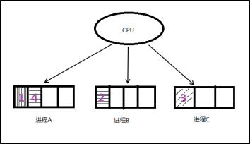

# 进程

----

[TOC]

<!-- toc -->

---

## 进程相关概念

### 程序和进程

**程序**，是指编译好的二进制文件，在磁盘上，不占用系统资源(cpu、内存、打开的文件、设备、锁....)

**进程**，是一个抽象的概念，与操作系统原理联系紧密。进程是活跃的程序，占用系统资源。在内存中执行。(程序运行起来，产生一个进程)

程序 → 剧本(纸) 进程 → 戏(舞台、演员、灯光、道具...)

同一个剧本可以在多个舞台同时上演。同样，同一个程序也可以加载为不同的进程(彼此之间互不影响)

如：同时开两个终端。各自都有一个bash但彼此ID不同。

### 并发

并发，在操作系统中，一个时间段中有多个进程都处于已启动运行到运行完毕之间的状态。但，任一个时刻点上仍只有一个进程在运行。

例如，当下，我们使用计算机时可以边听音乐边聊天边上网。 若笼统的将他们均看做一个进程的话，为什么可以同时运行呢，因为并发。



### 单道程序设计

所有进程一个一个排对执行。若A阻塞，B只能等待，即使CPU处于空闲状态。而在人机交互时阻塞的出现时必然的。所有这种模型在系统资源利用上及其不合理，在计算机发展历史上存在不久，大部分便被淘汰了。

### 多道程序设计

在计算机内存中同时存放几道相互独立的程序，它们在管理程序控制之下，相互穿插的运行。多道程序设计必须有硬件基础作为保证。

**时钟中断**即为多道程序设计模型的理论基础。 并发时，任意进程在执行期间都不希望放弃cpu。因此系统需要一种强制让进程让出cpu资源的手段。时钟中断有硬件基础作为保障，对进程而言不可抗拒。 操作系统中的中断处理函数，来负责调度程序执行。

在多道程序设计模型中，多个进程轮流使用CPU (分时复用CPU资源)。而当下常见CPU为纳秒级，1秒可以执行大约10亿条指令。由于人眼的反应速度是毫秒级，所以看似同时在运行。

1s = 1000ms, 1ms = 1000us, 1us = 1000ns 1000000000

实质上，并发是宏观并行，微观串行！ -----推动了计算机蓬勃发展，将人类引入了多媒体时代。

### CPU和MMU


{width="7.263888888888889in" height="3.904166666666667in"}

### 进程控制块PCB

我们知道，每个进程在内核中都有一个进程控制块（PCB）来维护进程相关的信息，Linux内核的进程控制块是`task_struct`结构体。

/usr/src/linux-headers-3.16.0-30/include/linux/sched.h文件中可以查看struct task\_struct 结构体定义。其内部成员有很多，我们重点掌握以下部分即可：

\* 进程id。系统中每个进程有唯一的id，在C语言中用pid\_t类型表示，其实就是一个非负整数。
\* 进程的状态，有就绪、运行、挂起、停止等状态。
\* 进程切换时需要保存和恢复的一些CPU寄存器。
\* 描述虚拟地址空间的信息。
\* 描述控制终端的信息。
\* 当前工作目录（Current Working Directory）。
\* umask掩码。
\* 文件描述符表，包含很多指向file结构体的指针。
\* 和信号相关的信息。
\* 用户id和组id。
\* 会话（Session）和进程组。
\* 进程可以使用的资源上限（Resource Limit）。

### 进程状态

进程基本的状态有5种。分别为初始态，就绪态，运行态，挂起态与终止态。其中初始态为进程准备阶段，常与就绪态结合来看。

{width="4.55in" height="3.6319444444444446in"}


**Linux进程状态：R (TASK_RUNNING)，可执行状态。**

   只有在该状态的进程才可能在CPU上运行。而同一时刻可能有多个进程处于可执行状态，这些进程的task_struct结构（进程控制块）被放入对应CPU的可执行队列中（一个进程最多只能出现在一个CPU的可执行队列中）。进程调度器的任务就是从各个CPU的可执行队列中分别选择一个进程在该CPU上运行。

**Linux进程状态：S (TASK_INTERRUPTIBLE)，可中断的睡眠状态。**

  处于这个状态的进程因为等待某某事件的发生（比如等待socket连接、等待信号量），而被挂起。这些进程的task_struct结构被放入对应事件的等待队列中。当这些事件发生时（由外部中断触发、或由其他进程触发），对应的等待队列中的一个或多个进程将被唤醒。

**Linux进程状态：D (TASK_UNINTERRUPTIBLE)，不可中断的睡眠状态。**

  与TASK_INTERRUPTIBLE状态类似，进程处于睡眠状态，但是此刻进程是不可中断的。不可中断，指的并不是CPU不响应外部硬件的中断，而是指进程不响应异步信号。

**Linux进程状态：T (TASK_STOPPED or TASK_TRACED)，暂停状态或跟踪状态。**

  向进程发送一个SIGSTOP信号，它就会因响应该信号而进入TASK_STOPPED状态（除非该进程本身处于TASK_UNINTERRUPTIBLE状态而不响应信号）。（SIGSTOP与SIGKILL信号一样，是非常强制的。不允许用户进程通过signal系列的系统调用重新设置对应的信号处理函数。）
向进程发送一个SIGCONT信号，可以让其从TASK_STOPPED状态恢复到TASK_RUNNING状态。

**Linux进程状态：Z (TASK_DEAD - EXIT_ZOMBIE)，退出状态，进程成为僵尸进程。**

  进程在退出的过程中，处于TASK_DEAD状态。

**Linux进程状态：X (TASK_DEAD - EXIT_DEAD)，退出状态，进程即将被销毁。**

  而进程在退出过程中也可能不会保留它的task_struct。比如这个进程是多线程程序中被detach过的进程（进程？线程？参见《linux线程浅析》）。或者父进程通过设置SIGCHLD信号的handler为SIG_IGN，显式的忽略了SIGCHLD信号。（这是posix的规定，尽管子进程的退出信号可以被设置为SIGCHLD以外的其他信号。）
  此时，进程将被置于EXIT_DEAD退出状态，这意味着接下来的代码立即就会将该进程彻底释放。所以EXIT_DEAD状态是非常短暂的，几乎不可能通过ps命令捕捉到。


## 环境变量

环境变量，是指在操作系统中用来指定操作系统**运行环境**的一些参数。通常具备以下特征：

① 字符串(本质) 
② 有统一的格式：名=值\[:值\] 
③ 值用来描述进程环境信息。

存储形式：与命令行参数类似。char \*\[\]数组，数组名environ，内部存储字符串，NULL作为哨兵结尾。
使用形式：与命令行参数类似。
加载位置：与命令行参数类似。位于用户区，高于stack的起始位置。
引入环境变量表：须声明环境变量 extern char \*\* environ;

练习：打印当前进程的所有环境变量。 【environ.c】

### 常见环境变量

按照惯例，环境变量字符串都是name=value这样的形式，大多数name由大写字母加下划线组成，一般把name的部分叫做环境变量，value的部分则是环境变量的值。环境变量定义了进程的运行环境，一些比较重要的环境变量的含义如下：

```
env   # 查看所有环境变量
```

- PATH

可执行文件的搜索路径。ls命令也是一个程序，执行它不需要提供完整的路径名/bin/ls，然而通常我们执行当前目录下的程序a.out却需要提供完整的路径名./a.out，这是因为PATH环境变量的值里面包含了ls命令所在的目录/bin，却不包含a.out所在的目录。PATH环境变量的值可以包含多个目录，用:号隔开。在Shell中用echo命令可以查看这个环境变量的值：

```
echo $PATH
```

- SHELL

当前Shell，它的值通常是/bin/bash。

```
echo $SHELL
/bin/bash
```

- TERM

当前终端类型，在图形界面终端下它的值通常是xterm，终端类型决定了一些程序的输出显示方式，比如图形界面终端可以显示汉字，而字符终端一般不行。

```
echo $TERM 
xterm-256color
```

- LANG

语言和locale，决定了字符编码以及时间、货币等信息的显示格式。

- HOME

当前用户主目录的路径，很多程序需要在主目录下保存配置文件，使得每个用户在运行该程序时都有自己的一套配置。

### getenv函数

获取环境变量值

`char *getenv(const char *name);` 
成功：返回环境变量的值；失败：NULL (name不存在)

练习：编程实现getenv函数获取环境变量值。 【getenv.c】

### setenv函数

设置环境变量的值

`int setenv(const char *name, const char *value, int overwrite); `
成功：0；失败：-1

参数overwrite取值：
 1：覆盖原环境变量
 0：不覆盖。(该参数常用于设置新环境变量，如：ABC = haha-day-night)

### unsetenv函数

删除环境变量name的定义

`int unsetenv(const char *name); `
成功：0；失败：-1

注意事项：name不存在仍返回0(成功)，当name命名为"ABC="时则会出错。

## 进程控制

### fork函数

#### 创建一个子进程。

> `pid_t fork(void); `
> 失败返回-1；
> 成功返回：① 父进程返回子进程的ID(非负)     ②子进程返回 0
>
> pid\_t 类型表示进程ID，但为了表示-1，它是有符号整型。(0不是有效进程ID，init最小，为1)

注意fork返回值，不是fork函数能返回两个值，而是fork后，fork函数变为两个，父子需【各自】返回一个。

#### 循环创建n个子进程

一次fork函数调用可以创建一个子进程。那么创建N个子进程应该怎样实现呢？

简单想，for(i = 0; i &lt; n; i++) { fork() } 即可。但这样创建的是N个子进程吗？

{width="5.631944444444445in" height="3.267361111111111in"}


从上图我们可以很清晰的看到，当n为3时候，循环创建了`(2^n)-1`个子进程，而不是N的子进程。需要在循环的过程，**保证子进程不再执行fork** ，因此当(fork() == 0)时，子进程应该立即**break**才正确。所有子进程都是主父进程fork出来的,直接子进程.

练习：通过命令行参数指定创建进程的个数，每个进程休眠1S打印自己是第几个被创建的进程。如：第1个子进程休眠0秒打印：“我是第1个子进程”；第2个进程休眠1秒打印：“我是第2个子进程”；第3个进程休眠2秒打印：“我是第3个子进程”。 【fork1.c】

通过该练习掌握框架：循环创建n个子进程，使用循环因子i对创建的子进程加以区分。

### getpid函数

获取当前进程ID

> pid\_t getpid(void);
>

### getppid函数

获取当前进程的父进程ID

> pid\_t getppid(void);
>

区分一个函数是“*系统函数*”还是“*库函数*”依据：

1. 是否访问*内核数据结构*
2. 是否访问外部*硬件资源*   

二者有任一 → 系统函数；
二者均无 → 库函数

### getuid函数

获取当前进程使用用户ID

> uid\_t getuid(void);

获取当前进程**有效**用户ID

> uid\_t geteuid(void);

### getgid函数

获取当前进程使用用户组ID

> gid\_t getgid(void);

获取当前进程**有效**用户组ID

> gid\_t getegid(void);

### 进程共享

父子进程之间在fork后。有哪些相同，那些相异之处呢？

**刚fork之后**：

父子进程**相同处**: 

- ==全局变量==、
- .data、
- .text、
- 栈、
- 堆、
- 环境变量、
- 用户ID、
- 宿主目录、
- 进程工作目录、
- 信号处理方式
- ...

父子进程**不同处**: 

1. 进程ID 
2. 父进程ID 
3. fork返回值 
4. 进程运行时间  
5. 闹钟(定时器) 
6. 未决信号集

似乎，子进程复制了父进程**0-3G用户空间**内容，以及父进程的PCB，但pid不同。真的每fork一个子进程都要将父进程的0-3G地址空间完全拷贝一份，然后在映射至物理内存吗？

当然不是!父子进程间遵循**==读时共享写时复制==**的原则。这样设计，无论子进程执行父进程的逻辑还是执行自己的逻辑都能节省内存开销。

重点注意！父子进程**不共享全局变量**！(刚fork之后相同,读时共享写时复制)

【重点】：父子进程共享：

1. 文件描述符(打开文件的结构体) 
2. mmap建立的映射区 (进程间通信详解)

特别的，fork之后父进程先执行还是子进程先执行不确定。取决于内核所使用的调度算法。

练习：编写程序测试，父子进程是否共享全局变量。 【fork\_shared.c】

### gdb调试

使用gdb调试的时候，gdb只能跟踪一个进程。可以在fork函数调用之前，通过指令设置gdb调试工具跟踪父进程或者是跟踪子进程。默认跟踪父进程。

```
# 设置gdb在fork之后跟踪子进程
set follow-fork-mode child 
# 设置跟踪父进程
set follow-fork-mode parent 
```

注意，一定要在fork函数调用之前设置才有效。 

练习：gdb调试跟踪父子进程【follow\_fork.c】

## exec函数族 

fork创建子进程后执行的是和父进程相同的程序（但有可能执行不同的代码分支），子进程往往要调用一种exec函数以执行另一个程序。当进程调用一种exec函数时，该进程的**用户空间** *代码*和*数据*完全被新程序替换，从新程序的启动例程开始执行。调用exec并不创建新进程，所以调用exec前后该进程的id并未改变。

将当前进程的.text、.data替换为所要加载的程序的.text、.data，然后让进程从新的.text第一条指令开始执行，但进程ID不变，换核不换壳。

其实有六种以exec开头的函数，统称exec函数：

> int execl(const char \*path, const char \*arg, ...);
>
> int execlp(const char \*file, const char \*arg, ...);
>
> int execle(const char \*path, const char \*arg, ..., char \*const envp\[\]);
>
> int execv(const char \*path, char \*const argv\[\]);
>
> int execvp(const char \*file, char \*const argv\[\]);
>
> int execve(const char \*path, char \*const argv\[\], char \*const envp\[\]);
>

### execl函数

加载一个进程， 通过 路径+程序名 来加载。

> int execl(const char \*path, const char \*arg, ...); 
> 成功：无返回；失败：-1

对比execlp，如加载"ls"命令带有-l，-F参数

execlp("ls", "ls", "-l", "-F", NULL); 使用程序名在PATH中搜索。

execl("/bin/ls", "ls", "-l", "-F", NULL); 使用参数1给出的绝对路径搜索。

### execlp函数

加载一个进程，借助PATH环境变量

> int execlp(const char \*file, const char \*arg, ...); 
> 成功：无返回；失败：-1

参数1：要加载的程序的名字。该函数需要配合PATH环境变量来使用，当PATH中所有目录搜索后没有参数1则出错返回。

该函数通常用来调用系统程序。如：ls、date、cp、cat等命令。

### execvp函数

加载一个进程，使用自定义环境变量env

> int execvp(const char \*file, const char \*argv\[\]);
>
> 变参形式： ①... ② argv\[\] (main函数也是变参函数，形式上等同于 int main(int argc, char \*argv0, ...))
>
> 变参终止条件：① NULL结尾 ② 固参指定

execvp与execlp参数形式不同，原理一致。

练习：将当前系统中的进程信息，打印到文件中。 【exec\_ps.c】

### exec函数族一般规律

exec函数一旦调用**成功**即执行新的程序，**不返回**。**只有失败才返回，错误值-1**。所以通常我们直接在exec函数调用后直接调用`perror()`和`exit()`，无需if判断。

- l (list) 命令行参数列表
- p (path) 搜素file时使用path变量
- v (vector) 使用命令行参数数组
- e (environment) 使用环境变量数组,不使用进程原有的环境变量，设置新加载程序运行的环境变量

事实上，只有execve是真正的系统调用，其它五个函数最终都调用execve，所以execve在man手册第2节，其它函数在man手册第3节。这些函数之间的关系如下图所示。

{width="4.8125in" height="2.25in"}

## wait回收子进程

### 孤儿进程

孤儿进程: 父进程先于子进程结束，则子进程成为孤儿进程，子进程的父进程成为init进程，称为init进程领养孤儿进程。

【orphan.c】

### 僵尸进程

僵尸进程: 进程终止，父进程尚未回收，子进程残留资源（PCB）存放于内核中，变成僵尸（Zombie）进程。

【zoom .c】

特别注意，僵尸进程是不能使用kill命令清除掉的。因为kill命令只是用来终止进程的，而僵尸进程已经终止。思考！用什么办法可清除掉僵尸进程呢？

### wait函数

一个进程在终止时会关闭所有文件描述符，释放在用户空间分配的内存，但它的PCB还保留着，内核在其中保存了一些信息：如果是正常终止则保存着退出状态，如果是异常终止则保存着导致该进程终止的信号是哪个。这个进程的父进程可以调用wait或waitpid获取这些信息，然后彻底清除掉这个进程。我们知道一个进程的退出状态可以在Shell中用特殊变量\$?查看，因为Shell是它的父进程，当它终止时Shell调用wait或waitpid得到它的退出状态同时彻底清除掉这个进程。

**父进程**调用`wait`函数可以**回收子进程**终止信息。该函数有三个功能：

1. 阻塞等待**子进程退出**
2. **回收**子进程残留**资源**
3. 获取子进程**结束状态**(退出原因)。

> **pid\_t wait(int \*status);** 
> 成功：清理掉的子进程ID；
> 失败：-1 (没有子进程)

当进程终止时，操作系统的隐式回收机制会：1.关闭所有文件描述符 2. 释放用户空间分配的内存。内核的PCB仍存在。其中保存该进程的退出状态。(正常终止→退出值；异常终止→终止信号)

可使用wait函数传出参数status来保存进程的退出状态。借助宏函数来进一步判断进程终止的具体原因。宏函数可分为如下三组：

> - WIFEXITED(status) 为非0 → 进程正常结束
>       WEXITSTATUS(status) 如上宏为真，使用此宏 → 获取进程退出状态 (exit的参数)
>
> - WIFSIGNALED(status) 为非0 → 进程异常终止
>       WTERMSIG(status) 如上宏为真，使用此宏 → 取得使进程终止的那个信号的编号。
>
> - WIFSTOPPED(status) 为非0 → 进程处于暂停状态
>       WSTOPSIG(status) 如上宏为真，使用此宏 → 取得使进程暂停的那个信号的编号。
>   WIFCONTINUED(status) 为真 → 进程暂停后已经继续运行

【wait1.c、wait2.c】

### waitpid函数

作用同wait，但可指定pid进程清理，可以不阻塞。

> pid\_t waitpid(pid\_t pid, int \*status, in options); 
> 成功：返回清理掉的子进程ID；
> 失败：-1(无子进程)

> 特殊参数和返回情况：
>
> 参数pid：
> **&gt; 0 回收指定ID的子进程 **
> **-1 回收任意子进程（相当于wait）**
> 0 回收和当前调用waitpid一个**组**的所有子进程
> &lt; -1 回收**指定**进程**组内**的任意子进程
>
> 返回0：参3为WNOHANG非阻塞等待，且子进程正在运行。

注意：**一次wait或waitpid调用只能清理一个子进程**，清理多个子进程应使用循环。 【waitpid.c】

作业：父进程fork 3 个子进程，三个子进程一个调用ps命令， 一个调用自定义程序1(正常)，一个调用自定义程序2(会出段错误)。父进程使用waitpid对其子进程进行回收。
