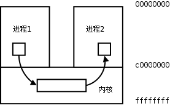
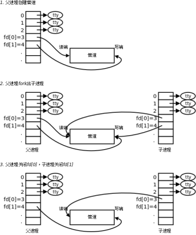
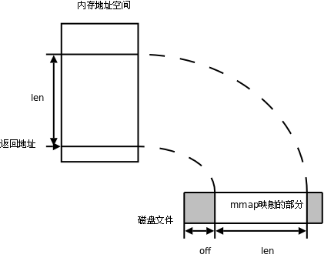

## 进程间通信IPC方法

----

[TOC]

<!-- toc -->

---

Linux环境下，进程用户地址空间相互独立，每个进程各自有不同的**用户地址空间**。任何一个进程的全局变量在另一个进程中都看不到，所以进程和进程之间不能相互访问，要交换数据必须通过内核，在内核中开辟一块缓冲区，进程1把数据从用户空间拷到内核缓冲区，进程2再从内核缓冲区把数据读走，内核提供的这种机制称为进程间通信（IPC，InterProcess Communication）。

{width="2.8854166666666665in" height="1.8645833333333333in"}

在进程间完成数据传递需要借助操作系统提供特殊的方法，如：

- 文件、
- pipe管道、
- FIFO命名管道等。
- mmap共享内存、
- 信号、
- 套接字、
- 消息队列、

随着计算机的蓬勃发展，一些方法由于自身设计缺陷被淘汰或者弃用。现今常用的进程间通信方式有：

- pipe管道 (使用最简单)
- mmap共享映射区 (无血缘关系)
- 信号 (开销最小)
- 本地套接字 (最稳定)

## pipe管道

### 管道的概念：

管道是一种最基本的IPC机制，作用于**有血缘关系**的进程之间，完成数据传递。调用pipe系统函数即可创建一个管道。有如下特质：

1. 其本质是一个伪文件(实为内核缓冲区)
2. 由两个文件描述符引用，一个表示读端，一个表示写端。
3. 规定数据从管道的写端流入管道，从读端流出。

管道的原理: 管道实为内核使用环形队列机制，借助内核缓冲区(4k)实现。

管道的局限性：

① 数据自己读不能自己写。

② 数据一旦被读走，便不在管道中存在，**不可反复读取**。

③ 由于管道采用半双工通信方式。因此，数据只能在一个方向上**单向**流动。

④ 只能在有公共祖先(**有血缘关系**)的进程间使用管道。

常见的通信方式有，单工通信、半双工通信、全双工通信。

### pipe函数

创建管道

> int pipe(int pipefd\[2\]); 
> 成功：0；
> 失败：-1，设置errno

函数调用成功返回r/w**两个文件描述符**。**无需open，但需手动close**。规定：fd\[0\] → r； fd\[1\] → w，就像0对应标准输入，1对应标准输出一样。向管道文件读写数据其实是在读写内核缓冲区。

管道创建成功以后，创建该管道的进程（父进程）同时掌握着管道的读端和写端。如何实现父子进程间通信呢？通常可以采用如下步骤：

{width="3.463888888888889in" height="4.1618055555555555in"}

1. 父进程调用`pipe`函数创建管道，得到两个文件描述符fd\[0\]、fd\[1\]指向管道的读端和写端。
2. 父进程调用`fork`创建子进程，那么子进程也有两个文件描述符指向同一管道。
3. **父**进程**关闭**管道读端fd[0]，**子**进程**关闭**管道写端fd[1]。父进程可以向管道中写入数据，子进程将管道中的数据读出。由于管道是利用环形队列实现的，数据从写端流入管道，从读端流出，这样就实现了进程间通信。

练习：父子进程使用管道通信，父写入字符串，子进程读出并，打印到屏幕。 【pipe.c】

思考：为甚么，程序中没有使用sleep函数，但依然能保证子进程运行时一定会读到数据呢？

### 管道的读写行为

使用管道需要注意以下4种特殊情况（假设都是阻塞I/O操作，没有设置O\_NONBLOCK标志）：

1\. 如果所有指向管道**写端**的文件描述符都关闭了（管道写端引用计数为0），而仍然有进程从管道的读端读数据，那么管道中剩余的数据都被读取后，再次read会返回0，就像读到文件末尾一样。

2\. 如果有指向管道**写端**的文件描述符没关闭（管道写端引用计数大于0），而持有管道写端的进程也没有向管道中写数据，这时有进程从管道读端读数据，那么管道中剩余的数据都被读取后，再次read会阻塞，直到管道中有数据可读了才读取数据并返回。

3\. 如果所有指向管道**读端**的文件描述符都关闭了（管道读端引用计数为0），这时有进程向管道的写端write，那么该进程会收到`信号SIGPIPE`，通常会导致进程异常终止。当然也可以对SIGPIPE信号实施捕捉，不终止进程。具体方法信号章节详细介绍。

4\. 如果有指向管道**读端**的文件描述符没关闭（管道读端引用计数大于0），而持有管道读端的进程也没有从管道中读数据，这时有进程向管道写端写数据，那么在管道被**写满**时再次write会**阻塞**，直到管道中有空位置了才写入数据并返回。

管道的读写行为总结：

- 读管道： 

  1. 管道中有数据，read返回实际读到的字节数。

  2. 管道中无数据：

     \(1) 管道写端被全部关闭，read返回0 (好像读到文件结尾)

     \(2) 写端没有全部被关闭，read**阻塞等待**(不久的将来可能有数据递达，此时会让出cpu)

- 写管道： 

  1. 管道读端全部被关闭， 进程异常终止(也可使用捕捉SIGPIPE信号，使进程不终止)

  2. 管道读端没有全部关闭：

     \(1) 管道已满，write阻塞，直到管道中有空位置了才写入数据并返回。

     \(2) 管道未满，write将数据写入，并返回实际写入的字节数。

练习：使用管道实现父子进程间通信，完成：ls | wc –l。假定父进程实现ls，子进程实现wc。
ls命令正常会将结果集写出到stdout，但现在会写入管道的写端；wc –l 正常应该从stdin读取数据，但此时会从管道的读端读。 【pipe1.c】

程序执行，发现程序执行结束，shell还在阻塞等待用户输入。这是因为，shell → fork → ./pipe1， 程序pipe1的子进程将stdin重定向给管道，父进程执行的ls会将结果集通过管道写给子进程。若父进程在子进程打印wc的结果到屏幕之前被shell调用wait回收，shell就会先输出\$提示符。

练习：使用管道实现兄弟进程间通信。 兄：ls 弟： wc -l 父：等待回收子进程。

要求，使用“循环创建N个子进程”模型创建兄弟进程，使用循环因子i标示。注意管道读写行为。 【pipe2.c】

测试：是否允许，一个pipe有一个写端，多个读端呢？是否允许有一个读端多个写端呢？ 【pipe3.c】

课后作业: 统计当前系统中进程ID大于10000的进程个数。

### 管道缓冲区大小

可以使用`ulimit -a` 命令来查看当前系统中创建管道文件所对应的内核缓冲区大小。通常为( 8 * 512 bytes = 4k )：pipe size (512 bytes, -p) 8

```
ulimit -a
pipe size        (512 bytes, -p) 8
```

也可以使用fpathconf函数，借助参数 选项来查看。使用该宏应引入头文件&lt;unistd.h&gt;

long fpathconf(int fd, int name); 成功：返回管道的大小 失败：-1，设置errno

### 管道的优劣

优点：

- 简单，相比信号，套接字实现进程间通信，简单很多。

缺点：

- 只能**单向**通信，双向通信需建立两个管道。
- 只能用于父子、兄弟进程(有**共同祖先**)间通信。该问题后来使用fifo有名管道解决。

## FIFO命名管道

FIFO常被称为命名管道，以区分管道(pipe)。管道(pipe)只能用于“有血缘关系”的进程间。但通过FIFO，不相关的进程也能交换数据。

FIFO是Linux基础文件类型中的一种(伪文件)。但，FIFO文件在磁盘上没有数据块，仅仅用来标识内核中一条通道。各进程可以打开这个文件进行read/write，实际上是在读写内核通道，这样就实现了进程间通信。

创建方式：

1. 命令：

   ```
   mkfifo 管道名
   ```

2. 库函数：

   头文件：`sys/types.h`、`sys/stat.h` 

   > int mkfifo(const char *filename, mode_t mode);
   > 成功：返回0，
   > 失败：返回-1，并设置errno

一旦使用mkfifo创建了一个FIFO，就可以使用open打开它，常见的文件I/O函数都可用于fifo。如：close、read、write、unlink等。

【fifo\_w.c/fifo\_r.c】

## mmap共享存储映射

### 存储映射I/O 

存储映射I/O (Memory-mapped I/O) 使一个磁盘文件与存储空间中的一个缓冲区相映射。于是当从缓冲区中取数据，就相当于读文件中的相应字节。于此类似，将数据存入缓冲区，则相应的字节就自动写入文件。这样，就可在不适用read和write函数的情况下，使用地址（**指针**）完成I/O操作。

使用这种方法，首先应通知内核，将一个指定文件映射到存储区域中。这个映射工作可以通过mmap函数来实现。

{width="3.3756944444444446in" height="2.7180555555555554in"}

#### mmap函数

> void \*mmap(void \*adrr, size\_t length, int prot, int flags, int fd, off\_t offset);
> 成功：返回创建的映射区首地址；
> **失败：MAP\_FAILED宏**

参数：

> addr: 建立映射区的首地址，由Linux内核指定。使用时，直接传递NULL
> length： 欲创建映射区的大小
> prot： 映射区权限PROT\_READ、PROT\_WRITE、PROT\_READ|PROT\_WRITE
> flags： 标志位参数(常用于设定更新物理区域、设置共享、创建匿名映射区)
> MAP_SHARED: 会将映射区所做的操作反映到物理设备（磁盘）上。
> MAP_PRIVATE: 映射区所做的修改不会反映到物理设备。
> fd： 用来建立映射区的文件描述符
> offset： 映射文件的偏移(4k的整数倍)
>

#### munmap函数

同malloc函数申请内存空间类似的，mmap建立的映射区在使用结束后也应调用类似free的函数来释放。

> int munmap(void \*addr, size\_t length); 
> 成功：0； 
> 失败：-1

借鉴malloc和free函数原型，尝试装自定义函数smalloc，sfree来完成映射区的建立和释放。思考函数接口该如何设计？

【mmap_smalloc.c】

#### mmap注意事项

> 【mmap.c】

思考：

1\. 可以open的时候O\_CREAT一个新文件来创建映射区吗?

2\. 如果open时O\_RDONLY, mmap时PROT参数指定PROT\_READ|PROT\_WRITE会怎样？

3\. 文件描述符先关闭，对mmap映射有没有影响？

4\. 如果文件偏移量为1000会怎样？

5\. 对mem越界操作会怎样？

6\. 如果mem++，munmap可否成功？ 保证munmap是mmap的首地址即可

7\. mmap什么情况下会调用失败？

8\. 如果不检测mmap的返回值，会怎样？

**总结：使用mmap时务必注意以下事项：**

1.  创建映射区的过程中，隐含着一次对映射文件的**读**操作。

2.  当MAP\_SHARED时，要求：映射区的**权限**应 &lt;=文件打开的权限(出于对映射区的保护)。而MAP\_PRIVATE则无所谓，因为mmap中的权限是对内存的限制。

3.  映射区的释放与文件关闭无关。只要**映射建立成功**，**文件可**以立即**关闭**。

4.  特别注意，当映射文件大小为0时，不能创建映射区。所以：用于映射的**文件必须要有实际大小**！！ mmap使用时常常会出现总线错误，通常是由于共享文件存储空间大小引起的。

5.  munmap传入的地址一定是mmap的返回地址。坚决杜绝指针++操作。

6.  如果文件**偏移量**必须为**4K**的整数倍

7.  mmap创建映射区出错概率非常高，一定要检查返回值，确保映射区建立成功再进行后续操作。

### mmap父子进程通信

父子等有血缘关系的进程之间也可以通过mmap建立的映射区来完成数据通信。但相应的要在创建映射区的时候指定对应的标志位参数flags：

==MAP\_PRIVATE==: (私有映射) 父子进程各自**独占**映射区；
==MAP\_SHARED==: (共享映射) **父子进程共享**映射区；

练习：父进程创建映射区，然后fork子进程，子进程修改映射区内容，而后，父进程读取映射区内容，查验是否共享。 【mmap_fork.c】

结论：**父子进程共享：1. 打开的文件 2. mmap建立的映射区(但必须要使用MAP\_SHARED)**

### 匿名映射

通过使用我们发现，使用映射区来完成文件读写操作十分方便，父子进程间通信也较容易。但缺陷是，每次创建映射区一定要**依赖**一个**文件**才能实现。通常为了建立映射区要open一个temp文件，创建好了再unlink、close掉，比较麻烦。 可以直接使用匿名映射来代替。其实Linux系统给我们提供了创建匿名映射区的方法，**无需依赖**一个**文件**即可创建映射区。同样需要借助标志位参数flags来指定。

使用==MAP_ANONYMOUS== (或MAP_ANON)， 如:

> int \*p = mmap(NULL, 4, PROT\_READ|PROT\_WRITE, MAP\_SHARED|MAP\_ANONYMOUS, -1, 0);
>

"4"随意举例，该位置表大小，可依实际需要填写。

【map\_anon\_linux.c】

需注意的是，MAP\_ANONYMOUS和MAP\_ANON这两个宏是Linux操作系统特有的宏。在类Unix系统中如无该宏定义，可使用如下两步来完成匿名映射区的建立。

1. fd = open("/dev/zero", O\_RDWR);
2.  p = mmap(NULL, size, PROT\_READ|PROT\_WRITE, MMAP\_SHARED, fd, 0);

【map\_anon_unix.c】

### mmap无血缘关系进程间通信

实质上mmap是内核借助文件帮我们创建了一个映射区，多个进程之间利用该映射区完成数据传递。由于内核空间多进程共享，因此无血缘关系的进程间也可以使用mmap来完成通信。只要设置相应的标志位参数flags即可。若想实现共享，当然应该使用MAP\_SHARED了。

【mmp_shared_w.c  /  mmp_shared_r.c】

## 文件进程间通信

使用文件也可以完成IPC，理论依据是，fork后，父子进程共享文件描述符。也就共享打开的文件。

练习：编程测试，父子进程共享打开的文件。借助文件进行进程间通信。 【file_IPC.c】

思考，无血缘关系的进程可以打开同一个文件进行通信吗？为什么？