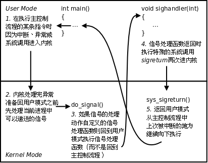

# 信号

----

[TOC]

<!-- toc -->

---

## 信号的概念

信号在我们的生活中随处可见， 如：古代战争中摔杯为号；现代战争中的信号弹；体育比赛中使用的信号枪......他们都有共性：1. 简单 2. 不能携带大量信息 3. 满足某个特设条件才发送。

信号是信息的载体，Linux/UNIX 环境下，古老、经典的通信方式， 现下依然是主要的通信手段。

Unix早期版本就提供了信号机制，但不可靠，信号可能丢失。Berkeley 和 AT&T都对信号模型做了更改，增加了可靠信号机制。但彼此不兼容。POSIX.1对可靠信号例程进行了标准化。

### 信号的机制

A给B发送信号，B收到信号之前执行自己的代码，收到信号后，不管执行到程序的什么位置，都要暂停运行，去处理信号，处理完毕再继续执行。与硬件中断类似——异步模式。但信号是软件层面上实现的中断，早期常被称为“软中断”。

**信号的特质**：由于信号是通过软件方法实现，其实现手段导致信号有很强的延时性。但对于用户来说，这个延迟时间非常短，不易察觉。

每个进程收到的所有信号，都是由**内核**负责**发送**的，**内核处理**。

### 与信号相关的事件和状态

**产生信号**:

- 按键产生，如：Ctrl+c、Ctrl+z、Ctrl+\
- 系统调用产生，如：kill、raise、abort
- 软件条件产生，如：定时器alarm
- 硬件异常产生，如：非法访问内存(段错误)、除0(浮点数例外)、内存对齐出错(总线错误)
- 命令产生，如：kill命令

**递达**：递送并且到达进程。

**未决**：产生和递达之间的状态。主要由于阻塞(屏蔽)导致该状态。

**信号的处理方式:**

- 执行默认动作
- 忽略(丢弃)(处理方式为忽略)
- 捕捉(调用户处理函数)

Linux内核的进程控制块PCB是一个结构体，`task_struct`, 除了包含进程id，状态，工作目录，用户id，组id，文件描述符表，还包含了信号相关的信息，主要指阻塞信号集和未决信号集。

**阻塞信号集(信号屏蔽字)**： 将某些信号加入集合，对他们设置屏蔽，当**屏蔽**x信号后，再收到该信号，该信号的处理将**推后**(解除屏蔽后)

**未决信号集**:

1. 信号产生，未决信号集中描述该信号的位立刻翻转为1，表信号处于未决状态。当信号被处理对应位翻转回为0。这一时刻往往非常短暂。
2. 信号产生后由于某些原因(主要是阻塞)不能递达。这类信号的集合称之为未决信号集。在屏蔽解除前，信号一直处于未决状态。

### 信号的编号

可以使用`kill –l`命令查看当前系统可使用的信号有哪些。

```
kill –l    # 查看系统可使用的信号
```

> 1\) SIGHUP 2) SIGINT 3) SIGQUIT 4) SIGILL 5) SIGTRAP
> 6\) SIGABRT 7) SIGBUS 8) SIGFPE 9) SIGKILL 10) SIGUSR1
> 11\) SIGSEGV 12) SIGUSR2 13) SIGPIPE 14) SIGALRM 15) SIGTERM
> 16\) SIGSTKFLT 17) SIGCHLD 18) SIGCONT 19) SIGSTOP 20) SIGTSTP
> 21\) SIGTTIN 22) SIGTTOU 23) SIGURG 24) SIGXCPU 25) SIGXFSZ
> 26\) SIGVTALRM 27) SIGPROF 28) SIGWINCH 29) SIGIO 30) SIGPWR
> 31\) SIGSYS 34) SIGRTMIN 35) SIGRTMIN+1 36) SIGRTMIN+2 37) SIGRTMIN+3
> 38\) SIGRTMIN+4 39) SIGRTMIN+5 40) SIGRTMIN+6 41) SIGRTMIN+7 42) SIGRTMIN+8
> 43\) SIGRTMIN+9 44) SIGRTMIN+10 45) SIGRTMIN+11 46) SIGRTMIN+12 47) SIGRTMIN+13
> 48\) SIGRTMIN+14 49) SIGRTMIN+15 50) SIGRTMAX-14 51) SIGRTMAX-13 52) SIGRTMAX-12
> 53\) SIGRTMAX-11 54) SIGRTMAX-10 55) SIGRTMAX-9 56) SIGRTMAX-8 57) SIGRTMAX-7
> 58\) SIGRTMAX-6 59) SIGRTMAX-5 60) SIGRTMAX-4 61) SIGRTMAX-3 62) SIGRTMAX-2
> 63\) SIGRTMAX-1 64) SIGRTMAX

不存在编号为0的信号。其中**1-31**号信号称之为**常规**信号（也叫普通信号或标准信号），34-64称之为**实时**信号，驱动编程与硬件相关。名字上区别不大。而前32个名字各不相同。

### 信号4要素

与变量三要素类似的，每个信号也有其必备4要素，分别是：

1. 编号 
2. 名称
3. 事件 
4. 默认处理动作

可通过`man 7 signal`查看帮助文档获取。

```
man 7 signal  # 查看帮助文档
```

> Signal     	Value     Action   Comment
>
> ────────────────────────────────────────────
>
> SIGHUP     	 1       Term    Hangup detected on controlling terminal or death of controlling process
>
> SIGINT      	 2       Term    Interrupt from keyboard
>
> SIGQUIT     	 3       Core    Quit from keyboard
>
> SIGILL       	 4       Core    Illegal Instruction
>
> SIGFPE      	 8       Core    Floating point exception
>
> SIGKILL      	 9       Term    Kill signal
>
> SIGSEGV    	 11      Core    Invalid memory reference
>
> SIGPIPE  	 13      Term    Broken pipe: write to pipe with no readers
>
> SIGALRM   	 14      Term    Timer signal from alarm(2)
>
> SIGTERM    	 15      Term    Termination signal
>
> SIGUSR1   30,10,16    Term    User-defined signal 1
>
> SIGUSR2   31,12,17    Term    User-defined signal 2
>
> SIGCHLD   20,17,18    Ign     Child stopped or terminated
>
> SIGCONT   19,18,25    Cont    Continue if stopped
>
> SIGSTOP   17,19,23    Stop    Stop process
>
> SIGTSTP   18,20,24    Stop    Stop typed at terminal
>
> SIGTTIN   21,21,26    Stop    Terminal input for background process
>
> SIGTTOU   22,22,27   Stop    Terminal output for background process
>
> The signals SIGKILL and SIGSTOP cannot be caught, blocked, or ignored.   

在标准信号中，有一些信号是有三个“Value”，第一个值通常对alpha和sparc架构有效，中间值针对x86、arm和其他架构，最后一个应用于mips架构。一个‘-’表示在对应架构上尚未定义该信号。

不同的操作系统定义了不同的系统信号。因此有些信号出现在Unix系统内，也出现在Linux中，而有的信号出现在FreeBSD或Mac OS中却没有出现在Linux下。这里我们只研究Linux系统中的信号。

**默认动作：**

- Term：终止进程
- Ign： 忽略信号 (默认即时对该种信号忽略操作)
- Core：终止进程，生成Core文件。(查验进程死亡原因， 用于gdb调试)
- Stop：停止（暂停）进程
- Cont：继续运行进程

注意从man 7 signal帮助文档中可看到 : The signals SIGKILL and SIGSTOP cannot be caught, blocked, or ignored.

这里特别强调了**9) SIGKILL 和19) SIGSTOP信号，不允许忽略和捕捉，只能执行默认动作。甚至不能将其设置为阻塞。**

另外需清楚，只有每个信号所对应的事件发生了，该信号才会被递送(但不一定递达)，不应乱发信号!!

### Linux常规信号一览表

1\) SIGHUP: 当用户退出shell时，由该shell启动的所有进程将收到这个信号，默认动作为终止进程

2\) SIGINT：当用户按下了`Ctrl+C`组合键时，用户终端向正在运行中的由该终端启动的程序发出此信号。默认动作为终止进程。

3\) SIGQUIT：当用户按下`ctrl+\`组合键时产生该信号，用户终端向正在运行中的由该终端启动的程序发出些信号。默认动作为终止进程。

4\) SIGILL：CPU检测到某进程执行了非法指令。默认动作为终止进程并产生core文件

5\) SIGTRAP：该信号由断点指令或其他 trap指令产生。默认动作为终止里程 并产生core文件。

6\) SIGABRT: 调用abort函数时产生该信号。默认动作为终止进程并产生core文件。

7\) SIGBUS：非法访问内存地址，包括内存对齐出错，默认动作为终止进程并产生core文件。

8\) SIGFPE：在发生致命的运算错误时发出。不仅包括浮点运算错误，还包括溢出及除数为0等所有的算法错误。默认动作为终止进程并产生core文件。

9\) SIGKILL：无条件**终止进程**。本信号不能被忽略，处理和阻塞。默认动作为终止进程。它向系统管理员提供了可以杀死任何进程的方法。

10\) SIGUSE1：用户定义 的信号。即程序员可以在程序中定义并使用该信号。默认动作为终止进程。

11\) SIGSEGV：指示进程进行了**无效内存访问**。默认动作为终止进程并产生core文件。

12\) SIGUSR2：另外一个用户自定义信号，程序员可以在程序中定义并使用该信号。默认动作为终止进程。

13\) SIGPIPE：Broken pipe向一个没有读端的管道写数据。默认动作为终止进程。

14\) SIGALRM: 定时器超时，超时的时间 由系统调用alarm设置。默认动作为终止进程。

15\) SIGTERM：程序结束信号，与SIGKILL不同的是，该信号可以被阻塞和终止。通常用来要示程序正常退出。执行shell命令Kill时，缺省产生这个信号。默认动作为终止进程。

16\) SIGSTKFLT：Linux早期版本出现的信号，现仍保留向后兼容。默认动作为终止进程。

17\) SIGCHLD：**子进程结束**时，父进程会收到这个信号。默认动作为忽略这个信号。

18\) SIGCONT：如果进程已停止，则使其继续运行。默认动作为继续/忽略。

19\) SIGSTOP：停止进程的执行。信号不能被忽略，处理和阻塞。默认动作为暂停进程。

20\) SIGTSTP：停止终端交互进程的运行。按下`ctrl+z`组合键时发出这个信号。默认动作为暂停进程。

21\) SIGTTIN：后台进程读终端控制台。默认动作为暂停进程。

22\) SIGTTOU: 该信号类似于SIGTTIN，在后台进程要向终端输出数据时发生。默认动作为暂停进程。

23\) SIGURG：套接字上有紧急数据时，向当前正在运行的进程发出些信号，报告有紧急数据到达。如网络带外数据到达，默认动作为忽略该信号。

24\) SIGXCPU：进程执行时间超过了分配给该进程的CPU时间 ，系统产生该信号并发送给该进程。默认动作为终止进程。

25\) SIGXFSZ：超过文件的最大长度设置。默认动作为终止进程。

26\) SIGVTALRM：虚拟时钟超时时产生该信号。类似于SIGALRM，但是该信号只计算该进程占用CPU的使用时间。默认动作为终止进程。

27\) SGIPROF：类似于SIGVTALRM，它不公包括该进程占用CPU时间还包括执行系统调用时间。默认动作为终止进程。

28\) SIGWINCH：窗口变化大小时发出。默认动作为忽略该信号。

29\) SIGIO：此信号向进程指示发出了一个异步IO事件。默认动作为忽略。

30\) SIGPWR：关机。默认动作为终止进程。

31\) SIGSYS：无效的系统调用。默认动作为终止进程并产生core文件。

34\) SIGRTMIN ～ (64) SIGRTMAX：LINUX的实时信号，它们没有固定的含义（可以由用户自定义）。所有的实时信号的默认动作都为终止进程。

## 信号的产生

### 终端按键产生信号

- **Ctrl + C**  →  **2) SIGINT**（终止/中断）  "INT" ----Interrupt
- Ctrl + Z   →  20) SIGTSTP（暂停/停止）  "T" ----Terminal 终端。
- Ctrl + \\    →  3) SIGQUIT（退出）

### 硬件异常产生信号

- 除0操作           →    8) SIGFPE (浮点数例外) "F" -----float 浮点数。
- **非法访问内存**   →   **11) SIGSEGV (段错误)**
- 总线错误          →    7) SIGBUS

### kill命令产生信号

kill命令产生信号：

```
kill -SIGKILL pid    # 给pid进程发送信号
```

### kill/raise/abort系统调用

#### kill函数

kill函数：给指定进程发送指定信号(不一定杀死)

> int kill(pid\_t pid, int sig); 
> 成功：0；
> 失败：-1 (ID非法，信号非法，普通用户杀init进程等权级问题)，设置errno

pid &gt; 0: 发送信号给指定的进程。
pid = 0: 发送信号给 与调用kill函数进程属于**同一进程组**的所有进程。
pid &lt; 0: 取|pid|发给对应进程组。
pid = -1：发送给进程有权限发送的系统中所有进程。

sig：不推荐直接使用数字，应使用宏名，因为不同操作系统信号编号可能不同，但名称一致。

进程组：每个进程都属于一个进程组，进程组是一个或多个进程集合，他们相互关联，共同完成一个实体任务，每个进程组都有一个进程组长，默认进程组ID与进程组长ID相同。

权限保护：super用户(root)可以发送信号给任意用户，普通用户是不能向系统用户发送信号的。 kill -9 (root用户的pid) 是不可以的。同样，普通用户也不能向其他普通用户发送信号，终止其进程。 只能向自己创建的进程发送信号。普通用户基本规则是：发送者实际或有效用户ID == 接收者实际或有效用户ID

练习：循环创建5个子进程，任一子进程用kill函数终止其父进程。 【kill.c】

#### raise 函数

raise 函数：给**当前进程**自己发送指定信号(自己给自己发)。 raise(signo) 等价于 kill(getpid(), signo);

> int raise(int sig); 
> 成功：0，
> 失败：非0值

#### abort 函数

abort 函数：给**当前进程**自己发送异常终止信号 6) SIGABRT 信号，终止并产生core文件

> void abort(void); 
> 无返回

### 软件条件产生信号

#### alarm函数

设置定时器(闹钟)。在指定seconds秒后，内核会给当前进程**发送** `14）SIGALRM`**信号**。进程收到该信号，默认动作终止。缺点:精度秒级,一次只能定时一次。

***每个(子)进程都有且只有唯一个定时器*。**

> unsigned int alarm(unsigned int seconds); 
> 返回0或剩余的秒数，无失败。

常用：**取消**定时器alarm(0)，返回旧闹钟余下秒数。

例：alarm(5) → 3sec → alarm(4) → 5sec → alarm(5) → alarm(0)
	返回0			 返回2	   SIG	返回0	    返回5

alarm定时，与进程状态无关(自然定时法)！就绪、运行、挂起(阻塞、暂停)、终止、僵尸...无论进程处于何种状态，alarm都计时。

练习：编写程序，测试你使用的计算机1秒钟能数多少个数。 【alarm .c】

使用time命令查看程序执行的时间。 程序运行的瓶颈在于IO，优化程序，首选**优化IO**。

实际执行时间 = 系统时间 + 用户时间 + 等待时间

```
time xxx  # 查看程序xxx执行的时间
```

#### setitimer函数

设置定时器(闹钟)。 **可代替alarm**函数。精度微秒us，可以实现周期定时。

> int setitimer(int which, const struct itimerval \*new\_value, struct itimerval \*old\_value); 
> 成功：0；
> 失败：-1，设置errno

参数：which：指定定时方式

① 自然定时：ITIMER\_REAL → 14）SIGLARM 计算自然时间

② 虚拟空间计时(用户空间)：ITIMER\_VIRTUAL → 26）SIGVTALRM 只计算进程占用cpu的时间

③ 运行时计时(用户+内核)：ITIMER\_PROF → 27）SIGPROF 计算占用cpu及执行系统调用的时间

练习: 使用setitimer函数实现alarm函数，重复计算机1秒数数程序。 【setitimer.c】

拓展练习，结合man page编写程序，测试it\_interval、it\_value这两个参数的作用。 【setitimer1.c】

提示： 	it\_value：定时的时长(第一次定时的时长)
		it\_interval：用来设定两次定时任务之间间隔的时间(第二次后时长间隔周期)
		两个参数都设置为0，即清0操作。

## 信号集操作函数

内核通过读取未决信号集来判断信号是否应被处理。信号屏蔽字mask可以影响未决信号集。而我们可以在应用程序中自定义set来改变mask。已达到屏蔽指定信号的目的。

### 设定信号集

sigset\_t set; // typedef unsigned long sigset\_t;

> int sigemptyset(sigset\_t \*set); 将某个信号集清0 成功：0；失败：-1
>

> int sigfillset(sigset\_t \*set); 将某个信号集置1 成功：0；失败：-1
>

> int sigaddset(sigset\_t \*set, int signum); 将某个信号加入信号集 成功：0；失败：-1
>

> int sigdelset(sigset\_t \*set, int signum); 将某个信号清出信号集 成功：0；失败：-1
>

> int sigismember(const sigset\_t \*set, int signum);判断某个信号是否在信号集中 返回值：在集合：1；不在：0；出错：-1
>

sigset\_t类型的本质是位图。但不应该直接使用位操作，而应该使用上述函数，保证跨系统操作有效。

对比认知select 函数。

### sigprocmask函数

用来屏蔽信号、解除屏蔽也使用该函数。其本质，读取或修改进程的信号屏蔽字(PCB中)

严格注意，**屏蔽信号**：只是将信号处理延后执行(延至解除屏蔽)；而**忽略**表示将信号丢处理。

> int sigprocmask(int how, const sigset\_t \*set, sigset\_t \*oldset); 
> 成功：0；
> 失败：-1，设置errno

参数：

how参数取值： 假设当前的信号屏蔽字为mask

1.  SIG\_BLOCK: 当how设置为此值，set表示需要屏蔽的信号。相当于 mask = mask|set
2.  SIG\_UNBLOCK: 当how设置为此，set表示需要解除屏蔽的信号。相当于 mask = mask & \~set
3.  SIG\_SETMASK: 当how设置为此，set表示用于替代原始屏蔽及的新屏蔽集。相当于 mask = set若，调用sigprocmask解除了对当前若干个信号的阻塞，则在sigprocmask返回前，至少将其中一个信号递达。

set：传入参数，是一个位图，set中哪位置1，就表示当前进程屏蔽哪个信号。
oldset：传出参数，保存旧的信号屏蔽集。

### sigpending函数

sigpending读取当前进程的**未决**信号集

> int sigpending(sigset\_t \*set); set传出参数。 
> 成功：0；
> 失败：-1，设置errno

练习：编写程序。把所有常规信号的未决状态打印至屏幕。 【sigpending.c】

## 信号捕捉

### signal函数

注册一个信号捕捉函数：

typedef void (\*sighandler\_t)(int);

> sighandler\_t signal(int signum, sighandler\_t handler);
>

该函数由ANSI定义，由于历史原因在不同版本的Unix和不同版本的Linux中可能有不同的行为。因此应该尽量避免使用它，取而代之使用sigaction函数。

void (\*signal(int signum, void (\*sighandler\_t)(int))) (int);

能看出这个函数代表什么意思吗？ 注意多在复杂结构中使用typedef。

### sigaction函数

sigaction修改信号处理动作（通常在Linux用其来注册一个信号的捕捉函数）

> int sigaction(int signum, const struct sigaction \*act, struct sigaction \*oldact); 
> 成功：0；
> 失败：-1，设置errno

参数：

act：传入参数，新的处理方式。

oldact：传出参数，旧的处理方式。 【signal.c】

#### struct sigaction结构体
struct sigaction {
void (\*sa\_handler)(int);
void (\***sa\_sigaction**)(int, siginfo\_t \*, void \*);
sigset\_t **sa\_mask**;
int **sa\_flags**;
void (\*sa\_restorer)(void);
};

重点掌握：

① sa\_handler：指定信号捕捉后的处理函数名(即注册函数)。也可赋值为SIG\_IGN表忽略 或 SIG\_DFL表执行默认动作

② sa\_mask: 调用信号处理函数时，所要屏蔽的信号集合(信号屏蔽字)。注意：仅在处理函数被调用期间屏蔽生效，是临时性设置。

③ sa\_flags：通常设置为0，表使用默认属性。

sa\_restorer：该元素是过时的，不应该使用，POSIX.1标准将不指定该元素。(弃用)
sa\_sigaction：当sa\_flags被指定为SA\_SIGINFO标志时，使用该信号处理程序。(很少使用)

#### 信号捕捉特性

1.  进程正常运行时，默认PCB中有一个信号屏蔽字，假定为☆，它决定了进程自动屏蔽哪些信号。当注册了某个信号捕捉函数，捕捉到该信号以后，要调用该函数。而该函数有可能执行很长时间，在这期间所屏蔽的信号不由☆来指定。而是用sa\_mask来指定。调用完信号处理函数，再恢复为☆。

2.  XXX信号捕捉函数执行期间，XXX信号自动被屏蔽。

3.  阻塞的常规信号不支持排队，产生多次**只记录一次**。（后32个实时信号支持排队）

练习1：为某个信号设置捕捉函数 【sigaction1.c】
练习2： 验证在信号处理函数执行期间，该信号多次递送，那么只在处理函数之行结束后，处理一次。 【sigaction2.c】
练习3：验证sa\_mask在捕捉函数执行期间的屏蔽作用。 【sigaction3.c】

### 内核实现信号捕捉过程：

{width="4.291666666666667in" height="3.3541666666666665in"}

## 竞态条件(时序竞态)：

### pause函数

调用该函数可以造成**进程主动挂起**，等待信号唤醒。调用该系统调用的进程将处于阻塞状态(主动放弃cpu) 直到有信号递达将其唤醒。

> int pause(void); 
> 返回值：-1 并设置errno为EINTR

返回值：

① 如果信号的默认处理动作是终止进程，则进程终止，pause函数么有机会返回。

② 如果信号的默认处理动作是忽略，进程继续处于挂起状态，pause函数不返回。

③ 如果信号的处理动作是捕捉，则【调用完信号处理函数之后，pause返回-1】

errno设置为EINTR，表示“被信号中断”。 

④ pause收到的信号不能被屏蔽，如果被屏蔽，那么pause就不能被唤醒。

练习：使用pause和alarm来实现sleep函数。 【pause_mysleep.c】

注意，unslept = alarm(0)的用法。

例如：睡觉，alarm(10)闹铃。

正常： 10后闹铃将我唤醒，这时额外设置alarm(0)取消闹铃，不会出错。

异常： 5分钟，被其他事物吵醒，alarm(0)取消闹铃防止打扰。

### 前导例

设想如下场景：

欲睡觉，定闹钟10分钟，希望10分钟后闹铃将自己唤醒。

正常：定时，睡觉，10分钟后被闹钟唤醒。

异常：闹钟定好后，被唤走，外出劳动，20分钟后劳动结束。回来继续睡觉计划，但劳动期间闹钟已经响过，不会再将我唤醒。

### 时序问题分析

回顾，借助pause和alarm实现的mysleep函数。设想如下时序：

1\. 注册SIGALRM信号处理函数 （sigaction...)

2\. 调用alarm(1) 函数设定闹钟1秒。

3\. 函数调用刚结束，开始倒计时1秒。当前进程失去cpu，内核调度优先级高的进程(有多个)取代当前进程。当前进程无法获得cpu，进入就绪态等待cpu。

4\. 1秒后，闹钟超时，内核向当前进程发送SIGALRM信号(自然定时法，与进程状态无关)，高优先级进程尚未执行完，当前进程仍处于就绪态，信号无法处理(未决)

5\. 优先级高的进程执行完，当前进程获得cpu资源，内核调度回当前进程执行。SIGALRM信号递达，信号设置捕捉，执行处理函数sig\_alarm。

6\. 信号处理函数执行结束，返回当前进程主控流程，pause()被调用挂起等待。（欲等待alarm函数发送的SIGALRM信号将自己唤醒）

7\. SIGALRM信号已经处理完毕，pause不会等到。

### 解决时序竞态问题

### sigsuspend函数

可以通过设置屏蔽SIGALRM的方法来控制程序执行逻辑，但无论如何设置，程序都有可能在“解除信号屏蔽”与“挂起等待信号”这个两个操作间隙失去cpu资源。除非将这两步骤合并成一个“原子操作”。sigsuspend函数具备这个功能。在对时序要求严格的场合下都应该使用sigsuspend替换pause。

> int sigsuspend(const sigset\_t \*mask); 
> 挂起等待信号。

sigsuspend函数调用期间，进程信号屏蔽字由其**参数mask**指定。

可将某个信号（如SIGALRM）从临时信号屏蔽字mask中删除，这样在调用sigsuspend时将解除对该信号的屏蔽，然后挂起等待，当sigsuspend返回时，进程的信号屏蔽字恢复为原来的值。如果原来对该信号是屏蔽态，sigsuspend函数返回后仍然屏蔽该信号。

改进版mysleep 【sigsuspend.c】

### 总结

竞态条件，跟系统负载有很紧密的关系，体现出信号的不可靠性。系统负载越严重，信号不可靠性越强。

不可靠由其实现原理所致。信号是通过软件方式实现(跟内核调度高度依赖，延时性强)，每次系统调用结束后，或中断处理处理结束后，需通过扫描PCB中的未决信号集，来判断是否应处理某个信号。当系统负载过重时，会出现时序混乱。

这种意外情况只能在编写程序过程中，提早预见，主动规避，而无法通过gdb程序调试等其他手段弥补。且由于该错误不具规律性，后期捕捉和重现十分困难。

### 全局变量异步I/O

分析如下父子进程交替数数程序。当捕捉函数里面的sleep取消，程序即会出现问题。请分析原因。

```
#include <stdio.h>
#include <signal.h>
#include <unistd.h>
#include <stdlib.h>

int n = 0, flag = 0;
void sys_err(char *str)
{
    perror(str);
    exit(1);
}
void do_sig_child(int num)
{
    printf("I am child  %d\t%d\n", getpid(), n);
    n += 2;
    flag = 1;
    sleep(1);
}
void do_sig_parent(int num)
{
    printf("I am parent %d\t%d\n", getpid(), n);
    n += 2;
    flag = 1;
    sleep(1);
}
int main(void)
{
    pid_t pid;
struct sigaction act;

    if ((pid = fork()) < 0)
        sys_err("fork");
    else if (pid > 0) {     
        n = 1;
        sleep(1);
        act.sa_handler = do_sig_parent;
        sigemptyset(&act.sa_mask);
        act.sa_flags = 0;
        sigaction(SIGUSR2, &act, NULL);             //注册自己的信号捕捉函数  父使用SIGUSR2信号
        do_sig_parent(0);						  
        while (1) {
            /* wait for signal */;
           if (flag == 1) {                         //父进程数数完成
                kill(pid, SIGUSR1);
                flag = 0;                        //标志已经给子进程发送完信号
            }
        }
    } else if (pid == 0) {       
        n = 2;
        act.sa_handler = do_sig_child;
        sigemptyset(&act.sa_mask);
        act.sa_flags = 0;
        sigaction(SIGUSR1, &act, NULL);

        while (1) {
            /* waiting for a signal */;
            if (flag == 1) {
                kill(getppid(), SIGUSR2);
                flag = 0;
            }
        }
    }
    return 0;
}																			
```

【sync_process.c】

示例中，通过flag变量标记程序实行调度。flag置1表示数数完成。flag置0表示给对方发送信号完成。

问题出现的位置，在父子进程kill函数之后需要紧接着调用 flag，将其置0，标记信号已经发送。但，在这期间很有可能被kernel调度，失去执行权利，而对方获取了执行时间，通过发送信号回调捕捉函数，从而修改了全局的flag,导致无法再继续交替数数下去。

如何解决该问题呢？可以使用后续课程讲到的“锁”机制。当操作全局变量的时候，通过加锁、解锁来解决该问题。

现阶段，我们在编程期间如若使用全局变量，应在主观上注意**全局变量的异步IO**可能造成的问题。

### 可/不可重入函数

一个函数在被调用执行期间(尚未调用结束)，由于某种时序又被重复调用，称之为“重入”。根据函数实现的方法可分为“可重入函数”和“不可重入函数”两种。看如下时序。

{width="5.949305555555555in" height="3.767361111111111in"}

显然，insert函数是不可重入函数，重入调用，会导致意外结果呈现。究其原因，是该函数内部实现使用了全局变量。

#### 注意事项

1.  定义**可重入函数**，函数内**不能**含有**全局变量**及**static**变量，不能使用**malloc**、free

2.  信号捕捉函数应设计为可重入函数

3.  信号处理程序可以调用的可重入函数可参阅man 7 signal

4.  没有包含在上述列表中的函数大多是不可重入的，其原因为：

    a.  使用静态数据结构

    b.  调用了malloc或free

    c.  是标准I/O函数

## SIGCHLD信号

### SIGCHLD的产生条件

子进程终止时

子进程接收到SIGSTOP信号停止时

子进程处在停止态，接受到SIGCONT后唤醒时

### 借助SIGCHLD信号回收子进程

子进程结束运行，其父进程会收到SIGCHLD信号。该信号的默认处理动作是忽略。可以捕捉该信号，在捕捉函数中完成子进程状态的回收。

结合 17)SIGCHLD 信号默认动作，掌握父使用捕捉函数回收子进程的方式。 【sigchild.c】

如果每创建一个子进程后不使用sleep可以吗？可不可以将程序中，捕捉函数内部的while替换为if？为什么？

if ((pid = waitpid(0, &status, WNOHANG)) &gt; 0) { ... }

思考：信号不支持排队，当正在执行SIGCHLD捕捉函数时，再过来一个或多个SIGCHLD信号怎么办？

### 子进程结束status处理方式

> pid\_t waitpid(pid\_t pid, int \*status, int options)
>

参数:

options选项

WNOHANG没有子进程结束，立即返回
WUNTRACED如果子进程由于被停止产生的SIGCHLD，waitpid则立即返回
WCONTINUED如果子进程由于被SIGCONT唤醒而产生的SIGCHLD，waitpid则立即返回

获取status

WIFEXITED(status)子进程正常exit终止，返回真

​	WEXITSTATUS(status)返回子进程正常退出值

WIFSIGNALED(status)子进程被信号终止，返回真

​	WTERMSIG(status)返回终止子进程的信号值

WIFSTOPPED(status)子进程被停止，返回真

​	WSTOPSIG(status)返回停止子进程的信号值

WIFCONTINUED(status)

### SIGCHLD信号注意问题

1.  子进程**继承**了父进程的**信号屏蔽字**和**信号处理动作**，但子进程**没有**继承**未决信号集**spending。

2.  注意注册信号捕捉函数的位置。

3.  应该在fork之前，阻塞SIGCHLD信号。注册完捕捉函数后解除阻塞。

## 信号传参

### 发送信号传参

#### sigqueue函数

sigqueue函数对应kill函数，但可在向指定进程发送信号的同时携带参数

> int sigqueue(pid\_t pid, int sig, const union sigval value);
> 成功：0；
> 失败：-1，设置errno

union sigval {

int sival\_int;

void \*sival\_ptr;

};

向指定进程发送指定信号的同时，携带数据。但，如传地址，需注意，不同进程之间虚拟地址空间各自独立，将当前进程地址传递给另一进程没有实际意义。

### 捕捉函数传参

> int sigaction(int signum, const struct sigaction \*act, struct sigaction \*oldact);
>

struct sigaction {
void (\*sa\_handler)(int);
void (\*sa\_sigaction)(int, siginfo\_t \*, void \*);
sigset\_t sa\_mask;
int sa\_flags;
void (\*sa\_restorer)(void);
};

当注册信号捕捉函数，希望获取更多信号相关信息，不应使用sa\_handler而应该使用**sa\_sigaction**。但此时的**sa\_flags必须指定为SA\_SIGINFO**。siginfo\_t是一个成员十分丰富的结构体类型，可以携带各种与信号相关的数据。

## 中断系统调用

系统调用可分为两类：慢速系统调用和其他系统调用。

1.  慢速系统调用：可能会使进程永远阻塞的一类。如果在阻塞期间收到一个信号，该系统调用就被中断,不再继续执行(早期)；也可以设定系统调用是否重启。如，read、write、pause、wait...

2.  其他系统调用：getpid、getppid、fork...

结合pause，回顾慢速系统调用：

慢速系统调用被中断的相关行为，实际上就是pause的行为： 如，read

① 想中断pause，信号不能被屏蔽。

② 信号的处理方式必须是捕捉 (默认、忽略都不可以)

③ 中断后返回-1， 设置errno为EINTR(表“被信号中断”)

可修改`sa_flags`参数来设置**被信号中断后**系统调用**是否重启**。SA\_INTERRURT不重启。 SA\_RESTART重启。

扩展了解：

sa\_flags还有很多可选参数，适用于不同情况。如：捕捉到信号后，在执行捕捉函数期间，不希望自动阻塞该信号，可将sa\_flags设置为SA\_NODEFER，除非sa\_mask中包含该信号。
