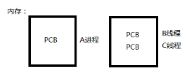
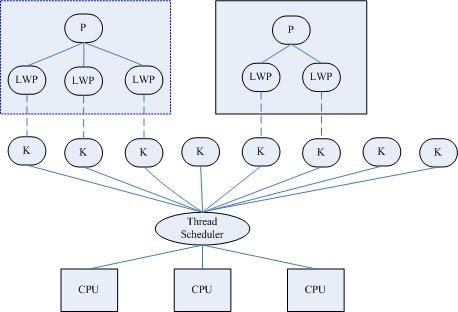

# 线程

---

[TOC]

<!-- toc -->

---

## 线程概念

### 什么是线程

LWP：light weight process 轻量级的进程，本质仍是进程(在Linux环境下) 

进程：独立地址空间，拥有PCB

线程：也有PCB，但没有独立的地址空间(共享)

**区别**：在于是否共享地址空间。 独居(进程)；合租(线程)。

Linux下：

 线程：最小的执行单位

进程：最小分配资源单位，可看成是只有一个线程的进程。



### Linux内核线程实现原理

类Unix系统中，早期是没有“线程”概念的，80年代才引入，借助进程机制实现出了线程的概念。因此在这类系统中，进程和线程关系密切。

1\. 轻量级进程(light-weight process)，也有PCB，创建线程使用的底层函数和进程一样，都是clone

2\. 从内核里看进程和线程是一样的，都有各自不同的PCB，但是PCB中指向内存资源的三级页表是相同的

3\. 进程可以蜕变成线程

4\. 线程可看做寄存器和栈的集合

5\. 在linux下，线程最是小的执行单位；进程是最小的分配资源单位

察看LWP号：`ps -Lf pid` 查看指定线程的lwp号。

```
ps -Lf pid  # 查看指定线程的lwp号
```

{width="4.770833333333333in" height="3.25in"}

三级映射：进程PCB --&gt; 页目录(可看成数组，首地址位于PCB中) --&gt; 页表 --&gt; 物理页面 --&gt; 内存单元

参考：《Linux内核源代码情景分析》 ----毛德操

对于进程来说，相同的地址(同一个虚拟地址)在不同的进程中，反复使用而不冲突。原因是他们虽虚拟址一样，但，页目录、页表、物理页面各不相同。相同的虚拟址，映射到不同的物理页面内存单元，最终访问不同的物理页面。

但！线程不同！两个**线程**具有各自独立的PCB，但**共享**同一个**页目录**，也就共享同一个页表和物理页面。所以两个PCB共享一个地址空间。

实际上，无论是创建进程的fork，还是创建线程的pthread\_create，底层实现都是调用同一个内核函数clone。

如果复制对方的地址空间，那么就产出一个“进程”；如果共享对方的地址空间，就产生一个“线程”。

因此：Linux内核是不区分进程和线程的。只在用户层面上进行区分。所以，线程所有操作函数 pthread\_\* 是库函数，而非系统调用。

### 线程共享资源

- 文件描述符表
- 当前工作目录
- 用户ID和组ID
- 内存地址空间 (.text/.data/.bss/heap/共享库)
- 每种信号的处理方式

### 线程非共享资源

- 线程id
- 处理器现场和栈指针(内核栈)
- 独立的栈空间(用户空间栈)
- errno变量
- 信号屏蔽字
- 调度优先级

### 线程优、缺点

**优点**：

  1. 提高程序并发性 
  2. 开销小 
  3. 数据通信、共享数据方便

**缺点**： 

1. 库函数，不稳定 
2. 调试、编写困难、gdb不支持 
3. 对信号支持不好

优点相对突出，缺点均不是硬伤。Linux下由于实现方法导致进程、线程差别不是很大。

## 线程控制原语

### pthread\_self函数

获取当前线程ID。其作用对应进程中 getpid() 函数。

> pthread\_t pthread\_self(void); 
> 返回值：成功：0； 
> 失败：无！

线程ID：pthread\_t类型，本质：在Linux下为无符号整数(%lu)，其他系统中可能是结构体实现

线程ID是进程内部，识别标志。(两个**进程间**，**线程ID允许相同**)

注意：不应使用全局变量 pthread\_t tid，在子线程中通过pthread\_create传出参数来获取线程ID，而应使用pthread\_self。

### pthread\_create函数

创建一个新线程。 其作用，对应进程中fork() 函数。

> int pthread\_create(pthread\_t \*thread, const pthread\_attr\_t \*attr, void \*(\*start\_routine) (void \*), void \*arg);
> 成功：0； 
> 失败：错误号

Linux环境下，所有线程特点，失败均直接返回错误号。

参数：

pthread\_t：当前Linux中可理解为：typedef unsigned long int pthread\_t;

参数1：**传出**参数，保存系统为我们分配好的线程ID

参数2：通常传NULL，表示使用线程默认属性。若想使用具体属性也可以修改该参数。

参数3：**函数指针**，指向线程主函数(线程体)，该函数运行结束，则线程结束。

参数4：线程主函数执行期间所使用的**函数参数**。

在一个线程中调用pthread\_create()创建新的线程后，当前线程从pthread\_create()返回继续往下执行，而新的线程所执行的代码由我们传给pthread\_create的函数指针start\_routine决定。start\_routine函数接收一个参数，是通过pthread\_create的arg参数传递给它的，该参数的类型为void \*，这个指针按什么类型解释由调用者自己定义。start\_routine的返回值类型也是void \*，这个指针的含义同样由调用者自己定义。start\_routine返回时，这个线程就退出了，其它线程可以调用pthread\_join得到start\_routine的返回值，类似于父进程调用wait(2)得到子进程的退出状态，稍后详细介绍pthread\_join。

pthread\_create成功返回后，新创建的线程的id被填写到thread参数所指向的内存单元。我们知道进程id的类型是pid\_t，每个进程的id在整个系统中是唯一的，调用getpid(2)可以获得当前进程的id，是一个正整数值。线程id的类型是thread\_t，它只在当前进程中保证是唯一的，在不同的系统中thread\_t这个类型有不同的实现，它可能是一个整数值，也可能是一个结构体，也可能是一个地址，所以不能简单地当成整数用printf打印，调用pthread\_self(3)可以获得当前线程的id。

attr参数表示线程属性，本节不深入讨论线程属性，所有代码例子都传NULL给attr参数，表示线程属性取缺省值，感兴趣的读者可以参考APUE。

【练习】：创建一个新线程，打印线程ID。注意：链接线程库 -lpthread 【pthread_create.c】

由于pthread\_create的错误码不保存在errno中，因此不能直接用perror(3)打印错误信息，可以先用strerror(3)把错误码转换成错误信息再打印。如果任意一个线程调用了**exit**，则整个**进程**的所有线程都**终止**，由于从main函数return也相当于调用exit，为了防止新创建的线程还没有得到执行就终止，我们在main函数return之前延时1秒，这只是一种权宜之计，即使主线程等待1秒，内核也不一定会调度新创建的线程执行，下一节我们会看到更好的办法。

【练习】：循环创建多个线程，每个线程打印自己是第几个被创建的线程。(类似于进程循环创建子进程) 【for-pthread_create.c】

拓展思考：将pthread\_create函数参4修改为(void \*)&i, 将线程主函数内改为 i=\*((int \*)arg) 是否可以？

#### 线程与共享

**线程间共享全局变量**

【牢记】：线程默认共享数据段、代码段等地址空间，常用的是全局变量。而进程不共享全局变量，只能借助mmap。

【练习】：设计程序，验证线程之间共享全局数据。 【glb\_var\_pthrd.c】

### pthread\_exit函数

将单个线程退出

> void pthread\_exit(void \*retval);

参数：retval表示线程退出状态，通常传NULL

思考：使用exit将指定线程退出，可以吗？ 【pthrd\_exit.c】

结论：线程中，禁止使用**exit**函数，会导致进程内**所有线程**全部**退出**。

在不添加sleep控制输出顺序的情况下。pthread\_create在循环中，几乎瞬间创建5个线程，但只有第1个线程有机会输出（或者第2个也有，也可能没有，取决于内核调度）如果第3个线程执行了exit，将整个进程退出了，所以全部线程退出了。

所以，多线程环境中，应尽量少用，或者不使用exit函数，取而代之使用pthread\_exit函数，将单个线程退出。任何线程里exit导致进程退出，其他线程未工作结束，主控线程退出时不能return或exit。

另注意，pthread\_exit或者return返回的指针所指向的内存单元必须是全局的或者是用malloc分配的，不能在线程函数的栈上分配，因为当其它线程得到这个返回指针时线程函数已经退出了。

【练习】：编写多线程程序，总结exit、return、pthread\_exit各自退出效果。

return：返回到调用者那里去。

pthread\_exit()：将调用该函数的线程

exit: 将进程退出。

### pthread\_join函数

阻塞等待线程退出，获取线程退出状态 其作用，对应进程中 waitpid() 函数。

> int pthread\_join(pthread\_t thread, void \*\*retval); 
> 成功：0；
> 失败：错误号

参数：

thread：线程ID （【注意】：不是指针）；
retval：存储线程结束状态。

对比记忆：

进程中：main返回值、exit参数--&gt;int；等待子进程结束 wait 函数参数--&gt;int \*

线程中：线程主函数返回值、pthread\_exit--&gt;void \*；等待线程结束 pthread\_join 函数参数--&gt;void \*\*

【练习】：参数 retval 非空用法。 【pthread_join.c】

调用该函数的线程将挂起等待，直到id为thread的线程终止。thread线程以不同的方法终止，通过pthread\_join得到的终止状态是不同的，总结如下：

1.  如果thread线程通过**return**返回，retval所指向的单元里存放的是thread线程函数的返回值。

2.  如果thread线程被别的线程调用**pthread\_cancel**异常终止掉，retval所指向的单元里存放的是常数PTHREAD\_CANCELED。

3.  如果thread线程是自己调用**pthread\_exit**终止的，retval所指向的单元存放的是传给pthread\_exit的参数。

4.  如果对thread线程的终止状态不感兴趣，可以传NULL给retval参数。

【练习】：使用pthread\_join函数将循环创建的多个子线程回收。 【pthread_join-for.c】

### pthread\_detach函数

实现线程分离

> int pthread\_detach(pthread\_t thread); 
> 成功：0；
> 失败：错误号

线程**分离**状态：指定该状态，线程主动与主控线程断开关系。线程结束后，其退出状态不由其他线程获取，而直接自己**自动释放**。网络、多线程服务器常用。

进程若有该机制，将不会产生僵尸进程。僵尸进程的产生主要由于进程死后，大部分资源被释放，一点残留资源仍存于系统中，导致内核认为该进程仍存在。

也可使用 pthread\_create函数参2(线程属性)来设置线程分离。

【练习】：使用pthread\_detach函数实现线程分离 【pthrd\_detach.c】

一般情况下，线程终止后，其终止状态一直保留到其它线程调用pthread\_join获取它的状态为止。但是线程也可以被置为**detach**状态，这样的线程一旦终止就立刻**自动回收**它占用的所有资源，而不保留终止状态。不能对一个已经处于detach状态的线程调用pthread\_join，这样的调用将返回EINVAL错误。也就是说，如果已经对一个线程调用了pthread\_detach就不能再调用pthread\_join了。

### pthread\_cancel函数

杀死(取消)线程 其作用，对应进程中 kill() 函数。

> int pthread\_cancel(pthread\_t thread); 
> 成功：0；
> 失败：错误号

【注意】：线程的取消并不是实时的，而有一定的延时。需要等待线程到达某个**取消点**(检查点)。

类似于玩游戏存档，必须到达指定的场所(存档点，如：客栈、仓库、城里等)才能存储进度。杀死线程也不是立刻就能完成，必须要到达取消点。

取消点：是线程检查是否被取消，并按请求进行动作的一个位置。通常是一些系统调用creat，open，pause，close，read，write..... 执行命令`man 7 pthreads`可以查看具备这些取消点的系统调用列表。也可参阅 APUE.12.7 取消选项小节。

可粗略认为一个系统调用(进入内核)即为一个取消点。如线程中没有取消点，可以通过调用`pthread_testcancel()`函数自行设置一个取消点。

被取消的线程， 退出值定义在Linux的pthread库中。常数PTHREAD\_CANCELED的值是-1。可在头文件pthread.h中找到它的定义：\#define PTHREAD\_CANCELED ((void \*) -1)。因此当我们对一个已经**被取消**的线程使用pthread\_join回收时，得到的**返回值为-1**。

【练习】：终止线程的三种方法。注意“取消点”的概念。 【pthrd\_endof3.c】

#### 终止线程方式

总结：终止某个线程而不终止整个进程，有三种方法：

1.  从线程主函数return。这种方法对主控线程不适用，从main函数return相当于调用exit。

2.  一个线程可以调用pthread\_cancel终止同一进程中的另一个线程。

3.  线程可以调用pthread\_exit终止自己。

### pthread\_equal函数

比较两个线程ID是否相等。

> int pthread\_equal(pthread\_t t1, pthread\_t t2);
>

有可能Linux在未来线程ID pthread\_t 类型被修改为结构体实现。

### 控制原语对比

> 进程 		线程
> fork 		pthread\_create
> exit 		pthread\_exit
> wait 		pthread\_join
> kill 		pthread\_cancel
> getpid 	pthread\_self 

## 线程属性

本节作为指引性介绍，linux下线程的属性是可以根据实际项目需要，进行设置，之前我们讨论的线程都是采用线程的默认属性，默认属性已经可以解决绝大多数开发时遇到的问题。如我们对程序的性能提出更高的要求那么需要设置线程属性，比如可以通过设置线程栈的大小来降低内存的使用，增加最大线程个数。

> typedef struct{
> int etachstate; //线程的分离状态
> int schedpolicy; //线程调度策略
> struct sched\_param schedparam; //线程的调度参数
> int inheritsched; //线程的继承性
> int scope; //线程的作用域
> size\_t guardsize; //线程栈末尾的警戒缓冲区大小
> int stackaddr\_set; //线程的栈设置
> void\* stackaddr; //线程栈的位置
> size\_t stacksize; //线程栈的大小
> } pthread\_attr\_t;

主要结构体成员：

1\. 线程分离状态

2\. 线程栈大小（默认平均分配）

3\. 线程栈警戒缓冲区大小（位于栈末尾） 参 APUE.12.3 线程属性

属性值不能直接设置，须使用相关函数进行操作，初始化的函数为`pthread_attr_init`，这个函数必须在pthread\_create函数之前调用。之后须用`pthread_attr_destroy`函数来释放资源。

线程属性主要包括如下属性：作用域（scope）、栈尺寸（stack size）、栈地址（stack address）、优先级（priority）、分离的状态（detached state）、调度策略和参数（scheduling policy and parameters）。默认的属性为非绑定、非分离、缺省的堆栈、与父进程同样级别的优先级。

### 线程属性初始化

注意：应先初始化线程属性，再pthread\_create创建线程

pthread\_attr\_init初始化线程属性

> int pthread\_attr\_init(pthread\_attr\_t \*attr); 
> 成功：0；
> 失败：错误号

pthread\_attr\_destroy销毁线程属性所占用的资源

> int pthread\_attr\_destroy(pthread\_attr\_t \*attr); 
> 成功：0；
> 失败：错误号

### 线程的分离状态

线程的分离状态决定一个线程以什么样的方式来终止自己。

非分离状态：线程的默认属性是非分离状态，这种情况下，原有的线程等待创建的线程结束。只有当pthread\_join()函数返回时，创建的线程才算终止，才能释放自己占用的系统资源。

分离状态：分离线程没有被其他的线程所等待，自己运行结束了，线程也就终止了，马上释放系统资源。应该根据自己的需要，选择适当的分离状态。

线程分离状态的函数：

pthread\_attr\_setdetachstate设置线程属性，分离or非分离

> int pthread\_attr\_setdetachstate(pthread\_attr\_t \*attr, int detachstate);

pthread\_attr\_getdetachstate获取线程属性，分离or非分离

> int pthread\_attr\_getdetachstate(pthread\_attr\_t \*attr, int \*detachstate);
>

参数： 

attr：已初始化的线程属性
detachstate： PTHREAD\_CREATE\_DETACHED（分离线程）
PTHREAD \_CREATE\_JOINABLE（非分离线程）

这里要注意的一点是，如果设置一个线程为分离线程，而这个线程运行又非常快，它很可能在pthread\_create函数返回之前就终止了，它终止以后就可能将线程号和系统资源移交给其他的线程使用，这样调用pthread\_create的线程就得到了错误的线程号。要避免这种情况可以采取一定的同步措施，最简单的方法之一是可以在被创建的线程里调用`pthread_cond_timedwait`函数，让这个线程等待一会儿，留出足够的时间让函数pthread\_create返回。设置一段等待时间，是在多线程编程里常用的方法。但是注意不要使用诸如wait()之类的函数，它们是使整个进程睡眠，并不能解决线程同步的问题。

### 线程的栈地址

POSIX.1定义了两个常量\_POSIX\_THREAD\_ATTR\_STACKADDR 和\_POSIX\_THREAD\_ATTR\_STACKSIZE检测系统是否支持栈属性。也可以给sysconf函数传递\_SC\_THREAD\_ATTR\_STACKADDR或 \_SC\_THREAD\_ATTR\_STACKSIZE来进行检测。

当进程栈地址空间不够用时，指定新建线程使用由malloc分配的空间作为自己的栈空间。通过pthread\_attr\_setstack和pthread\_attr\_getstack两个函数分别设置和获取线程的栈地址。

设置线程的栈地址

> int pthread\_attr\_setstack(pthread\_attr\_t \*attr, void \*stackaddr, size\_t stacksize); 
> 成功：0；
> 失败：错误号

获取线程的栈地址

> int pthread\_attr\_getstack(pthread\_attr\_t \*attr, void \*\*stackaddr, size\_t \*stacksize); 
> 成功：0；
> 失败：错误号

参数： 

attr：指向一个线程属性的指针
stackaddr：返回获取的栈地址
stacksize：返回获取的栈大小

### 线程的栈大小

当系统中有很多线程时，可能需要减小每个线程栈的默认大小，防止进程的地址空间不够用，当线程调用的函数会分配很大的局部变量或者函数调用层次很深时，可能需要增大线程栈的默认大小。

函数pthread\_attr\_getstacksize和 pthread\_attr\_setstacksize提供设置。

> int pthread\_attr\_setstacksize(pthread\_attr\_t \*attr, size\_t stacksize); 
> 成功：0；
> 失败：错误号

> int pthread\_attr\_getstacksize(pthread\_attr\_t \*attr, size\_t \*stacksize); 
> 成功：0；
> 失败：错误号

参数： 

attr：指向一个线程属性的指针
stacksize：返回线程的堆栈大小

### 线程属性控制示例

【pthrd\_attr\_change.c】

NPTL??

线程库版本

1.察看当前pthread库版本getconf GNU\_LIBPTHREAD\_VERSION

2.NPTL实现机制(POSIX)，Native POSIX Thread Library

3.使用线程库时gcc指定 –lpthread

## 线程使用注意事项

1.  **主线程退出其他线程不退出**，主线程应调用**pthread\_exit**
2.  避免僵尸线程方法,回收线程
    pthread\_join
    pthread\_detach
    pthread\_create指定分离属性
    被join线程可能在join函数返回前就释放完自己的所有内存资源，所以不应当返回被回收线程栈中的值;
3.  malloc和mmap申请的内存可以被其他线程释放
4.  应**避免**在**多线程**模型中调用**fork**除非，马上exec，子进程中只有调用fork的线程存在，其他线程在子进程中均pthread\_exit
5.  信号的复杂语义很难和多线程共存，应**避免**在**多线程**引入**信号**机制


