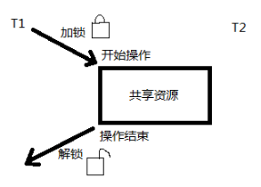

# 线程同步

---

[TOC]

<!-- toc -->

---

## 同步概念

所谓同步，即同时起步，协调一致。不同的对象，对“同步”的理解方式略有不同。如，设备同步，是指在两个设备之间规定一个共同的时间参考；数据库同步，是指让两个或多个数据库内容保持一致，或者按需要部分保持一致；文件同步，是指让两个或多个文件夹里的文件保持一致。等等

然而，编程中、通信中所说的同步与生活中大家印象中的同步概念略有差异。“同”字应是指协同、协助、互相配合。主旨在协同步调，按预定的先后次序运行。

### 线程同步

**同步**即协同步调，**按预定的先后次序运行**。

**线程同步**，指一个**线程**发出某一功能**调用**时，在**没有**得到**结果**之前，该调用不返回。**同时**其它**线程**为保证数据一致性，**不能调用**该功能。

举例1： 银行存款 5000。柜台，折：取3000；提款机，卡：取 3000。剩余：2000

举例2： 内存中100字节，线程T1欲填入全1， 线程T2欲填入全0。但如果T1执行了50个字节失去cpu，T2执行，会将T1写过的内容覆盖。当T1再次获得cpu继续 从失去cpu的位置向后写入1，当执行结束，内存中的100字节，既不是全1，也不是全0。

产生的现象叫做“与时间有关的错误”(time related)。为了避免这种数据混乱，线程需要同步。

“同步”的目的，是为了避免数据混乱，解决与时间有关的错误。实际上，不仅线程间需要同步，进程间、信号间等等都需要同步机制。

因此，**所有“多个控制流，共同操作一个共享资源”的情况，都需要同步。**

### 数据混乱原因：

1\. 资源共享（独享资源则不会）

2\. 调度随机（意味着数据访问会出现竞争）

3\. 线程间缺乏必要的同步机制。

以上3点中，前两点不能改变，欲提高效率，传递数据，资源必须共享。只要共享资源，就一定会出现竞争。只要存在竞争关系，数据就很容易出现混乱。

所以只能从第三点着手解决。使多个线程在访问共享资源的时候，出现互斥。

## 互斥量mutex 

Linux中提供一把互斥锁mutex（也称之为互斥量）。

每个线程在对资源操作前都尝试先加锁，成功加锁才能操作，操作结束解锁。

资源还是共享的，线程间也还是竞争的，

但通过“锁”就将资源的访问变成互斥操作，而后与时间有关的错误也不会再产生了。

{width="2.9819444444444443in" height="2.1363003062117234in"}

但，应注意：同一时刻，只能有一个线程持有该锁。

当A线程对某个全局变量加锁访问，B在访问前尝试加锁，拿不到锁，B阻塞。C线程**不去加锁**，而**直接访问**该全局变量，**依然能够访问**，但会出现数据混乱。

所以，**互斥锁**实质上是操作系统提供的一把“**建议锁**”（又称“协同锁”），建议程序中有多线程访问共享资源的时候使用该机制。但，并没有强制限定。

因此，即使有了mutex，如果有线程不按规则来访问数据，依然会造成数据混乱。

### 互斥锁状态：

一把读写锁具备**两种状态**：

1. 加锁状态(加锁)
2. 解锁状态(解锁)

### 主要应用函数：

> pthread\_mutex\_init 初始化函数
>
> pthread\_mutex\_destroy函数
>
> pthread\_mutex\_lock函数
>
> pthread\_mutex\_trylock函数
>
> pthread\_mutex\_unlock函数
>

以上5个函数的返回值都是：成功返回0， 失败返回错误号。

pthread\_mutex\_t 类型，其本质是一个结构体。为简化理解，应用时可忽略其实现细节，简单当成整数看待。

pthread\_mutex\_t mutex;  变量mutex只有两种取值**1、0**。

#### pthread\_mutex\_init函数

初始化一个互斥锁(互斥量) ---&gt; **初值**可看作**1**

> int pthread\_mutex\_init(pthread\_mutex\_t \*restrict mutex, const pthread\_mutexattr\_t \*restrict attr);
>

参1：传出参数，调用时应传 &mutex

**restrict关键字**：只用于限制指针，告诉编译器，所有修改该指针指向内存中内容的操作，只能通过本指针完成。不能通过除本指针以外的其他变量或指针修改。

参2：互斥量属性。是一个传入参数，通常传NULL，选用默认属性(线程间共享)。 参APUE.12.4同步属性

初始化方式:

1. 静态初始化：如果互斥锁 mutex 是静态分配的（定义在全局，或加了static关键字修饰），可以直接使用宏进行初始化。

   > pthead\_mutex\_t muetx = PTHREAD\_MUTEX\_INITIALIZER;

2. 动态初始化：局部变量应采用动态初始化。

   > pthread\_mutex\_init(&mutex, NULL)

#### pthread\_mutex\_destroy函数

销毁一个互斥锁

> int pthread\_mutex\_destroy(pthread\_mutex\_t \*mutex);
>

#### pthread\_mutex\_lock函数

加锁。可理解为将mutex--（或mutex-1）

> int pthread\_mutex\_lock(pthread\_mutex\_t \*mutex);
>

#### pthread\_mutex\_unlock函数

解锁。可理解为将mutex ++（或mutex+1）

> int pthread\_mutex\_unlock(pthread\_mutex\_t \*mutex);
>

#### pthread\_mutex\_trylock函数

尝试加锁

> int pthread\_mutex\_trylock(pthread\_mutex\_t \*mutex);
>

### 加锁与解锁

#### lock与unlock：

lock加锁，如果加锁不成功，线程**阻塞**，阻塞到持有该互斥量的其他线程解锁为止。

unlock主动解锁函数，**同时将阻塞在该锁上的所有线程全部唤醒**，至于哪个线程先被唤醒，取决于优先级、调度。默认：先阻塞、先唤醒。

例如：T1 T2 T3 T4 使用一把mutex锁。T1加锁成功，其他线程均阻塞，直至T1解锁。T1解锁后，T2 T3 T4均被唤醒，并自动再次尝试加锁。

可假想mutex锁 init成功初值为1。 lock 功能是将mutex--。 unlock将mutex++

#### lock与trylock：

lock加锁，如果加锁不成功，线程**阻塞**，等待锁释放。

trylock尝试加锁,如果加锁不成功,失败了直接返回错误号（如：EBUSY），**不阻塞**。

### 加锁步骤测试：

【mutex.c】该程序是非常典型的，由于共享、竞争而没有加任何同步机制，导致产生于时间有关的错误，造成数据混乱：

【练习】：修改该程序，使用mutex互斥锁进行同步。

1.  定义全局互斥量，初始化init(&m, NULL)互斥量，添加对应的destry

2.  两个线程while中，两次printf前后，分别加lock和unlock

3.  将unlock挪至第二个sleep后，发现交替现象很难出现。

线程在操作完共享资源后本应该立即解锁，但修改后，线程抱着锁睡眠。睡醒解锁后又立即加锁，这两个库函数本身不会阻塞。所以在这两行代码之间失去cpu的概率很小。因此，另外一个线程很难得到加锁的机会。

1.  main 中加flag = 5 将flg在while中-- 这时，主线程输出5次后试图销毁锁，但子线程未将锁释放，无法完成。

2.  main 中加pthread\_cancel()将子线程取消。 【pthread\_mutex.c】

**结论：**

在访问共享资源前加锁，**访问结束后立即解锁**。**锁的“粒度”应越小越好**。

## 死锁

### 自锁

线程试图对同一个互斥量A加锁两次。

### 互锁

线程1拥有A锁，请求获得B锁；线程2拥有B锁，请求获得A锁

### 避免死锁的方法：

1. 当得不到所有所需资源时，放弃已经获得的资源，等待。

2. 保证资源的获取顺序一致，要求每个线程获取资源的顺序一致。如：A获取顺序1、2、3；B顺序应也是1、2、3。若B为3、2、1则易出现死锁现象。

【deadlock.c】：编写程序，实现上述两种死锁现象。

## 读写锁

与互斥量类似，但读写锁允许**更高的并行性**。其特性为：**读共享，写独占**，写锁优先级高。

### 读写锁状态：

一把读写锁具备**三种状态**：

1\. 读模式下加锁状态 (**读锁**)

2\. 写模式下加锁状态 (**写锁**)

3\. 不加锁状态(解锁)

### 读写锁特性：

1.  读写锁是“写模式加锁”(**写锁**)状态时， 解锁前，所有对该锁加锁的线程**都**会被**阻塞**。

2.  读写锁是“读模式加锁”(**读锁**)状态时， 如果线程以读模式对其加锁(**加读锁**)会**成功**；如果线程以写模式加锁(**加写锁**)会**阻塞**。

3.  读写锁是“读模式加锁”(**读锁**)状态时， **既**有试图以写模式加锁的线程，**又**有试图以读模式加锁的线程。那么读写锁会阻塞随后的读模式锁请求。优先满足写模式锁。**读锁、写锁并行阻塞，写锁优先级高**。

**读写锁**也叫**共享-独占锁**。当读写锁以读模式锁住时，它是以共享模式锁住的；当它以写模式锁住时，它是以独占模式锁住的。**写独占、读共享。**

读写锁非常适合于对数据结构**读的次数远大于写**的情况。

### 主要应用函数：

> pthread\_rwlock\_init函数
>
> pthread\_rwlock\_destroy函数
>
> pthread\_rwlock\_rdlock函数
>
> pthread\_rwlock\_wrlock函数
>
> pthread\_rwlock\_tryrdlock函数
>
> pthread\_rwlock\_trywrlock函数
>
> pthread\_rwlock\_unlock函数
>

以上7 个函数的返回值都是：成功返回0， 失败直接返回错误号。

pthread\_rwlock\_t类型 用于定义一个读写锁变量。

pthread\_rwlock\_t rwlock;

#### pthread\_rwlock\_init函数

初始化一把读写锁

> int pthread\_rwlock\_init(pthread\_rwlock\_t \*restrict rwlock, const pthread\_rwlockattr\_t \*restrict attr);
>

参2：attr表读写锁属性，通常使用默认属性，传NULL即可。

#### pthread\_rwlock\_destroy函数

销毁一把读写锁

> int pthread\_rwlock\_destroy(pthread\_rwlock\_t \*rwlock);
>

#### pthread\_rwlock\_rdlock函数

以读方式请求读写锁。（常简称为：请求读锁）

> int pthread\_rwlock\_rdlock(pthread\_rwlock\_t \*rwlock);
>

#### pthread\_rwlock\_wrlock函数

以写方式请求读写锁。（常简称为：请求写锁）

> int pthread\_rwlock\_wrlock(pthread\_rwlock\_t \*rwlock);
>

#### pthread\_rwlock\_unlock函数

解锁读写锁

> int pthread\_rwlock\_unlock(pthread\_rwlock\_t \*rwlock);
>

#### pthread\_rwlock\_tryrdlock函数

非阻塞以读方式请求读写锁（非阻塞请求读锁）

> int pthread\_rwlock\_tryrdlock(pthread\_rwlock\_t \*rwlock);
>

#### pthread\_rwlock\_trywrlock函数

非阻塞以写方式请求读写锁（非阻塞请求写锁）

> int pthread\_rwlock\_trywrlock(pthread\_rwlock\_t \*rwlock);
>

### 读写锁示例

看如下示例，同时有多个线程对同一全局数据读、写操作。【rwlock.c】

## 条件变量

**条件变量**本身**不是锁**！但它也**可**以造成线程**阻塞**。通常**与互斥锁配合**使用。给多线程提供一个会合的场所。

### 主要应用函数：

> pthread\_cond\_init函数
>
> pthread\_cond\_destroy函数
>
> pthread\_cond\_wait函数
>
> pthread\_cond\_timedwait函数
>
> pthread\_cond\_signal函数
>
> pthread\_cond\_broadcast函数
>

以上6 个函数的返回值都是：成功返回0， 失败直接返回错误号。

pthread\_cond\_t类型 用于定义条件变量

pthread\_cond\_t cond;

#### pthread\_cond\_init函数

初始化一个条件变量

> int pthread\_cond\_init(pthread\_cond\_t \*restrict cond, const pthread\_condattr\_t \*restrict attr);
>

参2：attr表条件变量属性，通常为默认值，传NULL即可

也可以使用静态初始化的方法，初始化条件变量：

> pthread\_cond\_t cond = PTHREAD\_COND\_INITIALIZER;

#### pthread\_cond\_destroy函数

销毁一个条件变量

> int pthread\_cond\_destroy(pthread\_cond\_t \*cond);
>

#### pthread\_cond\_wait函数

阻塞等待一个条件变量

> int pthread\_cond\_wait(pthread\_cond\_t \*restrict cond, pthread\_mutex\_t \*restrict mutex);
>

函数作用：

1. **阻塞等待** **条件变量信号**cond（参1）满足
2. 并且暂时**释放**已掌握的**互斥锁**（解锁互斥量）相当于pthread\_mutex\_unlock(&mutex);

1.2.两步为一个原子操作。

1. 当被条件变量信号**唤醒**，pthread\_cond\_wait函数返回时，**解除阻塞**并重新申请**获取** **互斥锁**pthread\_mutex\_lock(&mutex);

#### pthread\_cond\_timedwait函数

限时等待一个条件变量

> int pthread\_cond\_timedwait(pthread\_cond\_t \*restrict cond, pthread\_mutex\_t \*restrict mutex, const struct timespec \*restrict abstime);
>

参3： 参看man sem\_timedwait函数，查看struct timespec结构体。

> struct timespec {
> time\_t tv\_sec; /\* seconds \*/ 秒
> long tv\_nsec; /\* nanosecondes\*/ 纳秒
> }
>

形参abstime：绝对时间。

如：time(NULL)返回的就是绝对时间。而alarm(1)是相对时间，相对当前时间定时1秒钟。

> struct timespec t = {1, 0};
> pthread\_cond\_timedwait (&cond, &mutex, &t); 只能定时到 1970年1月1日 00:00:01秒(早已经过去)
>

正确用法：

> time\_t cur = time(NULL);  // 获取当前绝对时间。
> struct timespec t;  // 定义timespec 结构体变量t
> t.tv\_sec = cur+1;  // 定时1秒
> pthread\_cond\_timedwait (&cond, &mutex, &t);  // 传参 参APUE.11.6线程同步条件变量小节

在讲解setitimer函数时我们还提到另外一种时间类型：

> struct timeval {
> time\_t tv\_sec; /\* seconds \*/ 秒
> suseconds\_t tv\_usec; /\* microseconds \*/ 微秒
> };

#### pthread\_cond\_signal函数

唤醒至少一个阻塞在条件变量上的线程

> int pthread\_cond\_signal(pthread\_cond\_t \*cond);
>

#### pthread\_cond\_broadcast函数

**唤醒全部**阻塞在条件变量上的线程

> int pthread\_cond\_broadcast(pthread\_cond\_t \*cond);
>

### 生产者消费者条件变量模型

线程同步典型的案例即为生产者消费者模型，而借助条件变量来实现这一模型，是比较常见的一种方法。假定有两个线程，一个模拟生产者行为，一个模拟消费者行为。两个线程同时操作一个共享资源（一般称之为汇聚），生产向其中添加产品，消费者从中消费掉产品。

看如下示例，使用条件变量模拟生产者、消费者问题：【conditionVar\_product\_consumer.c】

### 条件变量的优点

相较于mutex而言，条件变量可以**减少竞争**。

如直接使用mutex，除了生产者、消费者之间要竞争互斥量以外，消费者之间也需要竞争互斥量，但如果汇聚（链表）中没有数据，消费者之间竞争互斥锁是无意义的。有了条件变量机制以后，只有生产者完成生产，才会引起消费者之间的竞争。提高了程序效率。

## 信号量

进化版的互斥锁（1 --&gt; N）

由于互斥锁的粒度比较大，如果我们希望在多个线程间对某一对象的部分数据进行共享，使用互斥锁是没有办法实现的，只能将整个数据对象锁住。这样虽然达到了多线程操作共享数据时保证数据正确性的目的，却无形中导致线程的并发性下降。线程从并行执行，变成了串行执行。与直接使用单进程无异。

信号量，是相对折中的一种处理方式，既能保证**同步**，数据不混乱，又能提高线程**并发**。

### 主要应用函数：

> sem\_init函数
>
> sem\_destroy函数
>
> sem\_wait函数
>
> sem\_trywait函数
>
> sem\_timedwait函数
>
> sem\_post函数
>

以上6 个函数的返回值都是：成功返回0， 失败返回-1，同时设置errno。(注意，它们没有pthread前缀)

sem\_t类型，本质仍是结构体。但应用期间可简单看作为整数，忽略实现细节（类似于使用文件描述符）。

sem\_t sem; 规定信号量sem不能 &lt; 0。头文件 &lt;semaphore.h&gt;

#### 信号量基本操作：

sem\_wait: 将信号量--

1. 信号量大于0，则信号量-- （类比pthread\_mutex\_lock）

2. 信号量**等于0**，造成线程**阻塞**

sem\_post： 将信号量++，同时**唤醒**阻塞在信号量上的线程 （类比pthread\_mutex\_unlock）。
但，由于sem\_t的实现对用户隐藏，所以所谓的++、--操作只能通过函数来实现，而不能直接++、--符号。

**信号量的初值，决定了占用信号量的线程的个数。**

#### sem\_init函数

初始化一个信号量

> int sem\_init(sem\_t \*sem, int pshared, unsigned int value);
>

参1：sem信号量
参2：pshared取0用于**线程间**；取非0（一般为1）用于**进程间**
参3：value指定**信号量初值**,当信号量初值为1，信号量相当于互斥锁

**信号量的初值，决定了占用信号量的线程的个数。**

#### sem\_destroy函数

销毁一个信号量

> int sem\_destroy(sem\_t \*sem);
>

#### sem\_wait函数

给信号量加锁 --

> int sem\_wait(sem\_t \*sem);
>

#### sem\_post函数

给信号量解锁 ++

> int sem\_post(sem\_t \*sem);
>

#### sem\_trywait函数

尝试对信号量加锁 -- (与sem\_wait的区别类比lock和trylock)

> int sem\_trywait(sem\_t \*sem);
>

#### sem\_timedwait函数

限时尝试对信号量加锁 --

> int sem\_timedwait(sem\_t \*sem, const struct timespec \*abs\_timeout);
>

参2：abs\_timeout采用的是绝对时间。

定时1秒：

> time\_t cur = time(NULL); 获取当前时间。
> struct timespec t; 定义timespec 结构体变量t
> t.tv\_sec = cur+1; 定时1秒
> t.tv\_nsec = t.tv\_sec +100;
> sem\_timedwait(&sem, &t); 传参

### 生产者消费者信号量模型

[五个同步问题的经典模型之一：生产者/消费者问题](<https://www.jianshu.com/p/b16296e9ac85>)

【练习】：使用信号量完成线程间同步，模拟生产者，消费者问题。 【sem\_product\_consumer.c】

分析：

规定： 如果□中有数据，生产者不能生产，只能阻塞。

如果□中没有数据，消费者不能消费，只能等待数据。

定义两个信号量：S满 = 0， S空 = 1 （S满代表满格的信号量，S空表示空格的信号量，程序起始，格子一定为空）

所以有： 

T生产者主函数{					 T消费者主函数 {
sem\_wait(S空); 					sem\_wait(S满);
生产....							 消费....
sem\_post(S满);					 sem\_post(S空);
} 								}

假设： 线程到达的顺序是:T生、T生、T消。

那么： T生1 到达，将S空-1，生产，将S满+1

T生2 到达，S空已经为0， 阻塞

T消 到达，将S满-1，消费，将S空+1

三个线程到达的顺序是：T生1、T生2、T消。而执行的顺序是T生1、T消、T生2

这里，S空 表示空格子的总数，代表可占用信号量的线程总数--&gt;1。其实这样的话，信号量就等同于互斥锁。

但，如果S空=2、3、4……就不一样了，该信号量同时可以由多个线程占用，不再是互斥的形式。因此我们说信号量是互斥锁的加强版。

【推演练习】： 理解上述模型，推演，如果是两个消费者，一个生产者，是怎么样的情况。

【作业】：结合生产者消费者信号量模型，揣摩sem\_timedwait函数作用。编程实现，一个线程读用户输入， 另一个线程打印“hello world”。如果用户无输入，则每隔5秒向屏幕打印一个“hello world”；如果用户有输入，立刻打印“hello world”到屏幕。

## 进程间同步

### 互斥量mutex

进程间也可以使用互斥锁，来达到同步的目的。但应在pthread\_mutex\_init初始化之前，修改其**属性**为进程间共享。mutex的属性修改函数主要有以下几个。

#### 修改属性主要应用函数：

mutex锁的属性类型

> pthread\_mutexattr\_t mattr 类型： 用于定义mutex锁的属性

初始化一个mutex属性对象

> int pthread\_mutexattr\_init(pthread\_mutexattr\_t \*attr);
>

销毁mutex属性对象 (而非销毁锁)

> int pthread\_mutexattr\_destroy(pthread\_mutexattr\_t \*attr);
>

修改mutex属性

> int pthread\_mutexattr\_setpshared(pthread\_mutexattr\_t \*attr, int pshared);
>

参2：pshared取值：

线程锁：PTHREAD\_PROCESS\_PRIVATE (mutex的**默认**属性即为线程锁，进程间私有)

**进程锁**：PTHREAD\_PROCESS\_SHARED (进程间公有)

#### 进程间mutex示例

进程间使用mutex来实现同步：【process\_mutex.c】

### 信号量

#### sem\_init函数

初始化一个信号量

> int sem\_init(sem\_t \*sem, int pshared, unsigned int value);

参1：sem信号量
参2：pshared取0用于**线程间**；取非0（一般为1）用于**进程间**
参3：value指定**信号量初值**

### 文件锁

借助`fcntl函数`设置文件访问控制**属性**来实现进程**锁**机制。 操作文件的进程**没有获得锁**时，**可以打开**，但**无法**执行**read、write操作**。

fcntl函数： 获取、设置文件访问控制属性。

> int fcntl(int fd, int cmd, ... /\* arg \*/ );

参2：

F\_SETLK (struct flock \*) 设置文件锁（等效trylock）
F\_SETLKW (struct flock \*) **设置文件锁**（等效lock）W --&gt; wait
F\_GETLK (struct flock \*) **获取文件锁**

参3：

struct flock {
...
short l\_type; 锁的类型：F\_RDLCK 、F\_WRLCK 、F\_UNLCK
short l\_whence; 偏移位置：SEEK\_SET、SEEK\_CUR、SEEK\_END
off\_t l\_start; 起始偏移：1000
off\_t l\_len; 长度：0表示整个文件加锁
pid\_t l\_pid; 持有该锁的进程ID：(F\_GETLK only)
...
};

#### 进程间文件锁示例

多个进程对加锁文件进行访问：【file\_lock.c】

依然遵循“读共享、写独占”特性。但！同样，如若**进程不加锁直接操作文件，依然可访问成功**，但数据势必会出现混乱。

【思考】：多线程中，可以使用文件锁吗？

多线程间共享文件描述符，而给文件加锁，是通过修改文件描述符所指向的文件结构体中的成员变量来实现的。因此，多线程中无法使用文件锁。

多线程中无法使用文件锁，因为各线程之间共享文件描述符（通过文件描述符结构体值加锁）

## 生产者消费者模型

#### 单生产者和单消费者

#### 多生产者多消费者

## 哲学家用餐模型

### 多线程版

选用互斥锁mutex，如创建5个， pthread\_mutex\_t m\[5\];

模型抽象：

5个哲学家 --&gt; **5个线程**； 5支筷子 --&gt; **5把互斥锁** int left(左手)， right(右手)

5个哲学家使用相同的逻辑，可通用一个线程主函数，void \*tfn(void \*arg)，使用参数来表示线程编号：int i = (int)arg;

哲学家线程根据编号知道自己是第几个哲学家，而后选定锁，锁住，吃饭。否则哲学家thinking。

A B C D E

5支筷子，在逻辑上形成环： 0 1 2 3 4 分别对应5个哲学家：

{width="6.2956528871391075in" height="1.5463123359580053in"}

所以有：

if(i == 4)
left = i, right = 0;
else
left = i, right = i+1;

振荡：如果每个人都攥着自己左手的锁，尝试去拿右手锁，拿不到则将锁释放。过会儿五个人又同时再攥着左手锁尝试拿右手锁，依然拿不到。如此往复形成另外一种极端死锁的现象——**振荡**。

避免振荡现象：只需5个人中，任意一个人，拿锁的方向与其他人相逆即可(如：E，原来：左：4，右：0 现在：左：0， 右：4)。

所以以上if else语句应改为：

if(i == 4)
left = 0, right = i;
else
left = i, right = i+1;
而后， 首先应让哲学家尝试加左手锁：
while {
pthread\_mutex\_lock(&m\[left\]); 如果加锁成功，函数返回再加右手锁，
如果失败，应立即释放左手锁，等待。
若，左右手都加锁成功 --&gt; 吃 --&gt; 吃完 --&gt; 释放锁（应先释放右手、再释放左手，是加锁顺序的逆序）
}

主线程(main)中，初始化5把锁，销毁5把锁，创建5个线程（并将i传递给线程主函数），回收5个线程。

### 多进程版

相较于多线程需注意问题：

需注意如何共享信号量 (注意：坚决不能使用全局变量 sem\_t s\[5\])

实现：

main函数中：
循环 sem\_init(&s\[i\], 0, 1); 将信号量初值设为1，信号量变为互斥锁。
循环 sem\_destroy(&s\[i\]);
循环 创建 5 个子进程。 if(i &lt; 5) 中完成子进程的代码逻辑。
循环 回收 5 个子进程。
子进程中：
if(i == 4)
left = 0, right == 4;
else
left = i, right = i+1;
while (1) {
使用 sem\_wait(&s\[left\]) 锁左手，尝试锁右手，若成功 --&gt; 吃； 若不成功 --&gt; 将左手锁释放。
吃完后， 先释放右手锁，再释放左手锁。
}

【重点注意】：

直接将sem\_t s\[5\]放在全局位置，试图用于子进程间共享是错误的！应将其定义放置与mmap共享映射区中。main中：

sem\_t \*s = mmap(NULL, sizeof(sem\_t) \* 5, PROT\_READ|PROT\_WRITE, MAP\_SHARED|MAP\_ANON， -1， 0);

使用方式：将s当成数组首地址看待，与使用数组s\[5\]没有差异。