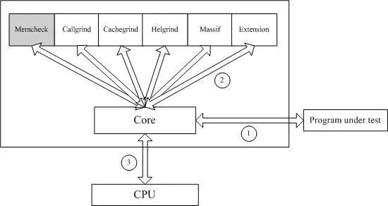

## Valgrind

### valgrind简介

Valgrind是一款用于内存调试、内存泄漏检测以及性能分析的软件开发工具。

Valgrind是用于调试和分析Linux程序的GPL系统。使用Valgrind的 工具套件，您可以自动检测许多内存管理和线程错误。您还可以执行详细的性能分析，以帮助加快程序速度。

Valgrind可使用任何语言编写的程序。因为Valgrind直接与程序二进制文件一起使用，所以它可以与以任何编程语言编写的程序一起使用，无论它们是编译的，即时编译的还是解释的。Valgrind工具主要针对用C和C ++编写的程序，因为用这些语言编写的程序往往有最多的错误！但是，例如，它可以用于调试和分析以多种语言编写的系统。Valgrind已用于部分或全部用C，C ++，Java，Perl，Python，汇编代码，Fortran，Ada等编写的程序上。

Valgrind是一套Linux下，开放源代码（GPL V2）的仿真调试工具的集合。Valgrind由内核（core）以及基于内核的其他调试工具组成。内核类似于一个框架（framework），它模拟了一个CPU环境，并提供服务给其他工具；而其他工具则类似于插件 (plug-in)，利用内核提供的服务完成各种特定的内存调试任务。Valgrind的体系结构如下图所示：



#### valgrind工具

1. **Memcheck**：

   **内存错误**检测器，能够发现开发中绝大多数内存错误使用情况。它可以帮助您使程序，尤其是C和C ++的程序更加正确。

   Memcheck 工具主要检查下面的程序错误：

   - 使用未初始化的内存 (Use of uninitialised memory)
   - 读/写已经被释放的内存 (Reading/writing memory after it has been free’d)
   - 读/写内存越界 (Reading/writing off the end of malloc’d blocks)
   - 读/写不恰当的内存栈空间 (Reading/writing inappropriate areas on the stack)
   - 内存泄漏 (Memory leaks – where pointers to malloc’d blocks are lost forever)
   - malloc/new/new[]和free/delete/delete[]不匹配 (Mismatched use of malloc/new/new [] vs free/delete/delete [])
   - src和dst的重叠 (Overlapping src and dst pointers in memcpy() and related functions)

2. **Callgrind**：

   生成调用图的缓存分析器，它主要用来检查程序中**函数调用**过程中出现的问题。
   Callgrind收集程序运行时的一些数据，函数调用关系等信息，还可以有选择地进行cache 模拟。在运行结束时，它会把分析数据写入一个文件。callgrind_annotate可以把这个文件的内容转化成可读的形式。

3. **Cachegrind**：

   缓存和分支预测探查器，它主要用来检查程序中**缓存使用**出现的问题。它可以帮助您使程序运行更快。
   它模拟 CPU中的一级缓存I1,D1和L2二级缓存，能够精确地指出程序中 cache的丢失和命中。如果需要，它还能够为我们提供cache丢失次数，内存引用次数，以及每行代码，每个函数，每个模块，整个程序产生的指令数。这对优化程序有很大的帮助。

4. **Helgrind**：

   线程错误检测器，它主要用来检查**多线程程**序中出现的**竞争**问题。
   Helgrind 寻找内存中被多个线程访问，而又没有一贯加锁的区域，这些区域往往是线程之间失去同步的地方，而且会导致难以发掘的错误。Helgrind实现了名为” Eraser” 的竞争检测算法，并做了进一步改进，减少了报告错误的次数。

5. DRD：还是线程错误检测器。它类似于Helgrind，但是使用不同的分析技术，因此可能会发现不同的问题。

6. **Massif**：

   堆分析器，它主要用来检查程序中**堆栈使用**中出现的问题。
   堆栈分析器，它能测量程序在堆栈中使用了多少内存，告诉我们堆块，堆管理块和栈的大小。Massif能帮助我们减少内存的使用，在带有虚拟内存的现代系统中，它还能够加速我们程序的运行，减少程序停留在交换区中的几率。

7. DHAT：是另一种堆分析器。它可以帮助您了解模块寿命，模块利用率和布局效率低下的问题。

8. BBV：是一个实验性的SimPoint基本块矢量生成器。这对从事计算机体系结构研究和开发的人员很有用。


#### 内存检查原理

**Memcheck**检测内存问题的原理如下图所示：


Memcheck 能够检测出内存问题，关键在于其建立了两个全局表。

- Valid-Value 表：
  对于进程的整个地址空间中的每一个字节(byte)，都有与之对应的 8 个 bits；对于 CPU 的每个寄存器，也有一个与之对应的 bit 向量。这些 bits 负责记录该字节或者寄存器值是否具有有效的、已初始化的值。
- Valid-Address 表
  对于进程整个地址空间中的每一个字节(byte)，还有与之对应的 1 个 bit，负责记录该地址是否能够被读写。

**检测原理**：

- 当要读写内存中某个字节时，首先检查这个字节对应的 A bit。如果该A bit显示该位置是无效位置，memcheck 则报告读写错误。
- 内核（core）类似于一个虚拟的 CPU 环境，这样当内存中的某个字节被加载到真实的 CPU 中时，该字节对应的 V bit 也被加载到虚拟的 CPU 环境中。一旦寄存器中的值，被用来产生内存地址，或者该值能够影响程序输出，则 memcheck 会检查对应的V bits，如果该值尚未初始化，则会报告使用未初始化内存错误。


#### **C++内存分配方式**

在C++中，内存分成5个区，他们分别是堆、栈、自由存储区、全局/静态存储区和常量存储区。

- **栈**：在执行函数时，函数内局部变量的存储单元都可以在栈上创建，函数执行结束时这些存储单元自动被释放。栈内存分配运算内置于处理器的指令集中，效率很高，但是分配的内存容量有限。
- **堆**：malloc在堆上分配的内存块，使用free释放内存。
- **自由存储区**：new所申请的内存则是在自由存储区上，使用delete来释放，编译器不管，由程序自己释放，一般一个`new`就要对应一个 `delete`。如果程序员没有释放掉，那么在程序结束后，操作系统会自动回收。
- **全局/静态存储区**：全局变量和静态变量被分配到同一块内存中，在以前的C语言中，全局变量又分为初始化的和未初始化的，在C++里面没有这个区分了，他们共同占用同一块内存区。
- **常量存储区**：这是一块比较特殊的存储区，他们里面存放的是常量，不允许修改。

> 堆是操作系统维护的一块内存，而自由存储是C++中通过new与delete动态分配和释放对象的抽象概念。堆与自由存储区并不等价。
>
> - 自由存储是C++中通过new与delete动态分配和释放对象的**抽象概念**，而堆（heap）是C语言和操作系统的术语，是操作系统维护的一块动态分配内存。
> - new所申请的内存区域在C++中称为自由存储区。即由堆实现的自由存储，可以说new所申请的内存区域在堆上。
> - 堆与自由存储区还是有区别的，它们并非等价。


#### **堆和栈区别**

1. **管理方式**：对于栈来讲，是由编译器自动管理，无需我们手工控制；对于堆来说，释放工作由程序员控制，容易产生`memory leak`。
2. **空间大小**：一般来讲在32位系统下，堆内存可以达到4G的空间，从这个角度来看堆内存几乎是没有什么限制的。但是对于栈来讲，一般都是有一定的空间大小的，默认的栈空间大小是几M。当然，我们可以修改。
3. **碎片问题**：对于堆来讲，频繁的`new/delete`势必会造成内存空间的不连续，从而造成大量的碎片，使程序效率降低。对于栈来讲，则不会存在这个问题，因为栈是先进后出的队列，他们是如此的一一对应，以至于永远都不可能有一个内存块从栈中间弹出，在他弹出之前，在他上面的后进的栈内容已经被弹出。
4. **生长方向**：对于堆来讲，生长方向是向上的，也就是向着内存地址增加的方向；对于栈来讲，它的生长方向是向下的，是向着内存地址减小的方向增长。
5. **分配方式**：堆都是动态分配的，没有静态分配的堆。栈有2种分配方式：静态分配和动态分配。静态分配是编译器完成的，比如局部变量的分配。动态分配由`alloca`函数进行分配，但是栈的动态分配和堆是不同的，他的动态分配是由编译器进行释放，无需我们手工实现。
6. **分配效率**：栈是机器系统提供的数据结构，计算机会在底层对栈提供支持：分配专门的寄存器存放栈的地址，压栈出栈都有专门的指令执行，这就决定了栈的效率比较高。堆则是C/C++函数库提供的，它的机制是很复杂的，例如为了分配一块内存，库函数会按照一定的算法在堆内存中搜索可用的足够大小的空间，如果没有足够大小的空间（可能是由于内存碎片太多），就有可能调用系统功能去增加程序数据段的内存空间，这样就有机会分到足够大小的内存，然后进行返回。显然，堆的效率比栈要低得多。


### valgrind的使用

#### 编译准备

建议在编译时加上`-g`参数启用了调试信息，可以使valgrind发现的错误更精确，如能够定位到源代码行。

编译优化选项请选择`-O0`，虽然这会降低程序的执行效率。因为在极少数情况下，`-O2` 会`-O1`观察到编译器的优化，从而生成使Memcheck误报未初始化值错误或丢失未初始化值错误的代码。除了Memcheck所有其他工具不受优化级别的影响，对于Cachegrind之类的性能分析工具，最好以其常规优化级别编译程序。

建议使用`-Wall`开启所有警告，因为它可以识别Valgrind在较高的优化级别上可能会遗漏的部分或全部问题。

```
#include <iostream>
int main(void) {
    int *x = new int[10];
    // problem 1: heap block overrun
    x[20] = 2; //写越界没有挂掉
    // problem 2: memory leak -- x 未释放
    return 0;
}
```

编译程序时，需要加上`-g`,`O0`,`Wall`选项，`-std=c++11`可选：

```
$ g++ -std=c++11 -g -O0 -Wall main.cpp -o main
```

#### valgrind调试

Valgrind被设计为尽可能非侵入性的。利用valgrind调试内存问题，不需要重新编译源，重新链接或以其他方式修改要检查的程序，它的输入就是二进制的可执行程序。

调用Valgrind的通用格式是：

```
valgrind [valgrind-options] your-prog-name [your-prog-options]

valgrind --tool=memcheck --leak-check=full ./main
```

`--tool=memcheck`选择valgrind工具，默认是memcheck。`--leak-check=full` 选项打开详细的内存泄漏检测器。

您的程序将比正常运行慢得多（例如20到30倍），并且使用更多的内存。memcheck将发出有关内存错误和它检测到的泄漏的消息。

如果您使用的是C ++，则可能要考虑的另一种选择是`-fno-inline`。这样可以更轻松地查看函数调用链，这有助于减少在大型C ++应用程序中导航时的混乱。或者，Valgrind选项 `--read-inline-info=yes`指示Valgrind读取描述内联信息的调试信息。这样，即使使用内联编译应用程序时，函数调用链也会正确显示。

#### 选项参数

Valgrind 的参数分为两类，一类是 Valgrind核心的参数选项，它对所有的工具都适用；另外一类就是具体某个工具如 memcheck 的参数选项。

Valgrind 默认的工具就是 memcheck，也可以通过“--tool=tool name”指定其他的工具。Valgrind 提供了大量的参数满足你特定的调试需求，具体可参考其用户手册，[Valgrind核心命令行参数选项](https://www.valgrind.org/docs/manual/manual-core.html)。

常用选项，适用于所有Valgrind工具：

1. --tool=<name> 运行 valgrind中名为toolname的工具。例如memcheck（默认），cachegrind，callgrind，helgrind，drd，massif，dhat，bouchey，none，exp-bbv等。
2. -h --help 显示帮助信息。
3. --version 显示valgrind内核的版本，每个工具都有各自的版本。
4. -q --quiet 安静地运行，只打印错误信息。
5. -v --verbose 更详细的信息, 增加错误数统计。
6. --trace-children=no|yes 跟踪子线程? [no]
7. --track-fds=no|yes 跟踪打开的文件描述？[no]
8. --time-stamp=no|yes 增加时间戳到LOG信息? [no]
9. --log-fd=<number> 输出LOG到描述符文件 [2=stderr]
10. --log-file=<file> 将输出LOG信息写入到指定文件里
11. --log-file-exactly=<file> 输出LOG信息到 file
12. --log-file-qualifier=<VAR> 取得环境变量的值来做为输出信息的文件名。 [none]
13. --log-socket=<ip-address:port-number> 输出LOG信息到指定IP地址的指定端口

LOG信息输出

1. -xml=yes 将信息以xml格式输出，只有memcheck可用
2. -num-callers=<number> show <number> callers in stack traces [12]
3. -error-limit=no|yes 如果太多错误，则停止显示新错误? [yes]
4. -error-exitcode=<number> 如果发现错误则返回错误代码 [0=disable]
5. -db-attach=no|yes 当出现错误，valgrind会自动启动调试器gdb。[no]
6. -db-command=<command> 启动调试器的命令行选项[gdb -nw %f %p]

适用于Memcheck工具的相关选项：

1. -leak-check=no|summary|full 要求对leak给出详细信息
2. -leak-resolution=low|med|high how much bt merging in leak check
3. -show-reachable=no|yes show reachable blocks in leak check

#### 输出信息

```
$ valgrind --tool=memcheck --leak-check=full ./a.out
==8040== Memcheck, a memory error detector
==8040== Copyright (C) 2002-2017, and GNU GPL'd, by Julian Seward et al.
==8040== Using Valgrind-3.14.0 and LibVEX; rerun with -h for copyright info
==8040== Command: ./main
==8040== 
==8040== Invalid write of size 4
==8040==    at 0x401170: main (使用未初始化的内存.cpp:5)
==8040==  Address 0x4d8dcd0 is 32 bytes before an unallocated block of size 4,121,328 in arena "client"
==8040== 
==8040== 
==8040== HEAP SUMMARY:
==8040==     in use at exit: 40 bytes in 1 blocks
==8040==   total heap usage: 2 allocs, 1 frees, 72,744 bytes allocated
==8040== 
==8040== 40 bytes in 1 blocks are definitely lost in loss record 1 of 1
==8040==    at 0x483650F: operator new[](unsigned long) (vg_replace_malloc.c:423)
==8040==    by 0x401163: main (使用未初始化的内存.cpp:3)
==8040== 
==8040== LEAK SUMMARY:
==8040==    definitely lost: 40 bytes in 1 blocks
==8040==    indirectly lost: 0 bytes in 0 blocks
==8040==      possibly lost: 0 bytes in 0 blocks
==8040==    still reachable: 0 bytes in 0 blocks
==8040==         suppressed: 0 bytes in 0 blocks
==8040== 
==8040== For counts of detected and suppressed errors, rerun with: -v
==8040== ERROR SUMMARY: 2 errors from 2 contexts (suppressed: 0 from 0)
```

`==8040==`进程ID8040 ，通常不重要。

`HEAP SUMMARY`，它表示程序在堆上分配内存的情况。程序报错的具体位置。

`LEAK SUMMARY`，它表示程序内存泄露的情况，其中对内存泄露进行了分类，总共有五类：

- **definitely lost** 意味着你的程序一定存在内存泄露；
- **indirectly lost** 意味着你的程序一定存在内存泄露，并且泄露情况和指针结构相关。
- **possibly lost** 意味着你的程序一定存在内存泄露，除非你是故意进行着不符合常规的操作，例如将指针指向某个已分配内存块的中间位置。
- **still reachable** 意味着你的程序可能是没问题的，但确实没有释放掉一些本可以释放的内存。这种情况是很常见的，并且通常基于合理的理由。
- **suppressed** 意味着有些泄露信息被压制了。在默认的 suppression 文件中可以看到一些 suppression 相关设置。


#### Valgrind的局限

##### 1.无法发现**静态数组越界**

Valgrind不对静态数组(分配在栈上)进行边界检查。无法发现**静态数组越界**的问题。

如果在程序中声明了一个静态数组，存在访问越界问题：

```
int main() {
  char x[10];
  x[11] = 'a'; // 静态数组越界
}
```

valgrind没有发现静态数组越界的问题：

```
$ valgrind --tool=memcheck --leak-check=full ./main
==12599== Memcheck, a memory error detector
==12599== Copyright (C) 2002-2017, and GNU GPL'd, by Julian Seward et al.
==12599== Using Valgrind-3.14.0 and LibVEX; rerun with -h for copyright info
==12599== Command: ./main
==12599== 
==12599== 
==12599== HEAP SUMMARY:
==12599==     in use at exit: 0 bytes in 0 blocks
==12599==   total heap usage: 1 allocs, 1 frees, 72,704 bytes allocated
==12599== 
==12599== All heap blocks were freed -- no leaks are possible
==12599== 
==12599== For counts of detected and suppressed errors, rerun with: -v
==12599== ERROR SUMMARY: 0 errors from 0 contexts (suppressed: 0 from 0)
```

Valgrind则不会警告你静态数组(分配在栈上)越界。你可以把数组改为动态在堆上分配的数组，这样就可能进行边界检查了。这个方法好像有点得不偿失的感觉。

##### 2.占用更多内存

Valgrind占用了更多的内存，可达两倍于你程序的正常使用量。

如果你用Valgrind来检测使用大量内存的程序就会遇到问题，它可能会用很长的时间来运行测试。大多数情况下，这都不是问题，即使速度慢也仅是检测时速度慢，如果你用Valgrind来检测一个正常运行时速度就很慢的程序，这下问题就大了。 Valgrind不可能检测出你在程序中犯下的所有错误--如果你不检查缓冲区溢出，Valgrind也不会告诉你代码写了它不应该写的内存。


#####  C++ 程序reachable原因

此问题可能与gcc和valgrind版本有关系，有出现此问题的版本为gcc-5.4，valgrind 3.13，经验证案例gcc-8.3，valgrind-3.14没有出现此问题。

[C++ 程序reachable valgrind 3-13案例](https://blog.csdn.net/sxj731533730/article/details/107552490)

（C++ 程序出现reachable问题，用的gcc-5.4 valgrind 3-13 ； 编译器版本和内存检查工具不同 生成的valgrind的报告存在差异，差异在于是否输出内存池的的log信息，关于内存池的相关知识，请参考相关文档）

下面是一个正常的 C++ 程序，没有发生内存泄漏：

```
#include <string>
int main() {
  auto ptr = new std::string("Hello, World!");
  delete ptr; //正常释放
  return 0;
}
```

```
$ g++ -std=c++11 -g -O0 -Wall main.cpp -o main
```

使用 Valgrind 分析这段程序，`--show-leak-kinds=all`选项，显示内存泄漏检测详细信息：

```
$ valgrind --tool=memcheck --leak-check=full --show-leak-kinds=all ./main_cpp
```

valgrind-3.14实际输出：（没有检测到问题）

```
$ valgrind --tool=memcheck --leak-check=full --show-leak-kinds=all ./main
==10553== Memcheck, a memory error detector
==10553== Copyright (C) 2002-2017, and GNU GPL'd, by Julian Seward et al.
==10553== Using Valgrind-3.14.0 and LibVEX; rerun with -h for copyright info
==10553== Command: ./main
==10553== 
==10553== 
==10553== HEAP SUMMARY:
==10553==     in use at exit: 0 bytes in 0 blocks
==10553==   total heap usage: 2 allocs, 2 frees, 72,736 bytes allocated
==10553== 
==10553== All heap blocks were freed -- no leaks are possible
==10553== 
==10553== For counts of detected and suppressed errors, rerun with: -v
==10553== ERROR SUMMARY: 0 errors from 0 contexts (suppressed: 0 from 0)
```

valgrind-3.13参考的输出：(C++ 程序出现reachable问题)

> ```
> ==31438== Memcheck, a memory error detector
> ==31438== Copyright (C) 2002-2017, and GNU GPL'd, by Julian Seward et al.
> ==31438== Using Valgrind-3.13.0 and LibVEX; rerun with -h for copyright info
> ==31438== Command: ./main_cpp
> ==31438==
> ==31438==
> ==31438== HEAP SUMMARY:
> ==31438==     in use at exit: 72,704 bytes in 1 blocks
> ==31438==   total heap usage: 2 allocs, 1 frees, 72,736 bytes allocated
> ==31438==
> ==31438== 72,704 bytes in 1 blocks are still reachable in loss record 1 of 1
> ==31438==    at 0x4C2DBF6: malloc (vg_replace_malloc.c:299)
> ==31438==    by 0x4EC3EFF: ??? (in /usr/lib/x86_64-linux-gnu/libstdc++.so.6.0.21)
> ==31438==    by 0x40104E9: call_init.part.0 (dl-init.c:72)
> ==31438==    by 0x40105FA: call_init (dl-init.c:30)
> ==31438==    by 0x40105FA: _dl_init (dl-init.c:120)
> ==31438==    by 0x4000CF9: ??? (in /lib/x86_64-linux-gnu/ld-2.23.so)
> ==31438==
> ==31438== LEAK SUMMARY:
> ==31438==    definitely lost: 0 bytes in 0 blocks
> ==31438==    indirectly lost: 0 bytes in 0 blocks
> ==31438==      possibly lost: 0 bytes in 0 blocks
> ==31438==    still reachable: 72,704 bytes in 1 blocks
> ==31438==         suppressed: 0 bytes in 0 blocks
> ==31438==
> ==31438== For counts of detected and suppressed errors, rerun with: -v
> ==31438== ERROR SUMMARY: 0 errors from 0 contexts (suppressed: 0 from 0)
> ```
>
> 使用 Valgrind 分析 C++ 程序时，有一些问题需要留意。
>
> 例如，这个程序并没有发生内存泄漏，但是从`HEAP SUMMARY`可以看到，程序分配了 2 次内存，但却只释放了 1 次内存，为什么会这样呢？
> 实际上这是**由于C++ 在分配内存时，为了提高效率，使用了它自己的内存池。当程序终止时，内存池的内存才会被操作系统回收**，所以 Valgrind 会将这部分内存报告为 reachable 的，需要注意，**reachable 的内存不代表内存泄漏**。例如，从上面的输出中可以看到，有 72704 个字节是 reachable 的，但没有报告内存泄漏。

### valgrind常见内存问题案例

#### 使用未初始化的内存变量

全局变量和静态变量的初始值均为0，而局部变量和动态申请的变量，其初始值为随机值。如果程序使用了随机值的变量，那么程序的行为就变得不可预期。

```
#include <iostream>
int main() {
  int x; // 未初始化
  if (x == 0) {
    std::cout << "X is zero" << std::endl;
  }
  return 0;
}
```

编译：

```
$ g++ -std=c++11 -g -O0 -Wall main.cpp -o main
```

使用 Valgrind 检测内存使用情况：

```
$ valgrind --tool=memcheck --leak-check=full ./main
```

输出信息：

```
==8360== Memcheck, a memory error detector
==8360== Copyright (C) 2002-2017, and GNU GPL'd, by Julian Seward et al.
==8360== Using Valgrind-3.14.0 and LibVEX; rerun with -h for copyright info
==8360== Command: ./main
==8360== 
==8360== Conditional jump or move depends on uninitialised value(s)
==8360==    at 0x40117E: main (main.cpp:4)
==8360== 
X is zero
==8360== 
==8360== HEAP SUMMARY:
==8360==     in use at exit: 0 bytes in 0 blocks
==8360==   total heap usage: 2 allocs, 2 frees, 73,728 bytes allocated
==8360== 
==8360== All heap blocks were freed -- no leaks are possible
==8360== 
==8360== For counts of detected and suppressed errors, rerun with: -v
==8360== Use --track-origins=yes to see where uninitialised values come from
==8360== ERROR SUMMARY: 1 errors from 1 contexts (suppressed: 0 from 0)
```

使用`--track-origins=yes`选项查看具体未初始化变量的位置

```
$ valgrind --tool=memcheck --leak-check=full --track-origins=yes ./main
```

```
==8498== Conditional jump or move depends on uninitialised value(s)
==8498==    at 0x40117E: main (main.cpp:4)
==8498==  Uninitialised value was created by a stack allocation
==8498==    at 0x401172: main (main.cpp:2)
```

输出结果会显示：`Conditional jump or move depends on uninitialized value(s)` 即程序的跳转依赖于一个未初始化的变量。


#### 内存读写越界（非法读写）

当访问了不该访问或者没有权限访问的内存地址空间，对动态内存访问时超出了申请的内存大小范围。

输出结果会显示： `Invalid write of size 4; Invalid read of size 4`

注意：valgrind无法发现**静态数组越界**的问题。

##### **动态数组访问越界**

```
#include <iostream>
int main() {
    // int a[10]; 静态数组越界valgrind无法检查出来
    int *iptr = new int[10]; //动态内存
    std::cout << iptr[10] << std::endl; // 动态数组访问越界
    delete[] iptr;
    return 0;
}
```

编译程序时，需要加上加上`-g`,`O0`,`Wall`选项：

```
$ g++ -std=c++11 -g -O0 -Wall main.cpp -o main
```

使用 Valgrind 分析这段程序，Valgrind 会提示越界访问：

```
$ valgrind --tool=memcheck --leak-check=full ./main
```

```
$ valgrind --tool=memcheck --leak-check=full ./main
==7233== Memcheck, a memory error detector
==7233== Copyright (C) 2002-2017, and GNU GPL'd, by Julian Seward et al.
==7233== Using Valgrind-3.14.0 and LibVEX; rerun with -h for copyright info
==7233== Command: ./main
==7233== 
==7233== Invalid read of size 4
==7233==    at 0x4011B0: main (main.cpp:5)
==7233==  Address 0x4d8dca8 is 0 bytes after a block of size 40 alloc'd
==7233==    at 0x483650F: operator new[](unsigned long) (vg_replace_malloc.c:423)
==7233==    by 0x4011A3: main (main.cpp:4)
==7233== 
0
==7233== 
==7233== HEAP SUMMARY:
==7233==     in use at exit: 0 bytes in 0 blocks
==7233==   total heap usage: 3 allocs, 3 frees, 73,768 bytes allocated
==7233== 
==7233== All heap blocks were freed -- no leaks are possible
==7233== 
==7233== For counts of detected and suppressed errors, rerun with: -v
==7233== ERROR SUMMARY: 1 errors from 1 contexts (suppressed: 0 from 0)
```

##### **vector访问越界**

```
#include <iostream>
#include <vector>
int main() {
  std::vector<int> v(10, 0); //动态内存
  std::cout << v[10] << std::endl;
  //静态数组越界无法检查出来
  return 0;
}
```

编译程序时，需要加上加上`-g`,`O0`,`Wall`选项：

```
$ g++ -std=c++11 -g -O0 -Wall main.cpp -o main
```

使用 Valgrind 分析这段程序，Valgrind 会提示越界访问：

```
$ valgrind --tool=memcheck --leak-check=full ./main
```

```
$ valgrind --tool=memcheck --leak-check=full ./main
==5797== Memcheck, a memory error detector
==5797== Copyright (C) 2002-2017, and GNU GPL'd, by Julian Seward et al.
==5797== Using Valgrind-3.14.0 and LibVEX; rerun with -h for copyright info
==5797== Command: ./main
==5797== 
==5797== Invalid read of size 4
==5797==    at 0x401214: main (main.cpp:5)
==5797==  Address 0x4d8dca8 is 0 bytes after a block of size 40 alloc'd
==5797==    at 0x4835DEF: operator new(unsigned long) (vg_replace_malloc.c:334)
==5797==    by 0x4017F9: __gnu_cxx::new_allocator<int>::allocate(unsigned long, void const*) (new_allocator.h:111)
==5797==    by 0x401766: std::allocator_traits<std::allocator<int> >::allocate(std::allocator<int>&, unsigned long) (alloc_traits.h:436)
==5797==    by 0x4016B7: std::_Vector_base<int, std::allocator<int> >::_M_allocate(unsigned long) (stl_vector.h:296)
==5797==    by 0x4015A4: std::_Vector_base<int, std::allocator<int> >::_M_create_storage(unsigned long) (stl_vector.h:311)
==5797==    by 0x401446: std::_Vector_base<int, std::allocator<int> >::_Vector_base(unsigned long, std::allocator<int> const&) (stl_vector.h:260)
==5797==    by 0x401339: std::vector<int, std::allocator<int> >::vector(unsigned long, int const&, std::allocator<int> const&) (stl_vector.h:429)
==5797==    by 0x4011F6: main (main.cpp:4)
==5797== 
0
==5797== 
==5797== HEAP SUMMARY:
==5797==     in use at exit: 0 bytes in 0 blocks
==5797==   total heap usage: 3 allocs, 3 frees, 73,768 bytes allocated
==5797== 
==5797== All heap blocks were freed -- no leaks are possible
==5797== 
==5797== For counts of detected and suppressed errors, rerun with: -v
==5797== ERROR SUMMARY: 1 errors from 1 contexts (suppressed: 0 from 0)
```

`Invalid read of size 4`表示越界读取 4 个字节，这个操作出现在`main.cpp`文件的第 5 行。另外可以看到，`vector`分配了一块 40 字节的内存，程序越界访问紧接着这块内存之后的 4 个字节。

##### valgrind无法发现**静态数组越界**

Valgrind不对静态数组(分配在栈上)进行边界检查。无法发现**静态数组越界**的问题。

如果在程序中声明了一个静态数组，存在访问越界问题，程序不会挂掉，valgrind无法检查出来：

```
#include <iostream>
int main() {
    int a[10];
    a[22] = 22; // 静态数组越界，程序不会挂掉，valgrind无法检查出来
    std::cout << a[22] << std::endl; // 静态数组越界
    return 0;
}
```

valgrind没有发现静态数组越界的问题：

```
$ valgrind --tool=memcheck --leak-check=full ./main==22741== Memcheck, a memory error detector
==22741== Copyright (C) 2002-2017, and GNU GPL'd, by Julian Seward et al.
==22741== Using Valgrind-3.14.0 and LibVEX; rerun with -h for copyright info
==22741== Command: ./main
==22741== 
22
==22741== 
==22741== HEAP SUMMARY:
==22741==     in use at exit: 0 bytes in 0 blocks
==22741==   total heap usage: 2 allocs, 2 frees, 73,728 bytes allocated
==22741== 
==22741== All heap blocks were freed -- no leaks are possible
==22741== 
==22741== For counts of detected and suppressed errors, rerun with: -v
==22741== ERROR SUMMARY: 0 errors from 0 contexts (suppressed: 0 from 0)
```

Valgrind则不会警告你静态数组(分配在栈上)越界。你可以把数组改为动态在堆上分配的数组，这样就可能进行边界检查了。这个方法好像有点得不偿失的感觉。


#### 内存泄漏（未释放内存）

常见的内存分配方式分三种：静态存储，栈上分配，堆上分配。全局变量属于静态存储，它们是在编译时就被分配了存储空间，函数内的局部变量属于栈上分配，而最灵活的内存使用方式当属堆上分配，也叫做内存动态分配了。常用的内存动态分配函数包括：malloc, alloc, realloc, new等，动态释放函数包括free, delete。

在程序中动态申请的内存在使用完后既没有释放也也法被程序的其他部分访问。 

显示输出结果如下：`12 bytes in 1 blocks are definitely lost in loss record 1 of 1`

**动态数组内存泄漏**

Valgrind 可以用来检测程序在哪个位置发生内存泄漏

```
#include <vector>
int main() {
    int *iptr = new int[3]; //未释放
    // auto vptr = new std::vector<int>(3); //未释放
    return 0;
}
```

编译程序时，需要加上加上`-g`,`O0`,`Wall`选项：

```
$ g++ -std=c++11 -g -O0 -Wall main.cpp -o main
```

使用 Valgrind 检测内存使用情况：

```
$ valgrind --tool=memcheck --leak-check=full ./main
```

```
$ valgrind --tool=memcheck --leak-check=full ./main
==11483== Memcheck, a memory error detector
==11483== Copyright (C) 2002-2017, and GNU GPL'd, by Julian Seward et al.
==11483== Using Valgrind-3.14.0 and LibVEX; rerun with -h for copyright info
==11483== Command: ./main
==11483== 
==11483== 
==11483== HEAP SUMMARY:
==11483==     in use at exit: 12 bytes in 1 blocks
==11483==   total heap usage: 2 allocs, 1 frees, 72,716 bytes allocated
==11483== 
==11483== 12 bytes in 1 blocks are definitely lost in loss record 1 of 1
==11483==    at 0x483650F: operator new[](unsigned long) (vg_replace_malloc.c:423)
==11483==    by 0x401133: main (main.cpp:3)
==11483== 
==11483== LEAK SUMMARY:
==11483==    definitely lost: 12 bytes in 1 blocks
==11483==    indirectly lost: 0 bytes in 0 blocks
==11483==      possibly lost: 0 bytes in 0 blocks
==11483==    still reachable: 0 bytes in 0 blocks
==11483==         suppressed: 0 bytes in 0 blocks
==11483== 
==11483== For counts of detected and suppressed errors, rerun with: -v
==11483== ERROR SUMMARY: 1 errors from 1 contexts (suppressed: 0 from 0)
```

`HEAP SUMMARY`，它表示程序在**堆上内存**分配的情况，其中的`2 allocs`表示程序分配了 2 次内存，`1 frees`表示程序释放了 1 次内存，`12 bytes allocated`表示分配了 12 个字节的内存。

另外，Valgrind 也会报告程序是在哪个位置发生内存泄漏。`by 0x401133: main (main.c:3)`从上面的信息可以看到，程序发生了一次内存泄漏，位置是`main.c`文件的第 3 行。

`LEAK SUMMARY`，它表示程序**内存泄露**的情况。`definitely lost: 12 bytes in 1 blocks`程序一定存在内存泄露。

**vector会分配额外空间**

`new vector<int>(3)`相比数组`new int[3]`占用的空间更大，来处理理vector。

```
#include <vector>
int main() {
    // int *iptr = new int[3]; //未释放
    auto vptr = new std::vector<int>(3); //未释放
    return 0;
}
```

```
$ valgrind --tool=memcheck --leak-check=full ./main
==11754== Memcheck, a memory error detector
==11754== Copyright (C) 2002-2017, and GNU GPL'd, by Julian Seward et al.
==11754== Using Valgrind-3.14.0 and LibVEX; rerun with -h for copyright info
==11754== Command: ./main
==11754== 
==11754== 
==11754== HEAP SUMMARY:
==11754==     in use at exit: 36 bytes in 2 blocks
==11754==   total heap usage: 3 allocs, 1 frees, 72,740 bytes allocated
==11754== 
==11754== 36 (24 direct, 12 indirect) bytes in 1 blocks are definitely lost in loss record 2 of 2
==11754==    at 0x4835DEF: operator new(unsigned long) (vg_replace_malloc.c:334)
==11754==    by 0x401186: main (main.cpp:4)
==11754== 
==11754== LEAK SUMMARY:
==11754==    definitely lost: 24 bytes in 1 blocks
==11754==    indirectly lost: 12 bytes in 1 blocks
==11754==      possibly lost: 0 bytes in 0 blocks
==11754==    still reachable: 0 bytes in 0 blocks
==11754==         suppressed: 0 bytes in 0 blocks
==11754== 
==11754== For counts of detected and suppressed errors, rerun with: -v
==11754== ERROR SUMMARY: 1 errors from 1 contexts (suppressed: 0 from 0)
```

`new vector<*int*>(3)`占36字节

```
==11754== HEAP SUMMARY:
==11754==     in use at exit: 36 bytes in 2 blocks
==11754==   total heap usage: 3 allocs, 1 frees, 72,740 bytes allocated
==11754== 
==11754== 36 (24 direct, 12 indirect) bytes in 1 blocks are definitely lost in loss record 2 of 2
==11754==    at 0x4835DEF: operator new(unsigned long) (vg_replace_malloc.c:334)
```

 `new int[3]`占12字节

```
==11483== HEAP SUMMARY:
==11483==     in use at exit: 12 bytes in 1 blocks
==11483==   total heap usage: 2 allocs, 1 frees, 72,716 bytes allocated
==11483==
==11483== 12 bytes in 1 blocks are definitely lost in loss record 1 of 1
==11483==    at 0x483650F: operator new[](unsigned long) (vg_replace_malloc.c:423)
```


#### 重复释放内存

申请了多少内存，在使用完成后就要释放多少。如果没有释放，或者少释放了就是内存泄露；多释放了也会产生问题。当申请与释放大小不一致时，即申请了多少内存却**没有释放完**或者**多释放了**，

显示输出结果如下：`Invalid free() /delete/delete[]`

上述程序中，指针sm_ptr和ptr指向的是同一块内存，却被先后释放两次。

```
#include <iostream>
int main() {
    int *ptr = new int; //动态内存
    delete ptr;
    int *sm_ptr = ptr;
    delete sm_ptr; //sm_ptr和ptr指向的是同一块内存,重复释放
    return 0;
}
```

编译程序时，需要加上加上`-g`,`O0`,`Wall`选项：

```
$ g++ -std=c++11 -g -O0 -Wall main.cpp -o main
```

使用 Valgrind 分析这段程序：

```
$ valgrind --tool=memcheck --leak-check=full ./main
```

```
$ valgrind --tool=memcheck --leak-check=full ./main==8895== Memcheck, a memory error detector==8895== Copyright (C) 2002-2017, and GNU GPL'd, by Julian Seward et al.
==8895== Using Valgrind-3.14.0 and LibVEX; rerun with -h for copyright info
==8895== Command: ./main
==8895== 
==8895== Invalid free() / delete / delete[] / realloc()
==8895==    at 0x4836EAB: operator delete(void*) (vg_replace_malloc.c:576)
==8895==    by 0x401197: main (main.cpp:6)
==8895==  Address 0x4d8dc80 is 0 bytes inside a block of size 4 free'd
==8895==    at 0x4836EAB: operator delete(void*) (vg_replace_malloc.c:576)
==8895==    by 0x401183: main (main.cpp:4)
==8895==  Block was alloc'd at
==8895==    at 0x4835DEF: operator new(unsigned long) (vg_replace_malloc.c:334)
==8895==    by 0x401173: main (main.cpp:3)
==8895== 
==8895== 
==8895== HEAP SUMMARY:
==8895==     in use at exit: 0 bytes in 0 blocks
==8895==   total heap usage: 2 allocs, 3 frees, 72,708 bytes allocated
==8895== 
==8895== All heap blocks were freed -- no leaks are possible
==8895== 
==8895== For counts of detected and suppressed errors, rerun with: -v
==8895== ERROR SUMMARY: 1 errors from 1 contexts (suppressed: 0 from 0)
```


#### 对释放的内存读/写

本质上说，系统会在堆上维护一个动态内存链表，如果被释放，就意味着该块内存可以继续被分配给其他部分，如果内存被释放后再访问，就可能覆盖其他部分的信息，这是一种严重的错误。

错误显示输出结果如下：`Invalid write of size 4`

```
#include <iostream>
int main() {
    int *iptr = new int; //动态内存
    delete iptr;
    *iptr = 9; // 释放后仍然读写
    return 0;
}
```

编译程序时，需要加上加上`-g`,`O0`,`Wall`选项：

```
$ g++ -std=c++11 -g -O0 -Wall main.cpp -o main
```

使用 Valgrind 分析这段程序：

```
$ valgrind --tool=memcheck --leak-check=full ./main
```

```
$ valgrind --tool=memcheck --leak-check=full ./main
==8246== Memcheck, a memory error detector
==8246== Copyright (C) 2002-2017, and GNU GPL'd, by Julian Seward et al.
==8246== Using Valgrind-3.14.0 and LibVEX; rerun with -h for copyright info
==8246== Command: ./main
==8246== 
==8246== Invalid write of size 4
==8246==    at 0x401188: main (main.cpp:5)
==8246==  Address 0x4d8dc80 is 0 bytes inside a block of size 4 free'd
==8246==    at 0x4836EAB: operator delete(void*) (vg_replace_malloc.c:576)
==8246==    by 0x401183: main (main.cpp:4)
==8246==  Block was alloc'd at
==8246==    at 0x4835DEF: operator new(unsigned long) (vg_replace_malloc.c:334)
==8246==    by 0x401173: main (main.cpp:3)
==8246== 
==8246== 
==8246== HEAP SUMMARY:
==8246==     in use at exit: 0 bytes in 0 blocks
==8246==   total heap usage: 2 allocs, 2 frees, 72,708 bytes allocated
==8246== 
==8246== All heap blocks were freed -- no leaks are possible
==8246== 
==8246== For counts of detected and suppressed errors, rerun with: -v
==8246== ERROR SUMMARY: 1 errors from 1 contexts (suppressed: 0 from 0)
```


#### new和delete不匹配

由于 C++ 兼容 C，而 C 与 C++ 的内存申请和释放函数是不同的，因此在 C++ 程序中，就有两套动态内存管理函数。一条不变的规则就是采用 C 方式申请的内存就用 C 方式释放；用 C++ 方式申请的内存，用 C++ 方式释放。也就是用 malloc/alloc/realloc 方式申请的内存，用 free 释放；用 new 方式申请的内存用 delete 释放。

在上述程序中，用 malloc 方式申请了内存却用 delete 来释放，new申请动态数组，delete无法释放数组，虚delete[]释放动态数组。申请与释放不匹配时，显示输出结果如下：`Mismatched free() /delete/delete[]`

```
#include <iostream>
int main() {
    int *ptr = (int *)malloc(1 * sizeof(int)); //动态内存
    *ptr = -1;
    delete ptr; // malloc与delete不匹配

    int *arr_ptr = new int[10];
    delete arr_ptr; // delete无法释放数组，不匹配
    return 0;
}
```

编译程序时，需要加上加上`-g`,`O0`,`Wall`选项：

```
$ g++ -std=c++11 -g -O0 -Wall main.cpp -o main
```

使用 Valgrind 分析这段程序：

```
$ valgrind --tool=memcheck --leak-check=full ./main
```

```
$ valgrind --tool=memcheck --leak-check=full ./main
==11344== Memcheck, a memory error detector
==11344== Copyright (C) 2002-2017, and GNU GPL'd, by Julian Seward et al.
==11344== Using Valgrind-3.14.0 and LibVEX; rerun with -h for copyright info
==11344== Command: ./main
==11344== 
==11344== Mismatched free() / delete / delete []
==11344==    at 0x4836EAB: operator delete(void*) (vg_replace_malloc.c:576)
==11344==    by 0x40119D: main (main.cpp:5)
==11344==  Address 0x4d8dc80 is 0 bytes inside a block of size 4 alloc'd
==11344==    at 0x483577F: malloc (vg_replace_malloc.c:299)
==11344==    by 0x401183: main (main.cpp:3)
==11344== 
==11344== Mismatched free() / delete / delete []
==11344==    at 0x4836EAB: operator delete(void*) (vg_replace_malloc.c:576)
==11344==    by 0x4011B7: main (main.cpp:8)
==11344==  Address 0x4d8dcd0 is 0 bytes inside a block of size 40 alloc'd
==11344==    at 0x483650F: operator new[](unsigned long) (vg_replace_malloc.c:423)
==11344==    by 0x4011A7: main (main.cpp:7)
==11344== 
==11344== 
==11344== HEAP SUMMARY:
==11344==     in use at exit: 0 bytes in 0 blocks
==11344==   total heap usage: 3 allocs, 3 frees, 72,748 bytes allocated
==11344== 
==11344== All heap blocks were freed -- no leaks are possible
==11344== 
==11344== For counts of detected and suppressed errors, rerun with: -v
==11344== ERROR SUMMARY: 2 errors from 2 contexts (suppressed: 0 from 0)
```


#### src和dst内存覆盖

C语言的强大和可怕之处在于其可以直接操作内存，C标准库中提供了大量这样的函数，比如使用C标准库中的strcpy，strncpy，memcpy，strcat时，需要设置源地址（src）和目标地址(dst)，src和dst所指向的地址不能发生重叠，否则结果将不可预期。

输出结果会显示：`Source and destination overlap in strncpy`(dst地址，src地址，地址相差长度)

```
#include <stdio.h>
#include <stdlib.h>
#include <string.h>
int main(int argc, char *argv[]) {
    char str[128];
    memset(str, '-1', sizeof(str)); // 字符'\0'在内存中assic码就是数值0
    strncpy(str + 20, str, 20); // Good
    strncpy(str + 20, str, 21); // Overlap，发生覆盖

    memset(str, '-1', sizeof(str));
    strncpy(str, str + 20, 20); // Good
    strncpy(str, str + 20, 21); // Overlap，发生覆盖

    memset(str, '-1', sizeof(str));
    str[39] = '\0'; // 29-39(长度20) 复制到-> 0-19(长度20)
    strcpy(str, str + 20); // Good

    memset(str, '-1', sizeof(str));
    str[40] = '\0'; // 29-40(长度21) 复制到-> 0-19(长度20)，发生覆盖
    strcpy(str, str + 20); // Overlap
    return 0;
}
```

编译程序时，需要加上加上`-g`,`O0`,`Wall`选项：

```
$ g++ -std=c++11 -g -O0 -Wall main.cpp -o main
```

使用 Valgrind 分析这段程序：

```
$ valgrind --tool=memcheck --leak-check=full ./main
```

```
$ valgrind --tool=memcheck --leak-check=full ./main
==21189== Memcheck, a memory error detector
==21189== Copyright (C) 2002-2017, and GNU GPL'd, by Julian Seward et al.
==21189== Using Valgrind-3.14.0 and LibVEX; rerun with -h for copyright info
==21189== Command: ./main
==21189== 
==21189== Source and destination overlap in strncpy(0x1ffeffe829, 0x1ffeffe815, 21)
==21189==    at 0x48393E0: __strncpy_sse2_unaligned (vg_replace_strmem.c:554)
==21189==    by 0x4011A7: main (main.cpp:8)
==21189== 
==21189== Source and destination overlap in strncpy(0x1ffeffe815, 0x1ffeffe829, 21)
==21189==    at 0x48393E0: __strncpy_sse2_unaligned (vg_replace_strmem.c:554)
==21189==    by 0x4011F5: main (main.cpp:12)
==21189== 
==21189== Source and destination overlap in strcpy(0x1ffeffe800, 0x1ffeffe814)
==21189==    at 0x4838E68: strcpy (vg_replace_strmem.c:512)
==21189==    by 0x401257: main (main.cpp:20)
==21189== 
==21189== 
==21189== HEAP SUMMARY:
==21189==     in use at exit: 0 bytes in 0 blocks
==21189==   total heap usage: 1 allocs, 1 frees, 72,704 bytes allocated
==21189== 
==21189== All heap blocks were freed -- no leaks are possible
==21189== 
==21189== For counts of detected and suppressed errors, rerun with: -v
==21189== ERROR SUMMARY: 3 errors from 3 contexts (suppressed: 0 from 0)
```

输出说明程序的8，12，20行，源地址和目标地址设置出现了重叠，Valgrind均准确地发现了问题。


### 参数选项

注：参数选项为摘抄，没有验证

#### 基本选项：

这些选项对所有工具都有效。

-h --help
显示所有选项的帮助，包括内核和选定的工具两者。

--help-debug
和--help相同，并且还能显示通常只有Valgrind的开发人员使用的调试选项。

--version
显示Valgrind内核的版本号。工具可以有他们自已的版本号。这是一种保证工具只在它们可以运行的内核上工作的一种设置。这样可以减少在工具和内核之间版本兼容性导致奇怪问题的概率。

-q --quiet
安静的运行，只打印错误信息。在进行回归测试或者有其它的自动化测试机制时会非常有用。

-v --verbose
显示详细信息。在各个方面显示你的程序的额外信息，例如：共享对象加载，使用的重置，执行引擎和工具的进程，异常行为的警告信息。重复这个标记可以增加详细的级别。

-d
调试Valgrind自身发出的信息。通常只有Valgrind开发人员对此感兴趣。重复这个标记可以产生更详细的输出。如果你希望发送一个bug报告，通过-v -v -d -d生成的输出会使你的报告更加有效。

--tool=<toolname> [default: memcheck]
运行toolname指定的Valgrind，例如，Memcheck, Addrcheck, Cachegrind,等等。

--trace-children=<yes|no> [default: no]
当这个选项打开时，Valgrind会跟踪到子进程中。这经常会导致困惑，而且通常不是你所期望的，所以默认这个选项是关闭的。

--track-fds=<yes|no> [default: no]
当这个选项打开时，Valgrind会在退出时打印一个打开文件描述符的列表。每个文件描述符都会打印出一个文件是在哪里打开的栈回溯，和任何与此文件描述符相关的详细信息比如文件名或socket信息。

--time-stamp=<yes|no> [default: no]
当这个选项打开时，每条信息之前都有一个从程序开始消逝的时间，用天，小时，分钟，秒和毫秒表示。

--log-fd=<number> [default: 2, stderr]
指定Valgrind把它所有的消息都输出到一个指定的文件描述符中去。默认值2, 是标准错误输出(stderr)。注意这可能会干扰到客户端自身对stderr的使用, Valgrind的输出与客户程序的输出将穿插在一起输出到stderr。

--log-file=<filename>
指定Valgrind把它所有的信息输出到指定的文件中。实际上，被创建文件的文件名是由filename、'.'和进程号连接起来的（即<filename>.<pid>），从而每个进程创建不同的文件。

--log-file-exactly=<filename>
类似于--log-file，但是后缀".pid"不会被添加。如果设置了这个选项，使用Valgrind跟踪多个进程，可能会得到一个乱七八糟的文件。

--log-file-qualifier=<VAR>
当和--log-file一起使用时，日志文件名将通过环境变量$VAR来筛选。这对于MPI程序是有益的。更多的细节，查看手册2.3节 "注解"。

--log-socket=<ip-address:port-number>
指定Valgrind输出所有的消息到指定的IP，指定的端口。当使用1500端口时，端口有可能被忽略。如果不能建立一个到指定端口的连接，Valgrind将输出写到标准错误(stderr)。这个选项经常和一个Valgrind监听程序一起使用。更多的细节，查看手册2.3节 "注解"。

#### 错误相关选项：

这些选项适用于所有产生错误的工具，比如Memcheck, 但是Cachegrind不行。

--xml=<yes|no> [default: no]
当这个选项打开时，输出将是XML格式。这是为了使用Valgrind的输出做为输入的工具，例如GUI前端更加容易些。目前这个选项只在Memcheck时生效。

--xml-user-comment=<string>
在XML开头 附加用户注释，仅在指定了--xml=yes时生效，否则忽略。

--demangle=<yes|no> [default: yes]
打开/关闭C++的名字自动解码。默认打开。当打开时，Valgrind将尝试着把编码过的C++名字自动转回初始状态。这个解码器可以处理g++版本为2.X,3.X或4.X生成的符号。一个关于名字编码解码重要的事实是，禁止文件中的解码函数名仍然使用他们未解码的形式。Valgrind在搜寻可用的禁止条目时不对函数名解码，因为这将使禁止文件内容依赖于Valgrind的名字解码机制状态，会使速度变慢，且无意义。

--num-callers=<number> [default: 12]
默认情况下，Valgrind显示12层函数调用的函数名有助于确定程序的位置。可以通过这个选项来改变这个数字。这样有助在嵌套调用的层次很深时确定程序的位置。注意错误信息通常只回溯到最顶上的4个函数。(当前函数，和它的3个调用者的位置)。所以这并不影响报告的错误总数。这个值的最大值是50。注意高的设置会使Valgrind运行得慢，并且使用更多的内存,但是在嵌套调用层次比较高的程序中非常实用。

--error-limit=<yes|no> [default: yes]
当这个选项打开时，在总量达到10,000,000，或者1,000个不同的错误，Valgrind停止报告错误。这是为了避免错误跟踪机制在错误很多的程序下变成一个巨大的性能负担。

--error-exitcode=<number> [default: 0]
指定如果Valgrind在运行过程中报告任何错误时的退出返回值，有两种情况；当设置为默认值(零)时，Valgrind返回的值将是它模拟运行的程序的返回值。当设置为非零值时，如果Valgrind发现任何错误时则返回这个值。在Valgrind做为一个测试工具套件的部分使用时这将非常有用，因为使测试工具套件只检查Valgrind返回值就可以知道哪些测试用例Valgrind报告了错误。

--show-below-main=<yes|no> [default: no]
默认地，错误时的栈回溯不显示main()之下的任何函数(或者类似的函数像glibc的__libc_start_main()，如果main()没有出现在栈回溯中)；这些大部分都是令人厌倦的C库函数。如果打开这个选项，在main()之下的函数也将会显示。

--suppressions=<filename> [default: $PREFIX/lib/valgrind/default.supp]
指定一个额外的文件读取不需要理会的错误；你可以根据需要使用任意多的额外文件。

--gen-suppressions=<yes|no|all> [default: no]
当设置为yes时，Valgrind将会在每个错误显示之后自动暂停并且打印下面这一行：---- Print suppression ? --- [Return/N/n/Y/y/C/c] ----这个提示的行为和--db-attach选项(见下面)相同。如果选择是，Valgrind会打印出一个错误的禁止条目，你可以把它剪切然后粘帖到一个文件，如果不希望在将来再看到这个错误信息。当设置为all时，Valgrind会对每一个错误打印一条禁止条目，而不向用户询问。这个选项对C++程序非常有用，它打印出编译器调整过的名字。注意打印出来的禁止条目是尽可能的特定的。如果需要把类似的条目归纳起来，比如在函数名中添加通配符。并且，有些时候两个不同的错误也会产生同样的禁止条目，这时Valgrind就会输出禁止条目不止一次，但是在禁止条目的文件中只需要一份拷贝(但是如果多于一份也不会引起什么问题)。并且，禁止条目的名字像<在这儿输入一个禁止条目的名字>;名字并不是很重要，它只是和-v选项一起使用打印出所有使用的禁止条目记录。

--db-attach=<yes|no> [default: no]
当这个选项打开时，Valgrind将会在每次打印错误时暂停并打出如下一行：---- Attach to debugger ? --- [Return/N/n/Y/y/C/c] ---- 按下回车,或者N、回车，n、回车，Valgrind不会对这个错误启动调试器。按下Y、回车，或者y、回车，Valgrind会启动调试器并设定在程序运行的这个点。当调试结束时，退出，程序会继续运行。在调试器内部尝试继续运行程序，将不会生效。按下C、回车，或者c、回车，Valgrind不会启动一个调试器，并且不会再次询问。注意：--db-attach=yes与--trace-children=yes有冲突。你不能同时使用它们。Valgrind在这种情况下不能启动。

--db-command=<command> [default: gdb -nw %f %p]
通过--db-attach指定如何使用调试器。默认的调试器是gdb.默认的选项是一个运行时扩展Valgrind的模板。 %f会用可执行文件的文件名替换，%p会被可执行文件的进程ID替换。
这指定了Valgrind将怎样调用调试器。默认选项不会因为在构造时是否检测到了GDB而改变,通常是/usr/bin/gdb.使用这个命令，你可以指定一些调用其它的调试器来替换。
给出的这个命令字串可以包括一个或多个%p %f扩展。每一个%p实例都被解释成将调试的进程的PID，每一个%f实例都被解释成要调试的进程的可执行文件路径。

--input-fd=<number> [default: 0, stdin]
使用--db-attach=yes和--gen-suppressions=yes选项，在发现错误时，Valgrind会停下来去读取键盘输入。默认地，从标准输入读取，所以关闭了标准输入的程序会有问题。这个选项允许你指定一个文件描述符来替代标准输入读取。

--max-stackframe=<number> [default: 2000000]
栈的最大值。如果栈指针的偏移超过这个数量，Valgrind则会认为程序是切换到了另外一个栈执行。如果在程序中有大量的栈分配的数组，你可能需要使用这个选项。valgrind保持对程序栈指针的追踪。如果栈指针的偏移超过了这个数量，Valgrind假定你的程序切换到了另外一个栈，并且Memcheck行为与栈指

针的偏移没有超出这个数量将会不同。通常这种机制运转得很好。然而，如果你的程序在栈上申请了大的结构，这种机制将会表现得愚蠢，并且Memcheck将会报告大量的非法栈内存访问。这个选项允许把这个阀值设置为其它值。应该只在Valgrind的调试输出中显示需要这么做时才使用这个选项。在这种情况下，它会告诉你应该指定的新的阀值。普遍地，在栈中分配大块的内存是一个坏的主意。因为这很容易用光你的栈空间，尤其是在内存受限的系统或者支持大量小堆栈的线程的系统上，因为Memcheck执行的错误检查，对于堆上的数据比对栈上的数据要高效很多。如果你使用这个选项，你可能希望考虑重写代码在堆上分配内存而不是在栈上分配。

#### MALLOC()相关的选项:

对于使用自有版本的malloc() (例如Memcheck和massif)，下面的选项可以使用。

--alignment=<number> [default: 8]
默认Valgrind的malloc(),realloc(), 等等，是8字节对齐地址的。这是大部分处理器的标准。然而，一些程序可能假定malloc()等总是返回16字节或更多对齐的内存。提供的数值必须在8和4096区间之内，并且必须是2的幂数。

#### 非通用选项：

这些选项可以用于所有的工具，它们影响Valgrind core的几个特性。大部分人不会用到这些选项。

--run-libc-freeres=<yes|no> [default: yes]
GNU C库(libc.so)，所有程序共用的，可能会分配一部分内存自已用。通常在程序退出时释放内存并不麻烦 -- 这里没什么问题，因为Linux内核在一个进程退出时会回收进程全部的资源，所以这只是会造成速度慢。glibc的作者认识到这样会导致内存检查器，像Valgrind，在退出时检查内存错误的报告glibc的内存泄漏问题，为了避免这个问题，他们提供了一个__libc_freeres()例程特别用来让glibc释放分配的所有内存。因此Memcheck在退出时尝试着去运行__libc_freeres()。不幸的是，在glibc的一些版本中，__libc_freeres是有bug会导致段错误的。这在Red Hat 7.1上有特别声明。所以，提供这个选项来决定是否运行__libc_freeres。如果你的程序看起来在Valgrind上运行得很好，但是在退出时发生段错误，你可能需要指定--run-libc-freeres=no来修正，这将可能错误的报告libc.so的内存泄漏。

--sim-hints=hint1,hint2,...
传递杂凑的提示给Valgrind，轻微的修改模拟行为的非标准或危险方式，可能有助于模拟奇怪的特性。默认没有提示打开。小心使用！目前已知的提示有：

l lax-ioctls: 对ioctl的处理非常不严格，唯一的假定是大小是正确的。不需要在写时缓冲区完全的初始化。没有这个，用大量的奇怪的ioctl命令来使用一些设备驱动将会非常烦人。

l enable-inner:打开某些特殊的效果，当运行的程序是Valgrind自身时。

--kernel-variant=variant1,variant2,...
处理系统调用和ioctls在这个平台的默认核心上产生不同的变量。这有助于运行在改进过的内核或者支持非标准的ioctls上。小心使用。如果你不理解这个选项做的是什么那你几乎不需要它。已经知道的变量有：

l bproc: 支持X86平台上的sys_broc系统调用。这是为了运行在BProc，它是标准Linux的一个变种，有时用来构建集群。

--show-emwarns=<yes|no> [default: no]
当这个选项打开时，Valgrind在一些特定的情况下将对CPU仿真产生警告。通常这些都是不引人注意的。

--smc-check=<none|stack|all> [default: stack]
这个选项控制Valgrind对自我修改的代码的检测。Valgrind可以不做检测，可以检测栈中自我修改的代码，或者任意地方检测自我修改的代码。注意默认选项是捕捉绝大多数情况，到目前我们了解的情况为止。使用all选项时会极大的降低速度。(但是用none选项运行极少影响速度，因为对大多数程序，非常少的代码被添加到栈中)

#### 调试VALGRIND选项：

还有一些选项是用来调试Valgrind自身的。在运行一般的东西时不应该需要的。如果你希望看到选项列表，使用--help-debug选项。

内存检查选项：

--leak-check=<no|summary|yes|full> [default: summary]
当这个选项打开时，当客户程序结束时查找内存泄漏。内存泄漏意味着有用malloc分配内存块，但是没有用free释放，而且没有指针指向这块内存。这样的内存块永远不能被程序释放，因为没有指针指向它们。如果设置为summary，Valgrind会报告有多少内存泄漏发生了。如果设置为full或yes，Valgrind给出每一个独立的泄漏的详细信息。

--show-reachable=<yes|no> [default: no]
当这个选项关闭时，内存泄漏检测器只显示没有指针指向的内存块，或者只能找到指向块中间的指针。当这个选项打开时，内存泄漏检测器还报告有指针指向的内存块。这些块是最有可能出现内存泄漏的地方。你的程序可能，至少在原则上，应该在退出前释放这些内存块。这些有指针指向的内存块和没有指针指向的内存块，或者只有内部指针指向的块，都可能产生内存泄漏，因为实际上没有一个指向块起始的指针可以拿来释放，即使你想去释放它。

--leak-resolution=<low|med|high> [default: low]
在做内存泄漏检查时，确定memcheck将怎么样考虑不同的栈是相同的情况。当设置为low时，只需要前两层栈匹配就认为是相同的情况；当设置为med，必须要四层栈匹配，当设置为high时，所有层次的栈都必须匹配。对于hardcore内存泄漏检查，你很可能需要使用--leak-resolution=high和--num-callers=40或者更大的数字。注意这将产生巨量的信息，这就是为什么默认选项是四个调用者匹配和低分辨率的匹配。注意--leak-resolution= 设置并不影响memcheck查找内存泄漏的能力。它只是改变了结果如何输出。

--freelist-vol=<number> [default: 5000000]
当客户程序使用free(C中)或者delete(C++)释放内存时，这些内存并不是马上就可以用来再分配的。这些内存将被标记为不可访问的，并被放到一个已释放内存的队列中。这样做的目的是，使释放的内存再次被利用的点尽可能的晚。这有利于memcheck在内存块释放后这段重要的时间检查对块不合法的访问。这个选项指定了队列所能容纳的内存总容量，以字节为单位。默认的值是5000000字节。增大这个数目会增加memcheck使用的内存，但同时也增加了对已释放内存的非法使用的检测概率。

--workaround-gcc296-bugs=<yes|no> [default: no]
当这个选项打开时，假定读写栈指针以下的一小段距离是gcc 2.96的bug，并且不报告为错误。距离默认为256字节。注意gcc 2.96是一些比较老的Linux发行版(RedHat 7.X)的默认编译器，所以你可能需要使用这个选项。如果不是必要请不要使用这个选项，它可能会使一些真正的错误溜掉。一个更好的解决办法是使用较新的，修正了这个bug的gcc/g++版本。

--partial-loads-ok=<yes|no> [default: no]
控制memcheck如何处理从地址读取时字长度，字对齐，因此哪些字节是可以寻址的，哪些是不可以寻址的。当设置为yes是，这样的读取并不抛出一个寻址错误。而是从非法地址读取的V字节显示为未定义，访问合法地址仍然是像平常一样映射到内存。设置为no时，从部分错误的地址读取与从完全错误的地址读取同样处理：抛出一个非法地址错误，结果的V字节显示为合法数据。注意这种代码行为是违背ISO C/C++标准，应该被认为是有问题的。如果可能，这种代码应该修正。这个选项应该只是做为一个最后考虑的方法。

--undef-value-errors=<yes|no> [default: yes]
控制memcheck是否检查未定义值的危险使用。当设为yes时，Memcheck的行为像Addrcheck, 一个轻量级的内存检查工具，是Valgrind的一个部分，它并不检查未定义值的错误。使用这个选项，如果你不希望看到未定义值错误。

#### CACHEGRIND选项：

手动指定I1/D1/L2缓冲配置，大小是用字节表示的。这三个必须用逗号隔开，中间没有空格，例如： valgrind --tool=cachegrind --I1=65535,2,64你可以指定一个，两个或三个I1/D1/L2缓冲。如果没有手动指定，每个级别使用普通方式(通过CPUID指令得到缓冲配置，如果失败，使用默认值)得到的配置。

--I1=<size>,<associativity>,<line size>
指定第一级指令缓冲的大小，关联度和行大小。

--D1=<size>,<associativity>,<line size>
指定第一级数据缓冲的大小，关联度和行大小。

--L2=<size>,<associativity>,<line size>
指定第二级缓冲的大小，关联度和行大小。

CALLGRIND选项：
--heap=<yes|no> [default: yes]

当这个选项打开时，详细的追踪堆的使用情况。关闭这个选项时，massif.pid.txt或massif.pid.html将会非常的简短。

--heap-admin=<number> [default: 8]
每个块使用的管理字节数。这只能使用一个平均的估计值，因为它可能变化。glibc使用的分配器每块需要4~15字节，依赖于各方面的因素。管理已经释放的块也需要空间，尽管massif不计算这些。

--stacks=<yes|no> [default: yes]
当打开时，在剖析信息中包含栈信息。多线程的程序可能有多个栈。

--depth=<number> [default: 3]
详细的堆信息中调用过程的深度。增加这个值可以给出更多的信息，但是massif会更使这个程序运行得慢，使用更多的内存，并且产生一个大的massif.pid.txt或者massif.pid.hp文件。

--alloc-fn=<name>
指定一个分配内存的函数。这对于使用malloc()的包装函数是有用的，可以用它来填充原来无效的上下文信息。(这些函数会给出无用的上下文信息，并在图中给出无意义的区域)。指定的函数在上下文中被忽略，例如，像对malloc()一样处理。这个选项可以在命令行中重复多次，指定多个函数。

--format=<text|html> [default: text]
产生text或者HTML格式的详细堆信息，文件的后缀名使用.txt或者.html。

#### HELGRIND选项：

--private-stacks=<yes|no> [default: no]
假定线程栈是私有的。

--show-last-access=<yes|some|no> [default: no]
显示最后一次字访问出错的位置。

#### LACKEY选项：

--fnname=<name> [default: _dl_runtime_resolve()]
对<name>函数计数。

--detailed-counts=<no|yes> [default: no]
对读取，存储和alu操作计数。

### reference

[Valgrind Documentation](https://www.valgrind.org/docs/)

[valgrind 详细说明](https://www.cnblogs.com/wangkangluo1/archive/2011/07/20/2111273.html)

[使用 Valgrind 检测 C++ 内存泄漏](http://senlinzhan.github.io/2017/12/31/valgrind/)

[内存泄漏检查工具valgrind使用方法](https://blog.csdn.net/caohao2008/article/details/5682291)

[valgrind详解-参数说明](https://www.cnblogs.com/jiu0821/p/6412669.html)

[C++之控制内存分配](https://www.cnblogs.com/ccpang/p/11306715.html)

