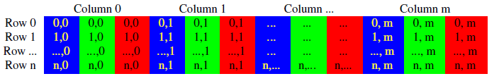

# OpenCV教程


#### CLion+OpenCV 开发环境搭建

[参考链接](https://blog.csdn.net/weixin_40744915/article/details/82836125)

[参考](https://blog.csdn.net/tqcai666/article/details/87034285)

OpenCV安装好后只需CLion里编写CMakeList.txt文件指定opencv路径即可,不需要特殊设置

CMakeList.txt 

> ```
> #设置最低版本的cmake要求
> cmake_minimum_required(VERSION 3.14)
> #设置项目信息
> project(cvtest00)
> #set(PROJECT_NAME cvtest00)
> #project(${PROJECT_NAME})
> 
> #设置编译器版本
> set(CMAKE_CXX_STANDARD 14)
> 
> #设置源文件（主文件名）
> #set(SOURCE_FILES main.cpp)
> #设置要生成可执行程序的文件名
> #add_executable(cvtest00 ${SOURCE_FILES})
> #主函数生成可执行文件
> add_executable(cvtest00 main.cpp)
> 
> #寻找opencv库
> find_package(OpenCV REQUIRED)
> #添加头文件
> include_directories(${OpenCV_INCLUDE_DIRS})
> 
> #打印调试信息
> MESSAGE(STATUS "Project:cvtest00")
> MESSAGE(STATUS "Project Dirrectory: ${PROJECT_SOURCE_DIR}")
> 
> #设置调试模式，debug会输出调试信息
> SET(CMAKE_BUILD_TYPE DEBUG)
> 
> #添加自己写的其他函数文件，注意这个名字不能和工程名冲突
> #ADD_LIBRARY( STATIC imgfeatures.cpp imgfeatures.h kdtree.h kdtree.cpp minpq.h minpq.cpp sift.h sift.cpp utils.cpp utils.h xform.h xform.cpp)
> 
> #设置链接库
> target_link_libraries(cvtest00 ${OpenCV_LIBS})
> ```

main.cpp测试代码

> ```
> #include <opencv2/opencv.hpp>
> #include <iostream>
> #include <string>
> using namespace cv;
> using namespace std;
> int main(int argc,char **argv)
> {
>     Mat img = imread("/home/chao/Desktop/test.jpg");    //  绝对路径
>     Mat img = imread("../test.jpg");    //  按照编译后可执行程序路径开始算???
>     cout<     if(img.empty())
>     {
>         cout<<"error";
>         return -1;
>     }
>     cout<<"\nMy picture: "<< img.size() <<endl;
>     imshow("image",img);
>     waitKey();
>     return 0;
> }
> ```

**报错:** `Gtk-WARNING **: 22:16:16.681: Unable to locate theme engine in module_path:`

原因是缺少gnome组件

```
sudo apt install gnome-themes-standard
```
**报错:** `terminate called after throwing an instance of 'cv::Exception'`
  what():  OpenCV(3.4.5) /home/chao/opencv/opencv-3.4.5/modules/highgui/src/window_gtk.cpp:1257: error: (-215:Assertion failed) found && "Can't destroy non-registered window" in function 'cvDestroyWindow'

原因是图片没有正确读取,请先测试图片是否正确加载,(文件相对路径似乎是按照编译后的可执行文件的相对路径算??)

**报错:** `CMake throws Error: could not load cache`

原因是 CLion自动创建的CMake的 cmake-build-debug 编译文件受损不完整,直接 `File`---"`Reload CMake Project`"


Mat类分为了两个部分:矩阵头和指向矩阵数据部分的指针，data就是指向矩阵数据的指针





depth数值	具体类型		取值范围
CV_8U	8 位无符号整数	（0……255）
CV_8S	8 位符号整数	（-128……127）
CV_16U	16 位无符号整数	（0……65535）
CV_16S	16 位符号整数	（-32768……32767）
CV_32S	32 位符号整数	（-2147483648……2147483647）
CV_32F	32 位浮点数	（-FLT_MAX ………FLT_MAX，INF，NAN)
CV_64F	64 位浮点数	（-DBL_MAX ……….DBL_MAX，INF，NAN)

type类型

| CV_8UC1  | CV_8UC2  | CV_8UC3  | CV_8UC4  |
| -------- | -------- | -------- | -------- |
| CV_8SC1  | CV_8SC2  | CV_8SC3  | CV_8SC4  |
| CV_16UC1 | CV_16UC2 | CV_16UC3 | CV_16UC4 |
| CV_16SC1 | CV_16SC2 | CV_16SC3 | CV_16SC4 |
| CV_32SC1 | CV_32SC2 | CV_32SC3 | CV_32SC4 |
| CV_32FC1 | CV_32FC2 | CV_32FC3 | CV_32FC4 |
| CV_64FC1 | CV_64FC2 | CV_64FC3 | CV_64FC4 |

#### Mat类

Mat类用于表示一个多维的单通道或者多通道的稠密数组。能够用来保存实数或复数的向量、矩阵，灰度或彩色图像，立体元素，点云，张量以及直方图（高维的直方图使用SparseMat保存比较好）。简而言之，Mat就是用来保存多维的矩阵的。Mat对象OpenCV2.0之后引进的图像数据结构、自动分配内存、不存在内存泄漏的问题，是面向对象的数据结构。

Mat类可以分为两个部分：矩阵头和指向像素数据的矩阵指针

矩阵头: 包括数字图像的矩阵尺寸、存储方法、存储地址和引用次数等，矩阵头固定格式，不会随着图像的大小而改变
数据指针: 指向像素数据的矩阵指针

OpenCV行图像复制和传递时，不再复制整个Mat数据，而只是复制矩阵头和指向像素矩阵的指针

#### 构造函数

> cv::Mat::Mat(int rows, int cols, int type)    # 矩阵的rows行数,cols 列数,存储类型type
>
> cv::Mat::Mat(int rows, int cols,i nt type, const Scalar &s)    # 矩阵的rows行数,cols 列数,存储类型type,Scalar &s 通过Scalar数据类来初始化每个通道元素值,向量长度对应通道数目一致
>
> ​	Mat M(2,2,CV_8UC3)      # 表示M是一个3,4的矩阵，每个通道是8位Unsigned Char类型,3通道,
> 		[  0, 0, 0,     0, 0, 0,     0, 0, 0;
>   	   	   0, 0, 0,     0, 0, 0,     0, 0, 0]
>
> ​	Mat M(2,2,CV_8UC3, Scalar(0,0,255))
> 		[  0, 100, 255,     0, 100, 255,     0, 100, 255;
>    		   0, 100, 255,     0, 100, 255,     0, 100, 255]

> cv::Mat::Mat(Size size, int type)    # 矩阵的大小(Size),以及存储类型(type) 
>
> cv::Mat::Mat(Size size, int type, const Scalar &s)    # 矩阵的大小(Size),存储类型(type) ,Scalar &s
>
> Mat src2(Size(30, 40), CV_32FC3)    # 表示src是一个Size(30,40)的矩阵，且矩阵元素以32位float型存储

> cv::Mat::Mat(int ndims, const int *  sizes, int type)     # 矩阵的维数(ndims),指定维数组形状的整数数组(sizes)??,数组的类型(type)
>
> cv::Mat::Mat(int ndims, const int *  sizes,int type, const Scalar& s)     # 
>
> Mat src1(300, 400, CV_8UC3,Scalar(255,255,255))    # Scalar(255,255,255)以8位无符号数存储，对应RGB通道值。

> cv::Mat::create 创建Mat对象 矩阵
>
> Mat M;
> M.create(4, 3, CV_8UC3);
> M = Scalar(1,125,255);
> cout << "M = " << endl << " " << M << endl << endl;
> uchar* firstRow = M.ptr<uchar>(0);
> printf("%d", *firstRow);

> cv::Mat::Mat(const Mat & m)     # 引用m矩阵

> 定义小数组
>
> // Mat_<char>(,) <<  创建小数组
> Mat kernel = (Mat_<char>(3, 3) << 0, -1, 0, -1, 5, -1, 0, -1, 0);
> cout << "kernel =" << endl << kernel << endl;
>
> int sz[3] = {2,2,2};??
> Mat  L(3,sz, CV_8UC1, Scalar::all(0));     ??
> cout << "L = " << endl << " " << L << endl << endl;??


#### Mat属性

#### rows  矩阵的行数

#### cols   矩阵的列数

#### size 矩阵的大小

size(cols,rows),如果矩阵的维数大于2，则是size(-1,-1)

#### dims 矩阵的维度

例如5*6矩阵是二维矩阵，则dims=2，三维矩阵dims=3

#### channels 通道数

矩阵元素拥有的通道数，例如常见的彩色图像，每一个像素由RGB三部分组成，则channels = 3

#### data 数据指针

uchar型的指针，指向矩阵数据的指针

#### type 图像类型

表示矩阵中元素的数据类型以及矩阵的通道数，如CV_8UC3，它是一系列的预定义的常量，其命名规则为CV_(位数）+（数据类型）+（通道数）

| CV_8UC1  | CV_8UC2  | CV_8UC3  | CV_8UC4  |
| -------- | -------- | -------- | -------- |
| CV_8SC1  | CV_8SC2  | CV_8SC3  | CV_8SC4  |
| CV_16UC1 | CV_16UC2 | CV_16UC3 | CV_16UC4 |
| CV_16SC1 | CV_16SC2 | CV_16SC3 | CV_16SC4 |
| CV_32SC1 | CV_32SC2 | CV_32SC3 | CV_32SC4 |
| CV_32FC1 | CV_32FC2 | CV_32FC3 | CV_32FC4 |
| CV_64FC1 | CV_64FC2 | CV_64FC3 | CV_64FC4 |

U（unsigned integer）无符号整数，S（signed integer）有符号整数，F（float）浮点数，C（channels）通道数

#### depth 图像深度(精度)

矩阵中元素的一个通道的数据类型，用来度量每一个像素中每一个通道的精度，如CV_8U、CV_8S、CV_16U、CV_16S、CV_32S、CV_32F、CV_64F

depth和type是相关的,将type的预定义值去掉通道信息就是depth值,例如 type为 CV_16SC2，一个2通道的16位的有符号整数,那么depth则是CV_16S

elemSize 矩阵一个元素占用的字节数，例如：type是CV_16SC3，那么elemSize = 3 * 16 / 8 = 6 bytes

elemSize1 矩阵元素一个通道占用的字节数，例如：type是CV_16CS3，那么elemSize1 = 16  / 8 = 2 bytes = elemSize / channe

step 

step1 规整化的step，值为step / elemSize1

#### Mat 方法

#### create 创建Mat对象 (创建矩阵)

> Mat M;
> M.create(4, 3, CV_8UC3);
> M = Scalar(1,125,255);

total 返回矩阵的元素总个数

#### cvtColor 颜色空间转换

#### convertTo 矩阵存储类型转换

> Mat src = imread("test.png",IMREAD_COLOR);
> src.convertTo(dst, CV_32FC3);    # src转换为32位浮点型,存到dst


#### at<type>(i,j) 访问矩阵元素

> 读写**单通道**灰度GRAY像素点的像素值
>
> Mat src = imread("test.jpg");    // （CV_8UC1）
> int pixel = src.at<int>(y, x);    # 访问test.jpg图像的(y, x)元素

> 读写**三通道**彩色BGR像素点的像素值
>
> Mat img = imread("test.jpg");
> Vec3f pixel = img.at<Vec3f>(y, x);     // 三个通道像素值存到pixel数组
> float blue = pixel.val[0];     // pixel.val[0/1/2]  对应bgr像素值
> float green = pixel.val[1]; 
> float red = pixel.val[2];
>
> img.at<Vec3b>(y,x)[index]=value 给每个像素点每个通道赋值

> at 各种类型的图像对应表??
> <uchar>  ---------CV_8U
> <char>  -----------CV_8S
> <short>  ---------CV_16S
> <ushort>  --------CV_16U
> <int>  -----------CV_32S
> <float>  ----------CV_32F
> <double>  --------CV_64F
> <Vec3b>  --------CV_8UC3
> <Vec3f>  --------CV_32FC3

ptr<type> ??

empty() ??

#### clone 矩阵完全复制

> “深拷贝”，把Mat对象的头部和数据部分一起复制
> Mat image1 = imread("test.png",IMREAD_COLOR);
> Mat image2 = image1.clone(); 

> “”浅拷贝“”赋值，只会复制Mat对象的头和指针部分，不会复制数据部分,即image2实际上指向的是image1的内存单元。当image1提前被释放掉，image2访问无效。
> Mat image1 = imread("test.png",IMREAD_COLOR);
> Mat image2 = image1;

#### copyTo 矩阵完全复制

与clone作用类似，使用形式不用

> Mat image3;
> image1.copyTo(image3);

mul 矩阵的乘法

inv 矩阵求逆

t 矩阵转置


#### zeros() 零矩阵

> Mat image = Mat::zeros( image.size(), image.type() );  创建一张跟原图像大小和类型一致的空白图像

ones 全一阵

eye 对角阵


#### imread() 读取图像

> Mat img = imread("../test.jpg");  //  按照编译后可执行程序路径开始算???
> Mat img1 = imread("../test.jpg", IMREAD_UNCHANGED);  // 加载原图不做任何改变
> Mat img2 = imread("../test.jpg", IMREAD_GRAYSCALE);  // 把原图作为灰度图像加载进来
> Mat img3 = imread("../test.jpg", IMREAD_COLOR);  // 把原图作为RGB图像加载进来

#### namedWindos() 创建窗口

> namedWindow("Window WINDOW_AUTOSIZE", WINDOW_AUTOSIZE);    // 不可改变大小
> namedWindow("Window WINDOW_NORMAL", WINDOW_NORMAL);    // 可拖动改变大小

#### destroyWindow() 销毁窗口

> destroyWindow("My Test");

#### imshow() 输出图像

> imshow("image01", img);
> imshow(image01, img);

#### imwrite() 保存图像

> imwrite("../newimage.png",img);    // 路径按照可执行文件的路径算

#### waitKey() 等待键盘触发

> waitKey();    // 等待键盘触发ms,默认0,一直等待
> waitKey(3000);    // 等待3000ms

#### getTickCount() 获取时间


#### CV_Assert() 断言

若括号中的表达式值为false，则返回一个错误信息。

> CV_Assert(testImage.depth() == CV_8U);    // 若括号中的表达式值为false，则返回一个错误信息。

#### filter2D() 二维滤波

#### saturate_cast<uchar> 截断,防止溢出(0~255)

#### bitwise_not 像素按位取反

#### addWeighted 图像混合

两张图像的Size大小和type类型必须一致才可以混合


#### RNG 随机数生成器类

RNG 可以产生3种随机数,
RNG(int seed)  使用种子seed产生一个64位int随机整数，默认种子-1
RNG::uniform  产生一个指定范围的均匀分布随机数,
RNG::gaussian  产生一个高斯随分布机数,

RNG::uniform(a, b )  返回一个[a,b)范围的均匀分布的随机数，a,b的数据类型要一致，而且必须是int、float、double中的一种，默认是int。

RNG::gaussian( σ)   返回一个均值为0，标准差为σ的随机数。

> //创建RNG对象，使用默认种子“-1”  
> RNG rng;    // rng既是一个RNG对象，也是一个随机整数
>
> //产生64位整数  
> int N1 = rng;  
>
> //注意: 总是得到double类型数据0.00，因为会调用uniform(int,int),只会取整数，所以只产生0   
> double N1a = rng.uniform(0,1);    // 输入为int型参数,会调用uniform（int，int），只能产生0
>
> //产生[0,1)范围内均匀分布的double类型数据  
> double N1b = rng.uniform((double)0,(double)1);  
>
> //产生[0,1)范围内均匀分布的double类型数据。  
> double N1d = rng.uniform(0.,1.);  
>
> //产生符合均值为0，标准差为2的高斯分布的随机数  
> double N1g = rng.gaussian(2); 


RNG::next 取出下一个64位随机整数,

> RNG rng;  
> int N2 = rng.next();    //返回下一个随机整数，即N1.next();  

RNG:: operator  返回下一个指定类型的随机数

> int N2a = rng.operator uchar();    //返回下一个无符号字符数  
> int N2g = rng.operator float();    //返回下一个浮点数  
> int N2h = rng.operator double();    /返回下一个double型数  
> int N2i = rng.operator ()();    /和rng.next( )等价  
> int N2j = rng.operator ()(100);    //返回[0,100)范围内的随机数 

RNG::fill 用随机数填充矩

> //产生[1,1000)均匀分布的int随机数填充 ff 矩阵
> Mat <int>ff(3,3);  
> rng.fill(ff,RNG::UNIFORM,1,1000);  
> cout << "ff = " << ff << endl ; 


#### Size 图像大小类

Size类成员为width 和 height，分別表示寬和長

> Size类操作
>
> 默认构造   Size sz;Size2i sz; Size2f p2;
> 拷贝构造   Size sz2(sz1);
> 数值初始化   Size sz(w,h);
> 成员访问   sz.width; sz.height;
> 计算区域面积   sz.area();

> Size size1 =  Size(200,100);
> //Size size1(200, 100);    // 或者
> Size size2;
> size2.width = 150;
> size2.height = 50;
> int myArea = size2.area();
> cout << "Size size1 =" << " " << size1 << endl;
>
> // 输出Size结果数据格式 Size size1 = [200 x 100]

#### Scalar 标量??长度为4的向量

用来存放4个double型的数组,一般像素各个通道的颜色值，最多可以存放4个通道，默认是0

> // OpenCV中 Scalar 的定义
> typedef struct Scalar
> {
>     double val[4];
> }Scalar;

> Scalar类的操作:
>
> 1 默认构造      Scalar s;
> 2 拷贝构造      Scalar s2(s1);
> 3 数值初始化    Scalar s(x0); Scalar s(x0,x1,x2,s3);
> 4 数组元素相乘  s1.mul(s2);
> 5 共轭             s1.conj();

> Scalar color = Scalar(11, 22, 255);     // 颜色
> //Scalar color(11, 22, 255);    // 或者   
> cout << "Scalar color =" << " " << color << endl;
>
> // 输出Scalar结果数据格式 Scalar color = [11, 22, 255, 0]

#### Point 点类

成員有x和y,位置坐标,要是輸入浮點數的話，則四捨五入取整數

> Point类的操作： 
>
> 默认构造    Point2i p1;Point3f p2;
> 拷贝构造    Point3f p2(p1);
> 数值初始化  Point2i p1(x0,x1);Point3f p2(x0,x1,x2);
> 转换到Vector类型  (Vec3f) p;
> 成员访问   p.x; p.y;
> 点积运算   float x = p1.dot(p2);
> 双精度点积 double x = p1.ddot(p2);
> 向量积(仅适用三维)     p1.cross(p2);
> 查询是否在某区域(rectangle)内(仅适用二维)     p.inside(r);

> Point(int x, int y)    // 建構式
> Point p1 = Point(20, 30);    // 定义点
> //Point p1(20, 30);    // 或者
> Point p2;    // 定义点
> p2.x = 200;
> p2.y = 300;

#### Rect 矩形类

成員有x、y、width、height，分別表示左上角頂點的x座標，左上角頂點的y座標，矩形寬、矩形高，可用area()函式得到面積

> Rect类操作 
>
> 1 默认构造   Rect r;
>  2 拷贝构造   Rect r2(r1);
>  3 数值初始化   Rect r(x, y, w , h);
>  4 点坐标及大小初始化构造 Rect r(p,sz);
>  5 两点初始化构造 Rect r(p1, p2);
>  6 成员访问   r.x; r.y; r.width; r.height;
>  7 计算区域面积 r.area();
>  8 提取左上角点 r.tl();
>  9 提取右下角点 r.br();
> 10 判断点是否在某区域内  r.contains(p);
> 11 
> 12 重载操作符对象间的运算：
> 13 矩形1与矩形2的交集              Rect r3 = r1 & r2;
> 14 包含矩形1与矩形2的最小矩形   Rect r3 = r1 | r2;
> 15 平移左上角坐标矩形大小不变    Rect r2 = r1 + p;
> 16 放大或缩小矩形大小，左上角点不变 Rect r2 = r1 + sz;
> 17 判断两个矩形是否相等  bool eq = ( r1 == r2);bool ne = ( r1 != r2);

> Rect(int x, int y, int width, int height)    //建構式
> Rect rect1 = Rect(100, 40, 150, 300);    // 定义矩形位置和长宽
> Rect rect2;
> rect2.x = 20;
> rect2.y = 30;
> rect2.width = 250;
> rect2.height = 100;
> int myRectArea = rect2.area();
> Scalar color = Scalar(255, 0, 0);    // 颜色
> rectangle(bgImage, rect1, color, 2, LINE_8);    // 在bgImage上画矩形

#### RotatedRec 斜矩形类

成員有矩形的質心center(Point2f類別)，四周長size(Size2f類別)、旋轉角度angle(float類別)，可用points()函式得到四個頂點

> RotatedRect类操作
>
> 1 默认构造     RotatedRect rr();
> 2 拷贝构造     RotatedRect rr2(rr1);
> 3 数值初始化   RotatedRect rr(p,sz,theta);
> 4 两点初始化   RotatedRect rr(p1，p2);
> 5 成员访问     rr.center; rr.size; rr.angle;
> 6 返回4角点坐标 rr.points(pts[4]);

> RotatedRect(const Point2f &center, const Size2f &size, float angle)    //建構式
> RotatedRect rRect1(Point2f(150,150), Size2f(100,50), 30.0);
> RotatedRect rRect2; 
> rRect2.center = Point2f(150,150);
> rRect2.size = Size2f(100,50);
> rRect2.angle = 30.0;
> Point2f vertices[4];
> rRect2.points(vertices);

#### line 画直线

> line(bgImage, p1, p2, color, 1, LINE_AA);    // 在bgImage上画直线

#### rectangle 画矩形

> Rect rect1 = Rect(100, 40, 150, 300);    // 定义矩形位置和长宽
> Scalar color = Scalar(255, 0, 0);    // 颜色
> rectangle(bgImage, rect1, color, 2, LINE_8);    // 在bgImage上画矩形

####  circle() 画圆

> Scalar color = Scalar(0, 255, 255);    // 颜色
> Point center = Point(bgImage.cols / 2, bgImage.rows / 2);    // 圆心
> circle(bgImage, center, 150, color, 2, 8);    // 在bgImage上画圆

#### ellipse() 画椭圆

> Scalar color = Scalar(0, 255, 0);    // 颜色
> Point center = Point(bgImage.cols / 2, bgImage.rows / 2);    // 椭圆中心
> ellipse(bgImage, center, Size(200,100), 90, 0, 360,color, 2, LINE_8);

#### polylines

#### fillPoly  填充多边形??

> Point pts\[1][5];
> pts\[0][0] = Point(100, 100);
> pts\[0][1] = Point(100, 200);
> pts\[0][2] = Point(200, 200);
> pts\[0][3] = Point(200, 100);
> pts\[0][4] = Point(150, 150);
> const Point *ppts[] = {pts[0]};
> int npt[] = {5};
> Scalar color = Scalar(255, 12, 255);
> fillPoly(bgImage, ppts, npt, 1, color, 8);

#### putText() 图片添加文字

> putText(image, "OpenCV Tutorial", Point( 200, 100),CV_FONT_HERSHEY_PLAIN, 2.0, Scalar(0, 255, 0), 3, LINE_8);

#### blur() 均值滤波模糊

> blur(Mat src, Mat dst, Size(xradius, yradius), Point(-1,-1));
> blur(src, dst, Size(11, 11), Point(-1, -1));    // 均值滤波模糊

#### GaussianBlur() 高斯模糊

> GaussianBlur(Mat src, Mat dst, Size(11, 11), sigmax, sigmay);  // 其中Size（x, y）, x, y 必须是正数而且是奇数
> GaussianBlur(src, gblur, Size(11, 11), 11, 11);  // 高斯模糊

#### medianBlur() 中值模糊

> medianBlur（Mat src, Mat dest, ksize）
>

#### bilateralFilter() 双边模糊

> bilateralFilter(src, dest, d=15, 150, 3);

#### getStructuringElement() 获取结构化元素

> getStructuringElement(int shape, Size ksize, Point anchor)
>
>  - 形状 (MORPH_RECT 矩形 / MORPH_CROSS 交叉形 / MORPH_ELLIPSE 椭圆形) 
>  - 大小
>  - 锚点 默认是Point(-1, -1)意思就是中心像素

> Mat structureElement = getStructuringElement(MORPH_RECT, Size(s, s), Point(-1, -1));

#### dilate() 膨胀

> dilate(src, dst, structureElement, Point(-1, -1), 1);

#### erode() 腐蚀

> erode(src, dst, structureElement);

#### createTrackbar() 创建滑动条

> createTrackbar(const String & trackbarname, const String winName,  int* value, int count, Trackbarcallback func, void* userdata=0)

```
namedWindow("窗体名", CV_WINDOW_AUTOSIZE);  // 创建窗体
createTrackbar("标签:", "窗体名", &滑动后的值, 滑动条的最大值, 回调函数 );  // 在创建的窗体中创建一个滑动条控件,每当滑动条的值改变, 就会调用回调函数
```


#### morphologyEx

> morphologyEx( InputArray src, OutputArray dst,
>                                 int op, InputArray kernel,
>                                 Point anchor = Point(-1,-1), int iterations = 1,
>                                 int borderType = BORDER_CONSTANT,
>                                 const Scalar& borderValue = morphologyDefaultBorderValue() );
>
> - src – 输入图像
> - dest – 输出结果
> - op –   形态学操作类型
> - kernel – 结构元素
> - anchor 锚的位置，默认值（-1，-1），锚位于中心
> - iteration 迭代次数，默认是1
> - borderType 用于推断图像外部像素的某种边界模式。有默认值BORDER_CONSTANT
> - borderValue 当边界为常数时的边界值，有默认值morphologyDefaultBorderValue()

1. ##### MORPH_DILATE 膨胀

   亮色部分被腐蚀,分割独立的图像元素

2. ##### MORPH_ERODE 腐蚀

   亮色部分膨胀,连接相邻的元素 

3. ##### MORPH_OPEN 开运算

   先腐蚀后膨胀,可以去掉小的亮对象

4. ##### MORPH_CLOSE 闭运算

   先膨胀后腐蚀,可以去掉小的黑点

5. ##### MORPH_GRADIENT 形态学梯度

   形态学梯度=膨胀图-腐蚀图,保留图像边缘

6. ##### MORPH_TOPHAT 顶帽

   顶帽=原图-开运算,分离邻近点亮一些的斑块，进行背景提取

7. ##### MORPH_BLACKHAT 黑帽

   黑帽=闭运算-原图,分离比邻近点暗一些的斑块

#### adaptiveThreshold 转换为二值图像

提取直线: 开运算(用直线结构元素)

去除背景直线: 开运算(用矩形结构元素)

pyrUp 上采样

pyrUp(Mat src, Mat dst, Size(src.cols*2, src.rows*2))   // 生成的图像是原图在宽与高各放大两倍

降采样pyrDown

pyrDown(Mat src, Mat dst, Size(src.cols/2, src.rows/2))  // 生成的图像是原图在宽与高各缩小1/2

高斯不同(Difference of Gaussian-DOG)

把同一张图像在不同的参数下做高斯模糊之后的结果相减，得到的输出图像。


