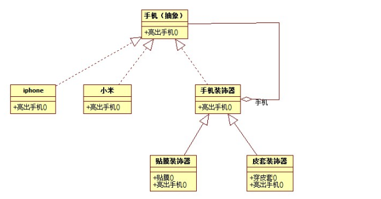
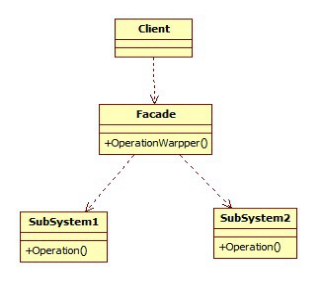
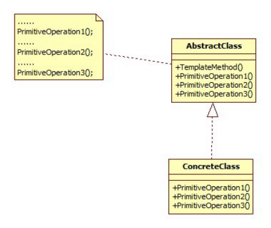
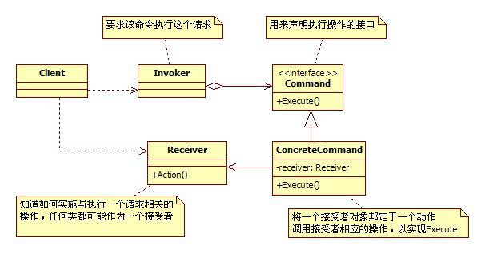

# 设计模式

---

[TOC]

<!-- toc -->

---

## 1.设计模式概述

如果把修习软件开发当做武功修炼的话，那么可以分为招式和内功。

招式： Java、C\#、C++等编程语言；

​		Eclipse、Visual Studio等开发工具；

​		JSP、ASP.net等开发技术；

​		Struts、Hibernate、JBPM等框架技术；

内功： 数据结构、算法、设计模式、重构、软件工程

每一位软件开发人员也都希望成为一名兼具淋漓招式和深厚内功的“上乘”软件工程师，而对设计模式的学习与领悟将会让你“内功”大增，再结合你日益纯熟的“招式”，你的软件开发“功力”一定会达到一个新的境界。

招式可以很快学会，但是内功的修炼需要更长的时间。

### 1.1 设计模式从何而来

Christopher Alexander（克里斯托弗.亚历山大）——哈佛大学建筑学博士、美国加州大学伯克利分校建筑学教授、加州大学伯克利分校环境结构研究所所长、美国艺术和科学院院士。

  “每个模式都描述了一个在我们的环境中不断出现的问题，然后描述了该问题的解决方案的核心，通过这种方式，我们可以无数次地重用那些已有的成功的解决方案，无须再重复相同的工作。”  ——《建筑的永恒之道》by Christopher Alexander

Christopher Alexander在《建筑的永恒之道》中给出了设计模式的定义，这些话可以总结出一句话那就是：“设计模式是在特定环境下人们解决某类重复出现问题的一套成功或有效的解决方案。”——（设计模式的定义）

### 1.2 软件设计模式又从何而来

四人组（Gang of Four），简称GoF

Ralph Johnson，Richard Helm，Erich Gamma，John Vlissides

GoF将模式的概念引入软件工程领域，这标志着软件模式的诞生。软件模式(Software Patterns)是将模式的一般概念应用于软件开发领域，即软件开发的总体指导思路或参照样板。软件模式并非仅限于设计模式，还包括架构模式、分析模式和过程模式等，实际上，在软件开发生命周期的每一个阶段都存在着一些被认同的模式。

软件模式与具体的应用领域无关，也就是说无论你从事的是移动应用开发、桌面应用开发、Web应用开发还是嵌入式软件的开发，都可以使用软件模式。无论你是使用Java、C\#、Objective-C、VB.net、Smalltalk等纯面向对象编程语言，还是使用C++、PHP、Delphi、JavaScript等可支持面向对象编程的语言，你都需要了解软件设计模式！

我们可用一句大白话：“**在一定环境下，用固定套路解决问题。**”

### 1.3 软件设计模式的种类

GoF提出的设计模式有23个，包括：

- **创建型**(Creational)模式： 如何**创建**对象；
- **结构型**(Structural )模式： 如何实现类或对象的**组合**；
- **行为型**(Behavioral)模式： 类或对象怎样**交互**以及怎样分配职责。

有一个“简单工厂模式”不属于GoF 23种设计模式，但大部分的设计模式书籍都会对它进行专门的介绍。

设计模式目前种类： GoF的23种 + “简单工厂模式” = 24种。

### 1.4 软件设计模式有什么用？

从高端来讲的话，那么作用大了去了，这里我们也体会不到，那么对于初学者来说，**学习设计模式将有助于更加深入地理解面向对象思想**, 让你知道：

1. 如何将代码分散在几个不同的类中？
2. 为什么要有“接口”？
3. 何谓针对抽象编程？
4. 何时不应该使用继承？
5. 如果不修改源代码增加新功能？
6. 更好地阅读和理解现有类库与其他系统中的源代码。

学习设计模式会让你早点脱离面向对象编程的“菜鸟期”。

如何学好设计模式

设计模式的**基础**是：**多态**。

初学者： 积累案例， 不要盲目的背类图。

初级开发人员：多思考，多梳理，归纳总结，尊重事物的认知规律，注意临界点的突破，不要浮躁。

中级开发人员：合适的开发环境，寻找合适的设计模式来解决问题。

多应用， 对经典则组合设计模式的大量，自由的运用。要不断的追求。

### 1.5 设计模式总览表

| 模式类别                             | 模式名称            | 作用                                                         |
| ------------------------------------ | ------------------- | ------------------------------------------------------------ |
| 创建型模式 Creational Pattern（5+1） | 单例模式★★★★☆       | 是保证一个类仅有一个实例，并提供一个访问它的全局访问点。     |
|                                      | (简单工厂模式)★★★☆☆ | 通过专门定义一个类来负责创建其他类的实例，被创建的实例通常都具有共同的父类。 |
|                                      | 工厂方法模式★★★★★   | 定义一个创建产品对象的工厂接口，将实际创建工作推迟到子类中。 |
|                                      | 抽象工厂模式★★★★★   | 提供一个创建一系列相关或者相互依赖的接口，而无需指定它们具体的类。 |
|                                      | 原型模式★★★☆☆       | 用原型实例指定创建对象的种类，并且通过拷贝这些原型创建新的对象。 |
|                                      | 建造者模式★★☆☆☆     | 将一个复杂的构建与其表示相分离，使得同样的构建过程可以创建不同的表示。 |

| 模式类别                          | 模式名称        | 作用                                                         |
| --------------------------------- | --------------- | ------------------------------------------------------------ |
| 结构型模式Structural Pattern（7） | 适配器模式★★★★☆ | 将一个类的接口转换成客户希望的另外一个接口。使得原本由于接口不兼容而不能一起工作的那些类可以一起工作。 |
|                                   | 桥接模式★★★☆☆   | 将抽象部分与实际部分分离，使它们都可以独立的变化。           |
|                                   | 组合模式★★☆☆☆   | 将对象组合成树形结构以表示“部分--整体”的层次结构。使得用户对单个对象和组合对象的使用具有一致性。 |
|                                   | 装饰模式★★★☆☆   | 动态的给一个对象添加一些额外的职责。就增加功能来说，此模式比生成子类更为灵活。 |
|                                   | 外观模式★★★★★   | 为子系统中的一组接口提供一个一致的界面，此模式定义了一个高层接口，这个接口使得这一子系统更加容易使用。 |
|                                   | 享元模式★☆☆☆☆   | 以共享的方式高效的支持大量的细粒度的对象。                   |
|                                   | 代理模式★★★★☆   | 为其他对象提供一种代理以控制对这个对象的访问。               |

| 模式类别                           | 模式名称          | 作用                                                         |
| ---------------------------------- | ----------------- | ------------------------------------------------------------ |
| 行为型模式Behavioral Pattern（11） | 职责链模式★★☆☆☆   | 在该模式里，很多对象由每一个对象对其下家的引用而连接起来形成一条链。请求在这个链上传递，直到链上的某一个对象决定处理此请求，这使得系统可以在不影响客户端的情况下动态地重新组织链和分配责任。 |
|                                    | 命令模式★★★★☆     | 将一个请求封装为一个对象，从而使你可用不同的请求对客户端进行参数化；对请求排队或记录请求日志，以及支持可撤销的操作。 |
|                                    | 解释器模式★☆☆☆☆   | 如何为简单的语言定义一个语法，如何在该语言中表示一个句子，以及如何解释这些句子。 |
|                                    | 迭代器模式★☆☆☆☆   | 提供了一种方法顺序来访问一个聚合对象中的各个元素，而又不需要暴露该对象的内部表示。 |
|                                    | 中介者模式★★☆☆☆   | 定义一个中介对象来封装系列对象之间的交互。终结者使各个对象不需要显示的相互调用 ，从而使其耦合性松散，而且可以独立的改变他们之间的交互。 |
|                                    | 备忘录模式★★☆☆☆   | 是在不破坏封装的前提下，捕获一个对象的内部状态，并在该对象之外保存这个状态。 |
|                                    | 观察者模式★★★★★   | 定义对象间的一种一对多的依赖关系，当一个对象的状态发生改变时，所有依赖于它的对象都得到通知并被自动更新。 |
|                                    | 状态模式★★☆☆☆     | 对象的行为，依赖于它所处的状态。                             |
|                                    | 策略模式★★★★☆     | 准备一组算法，并将每一个算法封装起来，使得它们可以互换。     |
|                                    | 模板方法模式★★★☆☆ | 得子类可以不改变一个算法的结构即可重定义该算法的某些特定步骤。 |
|                                    | 访问者模式★☆☆☆☆   | 表示一个作用于某对象结构中的各元素的操作，它使你可以在不改变各元素的类的前提下定义作用于这些元素的新操作。 |

## 2.面向对象设计原则

对于面向对象软件系统的设计而言，在支持可维护性的同时，提高系统的可复用性是一个至关重要的问题，如何同时提高一个软件系统的可维护性和可复用性是面向对象设计需要解决的核心问题之一。在面向对象设计中，可维护性的复用是以设计原则为基础的。每一个原则都蕴含一些面向对象设计的思想，可以从不同的角度提升一个软件结构的设计水平。

面向对象设计原则为支持可维护性复用而诞生，这些原则蕴含在很多设计模式中，它们是从许多设计方案中总结出的指导性原则。面向对象设计原则也是我们用于评价一个设计模式的使用效果的重要指标之一。

原则的目的： 高内聚，低耦合

### 2.0 面向对象设计原则

设计原则

- 单一职责原则
- 开闭原则
- 里氏代换原则
- 依赖倒转原则
- 接口隔离原则
- 合成复用原则
- 迪米特法则(最少知识)

| 名称                                               | 定义                                                         |
| -------------------------------------------------- | ------------------------------------------------------------ |
| 单一职责原则(Single Responsibility Principle, SRP) | 类的职责单一，对外只提供一种功能，而引起类变化的原因都应该只有一个。 |
| 开闭原则(Open-Closed Principle, OCP)               | 类的改动是通过增加代码进行的，而不是修改源代码。             |
| 里氏代换原则(Liskov Substitution Principle, LSP)   | 任何抽象类出现的地方都可以用他的实现类进行替换，实际就是虚拟机制，语言级别实现面向对象功能。 |
| 依赖倒转原则(Dependence  Inversion Principle, DIP) | 依赖于抽象(接口)，不要依赖具体的实现(类)，也就是针对接口编程。 |
| 接口隔离原则(Interface Segregation Principle, ISP) | 不应该强迫用户的程序依赖他们不需要的接口方法。一个接口应该只提供一种对外功能，不应该把所有操作都封装到一个接口中去。 |
| 合成复用原则(Composite Reuse Principle, CRP)       | 如果使用继承，会导致父类的任何变换都可能影响到子类的行为。如果使用对象组合，就降低了这种依赖关系。对于继承和组合，优先使用组合。 |
| 迪米特法则(Law of Demeter, LoD)(最少知识)          | 一个对象应当对其他对象尽可能少的了解，从而降低各个对象之间的耦合，提高系统的可维护性。例如在一个程序中，各个模块之间相互调用时，通常会提供一个统一的接口来实现。这样其他模块不需要了解另外一个模块的内部实现细节，这样当一个模块内部的实现发生改变时，不会影响其他模块的使用。（黑盒原理） |

### 2.1 开闭原则案例

### 2.2 迪米特法则案例

### 2.3 合成复用原则案例

### 2.4 依赖倒转原则案例

传统的设计模式通常是自顶向下逐级依赖，这样，底层模块，中间层模块和高层模块的耦合度极高，若任意修改其中的一个，很容易导致全面积的修改，非常麻烦，那么依赖倒转原则利用多态的先天特性，对中间抽象层进行依赖，这样，底层和高层之间进行了**解耦合**。

## 3.创建型模型

### 3.1 简单工厂模式

简单工厂模式并不属于GoF的23种设计模式。

那么为什么我要用工厂模式呢？请看下面的一段程序。

>   //水果类
>   class Fruit{
>   public:
>   Fruit(string name){
>   m\_name = name; }
>   void showFruitName(){
>   if (m\_name.compare("apple") == 0){
>   cout &lt;&lt; "我是苹果" &lt;&lt; endl;}
>   else if (m\_name.compare("banana")==0){
>   cout &lt;&lt; "我是香蕉" &lt;&lt; endl;}
>   else if (m\_name.compare("pear") == 0){
>   cout &lt;&lt; "我是鸭梨" &lt;&lt; endl;}}
>   private:
>   string m\_name;
>   };
>

不难看出，Fruit类是一个“巨大的”类，在该类的设计中存在如下几个问题： 

(1) 在Fruit类中包含很多“if…else…”代码块，整个类的代码相当冗长，代码越长，阅读难度、维护难度和测试难度也越大；而且大量条件语句的存在还将影响系统的性能，程序在执行过程中需要做大量的条件判断。

\(2) Fruit类的职责过重，它负责初始化和显示所有的水果对象，将各种水果对象的初始化代码和显示代码集中在一个类中实现，违反了“单一职责原则”，不利于类的重用和维护；

\(3) 当需要增加新类型的水果时，必须修改Fruit类的源代码，违反了“开闭原则”。

#### 3.1.1 简单工厂模式中的角色和职责

工厂（Factory）角色：简单工厂模式的核心，它负责实现创建所有实例的内部逻辑。工厂类可以被外界直接调用，创建所需的产品对象。

抽象产品（AbstractProduct）角色：简单工厂模式所创建的所有对象的父类，它负责描述所有实例所共有的公共接口。

具体产品（Concrete Product）角色：简单工厂模式所创建的具体实例对象。

#### 3.1.2 简单工厂模式案例

#### 3.1.3 简单工厂模式的优缺点

**优点：**

1. 实现了对象创建和使用的分离。
2. 不需要记住具体类名，记住参数即可，减少使用者记忆量。

**缺点：**

1. 对工厂类职责过重，一旦不能工作，系统受到影响。
2. 增加系统中类的个数，复杂度和理解度增加。
3. 违反“开闭原则”，添加新产品需要修改工厂逻辑，工厂越来越复杂。

#### 3.1.4 适用场景

1. 工厂类负责创建的对象比较少，由于创建的对象较少，不会造成工厂方法中的业务逻辑太过复杂。
2. 客户端只知道传入工厂类的参数，对于如何创建对象并不关心。

### 3.2 工厂方法模式

工厂方法(Factory Method)模式的意义是定义一个创建产品对象的工厂接口，将实际创建工作推迟到子类当中。核心工厂类不再负责产品的创建，这样核心类成为一个抽象工厂角色，仅负责具体工厂子类必须实现的接口，这样进一步抽象化的好处是使得工厂方法模式可以使系统在不修改具体工厂角色的情况下引进新的产品。

工厂方法模式是简单工厂模式的衍生，解决了许多简单工厂模式的问题。首先完全实现‘开－闭 原则’，实现了可扩展。

#### 3.2.1 工厂方法模式中的角色与职责

抽象工厂（Abstract Factory）角色：工厂方法模式的核心，任何工厂类都必须实现这个接口。

具体工厂（Concrete Factory）角色：具体工厂类是抽象工厂的一个实现，负责实例化产品对象。

抽象产品（Abstract Product）角色：工厂方法模式所创建的所有对象的父类，它负责描述所有实例所共有的公共接口。

具体产品（Concrete Product）角色：工厂方法模式所创建的具体实例对象。

简单工厂模式 + “开闭原则” = 工厂方法模式

#### 3.2.2 工厂方法模式案例

#### 3.1.3 工厂方法模式的优缺点

**优点：**  

1. 不需要记住具体类名，甚至连具体参数都不用记忆。
2. 实现了对象创建和使用的分离。
3. 系统的可扩展性也就变得非常好，无需修改接口和原类。

**缺点：**

1. 增加系统中类的个数，复杂度和理解度增加。
2. 增加了系统的抽象性和理解难度。

#### 3.1.4 适用场景

1. 客户端不知道它所需要的对象的类。
2. 抽象工厂类通过其子类来指定创建哪个对象。

### 3.3 抽象工厂模式

工厂方法模式通过引入工厂等级结构，解决了简单工厂模式中工厂类职责太重的问题，但由于工厂方法模式中的每个工厂只生产一类产品，可能会导致系统中存在大量的工厂类，势必会增加系统的开销。此时，我们可以考虑将一些相关的产品组成一个“产品族，由同一个工厂来统一生产，这就是我们本文将要学习的抽象工厂模式的基本思想。

1.当我们想添加一个新产品的时候，比如葡萄，虽然不用修改代码，但是我们需要添加大量的类，而且还需要添加相对的工厂。（系统开销，维护成本）

2.如果我们使用同一地域的水果（日本，日本，日本），那么我们需要分别创建具体的工厂，如果选择出现失误，将会造成混乱，虽然可以加一些约束，但是代码实现变得复杂。

#### 3.3.1 模式中的角色和职责

{width="6.125in" height="4.645833333333333in"}

抽象工厂（Abstract Factory）角色：它声明了一组用于创建一族产品的方法，每一个方法对应一种产品。

具体工厂（Concrete Factory）角色：它实现了在抽象工厂中声明的创建产品的方法，生成一组具体产品，这些产品构成了一个产品族，每一个产品都位于某个产品等级结构中。

抽象产品（Abstract Product）角色：它为每种产品声明接口，在抽象产品中声明了产品所具有的业务方法。

具体产品（Concrete Product）角色：它定义具体工厂生产的具体产品对象，实现抽象产品接口中声明的业务方法。

#### 3.3.2 抽象工厂模式案例

#### 3.3.3 抽象工厂模式的优缺点

**优点：**

1. 拥有工厂方法模式的优点
2. 当一个产品族中的多个对象被设计成一起工作时，它能够保证客户端始终只使用同一个产品族中的对象。
3. 增加新的产品族很方便，无须修改已有系统，符合“开闭原则”。

**缺点：**

1. 增加新的产品等级结构麻烦，需要对原有系统进行较大的修改，甚至需要修改抽象层代码，这显然会带来较大的不便，违背了“开闭原则”。

#### 3.3.4 适用场景

1. 系统中有多于一个的产品族。而每次只使用其中某一产品族。可以通过配置文件等方式来使得用户可以动态改变产品族，也可以很方便地增加新的产品族。
2. 产品等级结构稳定。设计完成之后，不会向系统中增加新的产品等级结构或者删除已有的产品等级结构。

#### 3.3.5 抽象工厂模式练习题

设计一个电脑主板架构，电脑包括（显卡，内存，CPU）3个固定的插口，显卡具有显示功能（display，功能实现只要打印出意义即可）， 内存具有存储功能（storage），cpu具有计算功能（calculate）。

现有Intel厂商，nvidia厂商，Kingston厂商，均会生产以上三种硬件。要求组装两台电脑：

1台（Intel的CPU，Intel的显卡，Intel的内存）

1台（Intel的CPU， nvidia的显卡，Kingston的内存）

用抽象工厂模式实现。

### 3.4 单例模式

单例模式是一种常用的软件设计模式。在它的核心结构中只包含一个被称为单例的特殊类。通过单例模式可以保证系统中一个类只有一个实例而且该实例易于外界访问，从而方便对实例个数的控制并节约系统资源。如果希望在系统中某个类的对象只能存在一个，单例模式是最好的解决方案。

#### 3.4.1 单例模式中的角色和职责

Singleton（单例）：在单例类的内部实现只生成一个实例，同时它提供一个**静态**的getInstance()**方法**，让客户可以访问它的唯一实例；为了防止在外部对其实例化，将其**构造函数**设计为**私有**；在单例类内部定义了一个Singleton类型的**静态对象**，作为外部共享的唯一实例。

**如何构建单例:**

1. 单例模式的类只提供**私有**的**构造函数**，
2. 类定义中含有一个该类的**静态私有对象**，
3. 该类提供了一个**静态**的公有的**方法**用于创建或获取它本身的静态私有对象。

/\* 懒汉式 \*/ 

//懒汉式,线程不安全

/\*饿汉式\*/ 

//饿汉式,线程安全

#### 3.4.2 单例碰到多线程

  // 饿汉式单例碰到多线程测试

  // 懒汉式单例碰到多线程

练习：用单例模式，模拟公司员工使用打印机场景，打印机可以打印员工要输出的内容，并且可以累积打印机使用次数

思考：当单例模式中的懒汉模式遇见多线程，改怎么办？

#### 3.4.3 单例模式的优缺点

**优点: **

1. 单例模式提供了对唯一实例的受控访问。
2. 节约系统资源。由于在系统内存中只存在一个对象。

**缺点: **

1. 扩展略难。单例模式中没有抽象层。
2. 单例类的职责过重。

#### 3.4.4 适用场景

\(1) 系统只需要一个实例对象，如系统要求提供一个唯一的序列号生成器或资源管理器，或者需要考虑资源消耗太大而只允许创建一个对象。

\(2) 客户调用类的单个实例只允许使用一个公共访问点，除了该公共访问点，不能通过其他途径访问该实例。

## 4.结构型模式

让类和类进行组合，获得更大的结构。

### 4.1 代理模式

代理模式的定义：**为其他对象提供一种代理以控制对这个对象的访问**。在某些情况下，一个对象不适合或者不能直接引用另一个对象，而代理对象可以在客户端和目标对象之间起到中介的作用。

#### 4.1.1模式中的角色和职责

subject（抽象主题角色）：真实主题与代理主题的共同接口。

RealSubject（真实主题角色）：定义了代理角色所代表的真实对象。

Proxy（代理主题角色）：含有对真实主题角色的引用，代理角色通常在将客户端调用传递给真是主题对象之前或者之后执行某些操作，而不是单纯返回真实的对象。

#### 4.1.2 代理模式的案例

 

#### 4.1.3代理模式的优缺点

**优点：**

1. 能够协调调用者和被调用者，在一定程度上降低了系统的耦合度。
2. 客户端可以针对抽象主题角色进行编程，增加和更换代理类无须修改源代码，符合开闭原则，系统具有较好的灵活性和可扩展性。

**缺点:**

1. 代理实现较为复杂。

#### 4.1.4 适用场景

为其他对象提供一种代理以控制对这个对象的访问。

#### 4.1.5 代理模式练习题

1 定义真实玩家(李逍遥)

2 定义代理玩家

3 代理玩家代替李逍遥打怪升级

### 4.2 装饰模式

装饰模式又叫包装模式，通过一种对客户端透明的方式来扩展对象功能，是继承关系的一种替代。

装饰模式就是把要附加的功能分别放在单独的类中，并让这个类包含它要装饰的对象，当需要执行时，客户端就可以有选择的、按顺序的使用装饰功能包装对象。

#### 4.2.1装饰模式中的角色和职责

Component（抽象构件）：它是具体构件和抽象装饰类的共同父类，声明了在具体构件中实现的业务方法，它的引入可以使客户端以一致的方式处理未被装饰的对象以及装饰之后的对象，实现客户端的透明操作。

ConcreteComponent（具体构件）：它是抽象构件类的子类，用于定义具体的构件对象，实现了在抽象构件中声明的方法，装饰器可以给它增加额外的职责（方法）。

Decorator（抽象装饰类）：它也是抽象构件类的子类，用于给具体构件增加职责，但是具体职责在其子类中实现。它维护一个指向抽象构件对象的引用，通过该引用可以调用装饰之前构件对象的方法，并通过其子类扩展该方法，以达到装饰的目的。

ConcreteDecorator（具体装饰类）：它是抽象装饰类的子类，负责向构件添加新的职责。每一个具体装饰类都定义了一些新的行为，它可以调用在抽象装饰类中定义的方法，并可以增加新的方法用以扩充对象的行为。

#### 4.2.2装饰模式案例

#### 4.2.3装饰模式的优缺点

**优点：**

1. 对于扩展一个对象的功能，装饰模式比继承更加灵活性，不会导致类的个数急剧增加。
2. 可以通过一种动态的方式来扩展一个对象的功能，从而实现不同的行为。
3. 可以对一个对象进行多次装饰。
4. 具体构件类与具体装饰类可以独立变化，用户可以根据需要增加新的具体构件类和具体装饰类，原有类库代码无须改变，符合“开闭原则”。

**缺点：**

1. 使用装饰模式进行系统设计时将产生很多小对象，大量小对象的产生势必会占用更多的系统资源，影响程序的性能。

#### 4.2.4 适用场景

1. 动态、透明的方式给单个对象添加职责。
2. 当不能采用继承的方式对系统进行扩展或者采用继承不利于系统扩展和维护时可以使用装饰模式。

装饰器模式关注于在一个对象上动态的添加方法，然而代理模式关注于控制对对象的访问。换句话说，用代理模式，代理类（proxy class）可以对它的客户隐藏一个对象的具体信息。因此，当使用代理模式的时候，我们常常在一个代理类中创建一个对象的实例。并且，当我们使用装饰器模式的时候，我们通常的做法是将原始对象作为一个参数传给装饰者的构造器。

### 4.3 外观模式

根据迪米特法则，如果两个类不必彼此直接通信，那么这两个类就不应当发生直接的相互作用。

Facade模式也叫外观模式，是由GoF提出的23种设计模式中的一种。Facade模式为一组具有类似功能的类群，比如类库，子系统等等，提供一个一致的简单的界面。这个一致的简单的界面被称作facade。

#### 4.3.1外观模式中角色和职责

Façade(外观角色)：为调用方, 定义简单的调用接口。

SubSystem(子系统角色)：功能提供者。指提供功能的类群（模块或子系统） 。

#### 4.3.2外观模式案例

根据类图，实现家庭影院外观模式应用。

实现KTV模式：电视打开，灯关掉，音响打开，麦克风打开，dvd打开；

实现游戏模式：电视打开，音响打开，游戏机打开。

#### 4.3.3外观模式的优缺点

**优点：**

1. 它对客户端屏蔽了子系统组件，减少了客户端所需处理的对象数目，并使得子系统使用起来更加容易。通过引入外观模式，客户端代码将变得很简单，与之关联的对象也很少。
2. 它实现了子系统与客户端之间的松耦合关系，这使得子系统的变化不会影响到调用它的客户端，只需要调整外观类即可。
3. 一个子系统的修改对其他子系统没有任何影响。

**缺点：**

1. 不能很好地限制客户端直接使用子系统类，如果对客户端访问子系统类做太多的限制则减少了可变性和灵活性。
2. 如果设计不当，增加新的子系统可能需要修改外观类的源代码，违背了开闭原则。

#### 4.3.4适用场景

1. 复杂系统需要简单入口使用。
1. 客户端程序与多个子系统之间存在很大的依赖性。
2. 在层次化结构中，可以使用外观模式定义系统中每一层的入口，层与层之间不直接产生联系，而通过外观类建立联系，降低层之间的耦合度。

### 4.4 适配器模式

​							5V &lt;————&gt; 适配器 &lt;————&gt; 220V

将一个类的接口转换成客户希望的另外一个接口。使得原本由于接口不兼容而不能一起工作的那些类可以一起工作。

#### 4.4.1 适配器模式中的角色和职责

Target（目标抽象类）：目标抽象类定义客户所需接口，可以是一个抽象类或接口，也可以是具体类。

Adapter（适配器类）：适配器可以调用另一个接口，作为一个转换器，对Adaptee和Target进行适配，适配器类是适配器模式的核心，在对象适配器中，它通过继承Target并关联一个Adaptee对象使二者产生联系。

Adaptee（适配者类）：适配者即被适配的角色，它定义了一个已经存在的接口，这个接口需要适配，适配者类一般是一个具体类，包含了客户希望使用的业务方法，在某些情况下可能没有适配者类的源代码。

根据对象适配器模式结构图，在对象适配器中，客户端需要调用request()方法，而适配者类Adaptee没有该方法，但是它所提供的specificRequest()方法却是客户端所需要的。为了使客户端能够使用适配者类，需要提供一个包装类Adapter，即适配器类。这个包装类包装了一个适配者的实例，从而将客户端与适配者衔接起来，在适配器的request()方法中调用适配者specificRequest()方法。因为适配器类与适配者类是关联关系（也可称之为委派关系），所以这种适配器模式称为对象适配器模式。

#### 4.4.2适配器模式的案例

#### 4.4.3适配器模式优缺点

**优点：**

1. 将目标类和适配者类解耦，通过引入一个适配器类来重用现有的适配者类，无须修改原有结构。

2. 增加了类的透明性和复用性，将具体的业务实现过程封装在适配者类中，对于客户端类而言是透明的，而且提高了适配者的复用性，同一个适配者类可以在多个不同的系统中复用。
3. 灵活性和扩展性都非常好，可以很方便地更换适配器，也可以在不修改原有代码的基础上增加新的适配器类，完全符合“开闭原则”。

**缺点: **

1. 适配器中置换适配者类的某些方法比较麻烦。

#### 4.4.4适应场景

1. 系统需要使用一些现有的类，而这些类的接口（如方法名）不符合系统的需要，甚至没有这些类的源代码。
2. 想创建一个可以重复使用的类，用于与一些彼此之间没有太大关联的一些类，包括一些可能在将来引进的类一起工作。

## 5.行为型模式

用来对类或对象怎样交互和怎样分配职责进行描述。

### 5.1 模板方法模式

定义一个操作中算法的框架，而将一些步骤延迟到子类中。模板方法模式使得子类可以不改变一个算法的结构即可重定义该算法的某些特定步骤。

#### 5.1.1 模板方法模式中的角色和职责

AbstractClass（抽象类）：在抽象类中定义了一系列基本操作，这些基本操作可以是具体的，也可以是抽象的，每一个基本操作对应算法的一个步骤，在其子类中可以重定义或实现这些步骤。同时，在抽象类中实现了一个模板方法(Template Method)，用于定义一个算法的框架，模板方法不仅可以调用在抽象类中实现的基本方法，也可以调用在抽象类的子类中实现的基本方法，还可以调用其他对象中的方法。

ConcreteClass（具体子类）：它是抽象类的子类，用于实现在父类中声明的抽象基本操作以完成子类特定算法的步骤，也可以覆盖在父类中已经实现的具体基本操作。

#### 5.1.2 模板方法模式的案例

#### 5.1.3 模板方法的优缺点

**优点：**

1. 在父类中形式化地定义一个算法，而由它的子类来实现细节的处理，在子类实现详细的处理算法时并不会改变算法中步骤的执行次序。

2. 模板方法模式是一种代码复用技术，它在类库设计中尤为重要，它提取了类库中的公共行为，将公共行为放在父类中，而通过其子类来实现不同的行为，它鼓励我们恰当使用继承来实现代码复用。

3. 可实现一种反向控制结构，通过子类覆盖父类的钩子方法来决定某一特定步骤是否需要执行。
4. 在模板方法模式中可以通过子类来覆盖父类的基本方法，不同的子类可以提供基本方法的不同实现，更换和增加新的子类很方便，符合单一职责原则和开闭原则。

**缺点：**

1. 需要为每一个基本方法的不同实现提供一个子类，如果父类中可变的基本方法太多，将会导致类的个数增加，系统更加庞大，设计也更加抽象。

#### 5.1.4 适用场景

1. 具有统一的操作步骤或操作过程;

2. 具有不同的操作细节;
3. 存在多个具有同样操作步骤的应用场景，但某些具体的操作细节却各不相同;

在抽象类中统一操作步骤，并规定好接口；让子类实现接口。这样可以把各个具体的子类和操作步骤解耦合。

### 5.2 命令模式

将一个请求封装为一个对象，从而让我们可用不同的请求对客户进行参数化；对请求排队或者记录请求日志，以及支持可撤销的操作。命令模式是一种对象行为型模式，其别名为动作(Action)模式或事务(Transaction)模式。

命令模式可以将请求发送者和接收者完全解耦，发送者与接收者之间没有直接引用关系，发送请求的对象只需要知道如何发送请求，而不必知道如何完成请求。

命令模式的本质是对请求进行封装，一个请求对应于一个命令，将发出命令的责任和执行命令的责任分割开。

#### 5.2.1 命令模式中的角色和职责

Command（抽象命令类）：抽象命令类一般是一个抽象类或接口，在其中声明了用于执行请求的execute()等方法，通过这些方法可以调用请求接收者的相关操作。

ConcreteCommand（具体命令类）：具体命令类是抽象命令类的子类，实现了在抽象命令类中声明的方法，它对应具体的接收者对象，将接收者对象的动作绑定其中。在实现execute()方法时，将调用接收者对象的相关操作(Action)。

Invoker（调用者）：调用者即请求发送者，它通过命令对象来执行请求。一个调用者并不需要在设计时确定其接收者，因此它只与抽象命令类之间存在关联关系。在程序运行时可以将一个具体命令对象注入其中，再调用具体命令对象的execute()方法，从而实现间接调用请求接收者的相关操作。

Receiver（接收者）：接收者执行与请求相关的操作，它具体实现对请求的业务处理。

#### 5.2.2 命令模式的案例

#### 5.2.3 命令模式练习题

联想路边撸串烧烤场景， 有烤羊肉，烧鸡翅命令，有烤串师傅，和服务员MM。根据命令模式，设计烤串场景。

#### 5.2.4 命令模式的优缺点

**优点：**

1. 降低系统的耦合度。由于请求者与接收者之间不存在直接引用，因此请求者与接收者之间实现完全解耦，相同的请求者可以对应不同的接收者，同样，相同的接收者也可以供不同的请求者使用，两者之间具有良好的独立性。

2. 新的命令可以很容易地加入到系统中。由于增加新的具体命令类不会影响到其他类，因此增加新的具体命令类很容易，无须修改原有系统源代码，甚至客户类代码，满足“开闭原则”的要求。

3. 可以比较容易地设计一个命令队列或宏命令（组合命令）。

**缺点：**

1. 使用命令模式可能会导致某些系统有过多的具体命令类。因为针对每一个对请求接收者的调用操作都需要设计一个具体命令类，因此在某些系统中可能需要提供大量的具体命令类，这将影响命令模式的使用。

#### 5.2.5 适用场景

1. 系统需要将请求调用者和请求接收者解耦，使得调用者和接收者不直接交互。请求调用者无须知道接收者的存在，也无须知道接收者是谁，接收者也无须关心何时被调用。

2. 系统需要在不同的时间指定请求、将请求排队和执行请求。一个命令对象和请求的初始调用者可以有不同的生命期，换言之，最初的请求发出者可能已经不在了，而命令对象本身仍然是活动的，可以通过该命令对象去调用请求接收者，而无须关心请求调用者的存在性，可以通过请求日志文件等机制来具体实现。
3. 系统需要将一组操作组合在一起形成宏命令。

### 5.3 策略模式

策略模式定义了一系列的算法，并将每一个算法封装起来，而且使它们还可以相互替换。策略模式让算法独立于使用它的客户而独立变化。

#### 5.3.1 策略模式中的角色和职责

Context（环境类）：环境类是使用算法的角色，它在解决某个问题（即实现某个方法）时可以采用多种策略。在环境类中维持一个对抽象策略类的引用实例，用于定义所采用的策略。

Strategy（抽象策略类）：它为所支持的算法声明了抽象方法，是所有策略类的父类，它可以是抽象类或具体类，也可以是接口。环境类通过抽象策略类中声明的方法在运行时调用具体策略类中实现的算法。

ConcreteStrategy（具体策略类）：它实现了在抽象策略类中声明的算法，在运行时，具体策略类将覆盖在环境类中定义的抽象策略类对象，使用一种具体的算法实现某个业务处理。

#### 5.3.2 策略模式案例

#### 5.3.3 策略模式练习题

商场促销有策略A（0.8折） 策略B（消费满200，返现100），用策略模式模拟场景。

#### 5.3.4 策略模式的优缺点

**优点：**

1. 策略模式提供了对“开闭原则”的完美支持，用户可以在不修改原有系统的基础上选择算法或行为，也可以灵活地增加新的算法或行为。

2. 使用策略模式可以避免多重条件选择语句。多重条件选择语句不易维护，它把采取哪一种算法或行为的逻辑与算法或行为本身的实现逻辑混合在一起，将它们全部硬编码(Hard Coding)在一个庞大的多重条件选择语句中，比直接继承环境类的办法还要原始和落后。
3. 策略模式提供了一种算法的复用机制。由于将算法单独提取出来封装在策略类中，因此不同的环境类可以方便地复用这些策略类。

**缺点：**

1. 客户端必须知道所有的策略类，并自行决定使用哪一个策略类。这就意味着客户端必须理解这些算法的区别，以便适时选择恰当的算法。换言之，策略模式只适用于客户端知道所有的算法或行为的情况。
2. 策略模式将造成系统产生很多具体策略类，任何细小的变化都将导致系统要增加一个新的具体策略类。

#### 5.3.5 适用场景

准备一组算法，并将每一个算法封装起来，使得它们可以互换。

### 5.4 观察者模式

随着交通信号灯的变化，汽车的行为也将随之而变化，一盏交通信号灯可以指挥多辆汽车。

观察者模式是用于建立一种对象与对象之间的依赖关系，一个对象发生改变时将自动通知其他对象，其他对象将相应作出反应。在观察者模式中，发生改变的对象称为观察目标，而被通知的对象称为观察者，一个观察目标可以对应多个观察者，而且这些观察者之间可以没有任何相互联系，可以根据需要增加和删除观察者，使得系统更易于扩展。

#### 5.4.1 观察者模式中的角色和职责

Subject（被观察者或目标，抽象主题）：被观察的对象。当需要被观察的状态发生变化时，需要通知队列中所有观察者对象。Subject需要维持（添加，删除，通知）一个观察者对象的队列列表。

ConcreteSubject（具体被观察者或目标，具体主题）：被观察者的具体实现。包含一些基本的属性状态及其他操作。

Observer（观察者）：接口或抽象类。当Subject的状态发生变化时，Observer对象将通过一个callback函数得到通知。

ConcreteObserver（具体观察者）：观察者的具体实现。得到通知后将完成一些具体的业务逻辑处理。

#### 5.4.2 观察者模式案例

#### 5.4.3 观察者模式练习题

江湖中有多个帮派，还有一名无人不知，无事不晓的百晓生。当江湖中发生武林打斗事件，百晓生作为天生的大嘴巴会广播武林消息，每个帮派的门第对于事件的处理方式均不同，同帮派被欺负，要报仇，同帮派欺负别人，叫好。用观察者模式模拟场景。

#### 5.4.4 观察者模式的优缺点

**优点：**

1. 观察者模式可以实现表示层和数据逻辑层的分离，定义了稳定的消息更新传递机制，并抽象了更新接口，使得可以有各种各样不同的表示层充当具体观察者角色。

2. 观察者模式在观察目标和观察者之间建立一个抽象的耦合。观察目标只需要维持一个抽象观察者的集合，无须了解其具体观察者。由于观察目标和观察者没有紧密地耦合在一起，因此它们可以属于不同的抽象化层次。

3. 观察者模式支持广播通信，观察目标会向所有已注册的观察者对象发送通知，简化了一对多系统设计的难度。

4. 观察者模式满足“开闭原则”的要求，增加新的具体观察者无须修改原有系统代码，在具体观察者与观察目标之间不存在关联关系的情况下，增加新的观察目标也很方便。

**缺点：**

1. 如果一个观察目标对象有很多直接和间接观察者，将所有的观察者都通知到会花费很多时间。
2. 观察者模式没有相应的机制让观察者知道所观察的目标对象是怎么发生变化的，而仅仅只是知道观察目标发生了变化。

#### 5.4.5 适用场景

1. 一个抽象模型有两个方面，其中一个方面依赖于另一个方面，将这两个方面封装在独立的对象中使它们可以各自独立地改变和复用。

2. 一个对象的改变将导致一个或多个其他对象也发生改变，而并不知道具体有多少对象将发生改变，也不知道这些对象是谁。
3. 需要在系统中创建一个触发链，A对象的行为将影响B对象，B对象的行为将影响C对象……，可以使用观察者模式创建一种链式触发机制。

