# UML统一建模语言

---

[TOC]

<!-- toc -->

---

## 1.软件建模概述

### 1.1什么是建模

任何事情都要先想清楚了才能做，软件开发更是如此！软件开发过程不可能一上来就开始盲目写代码，写代码之前必须搞清楚下面一些基本问题：

要做什么？

做成什么样？

怎么去做？

### 1.2建模原则

-   选择建立什么样的模型对如何发现和解决问题具有重要的影响。正确的模型有助于提高开发者的洞察力。
-   每个模型可以有多种表达方式. 使用者的身份和使用的原因是评判模型好坏的关键。
-   最好的模型总是能够切合实际. 模型是现实的简化，必须保证简化过程不会掩盖任何重要的细节。

### 1.3软件建模的实现过程

**软件建模的作用**是把源于现实世界的问题转化为计算机可以理解和实现的过程。

**软件建模的实现过程**是从需求入手, 用模型表达分析设计过程, 最终将模型映射成软件实现.

## 2.UML

（1）UML(United Modeling Language, **统一建模语言**): 是一种基于**面向对象的可视化建模语言. **

（2）**UML 采用了一组形象化的图形(如类图)符号作为建模语言**, 使用这些符号可以形象地描述系统的各个方面.

（3）UML 通过建立图形之间的各种关系(如类与类之间的关系)来描述模型.

### 2.1 UML一共有10种图

- 类图      ★★★★★
- 对象图   ★★★☆☆
- 包图      ★☆☆☆☆
- 组件图   ★☆☆☆☆
- 部署图   ★☆☆☆☆
- 用例图   ★★★☆☆
- 时序图   ★★★☆☆
- 协作图   ★☆☆☆☆
- 状态图   ★★☆☆☆
- 活动图   ★★☆☆☆

2.2 UML中的关系

UML中的关系主要包括4种：

- *关联关系**(association)
- *依赖关系**(dependency)
- *泛化关系**(generalization)
- *实现关系**(realization)

## 3.用例图

（1）用例图(Use Case Diagram): 也称为用户模型图, 是从软件需求分析到最终实现的第一步, 它是从客户的角度来描述系统功能.

（2）用例图包含 3 个基本组件:

参与者(Actor): 与系统打交道的人或其他系统即使用该系统的人或事物. 在 UML 中参与者用人形图标表示

用例(Use Case): 代表系统的某项完整的功能. 在 UML 中使用一个椭圆来表示

关系: 定义用例之间的关系 ------ 泛化关系, 扩展关系, 包含关系

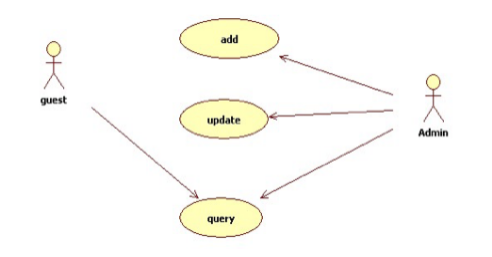

### 3.1 用例之间的关系——泛化关系

泛化关系: 表示同一业务目的(父用例)的不同技术实现(各个子用例). 在 UML 中, 用例泛化用一个三角箭头从子用例指向父用例. 以下是某购物网站为用户提供不同的支付方式

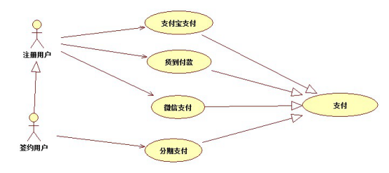

### 3.2 用例之间的关系——包含关系

一个用例可以包含其他用例具有的行为, 并把它包含的用例行为作为自身行为的一部分. 在 UML 中包含关系用虚线箭头加 “&lt;&lt;include&gt;&gt;”, 箭头指向被包含的用例.

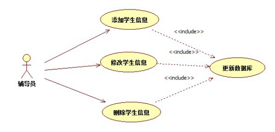

### 3.3 用例之间的关系——扩展关系

如果在完成某个功能的时候偶尔会执行另外一个功能, 则用扩展关系表示.在 UML 中扩展关系用虚线箭头加 “&lt;&lt;extend&gt;&gt;”, 箭头指向被扩展的用例.

## 4.类图

类图是面向对象系统建模中最常用的图. 是定义其他图的基础.

类图主要是用来显示系统中的类, 接口以及它们之间的关系.

类图包含的主要元素有**类**, **接口**和**关系**. 其中关系有泛化关系,关联关系, 依赖关系和实现关系. 在类图中也可以包含注释和约束.

### 4.1类的表示法

1\. 类是类图的主要组件, 由3部分组成: 类名, 属性和方法. 在 UML 中, 类用矩形来表示, 顶端部分存放类的名称, 中间部分存放类的属性, 属性的类型及值, 底部部分存放类的方法, 方法的参数和返回类型.

2.在 UML 中可以根据实际情况有选择的隐藏属性部分或方法部分或两者都隐藏

3.在 UML 中, 共有类型有 + 表示, 私有类型用 – 表示, 保护类型用 \# 表示. UML 的工具开发商可以使用自己定义的符号表示不同的可见性

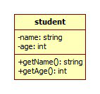

### 4.2类之间的关系-泛化关系

1\. 在 UML 中, 泛化关系用来表示**类**与**类**, 接口与接口之间的**继承**关系. 泛化关系有时也称为”is a kind of“关系.

2\. 在 UML 中泛化关系用一条实线空心箭头有子类指向父类.

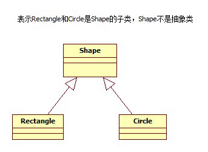

### 4.3 类之间的关系-实现关系

在 UML 中, 实现关系用来表示**类**与**接口**之间的实现关系.

在 UML 中实现关系用一条虚线空心箭头由子类指向父类

### 4.4 类之间的关系-依赖关系

对于两个相对独立的系统，当一个系统负责构造另一个系统的实例，或者依赖另一个系统的服务时，这两个系统之间体现为依赖关系. 例如生产零件的机器和零件，机器负责构造零件对象; 充电电池和充电器，充电电池通过充电器来充电;自行车Bicycle和打气筒Pump，自行车通过打气筒来充气。

### 4.5 类之间的关系-关联关系

对于两个相对独立的系统，当一个系统的实例与另一个系统的一些特定实例存在固定的对应关系时，这两个系统之间为关联关系。例如客户和订单，每个订单对应特定的客户，每个客户对应一些特定的订单；公司和员工，每个公司对应一些特定的员工，每个员工对应一特定的公司；自行车和主人，每辆自行车属于特定的主人，每个主人有特定的自行车。而充电电池和充电器之间就不存在固定的对应关系，同样自行车和打气筒之间也不存在固定的对应关系。

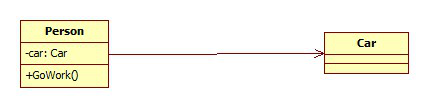

### 4.6 关联关系的名称

关联关系的名称: 关联关系可以有一个名称, 用于描述该关系的性质. 此关联名称应该是动词短语, 因为它表明源对象正在目标对象上执行动作.

### 4.7 关联关系的角色

当一个类处于关联的某一端时, 该类就在这个关系中扮演一个特定的角色. 具体来说, 角色就是关联关系中一个类对另一个类所表现的职责. 角色名称是名词或名称短语.

### 4.8 关联关系的多重性

关联关系的多重性是指有多少对象可以参与该关联, 多重性可以用来表达一个取值范围, 特定值, 无限定的范围.

### 4.9 类之间的关系关联-聚合

1\. 聚合关系是关联关系的一种，是更强的关联关系。

2\. 聚合是**整体**和**部分**之间的关系，例如汽车由引擎、轮胎以及其它零件组成。

3\. 聚合关系也是通过成员变量来实现的。但是，关联关系所涉及的两个类处在同一个层次上，而聚合关系中，两个类处于不同的层次上，一个代表整体，一个代表部分。

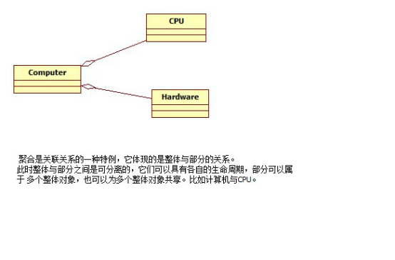

### 4.10 类之间的关系关联—组合

1\. UML类图关系中合成关系是关联关系的一种，是比聚合关系还要强的关系。

2\. 代表整体的对象负责代表部分对象的生命周期。

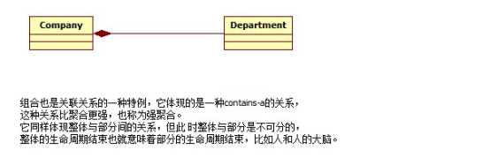

### 4.11 类图练习题

#### 4.11.1 类图练习题一

根据以下网友描述出艺人之间关系的”类：

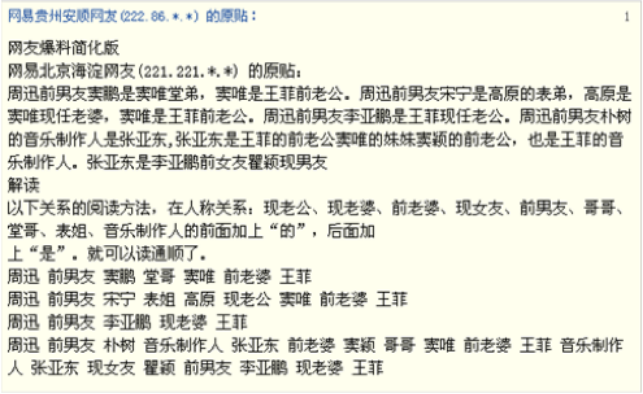

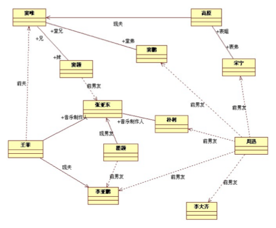

#### 4.11.2 类图练习题二

汽车和自行车都是交通工具(vehicle). 一辆自行车(bicycle)只归一个人(person)所有, 但一辆汽车(auto)可归一个人或两个人所有. 一个人可能没有自行车或汽车, 也可能有多辆自行车或汽车. 人分为男人(male)和女人(female). 每个人都有年龄(age)和名字(name). 每辆交通工具都有自己的颜色(color)和商标(brand). 每辆汽车都只有两个前灯(headlight)和一台发动机(motor)。

## 5.对象图

1\. 对象图是类图的一个实例, 用于显示系统执行时的一个可能的快照. 即在某一个时间上系统可能出现的样子. 对象图用带下划线的对象名称来表示对象.

2\. 表现对象的特征

3\. 对象图展现了多个对象的特征及对象之间的交互

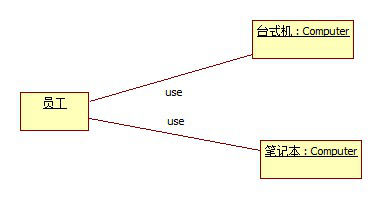

## 6.时序图

1\. 时序图用于描述对象之间的传递消息的时间顺序, 即用例中的行为顺序.

2\. 当执行一个用例时, 时序图中的每条消息对应了一个类操作或者引起转换的触发事件.

3\. 在 UML 中, 时序图表示为一个二维的关系图, 其中, 纵轴是时间轴, 时间延竖线向下延伸. 横轴代表在协作中各个独立的对象. 当对象存在时, 生命线用一条虚线表示, 消息用从一个对象的生命线到另一个对象的生命线的箭头表示. 箭头以时间的顺序在图中上下排列.

### 6.1 借书时序图

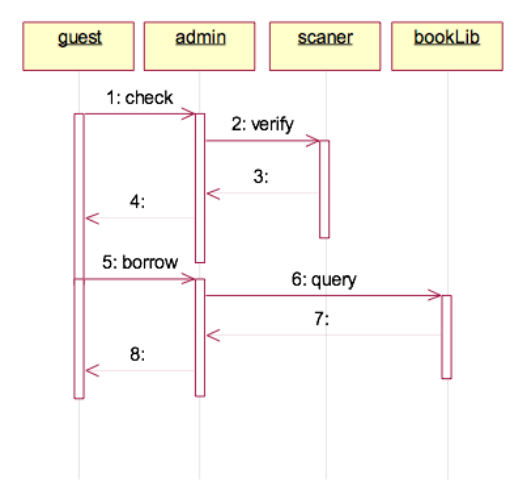

### 6.2 ATM 用户成功登陆的时序图

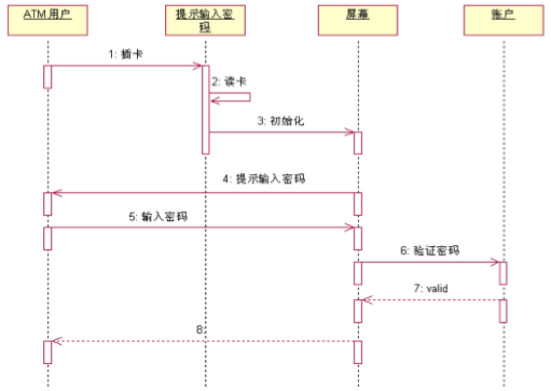

### 6.3 时序图中的基本概念

**对象**: 时序图中对象使用矩形表示, 并且对象名称下有下划线. 将对象置于时序图的顶部说明在交互开始时对象就已经存在了. 如果对象的位置不在顶部, 表示对象是在交互的过程中被创建的.

**生命线:** 生命线是一条垂直的虚线. 表示时序图中的对象在一段生命周期内的存在. 每个对象底部中心的位置都带有生命线.

**消息**: 两个对象之间的单路通信. 从发送方指向接收方. 在时序图中很少使用返回消息.

**激活**: 时序图可以描述对象的激活和钝化. 激活表示该对象被占用已完成某个任务. 钝化指对象处于空闲状态, 等待消息. 在 UML 中, 对象的激活时将对象的生命线拓宽为矩形来表示的. 矩形称为计划条或控制期. 对象就是在激活条的顶部被激活的. 对象在完成自己的工作后被钝化.

**对象的创建和销毁**: 在时序图中, 对象的默认位置是在图的顶部. 这说明对象在交互开始之前就已经存在了. 如果对象是在交互过程中创建的, 那么就应该将对象放到中间部分. 如果要撤销一个对象, 在其生命线终止点处放置 “ X” 符号.

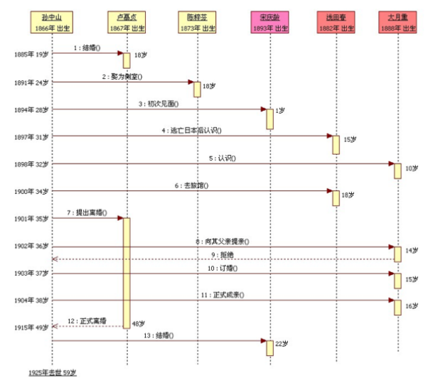

### 6.4 时序图练习题

画出三层架构登录的时序图.

## 7.活动图

在 UML 中, 活动图本质上就是流程图. 它用于描述系统的活动, 判定点和分支等.

### 7.1 活动图中的基本概念

**动作状态**: 原子的,不可中断的动作,并在此动作完成之后向另一个动作转变. 在 UML 中动作状态用圆角矩形表示,动作状态所表示的动作写在圆角矩形内部.

**分支与合并**: 分支在软件系统中很常见. 一般用于表示对象类所具有的条件行为. 用一个布尔型表达式的真假来判定动作的流向. 条件行为用分支和合并表达.在活动图中, 分支用空心小菱形表示. 分支包括一个入转换和两个带条件的出转换, 出转换的条件应该是互斥的, 须保证只有一条出转换能够被触发. 合并包含两个带条件的入转换和一个出转换.

**分叉与汇合:** 分叉用来描述并发线程, 每个分叉可以有一个输入转换和两个或多个输出转换. 每个转换都可以是独立的控制流. 汇合代表两个或多个并发控制流同步发生, 当所有的控制流都达到汇合点后, 控制才能继续往下进行. 每个汇合可以有两个或多个输入转换和一个输出转换. 在 UML 中分叉和汇合用一条粗直线表示.

**泳道**: 泳道将活动图中的活动划分为若干组, 并将每一组指定给负责这组活动的业务组织. 泳道区分负责活动的对象, 明确地表示哪些活动是由哪些对象进行的. 每个活动指定明确地属于一个泳道. 在活动图中, 泳道用垂直实线绘出, 垂直线分隔的区域即为泳道.

### 7.2 用户登录活动图

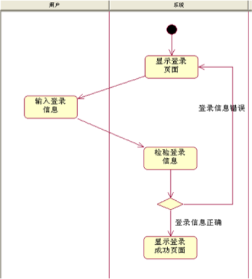

### 7.3活动图练习题

某公司销售人员接到订单后, 将订单传给财务人员和仓库人员. 财务人员开具发票, 并收款. 仓库人员准备货物, 并查看是否货物加急, 若是加急采用 EMS 方式发货, 否则采用普通包裹方式发货. 完成之后由销售人员关闭该订单. 根据上面描述画出该公司销售过程的活动图.

## **8.从C ++代码生成UML？**

Microsoft Visio

使用Microsoft Visio 2000将工程代码逆向转换为UML图的分步指南 - http://msdn.microsoft.com/zh-cn/library/aa140255(office.10).aspx

*https://www.zhihu.com/question/31687711*

BoUML - http://bouml.fr/features.html

StarUML - http://staruml.sourceforge.net/en/

*https://www.fanjiafei.cn/2018/03/30/%E6%A0%B9%E6%8D%AE%E4%BB%A3%E7%A0%81%E7%94%9F%E6%88%90uml%E7%B1%BB%E5%9B%BE/*

在弱类型容器的情况下从C ++代码逆向工程UML类图（2001） - http://citeseerx.ist.psu.edu/viewdoc/summary?doi=10.1.1.27.9064

Umbrello UML建模器 - http://uml.sourceforge.net/

其他工具清单 - http://plg.uwaterloo.ca/\~migod/uml.html

如何用Rational Rose进行C++代码分析

*https://www.ibm.com/developerworks/cn/rational/r-shenzj/index.html*

使用PlantUML绘制类图

*https://blog.csdn.net/flueky/article/details/84819154*

*https://blog.csdn.net/ZK295794411/article/details/102974779*

*http://www.umlchina.com/Tools/Newindex1.htm*
