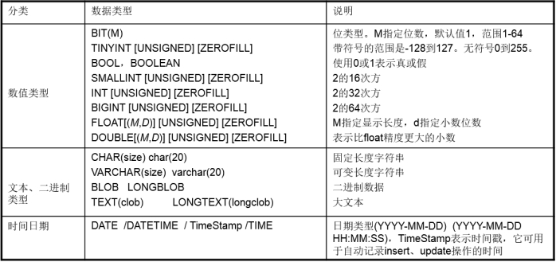
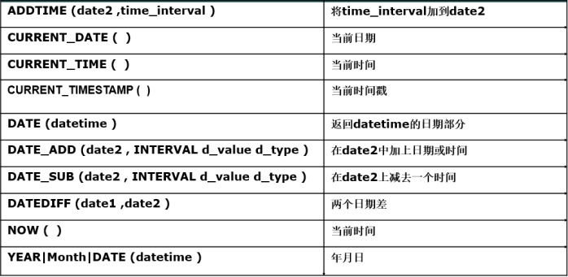
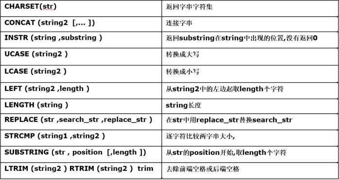
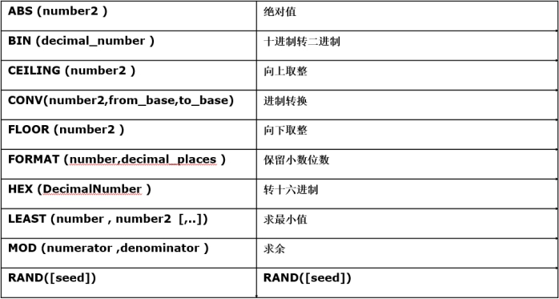
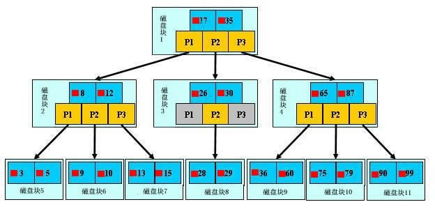

MySQL

---

<!-- toc -->

[TOC]

---


## 数据库简介

### 数据库

数据库的类型：关系型数据库、非关系型数据库

所谓的关系型数据库RDBMS（Relational Database Management System），是建立在关系模型基础上的数据库，借助于集合代数等数学概念和方法来处理数据库中的数据

### SQL

SQL（Structured Query Language）是**结构化查询语言**，是一门特殊的语言,专门用来操作关系数据库，**不区分大小写**。也就是说可以通过 SQL 操作 oracle,sql server,mysql,sqlite 等等所有的关系型的数据库。

SQL语句主要分为：

- DQL：数据**查询**语言，用于对数据进行查询，如select
- DML：数据**操作**语言，对数据进行增加、修改、删除，如insert、udpate、delete
- DDL：数据**定义**语言，进行数据库、表的管理等，如create、drop
- DCL：数据**控制**语言，进行授权与权限回收，如grant、revoke
- TPL：事务处理语言，对事务进行处理，包括begin transaction、commit、rollback
- CCL：指针控制语言，通过控制指针完成表的操作，如declare cursor

### MySQL简介

瑞典MySQL AB公司开发，后来被Sun公司收购，Sun公司后来又被Oracle公司收购，目前属于Oracle旗下产品。

mysql是一种关联数据库管理系统 由于其体积小、速度快、总体拥有成本低。

mysql数据库版本有：Community社区版、Enterprise企业版。

**mysql特点**

- 使用C和C++编写，并使用了多种编译器进行测试，保证源代码的可移植性
- 支持多种操作系统，如Linux、Windows、FreeBSD、MacOS等
- 为多种编程语言提供了API，如C、C++、Python、Java、Perl、PHP、Eiffel、Ruby等
- 支持多线程，充分利用CPU资源
- 优化的SQL查询算法，有效地提高查询速度
- 提供多语言支持，常见的编码如GB2312、BIG5、UTF8
- 提供TCP/IP、ODBC和JDBC等多种数据库连接途径
- 提供用于管理、检查、优化数据库操作的管理工具
- 可以处理拥有上千万条记录的大型数据库
- 支持多种存储引擎
- mysql使用标准的SQL数据语言形式
- Mysql是开源的，采用了GPL协议
- 在线DDL更改功能
- 复制全局事务标识
- 复制无崩溃从机
- 复制多线程从机


### mysql数据类型

[MYSQL中数据类型介绍](https://www.cnblogs.com/-xlp/p/8617760.html)

使用数据类型的原则是：够用就行，尽量使用取值范围小的，节省存储空间

mysql数据类型：

-  数值类型（int，bit，float，decimal）
-  字符串类型（varchar，char）
-  时间日期类型 （date，time，datetime）
-  枚举类型(enum)



#### 数值类型

数值类型包括严格数值数据类型(INTEGER、SMALLINT、DECIMAL和NUMERIC)，以及近似数值数据类型(FLOAT、REAL和DOUBLE PRECISION)。

**整型**

| 整型类型  | 字节大小 | 含义（有符号）               |
| --------- | -------- | ---------------------------- |
| tinyint   | 1个字节  | 范围(-128~127)               |
| smallint  | 2个字节  | 范围(-32768~32767)           |
| mediumint | 3个字节  | 范围(-8388608~8388607)       |
| int       | 4个字节  | 范围(-2147483648~2147483647) |
| bigint    | 8个字节  | 范围(+-9.22*10的18次方)      |

**浮点型**

| 浮点型类型  | 大小byte        | 含义                            |
| ----------- | --------------- | ------------------------------- |
| float(m,d)  | 8位精度(4字节)  | 单精度浮点型   m总个数，d小数位 |
| double(m,d) | 16位精度(8字节) | 双精度浮点型   m总个数，d小数位 |

设一个字段定义为float(6,3)，如果插入一个数123.45678,实际数据库里存的是123.457，但总个数还以实际为准，即6位。整数部分最大是3位，如果插入数12.123456，存储的是12.1234，如果插入12.12，存储的是12.1200.

**定点数**

浮点型在数据库中存放的是近似值，而定点类型在数据库中存放的是精确值。 

| 整型类型     | 大小byte | 含义（有符号） |
| :----------- | :------- | :------------- |
| decimal(m,d) | M+1或M+2 | 小数值         |

decimal(m,d) 参数m<65 是总个数，d<30且 d<m 是小数位。

> bit 1位　 可以指定位数，如：bit(3)
>
> int 2字节 可以指定最大位数，如：int&lt;4&gt;　最大为4位的整数
>
> float 2个字节　可以指定最大的位数和最大的小数位数，如：float&lt;5,2&gt; 最大为一个5位的数，小数位最多2位
>
> double　4个字节　可以指定最大的位数和最大的小数位数，如：float&lt;6,4&gt; 最大为一个6位的数，小数位最多4位
>
> decimal(5,2) 表示共存5位数，小数占2位

#### 字符串类型

字符串类型指CHAR、VARCHAR、BINARY、VARBINARY、BLOB、TEXT、ENUM和SET。

| 类型       | 大小                  | 用途                            |
| :--------- | :-------------------- | :------------------------------ |
| char       | 0-255 bytes           | **定长**字符串                  |
| varchar    | 0-65535 bytes         | **变长**字符串                  |
| TINYBLOB   | 0-255 bytes           | 不超过 255 个字符的二进制字符串 |
| TINYTEXT   | 0-255 bytes           | 短文本字符串                    |
| BLOB       | 0-65 535 bytes        | 二进制形式的长文本数据          |
| TEXT       | 0-65 535 bytes        | 长文本数据                      |
| MEDIUMBLOB | 0-16 777 215 bytes    | 二进制形式的中等长度文本数据    |
| MEDIUMTEXT | 0-16 777 215 bytes    | 中等长度文本数据                |
| LONGBLOB   | 0-4 294 967 295 bytes | 二进制形式的极大文本数据        |
| LONGTEXT   | 0-4 294 967 295 bytes | 极大文本数据                    |

> char(n) 和 varchar(n) 中括号中 n 代表字符的个数，比如 CHAR(30) 就可以存储 30 个字符。
>
> char 必须指定字符数，如char(3) 为不可变字符，即使存储的内容为'ab',也是用3个字符的空间存储这个数据'ab '，
> char(3) 输入 'ab', 实际存储为'ab ', 输入'abcd' 实际存储为 'abc'
>
> varchar 必须指定字符数，如varchar(5) 为可变字符，如果存储的内容为'ab',占用2个字符的空间；如果为'abc',则占用3个字符的空间
> varchar(3) 输 'ab',实际存储为'ab', 输入'abcd',实际存储为'abc'
>
> text: 大文本(大字符串)
>
> blob：二进制大数据　如图片，音频文件，视频文件

#### 时间日期类型

表示时间值的日期和时间类型为DATETIME、DATE、TIMESTAMP、TIME和YEAR。

| 类型      | 大小 ( bytes) | 范围                                                   | 格式                | 用途                     |
| :-------- | :------------ | :----------------------------------------------------- | :------------------ | :----------------------- |
| date      | 3             | 1000-01-01 至 9999-12-31                               | YYYY-MM-DD          | 日期值                   |
| time      | 3             | '-838:59:59' 至 '838:59:59'                            | HH:MM:SS            | 时间值或持续时间         |
| year      | 1             | 1901 至 2155                                           | YYYY                | 年份值                   |
| datetime  | 8             | 1000-01-01 00:00:00 至 9999-12-31 23:59:59             | YYYY-MM-DD HH:MM:SS | 混合日期和时间值         |
| timestamp | 4             | '1970-01-01 00:00:01' UTC 至 '2038-01-01 00:00:01' UTC | YYYYMMDD HHMMSS     | 混合日期和时间值，时间戳 |

> date: 日期　如：'1921-01-02'
>
> datetime: 日期+时间　如：'1921-01-02 12:23:43'
>
> timeStamp: 时间戳，自动赋值为当前日期时间


#### 数据类型的长度和范围

各数据类型及字节长度一览表：

| 数据类型           | 字节长度 | 范围或用法                                                   |
| ------------------ | -------- | ------------------------------------------------------------ |
| Bit                | 1        | 无符号[0,255]，有符号[-128,127]，天缘博客备注：BIT和BOOL布尔型都占用1字节 |
| TinyInt            | 1        | 整数[0,255]                                                  |
| SmallInt           | 2        | 无符号[0,65535]，有符号[-32768,32767]                        |
| MediumInt          | 3        | 无符号[0,2^24-1]，有符号[-2^23,2^23-1]]                      |
| Int                | 4        | 无符号[0,2^32-1]，有符号[-2^31,2^31-1]                       |
| BigInt             | 8        | 无符号[0,2^64-1]，有符号[-2^63 ,2^63 -1]                     |
| Float(M,D)         | 4        | 单精度浮点数。天缘博客提醒这里的D是精度，如果D<=24则为默认的FLOAT，如果D>24则会自动被转换为DOUBLE型。 |
| Double(M,D)        | 8        | 双精度浮点。                                                 |
| Decimal(M,D)       | M+1或M+2 | 未打包的浮点数，用法类似于FLOAT和DOUBLE，天缘博客提醒您如果在ASP中使用到Decimal数据类型，直接从数据库读出来的Decimal可能需要先转换成Float或Double类型后再进行运算。 |
| Date               | 3        | 以YYYY-MM-DD的格式显示，比如：2009-07-19                     |
| Date Time          | 8        | 以YYYY-MM-DD HH:MM:SS的格式显示，比如：2009-07-19 11：22：30 |
| TimeStamp          | 4        | 以YYYY-MM-DD的格式显示，比如：2009-07-19                     |
| Time               | 3        | 以HH:MM:SS的格式显示。比如：11：22：30                       |
| Year               | 1        | 以YYYY的格式显示。比如：2009                                 |
| Char(M)            | M        | 定长字符串。                                                 |
| VarChar(M)         | M        | 变长字符串，要求M<=255                                       |
| Binary(M)          | M        | 类似Char的二进制存储，特点是插入定长不足补0                  |
| VarBinary(M)       | M        | 类似VarChar的变长二进制存储，特点是定长不补0                 |
| Tiny Text          | Max:255  | 大小写不敏感                                                 |
| Text               | Max:64K  | 大小写不敏感                                                 |
| Medium Text        | Max:16M  | 大小写不敏感                                                 |
| Long Text          | Max:4G   | 大小写不敏感                                                 |
| TinyBlob           | Max:255  | 大小写敏感                                                   |
| Blob               | Max:64K  | 大小写敏感                                                   |
| MediumBlob         | Max:16M  | 大小写敏感                                                   |
| LongBlob           | Max:4G   | 大小写敏感                                                   |
| Enum               | 1或2     | 最大可达65535个不同的枚举值                                  |
| Set                | 可达8    | 最大可达64个不同的值                                         |
| Geometry           |          |                                                              |
| Point              |          |                                                              |
| LineString         |          |                                                              |
| Polygon            |          |                                                              |
| MultiPoint         |          |                                                              |
| MultiLineString    |          |                                                              |
| MultiPolygon       |          |                                                              |
| GeometryCollection |          |                                                              |


### mysql表的约束

| mysql关键字        | 含义                                                         |
| ------------------ | ------------------------------------------------------------ |
| null               | 数据列可包含NULL值                                           |
| not null           | 数据列不允许包含NULL值                                       |
| unique             | 惟一，此字段的值不允许重复                                   |
| default            | 默认值，当不填写此值时会使用默认值，如果填写时以填写为准     |
| primary key        | 主键，(不允许为空，不允许重复)                               |
| foreign key        | 外键，对关系字段进行约束，当为关系字段填写值时，会到关联的表中查询此值是否存在，如果存在则填写成功，如果不存在则填写失败并抛出异常 |
| auto\_increment    | 自动递增，适用于整数类型                                     |
| UNSIGNED           | 无符号                                                       |
| CHARACTER SET name | 指定一个字符集                                               |

说明：虽然外键约束可以保证数据的有效性，但是在进行数据的crud（增加、修改、删除、查询）时，都会降低数据库的性能，所以不推荐使用，那么数据的有效性怎么保证呢？答：可以在逻辑层进行控制

mysql中约束举例：

> ```sql
> create table myclass (
> id INT(11) primary key auto_increment,
> name varchar(20) unique
> );
> -- 
> create table student (
> id INT(11) primary key auto_increment,
> name varchar(20) unique,
> passwd varchar(15) not null,
> classid INT(11),
> constraint stu_classid_FK foreign key(classid) references myclass(id)
> );
> ```

定义外键约束：

```sql
...
constraint stu_classid_FK foreign key(classid) references myclass(id)
```

删除主键：

```mysql
alter table 表名 drop primary key ;
```


查看所有数据库的表的约束

```mysql
SELECT * FROM information_schema.`TABLE_CONSTRAINTS`;
```


## mysql安装配置

### mysql安装

安装服务器端

```shell
sudo apt-get install mysql-server
```

安装客户端

```shell
sudo apt-get install mysql-client
```

mariadb是mysql的一个分支，debian已经删掉mysql了，替换成了mariadb。

```shell
sudo apt-get install mariadb-server
sudo apt-get install mariadb-client
```

服务启动和关闭

```shell
sudo service mysql start    # 启动服务
sudo service mysql stop    # 停止服务
sudo service mysql restart    # 重启服务
```

查看进程中是否存在mysql服务

```shell
ps ajx|grep mysql
```

设为开机自启动

```shell
sudo systemctl enable mariadb #设为开机自启动
```

#### mariadb初始化

安装完成后需进行初始化设置：

```shell
$ sudo mysql_secure_installation         #直接执行初始化命令，会弹出交互配置信息
Enter current password for root (enter for none):#初次进入密码为空，直接回车
New password:                #输入要为root用户设置的数据库密码。
Re-enter new password:            #重复再输入一次密码。
Remove anonymous users? [Y/n] y      #删除匿名帐号
Disallow root login remotely? [Y/n] n #是否禁止root用户从远程登录，安全起见应禁止，这里为做实验方便这里不禁止。
Remove test database and access to it? [Y/n] y  #是否删除test数据库，想留着也随意
Reload privilege tables now? [Y/n] y        #刷新授权表，让初始化后的设定立即生效
```


#### 修改mysql默认密码?

oracle收购Mysql后，新版的mysql刚安装完mysql后不能直接输入mysql登录数据库， 而是设置了默认free password密码，默认密码放在了`/root/.mysql_secret`文件中，登陆后需要修改密码。

查看文件寻找默认密码

```shell
cat /root/.mysql_secret
```

以root用户身份登陆mysql服务器：

```shell
mysql -u root -p查询的登录密码
```

修改登录密码

```shell
mysql> set password=password('123456'); 
```

将密码设置为：123456

密码修改成后，再次登录

### mysql配置

配置文件目录为`/etc/mysql/mysql.cnf`

主要配置项

> bind-address表示服务器绑定的ip，默认为127.0.0.1
> port表示端口，默认为3306
> datadir表示数据库目录，默认为/var/lib/mysql
> general_log_file表示普通日志，默认为/var/log/mysql/mysql.log
> log_error表示错误日志，默认为/var/log/mysql/error.log


### 登录Mysql

#### 登录mysql

```shell
sudo mysql -uroot -p123456
sudo mysql -uroot -p
```

u: user  ，p: password

> chao@deepin:~$ sudo mysql -uroot -p
> Enter password: 
> Welcome to the MariaDB monitor.  Commands end with ; or \g.
> Your MariaDB connection id is 36
> Server version: 10.3.23-MariaDB-0+deb10u1 Debian 20
> Copyright (c) 2000, 2018, Oracle, MariaDB Corporation Ab and others.
> Type 'help;' or '\h' for help. Type '\c' to clear the current input statement.

#### 退出登录

```mysql
quit 或者 exit 或者 ctrl+d
```

> MariaDB [(none)]> quit


## mysql的基本操作

### 数据库CURD

对数据库进行增(create)、删(drop)、改(update)、查(Retrieve)操作。

#### create创建数据库

创建一个名称为mydb1的数据库，默认字符集

```mysql
create database mydb1;
```

> MariaDB [(none)]> create database mydb1;
> Query OK, 1 row affected (0.000 sec)

创建一个使用utf-8字符集的mydb2数据库

```mysql
create database 数据库名 charset=utf8;
create database mydb2 charset=utf8;
create database mydb3 character set utf8;
```

> MariaDB [(none)]> create database mydb2 charset=utf8;
> Query OK, 1 row affected (0.000 sec)

创建一个使用utf-8字符集，并带校对规则的mydb3数据库，会对存入的数据进行检查

```mysql
create database mydb3 character=utf8 collate utf8_general_ci;
```

#### show显示数据库信息

显示所有数据库

```mysql
show databases;
```

> MariaDB [(none)]> show databases;
> +----------------------------+
> | Database                   |
> +----------------------------+
> | information_schema  |
> | mydb1                        |
> | mydb2                        |
> | mysql                          |
> | performance_schema |
> +------------------------------+
> 5 rows in set (0.000 sec)

查看创建数据库的方式

```mysql
show create database mydb1;
```

> MariaDB [(none)]> show create database mydb1;
> +----------+-------------------------------------------------------------------+
> | Database | Create Database                                                   |
> +----------+-------------------------------------------------------------------+
> | mydb1    | CREATE DATABASE `mydb1` /*!40100 DEFAULT CHARACTER SET utf8mb4 */ |
> +----------+-------------------------------------------------------------------+
> 1 row in set (0.000 sec)

默认情况下，反引号“ \` ”括起来的字符串，区分大小写。

注意 ：mysql默认语言集是latin1，每次在创建数据库的时候应指定字符集。

#### select查看当前使用的数据库

查看当前使用的数据库

```mysql
select database();
```

> MariaDB [mydb1]> select database();
> +------------+
> | database() |
> +------------+
> | mydb1      |
> +------------+
> 1 row in set (0.000 sec)

#### use使用数据库

```mysql
use 数据库名;
use mydb1;
```

> MariaDB [(none)]> use mydb1;
> Database changed
> MariaDB [mydb1]>

#### alter修改数据库

修改mydb1的字符集为utf8(不能修改数据库名)

```mysql
alter database mydb1 character set utf8;
```

> MariaDB [mydb2]> alter database mydb1 character set utf8;
> Query OK, 1 row affected (0.000 sec)
>
> MariaDB [mydb2]> show create database mydb1;
> +----------+----------------------------------------------------------------+
> | Database | Create Database                                                |
> +----------+----------------------------------------------------------------+
> | mydb1    | CREATE DATABASE `mydb1` /*!40100 DEFAULT CHARACTER SET utf8 */ |
> +----------+----------------------------------------------------------------+
> 1 row in set (0.000 sec)

修改数据库的名字？？

#### drop删除数据库

删除数据库mydb3

```mysql
drop database 数据库名;
drop database mydb3;
drop database `mydb-03`;
```

> MariaDB [mydb1]> drop database mydb3;
> Query OK, 0 rows affected (0.001 sec)


### 表的CURD

对表本身进行操作：创建，查看，修改，删除。

#### create创建表

创建表时没有约束

```mysql
create table  表名  ( 列名 数据类型 );
create table mytb1 ( tid int, tname varchar(20) );
```

> MariaDB [mydb2]> create table employee1( empno int, ename varchar(20), sal double );
> Query OK, 0 rows affected (0.010 sec)

换行创建一个表

```mysql
create table employee(
	id int,
	name varchar(20),
	sex int,
	birthday date,
	salary double,
	entry_date date,
	resume text
);
```

但此时会报错误：ERROR 1046 (3D000): No database selected。注意，在mysql中对表操作前，必须先选择所使用的数据库。

> use mydb2;

创建表时添加约束

> auto_increment表示自动增长
> not null 表示不能为空
> primary key 表示主键
> default 默认值

```mysql
create table 数据表名字 (字段 类型 约束[, 字段 类型 约束]);
create table LimtTable_student(
    id int unsigned primary key auto_increment not null,
    name varchar(20) default '',
    age tinyint unsigned default 0,
    height decimal(5,2),
    gender enum('男','女','人妖','保密'),
    cls_id int unsigned default 0
);
```

> MariaDB [mydb2]> create table LimtTable_student(
>     ->     id int unsigned primary key auto_increment not null,
>     ->     name varchar(20) default '',
>     ->     age tinyint unsigned default 0,
>     ->     height decimal(5,2),
>     ->     gender enum('男','女','人妖','保密'),
>     ->     cls_id int unsigned default 0
>     -> ) ;
> Query OK, 0 rows affected (0.011 sec)

#### show显示当前库中所有的表

查看当前使用数据库中所有表：

```mysql
show tables;
```

> MariaDB [mydb2]> show tables;
> +-----------------+
> | Tables_in_mydb2 |
> +-----------------+
> | employee        |
> | LimtTable_xxxx |
> | mytb1           |
> +-----------------+
> 6 rows in set (0.000 sec)

#### show显示表的创建方式

```mysql
show create table 表名;
show create table LimtTable_xxxx;
```

> MariaDB [mydb2]> show create table LimtTable_xxxx;
> +-----------------+-----------------------------------------------------------------------------------------------------------------------------------------------------------------------------+
> | Table           | Create Table                                                                                                                                                                |
> +-----------------+-----------------------------------------------------------------------------------------------------------------------------------------------------------------------------+
> | LimtTable_xxxx | CREATE TABLE `LimtTable_xxxx` (
>   `t_id` int(11) NOT NULL AUTO_INCREMENT,
>   `t_name` varchar(30) DEFAULT NULL,
>   PRIMARY KEY (`t_id`)
> ) ENGINE=InnoDB DEFAULT CHARSET=utf8 |
> +-----------------+-----------------------------------------------------------------------------------------------------------------------------------------------------------------------------+
> 1 row in set (0.001 sec)

ENGINE=InnoDB 默认指定的存储引擎 innoDB。

注意，表名称区分大小写

#### desc显示指定表的结构

```mysql
desc 表名;
desc LimtTable_xxxx;
```

> MariaDB [mydb2]> desc LimtTable_xxxx;
> +--------+-------------+------+-----+---------+----------------+
> | Field  | Type        | Null | Key | Default | Extra          |
> +--------+-------------+------+-----+---------+----------------+
> | t_id   | int(11)     | NO   | PRI | NULL    | auto_increment |
> | t_name | varchar(30) | YES  |     | NULL    |                |
> +--------+-------------+------+-----+---------+----------------+
> 2 rows in set (0.001 sec)

在Mysql中显示多行数据应该在查询语句结尾处添加 \\G来替换结束标记“；”

#### rename更改表名

```mysql
rename table 旧表名 to 新表名;
rename table employee to worker;
```

> MariaDB [mydb2]> rename table employee to worker;
> Query OK, 0 rows affected (0.009 sec)

#### alter修改表

（alter修改表中，column可省，column关键字在Oracle中，添加则语法错误）

##### alter-add增加一个字段

```mysql
alter table 表名 add 列名 类型;
alter table employee add height double;
alter table employee add column height double;
```

> MariaDB [mydb2]> alter table employee add column height double;
> Query OK, 0 rows affected (0.003 sec)
> Records: 0  Duplicates: 0  Warnings: 0

##### alter-modify修改一个字段类型

```mysql
alter table 表名 modify 列名 类型及约束;
alter table employee modify column height float not null;
```

> MariaDB [mydb2]> alter table employee modify column height float not null;
> Query OK, 0 rows affected (0.001 sec)
> Records: 0  Duplicates: 0  Warnings: 0

##### alter-change改变一个字段名

```mysql
alter table 表名 change 原名 新名 类型及约束;
alter table employee change column height height_1 float not null;
```

> MariaDB [mydb2]> alter table employee change column height height_1 float;
> Query OK, 0 rows affected (0.047 sec)              
> Records: 0  Duplicates: 0  Warnings: 0
>
> MariaDB [mydb2]> desc employee;
> +------------+-------------+------+-----+---------+-------+
> | Field      | Type        | Null | Key | Default | Extra |
> +------------+-------------+------+-----+---------+-------+
> | id         | int(11)     | YES  |     | NULL    |       |
> | name       | varchar(20) | YES  |     | NULL    |       |
> | sex        | int(11)     | YES  |     | NULL    |       |
> | birthday   | date        | YES  |     | NULL    |       |
> | salary     | double      | YES  |     | NULL    |       |
> | entry_date | date        | YES  |     | NULL    |       |
> | resume     | text        | YES  |     | NULL    |       |
> | height_1   | float       | NO   |     | NULL    |       |
> +------------+-------------+------+-----+---------+-------+
> 8 rows in set (0.001 sec)

##### alter-drop删除一个字段

```mysql
alter table 表名 drop 列名;
alter table employee drop column height_1;
```

> MariaDB [mydb2]> alter table employee drop column height_1;
> Query OK, 0 rows affected (0.019 sec)
> Records: 0  Duplicates: 0  Warnings: 0

##### alter-charset修改表的字符集

```mysql
alter table employee charset=gbk;
alter table employee character set utf8;
```

> MariaDB [mydb2]> alter table employee charset=gbk;
> Query OK, 0 rows affected (0.001 sec)
> Records: 0  Duplicates: 0  Warnings: 0
>
> MariaDB [mydb2]> show create table employee;
> +----------+--------------------------------------------------------------------------------------------------------------------------------------------------+
> | Table    | Create Table                                                                                                                                                                                                                                                                                                                     |
> +----------+--------------------------------------------------------------------------------------------------------------------------------------------------+
> | employee | CREATE TABLE `employee` (
>   `id` int(11) DEFAULT NULL,
>   `name` varchar(20) CHARACTER SET utf8 DEFAULT NULL,
>   `sex` int(11) DEFAULT NULL,
>   `birthday` date DEFAULT NULL,
>   `salary` double DEFAULT NULL,
>   `entry_date` date DEFAULT NULL,
>   `resume` text CHARACTER SET utf8 DEFAULT NULL
> ) ENGINE=InnoDB DEFAULT CHARSET=gbk |
> +----------+--------------------------------------------------------------------------------------------------------------------------------------------------+
> 1 row in set (0.000 sec)

#### drop删除表

drop删除employee表

```mysql
drop table 表名;
drop table employee; 
```

> MariaDB [mydb2]> drop table employee; 
> Query OK, 0 rows affected (0.008 sec)

### 表数据的CURD

创建（Create）、更新（Update）、读取（Retrieve）和删除（Delete）

#### insert插入数据

##### 全列插入

> 值的顺序与表中字段的顺序对应

一次向表中插入一行数据

```mysql
insert into 表名 values(记录值,记录值);
insert into 表名(记录名,记录名) values(记录值,记录值);
```

```mysql
insert into employee values(1,'张三',1,'1983-04-27',15000,'2012-06-24','一个大牛');
insert into employee(id,name,sex,birthday,salary,entry_date,resume) values(2,'李四',1,'1984-02-22',10000,'2012-07-24','一个中牛');
```

> MariaDB [mydb2]> insert into employee values(1,'张三',1,'1983-04-27',15000,'2012-06-24','一个大牛');
> Query OK, 1 row affected (0.002 sec)

##### 部分列插入

> 值的顺序与给出的列顺序对应

```mysql
insert into 表名(列1,...) values(值1,...)
insert into employee(name,birthday) values('小明','1994-03-23');
```

##### 多行插入

> 值的顺序与给出的列顺序对应

一次性插入多行数据

```mysql
insert into 表名 values(...),(...)...;
insert into 表名(列1,...) values(值1,...),(值1,...)...;
```

**全列插入**

```mysql
insert into employee(id,name,sex,birthday,salary,entry_date,resume) values(3,'王五',0,'1985-08-28',7000,'2012-08-24','一个小虾'),(3,'赵六',0,'1985-08-28',7000,'2012-08-24','一个小虾');
```

**部分列插入**

```mysql
insert into employee(name,salary) values('杨康',111),('杨过',222),('小龙女',333);
```

> MariaDB [mydb2]> insert into employee(name,salary) values('杨康',111),('杨过',222),('小龙女',333);
> Query OK, 3 rows affected (0.002 sec)
> Records: 3  Duplicates: 0  Warnings: 0

#### update修改数据

```mysql
update 表名 set 列1=值1,列2=值2... where 条件
```


将王五的员工薪水修改为10000元，resume改为也是一个中牛

```mysql
update employee set salary=10000, resume='也是一个中牛' where name='王五';
```

将所有员工薪水都增加500元

```mysql
update employee set salary=salary+500;
```


#### select查询表数据

##### 查询整个表所有列

```mysql
select * from 表名;
select * from employee;
```

> MariaDB [mydb2]> select * from employee;
> +------+--------+------+------------+--------+------------+--------------+
> | id   | name   | sex  | birthday   | salary | entry_date | resume       |
> +------+--------+------+------------+--------+------------+--------------+
> |    2 | 李四   |    1 | 1984-02-22 |  10000 | 2012-07-24 | 一个中牛     |
> |    3 | 王五   |    0 | 1985-08-28 |   7000 | 2012-08-24 | 一个小虾     |
> |    1 | 张三   |    1 | 1983-04-27 |  15000 | 2012-06-24 | 一个大牛     |
> +------+--------+------+------------+--------+------------+--------------+
> 3 rows in set (0.000 sec)

##### 查询指定列

可以使用as为列或表指定别名

```mysql
select 列1,列2,... from 表名;
select id, name;
select id, name as "名字", salary "月薪", salary*12 年薪 from employee where id >=2;
```

> MariaDB [mydb2]> select id, name as "名字", salary "月薪", salary*12 年薪 from employee where id >=2;
> +------+--------+--------+--------+
> | id   | 名字   | 月薪   | 年薪   |
> +------+--------+--------+--------+
> |    2 | 李四   |  10000 | 120000 |
> |    3 | 王五   |   7000 |  84000 |
> +------+--------+--------+--------+
> 2 rows in set (0.000 sec)


#### delete数据

```mysql
delete from 表名 where 条件
```

##### 删除表中部分记录

删除表中姓名为王五的记录

```mysql
delete from employee where name='王五'; 
```

##### 删除表中所有记录

```mysql
delete from employee;
```

##### truncate删除表中所有记录

无条件 效率高

```mysql
truncate employee;
```

> 逻辑删除，本质就是修改操作
>
> ```mysql
> update students set isdelete=1 where id=1;
> ```


### 备份与恢复

#### 备份

1. 退出数据库连接，执行如下命令
2. mysqldump备份数据

全库备份

```shell
mysqldump -uroot -p -A >bak_full.sql
```

单库备份

```shell
mysqldump -uroot -p mydb2 >bak_mydb2.sql
```

不加 -B 后面恢复时，要先创库 use库

```shell
mysqldump -uroot -p -B ysl >bak_mydb3.sql
```

-B 增加建库（create）及（use库）的语句  后面恢复时，不需要手动创建库和use

另外 -B 选项可以实现， 同时备份多个库，备份到一个文件中

```shell
mysqldump -uroot -p -B mydb2 mydb3 >bak_mydb2_mydb3.sql
```

如果不加 -B 就是备份 ysl库下 test表

```shell
mysqldump 库1 表1 表2 表3 > 库1.sql
mysqldump mydb2 employee1 employee2 employee3 > 库1.sql
```


```shell
mysqldump -uroot -p 数据库名 > bak.sql;
```

> chao@deepin:~$ sudo mysqldump -uroot -p mydb2 > bak.sql;
> [sudo] password for chao: 
> Enter password: 

#### 恢复

1. 连接mysql，创建新的数据库
2. 退出数据库连接，执行如下命令
3. 恢复备份的数据

```shell
mysql -uroot -p < bak.sql
```

??

```shell
mysql -uroot -p 新数据库名 < bak.sql
```


### 综合案例

创建一个学生表

> create table student(
> id int,
> name varchar(20),
> chinese int,
> english int,
> math int
> );

插入数据

> insert into student(id,name,chinese,english,math) values(1, '范建',80,85,90);
> insert into student(id,name,chinese,english,math) values(2,'罗况',90,95,95);
> insert into student(id,name,chinese,english,math) values(3,'杜子腾',80,96,96);
> insert into student(id,name,chinese,english,math) values(4,'范冰',81,97,85);
> insert into student(id,name,chinese,english,math) values(5,'申晶冰',85,84,90);
> insert into student(id,name,chinese,english,math) values(6,'郝丽海',92,85,87);
> insert into student(id,name,chinese,english,math) values(7,'郭迪辉',75,81,80);
> insert into student(id,name,chinese,english,math) values(8,'拎壶冲',77,80,79);
> insert into student(id,name,chinese,english,math) values(9,'任我行',95,85,85);
> insert into student(id,name,chinese,english,math) values(10,'史泰香',94,85,84);

#### 基础SQL

查询表中所有学生的信息

> select \* from student;
>

查询表中所有学生的姓名和对应的英语成绩

> select name,english from student;
>

过滤表中重复数据

> select english from student;
>
> select DISTINCT english from student;
>
> select DISTINCT english,name from student;

在所有学生英语分数上加10分特长分

> select name,english+10 from student;
>

统计每个学生的总分

> select english+chinese+math from student;
>
> select english+chinese+math as 总分 from student;
>
> select name,english+chinese+math as 总分 from student;

使用别名表示学生分数

> select name,english+chinese+math as 总分 from student;
>
> select name,english+chinese+math 总分 from student;
>

查询姓名为何东的学生成绩

> select \* from student where name='何东';
>

查询英语成绩大于90分的同学

> select \* from student where english&gt;90;
>

查询总分大于250分的所有同学

> select \* from student where english+chinese+math&gt;250;
>

查询英语分数在 85－95之间的同学

> select \* from student where english&gt;=85 and english&lt;=95;
>
> select \* from student where english between 85 and 95;

查询数学分数为84,90,91的同学

> select \* from student where math=84 or math=90 or math=91;
>
> select \* from student where math in(84,90,91);
>

查询所有姓何的学生成绩

> select \* from student where name like '何%';
>

查询数学分&gt;85，语文分&gt;90的同学

> select \* from student where math&gt;85 and chinese&gt;90;
>

对数学成绩排序后输出

> select \* from student order by math;
>

对总分排序后输出，然后再按从高到低的顺序输出

> select \* from student order by math+chinese+english desc;
>

对姓何的学生成绩排序输出

> select \* from student where name like '何%' order by math+chinese+english desc;
>
> select name, math+chinese+english from student where name like '何%' order by math+chinese+english desc;
>

统计一个班级共有多少学生？

> select count(\*) from student;
>

统计数学成绩大于90的学生有多少个？

> select count(\*) from student where math&gt;90;
>

统计总分大于250的人数有多少？

> select count(\*) from student where math+chinese+english&gt;250;
>

统计一个班级数学总成绩？

> select sum(math) from student;
>

统计一个班级语文、英语、数学各科的总成绩

> select sum(math), sum(chinese), sum(english) from student;
>

统计一个班级语文、英语、数学的成绩总和

> select sum(math+chinese+english)from student;
>
> select sum(math)+sum(chinese)+sum(english) from student;
>

求一个班级数学平均分？

> select avg(math) from student;
>

求一个班级总分平均分

> select avg(math+chinese+english)from student;
>
> select avg(math)+avg(chinese)+avg(english) from student;
>

求班级最高分和最低分

> select max(math+chinese+english),min(math+chinese+english) from student;


#### 分组数据

为学生表，增加一个班级列，练习分组查询。

> alter table student add column class\_id int;
>

更新表：

> update student set class\_id=1 where id&lt;=5;
>
> update student set class\_id=2 where id&gt;5;
>
> (update student set class\_id=2 where id between 6 and 10;)
>

查出各个班的总分，最高分。

求各个班级 英语的平均分：

> select class\_id, avg(english)
> from student
> group by class_id
>

如根据组函数的语法要求，将select后增加name列，而不加至group by 之后：

> select name, class\_id, avg(english)
> from student
> group by class\_id;

会发现mysql检查不出错误。相比Oracle数据库，mysql分组检查不严格。

> select sum(math+chinese+english),max(math+chinese+english) from student group by class\_id;
>

查询出班级总分大于1300分的班级ID

> select class\_id from student group by class\_id having sum(math+chinese+english)&gt;1300;
>
> select class\_id from student where sum(math+chinese+english)&gt;1300 group by class\_id ;
>

对于组函数的应用与Oracle类似，可以应用于Having中，但不能用于where子句中。


## mysql查询

select查询的完整格式

```sql
SELECT select_expr [,select_expr,...] [      
      FROM tb_name
      [WHERE 条件判断]
      [GROUP BY {col_name | postion} [ASC | DESC], ...] 
      [HAVING WHERE 条件判断]
      [ORDER BY {col_name|expr|postion} [ASC | DESC], ...]
      [LIMIT {[offset,]rowcount | row_count OFFSET offset}]
]
```

完整的select语句

```sql
select distinct *
from 表名
where ....
group by ... having ...
order by ...
limit start,count
```

执行顺序为：

- from 表名
- where ....
- group by ...
- select distinct *
- having ...
- order by ...
- limit start,count

### 基本表数据查询

> 准备数据
>
> **创建数据库**
>
> ```mysql
> -- 创建数据库
> create database python_test_1 charset=utf8;
> 
> -- 使用数据库
> use python_test_1;
> ```
>
> **创建数据表**
>
> ```mysql
> -- 创建students表
> create table students(
>     id int unsigned primary key auto_increment not null,
>     name varchar(20) default '',
>     age tinyint unsigned default 0,
>     height decimal(5,2),
>     gender enum('男','女','中性','保密') default '保密',
>     cls_id int unsigned default 0,
>     is_delete bit default 0
> );
> 
> -- 创建classes表
> create table classes (
>     id int unsigned auto_increment primary key not null,
>     name varchar(30) not null
> );
> ```
>
> **表中插入数据**
>
> ```mysql
> -- 向students表中插入数据
> insert into students values
> (0,'小明',18,180.00,2,1,0),
> (0,'小月月',18,180.00,2,2,1),
> (0,'彭于晏',29,185.00,1,1,0),
> (0,'刘德华',59,175.00,1,2,1),
> (0,'黄蓉',38,160.00,2,1,0),
> (0,'凤姐',28,150.00,4,2,1),
> (0,'王祖贤',18,172.00,2,1,1),
> (0,'周杰伦',36,NULL,1,1,0),
> (0,'程坤',27,181.00,1,2,0),
> (0,'刘亦菲',25,166.00,2,2,0),
> (0,'金星',33,162.00,3,3,1),
> (0,'静香',12,180.00,2,4,0),
> (0,'郭靖',12,170.00,1,4,0),
> (0,'周杰',34,176.00,2,5,0);
> 
> -- 向classes表中插入数据
> insert into classes values (0, "python_01期"), (0, "python_02期");
> ```
>
> 

#### 查询所有字段

- 查询所有字段

```mysql
select * from 表名;
例：
select * from students;
```

#### 查询指定字段

- 查询指定字段

```sql
select 列1,列2,... from 表名;
例:
select name from students;
```

#### as给字段起别名

- 使用 as 给字段起别名

```sql
select 列1 as 别名1, 列2 as 别名2, ... from 表名;
例:
select id as 序号, name as 名字, gender as 性别 from students;
```

#### as给表起别名

- 使用 as 给表起别名

```sql
-- 如果是单表查询 可以省略表名，直接字段名
select id, name, gender from students;

-- 不省略表名形式，表名.字段名
select students.id,students.name,students.gender from students;

-- 使用 as 给表起别名 
select s.id,s.name,s.gender from students as s;
```

#### distinct消除重复行

- 在select后面列前使用distinct可以消除重复的行

```sql
select distinct 列1,... from 表名;
例：
select distinct gender from students;
```

> MariaDB [python_test_1]> select distinct gender from students;
> +--------+
> | gender |
> +--------+
> | 女     |
> | 男     |
> | 保密   |
> | 中性   |
> +--------+
> 4 rows in set (0.001 sec)

### where条件查询

使用where子句对表中的数据筛选，结果为true的行会出现在结果集中

```sql
select * from 表名 where 条件;
例：
select * from students where id=1;
```

where后面支持多种运算符，进行条件的处理

- 比较运算符
- 逻辑运算符
- 模糊查询
- 范围查询
- 空判断

#### 比较运算符(=,!=,>,>=)

- 等于: =
- 大于: >
- 大于等于: >=
- 小于: <
- 小于等于: <=
- 不等于: != 或 <>

例1：查询编号大于3的学生

```sql
select * from students where id > 3;
```

例2：查询编号不大于4的学生

```sql
select * from students where id <= 4;
```

例3：查询姓名不是“黄蓉”的学生

```sql
select * from students where name != '黄蓉';
```

例4：查询没被删除的学生

```sql
select * from students where is_delete=0;
```

#### 逻辑运算符(and,or,not)

- and
- or
- not

例5：查询编号大于3的女同学

```sql
select * from students where id > 3 and gender='女';
```

例6：查询编号小于4或没被删除的学生

```sql
select * from students where id < 4 or is_delete=0;
```

#### like模糊查询

- like
- %表示任意多个任意字符
- _表示一个任意字符

例7：查询姓周的学生

```sql
select * from students where name like '周%';
```

例8：查询姓周并且“名”是一个字的学生

```sql
select * from students where name like '周_';
```

例9：查询姓周或叫靖的学生

```sql
select * from students where name like '周%' or name like '%靖';
```

#### in/between-and范围查询

##### in非连续的范围内

- in(…)表示在一个非连续的范围内

例10：查询编号是1或3或8的学生

```sql
select * from students where id in(1,3,8);
```

##### between .. and连续的范围内

- between ... and ...表示在一个连续的范围内

例11：查询编号为3至8的学生

```sql
select * from students where id between 3 and 8;
```

例12：查询编号是3至8的男生

```sql
select * from students where (id between 3 and 8) and gender=1;
```

#### is null空判断

注意：null与''是不同的

##### 判空is null

- 判空 is null

例13：查询没有填写身高的学生

```sql
select * from students where height is null;
```

##### 判非空is not null

- 判非空 is not null

例14：查询填写了身高的学生

```sql
select * from students where height is not null;
```

例15：查询填写了身高的男生

```sql
select * from students where height is not null and gender=1;
```

#### 条件优先级

优先级由高到低的顺序为：

- 小括号 > not > 比较运算符 > 逻辑运算符(and比or先运算)


### order-by排序

为了方便查看数据，可以对数据进行排序

语法：

```sql
select * from 表名 order by 列1 asc|desc [,列2 asc|desc,...]
```

- 将行数据按照 列1 进行排序，如果某些行列1的值相同时，则按照 列2 排序，以此类推
- **asc**从小到大排列，即**升序**（默认）
- **desc**从大到小排序，即**降序**

例1：查询未删除男生信息，按学号降序

```sql
select * from students where gender=1 and is_delete=0 order by id desc;
```

例2：查询未删除学生信息，按名称升序

```sql
select * from students where is_delete=0 order by name;
```

例3：显示所有的学生信息，先按照年龄从大-->小排序，当年龄相同时 按照身高从高-->矮排序

```sql
select * from students  order by age desc,height desc;
```

> MariaDB [python_test_1]> select * from students  order by age desc,height desc;
> +----+-----------+------+--------+--------+--------+-----------+
> | id | name      | age  | height | gender | cls_id | is_delete |
> +----+-----------+------+--------+--------+--------+-----------+
> |  4 | 刘德华    |   59 | 175.00 | 男     |      2 |          |
> |  5 | 黄蓉      |   38 | 160.00 | 女     |      1 |           |
> |  8 | 周杰伦    |   36 |   NULL | 男     |      1 |           |
> | 14 | 周杰      |   34 | 176.00 | 女     |      5 |           |
> | 11 | 金星      |   33 | 162.00 | 中性   |      3 |          |
> |  3 | 彭于晏    |   29 | 185.00 | 男     |      1 |           |
> |  6 | 凤姐      |   28 | 150.00 | 保密   |      2 |          |
> |  9 | 程坤      |   27 | 181.00 | 男     |      2 |           |
> | 10 | 刘亦菲    |   25 | 166.00 | 女     |      2 |           |
> |  2 | 小月月    |   18 | 180.00 | 女     |      2 |          |
> |  1 | 小明      |   18 | 180.00 | 女     |      1 |           |
> |  7 | 王祖贤    |   18 | 172.00 | 女     |      1 |          |
> | 12 | 静香      |   12 | 180.00 | 女     |      4 |           |
> | 13 | 郭靖      |   12 | 170.00 | 男     |      4 |           |
> +----+-----------+------+--------+--------+--------+-----------+
> 14 rows in set (0.000 sec)

### 统计聚合函数

为了快速得到统计数据，经常会用到如下5个聚合函数

#### count总数

- count(*)表示计算总行数，括号中写星与列名，结果是相同的

例1：查询学生总数

```mysql
select count(*) from students;
select count(id) from students;
```

> MariaDB [python_test_1]> select count(*) from students;
> +----------+
> | count(*) |
> +----------+
> |       14 |
> +----------+
> 1 row in set (0.000 sec)

#### max最大值

- max(列)表示求此列的最大值

例2：查询女生的编号最大值

```mysql
select max(id) from students where gender=2;
```

#### min最小值

- min(列)表示求此列的最小值

例3：查询未删除的学生最小编号

```sql
select min(id) from students where is_delete=0;
```

#### sum求和

- sum(列)表示求此列的和

例4：查询男生的总年龄

```sql
select sum(age) from students where gender=1;

-- 平均年龄
select sum(age)/count(*) from students where gender=1;
```

#### avg平均值

- avg(列)表示求此列的平均值

例5：查询未删除女生的编号平均值

```sql
select avg(id) from students where is_delete=0 and gender=2;
```

### group by分组

group by的含义：将查询结果按照1个或多个字段进行分组，**字段值相同的为一组**

group by可用于**单个字段**分组，也可用于**多个字段**分组

```sql
select gender from students group by gender;
```

> ```sql
> -- 未分组
> MariaDB [python_test_1]> select gender from students;
> +--------+
> | gender |
> +--------+
> | 女     |
> | 女     |
> | 男     |
> | 男     |
> | 女     |
> | 保密   |
> | 女     |
> | 男     |
> | 男     |
> | 女     |
> | 中性   |
> | 女     |
> | 男     |
> | 女     |
> +--------+
> 14 rows in set (0.000 sec)
> 
> -- 分组
> MariaDB [python_test_1]> select gender from students group by gender;
> +--------+
> | gender |
> +--------+
> | 男     |
> | 女     |
> | 中性   |
> | 保密   |
> +--------+
> 4 rows in set (0.000 sec)
> ```

根据gender字段来分组，gender字段的全部值有4个'男','女','中性','保密'，所以分为了4组。

当group by单独使用时，只显示出每组的第一条记录, 所以group by单独使用时的实际意义不大

#### group by + group_concat()

group_concat(字段名)可以作为一个输出字段来使用，表示分组之后，根据分组结果，使用group_concat()来放置每一组的某字段的值的集合

```sql
select gender,group_concat(name) from students group by gender;
```

> ```sql
> --- group_concat()输出列集合内容
> MariaDB [python_test_1]> select gender,group_concat(name) from students group by gender;
> +--------+--------------------------------------------------------+
> | gender | group_concat(name)                                     |
> +--------+--------------------------------------------------------+
> | 男     | 周杰伦,郭靖,彭于晏,刘德华,程坤                              |
> | 女     | 静香,刘亦菲,小明,王祖贤,黄蓉,小月月,周杰                     |
> | 中性   | 金星                                                    |
> | 保密   | 凤姐                                                    |
> +--------+--------------------------------------------------------+
> 4 rows in set (0.000 sec)
> ```

#### group by + 聚合统计函数

通过group_concat()的启发，我们既然可以统计出每个分组的某字段的值的集合，那么我们也可以通过聚合统计函数来对这个`值的集合`做一些操作

```sql
-- 分组显示
select gender,group_concat(age) from students group by gender;
+--------+----------------------+
| gender | group_concat(age)    |
+--------+----------------------+
| 男     | 29,59,36,27,12       |
| 女     | 18,18,38,18,25,12,34 |
| 中性   | 33                   |
| 保密   | 28                   |
+--------+----------------------+


-- 分别统计性别为男/女的人年龄平均值
select gender,avg(age) from students group by gender;
+--------+----------+
| gender | avg(age) |
+--------+----------+
| 男     |  32.6000 |
| 女     |  23.2857 |
| 中性   |  33.0000 |
| 保密   |  28.0000 |
+--------+----------+

-- 分别统计性别为男/女的人的个数
select gender,count(*) from students group by gender;
select gender,count(id) from students group by gender;
+--------+----------+
| gender | count(*) |
+--------+----------+
| 男     |        5 |
| 女     |        7 |
| 中性   |        1 |
| 保密   |        1 |
+--------+----------+
```

#### group by + having条件

having 条件表达式：用来分组查询后指定一些条件来输出查询结果

having作用和where一样，但having只能用于group by

```sql
-- 分别统计性别为男/女的人的个数，且个数>2的
select gender,count(*) from students group by gender having count(*)>2;
select gender,count(id) from students group by gender having count(id)>2;
+--------+----------+
| gender | count(*) |
+--------+----------+
| 男     |        5 |
| 女     |        7 |
+--------+----------+
```

#### group by + with rollup

with rollup的作用是：在最后新增一行，来记录当前列里**所有记录的总和**

```sql
select gender,count(*) from students group by gender with rollup;
+--------+----------+
| gender | count(*) |
+--------+----------+
| 男     |        5 |
| 女     |        7 |
| 中性   |        1 |
| 保密   |        1 |
| NULL   |       14 |
+--------+----------+

select gender,group_concat(age) from students group by gender with rollup;
+--------+-------------------------------------------+
| gender | group_concat(age)                         |
+--------+-------------------------------------------+
| 男     | 29,59,36,27,12                            |
| 女     | 18,18,38,18,25,12,34                      |
| 中性   | 33                                        |
| 保密   | 28                                        |
| NULL   | 29,59,36,27,12,18,18,38,18,25,12,34,33,28 |
+--------+-------------------------------------------+
```

### limit分页

#### 获取部分行

当数据量过大时，在一页中查看数据是一件非常麻烦的事情

```sql
select * from 表名 limit start,count
```

说明

- 从start开始，获取count条数据

例1：查询前3行男生信息

```sql
select * from students where gender=1 limit 0,3;
```

> ```sql
> MariaDB [python_test_1]> select * from students where gender=1 limit 0,3;
> +----+-----------+------+--------+--------+--------+-----------+
> | id | name      | age  | height | gender | cls_id | is_delete |
> +----+-----------+------+--------+--------+--------+-----------+
> |  3 | 彭于晏    |   29 | 185.00 | 男     |      1 |           |
> |  4 | 刘德华    |   59 | 175.00 | 男     |      2 |          |
> |  8 | 周杰伦    |   36 |   NULL | 男     |      1 |           |
> +----+-----------+------+--------+--------+--------+-----------+
> 3 rows in set (0.000 sec)
> ```


### 子查询

主查询：主要查询的对象,第一条 select 语句

子查询：在一个 select 语句中,嵌入了另外一个 select 语句, 那么被嵌入的 select 语句称之为子查询语句

主查询和子查询的关系

- 子查询是嵌入到主查询中
- 子查询是辅助主查询的,要么充当条件,要么充当数据源
- 子查询是可以独立存在的语句,是一条完整的 select 语句

子查询分类

- 标量子查询: 子查询返回的结果是一个数据(一行一列)
- 列子查询: 返回的结果是一列(一列多行)
- 行子查询: 返回的结果是一行(一行多列)

#### 标量子查询？？

- 标量子查询: 子查询返回的结果是一个数据(一行一列)

需求: 查询大于平均年龄的学生

先查询班级学生平均年龄，再查询大于平均年龄的学生

```sql
select * from students where age > (select avg(age) from students);
```

> ```sql
> MariaDB [python_test_1]> select * from students where age > (select avg(age) from students);
> +----+-----------+------+--------+--------+--------+-----------+
> | id | name      | age  | height | gender | cls_id | is_delete |
> +----+-----------+------+--------+--------+--------+-----------+
> |  3 | 彭于晏    |   29 | 185.00 | 男     |      1 |           |
> |  4 | 刘德华    |   59 | 175.00 | 男     |      2 |          |
> |  5 | 黄蓉      |   38 | 160.00 | 女     |      1 |           |
> |  6 | 凤姐      |   28 | 150.00 | 保密   |      2 |          |
> |  8 | 周杰伦    |   36 |   NULL | 男     |      1 |           |
> | 11 | 金星      |   33 | 162.00 | 中性   |      3 |          |
> | 14 | 周杰      |   34 | 176.00 | 女     |      5 |           |
> +----+-----------+------+--------+--------+--------+-----------+
> 7 rows in set (0.001 sec)
> ```

#### 列级子查询？？

- 列子查询: 返回的结果是一列(一列多行)

需求: 查询还有学生在班的所有班级名字

先找出学生表中所有的班级 id，再找出班级表中对应的名字

```sql
select name from classes where id in (select cls_id from students);
```

> ```sql
> MariaDB [python_test_1]> select name from classes where id in (select cls_id from students);
> +--------------+
> | name         |
> +--------------+
> | python_01期  |
> | python_02期  |
> +--------------+
> 2 rows in set (0.000 sec)
> ```

#### 行级子查询??

- 行子查询: 返回的结果是一行(一行多列)

需求: 查找班级年龄最大,身高最高的学生

行元素: 将多个字段合成一个行元素,在行级子查询中会使用到行元素

```sql
select * from students where (height,age) = (select max(height),max(age) from students);
```

#### 子查询中特定关键字使用

- in 范围
  - 格式: 主查询 where 条件 in (列子查询)


## 多表查询

mysql 使用SQL99标准的连接查询（JOIN..ON..）

### 交叉连接

叉集，即笛卡尔集

```mysql
select e.*, d.*
from emp e cross join dept d
```

无连接条件

### 满外联接

任一边有值就会显示

```mysql
select e.*, d.*
from emp e full outer join dept d
on e.deptno=d.deptno
```

也可以省略outer关键字

### 连接查询

当查询结果的列来源于多张表时，需要将多张表连接成一个大的数据集，再选择合适的列返回

mysql支持三种类型的连接查询，分别为：内连接查询，右连接查询，左连接查询

#### inner内连接

内连接查询：查询的结果为两个表匹配到的数据


只返回满足连接条件的数据（两边都有的才显示）。 对应等值连接

使用内连接查询班级表与学生表

```sql
select * from students inner join classes on students.cls_id = classes.id;
```

> ```sql
> MariaDB [python_test_1]> select * from students inner join classes on students.cls_id = classes.id;
> +----+----------+------+-------+--------+----------+------+--------+------+
> | id | name     | age  | height | gender | cls_id | is_delete | id | name |
> +----+----------+------+--------+-------+--------+----+----+--------------+
> |  1 | 小明      |   18 | 180.00 | 女     |      1 |   |  1 | python_01期  |
> |  2 | 小月月    |   18 | 180.00 | 女     |      2 |   |  2 | python_02期  |
> |  3 | 彭于晏    |   29 | 185.00 | 男     |      1 |   |  1 | python_01期  |
> |  4 | 刘德华    |   59 | 175.00 | 男     |      2 |   |  2 | python_02期  |
> |  5 | 黄蓉      |   38 | 160.00 | 女     |      1 |   |  1 | python_01期  |
> |  6 | 凤姐      |   28 | 150.00 | 保密   |      2 |   |  2 | python_02期  |
> |  7 | 王祖贤    |   18 | 172.00 | 女     |      1 |   |  1 | python_01期  |
> |  8 | 周杰伦    |   36 |   NULL | 男     |      1 |   |  1 | python_01期  |
> |  9 | 程坤      |   27 | 181.00 | 男     |      2 |   |  2 | python_02期  |
> | 10 | 刘亦菲    |   25 | 166.00 | 女     |      2 |   |  2 | python_02期  |
> +----+----------+------+--------+--------+-------+----+----+--------------+
> 10 rows in set (0.001 sec)
> ```

```mysql
select e.*, d.*
from emp e inner join dept d
on e.deptno=d.deptno
```

也可以省略inner关键字

#### 左外连接

左连接查询：查询的结果为两个表匹配到的数据，左表特有的数据，对于右表中不存在的数据使用null填充


左边有值才显示

使用左连接查询班级表与学生表

```sql
select * from students as s left join classes as c on s.cls_id = c.id;
```

> ```sql
> MariaDB [python_test_1]> select * from students as s left join classes as c on s.cls_id = c.id;
> +----+-----------+------+--------+--------+--------+-----------+------+--------------+
> | id | name      | age  | height | gender | cls_id | is_delete | id   | name         |
> +----+-----------+------+--------+--------+--------+-----------+------+--------------+
> |  1 | 小明      |   18 | 180.00 | 女     |      1 |           |    1 | python_01期  |
> |  2 | 小月月    |   18 | 180.00 | 女     |      2 |          |    2 | python_02期  |
> |  3 | 彭于晏    |   29 | 185.00 | 男     |      1 |           |    1 | python_01期  |
> |  4 | 刘德华    |   59 | 175.00 | 男     |      2 |          |    2 | python_02期  |
> |  5 | 黄蓉      |   38 | 160.00 | 女     |      1 |           |    1 | python_01期  |
> |  6 | 凤姐      |   28 | 150.00 | 保密   |      2 |          |    2 | python_02期  |
> |  7 | 王祖贤    |   18 | 172.00 | 女     |      1 |          |    1 | python_01期  |
> |  8 | 周杰伦    |   36 |   NULL | 男     |      1 |           |    1 | python_01期  |
> |  9 | 程坤      |   27 | 181.00 | 男     |      2 |           |    2 | python_02期  |
> | 10 | 刘亦菲    |   25 | 166.00 | 女     |      2 |           |    2 | python_02期  |
> | 11 | 金星      |   33 | 162.00 | 中性   |      3 |          | NULL | NULL         |
> | 12 | 静香      |   12 | 180.00 | 女     |      4 |           | NULL | NULL         |
> | 13 | 郭靖      |   12 | 170.00 | 男     |      4 |           | NULL | NULL         |
> | 14 | 周杰      |   34 | 176.00 | 女     |      5 |           | NULL | NULL         |
> +----+-----------+------+--------+--------+--------+-----------+------+--------------+
> 14 rows in set (0.002 sec)
> ```
>
> 此处使用了as为表起别名，目的是编写简单

```mysql
select e.*, d.*
from emp e left outer join dept d
on e.deptno=d.deptno
```

也可以省略outer关键字

#### 右外连接

右连接查询：查询的结果为两个表匹配到的数据，右表特有的数据，对于左表中不存在的数据使用null填充


右边边有值才显示。

使用右连接查询班级表与学生表

```sql
select * from students as s right join classes as c on s.cls_id = c.id;
```

> ```sql
> MariaDB [python_test_1]> select * from students as s right join classes as c on s.cls_id = c.id;
> +------+-----------+------+--------+--------+--------+-----------+----+--------------+
> | id   | name      | age  | height | gender | cls_id | is_delete | id | name         |
> +------+-----------+------+--------+--------+--------+-----------+----+--------------+
> |    1 | 小明      |   18 | 180.00 | 女     |      1 |           |  1 | python_01期  |
> |    2 | 小月月    |   18 | 180.00 | 女     |      2 |          |  2 | python_02期  |
> |    3 | 彭于晏    |   29 | 185.00 | 男     |      1 |           |  1 | python_01期  |
> |    4 | 刘德华    |   59 | 175.00 | 男     |      2 |          |  2 | python_02期  |
> |    5 | 黄蓉      |   38 | 160.00 | 女     |      1 |           |  1 | python_01期  |
> |    6 | 凤姐      |   28 | 150.00 | 保密   |      2 |          |  2 | python_02期  |
> |    7 | 王祖贤    |   18 | 172.00 | 女     |      1 |          |  1 | python_01期  |
> |    8 | 周杰伦    |   36 |   NULL | 男     |      1 |           |  1 | python_01期  |
> |    9 | 程坤      |   27 | 181.00 | 男     |      2 |           |  2 | python_02期  |
> |   10 | 刘亦菲    |   25 | 166.00 | 女     |      2 |           |  2 | python_02期  |
> +------+-----------+------+--------+--------+--------+-----------+----+--------------+
> 10 rows in set (0.000 sec)
> ```

```mysql
select e.*, d.*
from emp e right outer join dept d
on e.deptno=d.deptno
```

也可以省略outer关键字

【注意】SQL99中，外链接取值与关系表达式=号左右位置无关。取值跟from后表的书写顺序有关。

> “xxx left outer join yyy” 则为取出xxx的内容。
> “xxx right outer join yyy”则为取出yyy的内容

### 自连接

查询员工、老板信息，显示: xxx的老板是xxx

分析：将一张emp表当成两张表看待：员工表、老板表（员工表的老板 是 老板表的员工）

> select concat( e.ename, ' 的老板是 ', b.ename )
> from emp e left outer join emp b
> on e.mgr = b.empno ;

滤空修正 ifnull

> select concat( e.ename, ' 的老板是 ', ifnull(b.ename, '他自己' ) )
> from emp e left outer join emp b
> on e.mgr = b.empno ;

## mysql进阶

### mysql内置函数

显示数据库版本

```mysql
select version();
+---------------------------+
| version()                 |
+---------------------------+
| 10.3.23-MariaDB-0+deb10u1 |
+---------------------------+
1 row in set (0.000 sec)
```


#### 日期时间函数

mysql里面时间分为三类：时间、日期、时间戳(含有时分秒的sysdate)。

现在时间日期：

```mysql
MariaDB [(none)]> select now();
+---------------------+
| now()               |
+---------------------+
| 2020-09-17 22:43:37 |
+---------------------+
1 row in set (0.000 sec)
```

年，月，日，日期：

```mysql
MariaDB [(none)]> select now(), year(now()) 年, month(now()) 月, day(now()) 日, date(now()) 日期;
+---------------------+------+------+------+------------+
| now()               | 年   | 月   | 日   | 日期       |
+---------------------+------+------+------+------------+
| 2020-09-17 22:47:30 | 2020 |    9 |   17 | 2020-09-17 |
+---------------------+------+------+------+------------+
1 row in set (0.000 sec)
```

当前日期，当前时间，当前时间戳：

```mysql
MariaDB [(none)]> select CURRENT_DATE() , CURRENT_TIME(), CURRENT_TIMESTAMP() from dual;
+----------------+----------------+---------------------+
| CURRENT_DATE() | CURRENT_TIME() | CURRENT_TIMESTAMP() |
+----------------+----------------+---------------------+
| 2020-09-17     | 22:48:00       | 2020-09-17 22:48:00 |
+----------------+----------------+---------------------+
1 row in set (0.000 sec)
```

昨天、今天、明天：

```mysql
MariaDB [(none)]> select now()-1 昨天, now() 今天, now()+1 明天;
+----------------+---------------------+----------------+
| 昨天           | 今天                | 明天           |
+----------------+---------------------+----------------+
| 20200917225108 | 2020-09-17 22:51:09 | 20200917225110 |
+----------------+---------------------+----------------+
1 row in set (0.000 sec)
```

与Oracle中的日期加减操作有所不同。



```mysql
select date_add(now(), INTERVAL 2 year) from dual; //增加两年
```

```mysql
select date_add(now(), INTERVAL -1 day) 昨天, now() 今天, date_add(now(), INTERVAL +1 day) 明天;
```


#### 字符串相关函数

字符串拼接

```mysql
select concat('hello ', 'mysql ', 'haha ', 'hehe ') from dual;
```




日期转字符串：

```mysql
select date_format(now(), '%Y-%m-%d') from dual;    y和Y不一样。
select date_format(now(), '%Y-%c-%d %h:%i:%s') from dual;     c和m、M不一样
```

所以yyyy-mm-dd hh24:mi:ss格式在mysql中对应'%Y-%c-%d %h:%i:%s'

字符串转日期：

```mysql
select str_to_date('2013-6-04 05:14:15' , '%Y-%c-%d %h:%i:%s') from dual;
```


#### 数学相关函数




### 视图

#### 视图是什么

**视图**是对若干张**基本表的引用**，一张**虚表**，**查询**语句执行的**结果**，不存储具体的数据（基本表数据发生了改变，视图也会跟着改变）；

通俗的讲，视图就是一条**SELECT查询**语句执行后返回的**结果**，只作为一个虚拟的表。

方便操作，特别是查询操作，减少复杂的SQL语句，增强可读性；

#### 定义视图

建议以v_开头

```sql
create view 视图名称 as select语句;
```

#### 查看视图

查看表会将所有的视图也列出来

```sql
show tables;
```

#### 使用视图

视图的用途就是查询

```sql
select * from v_stu_score;
```

#### 删除视图

```sql
drop view 视图名称;
例：
drop view v_stu_sco;
```


#### 视图的作用

1. 提高了重用性，就像一个函数
2. 对数据库重构，却不影响程序的运行
3. 提高了安全性能，可以对不同的用户
4. 让数据更加清晰


### 事务

所谓**事务**,它是一个**操作序列**，这些操作要么都执行，要么都不执行，它是一个不可分割的工作单位。

事务广泛的运用于订单系统、银行系统等多种场景。例如，银行转帐工作：从一个帐号扣款并使另一个帐号增款，这两个操作要么都执行，要么都不执行。所以，应该把他们看成一个事务。

事务是数据库维护数据一致性的单位，在每个事务结束时，都能保持数据一致性。

#### 事务四大特性

- 原子性（atomicity）

> 一个事务必须被视为一个不可分割的最小工作单元，整个事务中的所有操作要么全部提交成功，要么全部失败回滚，对于一个事务来说，不可能只执行其中的一部分操作，这就是事务的原子性

- 一致性（consistency）

> 数据库总是从一个一致性的状态转换到另一个一致性的状态。

- 隔离性（isolation）

> 通常来说，一个事务所做的修改在最终提交以前，对其他事务是不可见的。

- 持久性（durability）

> 一旦事务提交，则其所做的修改会永久保存到数据库。（此时即使系统崩溃，修改的数据也不会丢失。）

表的引擎类型必须是innodb类型才可以使用事务，这是mysql表的默认引擎

查看表的创建语句，可以看到engine=innodb

```sql
-- 选择数据库
use jing_dong;
-- 查看goods表
show create table goods;
```

#### begin开启事务

开启事务后执行修改命令，变更会维护到本地缓存中，而不维护到物理表中

```sql
begin;
或者
start transaction;
```

#### commit提交事务

将缓存中的数据变更维护到物理表中

```sql
commit;
```

#### rollback回滚事务

- 放弃缓存中变更的数据

```sql
rollback;
```

注意

1. 修改数据的命令会自动的触发事务，包括insert、update、delete
2. 而在SQL语句中有手动开启事务的原因是：可以进行多次数据的修改，如果成功一起成功，否则一起会滚到之前的数据


### 索引

当数据库中数据量很大时，查找数据会变得很慢

优化方案：索引，索引的目的在于提高查询效率

**索引**是一种特殊的文件(InnoDB数据表上的索引是表空间的一个组成部分)，它们包含着对**数据表里所有记录的引用指针**。

更通俗的说，数据库索引好比是一本书前面的目录，能加快数据库的查询速度

#### 索引原理

除了词典，生活中随处可见索引的例子，如火车站的车次表、图书的目录等。它们的原理都是一样的，通过不断的缩小想要获得数据的范围来筛选出最终想要的结果，同时把随机的事件变成顺序的事件，也就是我们总是通过同一种查找方式来锁定数据。

数据库也是一样，但显然要复杂许多，因为不仅面临着等值查询，还有范围查询(>、<、between、in)、模糊查询(like)、并集查询(or)等等。数据库应该选择怎么样的方式来应对所有的问题呢？我们回想字典的例子，能不能把数据分成段，然后分段查询呢？最简单的如果1000条数据，1到100分成第一段，101到200分成第二段，201到300分成第三段……这样查第250条数据，只要找第三段就可以了，一下子去除了90%的无效数据。




#### 创建索引

create index 创建索引

- 如果指定字段是字符串，需要指定长度，建议长度与定义字段时的长度一致
- 字段类型如果不是字符串，可以不填写长度部分

```sql
create index 索引名称 on 表名(字段名称(长度))
create index title_index on test_index(title(10));
```

#### 查看索引

show index 查看索引

```sql
show index from 表名;
show index from test_index;
```

#### 删除索引

drop index 删除索引

```sql
drop index 索引名称 on 表名;
drop index title_index on test_index;
```


#### 索引查询测试demo

##### 创建测试表testindex

```sql
create table test_index(title varchar(10));
```

##### 表中插入数据

使用python通过pymsql模块 向表中加入十万条数据

```python
from pymysql import connect

def main():
    # 创建Connection连接
    conn = connect(host='localhost',port=3306,database='jing_dong',user='root',password='mysql',charset='utf8')
    # 获得Cursor对象
    cursor = conn.cursor()
    # 插入10万次数据
    for i in range(100000):
        cursor.execute("insert into test_index values('ha-%d')" % i)
    # 提交数据
    conn.commit()

if __name__ == "__main__":
    main()
```

##### 查询测试

- 开启运行时间监测：

```sql
set profiling=1;
```

- 查找第1万条数据ha-99999

```sql
select * from test_index where title='ha-99999';
```

- 查看执行的时间：

```sql
show profiles;
```

- 为表title_index的title列创建索引：

```sql
create index title_index on test_index(title(10));
```

- 执行查询语句：

```sql
select * from test_index where title='ha-99999';
```

- 再次查看执行的时间

```sql
show profiles;
```

注意：

要注意的是，建立太多的索引将会**影响更新和插入的速度**，因为它需要同样更新每个索引文件。对于一个经常需要更新和插入的表格，就没有必要为一个很少使用的where字句单独建立索引了，对于比较小的表，排序的开销不会很大，也没有必要建立另外的索引。

建立索引会**占用磁盘空间**


### 账户管理

在生产环境下操作数据库时，绝对不可以使用root账户连接，而是创建特定的账户，授予这个账户特定的操作权限，然后连接进行操作，主要的操作就是数据的crud

账户的操作主要包括创建账户、删除账户、修改密码、授权权限等

MySQL账户体系：根据账户所具有的权限的不同，MySQL的账户可以分为以下几种

- 服务实例级账号：，启动了一个mysqld，即为一个数据库实例；如果某用户如root,拥有服务实例级分配的权限，那么该账号就可以删除所有的数据库、连同这些库中的表
- 数据库级别账号：对特定数据库执行增删改查的所有操作
- 数据表级别账号：对特定表执行增删改查等所有操作
- 字段级别的权限：对某些表的特定字段进行操作
- 存储程序级别的账号：对存储程序进行增删改查的操作

注意：

1. 进行账户操作时，需要使用root账户登录，这个账户拥有最高的实例级权限
2. 通常都使用数据库级操作权限


#### 查看所有用户

所有用户及权限信息存储在mysql数据库的user表中

查看user表的结构

```sql
use mysql;
desc user;
```

查看所有用户

```sql
select host,user,authentication_string from user;
+-----------+------+-------------------------------------------+
| host      | user | authentication_string                     |
+-----------+------+-------------------------------------------+
| localhost | root | *7B8548874FE70CF8EB7AEF2C2EDFFD494534A84E |
+-----------+------+-------------------------------------------+
1 row in set (0.000 sec)
```

> Host表示允许访问的主机
> User表示用户名
> authentication_string表示密码，为加密后的值

#### 创建账户&授权

需要使用实例级账户登录后操作，以root为例
常用权限主要包括：create、alter、drop、insert、update、delete、select
如果分配所有权限，可以使用all privileges

```sql
grant 权限列表 on 数据库 to '用户名'@'访问主机' identified by '密码';
```

示例1

创建一个`laowang`的账号，密码为`123456`，只能通过本地访问, 并且只能对`jing_dong`数据库中的所有表进行`读`操作

**step1：使用root登录**

```sql
mysql -uroot -p
```

**step2：创建账户并授予所有权限**

```sql
grant select on jing_dong.* to 'laowang'@'localhost' identified by '123456';
```

说明

- 可以操作python数据库的所有表，方式为:`jing_dong.*`
- 访问主机通常使用 百分号% 表示此账户可以使用任何ip的主机登录访问此数据库
- 访问主机可以设置成 localhost或具体的ip，表示只允许本机或特定主机访问

step3：查看用户有哪些权限

```sql
show grants for laowang@localhost;
```

**step4：退出root的登录**

```sql
quit
```

**step5：使用laowang账户登录**

```sql
mysql -ulaowang -p
```


#### 修改权限

```
grant 权限名称 on 数据库 to 账户@主机 with grant option;
```

#### 修改密码

使用root登录，修改mysql数据库的user表

使用password()函数进行密码加密

```sql
update user set authentication_string=password('新密码') where user='用户名';
例：
update user set authentication_string=password('123') where user='laowang';
```

注意修改完成后需要刷新权限

```sql
flush privileges
```

#### 删除账户

使用root登录

```sql
drop user '用户名'@'主机';
例：
drop user 'laowang'@'%';
-- 操作结束之后需要刷新权限
flush privileges
```

或者使用root登录，删除mysql数据库的user表中数据

```sql
delete from user where user='用户名';
例：
delete from user where user='laowang';
-- 操作结束之后需要刷新权限
flush privileges
```


### MySQL主从同步

#### 主从同步的定义

主从同步使得数据可以从一个数据库服务器复制到其他服务器上，在复制数据时，一个服务器充当主服务器（master），其余的服务器充当从服务器（slave）。因为复制是异步进行的，所以从服务器不需要一直连接着主服务器，从服务器甚至可以通过拨号断断续续地连接主服务器。通过配置文件，可以指定复制所有的数据库，某个数据库，甚至是某个数据库上的某个表。

使用主从同步的好处：

- 通过增加从服务器来提高数据库的性能，在**主**服务器上执行**写入**和更新，在**从**服务器上向外提供**读**功能，可以动态地调整从服务器的数量，从而调整整个数据库的性能。
- 提高数据**安全**，因为数据已复制到从服务器，从服务器可以终止复制进程，所以，可以在从服务器上备份而不破坏主服务器相应数据
- 在主服务器上生成实时数据，而在从服务器上分析这些数据，从而提高主服务器的性能

#### 主从同步的机制


Mysql服务器之间的主从同步是**基于二进制日志机制**，**主**服务器使用二进制**日志**来记录数据库的**变动**情况，**从**服务器通过**读取**和**执行**该**日志**文件来保持和主服务器的数据一致。

在使用二进制日志时，主服务器的所有操作都会被记录下来，然后从服务器会接收到该日志的一个副本。从服务器可以指定执行该日志中的哪一类事件（譬如只插入数据或者只更新数据），默认会执行日志中的所有语句。

每一个从服务器会记录关于二进制日志的信息：文件名和已经处理过的语句，这样意味着不同的从服务器可以分别执行同一个二进制日志的不同部分，并且从服务器可以随时连接或者中断和服务器的连接。

主服务器和每一个从服务器都必须配置一个唯一的ID号（在my.cnf文件的[mysqld]模块下有一个server-id配置项），另外，每一个从服务器还需要通过CHANGE MASTER TO语句来配置它要连接的主服务器的ip地址，日志文件名称和该日志里面的位置（这些信息存储在主服务器的数据库里）。

#### 配置主从同步的基本步骤

有很多种配置主从同步的方法，可以总结为如下的步骤：

1. 在主服务器上，必须开启二进制日志机制和配置一个独立的ID
2. 在每一个从服务器上，配置一个唯一的ID，创建一个用来专门复制主服务器数据的账号
3. 在开始复制进程前，在主服务器上记录二进制文件的位置信息
4. 如果在开始复制之前，数据库中已经有数据，就必须先创建一个数据快照（可以使用mysqldump导出数据库，或者直接复制数据文件）
5. 配置从服务器要连接的主服务器的IP地址和登陆授权，二进制日志文件名和位置


## python操作MySQL数据库

Python 中操作 MySQL 步骤


### 引入模块

- 在py文件中引入pymysql模块

```python
from pymysql import *
```

### Connection对象

用于建立与数据库的连接

#### 对象的方法

- connect()连接
- close()关闭连接
- commit()提交
- cursor()返回Cursor对象，用于执行sql语句并获得结果

#### **connect()方法**

创建对象，调用connect()方法

```python
conn=connect(参数列表)
```

- 参数host：连接的mysql主机，如果本机是'localhost'
- 参数port：连接的mysql主机的端口，默认是3306
- 参数database：数据库的名称
- 参数user：连接的用户名
- 参数password：连接的密码
- 参数charset：通信采用的编码方式，推荐使用utf8

### Cursor对象

用于执行sql语句，使用频度最高的语句为select、insert、update、delete

#### 获取Cursor对象

获取Cursor对象：调用Connection对象的cursor()方法

```python
cs1=conn.cursor()
```

#### 对象的方法

- close()关闭
- execute(operation [, parameters ])执行语句，返回受影响的行数，主要用于执行insert、update、delete语句，也可以执行create、alter、drop等语句
- fetchone()执行查询语句时，获取查询结果集的第一个行数据，返回一个元组
- fetchall()执行查询时，获取结果集的所有行，一行构成一个元组，再将这些元组装入一个元组返回

#### 对象的属性

- rowcount只读属性，表示最近一次execute()执行后受影响的行数
- connection获得当前连接对象


### 数据库设计

数据库设计范式(Normal Form)

- 第一范式（1NF）：强调的是列的原子性，即列不能够再分成其他几列。

  > 【联系人】（姓名，性别，电话） 
  > 如果一个联系人有家庭电话和公司电话，那么这种表结构设计就没有达到 1NF。要符合 1NF 我们只需把列（电话）拆分，即：
  >
  > 【联系人】（姓名，性别，家庭电话，公司电话）

- 第二范式（2NF）：一是表必须有一个主键；二是没有包含在主键中的列必须完全依赖于主键，而不能只依赖于主键的一部分。

  > 【OrderDetail】（OrderID，ProductID，UnitPrice，Discount，Quantity，ProductName）
  > 因为我们知道在一个订单中可以订购多种产品，所以单单一个 OrderID 是不足以成为主键的，主键应该是（OrderID，ProductID）。显而易见 Discount（折扣），Quantity（数量）完全依赖（取决）于主键（OderID，ProductID），而 UnitPrice，ProductName 只依赖于 ProductID。所以 OrderDetail 表不符合 2NF。不符合 2NF 的设计容易产生冗余数据。
  >
  > 可以把【OrderDetail】表拆分为
  >
  > 【OrderDetail】（OrderID，ProductID，Discount，Quantity）。
  > 【Product】（ProductID，UnitPrice，ProductName）
  > 来消除原订单表中UnitPrice，ProductName多次重复的情况。

- 第三范式（3NF）：非主键列必须直接依赖于主键，不能存在传递依赖。即不能存在：非主键列 A 依赖于非主键列 B，非主键列 B 依赖于主键的情况。

  > 【Order】（OrderID，OrderDate，CustomerID，CustomerName，CustomerAddr，CustomerCity）
  >
  > 主键是（OrderID）。 其中 OrderDate，CustomerID，CustomerName，CustomerAddr，CustomerCity 等非主键列都完全依赖于主键（OrderID），所以符合 2NF。不过问题是 CustomerName，CustomerAddr，CustomerCity 直接依赖的是 CustomerID（非主键列），而不是直接依赖于主键，它是通过传递才依赖于主键，所以不符合 3NF。 通过拆分【Order】为
  >
  > 【Order】（OrderID，OrderDate，CustomerID）
  > 【Customer】（CustomerID，CustomerName，CustomerAddr，CustomerCity）
  > 从而达到 3NF。

  第二范式（2NF）和第三范式（3NF）的概念很容易混淆，区分它们的关键点在于，2NF：非主键列是否完全依赖于主键，还是依赖于主键的一部分；3NF：非主键列是直接依赖于主键，还是直接依赖于非主键列。


## 常见问题

### 解决sudo登陆问题

python:连接mysql出现1045或1698 "Access denied for user..."错误提示

很可能是因为mysql 登录每次都需要用sudo造成的

```
mysql -u root -p
Enter password: 
ERROR 1698 (28000): Access denied for user 'root'@'localhost'
```

sudo 登陆mysql

```
sudo mysql -u root -p
```

查看一下user表，错误的起因就是在这里， root的plugin被修改成了auth_socket，用密码登陆的plugin应该是mysql_native_password。

```sql
MariaDB [(none)]> select user, plugin from mysql.user;
+------+-------------+
| user | plugin      |
+------+-------------+
| root | unix_socket |
+------+-------------+
1 row in set (0.000 sec)

MariaDB [(none)]>  update mysql.user set authentication_string=PASSWORD('7878'), plugin='mysql_native_password' where user='root';
Query OK, 1 row affected (0.001 sec)
Rows matched: 1  Changed: 1  Warnings: 0

MariaDB [(none)]> select user, plugin from mysql.user;
+------+-----------------------+
| user | plugin                |
+------+-----------------------+
| root | mysql_native_password |
+------+-----------------------+
1 row in set (0.000 sec)

MariaDB [(none)]> flush privileges;
Query OK, 0 rows affected (0.000 sec)
```

重启服务，问题就解决了

```
sudo service mysql restart
```


### mysql中文乱码问题

三层因素：
因素1： mysql自身的设计
因素2：操作系统的语言集
因素3：文件存储格式

\$ mysql&gt; show variables like 'character%'; 查看所有应用的字符集

\$ mysql -uroot -p123456 --default\_character\_set=gbk 指定字符集登录数据库

mysql&gt; show variables like 'character%';

影响了与客户端相关联的 3处 (最外层)

在这种状态下执行use mydb2;

mysql&gt; select \* from employee;

查看输出，会出现乱码。

原来的三条数据，是以utf8的形式存储到数据库中，当使用gbk连接以后，数据库仍按照utf8的形式将数据返回，出错。

在该环境下插入带有中文的一行数据。

mysql&gt; insert into employee(id,name,sex,birthday,salary,entry\_date,resume) values(10,'张三疯',1,'1983-09-21',15000,'2012-06-24','一个老牛');

ERROR 1366 (HY000): Incorrect string value: '\\x80\\xE4\\xB8\\xAA\\xE8\\x80...' for column 'resume' at row 1

因素2：操作系统的语言集

linux操作系统 是一个 多用户的操作

\[root@localhost \~\]\# cat /etc/sysconfig/i18n

LANG="zh\_CN.UTF-8"

操作系统的菜单按照zh\_CN显示, 文件存储按照utf8

linux操作系统语言环境 和 用户的配置的语言环境LANG 相互影响

\[mysql01@localhost \~\]\$ echo \$LANG

zh\_CN.UTF-8

修改用户下的.bash\_profile 中的LANG，屏蔽操作系统的LANG设置。再查数据库

mysql&gt; select \* from employee;

结论： 用户的LANG设置，影响了应用程序的语言环境,导致myql的语言环境发生了改变：

mysql&gt; show variables like 'character%';

在此环境下，检索中文会出现乱码。

在上述环境之下，向数据库中插入中文。

insert into employee(id,name,sex,birthday,salary,entry\_date,resume) values(5,'张三疯',1,'1987-05-21',15000,'2014-06-24','一个老牛');

数据能插入到数据库中，没 有 报 任 何 错 误！但显示不正确。

因素3：文件存储格式
