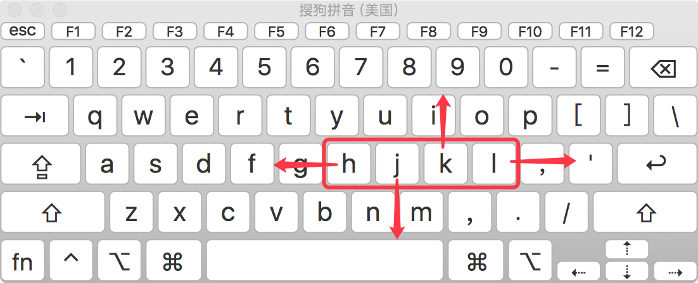

# vim 编辑器

---

[TOC]

<!-- toc -->

---

## vim简介

`vi` 是 `Visual interface` 的简称，是 `Linux` 中 **最经典** 的文本编辑器

`vim` 即vi improved,是从 `vi` 发展出来的一个文本编辑器，支持 **代码补全**、**编译** 及 **错误跳转** 等方便编程的功能特别丰富，在程序员中被广泛使用，被称为 **编辑器之神**，和Emacs并列成为类Unix系统用户最喜欢的编辑器。

`vim` 的特点：
- **没有图形界面** 的编辑器
- 只能是编辑 **文本内容**，不能对字体、段落进行排版
- **不支持鼠标操作**
- **没有菜单**
- **只有命令**
- 在使用 `vi` 命令时，注意 **关闭中文输入法**

## Vim打开文件

| 命令                              | 功能                                                   |
| --------------------------------- | ------------------------------------------------------ |
| vim 文件路径                      | 打开文件，并且将光标移动到首行，如果文件不存在，则新建 |
| vim 文件的路径 +行号              | 打开文件，并且将光标移动到**指定行号**位置             |
| vim 文件的路径 +                  | 打开文件，并且将光标移动到**最后一行**                 |
| vim 文件的路径 +/关键词           | 打开文件，并且**高亮**显示**搜索关键词**               |
| vim 文件的路径 -r                 | 在上次vim编辑时崩溃，恢复编辑                          |
| vim 文件路径1 文件路径2 文件路径3 | 同时打开多个文件，依次编辑                             |

`vim password.txt +/login`  # 高亮显示==login==字符

vim打开文件，如果文件不存在，则会新建一个文件

### 异常退出处理

什么是异常退出：在编辑文件之后并没有正常的去wq（保存退出），而是遇到突然关闭终端或者断电的情况，则会显示下面的效果，这个情况称之为异常退出


如果 `vi` 异常退出，在磁盘上会生成隐藏的`xxx.swp`**交换文件**（在编程过程中产生的临时文件）,下次再使用 `vi` 编辑该文件时，会看到以下屏幕信息

解决办法：根据提示按下字母 `d` 可以 删除交换文件 或者 手动`rm .xxx.swp`**删除隐藏的交换文件**即可

```
rm -f .xxx.swp  # 删除隐藏的交换文件
```

## vim 三种模式

`vi` 有三种基本工作模式：

1. **命令模式** —— 执行**定位**、**翻页**、**复制**、**粘贴**、**删除**……
   - 打开文件后默认进入命令模式，是使用vim的**入口**
   - 通过命令对文件进行常规的编辑操作，例如：**定位**、**翻页**、**复制**、**粘贴**、**删除**……
2. **末行模式** —— 执行 **保存**、**退出**、 搜索、替换、撤销、高亮等操作 
   - 要退出 vim 返回到控制台，需要在末行模式下输入命令
   - 末行模式是 vim 的**出口**
3. **编辑模式** —— 正常的编辑文字


## 命令模式

实现**光标移动，复制，粘贴，删除**

### 1. 光标移动

#### 上、下、左、右

| 快捷键              | 功能             | 手指   |
| ------------------- | ---------------- | ------ |
| h 或 (←)      3h    | 左移     左移3格 | 食指   |
| j 或 (↓)         3j | 下移     下移3行 | 食指   |
| k 或 (↑)        3k  | 上移     上移3行 | 中指   |
| l 或(→)        3l   | 右移     右移3格 | 无名指 |
| Space               | 光标右移一个字符 |        |
| Backspace           | 光标左移一个字符 |        |
| Enter               | 光标下移一行     |        |



==hjkl== 是排列在**一行**的，因此可以使用这四个按钮来移动光标。 

在命令模式下，先输入一个**数字**，再跟上一个**命令**，可以让该命令 **重复执行指定次数** 

> `3h`向左移动 3 
> `3j`向下移动 3 行
> `3k` 向上移动 3行
> `3l`向右移动 3 

####  行内移动

|  命令   | 英文 | 功能                                                         |
| :-----: | :--: | ------------------------------------------------------------ |
|    h    |      | 向前移动一个**字符**                                         |
|    l    |      | 向后移动一个**字符**                                         |
| ==`w`== | word | 向**前**移动一个**单词**(在单词==**开头**==)                 |
| ==`b`== | back | 向**后**移动一个**单词**(在单词==**开头**==)                 |
| ==`e`== | end  | 移到当前单词的末尾(==词尾==)，或向**后**移动一个**单词**(在单词==末尾==)(与w区别) |
|   `0`   |      | 行首次行开头，不论是否有字符                                 |
|  `^ `   |      | ~~行首~~第一个**字符**的位置                                 |
|   `$`   |      | ~~行尾~~最后一个**字符**的位置                               |

> 3**w**        # 前移 3 个单词
> **dw**        # 删除前一个单词
> **db**        # 删除后一个单词

####  行数移动

|       命令       |   英文    | 功能                    |
| :--------------: | :-------: | ----------------------- |
|     ==`gg`==     |   gogo    | 到文档第一行            |
|     ==`G`==      |    Go     | 移动到文档最后一行      |
|        3-        |  ==3k==   | 上跳3行                 |
|        3+        |  ==3j==   | 下跳3行(同下)           |
|   ~~8<Enter>~~   |           | 下跳8行(连续跳8个Enter) |
| ~~:行号<Enter>~~ |           | 跳到指定行号(作用同下)  |
|    ~~行号G~~     |           | 跳到指定行号(作用同下)  |
|    ==行号gg==    | **123gg** | 跳到指定行号            |

> `:行号11` 移动光标到**行号**为11的行
> `11gg` 移动光标到**行号**为11的行,最快

#### 查找字符移动

|  命令   | 功能                 |
| :-----: | -------------------- |
| ==`f`== | 向**前**查找**字母** |
| ==`F`== | 向后查找字母         |

> fx    向前查找字符 x

#### 屏幕内移动

|  命令   |  英文  | 功能                 |
| :-----: | :----: | -------------------- |
|    H    |  Head  | 光标移至屏幕顶部     |
|    M    | Middle | 光标移至屏幕中间     |
| ==`L`== |  Low   | 光标移至**屏幕底**部 |

####   段落移动

`vi` 中使用 **空行** 来区分**段落**

|  命令   | 功能             |
| :-----: | ---------------- |
| ==`{`== | 上一段(空行分隔) |
| ==`}`== | 下一段(空行分隔) |

`vi` 中使用 **. ** 来区分**句子**

|  命令   | 功能              |
| :-----: | ----------------- |
| ==`(`== | 上一句子( . 分隔) |
| ==`)`== | 下一句子( . 分隔) |

####  括号间切换

在程序世界中，`()`、`[]`、`{}` 使用频率很高，而且 **都是成对出现的**

|    命令     | 功能                     |
| :---------: | ------------------------ |
| ==**`%`**== | 光标切换到**括号**另一半 |

括号自动匹配高亮`()`、`[]`、`{}` 

#### 翻屏

|      命令      |   英文   | 功能                   |
| :------------: | :------: | ---------------------- |
| ==`Ctrl + u`== |  **up**  | 向上翻屏（**上半屏**） |
| ==`Ctrl + d`== | **down** | 向下翻屏（**下半屏**） |
|    Ctrl + b    |   back   | 向上翻屏（整屏）       |
|    Ctrl + f    | forward  | 向下翻屏（整屏）       |


### 2. 插入文本

`i a o I A O ` 进入编辑模式 

|  命令   |  英文  | 功能                       |
| :-----: | :----: | -------------------------- |
| ==`i`== | insert | 在当前**字符前**插入文本   |
| ==`a`== | append | 在当前**字符后**追加文本   |
| ==`I`== |        | 在**行首**插入文本         |
| ==`A`== |        | 在**行尾**追加文本         |
| ==`o`== |  over  | 在当前行**下面插入一空行** |
| ==`O`== |        | 在当前行**上面**插入一空行 |

i(insert)插入，a(append)追加，o(over)空行，小写表示下，大写表示上


### 3. 选中文本

在 vim 中要选择文本，需要先使用Visual命令切换到 **可视模式**

vim中提供了 **三种** 可视模式，可以方便程序员选择 **选中文本的方式**

|     命令     | 模式       | 功能                           |
| :----------: | ---------- | ------------------------------ |
|   ==`v`==    | 可视模式   | 选中光标**经过**的单个==字符== |
|   ==`V`==    | 可视行模式 | 选中光标经过的**==整行==**     |
| ~~Ctrl + v~~ | 可视块模式 | 垂直方向选中文本               |
|   **ggVG**   |            | 选中**全文**                   |

**可视模式**下，可以和 **移动命令** 连用，例如：`ggVG` 能够选中所有内容

> **注销多行代码**：**`Ctrl + V`** 选中多行代码，==**`I`**== 在选中的行首插入 //

按 `ESC` 可以**放弃选中**，返回到 **命令模式**

### 4. 复制

| 快捷键   |                                                      |
| -------- | ---------------------------------------------------- |
| ==`y`==  | 复制**选中**                                         |
| ==`yw`== | 向前**复制**一个**单词**，复制从光标开始到词尾的字符 |
| ==`yb`== | 向后复制一个单词                                     |
| 3yw  y3w | 复制从光标开始的3个单词                              |
| y^       | 复制从光标到行首的内容                               |
| y$       | 复制从光标到行尾的内容                               |
| ==`yy`== | 复制光标所在**整行**                                 |
| 3yy      | 向下复制 3 行                                        |

`数字yy` 以光标所在行为准（包含当前行），向下复制指定的行数

在想要粘贴的地方按下`p`键粘贴

### 5. 粘贴

| 快捷键         |                                                              |
| -------------- | ------------------------------------------------------------ |
| ==`p`==        | 粘贴paste，粘贴在当前**光标后**（append）                    |
| ==`P`==        | 粘贴在**光标前**，（insert）                                 |
| ==`Ctrl + ;`== | 在编辑模式，调出 ==Fcitx== 的剪贴板==粘贴==(实现vim粘贴系统粘贴板复制的内容) |

注意: vim 中的 **文本缓冲区** 和系统的 **剪贴板** 不是同一个,所以在其他软件中使用 `CTRL + C` 复制的内容，不能在 vim 中通过 `P` 命令粘贴, 可以在 **编辑模式** 下使用 **鼠标右键粘贴**，或者==`Ctrl + ;`==调出 ==Fcitx== 的剪贴板实现vim粘贴系统粘贴板复制的内容

### 6. 剪切/删除

|    命令     |   英文    | 功能                           |
| :---------: | :-------: | ------------------------------ |
|   ==`x`==   |  Delete   | **Delete** 删除光标所在字符    |
|     3x      |           | 删除3个字符                    |
|   ==`X`==   | Backspace | **Backspace** 删除光标左边字符 |
|   ==`d`==   |  delete   | 删除**==选中==**内容           |
|  ==`dd`==   |           | 删除光标所在**整行**           |
|     3dd     |           | 删除 3 行                      |
|  ==`dw`==   |  d+**w**  | ==删除==前一个==单词==         |
|  3dw  d3w   |           | 删除前3个单词                  |
|  ==`db`==   |    d+b    | ==删除==后一个==单词==         |
|   **de**    |    d+e    | 删除后一个单词（到词尾）       |
|  ==`d0`==   |    d+0    | 删除至**行首**                 |
|  ==`d$`==   |     D     | 删除至**行尾**                 |
| ==d行号gg== |   d25gg   | 删除到指定**行号**             |
|     d3h     |           | 删除左3字符                    |
|     d3l     |           | 右3                            |
|     d3j     |           | 下3                            |
|     d3k     |           | 上3                            |

> 提示：如果使用 **可视模式** 已经选中了一段文本，那么无论使用 `d` 还是 `x`，都可以删除选中文本

删除命令可以和 **移动命令** 连用，以下是常见的组合命令：

> dw        	# 删除后一个单词
> db        	# 删除前一个单词
> d0     	# 删除到行首
> d}      	# 从光标位置删除到段落结尾
> 8dd  	# 从光标位置向下连续删除 8 行
> d行号gg   # 从光标所在行 删除到 指定代码行 之间的所有代码
> d'a       	# 从光标所在行 删除到 标记a 之间的所有代码

### 7. 查找字符

|  命令   | 功能                           |
| :-----: | ------------------------------ |
| ==`f`== | 向前查找**字母**，跳到字母位置 |
| ==`F`== | 向后查找字母                   |

> fx    向前查找字符 x

### 8. 替换字符

|  命令   |  英文   | 功能                           |
| :-----: | :-----: | ------------------------------ |
| ==`r`== | replace | 替换**当前字符**               |
| ==`R`== | replace | 替换当前行光标**后的所有字符** |

`R` 命令可以进入 **替换模式**，替换完成后，按下 `ESC` 可以回到 **命令模式**

**替换命令** 的作用就是不用进入 **编辑模式**，对文件进行 **轻量级的修改**

### 9. 修改内容

|   命令   |    英文    | 功能                                                         |
| :------: | :--------: | ------------------------------------------------------------ |
|    c     | ==change== |                                                              |
|   `ch`   |            | 修改右边一个字符（删除右边字符，并进入编辑模式）             |
|   `cl`   |    dli     | 修改右边一个字符（删除右边字符，并进入编辑模式）             |
| ==`cw`== |    dwi     | **修改前**一个**单词**（删除前一个单词，并进入**编辑模式**） |
|   `cb`   |    dbi     | 修改后一个单词（删除后一个单词，并进入编辑模式）             |
| ==`c$`== |    d$i     | 修改到**行尾**（删除到行尾，并进入编辑模式）                 |
| ==`cc`== |    ddi     | 修改**整行**（删除当前行，并进入编辑模式）                   |
|   ncw    |    ndwi    | 修改指定数目n个单词（删除n个单词，并进入编辑模式）           |
|    nC    |    nddi    | 修改指定数目的行（删除n行，并进入编辑模式）                  |
|  ~~s~~   |            | 删除当前字符，并进入编辑模式                                 |
|  ~~S~~   |            | 删除当前行，并进入编辑模式                                   |


### 10. 撤销/恢复

| 快捷键         |                            |
| -------------- | -------------------------- |
| ==`u`==        | 撤销操作：	（undo）     |
| ==`Ctrl + r`== | 恢复操作：       (restore) |
| U              | 撤销对**该行**的所有操作   |

### 11. 缩进/合并

|   命令   | 功能                                                         |
| :------: | ------------------------------------------------------------ |
| ==`>>`== | **单行**向右增加缩进                                         |
|   `<<`   | 单行向左减少缩进                                             |
| ==`>`==  | 先可视化v**选中行**,右缩进                                   |
|    <     | 先可视化v选中行,左缩进                                       |
| ==`.`==  | 重复上次缩进                                                 |
| ==`J`==  | 删除行尾的换行符，下一行接上来，**合并**光标所在行及下一行为一行 |

**缩进命令** 在开发程序时，**统一增加代码的缩进** 

在 **可视模式** 下，缩进命令只需要使用 **一个** `>` 或者 `<` 

**注销多行代码**：
**`Ctrl + V`** 选中多行代码，==**`I`**== 在选中的行首插入 //

### 12. 重复上次命令

|  命令   | 功能             |
| :-----: | ---------------- |
| ==`.`== | 重复上次操作命令 |

### 格式化代码

格式化代码=自动缩进

| 命令       | 功能                     |
| ---------- | ------------------------ |
| ==`gg=G`== | 自动缩进全文，格式化全文 |
| ==` ==`==  | 自动缩进当前行           |

### 查看man

| 命令                  | 功能                      |
| --------------------- | ------------------------- |
| ==`shift+k`== / ==K== | 查看光标所在命令的man手册 |

将光标移动到需要查找帮助的关键字上，按下K，就可以查看光标所在命令的man手册

### 13. 书签标记

使用 `m` 增加一个标记，可以在需要时快速地**定位**跳转回来 

**标记名称** 可以是 `a~z` 或者 `A~Z` 之间的任意 一个 **字母**

添加了标记的 行如果被删除，标记同时被删除

如果 在其他行添加了相同名称的标记，之前添加的标记也会被替换掉

|   命令   | 英文 | 功能                                             |
| :------: | :--: | ------------------------------------------------ |
| `m[a~Z]` | mark | 添加标记，标记号是 a~z 或 A~Z 之间的任意一个字母 |
|    'a    |  ‘   | 直接定位到标记 a 所在位置                        |

### 14. 宏

| 命令   | 功能                                                         |
| ------ | ------------------------------------------------------------ |
| q[a~Z] | 开始记录当前开始的操作为宏，名称可为[a~Z]，然后用q终止录制宏 |
| reg    | 显示当前定义的所有的宏，用@[a~Z]来在当前光标处执行宏[a-Z]    |


## 末行模式

**进入方式**：输入 **:** 或者 **/**（表示查找）

**退出方式**：连按 **2** 次`Esc`键
		  按下`Esc`,(延迟1s)
		  ~~删除末行全部输入字符~~

### 1. 搜索/查找

|     命令      | 功能                   |
| :-----------: | ---------------------- |
| ==`/关键词`== | 向下查找==搜索==关键词 |
|    ?关键词    | 向上查找关键词         |

查找到指定内容之后，使用`n` Next查找下一个出现的位置：

- `n`: 查找**下一个**
- `N`: 查找**上一个**

设置高亮显示搜索 ==`:set hls`==
关闭高亮显示搜索 ==`:set nohls`==

如果不想看到高亮显示，可以随便查找一个文件中不存在的内容即可,或者关闭高亮显示搜索`:set nohls`【no highlight search】

### 2. *查找当前单词

|  命令   | 功能                                 |
| :-----: | ------------------------------------ |
| ==`*`== | **向下**查找当前**光标**所在**单词** |
|    #    | 向前查找当前光标所在单词             |

- `n`: 查找**下一个**
- `N`: 查找**上一个**

### 3. 查找并替换

记忆命令格式：

```
:%s/old/new/gc
```

| 命令                       | 功能                                   |
| -------------------------- | -------------------------------------- |
| :s/旧文本/新文本           | 选中范围**只**替换**每行第一处**文本   |
| :s/旧文本/新文本/g         | 选中范围替换,直接替换                  |
| :s/旧文本/新文本/gc        | **选中范围**全部替换，提示确认         |
| ==:2,9s/旧文本/新文本/gc== | 在 2 到 9 行内全部替换(包括端点)       |
| :%s/旧文本/新文本          | 整个文档中**只**替换**每行第一处**文本 |
| :%s/旧文本/新文本/g        | 整个文档全局替换                       |
| ==`:%s/旧文本/新文本/gc`== | 整个文档==**全局**==替换，提示确认     |

`s` (search )搜索
`%`表示整个文件
`g` (global)全局（全部）
`c` (confime)确认

> **确认提示:**
> `y` - `yes` 替换
> `n` - `no` 不替换
> `a` - `all` 替换所有
> `q` - `quit` 退出替换
> `l` - `last` 最后一个，并把光标移动到行首
> `^E` 向下滚屏
> `^Y` 向上滚屏

#### 全局替换

一次性**替换文件中的 **所有出现的旧文本

```
:%s/旧文本/新文本  # 全文只替换每行第一处文本
:%s/旧文本/新文本/g  # 全文替换,直接替换
:%s/旧文本/新文本/gc  # 全文替换,每次确认
```

####  选中域替换

**先选中** 要替换文字的 **范围**

```
:s/旧文本/新文本  # 选中范围只替换每行第一处文本
:s/旧文本/新文本/g  # 选中范围替换,直接替换
:s/旧文本/新文本/gc  # 选中范围替换,每次确认
```

`:'<,'>` 自带开头

#### 指定行内替换

在 2 到 9 行内进行替换(包括端点)

```
:2,9s/旧文本/新文本/gc  # 在2到9行内进行替换(包括端点)，直接替换
:2,9s/旧文本/新文本/gc  # 在2到9行内进行替换(包括端点)，每次确认
```

#### 确认替换

如果把末尾的 `g` 改成 `gc` 在替换的时候，会有提示！**推荐使用！**

```
:%s/旧文本/新文本/gc  # 全局替换，每次确认
:s/旧文本/新文本/gc  # 选中范围替换，每次确认
```

`g` global 全局（全部）
`c` confime 确认

### 4. 文件操作

|           命令            | 英文  | 功能                                                |
| :-----------------------: | :---: | --------------------------------------------------- |
| ==`:n1,n2 write temp.c`== |       | 将n1行到n2行之间的内容写到temp.c文件中              |
|    ==`:write file.c`==    |       | 将整个文件的内容写到file.c文件中                    |
|    ==`:read file.c`==     |       | 将file.c文件的内容插入到当前光标所在行的下面        |
|        ==`:e .`==         | edit  | 浏览要当前目录下的文件,上下选择,Enter可**打开**文件 |
|        :e filename        |       | 打开filename文件编辑                                |
|         ==`:e!`==         |       | 放弃修改文件内容，重新载入该文件编辑                |
|         :n 文件名         |  new  | **新建文件**                                        |
|         :w 文件名         | write | **另存为**，但是仍然编辑当前文件，并不会切换文件    |
|       ==`:files`==        |       | 查看当前已经打开的文件名称                          |
|  :open 已经打开的文件名   |       | 切换到已经打开的文件名                              |

切换文件之前，必须保证当前这个文件已经被保存！

> ##### 1. 当前文件
>
> 使用vim同时打开多个文件，在末行模式下进行切换文件
> 查看当前已经打开的文件名称：“:files”
>
> ```
> :files  # 查看当前已经打开的文件名称
> ```
>
> 在%a的位置有2种显示可能
> `%a`：a=**active**，表示当前正在打开的文件；
> `#`：表示上一个打开的文件
>
> ##### 2. 切换文件
>
> 如果需要指定切换文件的名称，则可以输入：“:open 已经打开的文件名”
>
> ```
> :open 已经打开的文件名  # 切换到已经打开的文件名
> ```
>
> 可以通过其他命令来切换上一个文件/下一个文件
>
> ```
> :bn  # 切换到下一个文件（back next）
> :bp  # 切换到上一个文件（back previous）
> ```
>
> 连按**2**次`esc`键,退出末行模式


### 5. :X 加密/解密文件

| 命令     | 功能                         |
| -------- | ---------------------------- |
| ==`:X`== | 大写X ,两次输入密码,进行加密 |

必须==:wq==保存才能生效(Ctrl+zz不行)

### 6. 保存退出

| 快捷键           | 功能                                                         |
| ---------------- | ------------------------------------------------------------ |
| :w               | 保存（write）                                                |
| :w  路径         | 另存为                                                       |
| :q               | 退出（quit）                                                 |
| ==`:wq`==        | 保存并退出                                                   |
| ==`:q!`==        | 强制退出，不做保存                                           |
| **:x**           | 保存并退出(文件没有修改则直接退出，文件被修改保存并退出)     |
| ==`Shift + zz`== | 等价`:x`保存并退出(文件没有修改则直接退出，文件被修改保存并退出) |

当没有权限修改文件时，无法保存修改

### 7. 临时调用外部命令:!

==`:!外部bash命令`==，临时调用外部bash命令

| 快捷键                 | 功能                                                         |
| ---------------------- | ------------------------------------------------------------ |
| ==`:!外部bash命令`==   | 临时调用外部bash命令                                         |
| :!ls                   | 临时调用外部bash命令`ls`查看文件目录                         |
| ==`:r !外部bash命令`== | 将shell命令command的**输出**结果**插入**到当前行的下一行     |
| :r !date               | 读取系统时间并插入到当前行的下一行                           |
| :n1 !command           | 将n1行的内容输入到shell命令command处理，<br />并将处理结果替换n1行之后的内容，**修改内容** |
| `. !tr [a-z][A-Z]`     | 将当前行的小写转为大写                                       |
| :n1,n2 !command        | 将n1行到n2行之间的内容输入到shell命令command处理，<br />并将处理结果替换1行到n2行之间的内容 |
| :62,72 !sort           | 将62行到72行的内容进行排序,改变当前编辑的文件的内容          |
| :w !command            | 将**整个文件内容**作为command的输入并执行                    |
| :n1,n2 w !command      | 将n1行到n2行之间的内容作为command的输入并执行， <br />不会改变当前编辑的文件的内容 |
| :62,72 w !sort         | 将62行到72行的内容进行排序，<br />而不改变当前编辑的文件的内容，而是显示在vim敲命令的区域 |
| ==` :62 w !bash`==     | 将会把第62行的内容作为bash命令来执行并显示结果，而**不改变**当前编辑的文件的内容 |
| ==`:. w !bash`==       | 将**当前行**的内容作为**bash命令**来执行 ，而**不改变**当前编辑的文件的内容 |
| ==`:w !bash`==         | 将**整个文件**的内容作为**bash命令**来执行，而**不改变**当前编辑的文件的内容 |

> r   插入到当前行的下一行
> w  不改变当前编辑的文件的内容
> .    当前行

> :!ls -lah  临时调用外部bash命令`ls`查看文件目录 
>
> :!date    命令行显示日期，不修改
> :r !date  插入到下一行
> :w !date  命令行显示日期，不修改
>
> :!bash    无法执行当前脚本
> :r !bash   无法执行当前脚本
> :w !bash  执行当前脚本，不修改
>
> :2 !bash    执行第二行，修改
> :2 w !bash    执行第二行，不修改

### 8. 行操作

| 命令               | 功能                                     |
| ------------------ | ---------------------------------------- |
| :n1,n2 co n3       | 将n1行到n2行之间的内容**拷贝**到 n3 行下 |
| ==`:n1,n2 mv n3`== | 将n1行到n2行之间的内容**移动**到 n3 行下 |
| ==`:n1,n2 d`==     | 将n1行到n2行之间的内容**删除**           |

若不指定n1,n2，则将**整个文件内容**作为command的输入


### 9. 分屏命令

使用分屏命令，可以同时编辑和查看多个文件

|        命令        |      英文      | 功能         |
| :----------------: | :------------: | ------------ |
| ==`:sp [文件名]`== |     split      | 横向增加分屏 |
|  `:vsp [文件名]`   | vertical split | 纵向增加分屏 |
|    ==`:close`==    |                | 关闭当前窗口 |

#### 1) 切换分屏窗口

> 分屏窗口都是基于 `CTRL + W` 这个快捷键的，`w` 对应的英文单词是 `window`

|        命令        |  英文   | 功能                                        |
| :----------------: | :-----: | ------------------------------------------- |
| Ctrl + w + ==`w`== | window  | **切换**到下一个窗口                        |
|   Ctrl + w + `r`   | reverse | 互换窗口                                    |
| Ctrl + w + ==`c`== |  close  | **关闭**当前窗口，但是不能关闭最后一个窗口  |
|   Ctrl + w + `q`   |  quit   | 退出当前窗口，如果是最后一个窗口，则关闭 vi |
|   Ctrl + w + `o`   |  other  | 关闭其他窗口                                |

#### 2) 调整窗口大小

> 分屏窗口都是基于 `CTRL + W` 这个快捷键的，`w` 对应的英文单词是 `window`

|      命令      | 功能         |
| :------------: | ------------ |
|  Ctrl + w + +  | 增加窗口高度 |
|  Ctrl + w + -  | 减少窗口高度 |
|  Ctrl + w + >  | 增加窗口宽度 |
|  Ctrl + w + <  | 减少窗口宽度 |
| Ctrl + w + `=` | 等分窗口大小 |

> 调整窗口宽高的命令可以和数字连用，例如：`5 CTRL + W +` 连续 5 次增加高度

### 10. :help帮助命令

```
:help    # 查看整个帮助
:help xxx    # 查看xxx帮助
```

### 11. vim配置

#### 7. 忽略大小写

```
:set ignorecase    # 忽略大小写查找
:set noignorecase    # 区分大小写查找
```

#### 8. :set hls 高亮搜索结果

```
:set hls    # 高亮搜索结果【highlight search】
:set nohls    # 关闭高亮搜索结果
```

#### 9. :set nu 显示行号

```
:set nu  # 显示行号 number
:set nonu  # 不显示行号 no number
```

#### 10. :syntax 语法着色显示

```
:syntax on  # 显示语法着色 (syntax：语法)
:syntax off  # 关闭着色显示
```


## 编辑模式

### 1. 进入编辑模式

`i a o I A O ` 进入编辑模式 

`Esc`  退出编辑模式

在 `vi` 中除了常用的 `i` 进入 **编辑模式** 外，还提供了以下命令同样可以进入编辑模式：

|  命令   |  英文  | 功能                       |
| :-----: | :----: | -------------------------- |
| ==`i`== | insert | 在当前**字符前**插入文本   |
| ==`a`== | append | 在当前**字符后**追加文本   |
| ==`I`== |        | 在**行首**插入文本         |
| ==`A`== |        | 在**行尾**追加文本         |
| ==`o`== |  over  | 在当前行**下面插入一空行** |
| ==`O`== |        | 在当前行**上面**插入一空行 |

i(insert)插入，a(append)追加，o(over)空行，小写表示下，大写表示上


### 2. vim代码提示

| 编辑模式下代码提示 | 功能                 |
| ------------------ | -------------------- |
| ==`Ctrl + n`==     | 编辑模式下，代码提示 |

### 3. vim多行注释代码

| 编辑模式下注释代码 | 功能               |
| ------------------ | ------------------ |
| ==`:normal i #`==  | 选中区域行首插入 # |
| ==`:normal d #`==  | 选中区域行首删除 # |

`V`选中多行代码，同时插入#

### 4. vim中计算器的使用

在编辑文件的时，可以临时使用计算器。

| 编辑模式下代码提示 | 功能               |
| ------------------ | ------------------ |
| ==`Ctrl + r + =`== | 编辑模式下，计算器 |

> 1. 进入编辑模式
> 2. 按下`ctrl + r`，然后输入`=`，此时光标会变到最后一行
> 3. 输入需要计算的内容，按下回车


## 常用命令速查图


## vim的配置

Vim是一款编辑器，编辑器也是有配置文件的。
Vim配置有三种情况：
	a. 在文件打开的时候在末行模式下输入的配置（临时的）
	b. 个人配置文件**~/.vimrc**，(如果没有可以自行新建touch ~/.vimrc）**家目录下的配置文件优先级更高**
	c. 全局配置文件（vim自带，/etc/vimrc）

`vimrc` 是 `vim` 的配置文件，可以设置 vim 的配置，包括：**热键**、**配色**、**语法高亮**、**插件** 等

`vim ~/.vimrc`编辑个人配置文件,在配置文件中进行配置,比如显示行号`:set nu`,配置好之后vim打开文件就会永远显示行号

```
~/.vimrc  # 个人配置文件(如果没有可以自行新建）
/etc/vim/vimrc  # 全局配置文件
```

> " # 显示行号
> :set nu    
> “ # 显示语法着色
> :syntax on    
> ” # 高亮搜索结果
> :set hlsearch    
> “ # 忽略大小写查找
> :set ignorecase    

- 常用的插件有：

  - 代码补全
  - 代码折叠
  - 搜索
  - Git 集成
  - ……

  
